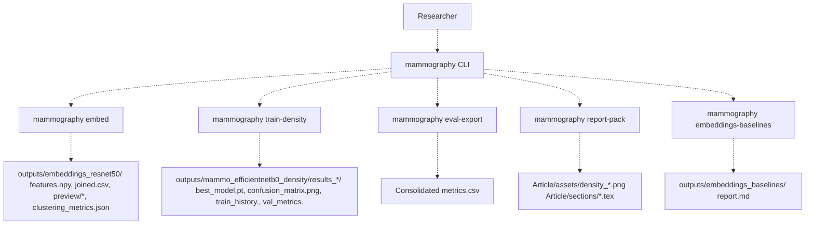
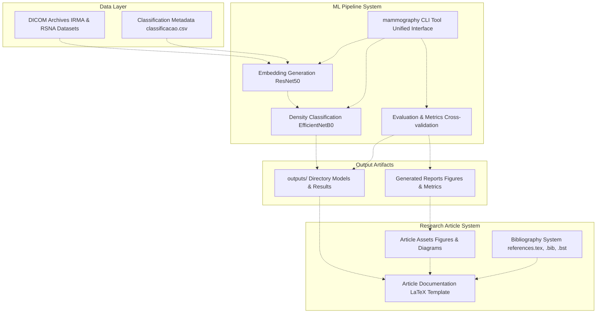
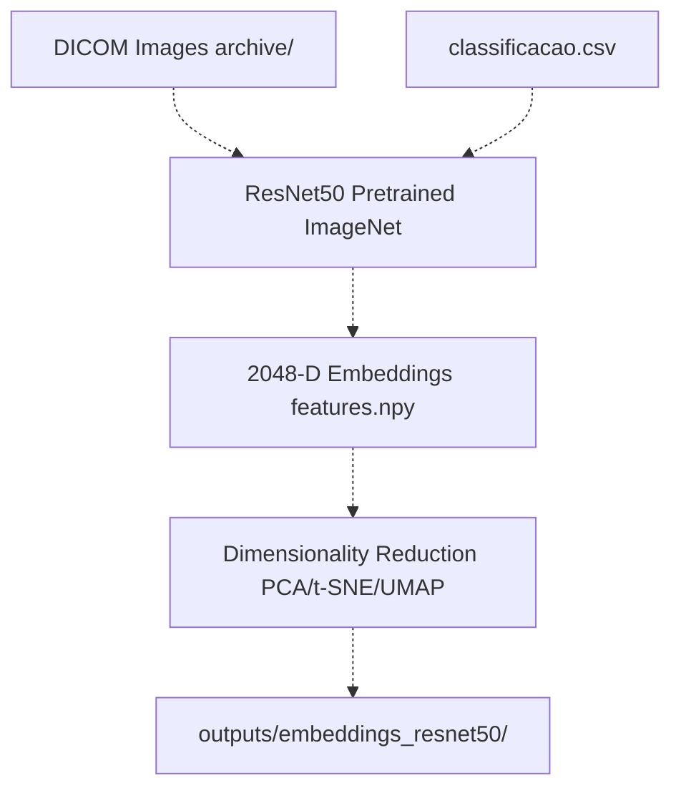
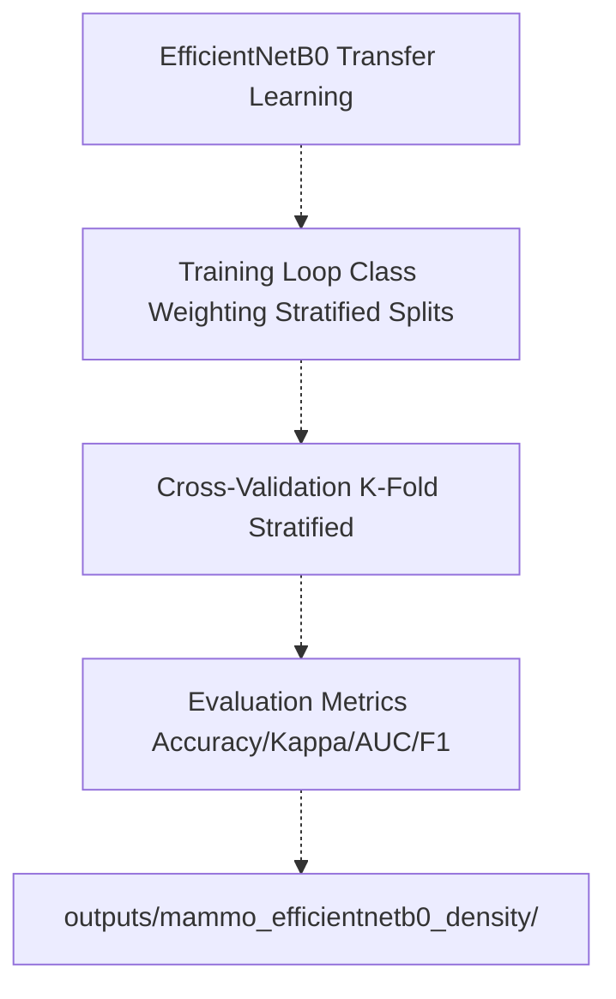
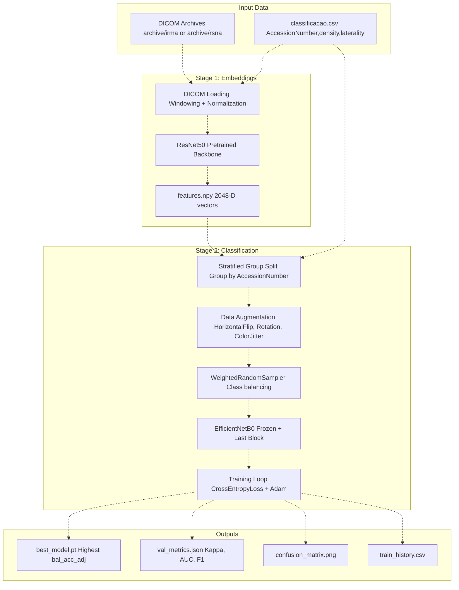
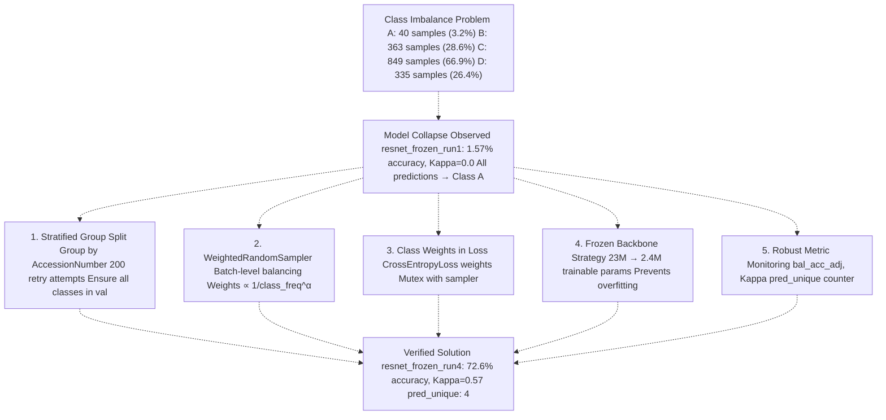

# Overview

> **Relevant source files**
> * [Article/article.md](https://github.com/ThalesMMS/mammography-pipelines/blob/01443313/Article/article.md)
> * [Article/assets/pipeline_overview.png](https://github.com/ThalesMMS/mammography-pipelines/blob/01443313/Article/assets/pipeline_overview.png)
> * [Article/chapters/01-introducao.tex](https://github.com/ThalesMMS/mammography-pipelines/blob/01443313/Article/chapters/01-introducao.tex)

## Purpose and Scope

The **mammography-pipelines** repository is a research project for automated breast density classification using deep learning. It implements a two-stage machine learning pipeline: (1) embedding extraction with ResNet50, and (2) density classification with EfficientNetB0. The system provides the `mammography` command-line interface for training models, extracting features, evaluating results, and generating research documentation.

This overview introduces the system architecture, the `mammography` CLI tool, the two-stage pipeline design, and integration with LaTeX article generation. For installation and first steps, see [Getting Started](1a%20Getting-Started.md). For directory organization, see [Repository Structure](1b%20Repository-Structure.md). For BI-RADS classification and transfer learning concepts, see [Key Concepts](1c%20Key-Concepts.md).

**Sources:** [Article/article.md L1-L28](https://github.com/ThalesMMS/mammography-pipelines/blob/01443313/Article/article.md#L1-L28)

 [.gitignore L1-L212](https://github.com/ThalesMMS/mammography-pipelines/blob/01443313/.gitignore#L1-L212)

---

## System Purpose

The system addresses the clinical need for standardized, automated breast density assessment. Manual BI-RADS density classification suffers from high inter-observer variability. This research pipeline uses transfer learning with pre-trained CNNs to classify mammographic images into four density categories:

| BI-RADS Category | Description | Fibroglandular Tissue |
| --- | --- | --- |
| **A** | Almost entirely fatty | < 25% |
| **B** | Scattered fibroglandular densities | 25-50% |
| **C** | Heterogeneously dense | 51-75% |
| **D** | Extremely dense | > 75% |

The best model achieved **72.6% accuracy**, **0.57 Cohen's Kappa**, and **0.88 AUC** on 4-class classification using the IRMA dataset with frozen backbone strategy. Binary classification (AB vs CD) reaches **93.47% accuracy**, making it suitable for clinical triaging.

**Sources:** [Article/article.md L13-L28](https://github.com/ThalesMMS/mammography-pipelines/blob/01443313/Article/article.md#L13-L28)

 [Article/article.md L145-L166](https://github.com/ThalesMMS/mammography-pipelines/blob/01443313/Article/article.md#L145-L166)

---

## System Capabilities

The pipeline provides five primary workflows through the `mammography` CLI:

| Workflow | CLI Command | Purpose | Output Artifacts |
| --- | --- | --- | --- |
| **Embedding Extraction** | `embed` | Extract ResNet50 embeddings with dimensionality reduction | `features.npy`, `joined.csv`, PCA/t-SNE/UMAP plots |
| **Density Classification** | `train-density` | Train EfficientNetB0 for BI-RADS classification | `best_model.pt`, confusion matrices, Grad-CAM |
| **Metrics Export** | `eval-export` | Consolidate metrics from completed runs | Aggregated CSV with all experiments |
| **Report Packing** | `report-pack` | Sync ML outputs to LaTeX article assets | `Article/assets/*.png`, updated `.tex` files |
| **Baseline Comparison** | `embeddings-baselines` | Compare embeddings vs classical descriptors | `report.md` with comparative analysis |

The system follows a two-stage architecture: first extract reusable embeddings, then train classifiers on top of them.

**Sources:** [Article/article.md L94-L125](https://github.com/ThalesMMS/mammography-pipelines/blob/01443313/Article/article.md#L94-L125)

 [Article/chapters/01-introducao.tex L14-L27](https://github.com/ThalesMMS/mammography-pipelines/blob/01443313/Article/chapters/01-introducao.tex#L14-L27)

---

## Entry Points and Interfaces

### Primary Entry Point: mammography CLI

The system is accessed through the `mammography` command-line tool:

```
mammography [command] [options]
```

Available commands orchestrate different aspects of the research pipeline:

* **`mammography embed`**: Extract ResNet50 embeddings from DICOM archives
* **`mammography train-density`**: Train EfficientNetB0 for density classification
* **`mammography eval-export`**: Export consolidated metrics from experiment runs
* **`mammography report-pack`**: Package results into article assets
* **`mammography embeddings-baselines`**: Compare embedding approaches

**CLI Architecture Diagram**



Each command accepts configuration via CLI arguments and produces structured outputs in the `outputs/` directory. The `report-pack` command bridges ML outputs to the LaTeX article system.

**Sources:** [Article/article.md L94-L125](https://github.com/ThalesMMS/mammography-pipelines/blob/01443313/Article/article.md#L94-L125)

 [Article/chapters/01-introducao.tex L14-L16](https://github.com/ThalesMMS/mammography-pipelines/blob/01443313/Article/chapters/01-introducao.tex#L14-L16)

---

## System Architecture

The repository implements a two-stage machine learning pipeline with three major subsystems: ML Pipeline, Data Layer, and Article Documentation.

### High-Level System Structure



**Architecture Principles:**

1. **Two-Stage Pipeline**: Embedding extraction (Stage 1) produces reusable 2048-D feature vectors. Density classification (Stage 2) trains on these embeddings with optional fusion.
2. **Reproducibility Framework**: Each run produces `summary.json` (hyperparameters + git hash), `data_manifest.json` (data traceability), and complete execution logs.
3. **Automated Documentation**: The `report-pack` command synchronizes ML outputs with LaTeX article assets, ensuring documentation stays current.

**Sources:** [Article/article.md L94-L125](https://github.com/ThalesMMS/mammography-pipelines/blob/01443313/Article/article.md#L94-L125)

 [Article/chapters/01-introducao.tex L11-L16](https://github.com/ThalesMMS/mammography-pipelines/blob/01443313/Article/chapters/01-introducao.tex#L11-L16)

---

## Two-Stage Pipeline Architecture

The system implements a modular two-stage architecture where each stage can be developed and evaluated independently.

### Stage 1: Embedding Extraction (ResNet50)



The `mammography embed` command extracts deep features from mammographic images using a pretrained ResNet50 backbone. These 2048-dimensional embeddings serve as reusable representations for downstream tasks.

**Key outputs:**

* `features.npy`: Numpy array of shape (N, 2048)
* `joined.csv`: Metadata joined with embedding indices
* `preview/*.png`: PCA, t-SNE, UMAP visualizations
* `clustering_metrics.json`: Silhouette score, Davies-Bouldin index

### Stage 2: Density Classification (EfficientNetB0)



The `mammography train-density` command trains an EfficientNetB0 classifier with three transfer learning strategies: full fine-tuning, frozen backbone + last block, or frozen head only. The frozen + last block approach (2.4M trainable parameters vs 4M total) prevents overfitting while maintaining sufficient capacity.

**Key outputs:**

* `best_model.pt`: Checkpoint at highest validation metric
* `train_history.csv`: Loss and metrics per epoch
* `confusion_matrix.png`: Per-class performance visualization
* `gradcam/*.png`: Interpretability visualizations (optional)

**Sources:** [Article/article.md L51-L76](https://github.com/ThalesMMS/mammography-pipelines/blob/01443313/Article/article.md#L51-L76)

 [Article/article.md L94-L125](https://github.com/ThalesMMS/mammography-pipelines/blob/01443313/Article/article.md#L94-L125)

---

## Data Flow and Processing

### Complete Pipeline Data Flow



**Critical Processing Steps:**

1. **DICOM Preprocessing**: Applies windowing (default center=4000, width=8000), handles MONOCHROME1 inversion, and performs robust normalization using 1st-99th percentile scaling.
2. **Stratified Group Splitting**: Groups samples by `AccessionNumber` (patient identifier) to prevent data leakage, then performs stratified split maintaining class proportions. Uses up to 200 retry attempts to ensure all classes appear in validation set.
3. **Class Balancing**: Implements `WeightedRandomSampler` with weights inversely proportional to class frequency. Mutually exclusive with class weights in loss to avoid double compensation.
4. **Transfer Learning**: Three strategies evaluated: (a) full fine-tuning (23M params), (b) frozen backbone + last block (2.4M params), (c) frozen head only (8K params). Strategy (b) prevents model collapse while maintaining sufficient capacity.

**Sources:** [Article/article.md L77-L91](https://github.com/ThalesMMS/mammography-pipelines/blob/01443313/Article/article.md#L77-L91)

 [Article/article.md L94-L125](https://github.com/ThalesMMS/mammography-pipelines/blob/01443313/Article/article.md#L94-L125)

---

## Output Directory Structure

The system produces structured outputs organized by experiment type and run identifier:

### Directory Organization

```python
outputs/
├── embeddings_resnet50/                    # Stage 1: Embedding extraction
│   ├── features.npy                        # (N, 2048) embedding matrix
│   ├── joined.csv                          # Metadata with embedding indices
│   ├── preview/
│   │   ├── pca_2d.png                      # PCA projection
│   │   ├── tsne_2d.png                     # t-SNE projection
│   │   └── umap_2d.png                     # UMAP projection
│   └── clustering_metrics.json             # Silhouette, Davies-Bouldin
│
├── mammo_efficientnetb0_density/           # Stage 2: Density classification
│   ├── results_4/ (seed 42)
│   │   ├── best_model.pt                   # Checkpoint at highest metric
│   │   ├── summary.json                    # Hyperparams + git hash
│   │   ├── data_manifest.json              # Data traceability
│   │   ├── run.log                         # Complete execution log
│   │   ├── train_history.csv               # Loss/metrics per epoch
│   │   ├── val_metrics.json                # Best epoch metrics
│   │   └── confusion_matrix.png            # Per-class visualization
│   ├── results_5/ (seed 43)
│   ├── results_6/ (seed 44)
│   │
│   └── density_experiments/                # Cross-validation runs
│       └── results_k3_seed42/
│           ├── fold_1/results/
│           ├── fold_2/results/
│           ├── fold_3/results/
│           └── cv_summary.json             # Aggregated metrics ± σ
│
└── embeddings_baselines/                   # Baseline comparisons
    └── report.md                           # Comparative analysis
```

### Reproducibility Artifacts

Each experiment produces three key reproducibility artifacts:

| Artifact | Purpose | Key Fields |
| --- | --- | --- |
| **`summary.json`** | Links hyperparameters to code version | `git_hash`, `git_branch`, `model_arch`, `freeze_config` |
| **`data_manifest.json`** | Traces data sources and splits | `csv_path`, `dicom_root`, `train_ids`, `val_ids` |
| **`run.log`** | Complete execution trace | All stdout/stderr, timestamps, hardware info |

The `git_hash` field in `summary.json` enables exact code reproducibility by linking experiment results to specific commits.

**Sources:** [Article/article.md L94-L125](https://github.com/ThalesMMS/mammography-pipelines/blob/01443313/Article/article.md#L94-L125)

 [Article/chapters/01-introducao.tex L14-L16](https://github.com/ThalesMMS/mammography-pipelines/blob/01443313/Article/chapters/01-introducao.tex#L14-L16)

---

## Performance Summary

### Best Model Results by Configuration

| Configuration | Dataset | Classes | Accuracy | Kappa | AUC | Macro F1 |
| --- | --- | --- | --- | --- | --- | --- |
| **EfficientNetB0** | IRMA | 2 (AB/CD) | **93.47%** | **0.834** | **0.984** | **0.917** |
| **EfficientNetB0** | IRMA | 4 | 80.02% | 0.684 | - | 0.603 |
| **ResNet50 (frozen)** | IRMA | 4 | 78.28% | 0.710 | 0.943 | 0.783 |
| **ResNet50 (frozen)** | IRMA | 2 (AB/CD) | 85.99% | 0.720 | 0.941 | 0.860 |
| **EfficientNetB0** | RSNA | 4 | 68.24% | 0.711 | 0.887 | 0.523 |
| **EfficientNetB0** | RSNA | 2 (AB/CD) | 86.79% | 0.694 | 0.955 | 0.845 |

### Key Findings

1. **Binary vs Multiclass**: Binary classification (AB vs CD) consistently outperforms 4-class by 15-20 percentage points, making it more suitable for clinical deployment.
2. **Transfer Learning Strategy**: Frozen backbone + last block (2.4M trainable params) prevents model collapse while maintaining sufficient capacity. Full fine-tuning (23M params) leads to overfitting on small datasets.
3. **Dataset Comparison**: IRMA dataset (1,269 film mammograms) shows higher accuracy than RSNA (54,000 digital mammograms), likely due to more consistent imaging protocols.
4. **Architecture Comparison**: EfficientNetB0 (4M params) achieves better accuracy and efficiency than ResNet50 (23M params) on balanced tasks.

**Sources:** [Article/article.md L145-L166](https://github.com/ThalesMMS/mammography-pipelines/blob/01443313/Article/article.md#L145-L166)

 [Article/article.md L217-L261](https://github.com/ThalesMMS/mammography-pipelines/blob/01443313/Article/article.md#L217-L261)

---

## Model Collapse Prevention

The system implements a multi-layered strategy to prevent model collapse on the highly imbalanced IRMA dataset (class A: 3.2%, class C: 66.9%).

### Five-Pronged Prevention Architecture



### Evolution of Anti-Collapse Techniques

| Run ID | Configuration | Accuracy | Kappa | Outcome |
| --- | --- | --- | --- | --- |
| **run1** | Full fine-tuning, no balancing | 1.57% | 0.000 | **Collapsed** (all → Class A) |
| **run2** | Frozen + last block, 3 epochs | 63.52% | 0.450 | Partial recovery |
| **run4** | Frozen + last block, 10 epochs | 72.64% | 0.570 | **Successful** (all classes) |
| **final** | Frozen + last block, sampler, 10 epochs | 78.28% | 0.710 | **Optimal** |

The frozen backbone strategy (2.4M trainable parameters vs 23M total) emerged as the most critical factor in preventing collapse while maintaining sufficient model capacity.

**Sources:** [Article/article.md L77-L91](https://github.com/ThalesMMS/mammography-pipelines/blob/01443313/Article/article.md#L77-L91)

 [Article/article.md L293-L343](https://github.com/ThalesMMS/mammography-pipelines/blob/01443313/Article/article.md#L293-L343)

---

## CLI Command Reference

Each `mammography` command accepts configuration via CLI arguments. Below is a summary of key commands and their primary parameters.

### mammography embed - Embedding Extraction

```
mammography embed \    --csv classificacao.csv \    --dicom-root archive \    --outdir outputs/embeddings_resnet50 \    --pca --tsne --umap \    --cluster
```

**Key Parameters:**

* `--csv`: Path to classification metadata CSV
* `--dicom-root`: Root directory containing DICOM files
* `--outdir`: Output directory for embeddings and visualizations
* `--pca`, `--tsne`, `--umap`: Enable dimensionality reduction
* `--cluster`: Compute clustering metrics (silhouette, Davies-Bouldin)

### mammography train-density - Density Classification

```
mammography train-density \    --csv classificacao.csv \    --dicom-root archive \    --arch efficientnetb0 \    --classes density \    --epochs 10 \    --batch-size 16 \    --no-train-backbone \    --unfreeze-last-block \    --cv-folds 3 \    --outdir outputs/mammo_efficientnetb0_density
```

**Key Parameters:**

* `--arch`: Model architecture (`resnet50` or `efficientnetb0`)
* `--no-train-backbone`: Freeze backbone weights
* `--unfreeze-last-block`: Make last block trainable (recommended)
* `--cv-folds`: Number of cross-validation folds
* `--class-weights auto`: Enable class weighting in loss
* `--warmup-epochs`: Linear warmup period for learning rate

### mammography report-pack - Documentation Sync

```
mammography report-pack \    --run outputs/mammo_efficientnetb0_density/results_4
```

Synchronizes ML outputs to `Article/assets/` directory and updates LaTeX files with experiment results.

**Sources:** [Article/article.md L456-L491](https://github.com/ThalesMMS/mammography-pipelines/blob/01443313/Article/article.md#L456-L491)

 [Article/chapters/01-introducao.tex L14-L27](https://github.com/ThalesMMS/mammography-pipelines/blob/01443313/Article/chapters/01-introducao.tex#L14-L27)

---

## Medical Imaging and DICOM Support

The system handles mammographic DICOM images with specialized preprocessing for medical imaging:

### DICOM Preprocessing Pipeline

| Step | Implementation | Purpose |
| --- | --- | --- |
| **Windowing** | Center=4000, Width=8000 (configurable) | Map 16-bit intensity to 0-255 display range |
| **MONOCHROME1 Inversion** | Automatic detection and inversion | Handle scanners with inverted intensity encoding |
| **Robust Normalization** | 1st-99th percentile scaling | Resist outliers from artifacts or annotations |
| **Resizing** | 224×224 (configurable) | Match CNN input requirements |

### Dataset Format Support

The system auto-detects and handles three dataset formats:

| Format | Structure | Detection Criteria |
| --- | --- | --- |
| **`archive`** | `archive/IRMA_*.png` | DICOM converted to PNG |
| **mamografias** | `mamografias/*/*/*.dcm` | Hierarchical DICOM structure |
| **patches** | `patches_completo/patch_*/*.dcm` | Local image patches |

Format detection examines directory structure and file extensions, ensuring consistent preprocessing across datasets.

**Sources:** [Article/article.md L35-L50](https://github.com/ThalesMMS/mammography-pipelines/blob/01443313/Article/article.md#L35-L50)

 [.gitignore L182-L211](https://github.com/ThalesMMS/mammography-pipelines/blob/01443313/.gitignore#L182-L211)

---

## Related Documentation

* **[Getting Started](1a%20Getting-Started.md)**: Quick start guide and installation instructions
* **[System Architecture](3%20Machine-Learning-Pipeline.md)**: Detailed architectural diagrams and component relationships
* **[Key Concepts](1c%20Key-Concepts.md)**: BI-RADS classification, medical imaging terminology, model collapse problem
* **[Training Models](2%20Mammography-CLI-Reference.md)**: Complete training workflow documentation
* **[Feature Extraction](2a%20mammography-embed.md)**: Embedding extraction and dimensionality reduction
* **[Core Components](3%20Machine-Learning-Pipeline.md)**: Deep dive into each subsystem
* **[Model Collapse Prevention](5a%20Performance-Metrics.md)**: Comprehensive anti-collapse strategy guide

---

## Quick Reference: Command Examples

```
# Interactive wizard (recommended)python -m unified_cli# Train ResNet50 with frozen backbonepython -m unified_cli train \    --dataset-format auto \    --csv data.csv \    --model resnet50 \    --epochs 10 \    --batch-size 16 \    --no-train-backbone \    --unfreeze-last-block \    --outdir outputs/exp01# Extract features with PCA/t-SNE/UMAPpython -m unified_cli features \    --model resnet50 \    --checkpoint outputs/exp01/checkpoints/best_model.pth \    --run-reduction \    --run-clustering \    --outdir outputs/features# Inference on new imagepython -m unified_cli inference \    --checkpoint outputs/exp01/checkpoints/best_model.pth \    --input-path new_image.dcm \    --model resnet50
```

**Sources:** README.md


### On this page

- [Overview](#overview)
  - [Purpose and Scope](#purpose-and-scope)
  - [System Purpose](#system-purpose)
  - [System Capabilities](#system-capabilities)
  - [Entry Points and Interfaces](#entry-points-and-interfaces)
    - [Primary Entry Point: mammography CLI](#primary-entry-point-mammography-cli)
  - [System Architecture](#system-architecture)
    - [High-Level System Structure](#high-level-system-structure)
  - [Two-Stage Pipeline Architecture](#two-stage-pipeline-architecture)
    - [Stage 1: Embedding Extraction (ResNet50)](#stage-1-embedding-extraction-resnet50)
    - [Stage 2: Density Classification (EfficientNetB0)](#stage-2-density-classification-efficientnetb0)
  - [Data Flow and Processing](#data-flow-and-processing)
    - [Complete Pipeline Data Flow](#complete-pipeline-data-flow)
  - [Output Directory Structure](#output-directory-structure)
    - [Directory Organization](#directory-organization)
    - [Reproducibility Artifacts](#reproducibility-artifacts)
  - [Performance Summary](#performance-summary)
    - [Best Model Results by Configuration](#best-model-results-by-configuration)
    - [Key Findings](#key-findings)
  - [Model Collapse Prevention](#model-collapse-prevention)
    - [Five-Pronged Prevention Architecture](#five-pronged-prevention-architecture)
    - [Evolution of Anti-Collapse Techniques](#evolution-of-anti-collapse-techniques)
  - [CLI Command Reference](#cli-command-reference)
    - [mammography embed - Embedding Extraction](#mammography-embed---embedding-extraction)
    - [mammography train-density - Density Classification](#mammography-train-density---density-classification)
    - [mammography report-pack - Documentation Sync](#mammography-report-pack---documentation-sync)
  - [Medical Imaging and DICOM Support](#medical-imaging-and-dicom-support)
    - [DICOM Preprocessing Pipeline](#dicom-preprocessing-pipeline)
    - [Dataset Format Support](#dataset-format-support)
  - [Related Documentation](#related-documentation)
  - [Quick Reference: Command Examples](#quick-reference-command-examples)
    - [On this page](#on-this-page)

Ask Devin about mammography-pipelines