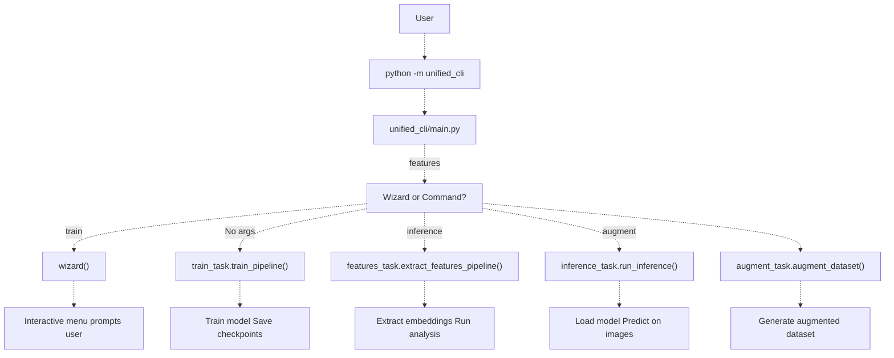
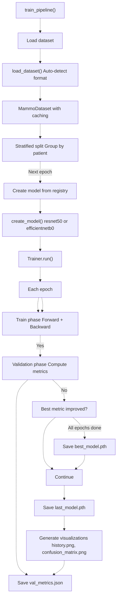

# Getting Started

> **Relevant source files**
> * [Article/01-embeddings.md](https://github.com/ThalesMMS/mammography-pipelines/blob/01443313/Article/01-embeddings.md)
> * [Article/02-density.md](https://github.com/ThalesMMS/mammography-pipelines/blob/01443313/Article/02-density.md)
> * [Article/article.md](https://github.com/ThalesMMS/mammography-pipelines/blob/01443313/Article/article.md)

This page provides a quick start guide for installing the mammography pipelines system, verifying the installation, and running your first training experiment. By the end of this guide, you will have trained a breast density classification model using the unified CLI.

**Scope**: This guide covers basic installation, dependency setup, and the simplest path to training a model. For detailed information about system architecture, see [System Architecture](3%20Machine-Learning-Pipeline.md). For comprehensive CLI reference and advanced training options, see [Training Models](2%20Mammography-CLI-Reference.md). For understanding the medical imaging concepts and problems this system addresses, see [Key Concepts](1c%20Key-Concepts.md).

---

## Prerequisites

Before installation, ensure your system meets these requirements:

| Requirement | Details |
| --- | --- |
| **Python Version** | 3.11 or higher |
| **Hardware** | CPU-only supported; GPU (CUDA/MPS) recommended for training |
| **Disk Space** | Minimum 5GB for dependencies; 10GB+ recommended for datasets and outputs |
| **Operating System** | Linux, macOS, or Windows (PowerShell for DICOM scripts) |

**Sources**: [README.md L29-L40](https://github.com/ThalesMMS/mammography-pipelines/blob/01443313/README.md#L29-L40)

---

## Installation Steps

### 1. Clone the Repository

```
git clone https://github.com/ThalesMMS/mammography-pipelinescd mammography-pipelines
```

### 2. Create a Virtual Environment (Recommended)

```
python -m venv venvsource venv/bin/activate  # On Windows: venv\Scripts\activate
```

### 3. Install Dependencies

The system requires PyTorch and torchvision along with medical imaging libraries like `pydicom` and `pylibjpeg`:

```
pip install uv
uv sync --frozen

# Legacy
# pip install -r requirements.txt
```

**Key Dependencies Installed**:

| Category | Packages |
| --- | --- |
| **Deep Learning** | `torch`, `torchvision`, `torchaudio` |
| **Medical Imaging** | `pydicom`, `pylibjpeg`, `pylibjpeg-libjpeg`, `pylibjpeg-openjpeg`, `python-gdcm` |
| **Data Processing** | `numpy`, `pandas`, `polars`, `scikit-learn`, `scipy` |
| **Visualization** | `matplotlib`, `opencv-python`, `lets-plot` |
| **Dimensionality Reduction** | `umap-learn` |
| **CLI Interface** | `typer`, `click` |
| **Progress Tracking** | `tqdm` |

**Sources**: [requirements.txt L1-L22](https://github.com/ThalesMMS/mammography-pipelines/blob/01443313/requirements.txt#L1-L22)

 [README.md L37-L40](https://github.com/ThalesMMS/mammography-pipelines/blob/01443313/README.md#L37-L40)

---

## Verification

### Running the Interactive Wizard

The easiest way to verify installation is to launch the interactive wizard:

```
python -m unified_cli
```

If successful, you should see a menu with task options. This confirms that:

* The `unified_cli` module is properly installed
* All dependencies are available
* The command-line interface is functional

### Running the Test Suite

For comprehensive verification, run the test suite:

```
python -m pytest tests/
```

This validates all core components including data loading, model creation, and training logic.



**Diagram: CLI Entry Point and Task Routing**

**Sources**: README.md

 README.md

---

## Your First Training Run

### Interactive Method (Recommended for Beginners)

Launch the wizard and follow the prompts:

```
python -m unified_cli
```

1. Select `[1] Train a model`
2. Choose dataset format (use `auto` if unsure)
3. Provide paths to your CSV labels and image directory
4. Select model architecture (`resnet50` recommended for first run)
5. Configure basic parameters (defaults are reasonable)
6. Start training

### Command-Line Method

For direct execution, use the `train` command with minimal arguments:

```
python -m unified_cli train \    --dataset-format auto \    --csv path/to/labels.csv \    --model resnet50 \    --classes 4 \    --epochs 10 \    --batch-size 16 \    --outdir outputs/my_first_experiment
```

**Parameter Explanation**:

| Parameter | Purpose | Default/Recommendation |
| --- | --- | --- |
| `--dataset-format` | Automatic detection of image organization | `auto` (tries to infer structure) |
| `--csv` | Path to CSV with image labels | Required |
| `--model` | Architecture: `resnet50` or `efficientnetb0` | `resnet50` (more robust) |
| `--classes` | Number of output classes (2 or 4) | 4 (BI-RADS A/B/C/D) |
| `--epochs` | Training iterations over full dataset | 10 (sufficient for initial test) |
| `--batch-size` | Images per training step | 16 (adjust based on GPU memory) |
| `--outdir` | Directory for checkpoints and metrics | Required |

**Sources**: README.md

 README.md

---

## Understanding Training Output

After the training command starts, you'll see:



**Diagram: First Training Run Execution Flow**

**Output Directory Structure**:

```python
outputs/my_first_experiment/
├── best_model.pth              # Checkpoint with highest validation metric
├── last_model.pth              # Checkpoint from final epoch
├── val_metrics.json            # Detailed performance metrics
├── training_history.png        # Loss/accuracy curves over epochs
├── confusion_matrix.png        # Per-class prediction matrix
└── cache/                      # Optional: cached preprocessed images
```

**What to Check**:

* **Training completes without errors**: Model architecture and data loading work correctly
* **`val_metrics.json` exists**: Validation metrics were computed successfully
* **`best_model.pth` created**: At least one epoch improved the validation metric
* **Visualizations generated**: Plots show training progression

For detailed interpretation of these outputs, see [Understanding Training Outputs](6a%20Random-Seeds-and-Variability.md).

**Sources**: README.md

---

## Common First-Run Issues

| Issue | Likely Cause | Solution |
| --- | --- | --- |
| `ModuleNotFoundError: No module named 'unified_cli'` | Not running from repository root | `cd` to repository root before running commands |
| `RuntimeError: No CUDA devices available` | No GPU detected | Add `--device cpu` flag (training will be slower) |
| `FileNotFoundError` for CSV/images | Incorrect path | Use absolute paths or verify relative paths from current directory |
| `All predictions converge to one class` | Model collapse on imbalanced data | This is expected initially; see [Model Collapse Prevention](5a%20Performance-Metrics.md) |
| Out of memory error | Batch size too large for GPU | Reduce `--batch-size` (try 8 or 4) |

**Sources**: README.md

---

## Quick Reference: Essential Commands

### Launch Interactive Wizard

```
python -m unified_cli
```

### Train a Model

```
python -m unified_cli train --csv labels.csv --model resnet50 --outdir outputs/exp1
```

### Extract Features from Trained Model

```
python -m unified_cli features --checkpoint outputs/exp1/best_model.pth --outdir outputs/features
```

### Run Inference on New Images

```
python -m unified_cli inference --checkpoint outputs/exp1/best_model.pth --input-path new_image.png
```

### Generate Augmented Dataset

```
python -m unified_cli augment --source-dir ./images --output-dir ./images_augmented
```

For detailed documentation of each command and all available options, see [Unified CLI Reference](2%20Mammography-CLI-Reference.md).

**Sources**: README.md

---

## Next Steps

Now that you have completed your first training run, explore these topics:

| Topic | Page | What You'll Learn |
| --- | --- | --- |
| **Advanced Training Options** | [Training Models](2a%20mammography-embed.md) | Freezing strategies, class balancing, hyperparameters |
| **Feature Analysis** | [Feature Extraction](2b%20mammography-train-density.md) | Extract embeddings, run PCA/t-SNE/UMAP, clustering |
| **Dataset Formats** | [Dataset Formats](4b%20Preprocessing-and-Augmentation.md) | Supported formats: archive, mamografias, patches |
| **DICOM Preprocessing** | [DICOM Image Handling](4a%20DICOM-Datasets.md) | Windowing, normalization, MONOCHROME1 inversion |
| **Model Collapse Problem** | [Model Collapse Prevention](5a%20Performance-Metrics.md) | Why initial accuracy may be low and how to fix it |
| **Configuration Files** | [Configuration Management](5d%20Training-History-and-Convergence.md) | Use JSON configs instead of long CLI commands |
| **Metrics Interpretation** | [Interpreting Validation Metrics](6c%20Artifact-Logging.md) | Understand balanced accuracy, Kappa, AUC |

**Sources**: README.md

---

## Project Structure Overview

The repository is organized into modular components:

```go
mammography-pipelines/
├── unified_cli/                    # Main package (python -m unified_cli)
│   ├── __main__.py                # Entry point: CLI router and wizard
│   ├── data/                      # Dataset loading and preprocessing
│   ├── models/                    # ResNet50, EfficientNetB0 definitions
│   ├── train/                     # Trainer class, loss functions, metrics
│   ├── features/                  # Feature extraction and dimensionality reduction
│   ├── tasks/                     # High-level task orchestrators
│   │   ├── train_task.py         # train_pipeline()
│   │   ├── features_task.py      # extract_features_pipeline()
│   │   ├── inference_task.py     # run_inference()
│   │   └── augment_task.py       # augment_dataset()
│   ├── viz/                       # Confusion matrices, ROC curves, plots
│   └── configs/                   # YAML presets for common configurations
├── tests/                         # Unit and integration tests
├── requirements.txt               # Legacy pip install (use uv.lock)
├── uv.lock                        # Locked dependency graph (uv)
└── README.md                      # Project overview
```

Each module is designed to be independently testable and reusable across tasks. For detailed architecture documentation, see [System Architecture](3%20Machine-Learning-Pipeline.md).

**Sources**: Project overview and setup

 [.gitignore L1-L214](https://github.com/ThalesMMS/mammography-pipelines/blob/01443313/.gitignore#L1-L214)


### On this page

* [Getting Started](#1.1-getting-started)
* [Prerequisites](#1.1-prerequisites)
* [Installation Steps](#1.1-installation-steps)
* [1. Clone the Repository](#1.1-1-clone-the-repository)
* [2. Create a Virtual Environment (Recommended)](#1.1-2-create-a-virtual-environment-recommended)
* [3. Install Dependencies](#1.1-3-install-dependencies)
* [Verification](#1.1-verification)
* [Running the Interactive Wizard](#1.1-running-the-interactive-wizard)
* [Running the Test Suite](#1.1-running-the-test-suite)
* [Your First Training Run](#1.1-your-first-training-run)
* [Interactive Method (Recommended for Beginners)](#1.1-interactive-method-recommended-for-beginners)
* [Command-Line Method](#1.1-command-line-method)
* [Understanding Training Output](#1.1-understanding-training-output)
* [Common First-Run Issues](#1.1-common-first-run-issues)
* [Quick Reference: Essential Commands](#1.1-quick-reference-essential-commands)
* [Launch Interactive Wizard](#1.1-launch-interactive-wizard)
* [Train a Model](#1.1-train-a-model)
* [Extract Features from Trained Model](#1.1-extract-features-from-trained-model)
* [Run Inference on New Images](#1.1-run-inference-on-new-images)
* [Generate Augmented Dataset](#1.1-generate-augmented-dataset)
* [Next Steps](#1.1-next-steps)
* [Project Structure Overview](#1.1-project-structure-overview)

Ask Devin about mammography-pipelines
