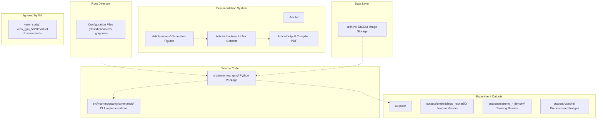
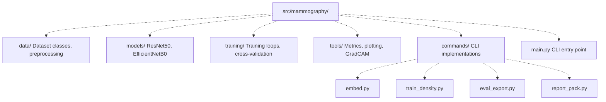
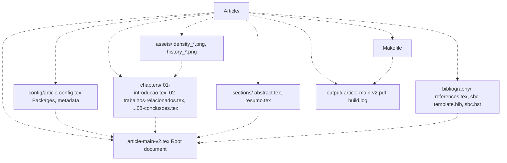
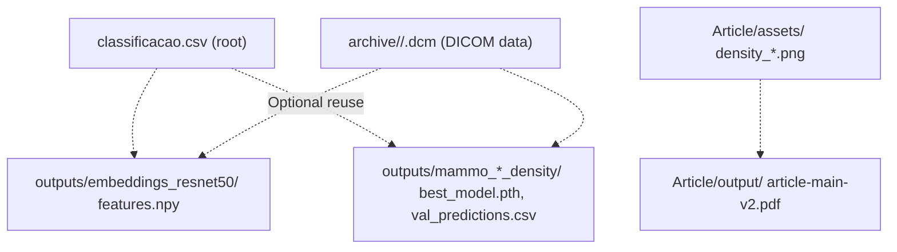

# Repository Structure

> **Relevant source files**
> * [.gitignore](https://github.com/ThalesMMS/mammography-pipelines/blob/01443313/.gitignore)
> * [Article/README.md](https://github.com/ThalesMMS/mammography-pipelines/blob/01443313/Article/README.md)
> * [Article/article.md](https://github.com/ThalesMMS/mammography-pipelines/blob/01443313/Article/article.md)

This page documents the physical organization of the mammography-pipelines repository, including the purpose of each major directory, their contents, and how they relate to the ML pipeline workflow. For information about setting up the development environment, see [Environment Setup](9a%20Environment-Setup.md). For details about the CLI commands that interact with these directories, see [Mammography CLI Reference](2%20Mammography-CLI-Reference.md).

## Overview

The repository follows a clear separation between source code, data, experimental outputs, and documentation. Each component has a dedicated directory with specific responsibilities in the overall pipeline.



**Purpose**: This diagram maps the major directory groups and their primary data flow relationships.

Sources: [.gitignore L182-L211](https://github.com/ThalesMMS/mammography-pipelines/blob/01443313/.gitignore#L182-L211)

 [Article/README.md L5-L26](https://github.com/ThalesMMS/mammography-pipelines/blob/01443313/Article/README.md#L5-L26)

## Directory Structure Table

| Directory | Purpose | Git Tracked | Created By |
| --- | --- | --- | --- |
| `src/mammography/` | Python package with core ML logic | ✓ Yes | Developer |
| `archive/` | DICOM image storage (AccessionNumber subdirs) | ✗ No | User/Dataset |
| `outputs/` | All experiment artifacts and results | ✗ No | CLI commands |
| `Article/` | LaTeX documentation system | ✓ Yes | Developer |
| `venv_cuda/`, `venv_gpu_5080/` | Python virtual environments | ✗ No | User |
| `weights/` | Downloaded pretrained model weights | ✗ No | CLI commands |

Sources: [.gitignore L182-L211](https://github.com/ThalesMMS/mammography-pipelines/blob/01443313/.gitignore#L182-L211)

 [Article/README.md L5-L26](https://github.com/ThalesMMS/mammography-pipelines/blob/01443313/Article/README.md#L5-L26)

## Root Level Files

The repository root contains configuration files and metadata that coordinate the entire system:

| File | Purpose | Used By |
| --- | --- | --- |
| `classificacao.csv` | Patient metadata, BI-RADS labels, AccessionNumbers | All CLI commands |
| `.gitignore` | Excludes large files/directories from version control | Git |
| `.gitattributes` | Line ending normalization (referenced in wiki) | Git |
| `README.md` | Repository overview and quick start | Users |
| `Makefile` | LaTeX compilation automation | Article system |

**Key File**: `classificacao.csv` is the central metadata file that maps `AccessionNumber` (patient ID) to clinical attributes (idade, densidade, birads_calcificacao, etc.). Every CLI command reads this file via `--csv` parameter.

Sources: [.gitignore L1-L27](https://github.com/ThalesMMS/mammography-pipelines/blob/01443313/.gitignore#L1-L27)

 [Article/README.md L8-L9](https://github.com/ThalesMMS/mammography-pipelines/blob/01443313/Article/README.md#L8-L9)

## Source Code Directory (src/mammography/)

The `src/` directory contains the installable Python package organized into functional modules:



**Module Responsibilities**:

* **`data/`**: `DICOMDataset`, `ClassificationDataset`, augmentation transforms, stratified splitting
* **`models/`**: Model factory functions, backbone loading, classifier head construction
* **`training/`**: `train_one_epoch()`, `validate()`, checkpoint management, optimizer/scheduler setup
* **`tools/`**: Metric calculation (Kappa, AUC, Balanced Accuracy), confusion matrix generation, Grad-CAM
* **`commands/`**: Each CLI subcommand implementation (invoked by `__main__.py` via argparse)

Sources: [Article/article.md L499-L507](https://github.com/ThalesMMS/mammography-pipelines/blob/01443313/Article/article.md#L499-L507)

## Data Storage Directory (archive/)

The `archive/` directory stores raw DICOM images in a hierarchical structure:

```markdown
archive/
├── 1000001/              # AccessionNumber (patient identifier)
│   ├── image_001.dcm     # Individual DICOM files
│   ├── image_002.dcm
│   └── ...
├── 1000002/
│   └── ...
└── ...
```

**Structure Convention**:

* First level: `AccessionNumber` subdirectories (referenced in `classificacao.csv`)
* Second level: DICOM files (`.dcm` extension)
* Dataset loaders search for `*.dcm` files recursively within each `AccessionNumber` directory

**Git Status**: Excluded via [.gitignore L182](https://github.com/ThalesMMS/mammography-pipelines/blob/01443313/.gitignore#L182-L182)

 (`/archive`). DICOM files are large (typically 50-100 MB each) and contain patient data.

**Alternative Paths**: The system also supports `mamografias/` and `patches_completo_augmented/` directory structures (legacy naming from different dataset versions).

Sources: [.gitignore L182](https://github.com/ThalesMMS/mammography-pipelines/blob/01443313/.gitignore#L182-L182)

 [Article/article.md L100-L101](https://github.com/ThalesMMS/mammography-pipelines/blob/01443313/Article/article.md#L100-L101)

## Experiment Outputs Directory (outputs/)

The `outputs/` directory contains all experimental artifacts generated by CLI commands. Each experiment run creates a subdirectory with standardized structure:

```mermaid
flowchart TD

OUTPUTS["outputs/"]
EMBED_DIR["embeddings_resnet50/ Features from 'mammography embed'"]
DENSITY_DIR["mammo_efficientnetb0_density/ Results from 'mammography train-density'"]
CV_DIR["density_experiments/results_k3_seed42/ Cross-validation results"]
FEATURES["features.npy 2048-D embeddings"]
JOINED["joined.csv Metadata + embeddings"]
PREVIEW["preview/ PCA, t-SNE plots"]
CLUSTER["clustering_metrics.json"]
SUMMARY["summary.json Hyperparams + commit"]
MODEL["best_model.pth Checkpoint"]
HISTORY["train_history.json Loss/accuracy curves"]
METRICS_DIR["metrics/ val_metrics.*"]
PREDS["val_predictions.csv"]
CACHE_DIR["cache/ Preprocessed images"]
CV_SUMMARY["cv_summary.json Aggregated metrics"]
FOLD1["fold_1/results/"]
FOLD2["fold_2/results/"]
OPTUNA["optuna_trial.json"]

OUTPUTS -.-> EMBED_DIR
OUTPUTS -.-> DENSITY_DIR
OUTPUTS -.-> CV_DIR
```



**Purpose**: This diagram maps the output structure created by different CLI commands.

Sources: [.gitignore L191-L206](https://github.com/ThalesMMS/mammography-pipelines/blob/01443313/.gitignore#L191-L206)

 [Article/article.md L496-L507](https://github.com/ThalesMMS/mammography-pipelines/blob/01443313/Article/article.md#L496-L507)

### Embedding Outputs (outputs/embeddings_resnet50/)

Generated by `mammography embed`:

| File | Format | Description |
| --- | --- | --- |
| `features.npy` | NumPy array (N, 2048) | ResNet50 feature vectors for all images |
| `joined.csv` | CSV | Concatenation of `classificacao.csv` + embeddings |
| `preview/*.png` | PNG images | PCA, t-SNE, UMAP visualizations |
| `clustering_metrics.json` | JSON | Silhouette score, Davies-Bouldin index |
| `data_manifest.json` | JSON | Mapping of indices to AccessionNumbers |

Sources: [Article/article.md L457-L480](https://github.com/ThalesMMS/mammography-pipelines/blob/01443313/Article/article.md#L457-L480)

### Training Outputs (outputs/mammo_*_density/)

Generated by `mammography train-density`:

| File/Directory | Description |
| --- | --- |
| `summary.json` | Hyperparameters, Git commit hash, dataset stats |
| `best_model.pth` | Model checkpoint (state_dict) |
| `train_history.json` | Per-epoch metrics (train/val loss, accuracy, Kappa) |
| `metrics/` | Detailed validation metrics (per-class precision/recall/F1) |
| `val_predictions.csv` | Per-sample predictions with confidence scores |
| `embeddings_val.npy` | Optional: embeddings from validation set |
| `cache/` | Preprocessed images (if `--cache-mode disk`) |
| `run.log` | Full training logs |

**Naming Convention**: Directory names encode model architecture and dataset:

* `mammo_resnet50_density/` - ResNet50 trained on density task
* `mammo_efficientnetb0_density/` - EfficientNetB0 on density
* `results_42/`, `results_43/`, `results_44/` - Multiple seeds for variance analysis

Sources: [Article/article.md L496-L507](https://github.com/ThalesMMS/mammography-pipelines/blob/01443313/Article/article.md#L496-L507)

 [.gitignore L191-L206](https://github.com/ThalesMMS/mammography-pipelines/blob/01443313/.gitignore#L191-L206)

### Cross-Validation Outputs

Generated by `mammography train-density --cv-folds N`:

```markdown
outputs/density_experiments/results_k3_seed42/
├── cv_summary.json           # Aggregated metrics across folds
├── optuna_trial.json         # Hyperparameter search metadata
├── fold_1/
│   ├── results/
│   │   ├── best_model.pth
│   │   ├── train_history.json
│   │   └── val_predictions.csv
│   └── cache/                # Per-fold cache (optional)
├── fold_2/
│   └── ...
└── fold_3/
    └── ...
```

**Key File**: `cv_summary.json` contains mean and std of all metrics across folds.

Sources: [.gitignore L200-L203](https://github.com/ThalesMMS/mammography-pipelines/blob/01443313/.gitignore#L200-L203)

### Cache Directories (outputs/*/cache/)

Disk caching stores preprocessed images to avoid repeated DICOM decoding and augmentation:

* **Purpose**: Reduce I/O time from hours to minutes (see [Caching Strategies](4e%20Caching-Strategies.md))
* **Contents**: `.pt` files (PyTorch tensors) named by AccessionNumber
* **Size**: Can grow to 50+ GB for large datasets
* **Git Status**: Excluded via [.gitignore L191-L211](https://github.com/ThalesMMS/mammography-pipelines/blob/01443313/.gitignore#L191-L211)

**Usage**: Enabled with `--cache-mode disk` flag in CLI commands.

Sources: [.gitignore L191-L211](https://github.com/ThalesMMS/mammography-pipelines/blob/01443313/.gitignore#L191-L211)

## Documentation Directory (Article/)

The `Article/` directory is a self-contained LaTeX build system for generating academic publications:



**Purpose**: This diagram shows the modular LaTeX system and compilation dependencies.

Sources: [Article/README.md L5-L26](https://github.com/ThalesMMS/mammography-pipelines/blob/01443313/Article/README.md#L5-L26)

### Article Structure Breakdown

| Directory/File | Purpose | Modification Frequency |
| --- | --- | --- |
| `article-main-v2.tex` | Root LaTeX file, includes all components | Rarely |
| `config/article-config.tex` | Metadata (title, author), package imports | Once per project |
| `chapters/NN-*.tex` | Content chapters (numbered 01-08) | Frequently |
| `sections/` | Abstract and resumo (Portuguese) | Occasionally |
| `bibliography/` | References (both `.tex` and `.bib` formats) | Occasionally |
| `assets/` | Figures and diagrams (many from ML outputs) | Frequently |
| `output/` | Compiled PDF and build logs | Auto-generated |
| `Makefile` | Build automation (`make compile`, `make bib`) | Rarely |

**Key Integration**: The `assets/` directory receives auto-generated figures from `mammography report-pack` (confusion matrices, Grad-CAMs, training curves). See [Integrating ML Results with LaTeX](8d%20Integrating-ML-Results-with-LaTeX.md).

Sources: [Article/README.md L5-L98](https://github.com/ThalesMMS/mammography-pipelines/blob/01443313/Article/README.md#L5-L98)

### Article Build Targets

The `Makefile` provides standardized build commands:

| Command | Description | LaTeX Passes |
| --- | --- | --- |
| `make compile` | Standard build with `thebibliography` | 2 × pdflatex |
| `make bib` | Build with BibTeX references | pdflatex → bibtex → 2 × pdflatex |
| `make view` | Compile and open PDF | compile + open |
| `make clean` | Remove `output/` and temp files | N/A |

Sources: [Article/README.md L32-L46](https://github.com/ThalesMMS/mammography-pipelines/blob/01443313/Article/README.md#L32-L46)

 **Sources**: [Article documentation](https://github.com/ThalesMMS/mammography-pipelines/blob/01443313/Article/README.md#L137-L156)

## Artifact Flow Between Directories

The following diagram illustrates how data and artifacts flow through the directory structure during a typical experiment:



**Flow Stages**:

1. **Input**: `classificacao.csv` + `archive/` → Used by all commands
2. **Embedding**: `mammography embed` → `outputs/embeddings_*/`
3. **Training**: `mammography train-density` → `outputs/mammo_*_density/`
4. **Reporting**: `mammography report-pack` → `Article/assets/`
5. **Documentation**: `make bib` → `Article/output/article-main-v2.pdf`

Sources: [Article/article.md L94-L125](https://github.com/ThalesMMS/mammography-pipelines/blob/01443313/Article/article.md#L94-L125)

 [Article/README.md L5-L26](https://github.com/ThalesMMS/mammography-pipelines/blob/01443313/Article/README.md#L5-L26)

## Ignored Directories and Files

The `.gitignore` file excludes several categories of files from version control:

### Python Standard Exclusions

* `__pycache__/`, `*.pyc`, `*.pyo` - Bytecode
* `.venv/`, `venv/`, `ENV/` - Virtual environments
* `.pytest_cache/`, `.coverage` - Test artifacts
* `.ruff_cache/`, `.mypy_cache/` - Linter caches

### Project-Specific Exclusions

| Pattern | Reason |
| --- | --- |
| `/archive` | Large DICOM files (50+ GB) |
| `/outputs/*/cache` | Preprocessed image cache (can be regenerated) |
| `/venv_cuda`, `/venv_gpu_5080` | GPU-specific virtual environments |
| `resnet50.pth` | Downloaded pretrained weights |
| `/archive_augmented`, `/archive_png` | Alternative dataset formats |
| `weights/medicalnet/resnet_50.pth` | Medical domain pretrained weights |
| `.DS_Store` | macOS metadata |

### Cursor IDE Exclusions

* `.cursorignore`, `.cursorindexingignore` - AI code editor exclusions
* `AGENTS.md`, `.specify`, `.codex` - AI assistant metadata

Sources: [.gitignore L1-L212](https://github.com/ThalesMMS/mammography-pipelines/blob/01443313/.gitignore#L1-L212)

## Special Directories Not in Repository

Some directories are referenced in code but not present in the repository structure:

| Directory | Purpose | Creation Method |
| --- | --- | --- |
| `mamografias/` | Alternative DICOM root (legacy naming) | User provides |
| `patches_completo_augmented/` | Patch-based dataset variant | User provides |
| `archive_augmented/` | Augmented dataset variant | Generated externally |
| `weights/` | Pretrained model weights | Auto-downloaded by CLI |

These directories are detected automatically by the data loader based on the `--dicom-root` argument.

Sources: [.gitignore L207-L211](https://github.com/ThalesMMS/mammography-pipelines/blob/01443313/.gitignore#L207-L211)

 [Article/article.md L100-L101](https://github.com/ThalesMMS/mammography-pipelines/blob/01443313/Article/article.md#L100-L101)

## Directory Lifecycle and Management

### Creation

* **Automatic**: `outputs/`, `Article/output/`, `weights/` - Created by CLI/Makefile
* **Manual**: `archive/`, `venv_cuda/` - User must create and populate
* **Generated**: Cache directories - Created on first run with `--cache-mode disk`

### Cleanup

* **`make clean`**: Removes `Article/output/` and LaTeX temp files
* **Manual cache cleanup**: Delete `outputs/*/cache/` to reclaim disk space
* **Git clean**: `git clean -fdx` removes all untracked files (use with caution)

### Backup

The `Makefile` provides a backup target (referenced in **Sources**: [Article documentation](https://github.com/ThalesMMS/mammography-pipelines/blob/01443313/Article/README.md#L151-L151)

):

```
make backup  # Creates .tar.gz of source code (excludes outputs/)
```

Sources: [Article documentation](https://github.com/ThalesMMS/mammography-pipelines/blob/01443313/Article/README.md#L137-L175)

## Summary

The repository structure enforces clear boundaries between:

1. **Source code** (`src/`) - Version controlled, defines system behavior
2. **Data** (`archive/`) - Excluded from Git, user-provided
3. **Experiments** (`outputs/`) - Excluded from Git, reproducible from code + data
4. **Documentation** (`Article/`) - Version controlled, consumes experiment artifacts

This separation enables reproducibility (code + data → outputs), facilitates collaboration (only code and docs in Git), and supports the end-to-end pipeline from raw DICOM to published PDF.

Sources: [.gitignore L1-L212](https://github.com/ThalesMMS/mammography-pipelines/blob/01443313/.gitignore#L1-L212)

 [Article/README.md L1-L175](https://github.com/ThalesMMS/mammography-pipelines/blob/01443313/Article/README.md#L1-L175)

 [Article/article.md L496-L507](https://github.com/ThalesMMS/mammography-pipelines/blob/01443313/Article/article.md#L496-L507)


### On this page

* [Repository Structure](#1.2-repository-structure)
* [Overview](#1.2-overview)
* [Directory Structure Table](#1.2-directory-structure-table)
* [Root Level Files](#1.2-root-level-files)
* [Source Code Directory ( src/mammography/ )](#1.2-source-code-directory-object-object)
* [Data Storage Directory ( archive/ )](#1.2-data-storage-directory-object-object)
* [Experiment Outputs Directory ( outputs/ )](#1.2-experiment-outputs-directory-object-object)
* [Embedding Outputs ( outputs/embeddings_resnet50/ )](#1.2-embedding-outputs-object-object)
* [Training Outputs ( outputs/mammo_*_density/ )](#1.2-training-outputs-object-object)
* [Cross-Validation Outputs](#1.2-cross-validation-outputs)
* [Cache Directories ( outputs/*/cache/ )](#1.2-cache-directories-object-object)
* [Documentation Directory ( Article/ )](#1.2-documentation-directory-object-object)
* [Article Structure Breakdown](#1.2-article-structure-breakdown)
* [Article Build Targets](#1.2-article-build-targets)
* [Artifact Flow Between Directories](#1.2-artifact-flow-between-directories)
* [Ignored Directories and Files](#1.2-ignored-directories-and-files)
* [Python Standard Exclusions](#1.2-python-standard-exclusions)
* [Project-Specific Exclusions](#1.2-project-specific-exclusions)
* [Cursor IDE Exclusions](#1.2-cursor-ide-exclusions)
* [Special Directories Not in Repository](#1.2-special-directories-not-in-repository)
* [Directory Lifecycle and Management](#1.2-directory-lifecycle-and-management)
* [Creation](#1.2-creation)
* [Cleanup](#1.2-cleanup)
* [Backup](#1.2-backup)
* [Summary](#1.2-summary)

Ask Devin about mammography-pipelines