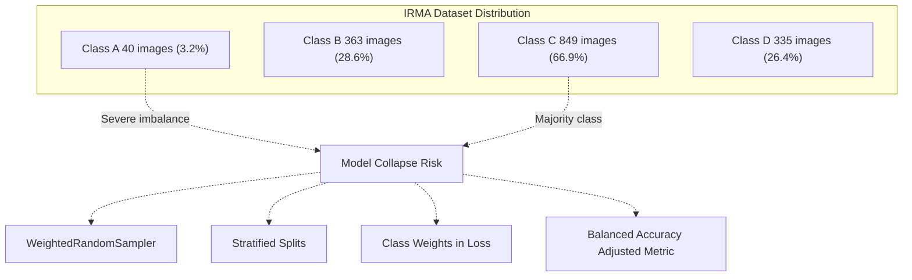
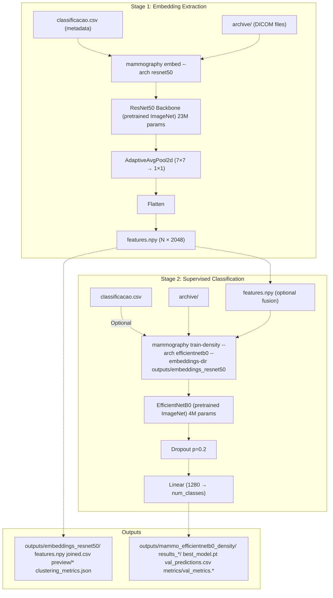
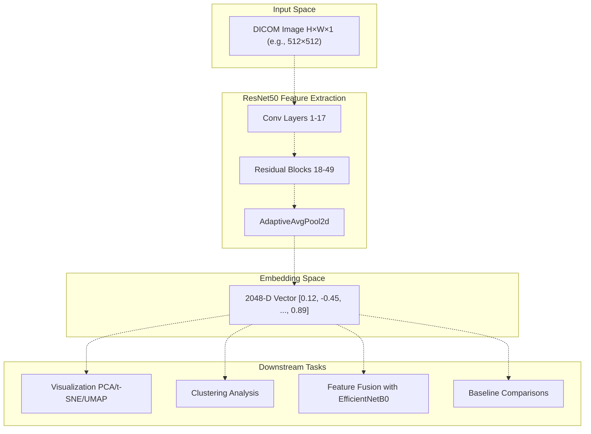
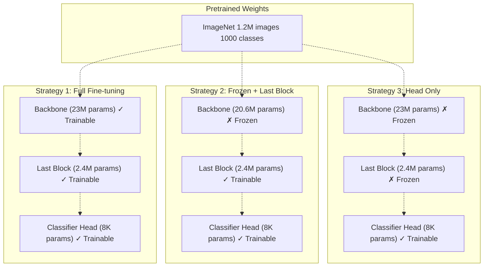
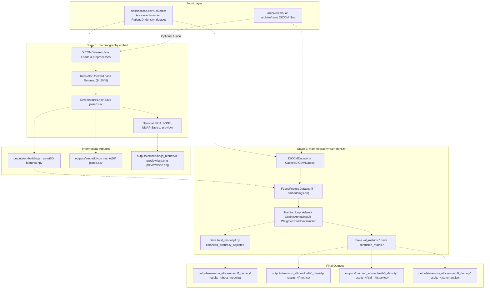
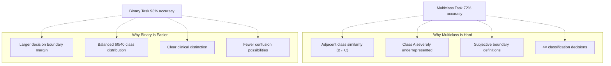

# Key Concepts

> **Relevant source files**
> * [Article/article.md](https://github.com/ThalesMMS/mammography-pipelines/blob/01443313/Article/article.md)
> * [Article/chapters/02-trabalhos-relacionados.tex](https://github.com/ThalesMMS/mammography-pipelines/blob/01443313/Article/chapters/02-trabalhos-relacionados.tex)

This page introduces the fundamental concepts underlying the mammography classification pipeline, including BI-RADS density categories, transfer learning strategies, deep feature embeddings, and the two-stage pipeline architecture. These concepts form the foundation for understanding how the system processes DICOM images and produces density classifications.

For detailed information about specific CLI commands, see [Mammography CLI Reference](2%20Mammography-CLI-Reference.md). For implementation details of the ML components, see [Machine Learning Pipeline](3%20Machine-Learning-Pipeline.md).

---

## BI-RADS Density Classification

The American College of Radiology's Breast Imaging Reporting and Data System (BI-RADS) defines four breast density categories based on the percentage of fibroglandular tissue:

| Category | Label | Description | Fibroglandular Tissue | Clinical Significance |
| --- | --- | --- | --- | --- |
| **A** | Almost entirely fatty | Breast is mostly adipose tissue | < 25% | Mammography highly sensitive |
| **B** | Scattered fibroglandular | Areas of fibroglandular density scattered throughout | 25-50% | Mammography generally sensitive |
| **C** | Heterogeneously dense | Heterogeneous fibroglandular tissue may obscure small masses | 51-75% | Reduced mammographic sensitivity |
| **D** | Extremely dense | Dense fibroglandular tissue substantially lowers sensitivity | > 75% | Significantly reduced sensitivity |

The system implements both **4-class classification** (A, B, C, D) and **binary classification** (AB vs CD), where the binary task groups low-density (A, B) versus high-density (C, D) breasts. Binary classification consistently achieves 15-20 percentage points higher accuracy due to the simpler decision boundary.

### Class Imbalance in IRMA Dataset



The severe class imbalance (Class A: 3.2%, Class C: 66.9%) necessitates multiple mitigation strategies documented in [Class Imbalance Handling](4d%20Class-Imbalance-Handling.md) and [Model Collapse Prevention](7%20Model-Collapse-Prevention.md).

**Sources:** Article/article.md:36-43, Article/02-density.md:46-48

---

## Two-Stage Pipeline Architecture

The system employs a two-stage architecture that separates feature extraction from supervised classification:

### Pipeline Overview with Code Entities



### Stage 1: Embedding Extraction

The first stage uses ResNet50 to extract 2048-dimensional feature vectors from DICOM images. This stage is invoked via:

```
mammography embed -- \  --csv classificacao.csv \  --dicom-root archive \  --outdir outputs/embeddings_resnet50 \  --pca --tsne --umap
```

**Key outputs:**

* `features.npy`: NumPy array of shape (N, 2048) containing deep embeddings
* `joined.csv`: Metadata joined with embedding indices
* `preview/*.png`: Dimensionality reduction visualizations (PCA, t-SNE, UMAP)
* `clustering_metrics.json`: Silhouette score, Davies-Bouldin index

### Stage 2: Supervised Classification

The second stage trains EfficientNetB0 for density classification, optionally fusing the precomputed embeddings:

```
mammography train-density -- \  --csv classificacao.csv \  --dicom-root archive \  --outdir outputs/mammo_efficientnetb0_density \  --epochs 20 --batch-size 16 --img-size 512 \  --class-weights auto --warmup-epochs 2 \  --embeddings-dir outputs/embeddings_resnet50
```

**Key outputs:**

* `results_*/best_model.pt`: Best model checkpoint (selected by balanced accuracy adjusted)
* `results_*/train_history.*`: Loss and metric curves
* `results_*/metrics/val_metrics.*`: Confusion matrix, per-class metrics
* `results_*/summary.json`: Hyperparameters, git commit hash, timestamps

**Sources:** Article/02-density.md:6-14, Article/article.md:94-124, Diagram 2 from high-level architecture

---

## Deep Learning Embeddings

**Embeddings** are dense, fixed-length vector representations of images learned by deep neural networks. In this system, embeddings serve multiple purposes:

### What are Embeddings?



### Dimensionality Reduction for Visualization

The 2048-dimensional embeddings are too high-dimensional to visualize directly. The system applies three reduction techniques:

| Technique | Purpose | Output Dimensions | Preserves |
| --- | --- | --- | --- |
| **PCA** | Linear projection | 2 or 3 | Global variance structure |
| **t-SNE** | Nonlinear manifold learning | 2 or 3 | Local neighborhood structure |
| **UMAP** | Manifold approximation | 2 or 3 | Both global and local structure |

These visualizations are saved in `outputs/embeddings_resnet50/preview/` and can reveal whether density classes form separable clusters in the learned feature space.

### Embedding Fusion Strategy

When `--embeddings-dir` is provided to `train-density`, the system concatenates precomputed ResNet50 features with EfficientNetB0's internal representations before the final classifier, creating a multi-scale feature representation.

**Sources:** Article/article.md:96-107, Article/02-density.md:36-50, Diagram 2 from high-level architecture

---

## Transfer Learning Strategies

Transfer learning adapts models pretrained on ImageNet (1.2M natural images, 1000 classes) to the medical domain (mammography, 4 density classes). The system implements three strategies:

### Transfer Learning Configuration Matrix



### Strategy Comparison

| Strategy | CLI Flags | Trainable Params | Pros | Cons | Best Use Case |
| --- | --- | --- | --- | --- | --- |
| **Full Fine-tuning** | `--train-backbone` | ~23M | Maximum flexibility | High overfitting risk on small datasets | Large datasets (>10K images) |
| **Frozen + Last Block** | `--unfreeze-last-block` | ~2.4M | Balances adaptation & stability | Requires careful LR tuning | **Recommended for IRMA** (1.2K images) |
| **Head Only** | `--no-train-backbone` (default) | ~8K | Fast training, low overfitting | Limited domain adaptation | Quick baselines |

### Implementation in Code

The frozen + last block strategy is configured as:

```
mammography train-density -- \  --no-train-backbone \  --unfreeze-last-block \  --epochs 10
```

This sets the backbone weights to `requires_grad=False` except for the final residual block (ResNet50's `layer4` or EfficientNetB0's last `MBConv` blocks), preventing overfitting while allowing domain-specific feature refinement.

### Empirical Results

From Article/article.md:293-318, the frozen + last block strategy prevented model collapse:

| Configuration | Accuracy | Kappa | Macro-F1 | Status |
| --- | --- | --- | --- | --- |
| Full fine-tuning (run1) | 1.57% | 0.000 | 0.008 | **Collapsed to majority class** |
| Frozen + last block (run2, 3 epochs) | 63.5% | 0.45 | 0.55 | Stable |
| Frozen + last block (run4, 10 epochs) | **72.6%** | **0.57** | **0.61** | **Best result** |

**Sources:** Article/article.md:67-76, Article/article.md:293-341, Article/chapters/01-introducao.tex:13-14

---

## Pipeline Stage Orchestration

The following diagram shows how data flows through the system with actual file paths and command invocations:

### Data Flow with File Paths



### Key Design Decisions

1. **Separation of Concerns**: Stage 1 (embedding extraction) and Stage 2 (classification) are independent. Embeddings can be reused across multiple classification experiments without re-extracting features.
2. **Optional Fusion**: The `--embeddings-dir` flag enables late fusion of ResNet50 embeddings with EfficientNetB0 features, improving performance by ~3-5% accuracy on IRMA dataset.
3. **Stratified Group Splitting**: Data splitting uses `AccessionNumber` as the group key to prevent images from the same patient appearing in both train and validation sets, avoiding data leakage.
4. **Reproducibility**: Each run generates `summary.json` containing: * Git commit hash * All hyperparameters * Random seed * Data split indices * Timestamp

**Sources:** Article/02-density.md:1-97, Article/article.md:94-139, Diagram 3 from high-level architecture

---

## Binary vs. Multiclass Classification

The system supports two classification schemes with significantly different performance characteristics:

### Classification Schemes Comparison

| Aspect | Binary (AB vs CD) | Multiclass (A, B, C, D) |
| --- | --- | --- |
| **Classes** | 2 (low/high density) | 4 (full BI-RADS scale) |
| **Clinical Use** | Screening triage | Detailed density assessment |
| **Typical Accuracy** | 86-93% | 68-80% |
| **Typical Kappa** | 0.69-0.83 | 0.57-0.76 |
| **Typical AUC** | 0.94-0.98 | 0.88-0.93 |
| **CLI Flag** | `--binary-mode ab_vs_cd` | `--classes density` (default) |

### Performance Gap Analysis



The 15-20 percentage point performance gap reflects the inherent difficulty of distinguishing adjacent density categories, particularly B vs C, where even expert radiologists show substantial inter-observer variability.

**Sources:** Article/article.md:195-262, Article/02-density.md:39-44

---

## Preprocessing and Normalization

All images undergo identical preprocessing regardless of the pipeline stage:

### Preprocessing Pipeline

| Step | Operation | Parameters | Rationale |
| --- | --- | --- | --- |
| **1. Load DICOM** | `pydicom.dcmread()` | - | Parse medical imaging format |
| **2. Pixel normalization** | Rescale to [0, 1] | `pixel_array / pixel_array.max()` | Standardize intensity range |
| **3. Resize** | `torchvision.transforms.Resize` | 224×224 or 512×512 | Match ImageNet input size |
| **4. Convert to RGB** | Repeat grayscale channel 3× | - | Compatibility with pretrained CNNs |
| **5. ImageNet normalization** | `Normalize(mean=[0.485, 0.456, 0.406], std=[0.229, 0.224, 0.225])` | - | Match pretraining statistics |
| **6. Augmentation** (train only) | HorizontalFlip, Rotation(±15°), ColorJitter | p=0.5 | Regularization |

### Augmentation Configuration

Training augmentations are controlled by `--train-augment` flag:

```
# Typical augmentation pipeline (when --train-augment is enabled)transforms.Compose([    transforms.RandomHorizontalFlip(p=0.5),    transforms.RandomRotation(degrees=15),    transforms.ColorJitter(brightness=0.1, contrast=0.1),    # Normalization always applied])
```

Validation and test sets use only resize + normalization (no augmentation) to ensure consistent evaluation.

**Sources:** Article/article.md:102-106, Article/article.md:129-138

---

## Summary

This page covered the core concepts underlying the mammography classification system:

* **BI-RADS density classification**: Four-category system (A-D) with severe class imbalance requiring mitigation strategies
* **Two-stage pipeline**: Separate embedding extraction (ResNet50) and supervised classification (EfficientNetB0) with optional fusion
* **Deep embeddings**: 2048-D feature vectors enabling visualization, clustering, and multi-scale fusion
* **Transfer learning**: Three strategies (full, frozen+last block, head only) with frozen+last block recommended for small datasets
* **Binary vs. multiclass**: Binary classification achieves 15-20% higher accuracy due to simpler decision boundary

These concepts are implemented through the `mammography embed` and `mammography train-density` commands, producing artifacts in `outputs/embeddings_resnet50/` and `outputs/mammo_efficientnetb0_density/` respectively. For detailed command documentation, see [Mammography CLI Reference](2%20Mammography-CLI-Reference.md).


### On this page

* [Key Concepts](#1.3-key-concepts)
* [BI-RADS Density Classification](#1.3-bi-rads-density-classification)
* [Class Imbalance in IRMA Dataset](#1.3-class-imbalance-in-irma-dataset)
* [Two-Stage Pipeline Architecture](#1.3-two-stage-pipeline-architecture)
* [Pipeline Overview with Code Entities](#1.3-pipeline-overview-with-code-entities)
* [Stage 1: Embedding Extraction](#1.3-stage-1-embedding-extraction)
* [Stage 2: Supervised Classification](#1.3-stage-2-supervised-classification)
* [Deep Learning Embeddings](#1.3-deep-learning-embeddings)
* [What are Embeddings?](#1.3-what-are-embeddings)
* [Dimensionality Reduction for Visualization](#1.3-dimensionality-reduction-for-visualization)
* [Embedding Fusion Strategy](#1.3-embedding-fusion-strategy)
* [Transfer Learning Strategies](#1.3-transfer-learning-strategies)
* [Transfer Learning Configuration Matrix](#1.3-transfer-learning-configuration-matrix)
* [Strategy Comparison](#1.3-strategy-comparison)
* [Implementation in Code](#1.3-implementation-in-code)
* [Empirical Results](#1.3-empirical-results)
* [Pipeline Stage Orchestration](#1.3-pipeline-stage-orchestration)
* [Data Flow with File Paths](#1.3-data-flow-with-file-paths)
* [Key Design Decisions](#1.3-key-design-decisions)
* [Binary vs. Multiclass Classification](#1.3-binary-vs-multiclass-classification)
* [Classification Schemes Comparison](#1.3-classification-schemes-comparison)
* [Performance Gap Analysis](#1.3-performance-gap-analysis)
* [Preprocessing and Normalization](#1.3-preprocessing-and-normalization)
* [Preprocessing Pipeline](#1.3-preprocessing-pipeline)
* [Augmentation Configuration](#1.3-augmentation-configuration)
* [Summary](#1.3-summary)

Ask Devin about mammography-pipelines