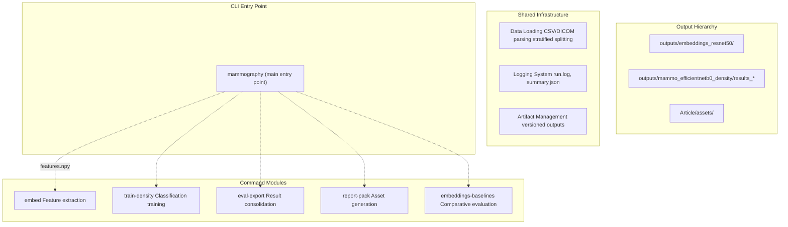
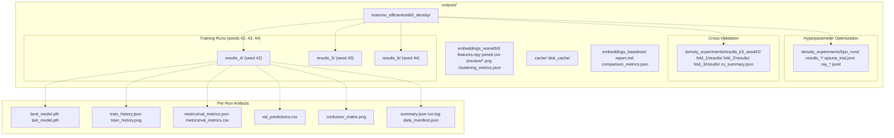
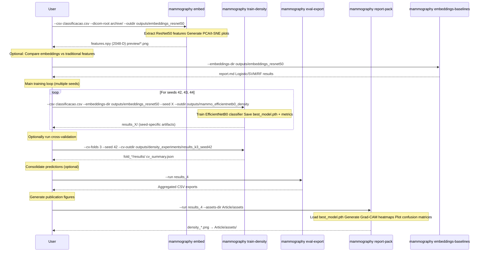

# Mammography CLI Reference

> **Relevant source files**
> * [Article/01-embeddings.md](https://github.com/ThalesMMS/mammography-pipelines/blob/01443313/Article/01-embeddings.md)
> * [Article/02-density.md](https://github.com/ThalesMMS/mammography-pipelines/blob/01443313/Article/02-density.md)
> * [Article/article.md](https://github.com/ThalesMMS/mammography-pipelines/blob/01443313/Article/article.md)

## Purpose and Scope

This document provides a comprehensive reference for the `mammography` command-line interface (CLI), which serves as the primary orchestration layer for the breast density classification pipeline. The CLI exposes five main commands that implement distinct phases of the ML workflow: feature extraction, supervised training, evaluation, reporting, and baseline comparison.

For detailed usage of individual commands, see sub-pages [mammography embed](2a%20mammography-embed.md), [mammography train-density](2b%20mammography-train-density.md), [mammography eval-export](2c%20mammography-eval-export.md), [mammography report-pack](2d%20mammography-report-pack.md), and [mammography embeddings-baselines](2e%20mammography-embeddings-baselines.md). For information about the underlying machine learning pipeline architecture, see [Machine Learning Pipeline](3%20Machine-Learning-Pipeline.md). For data preprocessing and augmentation details, see [Data Management](4%20Data-Management.md).

---

## CLI Architecture Overview

The `mammography` CLI follows a sub-command pattern where each command is responsible for a distinct phase of the research pipeline. All commands share common infrastructure for data loading, logging, and artifact management.



**Key Architecture Principles:**

1. **Separation of Concerns**: Each command owns a specific phase (extract, train, evaluate, report, compare)
2. **Artifact-Driven**: Commands communicate via standardized file artifacts rather than in-memory state
3. **Versioned Outputs**: Each training run creates a `results_*` directory with unique identifier
4. **Reproducibility**: All commands accept `--seed` parameter and log execution metadata to `summary.json`

**Sources:** [Article/01-embeddings.md L7-L14](https://github.com/ThalesMMS/mammography-pipelines/blob/01443313/Article/01-embeddings.md#L7-L14)

 [Article/02-density.md L6-L14](https://github.com/ThalesMMS/mammography-pipelines/blob/01443313/Article/02-density.md#L6-L14)

 [Article/article.md L94-L125](https://github.com/ThalesMMS/mammography-pipelines/blob/01443313/Article/article.md#L94-L125)

---

## Command Reference Overview

The following table summarizes all available `mammography` commands, their primary responsibilities, and key outputs:

| Command | Purpose | Primary Inputs | Key Outputs | Typical Runtime |
| --- | --- | --- | --- | --- |
| `embed` | Extract 2048-D ResNet50 embeddings from DICOM images | `--csv`, `--dicom-root` | `features.npy`, `joined.csv`, PCA/t-SNE plots | ~30 min (12K images) |
| `train-density` | Train EfficientNetB0 classifier for BI-RADS density categories (1-4) | `--csv`, `--dicom-root`, optional `--embeddings-dir` | `best_model.pth`, `train_history.json`, `val_metrics.*`, `val_predictions.csv` | ~10-60 min/seed |
| `eval-export` | Consolidate validation predictions and metrics across runs | `--run results_*` | Aggregated CSV exports | ~1 min |
| `report-pack` | Generate publication-ready figures (confusion matrices, Grad-CAMs, training curves) | `--run results_*`, `--assets-dir` | PNG files in `Article/assets/` | ~2-5 min |
| `embeddings-baselines` | Compare embeddings against traditional features using classical ML | `--embeddings-dir` | `report.md`, performance comparison tables | ~5-15 min |

**Sources:** [Article/01-embeddings.md L7-L14](https://github.com/ThalesMMS/mammography-pipelines/blob/01443313/Article/01-embeddings.md#L7-L14)

 [Article/02-density.md L6-L14](https://github.com/ThalesMMS/mammography-pipelines/blob/01443313/Article/02-density.md#L6-L14)

 [Article/article.md L455-L491](https://github.com/ThalesMMS/mammography-pipelines/blob/01443313/Article/article.md#L455-L491)

---

## Common Parameters Across Commands

Most commands share a consistent set of parameters for data loading, experiment configuration, and reproducibility:

### Data Source Parameters

| Parameter | Type | Description | Example |
| --- | --- | --- | --- |
| `--csv` | Path | CSV file with metadata (AccessionNumber, density class) | `classificacao.csv` |
| `--dicom-root` | Path | Root directory containing DICOM files organized as `<AccessionNumber>/*.dcm` | `archive/` |
| `--classes` | String | Target classification variable (typically `density` for BI-RADS 1-4) | `density` |
| `--exclude-class-5` | Flag | Remove class 5 samples from dataset (enabled by default) | - |

### Reproducibility Parameters

| Parameter | Type | Description | Default |
| --- | --- | --- | --- |
| `--seed` | Integer | Random seed for PyTorch, NumPy, and Python | `42` |
| `--outdir` | Path | Base output directory for artifacts | `outputs/` |

### Performance Parameters

| Parameter | Type | Description | Default |
| --- | --- | --- | --- |
| `--batch-size` | Integer | Training/inference batch size | `16` |
| `--num-workers` | Integer | DataLoader worker processes | `4` |
| `--cache-mode` | String | Caching strategy: `none`, `memory`, `disk` | `none` |
| `--prefetch-factor` | Integer | DataLoader prefetch queue size per worker | `2` |
| `--persistent-workers` | Flag | Keep DataLoader workers alive between epochs | - |

### Logging Parameters

| Parameter | Type | Description | Default |
| --- | --- | --- | --- |
| `--verbose` | Flag | Enable detailed logging output | - |
| `--save-csv` | Flag | Save joined metadata + features as CSV | - |

**Sources:** [Article/02-density.md L6-L14](https://github.com/ThalesMMS/mammography-pipelines/blob/01443313/Article/02-density.md#L6-L14)

 [Article/article.md L128-L139](https://github.com/ThalesMMS/mammography-pipelines/blob/01443313/Article/article.md#L128-L139)

---

## Output Directory Conventions

The `mammography` CLI organizes outputs into a structured hierarchy that supports versioning, reproducibility, and parallel experiments:



### Key Output Files

**Embedding Artifacts** (`outputs/embeddings_resnet50/`):

* `features.npy`: NumPy array of shape `(N, 2048)` containing ResNet50 embeddings
* `joined.csv`: Metadata CSV joined with embeddings (optional, generated with `--save-csv`)
* `preview/pca_*.png`, `preview/tsne_*.png`: Dimensionality reduction visualizations
* `clustering_metrics.json`: Silhouette score, Davies-Bouldin index

**Training Artifacts** (`outputs/mammo_efficientnetb0_density/results_*/`):

* `best_model.pth`: PyTorch checkpoint of best validation epoch
* `train_history.json`: Loss and metric curves in JSON format
* `metrics/val_metrics.json`: Per-class precision, recall, F1, confusion matrix
* `val_predictions.csv`: Per-sample predictions with ground truth labels
* `summary.json`: Hyperparameters, Git commit hash, seed, dataset stats

**Cross-Validation Artifacts** (`outputs/density_experiments/results_k3_seed42/`):

* `fold_*/results/`: Complete artifacts for each CV fold
* `cv_summary.json`: Aggregated metrics (mean ± std) across folds

**Report Assets** (`Article/assets/`):

* `density_confusion_seed*.png`: Confusion matrix heatmaps
* `density_train_seed*.png`: Training/validation curves
* `density_gradcam_seed*.png`: Grad-CAM interpretability visualizations

**Sources:** [Article/02-density.md L17-L23](https://github.com/ThalesMMS/mammography-pipelines/blob/01443313/Article/02-density.md#L17-L23)

 [Article/02-density.md L58-L86](https://github.com/ThalesMMS/mammography-pipelines/blob/01443313/Article/02-density.md#L58-L86)

 [Article/article.md L495-L508](https://github.com/ThalesMMS/mammography-pipelines/blob/01443313/Article/article.md#L495-L508)

---

## Command Workflow Integration

Commands are designed to be chained in a typical research workflow. The following diagram shows data flow between commands:



### Typical Workflow Sequence

1. **Feature Extraction** (once): `mammography embed` → produces reusable `features.npy`
2. **Optional Baseline** (once): `mammography embeddings-baselines` → validates embedding quality
3. **Training** (multiple seeds): `mammography train-density --seed 42/43/44` → produces `results_*/`
4. **Optional Cross-Validation**: `mammography train-density --cv-folds 3` → produces `cv_summary.json`
5. **Report Generation** (per seed): `mammography report-pack --run results_*` → syncs figures to `Article/assets/`

**Sources:** [Article/02-density.md L35-L56](https://github.com/ThalesMMS/mammography-pipelines/blob/01443313/Article/02-density.md#L35-L56)

 [Article/article.md L94-L125](https://github.com/ThalesMMS/mammography-pipelines/blob/01443313/Article/article.md#L94-L125)

---

## Quick Reference Examples

### Extract Embeddings with Exploratory Analysis

```
mammography embed -- \  --csv classificacao.csv \  --dicom-root archive \  --outdir outputs/embeddings_resnet50 \  --save-csv --pca --tsne
```

**Expected Output:**

* `outputs/embeddings_resnet50/features.npy`
* `outputs/embeddings_resnet50/joined.csv`
* `outputs/embeddings_resnet50/preview/pca_density.png`
* `outputs/embeddings_resnet50/preview/tsne_density.png`
* `outputs/embeddings_resnet50/clustering_metrics.json`

---

### Train Density Classifier (Standard Configuration)

```
mammography train-density -- \  --csv classificacao.csv \  --dicom-root archive \  --outdir outputs/mammo_efficientnetb0_density \  --epochs 20 --batch-size 16 --img-size 512 \  --class-weights auto --warmup-epochs 2 --unfreeze-last-block \  --embeddings-dir outputs/embeddings_resnet50 \  --cache-mode disk --persistent-workers
```

**Expected Output:**

* `outputs/mammo_efficientnetb0_density/results_*/best_model.pth`
* `outputs/mammo_efficientnetb0_density/results_*/train_history.json`
* `outputs/mammo_efficientnetb0_density/results_*/metrics/val_metrics.json`
* `outputs/mammo_efficientnetb0_density/results_*/val_predictions.csv`
* `outputs/mammo_efficientnetb0_density/results_*/summary.json`

---

### Run Cross-Validation

```
mammography train-density -- \  --csv classificacao.csv --dicom-root archive \  --outdir outputs/mammo_efficientnetb0_density \  --epochs 12 --batch-size 16 --img-size 512 \  --class-weights auto --warmup-epochs 2 \  --embeddings-dir outputs/embeddings_resnet50 \  --cv-folds 3 --cv-outdir outputs/density_experiments/results_k3_seed42 \  --seed 42 --cache-mode disk
```

**Expected Output:**

* `outputs/density_experiments/results_k3_seed42/fold_1/results/`
* `outputs/density_experiments/results_k3_seed42/fold_2/results/`
* `outputs/density_experiments/results_k3_seed42/fold_3/results/`
* `outputs/density_experiments/results_k3_seed42/cv_summary.json`

---

### Generate Report Assets

```
mammography report-pack -- \  --run results_4 \  --assets-dir Article/assets
```

**Expected Output:**

* `Article/assets/density_confusion_seed42.png`
* `Article/assets/density_train_seed42.png`
* `Article/assets/density_gradcam_seed42.png`

---

### Compare Embeddings vs Traditional Features

```
mammography embeddings-baselines -- \  --embeddings-dir outputs/embeddings_resnet50
```

**Expected Output:**

* `outputs/embeddings_baselines/report.md`
* `outputs/embeddings_baselines/comparison_metrics.json`

**Sources:** [Article/01-embeddings.md L7-L14](https://github.com/ThalesMMS/mammography-pipelines/blob/01443313/Article/01-embeddings.md#L7-L14)

 [Article/02-density.md L6-L14](https://github.com/ThalesMMS/mammography-pipelines/blob/01443313/Article/02-density.md#L6-L14)

 [Article/02-density.md L60-L74](https://github.com/ThalesMMS/mammography-pipelines/blob/01443313/Article/02-density.md#L60-L74)

 [Article/article.md L455-L491](https://github.com/ThalesMMS/mammography-pipelines/blob/01443313/Article/article.md#L455-L491)

---

## Parameter Validation and Error Handling

The CLI performs validation on critical parameters before execution:

### Dataset Validation

* **DICOM Files**: Checks that `≥95%` of referenced AccessionNumbers have readable DICOM files in `--dicom-root`
* **Class Distribution**: Warns if class imbalance exceeds 20:1 ratio
* **Class 5 Exclusion**: Automatically filters out class 5 samples unless `--no-exclude-class-5` specified

### Path Validation

* **Output Directory**: Creates `--outdir` if it doesn't exist; warns if it contains existing artifacts
* **Embeddings Directory**: Validates that `features.npy` exists when `--embeddings-dir` is specified
* **CSV Format**: Checks for required columns (`AccessionNumber`, density class column)

### Training Validation

* **Memory Requirements**: Estimates GPU memory usage based on `--batch-size`, `--img-size`, and model architecture
* **Epoch Range**: Validates that `--epochs` ≥ `--warmup-epochs`
* **Cross-Validation**: Ensures `--cv-folds` ≥ 2 and ≤ number of samples per class

**Sources:** [Article/01-embeddings.md L16-L20](https://github.com/ThalesMMS/mammography-pipelines/blob/01443313/Article/01-embeddings.md#L16-L20)

 [Article/02-density.md L16-L22](https://github.com/ThalesMMS/mammography-pipelines/blob/01443313/Article/02-density.md#L16-L22)

---

## Exit Codes and Logging

### Exit Codes

| Code | Meaning | Example Cause |
| --- | --- | --- |
| `0` | Success | Command completed without errors |
| `1` | Invalid Arguments | Missing required `--csv` parameter |
| `2` | Data Error | DICOM files not found at `--dicom-root` |
| `3` | Training Error | Model failed to converge (loss = NaN) |
| `4` | I/O Error | Cannot write to `--outdir` (permission denied) |

### Log Files

Every command execution produces structured logs:

**`run.log`**: Plain-text execution log with timestamps

```python
[2024-12-15 14:23:01] INFO: Loading CSV from classificacao.csv
[2024-12-15 14:23:02] INFO: Found 1269 samples across 4 classes
[2024-12-15 14:23:02] INFO: Class distribution: {1: 40, 2: 363, 3: 849, 4: 335}
```

**`summary.json`**: Structured metadata for reproducibility

```
{  "command": "train-density",  "seed": 42,  "git_commit": "a1b2c3d4",  "hyperparameters": {    "epochs": 20,    "batch_size": 16,    "learning_rate": 0.0001  },  "dataset_stats": {    "train_samples": 1015,    "val_samples": 254  }}
```

**Sources:** [Article/02-density.md L17-L22](https://github.com/ThalesMMS/mammography-pipelines/blob/01443313/Article/02-density.md#L17-L22)

---

## Advanced Usage Patterns

### Hyperparameter Optimization with Optuna/Ray

Commands support integration with Optuna for hyperparameter search:

```
mammography train-density -- \  --csv classificacao.csv --dicom-root archive \  --optuna-trial-id hpo_trial_1 \  --ray-trial-name hpo_lr_sweep \  --ray-logdir outputs/density_experiments/hparam_logs
```

**Output:**

* `optuna_trial.json`: Trial hyperparameters and final metrics
* `ray_hpo_*.jsonl`: Ray Tune event log

---

### Memory-Optimized Training

For systems with limited RAM, use disk caching and reduced batch sizes:

```
mammography train-density -- \  --csv classificacao.csv --dicom-root archive \  --cache-mode disk \  --batch-size 8 \  --num-workers 2 \  --no-persistent-workers
```

---

### Subset Testing for Rapid Iteration

Test pipeline changes quickly with `--subset`:

```
mammography train-density -- \  --csv classificacao.csv --dicom-root archive \  --subset 256 \  --epochs 3
```

Trains on only 256 random samples for ~2-3 minute smoke tests.

**Sources:** [Article/02-density.md L87-L96](https://github.com/ThalesMMS/mammography-pipelines/blob/01443313/Article/02-density.md#L87-L96)

 [Article/02-density.md L45-L50](https://github.com/ThalesMMS/mammography-pipelines/blob/01443313/Article/02-density.md#L45-L50)

---

## File Format Specifications

### features.npy (Embeddings)

* **Format**: NumPy binary (`.npy`)
* **Shape**: `(N, 2048)` where N = number of samples
* **Dtype**: `float32`
* **Order**: Row `i` corresponds to sample at index `i` in `joined.csv`

### train_history.json (Training Curves)

```
{  "epochs": [1, 2, 3],  "train_loss": [1.02, 0.67, 0.55],  "train_acc": [0.578, 0.785, 0.806],  "val_loss": [0.72, 0.75, 0.64],  "val_acc": [0.654, 0.660, 0.704],  "val_kappa": [0.43, 0.45, 0.51]}
```

### val_predictions.csv (Predictions)

| Column | Type | Description |
| --- | --- | --- |
| `AccessionNumber` | String | Patient identifier |
| `true_label` | Integer | Ground truth class (1-4) |
| `pred_label` | Integer | Model prediction (1-4) |
| `prob_class_1` | Float | Probability for class 1 |
| `prob_class_2` | Float | Probability for class 2 |
| `prob_class_3` | Float | Probability for class 3 |
| `prob_class_4` | Float | Probability for class 4 |

### summary.json (Run Metadata)

```
{  "command": "train-density",  "timestamp": "2024-12-15T14:23:01",  "seed": 42,  "git_commit": "a1b2c3d4e5f6",  "hyperparameters": {    "arch": "efficientnetb0",    "epochs": 20,    "batch_size": 16,    "img_size": 512,    "learning_rate": 0.0001,    "optimizer": "adam",    "scheduler": "cosine",    "warmup_epochs": 2,    "class_weights": "auto"  },  "dataset_stats": {    "total_samples": 1269,    "train_samples": 1015,    "val_samples": 254,    "class_distribution": {      "1": 40, "2": 363, "3": 849, "4": 335    }  },  "final_metrics": {    "val_acc": 0.676,    "val_kappa": 0.697,    "val_macro_f1": 0.584,    "val_auc": 0.913  }}
```

**Sources:** [Article/02-density.md L17-L23](https://github.com/ThalesMMS/mammography-pipelines/blob/01443313/Article/02-density.md#L17-L23)

 [Article/01-embeddings.md L17-L20](https://github.com/ThalesMMS/mammography-pipelines/blob/01443313/Article/01-embeddings.md#L17-L20)

---

## Migration Notes

### Deprecated Parameters

The following parameters from older versions are no longer supported:

| Deprecated | Replacement | Notes |
| --- | --- | --- |
| `--data-dir` | `--dicom-root` | More explicit naming |
| `--no-cache` | `--cache-mode none` | Unified caching interface |
| `--gpu` | Automatically detected | Uses `torch.cuda.is_available()` |

### Changed Defaults

| Parameter | Old Default | New Default | Reason |
| --- | --- | --- | --- |
| `--exclude-class-5` | False | True | Class 5 consistently problematic |
| `--img-size` | 224 | 512 | Better performance at higher resolution |
| `--warmup-epochs` | 0 | 2 | Prevents early instability |

**Sources:** [Article/02-density.md L6-L14](https://github.com/ThalesMMS/mammography-pipelines/blob/01443313/Article/02-density.md#L6-L14)


### On this page

* [Mammography CLI Reference](2%20Mammography-CLI-Reference.md)
* [Purpose and Scope](2%20Mammography-CLI-Reference.md)
* [CLI Architecture Overview](2%20Mammography-CLI-Reference.md)
* [Command Reference Overview](2%20Mammography-CLI-Reference.md)
* [Common Parameters Across Commands](2%20Mammography-CLI-Reference.md)
* [Data Source Parameters](2%20Mammography-CLI-Reference.md)
* [Reproducibility Parameters](2%20Mammography-CLI-Reference.md)
* [Performance Parameters](2%20Mammography-CLI-Reference.md)
* [Logging Parameters](2%20Mammography-CLI-Reference.md)
* [Output Directory Conventions](2%20Mammography-CLI-Reference.md)
* [Key Output Files](2%20Mammography-CLI-Reference.md)
* [Command Workflow Integration](2%20Mammography-CLI-Reference.md)
* [Typical Workflow Sequence](2%20Mammography-CLI-Reference.md)
* [Quick Reference Examples](2%20Mammography-CLI-Reference.md)
* [Extract Embeddings with Exploratory Analysis](2%20Mammography-CLI-Reference.md)
* [Train Density Classifier (Standard Configuration)](2%20Mammography-CLI-Reference.md)
* [Run Cross-Validation](2%20Mammography-CLI-Reference.md)
* [Generate Report Assets](2%20Mammography-CLI-Reference.md)
* [Compare Embeddings vs Traditional Features](2%20Mammography-CLI-Reference.md)
* [Parameter Validation and Error Handling](2%20Mammography-CLI-Reference.md)
* [Dataset Validation](2%20Mammography-CLI-Reference.md)
* [Path Validation](2%20Mammography-CLI-Reference.md)
* [Training Validation](2%20Mammography-CLI-Reference.md)
* [Exit Codes and Logging](2%20Mammography-CLI-Reference.md)
* [Exit Codes](2%20Mammography-CLI-Reference.md)
* [Log Files](2%20Mammography-CLI-Reference.md)
* [Advanced Usage Patterns](2%20Mammography-CLI-Reference.md)
* [Hyperparameter Optimization with Optuna/Ray](2%20Mammography-CLI-Reference.md)
* [Memory-Optimized Training](2%20Mammography-CLI-Reference.md)
* [Subset Testing for Rapid Iteration](2%20Mammography-CLI-Reference.md)
* [File Format Specifications](2%20Mammography-CLI-Reference.md)
* [features.npy (Embeddings)](2%20Mammography-CLI-Reference.md)
* [train_history.json (Training Curves)](2%20Mammography-CLI-Reference.md)
* [val_predictions.csv (Predictions)](2%20Mammography-CLI-Reference.md)
* [summary.json (Run Metadata)](2%20Mammography-CLI-Reference.md)
* [Migration Notes](2%20Mammography-CLI-Reference.md)
* [Deprecated Parameters](2%20Mammography-CLI-Reference.md)
* [Changed Defaults](2%20Mammography-CLI-Reference.md)

Ask Devin about mammography-pipelines