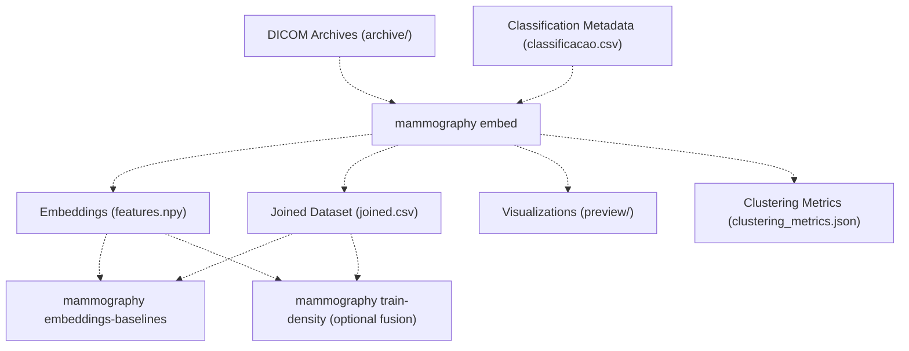
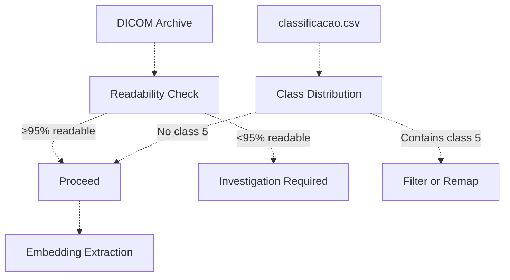
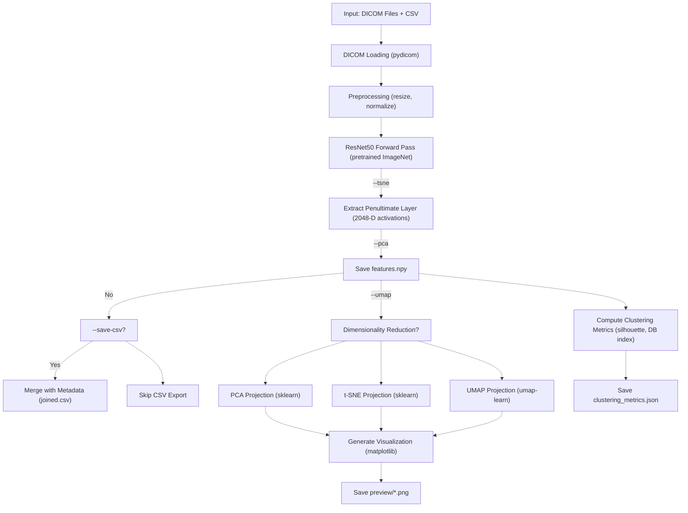
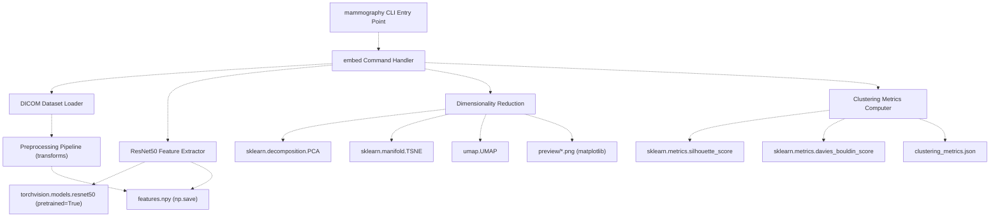

# mammography embed

> **Relevant source files**
> * [Article/01-embeddings.md](https://github.com/ThalesMMS/mammography-pipelines/blob/01443313/Article/01-embeddings.md)
> * [Article/assets/embeddings_pca_tsne.png](https://github.com/ThalesMMS/mammography-pipelines/blob/01443313/Article/assets/embeddings_pca_tsne.png)

## Purpose and Scope

This document describes the `mammography embed` command, which performs the first stage of the two-stage machine learning pipeline: **embedding extraction**. This command processes DICOM mammography images through a pretrained ResNet50 convolutional neural network to generate 2048-dimensional feature vectors (embeddings) that capture high-level visual characteristics of each image.

The embeddings produced by this command serve two primary purposes:

1. As input features for classical machine learning baselines (logistic regression, SVM, random forests)
2. As optional fusion inputs for the density classification training pipeline

For information about training density classifiers using these embeddings, see [mammography train-density](2b%20mammography-train-density.md). For baseline comparisons between embeddings and classical descriptors, see [mammography embeddings-baselines](2e%20mammography-embeddings-baselines.md). For details on the ResNet50 architecture and embedding theory, see [Embedding Extraction (ResNet50)](3a%20Embedding-Extraction-%28ResNet50%29.md).

Sources: Article/01-embeddings.md:1-29

## Overview

The `mammography embed` command extracts deep learning features from mammography DICOM images using a ResNet50 model pretrained on ImageNet. Each DICOM image is preprocessed, passed through the convolutional layers of ResNet50, and the activations from the penultimate layer (before the final classification head) are extracted as a 2048-dimensional feature vector.

In addition to raw embeddings, the command can optionally generate dimensionality reduction visualizations (PCA, t-SNE, UMAP) and compute clustering quality metrics (silhouette score, Davies-Bouldin index) to assess the separability of density classes in the embedding space.

### Role in the Pipeline



**Diagram: Embedding extraction data flow**

Sources: Article/01-embeddings.md:1-6, High-level diagrams (Diagram 2)

## Command Syntax

```html
mammography embed \  --csv <path-to-csv> \  --dicom-root <path-to-dicom-archive> \  --outdir <output-directory> \  [--save-csv] \  [--pca] \  [--tsne] \  [--umap] \  [--seed <random-seed>]
```

Sources: Article/01-embeddings.md:7-14

## Parameters

| Parameter | Type | Required | Default | Description |
| --- | --- | --- | --- | --- |
| `--csv` | Path | Yes | - | Path to the classification CSV file containing AccessionNumber and density labels |
| `--dicom-root` | Path | Yes | - | Root directory containing DICOM archives organized by AccessionNumber |
| `--outdir` | Path | Yes | - | Output directory where embeddings and artifacts will be saved |
| `--save-csv` | Flag | No | False | Save the joined dataset (embeddings + metadata) as `joined.csv` |
| `--pca` | Flag | No | False | Generate PCA dimensionality reduction visualization (2D projection) |
| `--tsne` | Flag | No | False | Generate t-SNE dimensionality reduction visualization (2D projection) |
| `--umap` | Flag | No | False | Generate UMAP dimensionality reduction visualization (2D projection) |
| `--seed` | Integer | No | 42 | Random seed for reproducibility of stochastic operations (t-SNE, UMAP) |

### Parameter Details

**`--csv`**: Points to a CSV file with at minimum two columns: `AccessionNumber` (unique identifier matching DICOM directory names) and a density classification column (typically containing BI-RADS categories A, B, C, D or numeric equivalents 1-4).

**`--dicom-root`**: Directory structure expected:

```
archive/
├── <AccessionNumber_1>/
│   ├── image1.dcm
│   ├── image2.dcm
│   └── ...
├── <AccessionNumber_2>/
│   └── ...
```

**`--outdir`**: All output artifacts are written to this directory. Common convention is `outputs/embeddings_resnet50/`.

**Dimensionality Reduction Flags**: The `--pca`, `--tsne`, and `--umap` flags are independent and can be combined. Each generates a corresponding PNG visualization in `<outdir>/preview/`.

Sources: Article/01-embeddings.md:7-14

## Input Requirements

### DICOM Data Requirements



**Diagram: Input validation requirements**

The command expects:

1. **DICOM Files**: At least 95% of DICOM files referenced in the CSV must be readable. Each AccessionNumber directory should contain one or more `.dcm` files.
2. **Classification CSV**: Must not contain class 5 (excluded from BI-RADS density categories). Valid classes are A/B/C/D (or 1/2/3/4 numeric encoding).
3. **Environment**: Python 3.10+, PyTorch with torchvision, pydicom for DICOM I/O.

Sources: Article/01-embeddings.md:16-20

## Output Artifacts

The `mammography embed` command generates the following artifacts in the `--outdir` directory:

| Artifact | Format | Description |
| --- | --- | --- |
| `features.npy` | NumPy array | Primary output: (N, 2048) array of embeddings for N images |
| `joined.csv` | CSV | Optional: Embeddings joined with metadata from input CSV (requires `--save-csv`) |
| `preview/pca_projection.png` | PNG | Optional: 2D PCA visualization colored by density class (requires `--pca`) |
| `preview/tsne_projection.png` | PNG | Optional: 2D t-SNE visualization colored by density class (requires `--tsne`) |
| `preview/umap_projection.png` | PNG | Optional: 2D UMAP visualization colored by density class (requires `--umap`) |
| `clustering_metrics.json` | JSON | Clustering quality metrics: silhouette score, Davies-Bouldin index, Calinski-Harabasz index |
| `run.log` | Text | Optional: Execution log with timestamps and processing details |

### Output Directory Structure

```markdown
outputs/embeddings_resnet50/
├── features.npy                    # Main embeddings (N x 2048)
├── joined.csv                      # Optional merged dataset
├── clustering_metrics.json         # Clustering quality assessment
├── preview/
│   ├── pca_projection.png         # PCA 2D visualization
│   ├── tsne_projection.png        # t-SNE 2D visualization
│   └── umap_projection.png        # UMAP 2D visualization
└── run.log                         # Execution log (optional)
```

Sources: Article/01-embeddings.md:19-20, High-level diagrams (Diagram 2 and 3)

## Processing Pipeline

The embedding extraction process follows these steps:



**Diagram: Embedding extraction processing pipeline**

### Step-by-Step Processing

1. **DICOM Loading**: Each DICOM file is read using pydicom. Pixel arrays are extracted and converted to grayscale if necessary.
2. **Preprocessing**: Images are resized to 224×224 pixels (ResNet50 input size) and normalized using ImageNet statistics (mean=[0.485, 0.456, 0.406], std=[0.229, 0.224, 0.225]).
3. **Feature Extraction**: The pretrained ResNet50 model processes each image. The output from the layer before the final fully-connected classification layer is extracted, yielding a 2048-dimensional feature vector.
4. **Batch Processing**: Images are processed in batches for efficiency. Progress is logged to stdout and optionally to `run.log`.
5. **Post-Processing**: If dimensionality reduction flags are enabled, the full (N, 2048) embedding matrix is projected to 2D space for visualization. Clustering metrics are computed using the true density labels as ground truth clusters.

Sources: Article/01-embeddings.md:1-6, High-level diagrams (Diagram 2)

## Code Architecture



**Diagram: Code architecture and key libraries**

The implementation likely follows this structure (inferred file paths):

* **CLI Entry Point**: The main command-line interface parser that routes to the embed subcommand
* **Dataset Loading**: Handles DICOM file discovery, loading, and batching
* **Feature Extraction**: Wraps ResNet50 model and extracts intermediate layer activations
* **Dimensionality Reduction**: Applies PCA, t-SNE, or UMAP using scikit-learn and umap-learn
* **Visualization**: Generates scatter plots colored by density class using matplotlib
* **Metrics**: Computes clustering quality metrics to quantify class separability

Sources: Article/01-embeddings.md:1-29, High-level diagrams (Diagram 2)

## Usage Examples

### Basic Embedding Extraction

Extract embeddings without any visualization or CSV export:

```
mammography embed \  --csv classificacao.csv \  --dicom-root archive \  --outdir outputs/embeddings_resnet50
```

This produces only `features.npy` and `clustering_metrics.json`.

### Full Exploration Pipeline

Extract embeddings with all dimensionality reduction visualizations and CSV export:

```
mammography embed \  --csv classificacao.csv \  --dicom-root archive \  --outdir outputs/embeddings_resnet50 \  --save-csv \  --pca \  --tsne \  --umap \  --seed 42
```

This produces:

* `features.npy` (2048-D embeddings)
* `joined.csv` (embeddings + metadata)
* `preview/pca_projection.png`
* `preview/tsne_projection.png`
* `preview/umap_projection.png`
* `clustering_metrics.json`

### Reproducible Research

For reproducibility across runs, explicitly set the random seed:

```
mammography embed \  --csv classificacao.csv \  --dicom-root archive \  --outdir outputs/embeddings_resnet50_seed42 \  --save-csv \  --pca \  --tsne \  --seed 42
```

This ensures that stochastic algorithms (t-SNE, UMAP) produce identical results.

Sources: Article/01-embeddings.md:7-14

## Reproducibility Checklist

Before running the embedding extraction command, verify:

* **DICOM Readability**: At least 95% of DICOM files in `archive/<AccessionNumber>/*.dcm` are readable by pydicom
* **Classification Data**: `classificacao.csv` does not contain class 5; only classes A/B/C/D (or 1/2/3/4) are present
* **Environment Setup**: Python 3.10+, PyTorch, torchvision, pydicom, scikit-learn, umap-learn installed
* **Random Seed**: Fixed seed (e.g., 42) is explicitly set via `--seed` for reproducible t-SNE/UMAP
* **Output Directory**: `--outdir` path is writable and has sufficient disk space (embeddings are typically 1-10 MB per 1000 images)
* **Execution Log**: Consider redirecting stdout to a log file or enabling `run.log` generation for audit trail

After execution, verify:

* `features.npy` has shape (N, 2048) where N matches the number of rows in CSV
* `clustering_metrics.json` contains numerical values for silhouette_score, davies_bouldin_score
* If `--save-csv` was used, `joined.csv` contains all original CSV columns plus embedding columns
* If dimensionality reduction flags were used, corresponding PNG files exist in `preview/`

Sources: Article/01-embeddings.md:16-21

## Performance Characteristics

### Computational Requirements

* **GPU**: Highly recommended. ResNet50 forward passes are 10-50× faster on GPU than CPU
* **Memory**: Approximately 2-4 GB GPU memory for batch processing
* **Disk I/O**: DICOM reading is typically I/O bound. SSD storage significantly reduces processing time
* **Processing Time**: Approximately 1-5 seconds per image on modern GPUs, 10-60 seconds per image on CPU

### Output Size Estimates

| Dataset Size | features.npy Size | joined.csv Size (approximate) |
| --- | --- | --- |
| 100 images | ~800 KB | ~850 KB |
| 1,000 images | ~8 MB | ~8.5 MB |
| 10,000 images | ~80 MB | ~85 MB |
| 54,000 images (RSNA) | ~430 MB | ~460 MB |

Sources: High-level diagrams (Diagram 4)

## Integration with Downstream Tasks

### Classical Machine Learning Baselines

The `features.npy` and `joined.csv` outputs are consumed by the `mammography embeddings-baselines` command, which trains classical ML models (logistic regression, SVM, random forests) on the embeddings:

```
mammography embeddings-baselines \  --embeddings-dir outputs/embeddings_resnet50
```

Results indicate that embeddings + logistic regression achieve balanced accuracy ~0.51 (κ=0.45), significantly outperforming classical descriptors (BA ~0.40, κ=0.30) with p-value 0.004.

See [mammography embeddings-baselines](2e%20mammography-embeddings-baselines.md) for details.

### Density Classification Training

The embeddings can optionally be fused as additional input features to the EfficientNetB0 density classifier:

```
mammography train-density \  --csv classificacao.csv \  --dicom-root archive \  --embeddings outputs/embeddings_resnet50/features.npy \  --outdir outputs/mammo_efficientnetb0_density
```

Fusion experiments showed marginal improvements in some configurations. See [Density Classification (EfficientNetB0)](3b%20Density-Classification-%28EfficientNetB0%29.md) for fusion strategies.

Sources: Article/01-embeddings.md:28-29, High-level diagrams (Diagram 2)

## Troubleshooting

### Common Issues

**"DICOM file not readable"**: Ensure DICOM files are valid. Use `pydicom.dcmread()` to test individual files. Some corrupted DICOM files may need to be excluded.

**"Shape mismatch in features.npy"**: Verify that all AccessionNumbers in the CSV have corresponding directories in `archive/`. Missing directories will cause shape mismatches.

**"Out of memory (OOM) error"**: Reduce batch size or switch to CPU processing if GPU memory is insufficient.

**"t-SNE/UMAP produces different results"**: Ensure `--seed` is explicitly set. These algorithms have inherent randomness that must be controlled with a fixed seed.

**"PCA visualization shows no separation"**: This may indicate that linear projections are insufficient to separate density classes. Try t-SNE or UMAP for nonlinear projections.

Sources: Article/01-embeddings.md:16-20

## Related Commands

* [mammography train-density](2b%20mammography-train-density.md): Train density classifiers using optional embedding fusion
* [mammography embeddings-baselines](2e%20mammography-embeddings-baselines.md): Evaluate classical ML models on extracted embeddings
* [Embedding Extraction (ResNet50)](3a%20Embedding-Extraction-%28ResNet50%29.md): Detailed explanation of ResNet50 architecture and embedding theory
* [DICOM Datasets](4a%20DICOM-Datasets.md): Information about IRMA and RSNA dataset structure

Sources: Article/01-embeddings.md:1-29, Table of contents


### On this page

* [mammography embed](#2.1-mammography-embed)
* [Purpose and Scope](#2.1-purpose-and-scope)
* [Overview](#2.1-overview)
* [Role in the Pipeline](#2.1-role-in-the-pipeline)
* [Command Syntax](#2.1-command-syntax)
* [Parameters](#2.1-parameters)
* [Parameter Details](#2.1-parameter-details)
* [Input Requirements](#2.1-input-requirements)
* [DICOM Data Requirements](#2.1-dicom-data-requirements)
* [Output Artifacts](#2.1-output-artifacts)
* [Output Directory Structure](#2.1-output-directory-structure)
* [Processing Pipeline](#2.1-processing-pipeline)
* [Step-by-Step Processing](#2.1-step-by-step-processing)
* [Code Architecture](#2.1-code-architecture)
* [Usage Examples](#2.1-usage-examples)
* [Basic Embedding Extraction](#2.1-basic-embedding-extraction)
* [Full Exploration Pipeline](#2.1-full-exploration-pipeline)
* [Reproducible Research](#2.1-reproducible-research)
* [Reproducibility Checklist](#2.1-reproducibility-checklist)
* [Performance Characteristics](#2.1-performance-characteristics)
* [Computational Requirements](#2.1-computational-requirements)
* [Output Size Estimates](#2.1-output-size-estimates)
* [Integration with Downstream Tasks](#2.1-integration-with-downstream-tasks)
* [Classical Machine Learning Baselines](#2.1-classical-machine-learning-baselines)
* [Density Classification Training](#2.1-density-classification-training)
* [Troubleshooting](#2.1-troubleshooting)
* [Common Issues](#2.1-common-issues)
* [Related Commands](#2.1-related-commands)

Ask Devin about mammography-pipelines