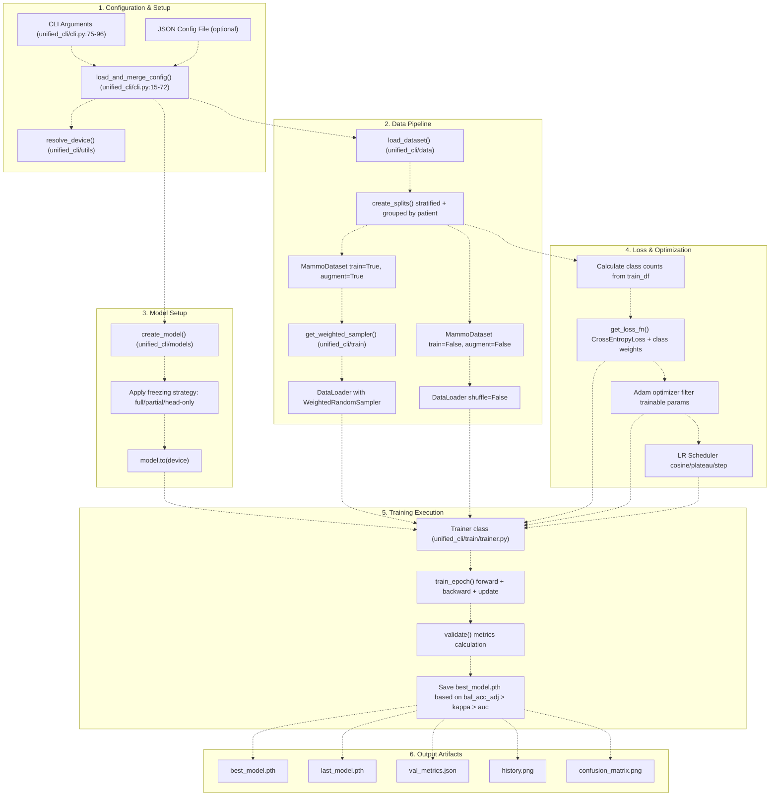
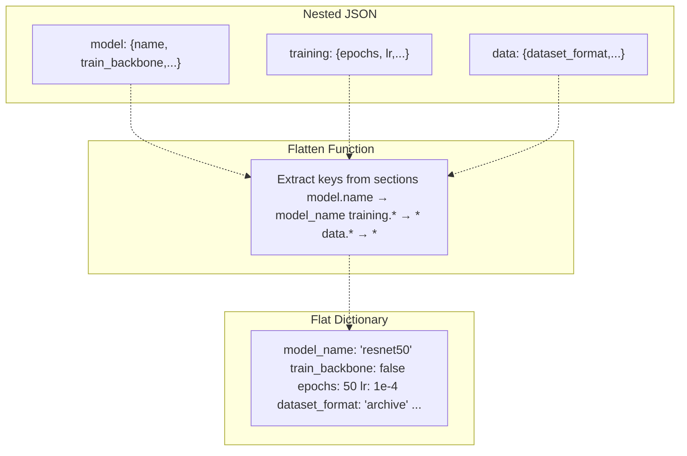
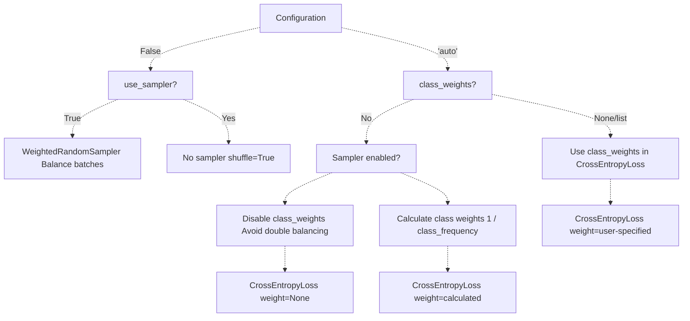
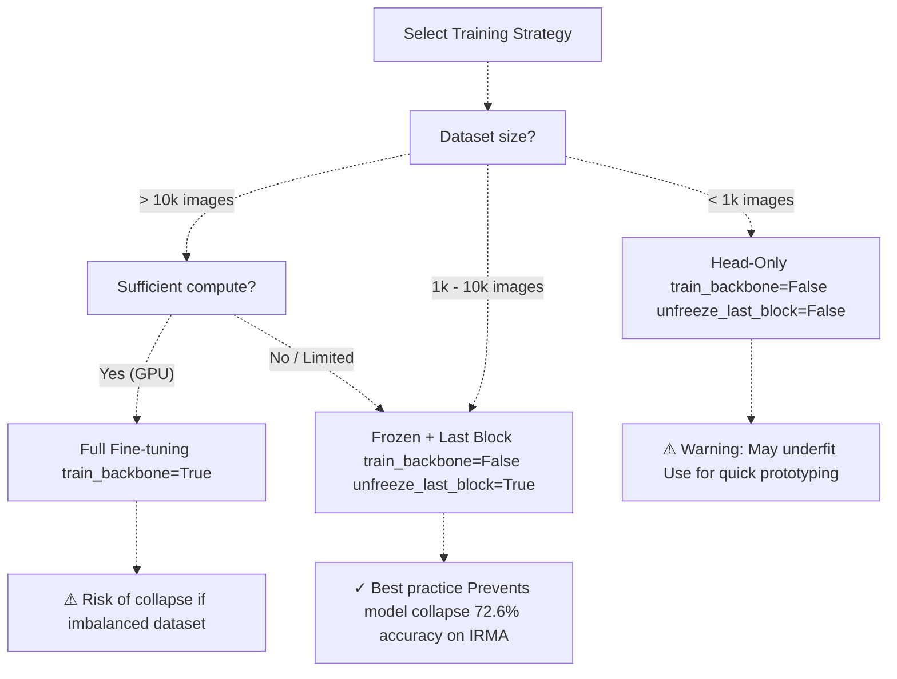
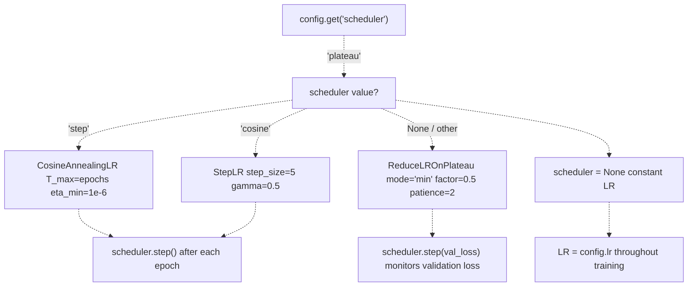
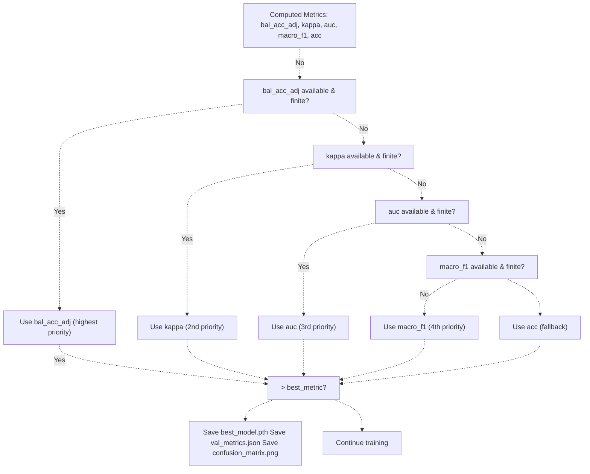

# Training Models

> **Relevant source files**
> * [Article/02-density.md](https://github.com/ThalesMMS/mammography-pipelines/blob/01443313/Article/02-density.md)
> * [Article/article.md](https://github.com/ThalesMMS/mammography-pipelines/blob/01443313/Article/article.md)

## Purpose and Scope

This page describes the **model training pipeline** implemented in the `unified_cli` system. It covers the `train` command, configuration options, training strategies (backbone freezing, optimizer selection, learning rate scheduling), and the artifacts produced during and after training.

For information about:

* The data loading and preprocessing that feeds into training, see [Data Pipeline](3a%20Embedding-Extraction-%28ResNet50%29.md)
* Model architectures and the model registry, see [Model Architectures](3b%20Density-Classification-%28EfficientNetB0%29.md)
* Training loop implementation details, metrics calculation, and loss functions, see [Training System](3c%20Transfer-Learning-Strategies.md)
* Preventing model collapse in imbalanced datasets, see [Model Collapse Prevention](5a%20Performance-Metrics.md)
* Transfer learning strategies and when to use each, see [Transfer Learning Strategies](5b%20Confusion-Matrices-and-Per-Class-Analysis.md)
* Understanding the output artifacts (checkpoints, metrics), see [Understanding Training Outputs](6a%20Random-Seeds-and-Variability.md)

---

## Command-Line Interface

### Basic Usage

The training pipeline is invoked through the `unified_cli` module:

```
python -m unified_cli train [OPTIONS]
```

**Sources:** [unified_cli/cli.py L74-L138](https://github.com/ThalesMMS/mammography-pipelines/blob/01443313/unified_cli/cli.py#L74-L138)

### Common Training Commands

**Example 1: Train ResNet50 with frozen backbone + unfrozen last block (recommended)**

```
python -m unified_cli train \    --dataset-format auto \    --csv data/classificacao.csv \    --model resnet50 \    --classes 4 \    --epochs 50 \    --batch-size 16 \    --no-train-backbone \    --unfreeze-last-block \    --outdir outputs/experiment_01
```

**Example 2: Train with JSON configuration file**

```
python -m unified_cli train --config-file configs/resnet_frozen.json
```

**Example 3: Binary classification (AB vs CD)**

```
python -m unified_cli train \    --model efficientnetb0 \    --classes 2 \    --epochs 30 \    --use-sampler \    --class-weights auto
```

**Sources:** README.md

 [Article/article.md L457-L470](https://github.com/ThalesMMS/mammography-pipelines/blob/01443313/Article/article.md#L457-L470)

---

## Configuration Parameters

### Data Configuration

| Parameter | Type | Default | Description |
| --- | --- | --- | --- |
| `--dataset-format` | str | `"auto"` | Dataset format: `auto`, `archive`, `mamografias`, `patches` |
| `--csv` | str | None | Path to CSV file with labels |
| `--dicom-root` | str | None | Root directory for DICOM files |
| `--dataset-root` | str | None | Root directory for dataset |
| `--image-size` | int | 224 | Image size (square) for resize |
| `--augment` / `--no-augment` | bool | True | Enable/disable data augmentation |
| `--val-frac` | float | 0.2 | Validation split fraction |

### Model Configuration

| Parameter | Type | Default | Description |
| --- | --- | --- | --- |
| `--model` | str | `"resnet50"` | Model architecture: `resnet50`, `efficientnetb0` |
| `--classes` | int | 4 | Number of output classes (2 or 4) |
| `--train-backbone` / `--no-train-backbone` | bool | False | Train entire backbone (False = frozen) |
| `--unfreeze-last-block` / `--no-unfreeze-last-block` | bool | False | Unfreeze last convolutional block |

### Training Hyperparameters

| Parameter | Type | Default | Description |
| --- | --- | --- | --- |
| `--epochs` | int | 50 | Number of training epochs |
| `--batch-size` | int | 16 | Batch size for training/validation |
| `--lr` | float | 1e-4 | Initial learning rate |
| `--optimizer` | str | `"adam"` | Optimizer (configured via JSON) |
| `--scheduler` | str | None | LR scheduler: `"cosine"`, `"plateau"`, `"step"` |
| `--class-weights` | str | `"auto"` | Class weights for loss: `"auto"`, `"none"`, or list |
| `--use-sampler` | bool | True | Enable `WeightedRandomSampler` for batch balancing |
| `--amp-enabled` | bool | False | Enable mixed precision training (AMP) |

### System Configuration

| Parameter | Type | Default | Description |
| --- | --- | --- | --- |
| `--device` | str | `"auto"` | Device: `auto`, `cuda`, `mps`, `cpu` |
| `--num-workers` | int | 0 | DataLoader worker processes |
| `--outdir` | str | `"outputs"` | Output directory for artifacts |

**Sources:** [unified_cli/cli.py L75-L96](https://github.com/ThalesMMS/mammography-pipelines/blob/01443313/unified_cli/cli.py#L75-L96)

 [unified_cli/tasks/train_task.py L17-L38](https://github.com/ThalesMMS/mammography-pipelines/blob/01443313/unified_cli/tasks/train_task.py#L17-L38)

---

## Training Pipeline Flow

### Overall Pipeline Architecture



**Sources:** [unified_cli/tasks/train_task.py L15-L208](https://github.com/ThalesMMS/mammography-pipelines/blob/01443313/unified_cli/tasks/train_task.py#L15-L208)

 [unified_cli/train/trainer.py L18-L222](https://github.com/ThalesMMS/mammography-pipelines/blob/01443313/unified_cli/train/trainer.py#L18-L222)

---

## Configuration Management

### JSON Configuration Files

Configuration files provide structured, nested settings that are flattened when merged with CLI arguments. The system supports three configuration sections: `model`, `training`, and `data`.

**Example Configuration File:**

```
{  "model": {    "name": "resnet50",    "pretrained_path": null,    "input_channels": 3,    "train_backbone": false,    "unfreeze_last_block": true  },  "training": {    "epochs": 50,    "batch_size": 16,    "lr": 1e-4,    "class_weights": "auto",    "val_frac": 0.2,    "optimizer": "adam",    "scheduler": "cosine",    "amp_enabled": false,    "use_sampler": true,    "num_workers": 4  },  "data": {    "dataset_format": "archive",    "mean": null,    "std": null,    "image_size": 224  }}
```

### Configuration Merging Priority

The `load_and_merge_config()` function implements the following priority:

1. **CLI defaults** (lowest priority)
2. **JSON config file** (overwrites CLI defaults)
3. **Explicit CLI arguments** (not currently distinguished from defaults - noted as limitation)

**Flattening Process:**



**Sources:** [unified_cli/cli.py L15-L72](https://github.com/ThalesMMS/mammography-pipelines/blob/01443313/unified_cli/cli.py#L15-L72)

 [unified_cli/cli.py L101-L126](https://github.com/ThalesMMS/mammography-pipelines/blob/01443313/unified_cli/cli.py#L101-L126)

---

## Training Pipeline Orchestration

### The train_pipeline() Function

The `train_pipeline()` function in [unified_cli/tasks/train_task.py L15-L208](https://github.com/ThalesMMS/mammography-pipelines/blob/01443313/unified_cli/tasks/train_task.py#L15-L208)

 orchestrates the entire training process:

**Step-by-Step Execution:**

| Step | Function | Purpose |
| --- | --- | --- |
| 1 | `resolve_device()` | Auto-detect hardware (CUDA → MPS → CPU) |
| 2 | `load_dataset()` | Parse CSV/DICOM, detect format |
| 3 | `create_splits()` | Stratified group split (train/val) |
| 4 | `MammoDataset` (×2) | Create train/val datasets with transforms |
| 5 | `get_weighted_sampler()` | Create balanced batch sampler |
| 6 | `DataLoader` (×2) | Create train/val loaders |
| 7 | `create_model()` | Instantiate model from registry |
| 8 | Apply freezing strategy | Freeze backbone, unfreeze last block if configured |
| 9 | `get_loss_fn()` | Create `CrossEntropyLoss` with optional class weights |
| 10 | Create optimizer | Adam optimizer with trainable parameters only |
| 11 | Create scheduler | Optional CosineAnnealing/ReduceLROnPlateau/StepLR |
| 12 | `Trainer()` | Instantiate trainer with all components |
| 13 | `trainer.fit()` | Execute training loop |

**Sources:** [unified_cli/tasks/train_task.py L15-L208](https://github.com/ThalesMMS/mammography-pipelines/blob/01443313/unified_cli/tasks/train_task.py#L15-L208)

### Balanced Sampling vs Class-Weighted Loss

The system implements **mutually exclusive** balancing strategies to prevent double-compensation:



**Implementation Logic:**

```
# Lines 93-105 in train_task.pyuse_sampler = config.get("use_sampler")if use_sampler is None:    use_sampler = config.get("class_weights") == "auto"if use_sampler:    sampler = get_weighted_sampler(train_df, num_classes)    shuffle = False    effective_class_weights = None  # Disable to avoid double-compensationelse:    effective_class_weights = config.get("class_weights")
```

**Sources:** [unified_cli/tasks/train_task.py L93-L106](https://github.com/ThalesMMS/mammography-pipelines/blob/01443313/unified_cli/tasks/train_task.py#L93-L106)

 [unified_cli/train/trainer.py L1-L223](https://github.com/ThalesMMS/mammography-pipelines/blob/01443313/unified_cli/train/trainer.py#L1-L223)

---

## Training Strategies

### Backbone Freezing Configurations

The system supports three training strategies with different computational/memory trade-offs:

| Strategy | `train_backbone` | `unfreeze_last_block` | Trainable Params | Use Case |
| --- | --- | --- | --- | --- |
| **Full Fine-tuning** | True | N/A | ~23M (ResNet50) | Large datasets, sufficient compute |
| **Frozen + Last Block** | False | True | ~2.4M (ResNet50) | **Recommended**: Prevents collapse, good generalization |
| **Head-Only** | False | False | ~8K (ResNet50) | Quick experiments, very small datasets |

### Training Strategy Selection Diagram



**Performance Results (IRMA 4-class):**

| Strategy | Accuracy | Kappa | AUC | Val Loss | Status |
| --- | --- | --- | --- | --- | --- |
| Full Fine-tuning | 1.57% | 0.0 | 0.595 | - | ❌ Model collapse (run1) |
| Frozen + Last Block (3 epochs) | 63.5% | 0.45 | 0.85 | - | ✓ Convergent |
| Frozen + Last Block (10 epochs) | **72.6%** | **0.57** | **0.88** | 0.645 | ✓ **Best model** (run4) |

**Sources:** [Article/article.md L71-L76](https://github.com/ThalesMMS/mammography-pipelines/blob/01443313/Article/article.md#L71-L76)

 [Article/article.md L293-L318](https://github.com/ThalesMMS/mammography-pipelines/blob/01443313/Article/article.md#L293-L318)

 [README.md L27-L28](https://github.com/ThalesMMS/mammography-pipelines/blob/01443313/README.md#L27-L28)

---

## Optimizer and Scheduler Configuration

### Optimizer Setup

The system uses **Adam optimizer** by default, applied only to trainable parameters:

```
# Lines 165-168 in train_task.pyoptimizer = optim.Adam(    filter(lambda p: p.requires_grad, model.parameters()),     lr=config.get("lr", 1e-4))
```

**Trainable Parameter Filtering:**

* When `train_backbone=False`, only classification head parameters have `requires_grad=True`
* When `unfreeze_last_block=True`, last convolutional block is also trainable
* `filter(lambda p: p.requires_grad, ...)` ensures optimizer only updates unfrozen parameters

**Sources:** [unified_cli/tasks/train_task.py L164-L168](https://github.com/ThalesMMS/mammography-pipelines/blob/01443313/unified_cli/tasks/train_task.py#L164-L168)

### Learning Rate Schedulers

Three scheduler types are supported via the `--scheduler` parameter:

#### 1. CosineAnnealingLR

**Purpose:** Smooth cyclic learning rate decay
**Configuration:**

```
scheduler = optim.lr_scheduler.CosineAnnealingLR(    optimizer,    T_max=config.get("epochs", 50),    eta_min=config.get("min_lr", 1e-6))
```

**Behavior:** LR decreases from initial `lr` to `eta_min` following cosine curve over `T_max` epochs
**Update:** Called after every epoch: `scheduler.step()`

#### 2. ReduceLROnPlateau

**Purpose:** Adaptive learning rate reduction when validation loss plateaus
**Configuration:**

```
scheduler = optim.lr_scheduler.ReduceLROnPlateau(    optimizer,    mode="min",    factor=0.5,    patience=2,    min_lr=config.get("min_lr", 1e-6))
```

**Behavior:** Multiplies LR by `factor=0.5` if validation loss doesn't improve for `patience=2` epochs
**Update:** Called with validation loss: `scheduler.step(val_metrics["loss"])`

#### 3. StepLR

**Purpose:** Periodic learning rate decay
**Configuration:**

```
scheduler = optim.lr_scheduler.StepLR(    optimizer,    step_size=config.get("step_size", 5),    gamma=config.get("gamma", 0.5))
```

**Behavior:** Multiplies LR by `gamma=0.5` every `step_size=5` epochs
**Update:** Called after every epoch: `scheduler.step()`

### Scheduler Selection Logic



**Sources:** [unified_cli/tasks/train_task.py L170-L192](https://github.com/ThalesMMS/mammography-pipelines/blob/01443313/unified_cli/tasks/train_task.py#L170-L192)

 [unified_cli/train/trainer.py L138-L143](https://github.com/ThalesMMS/mammography-pipelines/blob/01443313/unified_cli/train/trainer.py#L138-L143)

---

## Training Loop Execution

### The Trainer Class

The `Trainer` class in [unified_cli/train/trainer.py L18-L222](https://github.com/ThalesMMS/mammography-pipelines/blob/01443313/unified_cli/train/trainer.py#L18-L222)

 implements the training loop with the following components:

**Initialization:**

```
def __init__(    self,    model: nn.Module,    train_loader: DataLoader,    val_loader: DataLoader,    criterion: nn.Module,    optimizer: optim.Optimizer,    device: torch.device,    scheduler: Optional[Any] = None,    config: Dict[str, Any] = None):
```

**Key Attributes:**

* `self.scaler`: `torch.cuda.amp.GradScaler` if AMP enabled (for mixed precision)
* `self.history`: List of per-epoch metrics
* `self.best_metric`: Tracks best validation metric for checkpoint saving
* `self.best_val_metrics`: Stores all metrics from best epoch

**Sources:** [unified_cli/train/trainer.py L18-L50](https://github.com/ThalesMMS/mammography-pipelines/blob/01443313/unified_cli/train/trainer.py#L18-L50)

### Training Epoch Flow

```mermaid
flowchart TD

TrainMode["model.train()"]
AMP["AMP enabled?"]
Autocast["torch.cuda.amp.autocast: forward in FP16"]
NormalForward["forward in FP32"]
Forward["logits = model(x)"]
Loss["loss = criterion(logits, y)"]
Backward["AMP?"]
ScaledBackward["scaler.scale(loss).backward() scaler.step(optimizer) scaler.update()"]
NormalBackward["loss.backward() optimizer.step()"]
Metrics["Accumulate: total_loss correct predictions total samples"]
Return["Return: avg_loss accuracy"]
Iterator["Iterate batches with tqdm progress bar"]
Unpack["x, y, meta = batch"]
ToDevice["x.to(device) y.to(device)"]
ZeroGrad["optimizer.zero_grad()"]

subgraph train_epoch() ["train_epoch()"]
    TrainMode
    AMP
    Autocast
    NormalForward
    Forward
    Loss
    Backward
    ScaledBackward
    NormalBackward
    Metrics
    Return
    Iterator
    Unpack
    ToDevice
    ZeroGrad
    AMP -.->|"Yes"| Autocast
    AMP -.->|"No"| NormalForward
    Autocast -.->|"Yes"| Forward
    NormalForward -.->|"No"| Forward
    Forward -.-> Loss
    Loss -.-> Backward
    Backward -.-> ScaledBackward
    Backward -.-> NormalBackward
    ScaledBackward -.-> Metrics
    NormalBackward -.-> Metrics
    Metrics -.-> Return
    TrainMode -.-> Iterator
    Iterator -.-> Unpack
    Unpack -.-> ToDevice
    ToDevice -.-> ZeroGrad
    ZeroGrad -.-> AMP
end
```

**Key Implementation Details:**

1. **Batch Format:** Batches are tuples `(x, y, meta)` where `meta` contains file paths and accession numbers
2. **Non-blocking Transfer:** `x.to(device, non_blocking=True)` for overlapped CPU→GPU transfer
3. **AMP Context:** `torch.cuda.amp.autocast(enabled=self.amp_enabled)` wraps forward pass
4. **Gradient Scaling:** `GradScaler` prevents underflow in FP16 training

**Sources:** [unified_cli/train/trainer.py L52-L89](https://github.com/ThalesMMS/mammography-pipelines/blob/01443313/unified_cli/train/trainer.py#L52-L89)

### Validation Phase Flow

```mermaid
flowchart TD

EvalMode["model.eval()"]
NoGrad["@torch.no_grad()"]
Iterator["Iterate val_loader"]
Unpack["x, y, meta = batch"]
ToDevice["x.to(device)"]
Forward["logits = model(x) with autocast if AMP"]
Loss["loss = criterion(logits, y)"]
Softmax["probs = softmax(logits)"]
Argmax["preds = argmax(logits)"]
Accumulate["Accumulate: all_preds all_targets all_probs"]
Concat["Concatenate all batches: y_pred, y_true, y_prob"]
CalcMetrics["calculate_metrics() accuracy, kappa, balanced_acc, AUC, F1"]
AddCounts["Add: true_counts (bincount) pred_counts (bincount) pred_unique (# classes predicted)"]
Return["Return metrics dict"]

subgraph validate() ["validate()"]
    EvalMode
    NoGrad
    Iterator
    Unpack
    ToDevice
    Forward
    Loss
    Softmax
    Argmax
    Accumulate
    Concat
    CalcMetrics
    AddCounts
    Return
    EvalMode -.-> NoGrad
    NoGrad -.-> Iterator
    Iterator -.-> Unpack
    Unpack -.-> ToDevice
    ToDevice -.-> Forward
    Forward -.-> Loss
    Forward -.-> Softmax
    Forward -.-> Argmax
    Softmax -.-> Accumulate
    Argmax -.-> Accumulate
    Loss -.-> Accumulate
    Accumulate -.-> Concat
    Concat -.-> CalcMetrics
    CalcMetrics -.-> AddCounts
    AddCounts -.-> Return
end
```

**Validation Metrics Computed:**

| Metric | Key in Dict | Purpose |
| --- | --- | --- |
| Accuracy | `acc` | Simple correctness |
| Balanced Accuracy (Adjusted) | `bal_acc_adj` | Chance-corrected class-weighted accuracy |
| Cohen's Kappa | `kappa` | Agreement beyond random chance |
| AUC (One-vs-Rest) | `auc` | Area under ROC curve (multiclass) |
| Macro F1 | `macro_f1` | Unweighted average of per-class F1 |
| Confusion Matrix | `confusion_matrix` | Per-class error matrix |
| Loss | `loss` | Average validation loss |
| Prediction Distribution | `pred_counts`, `pred_unique` | Detects model collapse |

**Sources:** [unified_cli/train/trainer.py L91-L129](https://github.com/ThalesMMS/mammography-pipelines/blob/01443313/unified_cli/train/trainer.py#L91-L129)

 [unified_cli/train/metrics.py L1-L100](https://github.com/ThalesMMS/mammography-pipelines/blob/01443313/unified_cli/train/metrics.py#L1-L100)

---

## Checkpointing and Metric Prioritization

### Best Model Selection Strategy

The system implements a **hierarchical metric prioritization** for selecting the best model checkpoint:



**Rationale for Prioritization:**

1. **`bal_acc_adj`**: Balanced accuracy adjusted for chance - detects collapse even if overall accuracy is high
2. **`kappa`**: Cohen's Kappa - measures agreement beyond random prediction, robust to imbalance
3. **`auc`**: AUC (One-vs-Rest) - measures ranking quality across all classes
4. **`macro_f1`**: Macro F1 - unweighted average treats all classes equally
5. **`acc`**: Simple accuracy - fallback if robust metrics unavailable

**Implementation:**

```
# Lines 173-192 in trainer.pyfor k in ["bal_acc_adj", "kappa", "auc", "macro_f1", "acc"]:    v = val_metrics.get(k)    if _finite(v):        metric_name = k        current_metric = float(v)        breakif current_metric is not None and current_metric > self.best_metric:    self.best_metric = current_metric    torch.save(self.model.state_dict(), "checkpoints/best_model.pth")
```

**Sources:** [unified_cli/train/trainer.py L173-L213](https://github.com/ThalesMMS/mammography-pipelines/blob/01443313/unified_cli/train/trainer.py#L173-L213)

 [Article/article.md L86-L90](https://github.com/ThalesMMS/mammography-pipelines/blob/01443313/Article/article.md#L86-L90)

### Checkpoint Files

**Two checkpoints are saved:**

| File | Trigger | Purpose |
| --- | --- | --- |
| `best_model.pth` | When primary metric improves | Model with best validation performance |
| `last_model.pth` | Every epoch | Most recent model (for recovery/debugging) |

**Location:** `{outdir}/checkpoints/`

**Sources:** [unified_cli/train/trainer.py L191-L216](https://github.com/ThalesMMS/mammography-pipelines/blob/01443313/unified_cli/train/trainer.py#L191-L216)

---

## Mixed Precision Training (AMP)

### Automatic Mixed Precision Support

The system supports **Automatic Mixed Precision (AMP)** training for NVIDIA GPUs with Tensor Cores:

**Enabling AMP:**

```
python -m unified_cli train --amp-enabled
```

**Implementation:**

```sql
# Initialization (trainer.py:43)self.scaler = torch.cuda.amp.GradScaler() if amp_enabled and device.type == "cuda" else None# Training step (trainer.py:67-77)with torch.cuda.amp.autocast(enabled=self.amp_enabled):    logits = self.model(x)    loss = self.criterion(logits, y)    if self.scaler:    self.scaler.scale(loss).backward()    self.scaler.step(self.optimizer)    self.scaler.update()else:    loss.backward()    self.optimizer.step()
```

### AMP Benefits and Trade-offs

| Aspect | Benefit/Trade-off |
| --- | --- |
| **Memory Usage** | ~40% reduction (FP16 vs FP32) → larger batch sizes possible |
| **Training Speed** | ~2-3× faster on Tensor Core GPUs (V100, A100, RTX 30xx) |
| **Numerical Stability** | `GradScaler` prevents gradient underflow in FP16 |
| **Accuracy** | Minimal impact on final model accuracy (~0-2% difference) |
| **Hardware Requirements** | Only effective on CUDA devices with Tensor Cores |

**When to Use AMP:**

* ✓ Training on NVIDIA GPUs with Tensor Cores
* ✓ Large models or batch sizes limited by GPU memory
* ✓ Need faster iteration cycles
* ✗ CPU training (no benefit)
* ✗ MPS/Metal backends (not supported)

**Sources:** [unified_cli/train/trainer.py L42-L43](https://github.com/ThalesMMS/mammography-pipelines/blob/01443313/unified_cli/train/trainer.py#L42-L43)

 [unified_cli/train/trainer.py L67-L77](https://github.com/ThalesMMS/mammography-pipelines/blob/01443313/unified_cli/train/trainer.py#L67-L77)

 [unified_cli/train/trainer.py L105-L107](https://github.com/ThalesMMS/mammography-pipelines/blob/01443313/unified_cli/train/trainer.py#L105-L107)

---

## Output Artifacts

### Directory Structure

After training, the output directory contains:

```python
{outdir}/
├── checkpoints/
│   ├── best_model.pth          # Model with best validation metric
│   └── last_model.pth           # Model from final epoch
├── metrics/
│   ├── val_metrics.json         # Best epoch validation metrics
│   ├── best_val_metrics.png     # Confusion matrix of best epoch
│   └── history.png              # Training/validation curves
└── logs/                        # (if logging configured)
```

**Sources:** [unified_cli/train/trainer.py L48-L50](https://github.com/ThalesMMS/mammography-pipelines/blob/01443313/unified_cli/train/trainer.py#L48-L50)

### val_metrics.json Structure

**Example:**

```
{  "loss": 0.645,  "acc": 0.726,  "bal_acc_adj": 0.514,  "kappa": 0.570,  "macro_f1": 0.610,  "auc": 0.880,  "confusion_matrix": [[2, 6, 0, 0], [4, 58, 11, 0], [0, 42, 98, 30], [0, 1, 9, 57]],  "per_class_precision": [0.33, 0.54, 0.83, 0.66],  "per_class_recall": [0.25, 0.79, 0.58, 0.85],  "per_class_f1": [0.29, 0.64, 0.68, 0.74],  "true_counts": [8, 73, 170, 67],  "pred_counts": [6, 107, 118, 87],  "pred_unique": 4}
```

**Key Fields:**

| Field | Description |
| --- | --- |
| `confusion_matrix` | NxN matrix where `[i][j]` = # samples of true class `i` predicted as `j` |
| `pred_unique` | Number of distinct classes predicted (should = num_classes; if < num_classes, indicates collapse) |
| `true_counts` | Distribution of true labels in validation set |
| `pred_counts` | Distribution of predictions (detect bias toward majority class) |
| `per_class_*` | Lists of per-class metrics (length = num_classes) |

**Sources:** [unified_cli/train/trainer.py L202-L213](https://github.com/ThalesMMS/mammography-pipelines/blob/01443313/unified_cli/train/trainer.py#L202-L213)

 [unified_cli/train/trainer.py L123-L128](https://github.com/ThalesMMS/mammography-pipelines/blob/01443313/unified_cli/train/trainer.py#L123-L128)

### Training History Plot

The `history.png` file visualizes training progression:

**Contents:**

* **Top subplot:** Training loss vs Validation loss (detect overfitting)
* **Bottom subplot:** Training accuracy vs Validation accuracy

**Indicators:**

* **Convergence:** Both train/val metrics stabilizing
* **Overfitting:** Train loss decreasing while val loss increases
* **Underfitting:** Both train/val metrics plateauing at poor values

**Example Patterns:**

| Pattern | Train Loss | Val Loss | Interpretation |
| --- | --- | --- | --- |
| Good convergence | Decreasing, stabilizes | Decreasing, stabilizes | Model learning well |
| Overfitting | Continues decreasing | Increases after epoch N | Stopped too late, use earlier checkpoint |
| Underfitting | High, plateaus | High, plateaus | Need more capacity or longer training |
| Model collapse | Very low | Very low | Check `pred_unique` - likely predicting single class |

**Sources:** [unified_cli/train/trainer.py L219](https://github.com/ThalesMMS/mammography-pipelines/blob/01443313/unified_cli/train/trainer.py#L219-L219)

 [unified_cli/train/metrics.py L100-L150](https://github.com/ThalesMMS/mammography-pipelines/blob/01443313/unified_cli/train/metrics.py#L100-L150)

---

## Practical Training Examples

### Example 1: Recommended Configuration (IRMA 4-class)

**Achieved 72.6% accuracy, 0.57 Kappa (best documented result)**

```
python -m unified_cli train \    --dataset-format archive \    --csv data/classificacao.csv \    --dicom-root data/archive \    --model resnet50 \    --classes 4 \    --epochs 10 \    --batch-size 16 \    --lr 1e-4 \    --no-train-backbone \    --unfreeze-last-block \    --use-sampler \    --scheduler cosine \    --outdir outputs/resnet_frozen_best
```

**Key Settings:**

* Frozen backbone + unfrozen last block (prevents collapse)
* `WeightedRandomSampler` for batch balancing
* CosineAnnealingLR for smooth learning rate decay
* 10 epochs (sufficient for convergence)

**Sources:** [Article/article.md L312-L318](https://github.com/ThalesMMS/mammography-pipelines/blob/01443313/Article/article.md#L312-L318)

 [Article/article.md L457-L470](https://github.com/ThalesMMS/mammography-pipelines/blob/01443313/Article/article.md#L457-L470)

### Example 2: Binary Classification (High Accuracy)

**Achieved 92.5% accuracy for AB vs CD classification**

```
python -m unified_cli train \    --dataset-format archive \    --csv data/classificacao.csv \    --model efficientnetb0 \    --classes 2 \    --epochs 30 \    --batch-size 16 \    --no-train-backbone \    --unfreeze-last-block \    --use-sampler \    --outdir outputs/efficientnet_binary
```

**Key Settings:**

* `--classes 2` converts labels: {1,2}→0, {3,4}→1
* EfficientNetB0 (more parameter-efficient than ResNet50)
* Binary classification significantly easier than 4-class

**Sources:** [Article/article.md L244-L262](https://github.com/ThalesMMS/mammography-pipelines/blob/01443313/Article/article.md#L244-L262)

 [Article/article.md L423-L424](https://github.com/ThalesMMS/mammography-pipelines/blob/01443313/Article/article.md#L423-L424)

### Example 3: Using JSON Configuration

**config.json:**

```
{  "model": {    "name": "resnet50",    "train_backbone": false,    "unfreeze_last_block": true  },  "training": {    "epochs": 50,    "batch_size": 16,    "lr": 1e-4,    "scheduler": "cosine",    "use_sampler": true,    "amp_enabled": false  },  "data": {    "dataset_format": "archive",    "image_size": 224  }}
```

**Command:**

```
python -m unified_cli train \    --config-file config.json \    --csv data/classificacao.csv \    --outdir outputs/experiment_config
```

**Sources:** [unified_cli/cli.py L96-L138](https://github.com/ThalesMMS/mammography-pipelines/blob/01443313/unified_cli/cli.py#L96-L138)

---

## Monitoring Training Progress

### Real-time Progress Bars

The training loop uses `tqdm` progress bars showing:

**Training Phase:**

```
Epoch 8 [Train]: 100%|███████| 64/64 [00:45<00:00, 1.41batch/s, loss=0.3512]
```

**Validation Phase:**

```
Epoch 8 [Val]: 100%|████████| 16/16 [00:08<00:00, 1.89batch/s]
```

**Sources:** [unified_cli/train/trainer.py L58](https://github.com/ThalesMMS/mammography-pipelines/blob/01443313/unified_cli/train/trainer.py#L58-L58)

 [unified_cli/train/trainer.py L99](https://github.com/ThalesMMS/mammography-pipelines/blob/01443313/unified_cli/train/trainer.py#L99-L99)

### Epoch Summary Logs

After each epoch, a summary is logged with all key metrics:

**Example Log Output:**

```yaml
INFO: Epoch 8/10 | Train Loss: 0.3512 Acc: 0.8721 | Val Loss: 0.6450 Acc: 0.7264 BalAccAdj: 0.514 Kappa: 0.570 MacroF1: 0.610 AUC: 0.880 PredDist: [6, 107, 118, 87]
```

**Log Fields:**

* `Train Loss`, `Acc`: Training set performance
* `Val Loss`, `Acc`: Validation set simple accuracy
* `BalAccAdj`: Balanced accuracy adjusted for chance
* `Kappa`: Cohen's Kappa coefficient
* `MacroF1`: Macro-averaged F1 score
* `AUC`: Area under ROC curve (One-vs-Rest)
* `PredDist`: Distribution of predictions by class (detect collapse)

**Sources:** [unified_cli/train/trainer.py L146-L156](https://github.com/ThalesMMS/mammography-pipelines/blob/01443313/unified_cli/train/trainer.py#L146-L156)

### Early Signs of Model Collapse

**Warning Signs in Logs:**

| Indicator | Normal | Collapse |
| --- | --- | --- |
| `pred_unique` | = num_classes (e.g., 4) | < num_classes (e.g., 1 or 2) |
| `pred_counts` | Distributed across classes | Heavily skewed to 1-2 classes |
| `bal_acc_adj` | > 0.3 | < 0.1 or negative |
| `kappa` | > 0.4 | ≈ 0.0 |
| Simple `acc` | May still be high! | Can be misleadingly high |

**Example of Collapsed Model:**

```python
Epoch 5/10 | Val Loss: 0.450 Acc: 0.669 BalAccAdj: 0.0 Kappa: 0.0 
PredDist: [0, 0, 849, 0]  # ← All predictions are class C!
```

**Sources:** [unified_cli/train/trainer.py L125-L128](https://github.com/ThalesMMS/mammography-pipelines/blob/01443313/unified_cli/train/trainer.py#L125-L128)

 [Article/article.md L297-L301](https://github.com/ThalesMMS/mammography-pipelines/blob/01443313/Article/article.md#L297-L301)

---

## Troubleshooting Common Issues

### Issue 1: Model Collapse (All Predictions → One Class)

**Symptoms:**

* `pred_unique` < num_classes
* Kappa ≈ 0.0, balanced accuracy ≈ 0.0
* Simple accuracy may be high if predicting majority class

**Solutions:**

| Solution | Configuration |
| --- | --- |
| Freeze backbone | `--no-train-backbone --unfreeze-last-block` |
| Enable balanced sampling | `--use-sampler` (enabled by default) |
| Increase validation split | `--val-frac 0.3` (more stable validation) |
| Use CosineAnnealing LR | `--scheduler cosine` (smoother optimization) |
| Reduce learning rate | `--lr 1e-5` (more conservative updates) |

**Sources:** [Article/article.md L293-L318](https://github.com/ThalesMMS/mammography-pipelines/blob/01443313/Article/article.md#L293-L318)

 [README.md L12](https://github.com/ThalesMMS/mammography-pipelines/blob/01443313/README.md#L12-L12)

### Issue 2: Out of Memory (OOM)

**Symptoms:**

```yaml
RuntimeError: CUDA out of memory. Tried to allocate 1.50 GiB
```

**Solutions:**

| Solution | Configuration |
| --- | --- |
| Reduce batch size | `--batch-size 8` (or 4) |
| Enable AMP | `--amp-enabled` (reduces memory ~40%) |
| Reduce image size | `--image-size 192` (or 160) |
| Freeze more layers | `--no-train-backbone --no-unfreeze-last-block` |
| Use gradient accumulation | (Not currently implemented - manual code change) |

**Sources:** [unified_cli/train/trainer.py L42-L43](https://github.com/ThalesMMS/mammography-pipelines/blob/01443313/unified_cli/train/trainer.py#L42-L43)

### Issue 3: Overfitting (Train Acc >> Val Acc)

**Symptoms:**

* Training accuracy continues increasing
* Validation accuracy plateaus or decreases
* Gap > 10-15% between train/val accuracy

**Solutions:**

| Solution | Configuration |
| --- | --- |
| Enable data augmentation | `--augment` (enabled by default) |
| Use ReduceLROnPlateau | `--scheduler plateau` (reduce LR when plateauing) |
| Freeze more layers | `--no-unfreeze-last-block` (reduce capacity) |
| Increase validation split | `--val-frac 0.25` (more robust validation) |
| Stop earlier | Monitor `history.png`, use earlier checkpoint |

**Sources:** [unified_cli/train/trainer.py L138-L143](https://github.com/ThalesMMS/mammography-pipelines/blob/01443313/unified_cli/train/trainer.py#L138-L143)

 [Article/article.md L325-L337](https://github.com/ThalesMMS/mammography-pipelines/blob/01443313/Article/article.md#L325-L337)

### Issue 4: Slow Training Speed

**Symptoms:**

* Training taking > 5 minutes per epoch on GPU
* CPU utilization low

**Solutions:**

| Solution | Configuration |
| --- | --- |
| Increase DataLoader workers | `--num-workers 4` (parallel data loading) |
| Enable AMP | `--amp-enabled` (2-3× faster on Tensor Core GPUs) |
| Use disk caching | Set `MAMMO_CACHE_MODE=disk` environment variable |
| Pin memory | (Enabled by default in DataLoader) |
| Reduce image size | `--image-size 192` (faster preprocessing) |

**Sources:** [unified_cli/tasks/train_task.py L111-L121](https://github.com/ThalesMMS/mammography-pipelines/blob/01443313/unified_cli/tasks/train_task.py#L111-L121)

 [unified_cli/data/dataset.py L1-L200](https://github.com/ThalesMMS/mammography-pipelines/blob/01443313/unified_cli/data/dataset.py#L1-L200)

---

## Integration with Other Components

### Data Pipeline Integration

Training consumes data prepared by the data pipeline:

**Key Integration Points:**

| Component | Function | Output for Training |
| --- | --- | --- |
| `load_dataset()` | Parse CSV/DICOM | DataFrame with file paths + labels |
| `create_splits()` | Stratified group split | `train_df`, `val_df` |
| `MammoDataset` | Apply transforms + caching | PyTorch Dataset |
| `get_transforms()` | Augmentation pipeline | Composed transforms |

**For details, see [Data Pipeline](3a%20Embedding-Extraction-%28ResNet50%29.md)**

**Sources:** [unified_cli/tasks/train_task.py L44-L58](https://github.com/ThalesMMS/mammography-pipelines/blob/01443313/unified_cli/tasks/train_task.py#L44-L58)

### Model Registry Integration

Models are instantiated through the model registry:

**Creation:**

```
model = create_model(    config["model_name"],  # "resnet50" or "efficientnetb0"    num_classes=config["num_classes"],    train_backbone=config.get("train_backbone", False),    unfreeze_last_block=config.get("unfreeze_last_block", False),    input_channels=config.get("input_channels", 3))
```

**For model architecture details, see [Model Architectures](3b%20Density-Classification-%28EfficientNetB0%29.md)**

**Sources:** [unified_cli/tasks/train_task.py L124-L133](https://github.com/ThalesMMS/mammography-pipelines/blob/01443313/unified_cli/tasks/train_task.py#L124-L133)

### Feature Extraction Continuation

Trained checkpoints can be used for feature extraction:

**Example:**

```
# After trainingpython -m unified_cli features \    --model resnet50 \    --checkpoint outputs/experiment_01/checkpoints/best_model.pth \    --run-reduction \    --run-clustering
```

**For feature extraction details, see [Feature Extraction](#2.2)**

**Sources:** README.md

 [Article/article.md L472-L479](https://github.com/ThalesMMS/mammography-pipelines/blob/01443313/Article/article.md#L472-L479)

---

## Performance Benchmarks

### Training Time Estimates (IRMA Dataset, ~1200 images)

| Configuration | Hardware | Batch Size | Time per Epoch | Total Time (10 epochs) |
| --- | --- | --- | --- | --- |
| ResNet50 Frozen + Last Block | RTX 3090 | 16 | ~45 sec | ~7.5 min |
| ResNet50 Full Fine-tune | RTX 3090 | 16 | ~70 sec | ~12 min |
| EfficientNetB0 Frozen | RTX 3090 | 16 | ~35 sec | ~6 min |
| ResNet50 Frozen + Last Block (AMP) | RTX 3090 | 32 | ~25 sec | ~4 min |
| ResNet50 Frozen | CPU (16 cores) | 8 | ~8 min | ~80 min |

**Sources:** [Article/article.md L325-L337](https://github.com/ThalesMMS/mammography-pipelines/blob/01443313/Article/article.md#L325-L337)

 [README.md L27-L28](https://github.com/ThalesMMS/mammography-pipelines/blob/01443313/README.md#L27-L28)

### Model Size and Memory Usage

| Model | Backbone Params | Head Params | Total Trainable (Frozen+Last) | GPU Memory (batch=16) |
| --- | --- | --- | --- | --- |
| ResNet50 | 23.5M | 8K | 2.4M | ~6 GB |
| EfficientNetB0 | 4.0M | 5K | 1.2M | ~4 GB |

**Sources:** [Article/article.md L54-L76](https://github.com/ThalesMMS/mammography-pipelines/blob/01443313/Article/article.md#L54-L76)

---

## Summary

This page documented the **training pipeline** in the `unified_cli` system, covering:

1. **Command-line interface** with comprehensive parameter options
2. **Configuration management** via JSON files and priority merging
3. **Pipeline orchestration** through `train_pipeline()` and `Trainer` class
4. **Training strategies** (backbone freezing) with performance trade-offs
5. **Optimization components** (Adam, LR schedulers, AMP)
6. **Checkpointing logic** with metric-based best model selection
7. **Output artifacts** (`best_model.pth`, `val_metrics.json`, visualizations)
8. **Practical examples** and troubleshooting guidance

**Key Takeaways:**

* **Recommended strategy:** Frozen backbone + unfrozen last block (`--no-train-backbone --unfreeze-last-block`)
* **Prevents model collapse** through balanced sampling, class weighting, and robust metrics
* **Monitor `pred_unique`** in logs to detect early signs of collapse
* **Use AMP** (`--amp-enabled`) for 2-3× speedup on Tensor Core GPUs
* **Prioritize Kappa and Balanced Accuracy** over simple accuracy for imbalanced datasets

For next steps:

* Extracting features from trained models: [Feature Extraction](#2.2)
* Understanding model architectures: [Model Architectures](3b%20Density-Classification-%28EfficientNetB0%29.md)
* Deep dive into anti-collapse mechanisms: [Model Collapse Prevention](5a%20Performance-Metrics.md)
* Interpreting validation metrics: [Interpreting Validation Metrics](6c%20Artifact-Logging.md)


### On this page

* [Training Models](#2.2-training-models)
* [Purpose and Scope](#2.2-purpose-and-scope)
* [Command-Line Interface](#2.2-command-line-interface)
* [Basic Usage](#2.2-basic-usage)
* [Common Training Commands](#2.2-common-training-commands)
* [Configuration Parameters](#2.2-configuration-parameters)
* [Data Configuration](#2.2-data-configuration)
* [Model Configuration](#2.2-model-configuration)
* [Training Hyperparameters](#2.2-training-hyperparameters)
* [System Configuration](#2.2-system-configuration)
* [Training Pipeline Flow](#2.2-training-pipeline-flow)
* [Overall Pipeline Architecture](#2.2-overall-pipeline-architecture)
* [Configuration Management](#2.2-configuration-management)
* [JSON Configuration Files](#2.2-json-configuration-files)
* [Configuration Merging Priority](#2.2-configuration-merging-priority)
* [Training Pipeline Orchestration](#2.2-training-pipeline-orchestration)
* [The train_pipeline() Function](#2.2-the-object-object-function)
* [Balanced Sampling vs Class-Weighted Loss](#2.2-balanced-sampling-vs-class-weighted-loss)
* [Training Strategies](#2.2-training-strategies)
* [Backbone Freezing Configurations](#2.2-backbone-freezing-configurations)
* [Training Strategy Selection Diagram](#2.2-training-strategy-selection-diagram)
* [Optimizer and Scheduler Configuration](#2.2-optimizer-and-scheduler-configuration)
* [Optimizer Setup](#2.2-optimizer-setup)
* [Learning Rate Schedulers](#2.2-learning-rate-schedulers)
* [Scheduler Selection Logic](#2.2-scheduler-selection-logic)
* [Training Loop Execution](#2.2-training-loop-execution)
* [The Trainer Class](#2.2-the-trainer-class)
* [Training Epoch Flow](#2.2-training-epoch-flow)
* [Validation Phase Flow](#2.2-validation-phase-flow)
* [Checkpointing and Metric Prioritization](#2.2-checkpointing-and-metric-prioritization)
* [Best Model Selection Strategy](#2.2-best-model-selection-strategy)
* [Checkpoint Files](#2.2-checkpoint-files)
* [Mixed Precision Training (AMP)](#2.2-mixed-precision-training-amp)
* [Automatic Mixed Precision Support](#2.2-automatic-mixed-precision-support)
* [AMP Benefits and Trade-offs](#2.2-amp-benefits-and-trade-offs)
* [Output Artifacts](#2.2-output-artifacts)
* [Directory Structure](#2.2-directory-structure)
* [val_metrics.json Structure](#2.2-val_metricsjson-structure)
* [Training History Plot](#2.2-training-history-plot)
* [Practical Training Examples](#2.2-practical-training-examples)
* [Example 1: Recommended Configuration (IRMA 4-class)](#2.2-example-1-recommended-configuration-irma-4-class)
* [Example 2: Binary Classification (High Accuracy)](#2.2-example-2-binary-classification-high-accuracy)
* [Example 3: Using JSON Configuration](#2.2-example-3-using-json-configuration)
* [Monitoring Training Progress](#2.2-monitoring-training-progress)
* [Real-time Progress Bars](#2.2-real-time-progress-bars)
* [Epoch Summary Logs](#2.2-epoch-summary-logs)
* [Early Signs of Model Collapse](#2.2-early-signs-of-model-collapse)
* [Troubleshooting Common Issues](#2.2-troubleshooting-common-issues)
* [Issue 1: Model Collapse (All Predictions → One Class)](#2.2-issue-1-model-collapse-all-predictions-one-class)
* [Issue 2: Out of Memory (OOM)](#2.2-issue-2-out-of-memory-oom)
* [Issue 3: Overfitting (Train Acc >> Val Acc)](#2.2-issue-3-overfitting-train-acc-val-acc)
* [Issue 4: Slow Training Speed](#2.2-issue-4-slow-training-speed)
* [Integration with Other Components](#2.2-integration-with-other-components)
* [Data Pipeline Integration](#2.2-data-pipeline-integration)
* [Model Registry Integration](#2.2-model-registry-integration)
* [Feature Extraction Continuation](#2.2-feature-extraction-continuation)
* [Performance Benchmarks](#2.2-performance-benchmarks)
* [Training Time Estimates (IRMA Dataset, ~1200 images)](#2.2-training-time-estimates-irma-dataset-1200-images)
* [Model Size and Memory Usage](#2.2-model-size-and-memory-usage)
* [Summary](#2.2-summary)

Ask Devin about mammography-pipelines