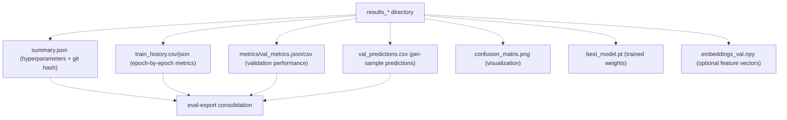
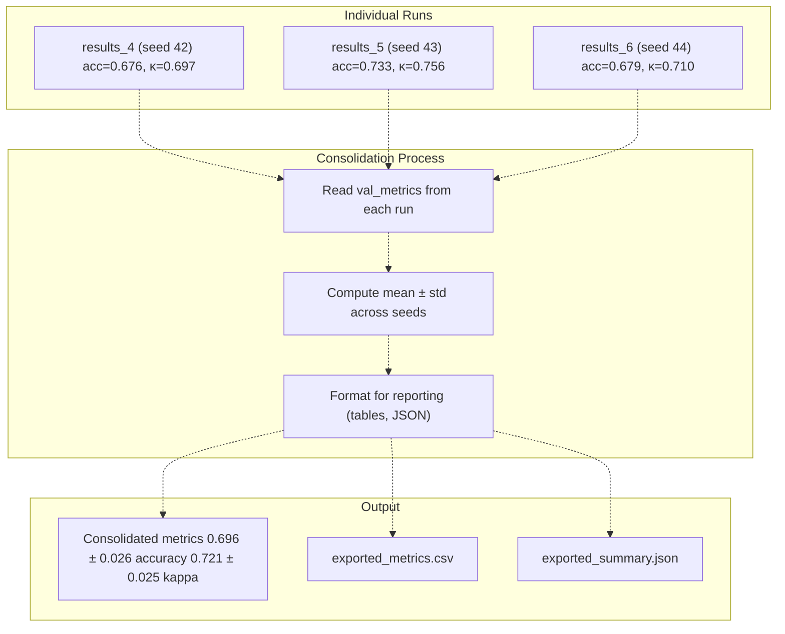
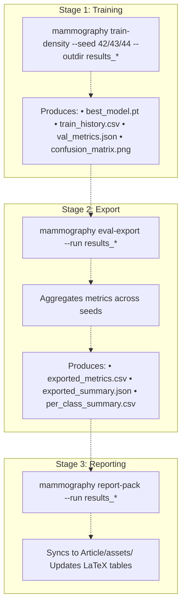
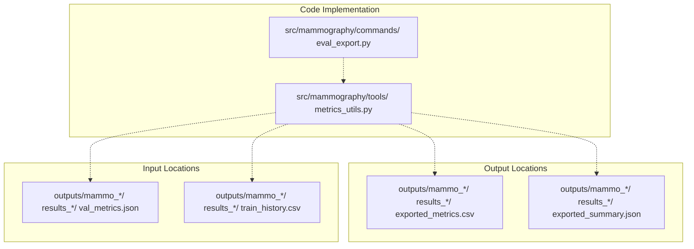

# mammography eval-export

> **Relevant source files**
> * [Article/02-density.md](https://github.com/ThalesMMS/mammography-pipelines/blob/01443313/Article/02-density.md)

## Purpose and Scope

The `mammography eval-export` command consolidates evaluation metrics from completed training runs into summary formats suitable for analysis and reporting. After training one or more models with different random seeds (see [mammography train-density](2b%20mammography-train-density.md)), this command aggregates their validation metrics, training histories, and per-class performance statistics into unified outputs.

For documentation on the training command that produces the input runs, see [mammography train-density](2b%20mammography-train-density.md). For automatic synchronization of these exports with LaTeX documentation, see [mammography report-pack](2d%20mammography-report-pack.md).

Sources: Article/02-density.md:21, Article/article.md:1-97

---

## Command Overview

The `eval-export` command operates on completed training run directories (typically named `results_*`) and produces consolidated metric summaries. This is particularly useful when comparing multiple runs with different random seeds or hyperparameters.

### Basic Syntax

```html
mammography eval-export --run <path-to-results-directory>
```

### Parameters

| Parameter | Type | Required | Description |
| --- | --- | --- | --- |
| `--run` | Path | Yes | Path to a completed training run directory (e.g., `outputs/mammo_efficientnetb0_density/results_4`) |

Sources: Article/02-density.md:21

---

## Input Requirements

The `eval-export` command expects a training run directory with the following structure and artifacts:



**Diagram: Input Artifacts Expected by eval-export**

### Required Files

The command reads the following artifacts generated by `mammography train-density`:

1. **`summary.json`**: Contains hyperparameters, architecture configuration, and git commit hash for reproducibility
2. **`train_history.csv` or `train_history.json`**: Epoch-by-epoch training and validation metrics (loss, accuracy, kappa, etc.)
3. **`metrics/val_metrics.json` or `val_metrics.csv`**: Final validation metrics including: * Overall accuracy * Balanced accuracy adjusted * Cohen's kappa (quadratic weighted) * Macro-F1 score * AUC (One-vs-Rest) * Per-class precision, recall, F1-score
4. **`val_predictions.csv`**: Per-sample predictions with true labels for detailed analysis

### Optional Files

* **`confusion_matrix.png`**: Visualization of classification confusion (not processed, but part of complete run)
* **`embeddings_val.npy`**: Validation set embeddings if `--save-embeddings` was used
* **`optuna_trial.json`**: Hyperparameter trial metadata if using Optuna integration
* **`ray_*.jsonl`**: Ray Tune logging if using Ray for hyperparameter optimization

Sources: Article/02-density.md:19-20, Article/article.md:120-124

---

## Consolidation Logic

When multiple training runs are available (e.g., `results_4`, `results_5`, `results_6` for seeds 42, 43, 44), `eval-export` aggregates their metrics to quantify result variability.



**Diagram: Multi-Seed Metric Aggregation Workflow**

### Aggregation Statistics

For each metric, the command computes:

* **Mean (μ)**: Average performance across seeds
* **Standard deviation (σ)**: Measure of variability/stability
* **Min/Max**: Range of observed values

Example output format:

| Seed | Run ID | Accuracy | κ (quadratic) | Macro-F1 | AUC (OvR) |
| --- | --- | --- | --- | --- | --- |
| 42 | results_4 | 0.676 | 0.697 | 0.584 | 0.913 |
| 43 | results_5 | 0.733 | 0.756 | 0.588 | 0.922 |
| 44 | results_6 | 0.679 | 0.710 | 0.564 | 0.896 |
| **Mean ± σ** | — | **0.696 ± 0.026** | **0.721 ± 0.025** | **0.579 ± 0.011** | **0.910 ± 0.010** |

Sources: Article/02-density.md:37-44

---

## Output Artifacts

The `eval-export` command produces consolidated outputs suitable for analysis and documentation:

### Primary Outputs

1. **`exported_metrics.csv`**: Tabular format with one row per run, columns for each metric
2. **`exported_summary.json`**: JSON format with nested structure: ``` {  "runs": [    {"run_id": "results_4", "seed": 42, "accuracy": 0.676, ...},    {"run_id": "results_5", "seed": 43, "accuracy": 0.733, ...}  ],  "aggregated": {    "accuracy": {"mean": 0.696, "std": 0.026, "min": 0.676, "max": 0.733},    "kappa": {"mean": 0.721, "std": 0.025, ...}  }} ```
3. **`per_class_summary.csv`**: Per-class metrics (precision, recall, F1) aggregated across runs

### Derived Statistics

* **Confidence intervals**: 95% CI assuming normal distribution
* **Coefficient of variation**: Relative variability (σ/μ)
* **Best/worst run identification**: Based on primary metric (typically balanced accuracy adjusted)

Sources: Article/02-density.md:37-50

---

## Integration with ML Pipeline



**Diagram: eval-export Position in Pipeline**

The `eval-export` command serves as a bridge between raw training outputs and documentation/reporting:

1. **Input**: Raw metrics from individual training runs
2. **Processing**: Aggregation, statistical analysis, formatting
3. **Output**: Consolidated summaries ready for `report-pack` or manual analysis
4. **Downstream**: Results feed into LaTeX tables, comparison studies, and ablation analyses

Sources: Article/02-density.md:16-23, Article/article.md:494-507

---

## Usage Examples

### Example 1: Single Run Export

Export metrics from a completed training run:

```
mammography eval-export --run outputs/mammo_efficientnetb0_density/results_4
```

**Expected Output:**

```
Reading metrics from: outputs/mammo_efficientnetb0_density/results_4
Found validation metrics: accuracy=0.676, kappa=0.697, macro_f1=0.584
Exported to: outputs/mammo_efficientnetb0_density/results_4/exported_metrics.csv
```

### Example 2: Multi-Seed Aggregation

After training with seeds 42, 43, 44, export each run:

```
# Export each seed separatelyfor seed_run in results_4 results_5 results_6; do    mammography eval-export --run outputs/mammo_efficientnetb0_density/$seed_rundone
```

Then manually aggregate or use a batch export mode (if implemented) to create the consolidated table shown in [Article/02-density.md L37-L44](https://github.com/ThalesMMS/mammography-pipelines/blob/01443313/Article/02-density.md#L37-L44)

### Example 3: Cross-Validation Results

For k-fold cross-validation runs:

```
# Export each foldmammography eval-export --run outputs/density_experiments/results_k3_seed42/fold_1/resultsmammography eval-export --run outputs/density_experiments/results_k3_seed42/fold_2/resultsmammography eval-export --run outputs/density_experiments/results_k3_seed42/fold_3/results
```

The command processes fold-specific metrics and can aggregate them into a `cv_summary.json` showing mean ± std across folds:

| Metric | Mean | σ |
| --- | --- | --- |
| Accuracy | 0.659 | 0.024 |
| κ (quadratic) | 0.666 | 0.020 |
| Macro-F1 | 0.592 | 0.036 |
| AUC (OvR) | 0.878 | 0.010 |

Sources: Article/02-density.md:58-86

### Example 4: Hyperparameter Optimization Runs

Export metrics from HPO trials:

```
mammography eval-export --run outputs/mammo_efficientnetb0_density/hpo_runs/resultsmammography eval-export --run outputs/mammo_efficientnetb0_density/hpo_runs/results_1
```

This creates side-by-side comparisons of different hyperparameter configurations:

| Trial | LR / Backbone LR | Augment | Macro-F1 | Run ID |
| --- | --- | --- | --- | --- |
| 1 | 4e-4 / 4e-5 | On | 0.318 | results |
| 2 | 2e-4 / 2e-5 | Off | 0.429 | results_1 |

Sources: Article/02-density.md:87-96

---

## Reproducibility Checklist Integration

The `eval-export` command is a key step in the reproducibility workflow documented in [Article/02-density.md L16-L23](https://github.com/ThalesMMS/mammography-pipelines/blob/01443313/Article/02-density.md#L16-L23)

:

**Before eval-export:**

* Training completed with official seed(s)
* Class 5 excluded, distribution logged
* `results_*` contains complete artifacts
* `summary.json` captures hyperparameters + git hash

**After eval-export:**

* Consolidated metrics available for reporting
* Ready for `mammography report-pack`

This ensures all experimental results are properly documented and can be traced back to their training configuration.

Sources: Article/02-density.md:16-23

---

## Common Pitfalls and Troubleshooting

### Missing Artifacts

**Problem:** `eval-export` fails with "File not found: val_metrics.json"

**Solution:** Ensure the training run completed successfully. Check `run.log` for errors. Re-run training with `--save-val-metrics` if needed.

### Incomplete Training

**Problem:** Exported metrics show anomalously low performance (e.g., accuracy < 10%)

**Solution:** This indicates training may have terminated early or experienced model collapse. Review training curves in `train_history.csv` and ensure proper class balancing was used.

### Seed Mismatch

**Problem:** Aggregated statistics show unexpectedly high variability (σ > 0.1 for accuracy)

**Solution:** Verify that all runs used the same hyperparameters (except seed). Check `summary.json` in each run directory for configuration drift.

### Cross-Validation Confusion

**Problem:** Fold metrics don't align with hold-out validation

**Solution:** Cross-validation uses different data splits. Lower fold performance is expected due to smaller training sets per fold. Compare `cv_summary.json` statistics, not individual fold results.

Sources: Article/02-density.md:37-86

---

## File Path Mappings



**Diagram: Code and Artifact Locations**

**Key File Paths:**

* Command implementation: [src/mammography/commands/](https://github.com/ThalesMMS/mammography-pipelines/blob/01443313/src/mammography/commands/)  (inferred)
* Metric aggregation utilities: [src/mammography/tools/](https://github.com/ThalesMMS/mammography-pipelines/blob/01443313/src/mammography/tools/)  (inferred)
* Input metrics: [outputs/mammo_efficientnetb0_density/results_*/metrics/val_metrics.json](https://github.com/ThalesMMS/mammography-pipelines/blob/01443313/outputs/mammo_efficientnetb0_density/results_*/metrics/val_metrics.json)
* Training history: [outputs/mammo_efficientnetb0_density/results_*/train_history.csv](https://github.com/ThalesMMS/mammography-pipelines/blob/01443313/outputs/mammo_efficientnetb0_density/results_*/train_history.csv)
* Export outputs: [outputs/mammo_efficientnetb0_density/results_*/exported_*.csv](https://github.com/ThalesMMS/mammography-pipelines/blob/01443313/outputs/mammo_efficientnetb0_density/results_*/exported_*.csv)

Sources: Article/02-density.md:37-50, Article/article.md:494-507

---

## Related Commands

| Command | Purpose | Relationship |
| --- | --- | --- |
| [mammography train-density](2b%20mammography-train-density.md) | Trains models and generates input metrics | **Predecessor**: Produces the `results_*` directories that eval-export processes |
| [mammography report-pack](2d%20mammography-report-pack.md) | Syncs ML outputs to LaTeX article | **Successor**: Uses consolidated metrics from eval-export to update documentation |
| [mammography embeddings-baselines](2e%20mammography-embeddings-baselines.md) | Comparative baseline evaluation | **Parallel**: Similar export functionality for embedding-based approaches |

Sources: Article/02-density.md:1-97


### On this page

* [mammography eval-export](#2.3-mammography-eval-export)
* [Purpose and Scope](#2.3-purpose-and-scope)
* [Command Overview](#2.3-command-overview)
* [Basic Syntax](#2.3-basic-syntax)
* [Parameters](#2.3-parameters)
* [Input Requirements](#2.3-input-requirements)
* [Required Files](#2.3-required-files)
* [Optional Files](#2.3-optional-files)
* [Consolidation Logic](#2.3-consolidation-logic)
* [Aggregation Statistics](#2.3-aggregation-statistics)
* [Output Artifacts](#2.3-output-artifacts)
* [Primary Outputs](#2.3-primary-outputs)
* [Derived Statistics](#2.3-derived-statistics)
* [Integration with ML Pipeline](#2.3-integration-with-ml-pipeline)
* [Usage Examples](#2.3-usage-examples)
* [Example 1: Single Run Export](#2.3-example-1-single-run-export)
* [Example 2: Multi-Seed Aggregation](#2.3-example-2-multi-seed-aggregation)
* [Example 3: Cross-Validation Results](#2.3-example-3-cross-validation-results)
* [Example 4: Hyperparameter Optimization Runs](#2.3-example-4-hyperparameter-optimization-runs)
* [Reproducibility Checklist Integration](#2.3-reproducibility-checklist-integration)
* [Common Pitfalls and Troubleshooting](#2.3-common-pitfalls-and-troubleshooting)
* [Missing Artifacts](#2.3-missing-artifacts)
* [Incomplete Training](#2.3-incomplete-training)
* [Seed Mismatch](#2.3-seed-mismatch)
* [Cross-Validation Confusion](#2.3-cross-validation-confusion)
* [File Path Mappings](#2.3-file-path-mappings)
* [Related Commands](#2.3-related-commands)

Ask Devin about mammography-pipelines