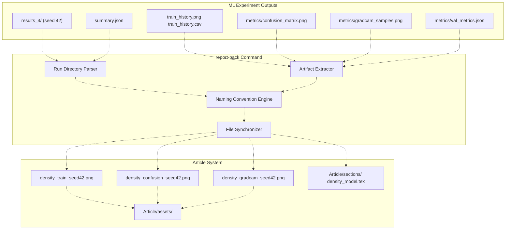
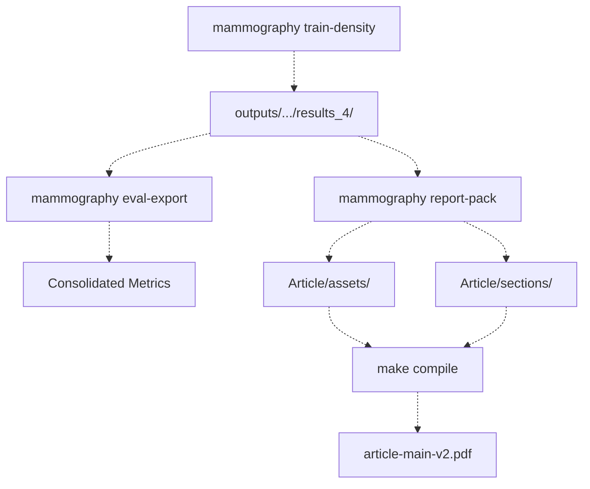
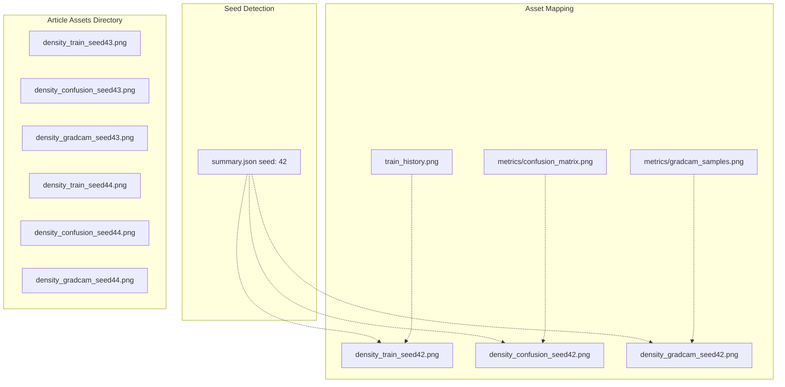
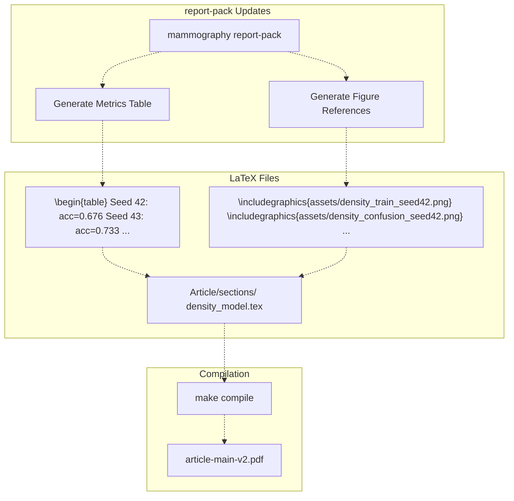
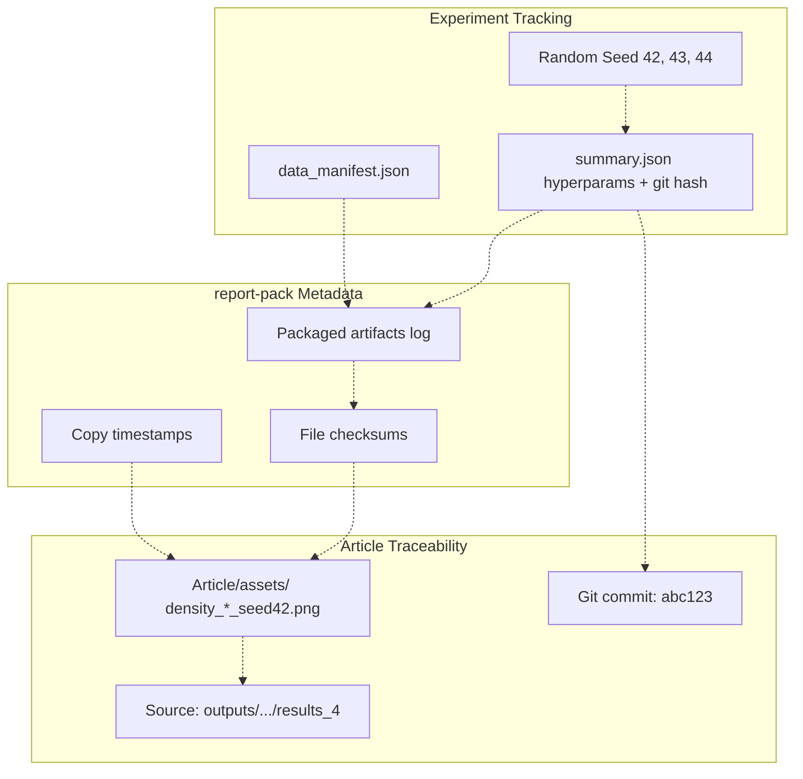
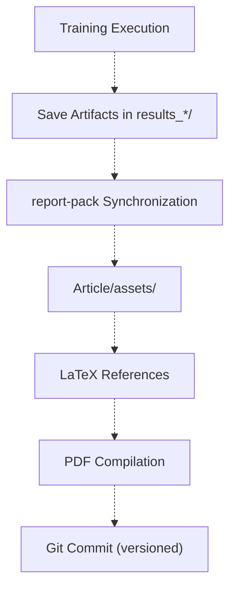

# mammography report-pack

> **Relevant source files**
> * [Article/02-density.md](https://github.com/ThalesMMS/mammography-pipelines/blob/01443313/Article/02-density.md)
> * [Article/chapters/01-introducao.tex](https://github.com/ThalesMMS/mammography-pipelines/blob/01443313/Article/chapters/01-introducao.tex)

## Purpose

The `mammography report-pack` command automates the synchronization of machine learning experiment outputs with LaTeX article documentation. It extracts figures and metrics from completed training runs and organizes them into the `Article/assets/` directory with standardized naming conventions, optionally updating LaTeX section files to reference the new artifacts. This ensures that research documentation remains consistent with experimental results without manual file management.

For information about running training experiments that produce outputs to be packaged, see [mammography train-density](2b%20mammography-train-density.md). For consolidating metrics before packaging, see [mammography eval-export](2c%20mammography-eval-export.md). For the overall article system, see [Article Documentation System](8%20Article-Documentation-System.md).

---

## Command Overview

The `report-pack` command operates on completed experiment runs, identified by their output directory path. It processes training history plots, confusion matrices, Grad-CAM visualizations, and other artifacts generated during model training and evaluation.

### Basic Syntax

```
mammography report-pack --run <run_directory> [--assets-dir <target_directory>]
```

### Key Parameters

| Parameter | Description | Default |
| --- | --- | --- |
| `--run` | Path to completed experiment run (e.g., `outputs/mammo_efficientnetb0_density/results_4`) | Required |
| `--assets-dir` | Target directory for synced assets | `Article/assets` |

Sources: [Article/02-density.md L22](https://github.com/ThalesMMS/mammography-pipelines/blob/01443313/Article/02-density.md#L22-L22)

 [Article/02-density.md L50](https://github.com/ThalesMMS/mammography-pipelines/blob/01443313/Article/02-density.md#L50-L50)

---

## System Architecture



**Diagram 1: report-pack Processing Pipeline**

This diagram shows how `report-pack` identifies experiment artifacts, applies naming conventions, and synchronizes them to the article assets directory.

Sources: [Article/02-density.md L22-L33](https://github.com/ThalesMMS/mammography-pipelines/blob/01443313/Article/02-density.md#L22-L33)

 [Article/02-density.md L50](https://github.com/ThalesMMS/mammography-pipelines/blob/01443313/Article/02-density.md#L50-L50)

---

## Workflow Integration



**Diagram 2: report-pack in the ML-to-Documentation Pipeline**

The `report-pack` command sits between experiment execution and article compilation, bridging ML outputs with LaTeX documentation.

Sources: [Article/02-density.md L22](https://github.com/ThalesMMS/mammography-pipelines/blob/01443313/Article/02-density.md#L22-L22)

 [Article/02-density.md L50](https://github.com/ThalesMMS/mammography-pipelines/blob/01443313/Article/02-density.md#L50-L50)

---

## Input Structure

The command expects experiment run directories to follow this structure:

```markdown
outputs/mammo_efficientnetb0_density/results_4/
├── train_history.png          # Loss and metric curves
├── train_history.csv           # Training history data
├── train_history.json          # Training history JSON
├── summary.json                # Experiment metadata (seed, hyperparams, git hash)
├── best_model.pt               # Trained model checkpoint
└── metrics/
    ├── confusion_matrix.png    # Confusion matrix visualization
    ├── val_metrics.json        # Validation metrics
    ├── val_predictions.csv     # Per-sample predictions
    └── gradcam_samples.png     # Grad-CAM visualizations
```

The `summary.json` file contains critical metadata for identifying the experiment seed:

```
{  "seed": 42,  "hyperparameters": {...},  "git_hash": "...",  "timestamp": "..."}
```

Sources: [Article/02-density.md L17-L22](https://github.com/ThalesMMS/mammography-pipelines/blob/01443313/Article/02-density.md#L17-L22)

---

## Output Structure and Naming Conventions



**Diagram 3: Asset Naming Convention Based on Seed**

The command uses the seed value from `summary.json` to generate standardized filenames, enabling multiple experiment runs to coexist without conflicts.

Sources: [Article/02-density.md L24-L33](https://github.com/ThalesMMS/mammography-pipelines/blob/01443313/Article/02-density.md#L24-L33)

---

## Generated Asset Types

### Training History Plots

**Input**: `train_history.png`, `train_history.csv`, `train_history.json`
**Output**: `density_train_seed{N}.png`

Training curves showing loss and metrics evolution over epochs. Includes both training and validation metrics with epoch markers for best checkpoint selection.

### Confusion Matrices

**Input**: `metrics/confusion_matrix.png`
**Output**: `density_confusion_seed{N}.png`

Per-class prediction accuracy visualized as a normalized confusion matrix. Diagonal elements represent correct predictions; off-diagonal elements show misclassification patterns between BI-RADS density classes.

### Grad-CAM Visualizations

**Input**: `metrics/gradcam_samples.png`
**Output**: `density_gradcam_seed{N}.png`

Gradient-weighted Class Activation Maps overlaid on sample mammograms, highlighting regions that influenced model predictions. Provides interpretability for density classification decisions.

Sources: [Article/02-density.md L24-L33](https://github.com/ThalesMMS/mammography-pipelines/blob/01443313/Article/02-density.md#L24-L33)

---

## Multi-Seed Experiment Management

The `report-pack` command supports reproducibility by handling multiple random seeds:

| Seed | Run Directory | Asset Suffix |
| --- | --- | --- |
| 42 | `results_4` | `seed42` |
| 43 | `results_5` | `seed43` |
| 44 | `results_6` | `seed44` |

```
# Package all three seed experimentsmammography report-pack --run outputs/mammo_efficientnetb0_density/results_4mammography report-pack --run outputs/mammo_efficientnetb0_density/results_5mammography report-pack --run outputs/mammo_efficientnetb0_density/results_6
```

This generates nine asset files (3 types × 3 seeds) that can be referenced in the LaTeX document to show result variability:

```
Article/assets/
├── density_train_seed42.png
├── density_train_seed43.png
├── density_train_seed44.png
├── density_confusion_seed42.png
├── density_confusion_seed43.png
├── density_confusion_seed44.png
├── density_gradcam_seed42.png
├── density_gradcam_seed43.png
└── density_gradcam_seed44.png
```

Sources: [Article/02-density.md L17](https://github.com/ThalesMMS/mammography-pipelines/blob/01443313/Article/02-density.md#L17-L17)

 [Article/02-density.md L37-L44](https://github.com/ThalesMMS/mammography-pipelines/blob/01443313/Article/02-density.md#L37-L44)

---

## LaTeX Section Integration



**Diagram 4: LaTeX Section Update Flow**

The command can optionally update LaTeX section files with tables and figure references based on extracted metrics.

Sources: [Article/02-density.md L50](https://github.com/ThalesMMS/mammography-pipelines/blob/01443313/Article/02-density.md#L50-L50)

---

## Usage Examples

### Basic Packaging

Package results from a single experiment run:

```
mammography report-pack --run outputs/mammo_efficientnetb0_density/results_4
```

This extracts artifacts from `results_4` (seed 42), applies the `seed42` naming suffix, and copies them to `Article/assets/`.

### Custom Asset Directory

Specify a different target directory:

```
mammography report-pack \  --run outputs/mammo_efficientnetb0_density/results_4 \  --assets-dir /path/to/custom/assets
```

### Packaging Cross-Validation Results

Package results from k-fold cross-validation experiments:

```
mammography report-pack \  --run outputs/density_experiments/results_k3_seed42/fold_1/results
```

Sources: [Article/02-density.md L22](https://github.com/ThalesMMS/mammography-pipelines/blob/01443313/Article/02-density.md#L22-L22)

 [Article/02-density.md L60-L84](https://github.com/ThalesMMS/mammography-pipelines/blob/01443313/Article/02-density.md#L60-L84)

---

## Synchronization Behavior

The command implements intelligent file synchronization:

1. **Detection**: Scans the run directory for standard artifact patterns
2. **Extraction**: Reads `summary.json` to determine seed and metadata
3. **Transformation**: Applies naming conventions based on seed and artifact type
4. **Validation**: Checks for existing files in target directory
5. **Overwrite**: Updates assets if source timestamps are newer or force flag is set
6. **Logging**: Records all file operations for traceability

### Conflict Resolution

When assets already exist in `Article/assets/`, the command:

* Compares file modification timestamps
* Overwrites only if source is newer
* Preserves historical artifacts from different seeds

This allows iterative experimentation where seed 42 results can be updated without affecting seed 43/44 artifacts.

Sources: [Article/02-density.md L22](https://github.com/ThalesMMS/mammography-pipelines/blob/01443313/Article/02-density.md#L22-L22)

 [Article/02-density.md L50](https://github.com/ThalesMMS/mammography-pipelines/blob/01443313/Article/02-density.md#L50-L50)

---

## Integration with Reproducibility Framework



**Diagram 5: Traceability from Experiment to Publication**

The `report-pack` command preserves the link between published figures and their source experiments through seed-based naming and metadata preservation.

Sources: [Article/02-density.md L17-L22](https://github.com/ThalesMMS/mammography-pipelines/blob/01443313/Article/02-density.md#L17-L22)

---

## File Path Mappings

### Training History

```
outputs/mammo_efficientnetb0_density/results_4/train_history.png
  → Article/assets/density_train_seed42.png
```

### Confusion Matrix

```
outputs/mammo_efficientnetb0_density/results_4/metrics/confusion_matrix.png
  → Article/assets/density_confusion_seed42.png
```

### Grad-CAM Samples

```
outputs/mammo_efficientnetb0_density/results_4/metrics/gradcam_samples.png
  → Article/assets/density_gradcam_seed42.png
```

### Embeddings Visualizations

For embedding-related experiments, additional mappings apply:

```
outputs/embeddings_resnet50/preview/pca_projection.png
  → Article/assets/embeddings_pca_tsne.png
```

Sources: [Article/02-density.md L24-L33](https://github.com/ThalesMMS/mammography-pipelines/blob/01443313/Article/02-density.md#L24-L33)

---

## Typical Workflow

1. **Complete Training**: Run experiments with different seeds ``` mammography train-density --seed 42 --outdir outputs/.../results_4mammography train-density --seed 43 --outdir outputs/.../results_5mammography train-density --seed 44 --outdir outputs/.../results_6 ```
2. **Export Metrics** (optional): Consolidate metrics for analysis ``` mammography eval-export --run outputs/.../results_4 ```
3. **Package Assets**: Sync artifacts to article directory ``` mammography report-pack --run outputs/.../results_4mammography report-pack --run outputs/.../results_5mammography report-pack --run outputs/.../results_6 ```
4. **Update LaTeX**: Manually reference the new assets or let report-pack update sections ``` \includegraphics{assets/density_train_seed42.png}\includegraphics{assets/density_confusion_seed42.png} ```
5. **Compile Article**: Generate the final PDF ``` cd Article && make compile ```

Sources: [Article/02-density.md L17-L56](https://github.com/ThalesMMS/mammography-pipelines/blob/01443313/Article/02-density.md#L17-L56)

---

## Relationship to Other Commands

| Command | Purpose | Interaction with report-pack |
| --- | --- | --- |
| `train-density` | Trains classification models | Generates the run directories that report-pack processes |
| `eval-export` | Consolidates metrics | Produces additional JSON files that report-pack can parse |
| `embed` | Generates feature embeddings | Creates embedding visualizations that report-pack can package |
| `embeddings-baselines` | Evaluates embedding quality | Produces comparison reports for documentation |

Sources: [Article/02-density.md L22](https://github.com/ThalesMMS/mammography-pipelines/blob/01443313/Article/02-density.md#L22-L22)

---

## Asset Lifecycle



**Diagram 6: Asset Lifecycle from Training to Publication**

Assets are generated during training, synchronized by report-pack, referenced in LaTeX, and version-controlled through Git for full traceability.

Sources: [Article/02-density.md L22](https://github.com/ThalesMMS/mammography-pipelines/blob/01443313/Article/02-density.md#L22-L22)

 [Article/02-density.md L50](https://github.com/ThalesMMS/mammography-pipelines/blob/01443313/Article/02-density.md#L50-L50)

---

## Benefits

1. **Automation**: Eliminates manual file copying and renaming
2. **Consistency**: Enforces standardized naming conventions across experiments
3. **Reproducibility**: Maintains clear links between figures and their source experiments
4. **Multi-seed Support**: Handles multiple random seeds without filename conflicts
5. **Version Control**: Assets can be committed to Git with traceable provenance
6. **LaTeX Integration**: Optional automatic section updates reduce documentation lag

Sources: [Article/02-density.md L22](https://github.com/ThalesMMS/mammography-pipelines/blob/01443313/Article/02-density.md#L22-L22)

 [Article/02-density.md L50](https://github.com/ThalesMMS/mammography-pipelines/blob/01443313/Article/02-density.md#L50-L50)

---

## Common Patterns

### Pattern 1: Three-Seed Reproducibility Study

```
# Train with three seedsfor seed in 42 43 44; do  mammography train-density --seed $seed --outdir outputs/.../results_$seeddone# Package all resultsfor seed in 42 43 44; do  mammography report-pack --run outputs/.../results_$seeddone
```

### Pattern 2: Iterative Refinement

When re-running seed 42 with improved hyperparameters:

```
# Re-train (overwrites results_4)mammography train-density --seed 42 --outdir outputs/.../results_4# Re-package (updates only seed42 assets)mammography report-pack --run outputs/.../results_4
```

Seed 43 and 44 assets remain unchanged, preserving historical results.

Sources: [Article/02-density.md L37-L50](https://github.com/ThalesMMS/mammography-pipelines/blob/01443313/Article/02-density.md#L37-L50)

---

## Summary

The `mammography report-pack` command bridges the gap between machine learning experimentation and research documentation by automating the extraction, renaming, and synchronization of experiment artifacts. By incorporating seed information into filenames and preserving metadata links, it enables reproducible research workflows where published figures can be traced back to their exact experimental conditions.

Sources: [Article/02-density.md L22](https://github.com/ThalesMMS/mammography-pipelines/blob/01443313/Article/02-density.md#L22-L22)

 [Article/02-density.md L50](https://github.com/ThalesMMS/mammography-pipelines/blob/01443313/Article/02-density.md#L50-L50)


### On this page

* [mammography report-pack](#2.4-mammography-report-pack)
* [Purpose](#2.4-purpose)
* [Command Overview](#2.4-command-overview)
* [Basic Syntax](#2.4-basic-syntax)
* [Key Parameters](#2.4-key-parameters)
* [System Architecture](#2.4-system-architecture)
* [Workflow Integration](#2.4-workflow-integration)
* [Input Structure](#2.4-input-structure)
* [Output Structure and Naming Conventions](#2.4-output-structure-and-naming-conventions)
* [Generated Asset Types](#2.4-generated-asset-types)
* [Training History Plots](#2.4-training-history-plots)
* [Confusion Matrices](#2.4-confusion-matrices)
* [Grad-CAM Visualizations](#2.4-grad-cam-visualizations)
* [Multi-Seed Experiment Management](#2.4-multi-seed-experiment-management)
* [LaTeX Section Integration](#2.4-latex-section-integration)
* [Usage Examples](#2.4-usage-examples)
* [Basic Packaging](#2.4-basic-packaging)
* [Custom Asset Directory](#2.4-custom-asset-directory)
* [Packaging Cross-Validation Results](#2.4-packaging-cross-validation-results)
* [Synchronization Behavior](#2.4-synchronization-behavior)
* [Conflict Resolution](#2.4-conflict-resolution)
* [Integration with Reproducibility Framework](#2.4-integration-with-reproducibility-framework)
* [File Path Mappings](#2.4-file-path-mappings)
* [Training History](#2.4-training-history)
* [Confusion Matrix](#2.4-confusion-matrix)
* [Grad-CAM Samples](#2.4-grad-cam-samples)
* [Embeddings Visualizations](#2.4-embeddings-visualizations)
* [Typical Workflow](#2.4-typical-workflow)
* [Relationship to Other Commands](#2.4-relationship-to-other-commands)
* [Asset Lifecycle](#2.4-asset-lifecycle)
* [Benefits](#2.4-benefits)
* [Common Patterns](#2.4-common-patterns)
* [Pattern 1: Three-Seed Reproducibility Study](#2.4-pattern-1-three-seed-reproducibility-study)
* [Pattern 2: Iterative Refinement](#2.4-pattern-2-iterative-refinement)
* [Summary](#2.4-summary)

Ask Devin about mammography-pipelines