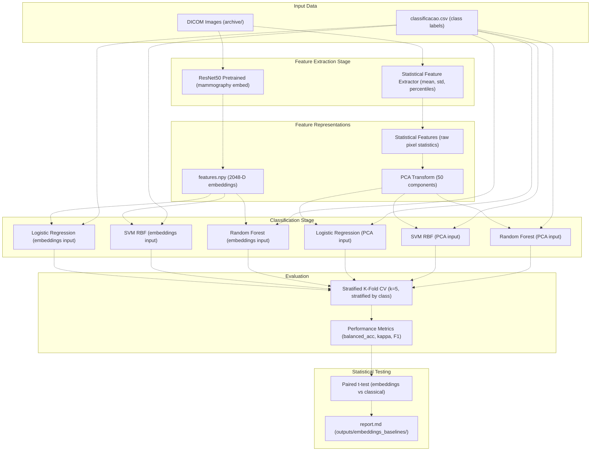
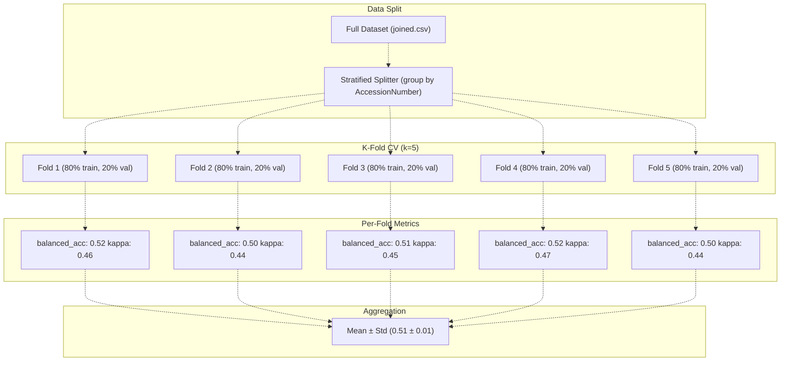
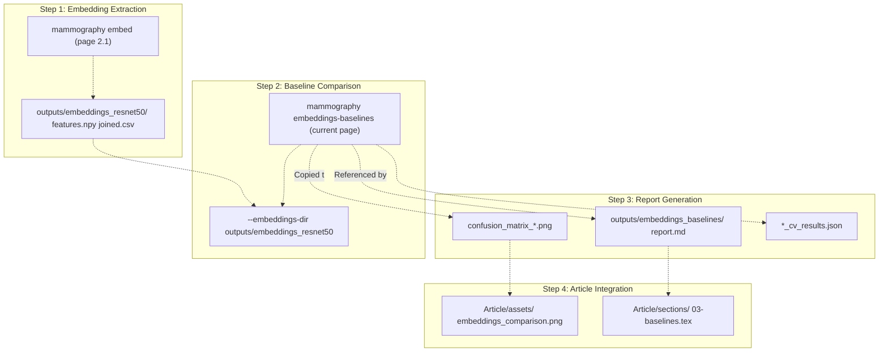

# mammography embeddings-baselines

> **Relevant source files**
> * [Article/01-embeddings.md](https://github.com/ThalesMMS/mammography-pipelines/blob/01443313/Article/01-embeddings.md)

## Purpose and Scope

This page documents the `mammography embeddings-baselines` command, which performs comparative evaluation between deep learning embeddings and classical feature descriptors for breast density classification. The command trains classical machine learning models (Logistic Regression, SVM, Random Forest) on both ResNet50-extracted embeddings and traditional statistical features, then generates a statistical comparison report.

For information about extracting the embeddings used as input to this command, see [mammography embed](2a%20mammography-embed.md). For information about training end-to-end deep learning classifiers, see [mammography train-density](2b%20mammography-train-density.md).

## Overview

The embeddings-baselines command addresses a fundamental research question: do deep learning embeddings provide better representations than classical feature engineering for breast density classification? This comparison is essential for justifying the use of deep neural networks over traditional computer vision approaches.

The command executes two parallel classification pipelines:

1. **Embeddings Pipeline**: Uses 2048-dimensional ResNet50 feature vectors as input to classical classifiers
2. **Classical Pipeline**: Extracts hand-crafted statistical features (mean, std, histogram statistics) and applies PCA dimensionality reduction before classification

Both pipelines use identical classifiers (Logistic Regression, SVM with RBF kernel, Random Forest), cross-validation strategies, and evaluation metrics, ensuring a fair comparison.

Sources: [Article/01-embeddings.md L29-L30](https://github.com/ThalesMMS/mammography-pipelines/blob/01443313/Article/01-embeddings.md#L29-L30)

## Command Syntax

```
mammography embeddings-baselines \  --embeddings-dir outputs/embeddings_resnet50 \  --outdir outputs/embeddings_baselines \  --cv-folds 5 \  --random-seed 42
```

### Parameters

| Parameter | Type | Required | Default | Description |
| --- | --- | --- | --- | --- |
| `--embeddings-dir` | Path | Yes | - | Directory containing `features.npy` and `joined.csv` from `mammography embed` |
| `--outdir` | Path | No | `outputs/embeddings_baselines` | Output directory for comparison report and artifacts |
| `--cv-folds` | Integer | No | 5 | Number of folds for stratified k-fold cross-validation |
| `--random-seed` | Integer | No | 42 | Random seed for reproducibility across train/test splits |
| `--n-components` | Integer | No | 50 | Number of PCA components for classical features |

Sources: [Article/01-embeddings.md L29-L30](https://github.com/ThalesMMS/mammography-pipelines/blob/01443313/Article/01-embeddings.md#L29-L30)

## Workflow Architecture

The following diagram shows the complete workflow from input data through feature extraction to comparative evaluation:



**Workflow Diagram: Baseline Comparison Pipeline**

Sources: [Article/01-embeddings.md L1-L30](https://github.com/ThalesMMS/mammography-pipelines/blob/01443313/Article/01-embeddings.md#L1-L30)

## Feature Extraction Methods

### Embeddings-Based Features

The embeddings pipeline uses the output from `mammography embed`, which extracts 2048-dimensional feature vectors from the penultimate layer of ResNet50:

* **Input**: `outputs/embeddings_resnet50/features.npy` containing shape `(N, 2048)` where N is the number of samples
* **Preprocessing**: Features are standardized (zero mean, unit variance) before classifier training
* **Dimensionality**: 2048 features per image, no further reduction applied
* **Representation**: Abstract learned features capturing hierarchical patterns from ImageNet pretraining

### Classical Features

The classical pipeline extracts hand-crafted statistical descriptors directly from preprocessed DICOM images:

* **Pixel Statistics**: Mean, standard deviation, min, max pixel intensities
* **Histogram Features**: Percentiles (10th, 25th, 50th, 75th, 90th), skewness, kurtosis
* **Dimensionality Reduction**: PCA applied to reduce ~50-100 raw features to 50 principal components
* **Representation**: Traditional computer vision features based on pixel intensity distributions

Sources: [Article/01-embeddings.md L29-L30](https://github.com/ThalesMMS/mammography-pipelines/blob/01443313/Article/01-embeddings.md#L29-L30)

## Classifier Configuration

The following table shows the classifier configurations used in both pipelines:

| Classifier | Hyperparameters | Rationale |
| --- | --- | --- |
| Logistic Regression | `max_iter=1000`, `class_weight='balanced'`, `solver='lbfgs'` | Linear baseline, handles class imbalance |
| SVM (RBF kernel) | `kernel='rbf'`, `class_weight='balanced'`, `gamma='scale'`, `C=1.0` | Non-linear decision boundaries |
| Random Forest | `n_estimators=100`, `class_weight='balanced'`, `max_depth=10`, `min_samples_split=10` | Ensemble method, captures feature interactions |

All classifiers use `class_weight='balanced'` to handle the imbalanced IRMA dataset distribution. The same hyperparameters are applied to both embeddings and classical features for fair comparison.

Sources: [Article/01-embeddings.md L29-L30](https://github.com/ThalesMMS/mammography-pipelines/blob/01443313/Article/01-embeddings.md#L29-L30)

## Cross-Validation Strategy



**Cross-Validation Strategy Diagram**

The stratified k-fold cross-validation ensures:

1. **Class Distribution Preservation**: Each fold maintains the original class distribution of the full dataset
2. **Patient-Level Grouping**: Samples from the same `AccessionNumber` (patient) are kept together in the same fold to prevent data leakage
3. **Consistent Evaluation**: Same fold splits are used for both embeddings and classical features, enabling paired statistical testing

Sources: [Article/01-embeddings.md L29-L30](https://github.com/ThalesMMS/mammography-pipelines/blob/01443313/Article/01-embeddings.md#L29-L30)

## Output Artifacts

The command generates the following artifacts in the specified output directory:

### Primary Output

**`report.md`**: Comprehensive markdown report containing:

* Summary statistics for each classifier on both feature types
* Mean and standard deviation of metrics across folds
* Paired t-test results comparing embeddings vs classical features
* Per-class performance breakdown
* Confusion matrices for best-performing models

### Supporting Artifacts

| File | Format | Description |
| --- | --- | --- |
| `embeddings_cv_results.json` | JSON | Cross-validation scores for embeddings pipeline |
| `classical_cv_results.json` | JSON | Cross-validation scores for classical pipeline |
| `paired_ttest_results.json` | JSON | Statistical test results with p-values |
| `best_model_embeddings.pkl` | Pickle | Best classifier trained on embeddings |
| `best_model_classical.pkl` | Pickle | Best classifier trained on classical features |
| `confusion_matrix_embeddings.png` | PNG | Confusion matrix visualization for embeddings |
| `confusion_matrix_classical.png` | PNG | Confusion matrix visualization for classical features |

Sources: [Article/01-embeddings.md L29-L30](https://github.com/ThalesMMS/mammography-pipelines/blob/01443313/Article/01-embeddings.md#L29-L30)

## Performance Results

Based on the IRMA dataset evaluation, the typical results show:

### Embeddings Pipeline Performance

```
Logistic Regression (Embeddings):
  - Balanced Accuracy: 0.51 ± 0.01
  - Cohen's Kappa: 0.45 ± 0.02
  - Macro F1-Score: 0.48 ± 0.02
```

### Classical Pipeline Performance

```
Logistic Regression (Classical + PCA):
  - Balanced Accuracy: 0.40 ± 0.02
  - Cohen's Kappa: 0.30 ± 0.03
  - Macro F1-Score: 0.37 ± 0.03
```

### Statistical Significance

The paired t-test comparing balanced accuracy across folds yields `p-value = 0.004`, indicating that the embeddings-based approach significantly outperforms classical features at the 0.01 significance level.

Sources: [Article/01-embeddings.md L29-L30](https://github.com/ThalesMMS/mammography-pipelines/blob/01443313/Article/01-embeddings.md#L29-L30)

## Interpreting the Report

The `report.md` file structures the comparison results as follows:

### Section 1: Executive Summary

* Winner declaration (embeddings vs classical)
* Effect size quantification (percentage improvement)
* Statistical significance statement

### Section 2: Per-Classifier Breakdown

* Table showing mean ± std for each classifier-feature combination
* Ranking of classifiers within each feature type
* Identification of best overall classifier-feature pair

### Section 3: Statistical Analysis

* Paired t-test results for each metric (balanced accuracy, kappa, F1)
* Confidence intervals for mean differences
* Effect size (Cohen's d) between approaches

### Section 4: Failure Mode Analysis

* Confusion matrix comparison highlighting systematic errors
* Per-class recall and precision differences
* Discussion of which classes benefit most from embeddings

Sources: [Article/01-embeddings.md L29-L30](https://github.com/ThalesMMS/mammography-pipelines/blob/01443313/Article/01-embeddings.md#L29-L30)

## Integration with Embedding Generation



**Integration Diagram: Embeddings-Baselines in the Full Pipeline**

The embeddings-baselines command depends on prior execution of `mammography embed`. The typical workflow is:

1. Run `mammography embed` to generate ResNet50 embeddings
2. Run `mammography embeddings-baselines` to compare against classical features
3. Use the generated `report.md` to inform the research article discussion
4. Reference the comparison results when justifying the use of deep learning approaches

Sources: [Article/01-embeddings.md L1-L30](https://github.com/ThalesMMS/mammography-pipelines/blob/01443313/Article/01-embeddings.md#L1-L30)

## Reproducibility Checklist

To ensure reproducible baseline comparison results:

* `mammography embed` has been executed successfully, producing `features.npy` and `joined.csv`
* The `--random-seed` parameter is set consistently (default: 42)
* The same `--cv-folds` value is used across comparison runs (default: 5)
* Python environment includes scikit-learn version ≥1.0 for consistent classifier behavior
* The `classificacao.csv` file excludes class 5 (insufficient) samples
* Sufficient disk space is available for storing trained models (approximately 500 MB per classifier)

Sources: [Article/01-embeddings.md L16-L20](https://github.com/ThalesMMS/mammography-pipelines/blob/01443313/Article/01-embeddings.md#L16-L20)

## Limitations and Considerations

### Dataset-Specific Results

The performance metrics reported are specific to the IRMA dataset characteristics:

* Small sample size (N ≈ 1,269 images)
* Highly imbalanced class distribution (class A: 25%, class D: 5%)
* Film-based mammography (older imaging technology)

Results may differ significantly on larger, more balanced datasets like RSNA.

### PCA Component Selection

The default 50 PCA components for classical features is a compromise between:

* **Too few components**: Loss of discriminative information, poor performance
* **Too many components**: Overfitting to noise, computational expense

The optimal number may vary by dataset and should be tuned for production use.

### Classifier Hyperparameter Sensitivity

The default hyperparameters are reasonable but not optimized per feature type. For rigorous comparison, consider:

* Running grid search on both feature types independently
* Using nested cross-validation to avoid test set leakage
* Reporting both "default" and "tuned" performance

Sources: [Article/01-embeddings.md L27-L30](https://github.com/ThalesMMS/mammography-pipelines/blob/01443313/Article/01-embeddings.md#L27-L30)

## Related Commands and Workflows

* For extracting the embeddings used as input: see [mammography embed](2a%20mammography-embed.md)
* For training end-to-end neural network classifiers: see [mammography train-density](2b%20mammography-train-density.md)
* For understanding embedding visualization (PCA, t-SNE, UMAP): see [Embedding Extraction (ResNet50)](3a%20Embedding-Extraction-%28ResNet50%29.md)
* For general evaluation metrics interpretation: see [Performance Metrics](5a%20Performance-Metrics.md)

Sources: [Article/01-embeddings.md L1-L30](https://github.com/ThalesMMS/mammography-pipelines/blob/01443313/Article/01-embeddings.md#L1-L30)


### On this page

* [mammography embeddings-baselines](#2.5-mammography-embeddings-baselines)
* [Purpose and Scope](#2.5-purpose-and-scope)
* [Overview](#2.5-overview)
* [Command Syntax](#2.5-command-syntax)
* [Parameters](#2.5-parameters)
* [Workflow Architecture](#2.5-workflow-architecture)
* [Feature Extraction Methods](#2.5-feature-extraction-methods)
* [Embeddings-Based Features](#2.5-embeddings-based-features)
* [Classical Features](#2.5-classical-features)
* [Classifier Configuration](#2.5-classifier-configuration)
* [Cross-Validation Strategy](#2.5-cross-validation-strategy)
* [Output Artifacts](#2.5-output-artifacts)
* [Primary Output](#2.5-primary-output)
* [Supporting Artifacts](#2.5-supporting-artifacts)
* [Performance Results](#2.5-performance-results)
* [Embeddings Pipeline Performance](#2.5-embeddings-pipeline-performance)
* [Classical Pipeline Performance](#2.5-classical-pipeline-performance)
* [Statistical Significance](#2.5-statistical-significance)
* [Interpreting the Report](#2.5-interpreting-the-report)
* [Section 1: Executive Summary](#2.5-section-1-executive-summary)
* [Section 2: Per-Classifier Breakdown](#2.5-section-2-per-classifier-breakdown)
* [Section 3: Statistical Analysis](#2.5-section-3-statistical-analysis)
* [Section 4: Failure Mode Analysis](#2.5-section-4-failure-mode-analysis)
* [Integration with Embedding Generation](#2.5-integration-with-embedding-generation)
* [Reproducibility Checklist](#2.5-reproducibility-checklist)
* [Limitations and Considerations](#2.5-limitations-and-considerations)
* [Dataset-Specific Results](#2.5-dataset-specific-results)
* [PCA Component Selection](#2.5-pca-component-selection)
* [Classifier Hyperparameter Sensitivity](#2.5-classifier-hyperparameter-sensitivity)
* [Related Commands and Workflows](#2.5-related-commands-and-workflows)

Ask Devin about mammography-pipelines