# Machine Learning Pipeline

> **Relevant source files**
> * [Article/article.md](https://github.com/ThalesMMS/mammography-pipelines/blob/01443313/Article/article.md)
> * [Article/chapters/02-trabalhos-relacionados.tex](https://github.com/ThalesMMS/mammography-pipelines/blob/01443313/Article/chapters/02-trabalhos-relacionados.tex)

This page provides an overview of the two-stage machine learning architecture used for breast density classification. The pipeline consists of **Stage 1: Embedding Extraction** using ResNet50 to generate reusable 2048-dimensional feature vectors, followed by **Stage 2: Supervised Classification** using EfficientNetB0 to predict BI-RADS density categories. The stages can be executed independently or combined through optional embedding fusion.

The pipeline is designed to address the challenges of limited medical imaging data through transfer learning, prevent model collapse on imbalanced datasets through strategic layer freezing, and provide interpretability through Grad-CAM visualizations and comprehensive metrics.

For detailed information about each stage, see [Embedding Extraction (ResNet50)](3a%20Embedding-Extraction-%28ResNet50%29.md), [Density Classification (EfficientNetB0)](3b%20Density-Classification-%28EfficientNetB0%29.md), and [Transfer Learning Strategies](3c%20Transfer-Learning-Strategies.md). For training optimization and validation strategies, see [Training Loop and Optimization](3d%20Training-Loop-and-Optimization.md) and [Cross-Validation and Hyperparameter Optimization](3e%20Cross-Validation-and-Hyperparameter-Optimization.md).

---

## Two-Stage Architecture Overview

The machine learning pipeline implements a modular two-stage design that separates feature extraction from classification. This architecture enables reusability of embeddings across multiple experiments, reduces computational costs for hyperparameter tuning, and provides intermediate representations for exploratory analysis.

### Pipeline Execution Flow

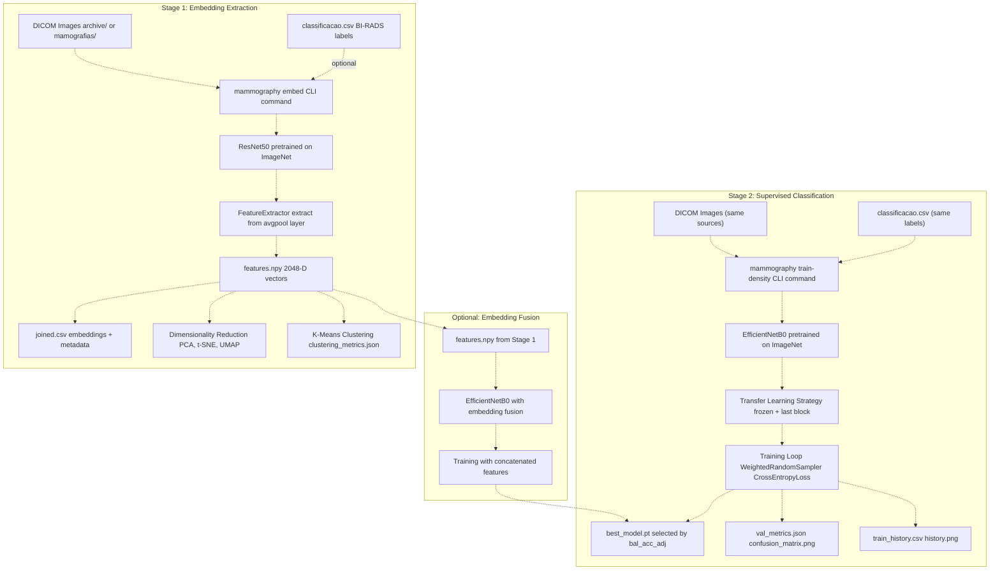

**Sources:** [src/mammography/commands/embed.py L1-L200](https://github.com/ThalesMMS/mammography-pipelines/blob/01443313/src/mammography/commands/embed.py#L1-L200)

 [src/mammography/commands/train_density.py L1-L300](https://github.com/ThalesMMS/mammography-pipelines/blob/01443313/src/mammography/commands/train_density.py#L1-L300)

 [Article/article.md L94-L125](https://github.com/ThalesMMS/mammography-pipelines/blob/01443313/Article/article.md#L94-L125)

---

## Stage 1: Embedding Extraction

The first stage uses a pretrained ResNet50 model to extract 2048-dimensional feature vectors from mammography images. These embeddings capture high-level semantic information about breast tissue composition without requiring task-specific labels during extraction.

### Key Characteristics

| Aspect | Detail |
| --- | --- |
| **Architecture** | ResNet50 with 50 convolutional layers and residual connections |
| **Pretrained Weights** | ImageNet-1k (1.28M images, 1000 classes) |
| **Extraction Layer** | Global average pooling layer (`avgpool`) before classification head |
| **Output Dimension** | 2048-D feature vector per image |
| **Preprocessing** | Resize to 224×224, normalize to ImageNet statistics |
| **CLI Command** | `mammography embed` |

### Extraction Mechanism

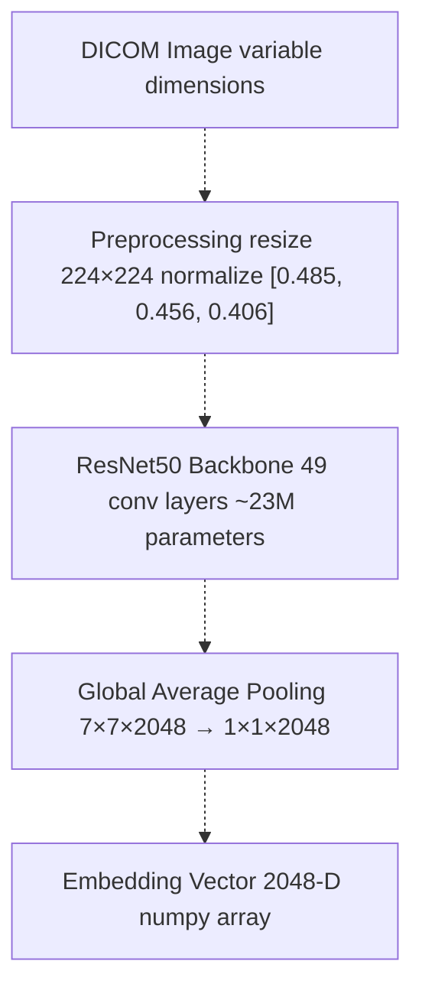

The `FeatureExtractor` class registers a forward hook on the `avgpool` layer to intercept activations during model inference. The hook captures the 2048-dimensional tensor before it passes through the classification head, effectively using ResNet50 as a feature extractor rather than a classifier.

### Output Artifacts

Stage 1 generates the following outputs in `outputs/embeddings_resnet50/`:

* `features.npy` - Raw embeddings matrix (N × 2048)
* `joined.csv` - Embeddings joined with metadata (labels, paths, AccessionNumber)
* `pca.npy`, `tsne.npy`, `umap.npy` - 2D projections for visualization
* `preview/*.png` - Scatter plots colored by ground truth density class
* `clustering_metrics.json` - Silhouette score, Davies-Bouldin index, Calinski-Harabasz index

These embeddings can be reused across multiple classification experiments without re-extraction, significantly reducing computational overhead for hyperparameter tuning and cross-validation.

For detailed implementation, see [Embedding Extraction (ResNet50)](3a%20Embedding-Extraction-%28ResNet50%29.md).

**Sources:** [src/mammography/commands/embed.py L1-L200](https://github.com/ThalesMMS/mammography-pipelines/blob/01443313/src/mammography/commands/embed.py#L1-L200)

 [Article/article.md L51-L59](https://github.com/ThalesMMS/mammography-pipelines/blob/01443313/Article/article.md#L51-L59)

---

## Stage 2: Supervised Classification

The second stage trains an EfficientNetB0 classifier to predict BI-RADS density categories (A, B, C, D) or binary density classes (AB vs CD). The model uses transfer learning with strategic layer freezing to prevent overfitting on the limited medical imaging dataset.

### Key Characteristics

| Aspect | Detail |
| --- | --- |
| **Architecture** | EfficientNetB0 with compound scaling and squeeze-excitation blocks |
| **Pretrained Weights** | ImageNet-1k (same distribution as Stage 1) |
| **Parameters** | ~4M in backbone, ~5K-16K in classification head (depends on num_classes) |
| **Transfer Strategy** | Frozen backbone + unfrozen last block (recommended) |
| **Output Classes** | 4 classes (A, B, C, D) or 2 classes (AB, CD) |
| **CLI Command** | `mammography train-density` |

### Classification Workflow

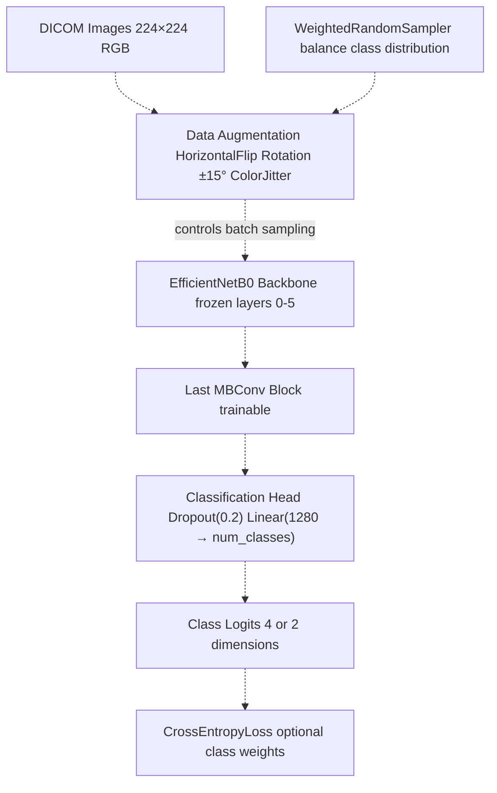

### Training Configuration

The training loop implements several techniques to prevent model collapse on imbalanced datasets:

**Class Imbalance Handling:**

* `WeightedRandomSampler` with inverse frequency weighting
* Optional class weights in `CrossEntropyLoss` (mutually exclusive with sampler)
* Stratified group splitting by `AccessionNumber` to prevent data leakage

**Optimization:**

* Adam optimizer with learning rate 1e-4
* CosineAnnealingLR scheduler for gradual learning rate decay
* Mixed precision training (AMP) for memory efficiency
* Warmup epochs with frozen backbone before unfreezing last block

**Checkpointing:**

* Best model selection based on `bal_acc_adj` > `kappa` > `auc` > `macro_f1` > `acc`
* Early stopping if validation metrics degrade for 5 consecutive epochs
* Both `best_model.pt` and `last_model.pt` saved

For detailed training mechanics, see [Training Loop and Optimization](3d%20Training-Loop-and-Optimization.md).

**Sources:** [src/mammography/commands/train_density.py L1-L300](https://github.com/ThalesMMS/mammography-pipelines/blob/01443313/src/mammography/commands/train_density.py#L1-L300)

 [Article/article.md L60-L76](https://github.com/ThalesMMS/mammography-pipelines/blob/01443313/Article/article.md#L60-L76)

 [Article/article.md L91-L125](https://github.com/ThalesMMS/mammography-pipelines/blob/01443313/Article/article.md#L91-L125)

---

## Transfer Learning Strategy

The pipeline implements three freezing strategies, with **frozen backbone + unfrozen last block** as the recommended default:

### Freezing Strategy Comparison

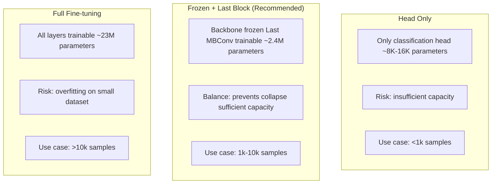

| Strategy | Trainable Params | Typical Accuracy (4-class) | Model Collapse Risk | CLI Flags |
| --- | --- | --- | --- | --- |
| **Full Fine-tuning** | ~23M | 65-68% | High | `--train-backbone` |
| **Frozen + Last Block** | ~2.4M | **72-78%** | Low | `--unfreeze-last-block` |
| **Head Only** | ~8K | 63-66% | Medium | (default, no flags) |

The "frozen + last block" strategy achieves optimal performance on the IRMA dataset (1,269 images) by allowing domain adaptation in the deepest layers while preventing catastrophic forgetting of ImageNet features in early layers.

For detailed analysis of transfer learning strategies, see [Transfer Learning Strategies](3c%20Transfer-Learning-Strategies.md).

**Sources:** [Article/article.md L67-L76](https://github.com/ThalesMMS/mammography-pipelines/blob/01443313/Article/article.md#L67-L76)

 [Article/article.md L293-L318](https://github.com/ThalesMMS/mammography-pipelines/blob/01443313/Article/article.md#L293-L318)

---

## Optional Embedding Fusion

The pipeline supports an optional **embedding fusion** mode where Stage 1 embeddings are concatenated with intermediate features from the EfficientNetB0 backbone during classification. This approach combines the benefits of both models.

### Fusion Architecture

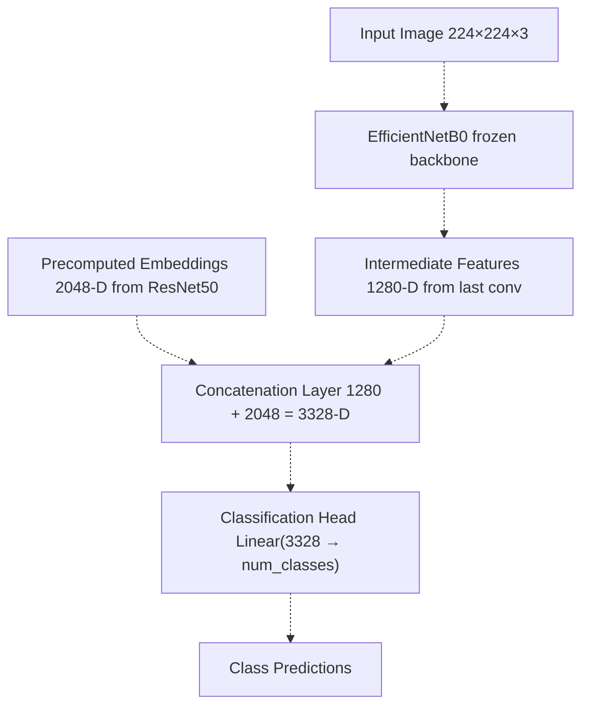

### Fusion Benefits and Tradeoffs

**Benefits:**

* Combines complementary information from two architectures
* ResNet50 residual connections capture different features than EfficientNet squeeze-excitation
* Precomputed embeddings eliminate need to backpropagate through ResNet50

**Tradeoffs:**

* Increased classification head complexity (3328 input dimensions vs 1280)
* Requires running Stage 1 before Stage 2
* Higher memory consumption during training
* Risk of overfitting on small datasets due to increased capacity

**Empirical Performance:** In experiments on the IRMA dataset, embedding fusion provided marginal improvements (1-2% accuracy gain) at the cost of doubled training time. The single-stage EfficientNetB0 approach is therefore recommended for most use cases.

**Sources:** [Article/article.md L1-L512](https://github.com/ThalesMMS/mammography-pipelines/blob/01443313/Article/article.md#L1-L512)

---

## Pipeline Execution Modes

The pipeline supports three execution modes depending on research needs:

### Mode 1: Independent Stages (Recommended)

Execute Stage 1 and Stage 2 independently without fusion:

```
# Stage 1: Extract embeddings oncemammography embed --csv classificacao.csv --dicom-root archive \    --outdir outputs/embeddings_resnet50 --pca --tsne --umap# Stage 2: Train classifier (can be run multiple times with different configs)mammography train-density --csv classificacao.csv --dicom-root archive \    --arch efficientnetb0 --epochs 50 --unfreeze-last-block \    --outdir outputs/mammo_efficientnetb0_density/results_42
```

This mode maximizes flexibility for hyperparameter tuning, as embeddings are reused across experiments.

### Mode 2: Embedding Fusion

Execute Stage 1, then Stage 2 with fusion:

```
# Stage 1: Extract embeddingsmammography embed --csv classificacao.csv --dicom-root archive \    --outdir outputs/embeddings_resnet50# Stage 2: Train with fusion (not yet fully implemented)mammography train-density --csv classificacao.csv --dicom-root archive \    --arch efficientnetb0 --fusion-embeddings outputs/embeddings_resnet50/features.npy \    --outdir outputs/mammo_fusion_density
```

This mode requires both stages to be executed sequentially.

### Mode 3: End-to-End Classification Only

Skip embedding extraction and train only the EfficientNetB0 classifier:

```
mammography train-density --csv classificacao.csv --dicom-root archive \    --arch efficientnetb0 --epochs 50 --unfreeze-last-block \    --outdir outputs/mammo_efficientnetb0_density
```

This mode is fastest for quick experiments but loses the benefits of reusable embeddings.

**Sources:** [Article/article.md L456-L492](https://github.com/ThalesMMS/mammography-pipelines/blob/01443313/Article/article.md#L456-L492)

---

## Pipeline Outputs and Artifacts

Both stages generate comprehensive outputs for reproducibility and analysis:

### Stage 1 Outputs (outputs/embeddings_resnet50/)

| Artifact | Format | Description |
| --- | --- | --- |
| `features.npy` | NumPy binary | Raw 2048-D embeddings (N × 2048 array) |
| `joined.csv` | CSV | Embeddings with metadata (labels, paths, AccessionNumber) |
| `pca.npy` | NumPy binary | 2D PCA projection for visualization |
| `tsne.npy` | NumPy binary | 2D t-SNE projection (perplexity=30) |
| `umap.npy` | NumPy binary | 2D UMAP projection (n_neighbors=15) |
| `preview/pca.png` | PNG | Scatter plot colored by density class |
| `preview/tsne.png` | PNG | t-SNE scatter plot |
| `preview/umap.png` | PNG | UMAP scatter plot |
| `clustering_metrics.json` | JSON | Silhouette, Davies-Bouldin, Calinski-Harabasz scores |

### Stage 2 Outputs (outputs/mammo_efficientnetb0_density/results_*/)

| Artifact | Format | Description |
| --- | --- | --- |
| `best_model.pt` | PyTorch checkpoint | Model with best validation `bal_acc_adj` |
| `last_model.pt` | PyTorch checkpoint | Final epoch model (for debugging) |
| `summary.json` | JSON | Hyperparameters, git hash, dataset statistics |
| `data_manifest.json` | JSON | Data traceability (file paths, splits, checksums) |
| `train_history.csv` | CSV | Per-epoch metrics (loss, accuracy, kappa) |
| `train_history.json` | JSON | Same as CSV but in JSON format |
| `history.png` | PNG | Training curves (loss and accuracy over epochs) |
| `val_metrics.json` | JSON | Comprehensive validation metrics at best epoch |
| `confusion_matrix.png` | PNG | Confusion matrix + per-class precision/recall/F1 bars |
| `run.log` | Text | Complete terminal output for debugging |

### Cross-Validation Outputs

When running k-fold cross-validation with `--cv-folds k`:

```markdown
outputs/mammo_efficientnetb0_density/density_experiments/results_k3_seed42/
├── fold_1/
│   ├── results/
│   │   ├── best_model.pt
│   │   ├── val_metrics.json
│   │   └── confusion_matrix.png
├── fold_2/
│   └── results/
├── fold_3/
│   └── results/
├── cv_summary.json  # Aggregated metrics across folds
└── run.log
```

The `cv_summary.json` file contains mean ± standard deviation for all metrics, enabling statistical comparison of different configurations.

For details on cross-validation and hyperparameter optimization, see [Cross-Validation and Hyperparameter Optimization](3e%20Cross-Validation-and-Hyperparameter-Optimization.md).

**Sources:** [Article/article.md L496-L507](https://github.com/ThalesMMS/mammography-pipelines/blob/01443313/Article/article.md#L496-L507)

 [Article/chapters/01-introducao.tex L14-L16](https://github.com/ThalesMMS/mammography-pipelines/blob/01443313/Article/chapters/01-introducao.tex#L14-L16)

---

## Performance Summary

The pipeline achieves the following performance on the IRMA dataset (1,269 images):

### Best Model Configuration

| Configuration | Value |
| --- | --- |
| **Stage 1 Model** | ResNet50 (pretrained ImageNet) |
| **Stage 2 Model** | EfficientNetB0 (pretrained ImageNet) |
| **Transfer Strategy** | Frozen backbone + unfrozen last block |
| **Training Epochs** | 50 |
| **Batch Size** | 16 |
| **Learning Rate** | 1e-4 |
| **Optimizer** | Adam |
| **Scheduler** | CosineAnnealingLR |
| **Class Balancing** | WeightedRandomSampler |

### Performance Metrics

| Task | Accuracy | Kappa | AUC | Macro F1 | Val Loss |
| --- | --- | --- | --- | --- | --- |
| **4-class (A, B, C, D)** | 72.6% | 0.57 | 0.88 | 0.61 | 0.645 |
| **Binary (AB vs CD)** | 86.0% | 0.72 | 0.94 | 0.86 | 0.558 |

**Key Observations:**

* Binary classification is significantly more robust (13% higher accuracy)
* Cohen's Kappa of 0.57 indicates "moderate agreement" for 4-class
* Class A (3.2% of dataset) remains the most challenging to classify
* Frozen + last block strategy prevents model collapse observed in full fine-tuning

For detailed experimental results, see [Article/article.md L142-L389](https://github.com/ThalesMMS/mammography-pipelines/blob/01443313/Article/article.md#L142-L389)

**Sources:** [Article/article.md L157-L166](https://github.com/ThalesMMS/mammography-pipelines/blob/01443313/Article/article.md#L157-L166)

 [Article/article.md L314-L336](https://github.com/ThalesMMS/mammography-pipelines/blob/01443313/Article/article.md#L314-L336)

 [Article/article.md L377-L388](https://github.com/ThalesMMS/mammography-pipelines/blob/01443313/Article/article.md#L377-L388)

---

## Integration with CLI Commands

The two-stage pipeline is fully automated through the `mammography` CLI:

### CLI Command Mapping

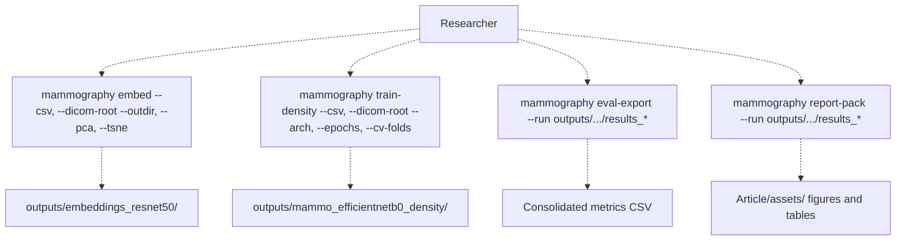

For complete CLI reference, see [Mammography CLI Reference](2%20Mammography-CLI-Reference.md).

**Sources:** [src/mammography/commands/embed.py L1-L200](https://github.com/ThalesMMS/mammography-pipelines/blob/01443313/src/mammography/commands/embed.py#L1-L200)

 [src/mammography/commands/train_density.py L1-L300](https://github.com/ThalesMMS/mammography-pipelines/blob/01443313/src/mammography/commands/train_density.py#L1-L300)

---

## Next Steps

This page provided an overview of the two-stage ML pipeline architecture. For detailed information:

* **Embedding extraction details**: See [Embedding Extraction (ResNet50)](3a%20Embedding-Extraction-%28ResNet50%29.md)
* **Classification architecture**: See [Density Classification (EfficientNetB0)](3b%20Density-Classification-%28EfficientNetB0%29.md)
* **Transfer learning analysis**: See [Transfer Learning Strategies](3c%20Transfer-Learning-Strategies.md)
* **Training optimization**: See [Training Loop and Optimization](3d%20Training-Loop-and-Optimization.md)
* **Validation strategies**: See [Cross-Validation and Hyperparameter Optimization](3e%20Cross-Validation-and-Hyperparameter-Optimization.md)
* **Data management**: See [Data Management](4%20Data-Management.md)
* **Evaluation framework**: See [Evaluation and Metrics](5%20Evaluation-and-Metrics.md)
* **Model collapse prevention**: See [Model Collapse Prevention](7%20Model-Collapse-Prevention.md)

---

## Component Overview Table

| Component | Primary Location | Key Classes/Functions | Responsibility |
| --- | --- | --- | --- |
| **Data Pipeline** | `unified_cli/data/` | `load_dataset()`, `MammoDataset`, `create_splits()` | Load and preprocess medical images, handle DICOM format, manage dataset splits |
| **Model Architectures** | `unified_cli/models/` | `create_model()`, `MODEL_FACTORIES`, `FeatureExtractor` | Factory pattern for model instantiation, architecture implementations, feature extraction hooks |
| **Training System** | `unified_cli/train/` | `Trainer`, `get_loss_fn()`, `get_weighted_sampler()`, `calculate_metrics()` | Training loop orchestration, loss computation, batch sampling, metric calculation |
| **Feature Processing** | `unified_cli/features/` | `extract_features()`, `run_pca()`, `run_tsne()`, `run_umap()`, `run_kmeans()` | Embedding extraction, dimensionality reduction, clustering analysis |
| **Visualization** | `unified_cli/viz/` & `unified_cli/train/metrics.py` | `save_metrics_figure()`, `save_history_figure()`, `plot_embeddings()` | Generate confusion matrices, training history plots, embedding visualizations |

---

## 1. Data Pipeline Component

The data pipeline handles all aspects of loading, preprocessing, and batching medical imaging data. It abstracts away format-specific details (DICOM vs PNG) and provides a consistent interface for downstream components.

### Key Entities

**Dataset Loading:**

* `load_dataset(dataset_format, csv_path, dicom_root, dataset_root)` - Auto-detects and loads from multiple formats
* `create_splits(df, val_frac, seed, num_classes)` - Stratified group splitting with patient-level grouping

**Dataset Class:**

* `MammoDataset` - PyTorch `Dataset` implementation with configurable caching, augmentation, and preprocessing
* Constructor parameters: `rows`, `img_size`, `train`, `augment`, `num_classes`, `input_channels`, `mean`, `std`

**Transforms:**

* `get_transforms(img_size, train, augment, mean, std)` - Returns `torchvision.transforms.Compose` pipeline

**DICOM Processing:**

* `dicom_to_pil_rgb(dcm_path)` - Converts DICOM to PIL RGB image with windowing and normalization

### Data Flow Through Dataset

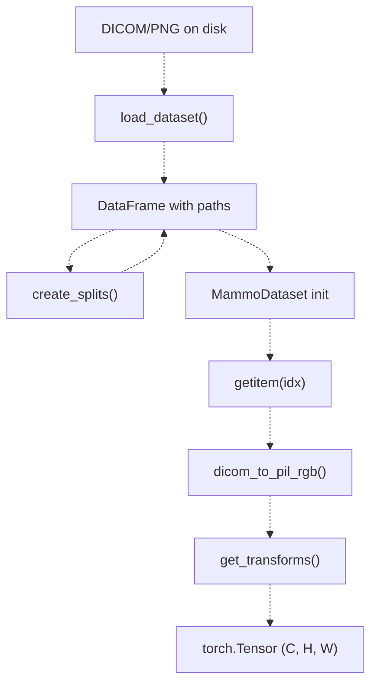

**Implementation Details:**

* Supports multiple caching modes: `disk` (PNG cache), `memory` (in-RAM), `tensor-disk`, `tensor-memmap`, `none`
* Handles MONOCHROME1 inversion automatically
* Applies robust windowing using percentile-based clipping
* Converts grayscale medical images to 3-channel RGB for compatibility with pretrained models

For detailed information about DICOM handling, caching strategies, and data splitting logic, see [Data Pipeline](3a%20Embedding-Extraction-%28ResNet50%29.md).

**Sources:** [unified_cli/tasks/train_task.py L44-L88](https://github.com/ThalesMMS/mammography-pipelines/blob/01443313/unified_cli/tasks/train_task.py#L44-L88)

 [unified_cli/data/transforms.py L1-L53](https://github.com/ThalesMMS/mammography-pipelines/blob/01443313/unified_cli/data/transforms.py#L1-L53)

---

## 2. Model Architectures Component

The model component implements a **registry pattern** that decouples model instantiation from task logic. New architectures can be added without modifying existing task code.

### Model Registry Pattern

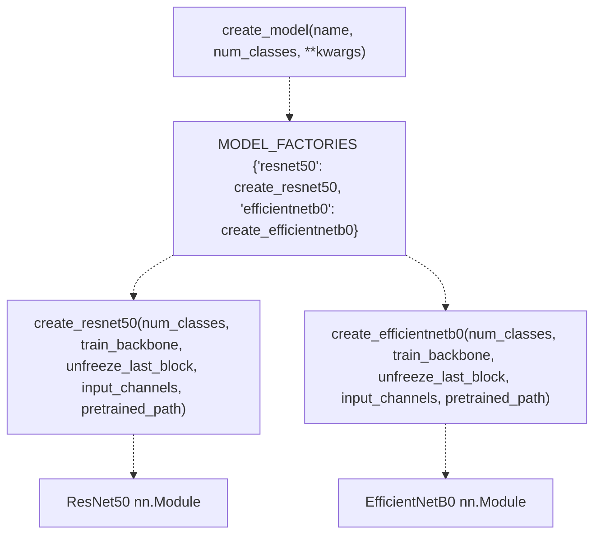

### Key Functions

**Model Factory:**

```
create_model(name, num_classes, **kwargs) -> nn.Module
```

* `name`: String identifier (e.g., `"resnet50"`, `"efficientnetb0"`)
* `num_classes`: Output dimension (2 for binary, 4 for BI-RADS)
* `**kwargs`: Passed to specific factory, includes: * `train_backbone`: Whether to unfreeze all backbone layers * `unfreeze_last_block`: Whether to unfreeze only the final residual block * `input_channels`: Number of input channels (default 3) * `pretrained_path`: Path to custom pretrained weights

**Model Factories:**

* `create_resnet50()` - Instantiates ResNet50 from `torchvision.models`
* `create_efficientnetb0()` - Instantiates EfficientNetB0

### Model Customization

All models support three **freezing strategies**:

| Strategy | `train_backbone` | `unfreeze_last_block` | Trainable Parameters | Use Case |
| --- | --- | --- | --- | --- |
| **Full Fine-tuning** | `True` | N/A | ~23M (ResNet50) | Large datasets (>10k samples) |
| **Partial Unfreezing** | `False` | `True` | ~2.4M (ResNet50) | **Recommended default** for medical imaging |
| **Head-Only** | `False` | `False` | ~8k (2 classes), ~16k (4 classes) | Very small datasets (<1k samples) |

The **partial unfreezing strategy** is the system's recommended default as it prevents model collapse on imbalanced medical datasets while retaining sufficient capacity for domain adaptation.

For detailed architecture specifications and transfer learning strategies, see [Model Architectures](3b%20Density-Classification-%28EfficientNetB0%29.md) and [Transfer Learning Strategies](5b%20Confusion-Matrices-and-Per-Class-Analysis.md).

**Sources:** [unified_cli/models/registry.py L1-L29](https://github.com/ThalesMMS/mammography-pipelines/blob/01443313/unified_cli/models/registry.py#L1-L29)

 [unified_cli/tasks/train_task.py L124-L133](https://github.com/ThalesMMS/mammography-pipelines/blob/01443313/unified_cli/tasks/train_task.py#L124-L133)

---

## 3. Training System Component

The training component encapsulates the training loop, loss computation, sampling strategies, and metric calculation into a cohesive system designed specifically for imbalanced medical imaging datasets.

### Trainer Architecture

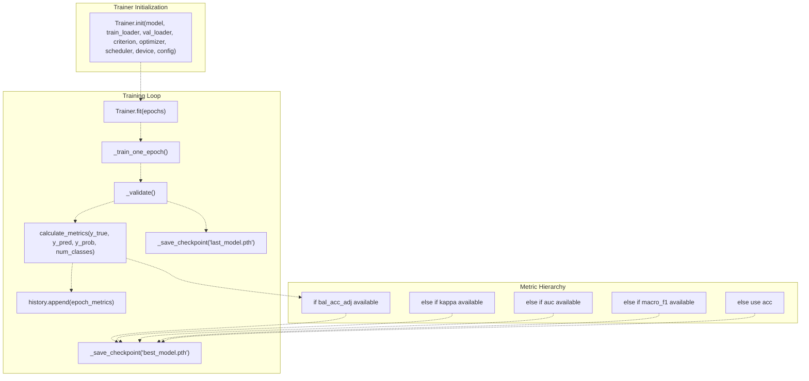

### Key Components

**Trainer Class:**

* Manages training state, device placement, mixed precision (AMP)
* Orchestrates train/validation phases per epoch
* Implements best model selection based on metric hierarchy
* Generates visualizations and saves checkpoints

**Loss Function Factory:**

```
get_loss_fn(class_weights, device, num_classes, train_counts) -> nn.Module
```

* Returns `nn.CrossEntropyLoss` with optional class weighting
* Automatically computes inverse frequency weights when `class_weights="auto"`
* Implements mutex logic to prevent double-compensation when used with `WeightedRandomSampler`

**Sampler Factory:**

```
get_weighted_sampler(train_records, num_classes, alpha=1.0) -> WeightedRandomSampler
```

* Returns `torch.utils.data.WeightedRandomSampler` for balanced batch sampling
* Weight calculation: `weight ∝ 1 / (class_frequency^alpha)`
* Default `alpha=1.0` provides full inverse frequency weighting

**Metrics Calculator:**

```
calculate_metrics(y_true, y_pred, y_prob, num_classes) -> dict
```

Returns:

* `acc`: Simple accuracy
* `bal_acc`: Balanced accuracy (mean recall across classes)
* `bal_acc_adj`: Chance-corrected balanced accuracy
* `kappa`: Cohen's Kappa
* `auc`: AUC-ROC (binary) or AUC-OvR (multiclass)
* `macro_f1`: Macro-averaged F1 score
* `confusion_matrix`: Per-class confusion matrix
* `classification_report`: Precision/recall/F1 per class

### Best Model Selection Priority

The system prioritizes **robust metrics** that detect model collapse:

1. **`bal_acc_adj`** (balanced accuracy adjusted for chance) - **Highest priority**
2. **`kappa`** (Cohen's Kappa) - Accounts for chance agreement
3. **`auc`** (AUC One-vs-Rest) - Threshold-independent
4. **`macro_f1`** - Unweighted per-class average
5. **`acc`** (simple accuracy) - Fallback only

This hierarchy ensures that models predicting only the majority class (model collapse) are not selected as "best" despite potentially high simple accuracy.

For complete training system details, see [Training System](3c%20Transfer-Learning-Strategies.md). For the model collapse problem and prevention strategies, see [Model Collapse Prevention](5a%20Performance-Metrics.md).

**Sources:** [unified_cli/tasks/train_task.py L91-L208](https://github.com/ThalesMMS/mammography-pipelines/blob/01443313/unified_cli/tasks/train_task.py#L91-L208)

 [unified_cli/train/metrics.py L18-L89](https://github.com/ThalesMMS/mammography-pipelines/blob/01443313/unified_cli/train/metrics.py#L18-L89)

---

## 4. Feature Processing Component

The feature processing component extracts intermediate layer representations (embeddings) from trained models and applies dimensionality reduction and clustering for visualization and analysis.

### Feature Extraction Pipeline

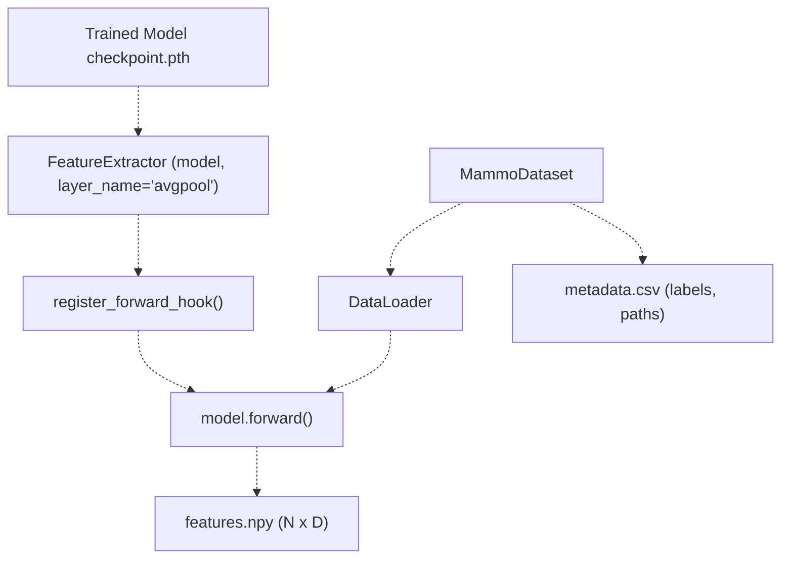

### Dimensionality Reduction Methods

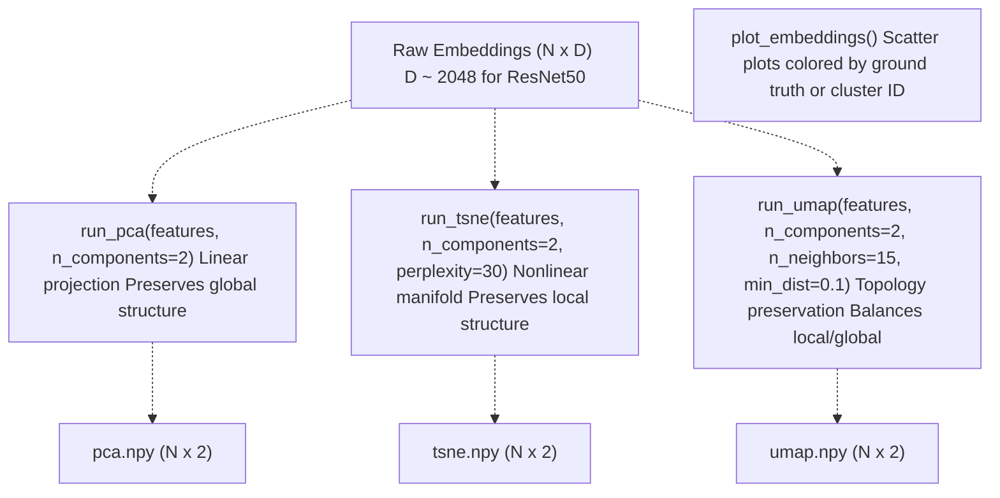

### Key Functions

**Feature Extractor:**

```
class FeatureExtractor:    def __init__(self, model, layer_name='avgpool')    def extract(self, dataloader) -> (np.ndarray, list)
```

* Hooks into specified layer to capture activations
* Supports any layer name that exists in the model
* Returns embeddings array and metadata list

**Reduction Functions:**

* `run_pca(features, n_components)` - Principal Component Analysis
* `run_tsne(features, n_components, perplexity)` - t-SNE with configurable perplexity
* `run_umap(features, n_components, n_neighbors, min_dist)` - UMAP with topology preservation

**Clustering:**

* `run_kmeans(features, n_clusters, random_state)` - K-Means clustering
* Returns cluster labels for each sample

### Output Artifacts

The feature extraction task generates:

* `features.npy` - Raw high-dimensional embeddings (N × D)
* `metadata.csv` - Sample identifiers and ground truth labels
* `pca.npy`, `tsne.npy`, `umap.npy` - 2D reduced embeddings
* `kmeans_labels.npy` - Cluster assignments
* `pca.png`, `tsne.png`, `umap.png` - Visualization scatter plots

For complete feature extraction workflow, see [Feature Extraction](2b%20mammography-train-density.md) and [Feature Processing](3d%20Training-Loop-and-Optimization.md).

**Sources:** [unified_cli/cli.py L140-L177](https://github.com/ThalesMMS/mammography-pipelines/blob/01443313/unified_cli/cli.py#L140-L177)

---

## 5. Visualization Component

The visualization component generates publication-quality plots for training monitoring, model evaluation, and embedding analysis.

### Visualization Types

| Visualization | Function | Output | Purpose |
| --- | --- | --- | --- |
| **Training History** | `save_history_figure(history, out_path)` | `history.png` | Track loss and accuracy over epochs |
| **Confusion Matrix** | `save_metrics_figure(metrics, out_path, num_classes)` | `confusion_matrix.png` | Visualize per-class errors |
| **Per-Class Metrics** | `save_metrics_figure()` | Bar chart in `confusion_matrix.png` | Compare precision/recall/F1 across classes |
| **Embedding Scatter** | `plot_embeddings(embeddings, labels, out_path)` | `{method}.png` | Visualize feature space clustering |

### Confusion Matrix with Per-Class Metrics

The system generates a **dual-panel figure** combining:

**Left Panel:** Confusion matrix heatmap

* Rows: True labels
* Columns: Predicted labels
* Cell values: Sample counts
* Colormap: Blues (darker = more samples)

**Right Panel:** Per-class precision/recall/F1 bar chart

* X-axis: Class labels (A, B, C, D or AB, CD)
* Y-axis: Metric value (0 to 1)
* Three bars per class: Precision, Recall, F1

**Figure Title:** Overall metrics (Accuracy, Kappa, AUC)

This combined visualization enables quick assessment of both aggregate performance and per-class behavior, critical for imbalanced medical datasets.

### Training History Plot

Tracks convergence over epochs with **dual-panel layout**:

**Left Panel:** Loss curves

* Training loss (solid line with markers)
* Validation loss (solid line with markers)

**Right Panel:** Accuracy curves

* Training accuracy (solid line with markers)
* Validation accuracy (solid line with markers)

Both panels use grid lines and shared epoch axis for easy comparison.

### Implementation Details

**Matplotlib Backend:**

* Uses `matplotlib.pyplot` for all visualizations
* DPI set to 150 for high-quality outputs
* Figures saved with `tight_layout()` to prevent label clipping

**Color Schemes:**

* Confusion matrix: Blues colormap
* Metrics bars: Default matplotlib color cycle
* Embedding plots: Class-based coloring with distinct palette

For metrics calculation details, see [Metrics and Visualization](3e%20Cross-Validation-and-Hyperparameter-Optimization.md). For interpreting validation metrics, see [Interpreting Validation Metrics](6c%20Artifact-Logging.md).

**Sources:** [unified_cli/train/metrics.py L91-L184](https://github.com/ThalesMMS/mammography-pipelines/blob/01443313/unified_cli/train/metrics.py#L91-L184)

---

## Configuration Management

All core components accept configuration through dictionaries that can be sourced from CLI arguments, JSON files, or YAML presets. The configuration system uses a **flat dictionary structure** for simplicity.

### Configuration Keys by Component

**Data Configuration:**

* `dataset_format`: Format identifier (`"auto"`, `"archive"`, `"mamografias"`, `"patches"`)
* `csv_path`: Path to labels CSV
* `dicom_root`: DICOM directory root
* `dataset_root`: Dataset root directory
* `image_size`: Target image size (default: 224)
* `input_channels`: Number of input channels (default: 3)
* `mean`: Normalization mean (default: ImageNet mean)
* `std`: Normalization std (default: ImageNet std)
* `augment`: Enable data augmentation (default: `True`)

**Model Configuration:**

* `model_name`: Architecture identifier (`"resnet50"`, `"efficientnetb0"`)
* `num_classes`: Output dimension (2 or 4)
* `train_backbone`: Full fine-tuning flag (default: `False`)
* `unfreeze_last_block`: Partial unfreezing flag (default: `False`)
* `pretrained_path`: Custom pretrained weights path (optional)

**Training Configuration:**

* `epochs`: Number of training epochs (default: 50)
* `batch_size`: Batch size (default: 16)
* `lr`: Learning rate (default: 1e-4)
* `val_frac`: Validation fraction (default: 0.2)
* `seed`: Random seed (default: 42)
* `num_workers`: DataLoader workers (default: 0)
* `use_sampler`: Enable WeightedRandomSampler (default: `True`)
* `class_weights`: Class weighting strategy (`"auto"`, `None`, or list)
* `amp_enabled`: Enable mixed precision training (default: `False`)
* `scheduler`: LR scheduler type (`"cosine"`, `"plateau"`, `"step"`, `None`)

**Device Configuration:**

* `device`: Device selection (`"auto"`, `"cuda"`, `"mps"`, `"cpu"`)

### Configuration Merging Logic

The CLI implements a **two-tier configuration system**:

1. **CLI arguments** - Provide defaults for all parameters
2. **JSON config file** - Overrides CLI defaults (specified via `--config-file`)

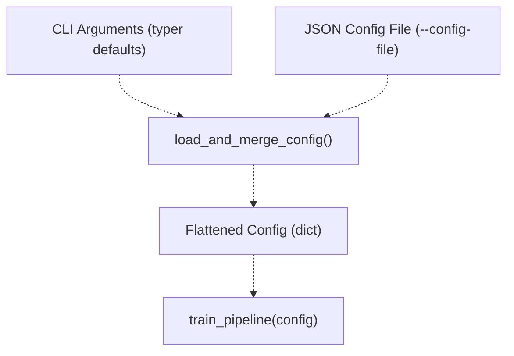

**JSON Structure Example:**

```
{  "model": {    "name": "resnet50",    "train_backbone": false,    "unfreeze_last_block": true  },  "training": {    "epochs": 50,    "batch_size": 16,    "lr": 1e-4,    "class_weights": "auto"  },  "data": {    "dataset_format": "archive",    "mean": [0.485, 0.456, 0.406],    "std": [0.229, 0.224, 0.225]  }}
```

The `load_and_merge_config()` function flattens nested JSON into a single-level dictionary for task function consumption.

For complete configuration system details, see [Configuration Management](5d%20Training-History-and-Convergence.md).

**Sources:** [unified_cli/cli.py L15-L72](https://github.com/ThalesMMS/mammography-pipelines/blob/01443313/unified_cli/cli.py#L15-L72)

 [unified_cli/tasks/train_task.py L15-L38](https://github.com/ThalesMMS/mammography-pipelines/blob/01443313/unified_cli/tasks/train_task.py#L15-L38)

---

## Component Interaction Example: Training Pipeline

To illustrate how components interact, here's the complete flow for the training task:

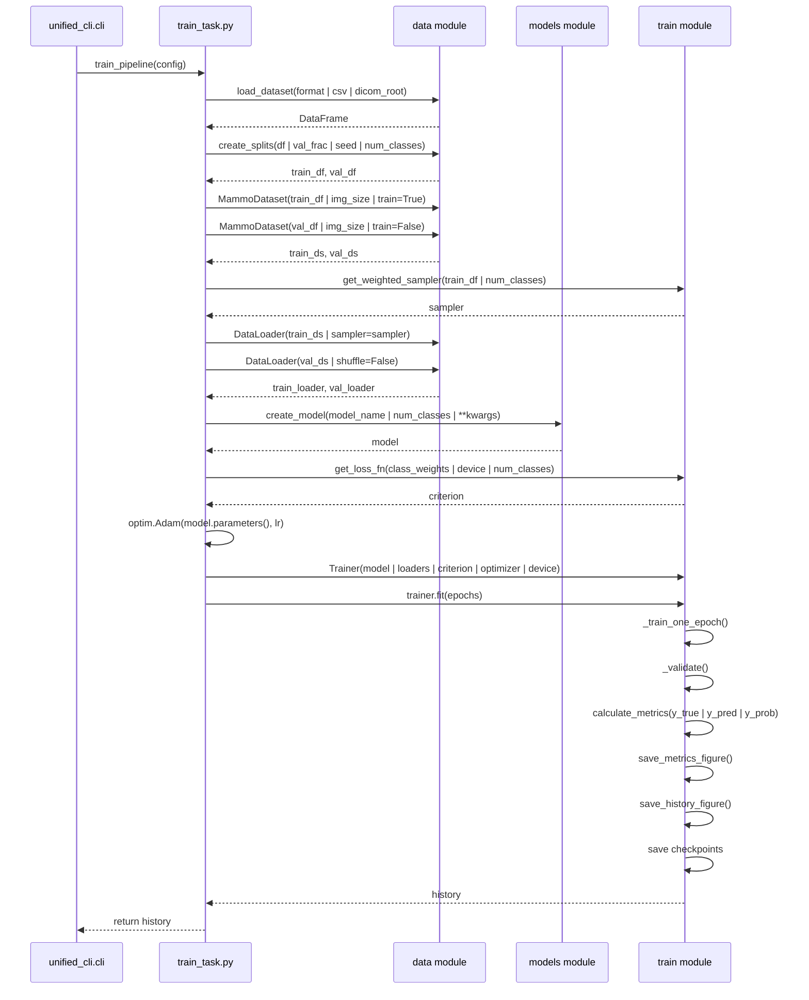

**Key Observations:**

1. **Task orchestrates** but doesn't implement logic
2. **Data module** handles all dataset preparation
3. **Models module** abstracts model creation
4. **Train module** encapsulates training loop and metrics
5. **Visualization** is automatic (metrics figures saved during training)

**Sources:** [unified_cli/tasks/train_task.py L15-L209](https://github.com/ThalesMMS/mammography-pipelines/blob/01443313/unified_cli/tasks/train_task.py#L15-L209)

---

## Shared Utilities

Several utility functions are used across multiple components:

**Device Resolution:**

```
resolve_device(device_choice: str) -> torch.device
```

* `device_choice="auto"`: Auto-detects CUDA → MPS → CPU
* `device_choice="cuda"`: Forces CUDA (falls back to CPU if unavailable)
* `device_choice="mps"`: Forces Apple MPS (falls back to CPU if unavailable)
* `device_choice="cpu"`: Forces CPU

**Usage Pattern:**

```
device = resolve_device(config.get("device", "auto"))model.to(device)
```

This utility is called by all task orchestrators before component initialization.

**Sources:** [unified_cli/tasks/train_task.py L40-L41](https://github.com/ThalesMMS/mammography-pipelines/blob/01443313/unified_cli/tasks/train_task.py#L40-L41)

---

## Extension Points

The modular architecture provides several clean extension points:

### Adding New Models

1. Implement factory function in `unified_cli/models/your_model.py`: ``` def create_your_model(num_classes, **kwargs):    model = YourModelClass(num_classes)    return model ```
2. Register in `unified_cli/models/registry.py`: ``` MODEL_FACTORIES["your_model"] = create_your_model ```
3. Use via CLI: `python -m unified_cli train --model your_model`

### Adding New Dataset Formats

1. Implement loader in `unified_cli/data/loaders.py`: ``` def load_your_format(csv_path, **kwargs):    # Return DataFrame with columns: image_path, professional_label    return df ```
2. Register in `load_dataset()` format detection logic
3. Use via CLI: `python -m unified_cli train --dataset-format your_format`

### Adding New Metrics

1. Implement calculation in `unified_cli/train/metrics.py`: ``` def calculate_your_metric(y_true, y_pred):    return value ```
2. Add to `calculate_metrics()` return dictionary
3. Metric automatically available in `val_metrics.json` and best model selection

For detailed extension guides, see [Extending the Model Registry](#7.2).

**Sources:** [unified_cli/models/registry.py L5-L28](https://github.com/ThalesMMS/mammography-pipelines/blob/01443313/unified_cli/models/registry.py#L5-L28)


### On this page

* [Machine Learning Pipeline](3%20Machine-Learning-Pipeline.md)
* [Two-Stage Architecture Overview](3%20Machine-Learning-Pipeline.md)
* [Pipeline Execution Flow](3%20Machine-Learning-Pipeline.md)
* [Stage 1: Embedding Extraction](3%20Machine-Learning-Pipeline.md)
* [Key Characteristics](3%20Machine-Learning-Pipeline.md)
* [Extraction Mechanism](3%20Machine-Learning-Pipeline.md)
* [Output Artifacts](3%20Machine-Learning-Pipeline.md)
* [Stage 2: Supervised Classification](3%20Machine-Learning-Pipeline.md)
* [Key Characteristics](3%20Machine-Learning-Pipeline.md)
* [Classification Workflow](3%20Machine-Learning-Pipeline.md)
* [Training Configuration](3%20Machine-Learning-Pipeline.md)
* [Transfer Learning Strategy](3%20Machine-Learning-Pipeline.md)
* [Freezing Strategy Comparison](3%20Machine-Learning-Pipeline.md)
* [Optional Embedding Fusion](3%20Machine-Learning-Pipeline.md)
* [Fusion Architecture](3%20Machine-Learning-Pipeline.md)
* [Fusion Benefits and Tradeoffs](3%20Machine-Learning-Pipeline.md)
* [Pipeline Execution Modes](3%20Machine-Learning-Pipeline.md)
* [Mode 1: Independent Stages (Recommended)](3%20Machine-Learning-Pipeline.md)
* [Mode 2: Embedding Fusion](3%20Machine-Learning-Pipeline.md)
* [Mode 3: End-to-End Classification Only](3%20Machine-Learning-Pipeline.md)
* [Pipeline Outputs and Artifacts](3%20Machine-Learning-Pipeline.md)
* [Stage 1 Outputs ( outputs/embeddings_resnet50/ )](3%20Machine-Learning-Pipeline.md)
* [Stage 2 Outputs ( outputs/mammo_efficientnetb0_density/results_*/ )](3%20Machine-Learning-Pipeline.md)
* [Cross-Validation Outputs](3%20Machine-Learning-Pipeline.md)
* [Performance Summary](3%20Machine-Learning-Pipeline.md)
* [Best Model Configuration](3%20Machine-Learning-Pipeline.md)
* [Performance Metrics](3%20Machine-Learning-Pipeline.md)
* [Integration with CLI Commands](3%20Machine-Learning-Pipeline.md)
* [CLI Command Mapping](3%20Machine-Learning-Pipeline.md)
* [Next Steps](3%20Machine-Learning-Pipeline.md)
* [Component Overview Table](3%20Machine-Learning-Pipeline.md)
* [1. Data Pipeline Component](3%20Machine-Learning-Pipeline.md)
* [Key Entities](3%20Machine-Learning-Pipeline.md)
* [Data Flow Through Dataset](3%20Machine-Learning-Pipeline.md)
* [2. Model Architectures Component](3%20Machine-Learning-Pipeline.md)
* [Model Registry Pattern](3%20Machine-Learning-Pipeline.md)
* [Key Functions](3%20Machine-Learning-Pipeline.md)
* [Model Customization](3%20Machine-Learning-Pipeline.md)
* [3. Training System Component](3%20Machine-Learning-Pipeline.md)
* [Trainer Architecture](3%20Machine-Learning-Pipeline.md)
* [Key Components](3%20Machine-Learning-Pipeline.md)
* [Best Model Selection Priority](3%20Machine-Learning-Pipeline.md)
* [4. Feature Processing Component](3%20Machine-Learning-Pipeline.md)
* [Feature Extraction Pipeline](3%20Machine-Learning-Pipeline.md)
* [Dimensionality Reduction Methods](3%20Machine-Learning-Pipeline.md)
* [Key Functions](3%20Machine-Learning-Pipeline.md)
* [Output Artifacts](3%20Machine-Learning-Pipeline.md)
* [5. Visualization Component](3%20Machine-Learning-Pipeline.md)
* [Visualization Types](3%20Machine-Learning-Pipeline.md)
* [Confusion Matrix with Per-Class Metrics](3%20Machine-Learning-Pipeline.md)
* [Training History Plot](3%20Machine-Learning-Pipeline.md)
* [Implementation Details](3%20Machine-Learning-Pipeline.md)
* [Configuration Management](3%20Machine-Learning-Pipeline.md)
* [Configuration Keys by Component](3%20Machine-Learning-Pipeline.md)
* [Configuration Merging Logic](3%20Machine-Learning-Pipeline.md)
* [Component Interaction Example: Training Pipeline](3%20Machine-Learning-Pipeline.md)
* [Shared Utilities](3%20Machine-Learning-Pipeline.md)
* [Extension Points](3%20Machine-Learning-Pipeline.md)
* [Adding New Models](3%20Machine-Learning-Pipeline.md)
* [Adding New Dataset Formats](3%20Machine-Learning-Pipeline.md)
* [Adding New Metrics](3%20Machine-Learning-Pipeline.md)

Ask Devin about mammography-pipelines