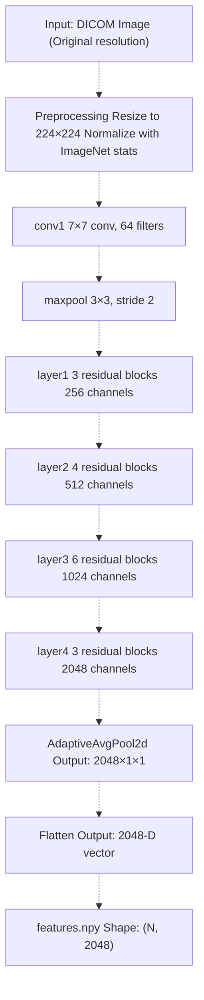
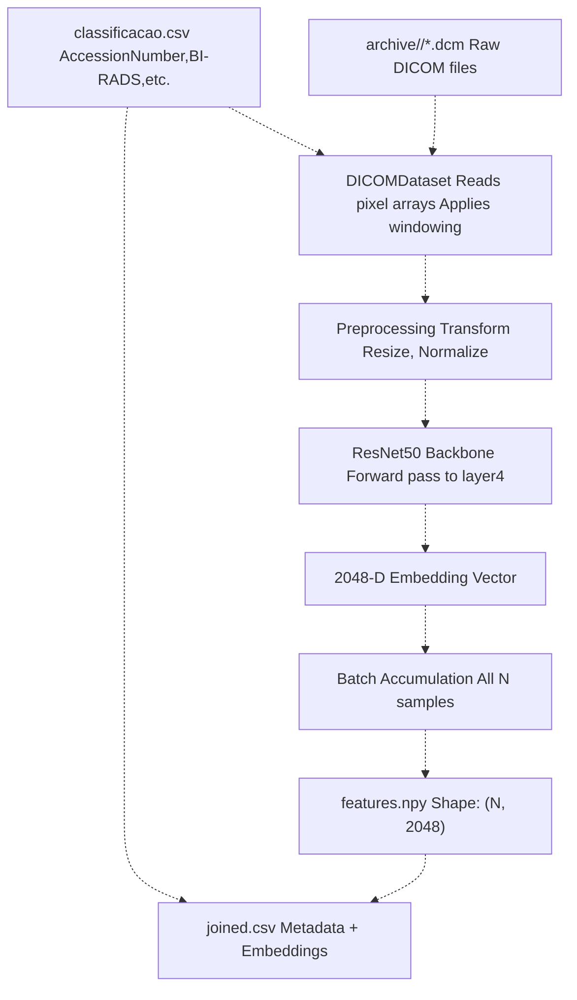
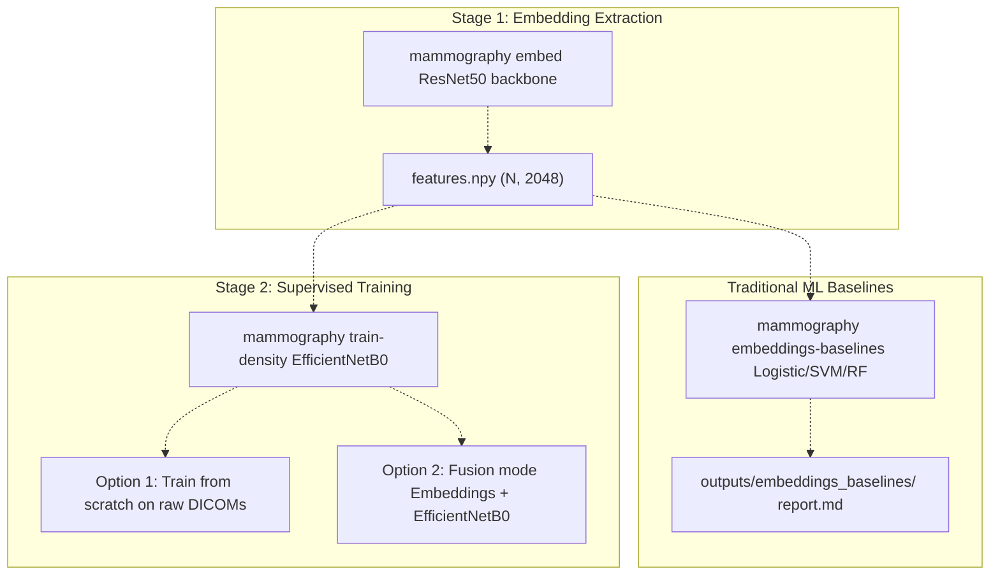

# Embedding Extraction (ResNet50)

> **Relevant source files**
> * [Article/01-embeddings.md](https://github.com/ThalesMMS/mammography-pipelines/blob/01443313/Article/01-embeddings.md)
> * [Article/article.md](https://github.com/ThalesMMS/mammography-pipelines/blob/01443313/Article/article.md)
> * [Article/assets/embeddings_pca_tsne.png](https://github.com/ThalesMMS/mammography-pipelines/blob/01443313/Article/assets/embeddings_pca_tsne.png)

## Purpose and Scope

This document explains the embedding extraction stage of the mammography pipeline, which generates reusable 2048-dimensional feature vectors from DICOM mammography images using a pretrained ResNet50 backbone. This stage is invoked via the `mammography embed` command and produces numerical representations that can be used for downstream tasks including traditional machine learning classifiers, exploratory data analysis, and optional fusion with supervised models.

For information about supervised density classification using these embeddings, see [Density Classification (EfficientNetB0)](3b%20Density-Classification-%28EfficientNetB0%29.md). For details on the CLI command parameters, see [mammography embed](2a%20mammography-embed.md).

Sources: [Article/01-embeddings.md L1-L30](https://github.com/ThalesMMS/mammography-pipelines/blob/01443313/Article/01-embeddings.md#L1-L30)

 [Article/article.md L52-L65](https://github.com/ThalesMMS/mammography-pipelines/blob/01443313/Article/article.md#L52-L65)

---

## Overview

Embedding extraction transforms high-dimensional mammography images into compact, semantically-rich feature vectors by leveraging transfer learning from a ResNet50 model pretrained on ImageNet. This approach provides several advantages:

* **Dimensionality Reduction**: Convert variable-size DICOM images to fixed 2048-D vectors
* **Transfer Learning**: Leverage visual features learned from 1.2M ImageNet images
* **Reusability**: Extract embeddings once, reuse for multiple downstream experiments
* **Interpretability**: Enable visualization via PCA, t-SNE, and UMAP projections
* **Baseline Comparisons**: Serve as input to traditional classifiers (Logistic Regression, SVM, Random Forest)

The embedding extraction stage is independent of the supervised classification task, allowing efficient experimentation without repeated image preprocessing.

Sources: [Article/01-embeddings.md L3-L6](https://github.com/ThalesMMS/mammography-pipelines/blob/01443313/Article/01-embeddings.md#L3-L6)

 [Article/article.md L52-L59](https://github.com/ThalesMMS/mammography-pipelines/blob/01443313/Article/article.md#L52-L59)

---

## ResNet50 Architecture Configuration

### Base Architecture

The ResNet50 backbone consists of 50 convolutional layers organized into residual blocks, pretrained on ImageNet-1K (1000 classes). The implementation uses PyTorch's `torchvision.models.resnet50` with the following modifications:

| Component | Configuration |
| --- | --- |
| Input Size | 224 × 224 × 1 (grayscale) or 224 × 224 × 3 (RGB-converted) |
| Backbone Layers | 50 layers (conv1 → layer4) |
| Global Pooling | AdaptiveAvgPool2d((1, 1)) |
| Embedding Dimension | 2048 |
| Total Parameters | ~23M (backbone only) |
| Classification Head | Not used for embedding extraction |

### Architecture Modifications



**Diagram: ResNet50 Embedding Extraction Architecture**

The classification head (Linear layer mapping 2048 → num_classes) is removed during embedding extraction. Only the backbone up to the global average pooling layer is used, producing fixed-size 2048-dimensional feature vectors regardless of input image dimensions.

Sources: [Article/article.md L52-L59](https://github.com/ThalesMMS/mammography-pipelines/blob/01443313/Article/article.md#L52-L59)

 [Article/01-embeddings.md L4](https://github.com/ThalesMMS/mammography-pipelines/blob/01443313/Article/01-embeddings.md#L4-L4)

---

## Extraction Pipeline

### Data Flow



**Diagram: Embedding Extraction Data Flow**

### Processing Steps

1. **Data Loading**: Parse `classificacao.csv` to obtain AccessionNumbers and labels. For each AccessionNumber, locate corresponding DICOM files in `archive/<AccessionNumber>/`.
2. **DICOM Reading**: Extract pixel arrays from DICOM files, apply MONOCHROME photometric interpretation handling, and convert to appropriate bit depth.
3. **Preprocessing**: * Resize images to 224 × 224 pixels * Convert grayscale to RGB by replicating channels (3 × H × W) * Normalize using ImageNet statistics: mean=[0.485, 0.456, 0.406], std=[0.229, 0.224, 0.225]
4. **Feature Extraction**: Forward pass through ResNet50 backbone (all layers except classification head), extract output from final average pooling layer.
5. **Batch Processing**: Process images in configurable batch sizes (default: 32) for GPU efficiency.
6. **Artifact Generation**: Save embeddings to disk, generate metadata, optionally compute dimensionality reductions.

Sources: [Article/01-embeddings.md L7-L20](https://github.com/ThalesMMS/mammography-pipelines/blob/01443313/Article/01-embeddings.md#L7-L20)

 [Article/article.md L98-L107](https://github.com/ThalesMMS/mammography-pipelines/blob/01443313/Article/article.md#L98-L107)

---

## Dimensionality Reduction Techniques

To enable visual exploration of the 2048-dimensional embedding space, the pipeline supports three dimensionality reduction techniques:

### PCA (Principal Component Analysis)

* **Method**: Linear projection maximizing variance
* **Output Dimensions**: 2 or 3
* **Use Case**: Identify primary axes of variation, detect outliers
* **Invocation**: `--pca` flag

### t-SNE (t-Distributed Stochastic Neighbor Embedding)

* **Method**: Non-linear manifold learning preserving local neighborhoods
* **Parameters**: perplexity=30, n_iter=1000
* **Output Dimensions**: 2 or 3
* **Use Case**: Visualize cluster structure, identify class separability
* **Invocation**: `--tsne` flag

### UMAP (Uniform Manifold Approximation and Projection)

* **Method**: Non-linear dimensionality reduction preserving global structure
* **Parameters**: n_neighbors=15, min_dist=0.1
* **Output Dimensions**: 2 or 3
* **Use Case**: Balance between local and global structure preservation
* **Invocation**: `--umap` flag

### Visualization Outputs

When dimensionality reduction is enabled, the pipeline generates scatter plots colored by BI-RADS density class, saved to `outputs/embeddings_resnet50/preview/`:

| File | Content |
| --- | --- |
| `pca_2d.png` | 2D PCA projection |
| `tsne_2d.png` | 2D t-SNE projection |
| `umap_2d.png` | 2D UMAP projection |
| `embeddings_pca_tsne.png` | Combined comparison figure |

Sources: [Article/01-embeddings.md L12-L26](https://github.com/ThalesMMS/mammography-pipelines/blob/01443313/Article/01-embeddings.md#L12-L26)

---

## Output Artifacts

### Primary Outputs

| File | Format | Description |
| --- | --- | --- |
| `features.npy` | NumPy binary | Embedding matrix, shape (N, 2048), dtype float32 |
| `joined.csv` | CSV | Metadata joined with image paths and labels |
| `clustering_metrics.json` | JSON | Silhouette scores, Davies-Bouldin index, Calinski-Harabasz index |
| `run.log` | Text | Complete execution log with timestamps (optional) |

### Directory Structure

```markdown
outputs/embeddings_resnet50/
├── features.npy               # (N, 2048) embedding matrix
├── joined.csv                 # Metadata + AccessionNumber mapping
├── clustering_metrics.json    # Unsupervised quality metrics
├── run.log                    # Execution log (if enabled)
└── preview/                   # Visualization outputs
    ├── pca_2d.png
    ├── tsne_2d.png
    ├── umap_2d.png
    └── embeddings_pca_tsne.png
```

### features.npy Structure

The primary artifact is a NumPy array with shape `(N, 2048)` where:

* `N` = number of mammography images processed
* `2048` = embedding dimension (ResNet50 layer4 output channels)
* dtype = `float32` for storage efficiency
* Values are typically in range [-5, 5] after batch normalization

### joined.csv Schema

The CSV file contains one row per image with columns:

| Column | Type | Description |
| --- | --- | --- |
| AccessionNumber | string | Unique identifier linking to DICOM files |
| BI-RADS | int | Density class (1=A, 2=B, 3=C, 4=D) |
| ImagePath | string | Relative path to DICOM file |
| EmbeddingIndex | int | Row index in features.npy |
| Split | string | train/val designation (if applicable) |

### clustering_metrics.json Content

When `--cluster` flag is enabled, unsupervised clustering quality metrics are computed:

```
{  "silhouette_score": 0.23,  "davies_bouldin_index": 1.85,  "calinski_harabasz_score": 124.67,  "num_samples": 1269,  "num_features": 2048,  "timestamp": "2024-12-15T10:30:45"}
```

* **Silhouette Score** (range: -1 to 1): Measures how similar objects are to their own cluster vs. other clusters. Higher is better.
* **Davies-Bouldin Index**: Average similarity ratio of each cluster with its most similar cluster. Lower is better.
* **Calinski-Harabasz Score**: Ratio of between-cluster to within-cluster variance. Higher is better.

Sources: [Article/01-embeddings.md L17-L26](https://github.com/ThalesMMS/mammography-pipelines/blob/01443313/Article/01-embeddings.md#L17-L26)

---

## Command Invocation

### Basic Usage

```
mammography embed -- \  --csv classificacao.csv \  --dicom-root archive \  --outdir outputs/embeddings_resnet50
```

### Full Feature Set

```
mammography embed -- \  --csv classificacao.csv \  --dicom-root archive \  --outdir outputs/embeddings_resnet50 \  --save-csv \  --pca \  --tsne \  --umap \  --cluster \  --batch-size 32 \  --seed 42
```

### Command Parameters

| Parameter | Type | Default | Description |
| --- | --- | --- | --- |
| `--csv` | Path | Required | CSV file with AccessionNumber and BI-RADS labels |
| `--dicom-root` | Path | Required | Root directory containing DICOM subdirectories |
| `--outdir` | Path | Required | Output directory for artifacts |
| `--save-csv` | Flag | False | Save joined.csv with metadata |
| `--pca` | Flag | False | Generate PCA visualizations |
| `--tsne` | Flag | False | Generate t-SNE visualizations |
| `--umap` | Flag | False | Generate UMAP visualizations |
| `--cluster` | Flag | False | Compute clustering quality metrics |
| `--batch-size` | int | 32 | Batch size for GPU processing |
| `--seed` | int | 42 | Random seed for reproducibility |

Sources: [Article/01-embeddings.md L7-L14](https://github.com/ThalesMMS/mammography-pipelines/blob/01443313/Article/01-embeddings.md#L7-L14)

---

## Integration with Downstream Tasks

### Traditional Machine Learning Baselines

The extracted embeddings can be fed into classical machine learning algorithms for comparison with deep learning approaches. The `mammography embeddings-baselines` command evaluates:

| Classifier | Configuration | Performance (Balanced Acc) |
| --- | --- | --- |
| Logistic Regression | C=1.0, max_iter=1000 | 0.51 (kappa=0.45) |
| Support Vector Machine | RBF kernel, C=1.0, gamma='scale' | ~0.48 |
| Random Forest | n_estimators=100, max_depth=10 | ~0.46 |

**Comparison with Classical Descriptors**: Embeddings + Logistic Regression achieved balanced accuracy of 0.51, while hand-crafted statistical descriptors + PCA achieved 0.40 (p-value=0.004 in paired t-test), demonstrating the superiority of learned representations.

### Supervised Classification Integration



**Diagram: Embedding Integration in Pipeline**

The embeddings can optionally be fused with the EfficientNetB0 classifier by concatenating the 2048-D ResNet50 features with the 1280-D EfficientNetB0 features before the final classification head. This is controlled via the `--fusion` parameter in the training command.

Sources: [Article/01-embeddings.md L27-L30](https://github.com/ThalesMMS/mammography-pipelines/blob/01443313/Article/01-embeddings.md#L27-L30)

 [Article/article.md L150-L165](https://github.com/ThalesMMS/mammography-pipelines/blob/01443313/Article/article.md#L150-L165)

---

## Reproducibility Checklist

To ensure reproducible embedding extraction:

* **Data Requirements**: * DICOM files in `archive/<AccessionNumber>/*.dcm` are readable (≥95% success rate) * `classificacao.csv` contains no class 5 labels (only BI-RADS 1-4) * All AccessionNumbers in CSV have corresponding DICOM directories
* **Environment Requirements**: * Python 3.10 or higher * PyTorch with CUDA support (for GPU acceleration) * torchvision for pretrained models * pydicom for DICOM parsing * scikit-learn for dimensionality reduction * Fixed random seed (default: 42)
* **Verification**: * `features.npy` generated with shape (N, 2048) * `joined.csv` contains N rows matching input CSV * If `--pca/--tsne/--umap`: visualizations in `preview/` directory * If `--cluster`: `clustering_metrics.json` present with valid scores * Optional: `run.log` archived for provenance
* **Performance Expectations**: * Processing time: ~0.5-1.0 seconds per image on GPU (NVIDIA RTX 3090) * Memory usage: ~4GB GPU RAM for batch_size=32 * Disk space: ~10MB per 1000 images (features.npy)

Sources: [Article/01-embeddings.md L16-L21](https://github.com/ThalesMMS/mammography-pipelines/blob/01443313/Article/01-embeddings.md#L16-L21)

---

## Performance Characteristics

### Computational Requirements

| Resource | Requirement | Notes |
| --- | --- | --- |
| GPU Memory | ~4GB | For batch_size=32 |
| CPU Memory | ~8GB | For data loading and preprocessing |
| Disk Space | ~10MB per 1000 images | features.npy storage |
| Processing Time | ~0.5-1.0s per image | GPU-accelerated (RTX 3090) |

### Embedding Quality Metrics

Based on the IRMA dataset (N=1269):

| Metric | Value | Interpretation |
| --- | --- | --- |
| Silhouette Score | ~0.23 | Moderate cluster separation |
| Davies-Bouldin Index | ~1.85 | Moderate cluster compactness |
| Calinski-Harabasz | ~124.67 | Reasonable between/within cluster ratio |

These metrics indicate that while the embeddings capture some class structure, there is significant overlap between BI-RADS density categories, reflecting the inherent difficulty of the classification task.

### Baseline Classifier Performance

Using embeddings as input to traditional classifiers on IRMA dataset:

| Method | Balanced Accuracy | Cohen's Kappa | Notes |
| --- | --- | --- | --- |
| ResNet50 Embeddings + Logistic Regression | 0.51 | 0.45 | Best traditional approach |
| Statistical Descriptors + PCA | 0.40 | 0.30 | Baseline comparison |
| p-value (paired t-test) | 0.004 | - | Embeddings significantly better |

Sources: [Article/01-embeddings.md L29-L30](https://github.com/ThalesMMS/mammography-pipelines/blob/01443313/Article/01-embeddings.md#L29-L30)

 [Article/article.md L147-L165](https://github.com/ThalesMMS/mammography-pipelines/blob/01443313/Article/article.md#L147-L165)

---

## Implementation Notes

### Model Freezing

During embedding extraction, the entire ResNet50 backbone is frozen (gradients disabled) to:

* Prevent weight updates during forward passes
* Reduce memory consumption
* Accelerate inference by disabling gradient computation

This is in contrast to supervised training where portions of the network may be unfrozen for fine-tuning (see [Transfer Learning Strategies](3c%20Transfer-Learning-Strategies.md)).

### Batch Processing

Images are processed in batches to maximize GPU utilization. The optimal batch size depends on:

* Available GPU memory
* Image resolution (224×224 for this pipeline)
* Number of feature extraction layers

Typical configurations:

* NVIDIA RTX 3090 (24GB): batch_size=64-128
* NVIDIA GTX 1080 Ti (11GB): batch_size=32
* CPU-only: batch_size=8-16 (significantly slower)

### Output Precision

Embeddings are saved in `float32` precision (4 bytes per value) rather than `float64` to:

* Reduce storage requirements by 50%
* Maintain sufficient numerical precision for downstream tasks
* Ensure compatibility with PyTorch default tensor types

Sources: [Article/article.md L52-L76](https://github.com/ThalesMMS/mammography-pipelines/blob/01443313/Article/article.md#L52-L76)

---

## Related Commands

* **[mammography train-density](2b%20mammography-train-density.md)**: Use embeddings in supervised classification
* **[mammography embeddings-baselines](2e%20mammography-embeddings-baselines.md)**: Evaluate traditional classifiers on embeddings
* **[mammography eval-export](2c%20mammography-eval-export.md)**: Export evaluation metrics from completed runs
* **[mammography report-pack](2d%20mammography-report-pack.md)**: Sync embedding visualizations to article assets

For details on the complete ML pipeline architecture, see [Machine Learning Pipeline](3%20Machine-Learning-Pipeline.md).


### On this page

* [Embedding Extraction (ResNet50)](#3.1-embedding-extraction-resnet50)
* [Purpose and Scope](#3.1-purpose-and-scope)
* [Overview](#3.1-overview)
* [ResNet50 Architecture Configuration](#3.1-resnet50-architecture-configuration)
* [Base Architecture](#3.1-base-architecture)
* [Architecture Modifications](#3.1-architecture-modifications)
* [Extraction Pipeline](#3.1-extraction-pipeline)
* [Data Flow](#3.1-data-flow)
* [Processing Steps](#3.1-processing-steps)
* [Dimensionality Reduction Techniques](#3.1-dimensionality-reduction-techniques)
* [PCA (Principal Component Analysis)](#3.1-pca-principal-component-analysis)
* [t-SNE (t-Distributed Stochastic Neighbor Embedding)](#3.1-t-sne-t-distributed-stochastic-neighbor-embedding)
* [UMAP (Uniform Manifold Approximation and Projection)](#3.1-umap-uniform-manifold-approximation-and-projection)
* [Visualization Outputs](#3.1-visualization-outputs)
* [Output Artifacts](#3.1-output-artifacts)
* [Primary Outputs](#3.1-primary-outputs)
* [Directory Structure](#3.1-directory-structure)
* [features.npy Structure](#3.1-featuresnpy-structure)
* [joined.csv Schema](#3.1-joinedcsv-schema)
* [clustering_metrics.json Content](#3.1-clustering_metricsjson-content)
* [Command Invocation](#3.1-command-invocation)
* [Basic Usage](#3.1-basic-usage)
* [Full Feature Set](#3.1-full-feature-set)
* [Command Parameters](#3.1-command-parameters)
* [Integration with Downstream Tasks](#3.1-integration-with-downstream-tasks)
* [Traditional Machine Learning Baselines](#3.1-traditional-machine-learning-baselines)
* [Supervised Classification Integration](#3.1-supervised-classification-integration)
* [Reproducibility Checklist](#3.1-reproducibility-checklist)
* [Performance Characteristics](#3.1-performance-characteristics)
* [Computational Requirements](#3.1-computational-requirements)
* [Embedding Quality Metrics](#3.1-embedding-quality-metrics)
* [Baseline Classifier Performance](#3.1-baseline-classifier-performance)
* [Implementation Notes](#3.1-implementation-notes)
* [Model Freezing](#3.1-model-freezing)
* [Batch Processing](#3.1-batch-processing)
* [Output Precision](#3.1-output-precision)
* [Related Commands](#3.1-related-commands)

Ask Devin about mammography-pipelines