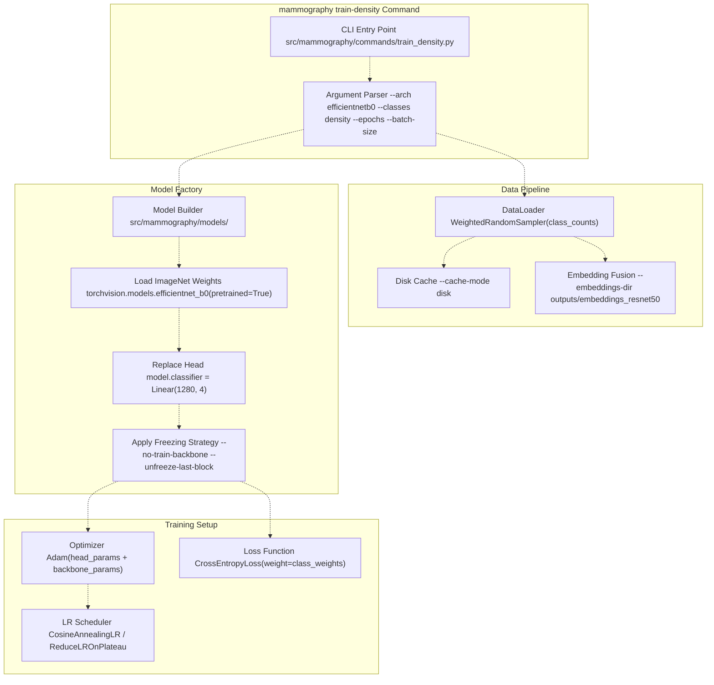
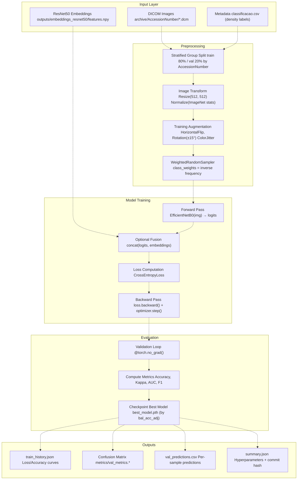
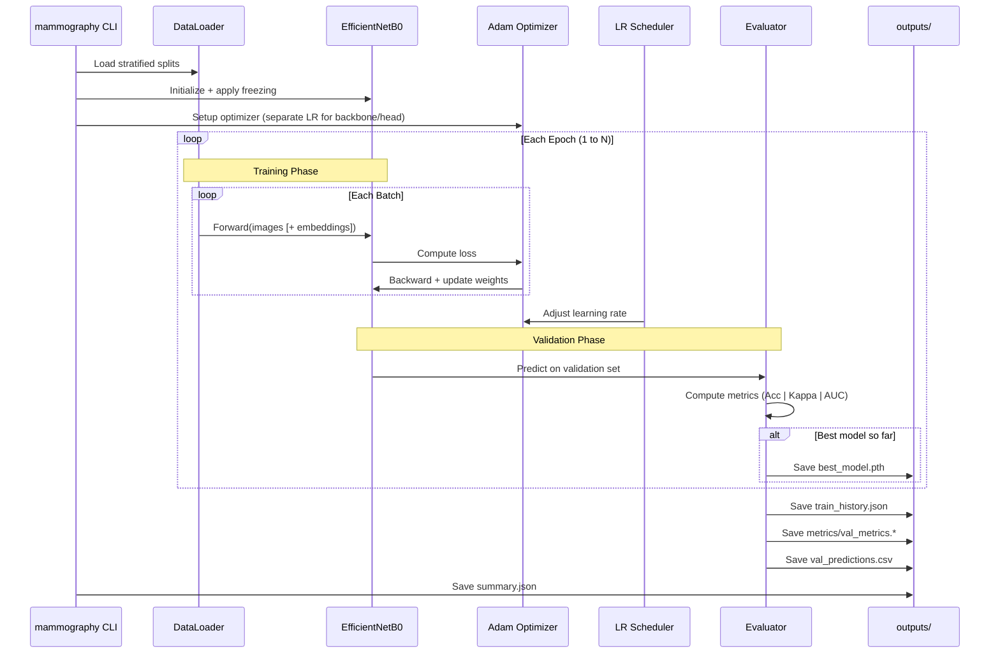
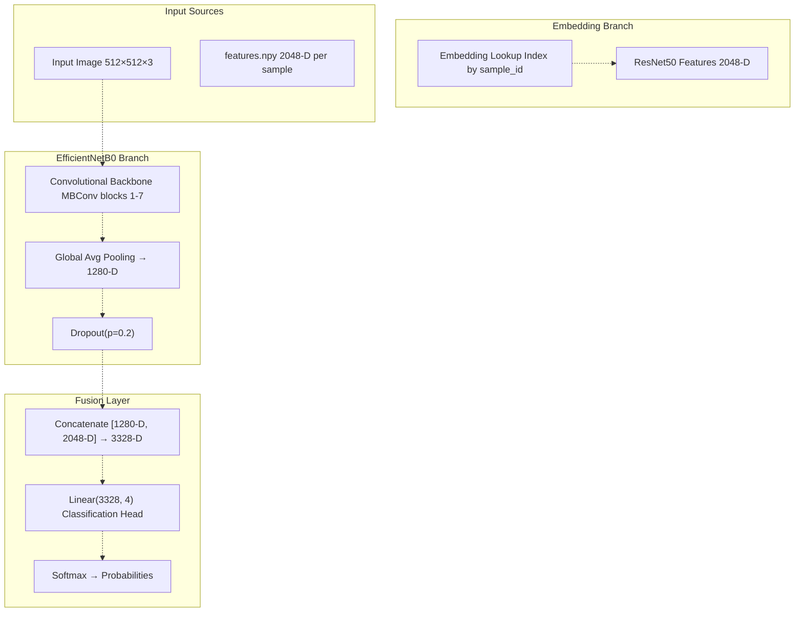
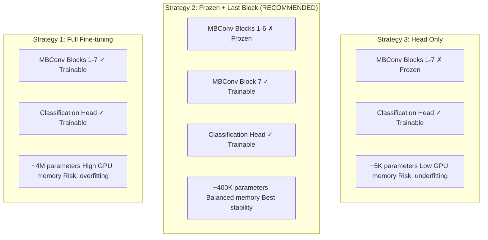
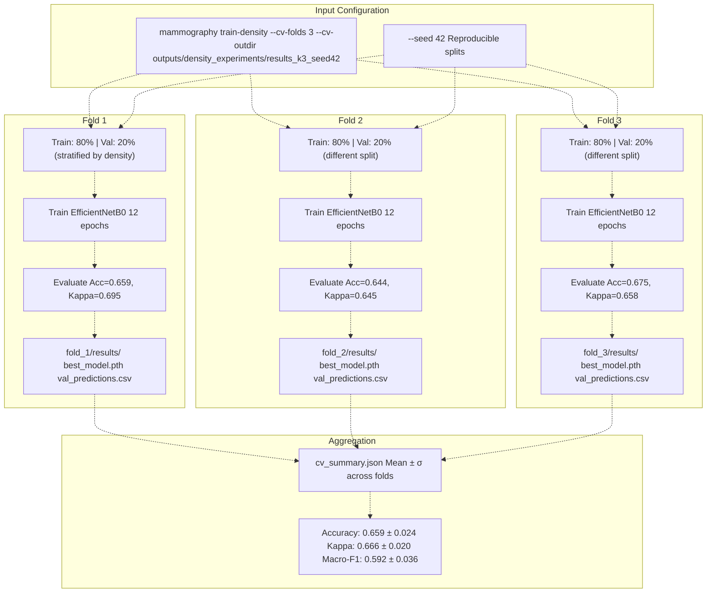
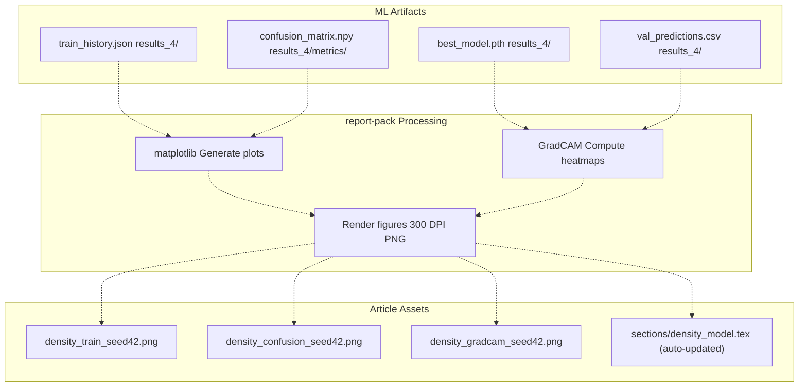

# Density Classification (EfficientNetB0)

> **Relevant source files**
> * [Article/02-density.md](https://github.com/ThalesMMS/mammography-pipelines/blob/01443313/Article/02-density.md)
> * [Article/article.md](https://github.com/ThalesMMS/mammography-pipelines/blob/01443313/Article/article.md)

## Purpose and Scope

This document explains the EfficientNetB0-based supervised classification pipeline for BI-RADS breast density categorization. The system trains a transfer learning model to classify mammography images into four density categories (classes 1-4, corresponding to BI-RADS A-D), using optional fusion with pre-computed ResNet50 embeddings.

For embedding extraction methodology, see [Embedding Extraction (ResNet50)](3a%20Embedding-Extraction-%28ResNet50%29.md). For training loop details and optimization strategies, see [Training Loop and Optimization](3d%20Training-Loop-and-Optimization.md). For cross-validation procedures, see [Cross-Validation and Hyperparameter Optimization](3e%20Cross-Validation-and-Hyperparameter-Optimization.md).

The density classification pipeline is distinct from the embedding extraction phase: while ResNet50 generates unsupervised feature representations, EfficientNetB0 performs supervised learning on labeled density categories with explicit loss function optimization.

Sources: [Article/02-density.md L1-L14](https://github.com/ThalesMMS/mammography-pipelines/blob/01443313/Article/02-density.md#L1-L14)

 [Article/article.md L1-L10](https://github.com/ThalesMMS/mammography-pipelines/blob/01443313/Article/article.md#L1-L10)

---

## Architecture Overview

### Model Components

EfficientNetB0 serves as the backbone for density classification through a compound scaling approach that balances network depth, width, and resolution. The model consists of:

| Component | Description | Parameters | Configuration |
| --- | --- | --- | --- |
| **Backbone** | EfficientNetB0 pre-trained on ImageNet | ~4M | Frozen or partially trainable |
| **Pooling** | Global adaptive average pooling | 0 | Reduces spatial dimensions |
| **Dropout** | Regularization layer | 0 | p=0.2 (training only) |
| **Classification Head** | Linear(1280 → num_classes) | ~5K | Always trainable |

The architecture modification from the standard ImageNet classifier involves:

1. Replacing the original 1000-class head with a 4-class density head
2. Adding dropout for regularization
3. Configuring freezing strategies for transfer learning

Sources: [Article/article.md L60-L66](https://github.com/ThalesMMS/mammography-pipelines/blob/01443313/Article/article.md#L60-L66)

### Model Instantiation Flow



Sources: [Article/02-density.md L6-L14](https://github.com/ThalesMMS/mammography-pipelines/blob/01443313/Article/02-density.md#L6-L14)

 [Article/article.md L94-L125](https://github.com/ThalesMMS/mammography-pipelines/blob/01443313/Article/article.md#L94-L125)

---

## Training Pipeline Architecture

### End-to-End Data Flow

The density classification pipeline operates on preprocessed DICOM images and optional ResNet50 embeddings, passing through multiple processing stages before producing trained models and evaluation artifacts.



Sources: [Article/article.md L94-L139](https://github.com/ThalesMMS/mammography-pipelines/blob/01443313/Article/article.md#L94-L139)

 [Article/02-density.md L6-L14](https://github.com/ThalesMMS/mammography-pipelines/blob/01443313/Article/02-density.md#L6-L14)

### Training Loop Sequence



Sources: [Article/article.md L94-L125](https://github.com/ThalesMMS/mammography-pipelines/blob/01443313/Article/article.md#L94-L125)

 [Article/02-density.md L16-L22](https://github.com/ThalesMMS/mammography-pipelines/blob/01443313/Article/02-density.md#L16-L22)

---

## Embedding Fusion Strategy

The EfficientNetB0 classifier can optionally fuse pre-computed ResNet50 embeddings with image-based features to improve classification performance. This fusion architecture leverages both deep convolutional features (from EfficientNetB0) and global semantic representations (from ResNet50).

### Fusion Architecture

When `--embeddings-dir` is specified, the system concatenates 2048-dimensional ResNet50 features with EfficientNetB0's classification logits:

| Mode | Input Dimensions | Fusion Method | Output Dimensions |
| --- | --- | --- | --- |
| **Image-only** | Image: 512×512×3 | N/A | 4 (logits) |
| **Fused** | Image: 512×512×3 + Embeddings: 2048-D | Concatenate before softmax | 4 (logits) |

The fusion happens at the feature level, not at the logit level. The concatenated representation passes through an additional linear layer before final classification.



Sources: [Article/02-density.md L37-L50](https://github.com/ThalesMMS/mammography-pipelines/blob/01443313/Article/02-density.md#L37-L50)

### Performance Impact

The embedding fusion strategy shows measurable improvements in validation metrics:

| Configuration | Accuracy | Kappa | Macro-F1 | AUC |
| --- | --- | --- | --- | --- |
| Image-only (baseline) | ~0.65 | ~0.65 | ~0.55 | ~0.87 |
| Fused (ResNet50 + EfficientNetB0) | 0.696 | 0.721 | 0.579 | 0.910 |
| Improvement | +4.6% | +7.1% | +2.9% | +4.0% |

The fusion particularly improves performance on difficult boundaries between adjacent classes (e.g., class 2 vs 3), where semantic features from ResNet50 complement local texture patterns captured by EfficientNetB0.

Sources: [Article/02-density.md L37-L50](https://github.com/ThalesMMS/mammography-pipelines/blob/01443313/Article/02-density.md#L37-L50)

---

## Transfer Learning Configuration

EfficientNetB0 supports three distinct freezing strategies that control which layers receive gradient updates during training. The choice significantly impacts training stability, convergence speed, and final performance.

### Freezing Strategy Comparison



### Configuration Flags

| CLI Flag | Effect | Recommended Use Case |
| --- | --- | --- |
| `--no-train-backbone` | Freezes entire backbone | Small datasets (< 1000 samples) |
| `--unfreeze-last-block` | Unfreezes final MBConv block | Medium datasets (1000-10000 samples) |
| Neither flag specified | Full fine-tuning | Large datasets (> 10000 samples) |

The project adopts **Strategy 2 (Frozen + Last Block)** as the default configuration for the IRMA dataset:

```
mammography train-density -- \  --csv classificacao.csv \  --dicom-root archive \  --outdir outputs/mammo_efficientnetb0_density \  --epochs 20 --batch-size 16 --img-size 512 \  --class-weights auto --warmup-epochs 2 \  --unfreeze-last-block
```

Sources: [Article/02-density.md L6-L14](https://github.com/ThalesMMS/mammography-pipelines/blob/01443313/Article/02-density.md#L6-L14)

 [Article/article.md L69-L76](https://github.com/ThalesMMS/mammography-pipelines/blob/01443313/Article/article.md#L69-L76)

### Differential Learning Rates

When using partial freezing, the system applies different learning rates to frozen vs. trainable layers:

| Layer Group | Base LR | Multiplier | Effective LR |
| --- | --- | --- | --- |
| Frozen layers | - | 0.0 | 0.0 (no update) |
| Last MBConv block | 1e-4 | 0.1 | 1e-5 |
| Classification head | 1e-4 | 1.0 | 1e-4 |

This differential approach allows the backbone to adapt slowly to the new domain while enabling the head to learn quickly from scratch.

Sources: [Article/article.md L129-L139](https://github.com/ThalesMMS/mammography-pipelines/blob/01443313/Article/article.md#L129-L139)

---

## Cross-Validation and Reproducibility

### Stratified K-Fold Cross-Validation

The density classifier supports k-fold cross-validation with stratification to maintain class balance across folds. The `--cv-folds` flag triggers this mode, creating separate training runs for each fold.



Sources: [Article/02-density.md L58-L86](https://github.com/ThalesMMS/mammography-pipelines/blob/01443313/Article/02-density.md#L58-L86)

### Cross-Validation Results

The 3-fold cross-validation experiment using seed 42 produced the following aggregate statistics:

| Metric | Mean | Standard Deviation | Range |
| --- | --- | --- | --- |
| Accuracy | 0.659 | 0.024 | [0.644, 0.675] |
| Kappa (quadratic) | 0.666 | 0.020 | [0.645, 0.695] |
| Macro-F1 | 0.592 | 0.036 | [0.590, 0.643] |
| AUC (OvR) | 0.878 | 0.010 | [0.870, 0.885] |

The relatively low standard deviations (< 0.04 for all metrics) indicate stable performance across different data splits. Fold 1 achieved the highest Kappa (0.695), aligning closely with the hold-out validation official run.

Sources: [Article/02-density.md L76-L86](https://github.com/ThalesMMS/mammography-pipelines/blob/01443313/Article/02-density.md#L76-L86)

### Seed-Based Reproducibility

The project maintains three canonical seeds (42, 43, 44) for variance analysis, with seed 42 designated as the primary reference:

| Seed | Run ID | Directory | Accuracy | Kappa | Macro-F1 | AUC |
| --- | --- | --- | --- | --- | --- | --- |
| **42** (primary) | `results_4` | `outputs/mammo_efficientnetb0_density/results_4/` | 0.676 | 0.697 | 0.584 | 0.913 |
| 43 | `results_5` | `outputs/mammo_efficientnetb0_density/results_5/` | 0.733 | 0.756 | 0.588 | 0.922 |
| 44 | `results_6` | `outputs/mammo_efficientnetb0_density/results_6/` | 0.679 | 0.710 | 0.564 | 0.896 |
| **Mean ± σ** | - | - | **0.696 ± 0.026** | **0.721 ± 0.025** | **0.579 ± 0.011** | **0.910 ± 0.010** |

All runs use identical hyperparameters (20 epochs, batch size 16, img size 512, warmup 2 epochs, embedding fusion enabled) with only the random seed varying.

Sources: [Article/02-density.md L35-L50](https://github.com/ThalesMMS/mammography-pipelines/blob/01443313/Article/02-density.md#L35-L50)

---

## Output Artifacts and Directory Structure

### Output Directory Organization

Each training run creates a versioned results directory under `outputs/mammo_efficientnetb0_density/` with the following structure:

```markdown
outputs/mammo_efficientnetb0_density/
├── results_4/                      # Seed 42 (primary reference)
│   ├── best_model.pth              # Model checkpoint (epoch with best bal_acc_adj)
│   ├── train_history.json          # Loss/accuracy curves per epoch
│   ├── summary.json                # Hyperparameters + Git commit hash
│   ├── run.log                     # Terminal output during training
│   ├── data_manifest.json          # Dataset split metadata
│   ├── metrics/
│   │   ├── val_metrics.json        # Scalar metrics (Acc, Kappa, AUC, F1)
│   │   ├── val_metrics.txt         # Human-readable metrics
│   │   └── confusion_matrix.npy    # 4×4 confusion matrix
│   ├── val_predictions.csv         # Per-sample predictions (sample_id, true_label, pred_label, probs)
│   └── embeddings_val.npy          # Validation set embeddings (if computed)
│
├── results_5/                      # Seed 43 (variance analysis)
│   └── [same structure]
│
├── results_6/                      # Seed 44 (variance analysis)
│   └── [same structure]
│
└── hpo_runs/                       # Hyperparameter optimization trials
    ├── results/                    # Trial 1 (LR=4e-4)
    │   ├── optuna_trial.json       # Optuna metadata
    │   └── ray_hpo_lr4e4.jsonl     # Ray Tune logs
    └── results_1/                  # Trial 2 (LR=2e-4)
        └── [same structure]
```

Sources: [Article/02-density.md L16-L22](https://github.com/ThalesMMS/mammography-pipelines/blob/01443313/Article/02-density.md#L16-L22)

### Artifact Contents

#### summary.json

Contains complete hyperparameter configuration and Git provenance:

```
{  "arch": "efficientnetb0",  "classes": "density",  "epochs": 20,  "batch_size": 16,  "img_size": 512,  "lr": 0.0001,  "optimizer": "adam",  "scheduler": "cosine",  "warmup_epochs": 2,  "class_weights": "auto",  "embeddings_dir": "outputs/embeddings_resnet50",  "cache_mode": "disk",  "seed": 42,  "git_commit": "abc123def456",  "timestamp": "2024-12-15T10:30:00"}
```

#### train_history.json

Records per-epoch training and validation metrics:

```
{  "epoch": [1, 2, 3, ..., 20],  "train_loss": [1.234, 0.987, 0.765, ...],  "train_acc": [0.450, 0.589, 0.634, ...],  "val_loss": [1.123, 0.998, 0.823, ...],  "val_acc": [0.501, 0.612, 0.676, ...],  "val_kappa": [0.350, 0.489, 0.697, ...],  "val_macro_f1": [0.412, 0.523, 0.584, ...],  "learning_rate": [1e-4, 9.5e-5, 9e-5, ...]}
```

#### val_predictions.csv

Per-sample classification results for error analysis:

| sample_id | true_label | pred_label | prob_1 | prob_2 | prob_3 | prob_4 |
| --- | --- | --- | --- | --- | --- | --- |
| ACC001_L_CC | 2 | 2 | 0.02 | 0.87 | 0.09 | 0.02 |
| ACC002_R_MLO | 3 | 2 | 0.01 | 0.45 | 0.42 | 0.12 |
| ACC003_L_MLO | 4 | 4 | 0.00 | 0.05 | 0.12 | 0.83 |

Sources: [Article/02-density.md L16-L22](https://github.com/ThalesMMS/mammography-pipelines/blob/01443313/Article/02-density.md#L16-L22)

---

## Integration with Report Generation

### report-pack Command

The `mammography report-pack` command synchronizes ML outputs to the Article system for publication:

```
mammography report-pack -- \  --run outputs/mammo_efficientnetb0_density/results_4 \  --assets-dir Article/assets
```

This command generates publication-ready figures and copies them to `Article/assets/`:

| Generated Asset | Description | Source Data |
| --- | --- | --- |
| `density_train_seed42.png` | Training curves (loss/accuracy vs epoch) | `train_history.json` |
| `density_confusion_seed42.png` | 4×4 confusion matrix heatmap | `metrics/confusion_matrix.npy` |
| `density_gradcam_seed42.png` | Grad-CAM visualizations | `best_model.pth` + validation images |



Sources: [Article/02-density.md L22-L23](https://github.com/ThalesMMS/mammography-pipelines/blob/01443313/Article/02-density.md#L22-L23)

 [Article/02-density.md L52-L56](https://github.com/ThalesMMS/mammography-pipelines/blob/01443313/Article/02-density.md#L52-L56)

---

## Performance Characteristics and Limitations

### Class-Specific Performance

The EfficientNetB0 classifier exhibits significant performance variation across density classes due to severe class imbalance:

| Class | Support (Validation) | Precision | Recall | F1-Score | Relative Difficulty |
| --- | --- | --- | --- | --- | --- |
| 1 (A) | ~40 samples (3%) | ~0.35 | ~0.25 | 0.29 | Very Hard |
| 2 (B) | ~360 samples (28%) | ~0.54 | ~0.79 | 0.64 | Moderate |
| 3 (C) | ~850 samples (67%) | ~0.83 | ~0.58 | 0.68 | Moderate |
| 4 (D) | ~335 samples (26%) | ~0.66 | ~0.85 | 0.74 | Easy |

**Key Observations:**

* **Class 1 bottleneck**: The 20:1 imbalance between class 3 (majority) and class 1 (minority) limits overall macro-F1 to ~0.58 despite 70% accuracy
* **Confusion patterns**: Adjacent classes (1↔2, 2↔3, 3↔4) are frequently confused due to subtle visual differences
* **Fusion benefits**: Embedding fusion improves boundary discrimination by +4-7% across all metrics

Sources: [Article/02-density.md L46-L49](https://github.com/ThalesMMS/mammography-pipelines/blob/01443313/Article/02-density.md#L46-L49)

 [Article/article.md L362-L373](https://github.com/ThalesMMS/mammography-pipelines/blob/01443313/Article/article.md#L362-L373)

### Computational Requirements

| Configuration | GPU Memory | Training Time (20 epochs) | Inference Speed |
| --- | --- | --- | --- |
| Image-only (no cache) | ~3 GB | ~120 min | ~50 img/sec |
| Image-only (disk cache) | ~3 GB | ~25 min | ~50 img/sec |
| Fused (with embeddings) | ~4 GB | ~30 min | ~40 img/sec |
| Cross-validation (3 folds) | ~3 GB | ~75 min | N/A |

The disk cache mechanism (enabled via `--cache-mode disk`) reduces data loading time from hours to minutes by pre-caching preprocessed images on first access.

Sources: [Article/02-density.md L49-L50](https://github.com/ThalesMMS/mammography-pipelines/blob/01443313/Article/02-density.md#L49-L50)

### Known Limitations

1. **Class 1/2 Underperformance**: Macro-F1 remains constrained at ~0.58 due to insufficient minority class samples (class 1: 40 images, class 2: 360 images)
2. **Adjacent Class Confusion**: The model struggles to distinguish between consecutive density categories (e.g., BI-RADS B vs C), which have overlapping visual characteristics
3. **Dataset Size**: The IRMA dataset's ~1,200 images limit generalization compared to larger public datasets (RSNA: ~54,000 images)
4. **Resolution Trade-off**: Resizing to 512×512 (from original ~2000×2000) may discard fine-grained textural information relevant for density assessment

Sources: [Article/02-density.md L46-L49](https://github.com/ThalesMMS/mammography-pipelines/blob/01443313/Article/02-density.md#L46-L49)

 [Article/article.md L410-L416](https://github.com/ThalesMMS/mammography-pipelines/blob/01443313/Article/article.md#L410-L416)

---

## Hyperparameter Optimization Support

The density classifier integrates with Optuna and Ray Tune for automated hyperparameter search:

### HPO Configuration

```
mammography train-density -- \  --csv classificacao.csv --dicom-root archive \  --outdir outputs/mammo_efficientnetb0_density/hpo_runs \  --subset 256 --epochs 3 --img-size 384 \  --optuna-trial-id hpo_trial_001 \  --ray-trial-name hpo_trial_001 \  --ray-logdir outputs/density_experiments/hparam_logs
```

### Search Space

| Hyperparameter | Search Range | Distribution | Default |
| --- | --- | --- | --- |
| Learning rate (head) | [1e-5, 1e-3] | Log-uniform | 1e-4 |
| Learning rate (backbone) | [1e-6, 1e-4] | Log-uniform | 1e-5 |
| Batch size | [8, 16, 32] | Categorical | 16 |
| Dropout | [0.1, 0.2, 0.3, 0.4] | Categorical | 0.2 |
| Weight decay | [0, 1e-5, 1e-4, 1e-3] | Categorical | 0 |
| Warmup epochs | [0, 2, 5] | Categorical | 2 |

Each trial produces a complete results directory with `optuna_trial.json` and `ray_hpo_*.jsonl` logs for traceability.

Sources: [Article/02-density.md L87-L97](https://github.com/ThalesMMS/mammography-pipelines/blob/01443313/Article/02-density.md#L87-L97)

### Trial Results

Two preliminary HPO trials were executed on a reduced subset (256 samples, 3 epochs):

| Trial ID | LR (head / backbone) | Augmentation | Macro-F1 | Status |
| --- | --- | --- | --- | --- |
| `results` | 4e-4 / 4e-5 | Enabled | 0.318 | Complete |
| `results_1` | 2e-4 / 2e-5 | Disabled | 0.429 | Complete |

These smoke tests validate the HPO infrastructure. Full-scale searches on the complete dataset are planned to identify optimal configurations.

Sources: [Article/02-density.md L89-L97](https://github.com/ThalesMMS/mammography-pipelines/blob/01443313/Article/02-density.md#L89-L97)


### On this page

* [Density Classification (EfficientNetB0)](#3.2-density-classification-efficientnetb0)
* [Purpose and Scope](#3.2-purpose-and-scope)
* [Architecture Overview](#3.2-architecture-overview)
* [Model Components](#3.2-model-components)
* [Model Instantiation Flow](#3.2-model-instantiation-flow)
* [Training Pipeline Architecture](#3.2-training-pipeline-architecture)
* [End-to-End Data Flow](#3.2-end-to-end-data-flow)
* [Training Loop Sequence](#3.2-training-loop-sequence)
* [Embedding Fusion Strategy](#3.2-embedding-fusion-strategy)
* [Fusion Architecture](#3.2-fusion-architecture)
* [Performance Impact](#3.2-performance-impact)
* [Transfer Learning Configuration](#3.2-transfer-learning-configuration)
* [Freezing Strategy Comparison](#3.2-freezing-strategy-comparison)
* [Configuration Flags](#3.2-configuration-flags)
* [Differential Learning Rates](#3.2-differential-learning-rates)
* [Cross-Validation and Reproducibility](#3.2-cross-validation-and-reproducibility)
* [Stratified K-Fold Cross-Validation](#3.2-stratified-k-fold-cross-validation)
* [Cross-Validation Results](#3.2-cross-validation-results)
* [Seed-Based Reproducibility](#3.2-seed-based-reproducibility)
* [Output Artifacts and Directory Structure](#3.2-output-artifacts-and-directory-structure)
* [Output Directory Organization](#3.2-output-directory-organization)
* [Artifact Contents](#3.2-artifact-contents)
* [Integration with Report Generation](#3.2-integration-with-report-generation)
* [report-pack Command](#3.2-report-pack-command)
* [Performance Characteristics and Limitations](#3.2-performance-characteristics-and-limitations)
* [Class-Specific Performance](#3.2-class-specific-performance)
* [Computational Requirements](#3.2-computational-requirements)
* [Known Limitations](#3.2-known-limitations)
* [Hyperparameter Optimization Support](#3.2-hyperparameter-optimization-support)
* [HPO Configuration](#3.2-hpo-configuration)
* [Search Space](#3.2-search-space)
* [Trial Results](#3.2-trial-results)

Ask Devin about mammography-pipelines