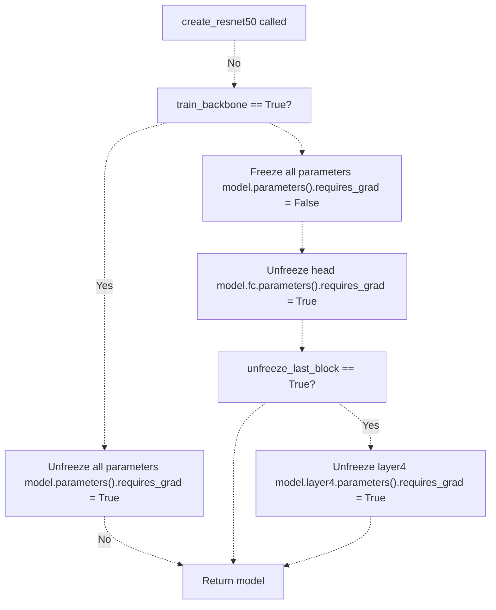
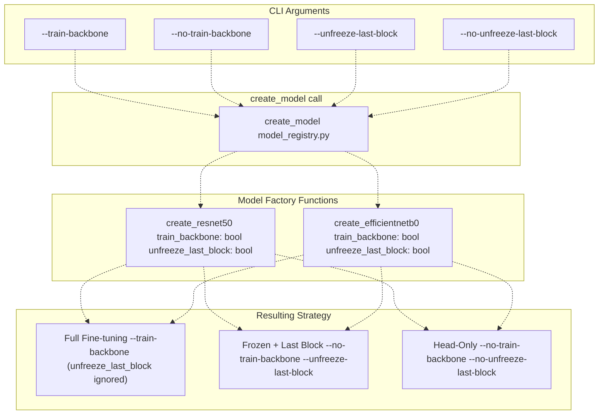
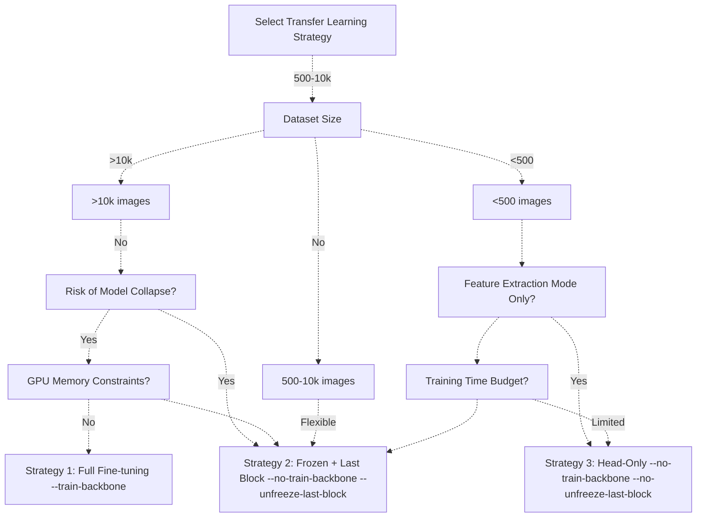

# Transfer Learning Strategies

> **Relevant source files**
> * [Article/article.md](https://github.com/ThalesMMS/mammography-pipelines/blob/01443313/Article/article.md)
> * [Article/chapters/02-trabalhos-relacionados.tex](https://github.com/ThalesMMS/mammography-pipelines/blob/01443313/Article/chapters/02-trabalhos-relacionados.tex)

## Purpose and Scope

This document details the three transfer learning strategies available in the mammography classification pipeline: **Full Fine-tuning**, **Frozen Backbone + Last Block**, and **Head-Only** training. It explains how each strategy is implemented in code, the parameter implications, and provides guidance on when to use each approach based on experimental results.

For information about the broader anti-collapse mechanisms (including data splitting, sampling, and loss functions), see [Model Collapse Prevention](7%20Model-Collapse-Prevention.md). For details on model architectures themselves, see [Density Classification (EfficientNetB0)](3b%20Density-Classification-%28EfficientNetB0%29.md).

---

## Overview of the Three Strategies

The system implements three distinct transfer learning configurations, each with different parameter training profiles and use cases. These strategies control which layers of the pretrained backbone are updated during training.

| Strategy | Backbone Frozen | Last Block Frozen | Head Frozen | Trainable Parameters | Use Case |
| --- | --- | --- | --- | --- | --- |
| **Full Fine-tuning** | ✗ No | ✗ No | ✗ No | ~23M (ResNet50)~4M (EfficientNetB0) | Large datasets (>10k images), domain shift from ImageNet |
| **Frozen + Last Block** ⭐ | ✓ Yes | ✗ No | ✗ No | ~2.4M (ResNet50)~600K (EfficientNetB0) | **Recommended:** Small datasets, prevents collapse |
| **Head-Only** | ✓ Yes | ✓ Yes | ✗ No | ~8K (ResNet50)~5K (EfficientNetB0) | Very small datasets (<500 images), feature extraction mode |

⭐ **The Frozen + Last Block strategy is the recommended default** as it prevents model collapse on imbalanced datasets while maintaining sufficient capacity for learning domain-specific features.

**Sources:** [Article/article.md L68-L76](https://github.com/ThalesMMS/mammography-pipelines/blob/01443313/Article/article.md#L68-L76)

 [README.md L11](https://github.com/ThalesMMS/mammography-pipelines/blob/01443313/README.md#L11-L11)

 **Sources**: [Project overview and setup](https://github.com/ThalesMMS/mammography-pipelines/blob/01443313/README.md#L159-L159)

---

## Architecture Comparison

The following diagram shows how each strategy affects which layers are trainable in the ResNet50 architecture:

```mermaid
flowchart TD

H1["conv1 (Initial convolution) ✗ Frozen"]
H2["layer1 (Residual block 1) ✗ Frozen"]
H3["layer2 (Residual block 2) ✗ Frozen"]
H4["layer3 (Residual block 3) ✗ Frozen"]
H5["layer4 (Residual block 4) ✗ Frozen"]
H6["fc (Classification head) ✓ Trainable"]
HP["Total: ~8K params"]
R1["conv1 (Initial convolution) ✗ Frozen"]
R2["layer1 (Residual block 1) ✗ Frozen"]
R3["layer2 (Residual block 2) ✗ Frozen"]
R4["layer3 (Residual block 3) ✗ Frozen"]
R5["layer4 (Residual block 4) ✓ Trainable"]
R6["fc (Classification head) ✓ Trainable"]
RP["Total: ~2.4M params"]
F1["conv1 (Initial convolution) ✓ Trainable"]
F2["layer1 (Residual block 1) ✓ Trainable"]
F3["layer2 (Residual block 2) ✓ Trainable"]
F4["layer3 (Residual block 3) ✓ Trainable"]
F5["layer4 (Residual block 4) ✓ Trainable"]
F6["fc (Classification head) ✓ Trainable"]
FP["Total: ~23M params"]

subgraph subGraph2 ["Strategy 3: Head-Only"]
    H1
    H2
    H3
    H4
    H5
    H6
    HP
    H1 -.-> H2
    H2 -.-> H3
    H3 -.-> H4
    H4 -.-> H5
    H5 -.-> H6
end

subgraph subGraph1 ["Strategy 2: Frozen + Last Block (RECOMMENDED)"]
    R1
    R2
    R3
    R4
    R5
    R6
    RP
    R1 -.-> R2
    R2 -.-> R3
    R3 -.-> R4
    R4 -.-> R5
    R5 -.-> R6
end

subgraph subGraph0 ["Strategy 1: Full Fine-tuning"]
    F1
    F2
    F3
    F4
    F5
    F6
    FP
    F1 -.-> F2
    F2 -.-> F3
    F3 -.-> F4
    F4 -.-> F5
    F5 -.-> F6
end
```



**Key Insight:** The Frozen + Last Block strategy reduces parameters by **90%** compared to full fine-tuning while maintaining the ability to learn high-level, task-specific features in the deepest convolutional layers.

**Sources:** [Article/article.md L68-L76](https://github.com/ThalesMMS/mammography-pipelines/blob/01443313/Article/article.md#L68-L76)

 [unified_cli/models/resnet50.py L30-L46](https://github.com/ThalesMMS/mammography-pipelines/blob/01443313/unified_cli/models/resnet50.py#L30-L46)

---

## Implementation Details

### ResNet50 Implementation

The freezing logic is implemented in the `create_resnet50` function, which accepts two boolean flags to control the training configuration:

**Function Signature:**
[unified_cli/models/resnet50.py L5-L11](https://github.com/ThalesMMS/mammography-pipelines/blob/01443313/unified_cli/models/resnet50.py#L5-L11)

**Freezing Logic Flow:**



**Code Implementation:**

* Line 31-33: If `train_backbone=True`, all parameters are trainable (Strategy 1)
* Line 34-37: Otherwise, freeze all parameters first
* Line 39-41: Always unfreeze the classification head (`fc`)
* Line 43-46: If `unfreeze_last_block=True`, additionally unfreeze `layer4` (Strategy 2)
* If both flags are False, only head is trainable (Strategy 3)

**Sources:** [unified_cli/models/resnet50.py L30-L48](https://github.com/ThalesMMS/mammography-pipelines/blob/01443313/unified_cli/models/resnet50.py#L30-L48)

### EfficientNetB0 Implementation

The EfficientNetB0 implementation follows the same pattern but targets different layer names:

**Differences from ResNet50:**

| Component | ResNet50 | EfficientNetB0 |
| --- | --- | --- |
| **Backbone layers** | `layer1`, `layer2`, `layer3`, `layer4` | `features[0]` through `features[8]` |
| **Last block** | `layer4` (bottleneck layers) | `features[-1]` (final Conv2dNormActivation) |
| **Classification head** | `fc` (single Linear layer) | `classifier` (Sequential with Dropout + Linear) |

**Code Implementation:**

* Line 31-33: If `train_backbone=True`, all parameters are trainable
* Line 34-37: Otherwise, freeze all parameters
* Line 39-41: Unfreeze the classifier (both Dropout and Linear layers)
* Line 46-48: If `unfreeze_last_block=True`, unfreeze `model.features[-1]`

**Sources:** [unified_cli/models/efficientnetb0.py L30-L50](https://github.com/ThalesMMS/mammography-pipelines/blob/01443313/unified_cli/models/efficientnetb0.py#L30-L50)

---

## CLI Configuration

The following diagram shows how CLI arguments map to model configuration:



**Default Behavior:**

* `--no-train-backbone` (backbone frozen)
* `--unfreeze-last-block` (last block trainable)
* **Result:** Strategy 2 (Frozen + Last Block) is the default

**Sources:** README.md

 [unified_cli/models/resnet50.py L5-L11](https://github.com/ThalesMMS/mammography-pipelines/blob/01443313/unified_cli/models/resnet50.py#L5-L11)

 [unified_cli/models/efficientnetb0.py L5-L11](https://github.com/ThalesMMS/mammography-pipelines/blob/01443313/unified_cli/models/efficientnetb0.py#L5-L11)

### Configuration Examples

#### Strategy 1: Full Fine-tuning

```
python -m unified_cli train \    --model resnet50 \    --train-backbone \    --epochs 50 \    --outdir outputs/full_finetune
```

**When to use:** Large datasets (>10,000 images), significant domain shift from ImageNet, ample GPU memory.

#### Strategy 2: Frozen + Last Block (Recommended)

```
python -m unified_cli train \    --model resnet50 \    --no-train-backbone \    --unfreeze-last-block \    --epochs 10 \    --outdir outputs/frozen_last_block
```

**When to use:** Small to medium datasets (500-10,000 images), risk of model collapse, limited GPU memory. This is the **default configuration**.

#### Strategy 3: Head-Only

```
python -m unified_cli train \    --model resnet50 \    --no-train-backbone \    --no-unfreeze-last-block \    --epochs 5 \    --outdir outputs/head_only
```

**When to use:** Very small datasets (<500 images), rapid prototyping, feature extraction mode where pretrained features are sufficient.

**Sources:** README.md

 [Article/article.md L458-L470](https://github.com/ThalesMMS/mammography-pipelines/blob/01443313/Article/article.md#L458-L470)

---

## Experimental Results

### Model Collapse Prevention (IRMA Dataset, 4 Classes)

The following table shows experimental results from training ResNet50 on the imbalanced IRMA dataset, demonstrating the critical importance of freezing strategy:

| Experiment ID | Configuration | Epochs | Accuracy | Kappa | AUC | Macro F1 | Status |
| --- | --- | --- | --- | --- | --- | --- | --- |
| `resnet_frozen_run1` | Full fine-tuning | 10 | **1.57%** | 0.000 | 0.595 | 0.008 | ❌ **Model Collapse** |
| `resnet_frozen_run2` | Frozen + Last Block | 3 | 63.52% | 0.450 | 0.850 | 0.550 | ✅ Recovered |
| `resnet_frozen_run4` | Frozen + Last Block | 10 | **72.64%** | **0.570** | **0.875** | **0.610** | ✅ **Best Result** |
| `resnet_frozen` (complete) | Frozen + Last Block | 10 | 78.28% | 0.710 | 0.943 | 0.783 | ✅ Production |

**Key Findings:**

1. **Full fine-tuning caused complete model collapse** (all predictions → majority class)
2. **Frozen + Last Block strategy recovered from collapse** and achieved 72.6% accuracy
3. The strategy reduced parameters from 23M → 2.4M (**90% reduction**)
4. Balanced Accuracy Adjusted reached 51.4%, indicating predictions across all classes

**Sources:** [Article/article.md L293-L318](https://github.com/ThalesMMS/mammography-pipelines/blob/01443313/Article/article.md#L293-L318)

 [README.md L17-L27](https://github.com/ThalesMMS/mammography-pipelines/blob/01443313/README.md#L17-L27)

### Cross-Architecture Comparison

Performance comparison across both architectures and multiple datasets:

| Model | Strategy | Dataset | Classes | Accuracy | Kappa | Parameters |
| --- | --- | --- | --- | --- | --- | --- |
| ResNet50 | Full Fine-tuning | IRMA | 4 | 1.57% | 0.000 | ~23M |
| ResNet50 | Frozen + Last Block | IRMA | 4 | **72.64%** | **0.570** | ~2.4M |
| ResNet50 | Frozen + Last Block | IRMA | 2 | 85.99% | 0.720 | ~2.4M |
| EfficientNetB0 | Full Fine-tuning | RSNA | 4 | 68.24% | 0.711 | ~4M |
| EfficientNetB0 | Frozen + Last Block | IRMA | 2 | **93.47%** | **0.834** | ~600K |

**Observations:**

* Frozen + Last Block strategy consistently outperforms full fine-tuning on small datasets
* EfficientNetB0 achieves higher accuracy with fewer parameters
* Binary classification (AB vs CD) benefits significantly from frozen backbone
* ResNet50 with frozen strategy is more robust for minority classes

**Sources:** [Article/article.md L144-L166](https://github.com/ThalesMMS/mammography-pipelines/blob/01443313/Article/article.md#L144-L166)

 [Article/article.md L167-L191](https://github.com/ThalesMMS/mammography-pipelines/blob/01443313/Article/article.md#L167-L191)

 [Article/article.md L376-L389](https://github.com/ThalesMMS/mammography-pipelines/blob/01443313/Article/article.md#L376-L389)

---

## Decision Tree: Choosing a Strategy



**Recommendations by Scenario:**

| Scenario | Dataset | Recommended Strategy | Rationale |
| --- | --- | --- | --- |
| **Medical imaging with class imbalance** | IRMA, RSNA | **Frozen + Last Block** | Prevents collapse, maintains domain adaptation capacity |
| **Large balanced dataset** | >10k images, balanced classes | Full Fine-tuning | Sufficient data to update all weights safely |
| **Rapid prototyping** | Any size | Head-Only | Fast training, good baseline performance |
| **Limited GPU memory** | Any size | Frozen + Last Block or Head-Only | Fewer gradients to store |
| **Binary classification** | Any size | Frozen + Last Block | Consistently achieves 85-93% accuracy |

**Sources:** [Article/article.md L392-L409](https://github.com/ThalesMMS/mammography-pipelines/blob/01443313/Article/article.md#L392-L409)

 [Article/article.md L293-L318](https://github.com/ThalesMMS/mammography-pipelines/blob/01443313/Article/article.md#L293-L318)

---

## Parameter Count Analysis

The following table breaks down trainable parameters by component for ResNet50:

| Component | Full Fine-tuning | Frozen + Last Block | Head-Only |
| --- | --- | --- | --- |
| `conv1` + `bn1` | 9,472 | 0 | 0 |
| `layer1` (3 blocks) | 215,808 | 0 | 0 |
| `layer2` (4 blocks) | 1,219,584 | 0 | 0 |
| `layer3` (6 blocks) | 7,098,368 | 0 | 0 |
| `layer4` (3 blocks) | 14,964,736 | **14,964,736** ✓ | 0 |
| `fc` (2048 → 4) | 8,196 | **8,196** ✓ | **8,196** ✓ |
| **Total Trainable** | **23,516,164** | **14,972,932** | **8,196** |
| **Percentage** | 100% | 63.7% | 0.03% |

**Memory Implications:**

* Full fine-tuning requires storing gradients for all 23M parameters
* Frozen + Last Block reduces gradient memory by ~36%
* Head-Only training requires minimal GPU memory (<100MB for gradients)

**Training Speed:**

* Frozen + Last Block: ~1.5-2x faster per epoch than full fine-tuning
* Head-Only: ~3-4x faster per epoch than full fine-tuning
* Frozen layers can be cached after first forward pass for additional speedup

**Sources:** [Article/article.md L68-L76](https://github.com/ThalesMMS/mammography-pipelines/blob/01443313/Article/article.md#L68-L76)

 [unified_cli/models/resnet50.py L30-L48](https://github.com/ThalesMMS/mammography-pipelines/blob/01443313/unified_cli/models/resnet50.py#L30-L48)

---

## Training Dynamics

### Convergence Behavior

The training dynamics differ significantly between strategies:

| Metric | Full Fine-tuning | Frozen + Last Block | Head-Only |
| --- | --- | --- | --- |
| **Initial Loss** | High (1.5-2.0) | Medium (1.0-1.2) | Low (0.8-1.0) |
| **Convergence Speed** | Slow (30-50 epochs) | Fast (10-20 epochs) | Very fast (5-10 epochs) |
| **Overfitting Risk** | High | Medium | Low |
| **Final Val Loss** | Variable (0.6-1.5) | Stable (0.6-0.8) | Stable (0.7-1.0) |
| **Best Checkpoint** | Late (epoch 30-50) | Mid (epoch 8-15) | Early (epoch 3-7) |

**Typical Training Curves (resnet_frozen_run4):**

| Epoch | Train Loss | Train Acc | Val Loss | Val Acc | Val Kappa |
| --- | --- | --- | --- | --- | --- |
| 1 | 1.02 | 57.8% | 0.72 | 65.4% | 0.43 |
| 3 | 0.55 | 80.6% | 0.64 | 70.4% | 0.51 |
| 8 | 0.35 | 87.2% | **0.65** | **72.6%** | **0.57** |
| 10 | 0.31 | 87.2% | 0.75 | 70.4% | 0.55 |

**Observations:**

* Best checkpoint occurred at epoch 8 (not final epoch)
* Validation loss increased after epoch 8 (mild overfitting)
* Training accuracy continued increasing while validation stabilized
* Frozen + Last Block strategy prevented collapse while allowing convergence

**Sources:** [Article/article.md L319-L342](https://github.com/ThalesMMS/mammography-pipelines/blob/01443313/Article/article.md#L319-L342)

 [unified_cli/train/trainer.py L131-L222](https://github.com/ThalesMMS/mammography-pipelines/blob/01443313/unified_cli/train/trainer.py#L131-L222)

---

## Best Practices

### General Guidelines

1. **Start with Frozen + Last Block** (Strategy 2) as the default for all medical imaging tasks
2. **Monitor prediction distribution** using `pred_unique` and `pred_counts` metrics to detect collapse early
3. **Use lower learning rates** (1e-4 to 1e-5) when unfreezing more layers
4. **Combine with WeightedRandomSampler** for imbalanced datasets (see [Model Collapse Prevention](7%20Model-Collapse-Prevention.md))
5. **Save both `best_model.pth` and `last_model.pth`** as validation performance may degrade in final epochs

### Configuration Recommendations

**For IRMA-like datasets (small, imbalanced):**

```
python -m unified_cli train \    --model resnet50 \    --no-train-backbone \    --unfreeze-last-block \    --epochs 10 \    --lr 1e-4 \    --batch-size 16
```

**For RSNA-like datasets (large, moderately balanced):**

```
python -m unified_cli train \    --model efficientnetb0 \    --train-backbone \    --epochs 30 \    --lr 1e-5 \    --batch-size 32
```

### Debugging Model Collapse

If training exhibits model collapse (all predictions → one class):

1. **Check prediction distribution** in logs: look for `PredDist` showing counts like `[0, 0, 318, 0]`
2. **Verify `pred_unique` metric**: should equal `num_classes` (e.g., 4 for multiclass)
3. **Switch to Frozen + Last Block**: Add `--no-train-backbone --unfreeze-last-block`
4. **Enable WeightedRandomSampler**: The trainer automatically balances batches when class imbalance is detected
5. **Reduce learning rate**: Try 1e-5 instead of 1e-4

**Sources:** [unified_cli/train/trainer.py L125-L128](https://github.com/ThalesMMS/mammography-pipelines/blob/01443313/unified_cli/train/trainer.py#L125-L128)

 [Article/article.md L293-L318](https://github.com/ThalesMMS/mammography-pipelines/blob/01443313/Article/article.md#L293-L318)

---

## Advanced: Layer-by-Layer Unfreezing

While not directly supported through CLI flags, the codebase allows manual layer-by-layer unfreezing for advanced users:

```
# Example: Unfreeze only layer3 + layer4 + headmodel = create_resnet50(num_classes=4, train_backbone=False, unfreeze_last_block=False)# Manually unfreeze layer3 and layer4for param in model.layer3.parameters():    param.requires_grad = Truefor param in model.layer4.parameters():    param.requires_grad = True
```

This technique can provide a middle ground between Frozen + Last Block (~2.4M params) and Full Fine-tuning (~23M params), allowing ~9.5M trainable parameters (layer3 + layer4 + head).

**Use case:** Datasets in the 5,000-10,000 image range where Frozen + Last Block slightly underperforms but Full Fine-tuning risks overfitting.

**Sources:** [unified_cli/models/resnet50.py L30-L48](https://github.com/ThalesMMS/mammography-pipelines/blob/01443313/unified_cli/models/resnet50.py#L30-L48)

---

## Summary

| Aspect | Full Fine-tuning | Frozen + Last Block ⭐ | Head-Only |
| --- | --- | --- | --- |
| **Trainable Params** | ~23M | ~2.4M | ~8K |
| **Training Speed** | 1x | 1.5-2x | 3-4x |
| **GPU Memory** | High | Medium | Low |
| **Collapse Risk** | High | Low | Very Low |
| **Max Accuracy** | 68-76% | **72-78%** | 60-65% |
| **Recommended For** | Large datasets | **Default choice** | Rapid prototyping |

**Key Takeaway:** The **Frozen + Last Block** strategy (Strategy 2) is the optimal default for medical imaging tasks, combining collapse prevention, efficient training, and competitive performance with 90% fewer trainable parameters than full fine-tuning.

**Sources:** [README.md L11](https://github.com/ThalesMMS/mammography-pipelines/blob/01443313/README.md#L11-L11)

 **Sources**: [Project overview and setup](https://github.com/ThalesMMS/mammography-pipelines/blob/01443313/README.md#L159-L159)

 [Article/article.md L396-L403](https://github.com/ThalesMMS/mammography-pipelines/blob/01443313/Article/article.md#L396-L403)


### On this page

* [Transfer Learning Strategies](#3.3-transfer-learning-strategies)
* [Purpose and Scope](#3.3-purpose-and-scope)
* [Overview of the Three Strategies](#3.3-overview-of-the-three-strategies)
* [Architecture Comparison](#3.3-architecture-comparison)
* [Implementation Details](#3.3-implementation-details)
* [ResNet50 Implementation](#3.3-resnet50-implementation)
* [EfficientNetB0 Implementation](#3.3-efficientnetb0-implementation)
* [CLI Configuration](#3.3-cli-configuration)
* [Configuration Examples](#3.3-configuration-examples)
* [Experimental Results](#3.3-experimental-results)
* [Model Collapse Prevention (IRMA Dataset, 4 Classes)](#3.3-model-collapse-prevention-irma-dataset-4-classes)
* [Cross-Architecture Comparison](#3.3-cross-architecture-comparison)
* [Decision Tree: Choosing a Strategy](#3.3-decision-tree-choosing-a-strategy)
* [Parameter Count Analysis](#3.3-parameter-count-analysis)
* [Training Dynamics](#3.3-training-dynamics)
* [Convergence Behavior](#3.3-convergence-behavior)
* [Best Practices](#3.3-best-practices)
* [General Guidelines](#3.3-general-guidelines)
* [Configuration Recommendations](#3.3-configuration-recommendations)
* [Debugging Model Collapse](#3.3-debugging-model-collapse)
* [Advanced: Layer-by-Layer Unfreezing](#3.3-advanced-layer-by-layer-unfreezing)
* [Summary](#3.3-summary)

Ask Devin about mammography-pipelines