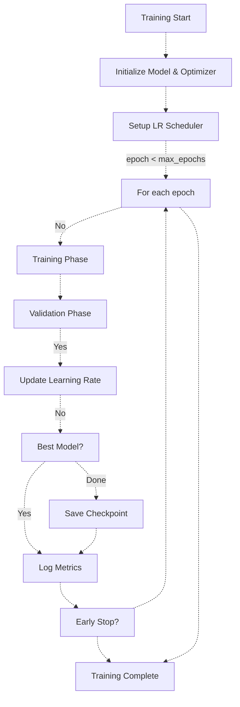
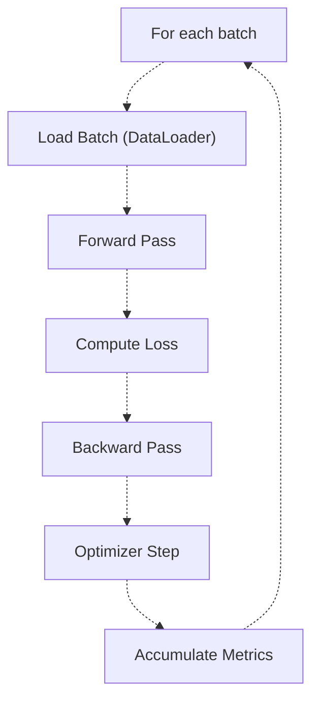
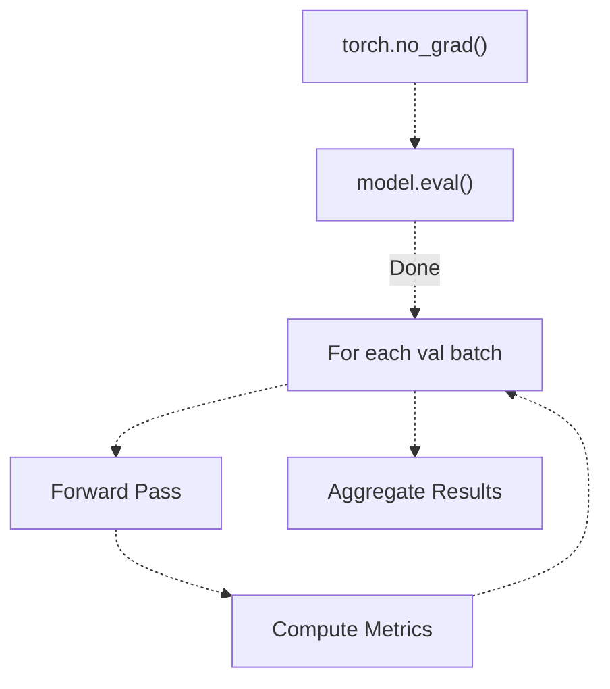
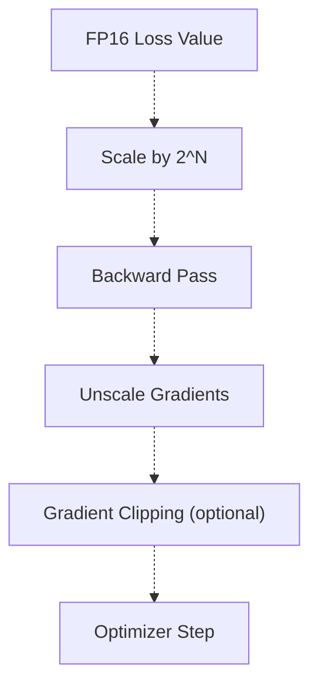
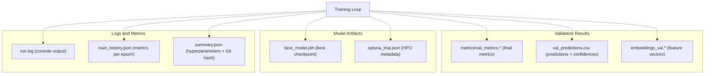

# Training Loop and Optimization

> **Relevant source files**
> * [Article/02-density.md](https://github.com/ThalesMMS/mammography-pipelines/blob/01443313/Article/02-density.md)
> * [Article/article.md](https://github.com/ThalesMMS/mammography-pipelines/blob/01443313/Article/article.md)

## Purpose and Scope

This page details the training loop implementation and optimization strategies used in the mammography density classification pipeline. It covers optimizer configuration, learning rate scheduling, warmup strategies, loss functions, mixed precision training, and checkpointing mechanisms.

For information about the overall classification architecture, see [Density Classification (EfficientNetB0)](3b%20Density-Classification-%28EfficientNetB0%29.md). For transfer learning freezing strategies, see [Transfer Learning Strategies](3c%20Transfer-Learning-Strategies.md). For cross-validation and hyperparameter search procedures, see [Cross-Validation and Hyperparameter Optimization](3e%20Cross-Validation-and-Hyperparameter-Optimization.md).

---

## Optimizer Configuration

### Adam and AdamW

The pipeline uses Adam or AdamW optimizers with differential learning rates for backbone and classifier head. The `--fused-optim` flag enables PyTorch's fused Adam implementation for improved performance on CUDA devices.

**Default Configuration**:

* Classifier head learning rate: `1e-4` to `4e-4`
* Backbone learning rate (when unfrozen): `1e-5` to `4e-5` (10× lower)
* Weight decay: `0.01` (AdamW) or `0.0` (Adam)
* Betas: `(0.9, 0.999)`

The differential learning rate strategy prevents catastrophic forgetting of ImageNet features while allowing the classifier head to adapt quickly to the density classification task.

**Parameter Groups**:

```
Group 1: Backbone parameters (if unfrozen)
  - lr: backbone_lr
  - weight_decay: wd
  
Group 2: Classifier head parameters
  - lr: base_lr
  - weight_decay: wd
```

Sources: [Article/02-density.md L8-L14](https://github.com/ThalesMMS/mammography-pipelines/blob/01443313/Article/02-density.md#L8-L14)

 [Article/article.md L94-L118](https://github.com/ThalesMMS/mammography-pipelines/blob/01443313/Article/article.md#L94-L118)

 [Article/article.md L129-L139](https://github.com/ThalesMMS/mammography-pipelines/blob/01443313/Article/article.md#L129-L139)

---

## Learning Rate Scheduling

### Available Schedulers

The pipeline supports multiple learning rate scheduling strategies controlled via command-line flags:

| Scheduler | Flag | Description |
| --- | --- | --- |
| **CosineAnnealingLR** | Default | Cosine decay from initial LR to 0 over `epochs` |
| **ReduceLROnPlateau** | `--plateau-scheduler` | Reduce LR when validation metric plateaus |
| **Warmup + Cosine** | `--warmup-epochs N` | Linear warmup followed by cosine decay |

### Warmup Strategy

The `--warmup-epochs` parameter implements a linear learning rate warmup to stabilize early training:

```
Epoch 0-1 (warmup):  lr = initial_lr * (epoch + 1) / warmup_epochs
Epoch 2+  (normal):  lr follows cosine/plateau schedule
```

**Typical Configuration** (as seen in experiments):

* Warmup epochs: `2`
* Total epochs: `10-20`
* Final learning rate (cosine): approaches `0`

This prevents large gradient updates in the first few epochs when the randomly initialized classifier head may produce extreme activations.

Sources: [Article/02-density.md L8-L14](https://github.com/ThalesMMS/mammography-pipelines/blob/01443313/Article/02-density.md#L8-L14)

 [Article/article.md L129-L139](https://github.com/ThalesMMS/mammography-pipelines/blob/01443313/Article/article.md#L129-L139)

---

## Loss Function and Class Balancing

### CrossEntropyLoss with Class Weights

The loss function can incorporate class weights to address the severe class imbalance (20:1 ratio between majority and minority classes):

```
loss = CrossEntropyLoss(weight=class_weights, reduction='mean')
```

**Weight Computation** (`--class-weights auto`):

```
weight[i] = total_samples / (num_classes * count[i])
```

**Important**: Class weights are disabled when `WeightedRandomSampler` is active to avoid double-balancing.

### Loss Monitoring

The training loop tracks multiple loss variants:

* **Train Loss**: Averaged over all training batches per epoch
* **Validation Loss**: Computed on validation set without augmentation
* **Per-Class Loss**: Useful for diagnosing which classes are struggling

Sources: [Article/article.md L94-L125](https://github.com/ThalesMMS/mammography-pipelines/blob/01443313/Article/article.md#L94-L125)

---

## Training Loop Structure

### Main Training Loop

The training loop follows a standard PyTorch structure with epoch-level and batch-level iterations:



Sources: [Article/article.md L94-L125](https://github.com/ThalesMMS/mammography-pipelines/blob/01443313/Article/article.md#L94-L125)

### Training Phase (Per Epoch)



**Key Operations**:

1. `model.train()` - Enable dropout and batch normalization training mode
2. Load batch from `WeightedRandomSampler` (if enabled) or standard sampler
3. Apply data augmentation (training only)
4. Forward pass: `logits = model(images)`
5. Compute loss: `loss = criterion(logits, labels)`
6. Backward pass: `loss.backward()`
7. Optimizer step: `optimizer.step()`
8. Zero gradients: `optimizer.zero_grad()`

Sources: [Article/article.md L94-L125](https://github.com/ThalesMMS/mammography-pipelines/blob/01443313/Article/article.md#L94-L125)

### Validation Phase (Per Epoch)



**Key Differences from Training**:

* No gradient computation (`torch.no_grad()`)
* No data augmentation
* Model in eval mode (disables dropout)
* Tracks predictions for confusion matrix and per-class analysis

Sources: [Article/article.md L94-L125](https://github.com/ThalesMMS/mammography-pipelines/blob/01443313/Article/article.md#L94-L125)

---

## Mixed Precision Training (AMP)

### Automatic Mixed Precision

The pipeline supports PyTorch's Automatic Mixed Precision (AMP) for faster training and reduced memory usage:

```sql
with torch.cuda.amp.autocast():
    logits = model(images)
    loss = criterion(logits, labels)

scaler.scale(loss).backward()
scaler.step(optimizer)
scaler.update()
```

**Benefits**:

* **Speed**: 1.5-2× faster training on modern GPUs (Volta, Turing, Ampere)
* **Memory**: ~30-40% reduction in GPU memory usage
* **Batch Size**: Allows larger batch sizes for better gradient estimates

**Precision Strategy**:

* Forward pass: FP16 for most operations, FP32 for numerical stability where needed
* Loss computation: FP32
* Gradient accumulation: FP32
* Weight updates: FP32

### Gradient Scaling

The `GradScaler` prevents underflow in FP16 gradients:



Sources: [Article/article.md L94-L125](https://github.com/ThalesMMS/mammography-pipelines/blob/01443313/Article/article.md#L94-L125)

---

## Checkpointing and Model Selection

### Best Model Selection Criteria

The pipeline uses a hierarchical best model selection strategy:

```
Priority 1: Balanced Accuracy Adjusted (chance-corrected)
Priority 2: Cohen's Kappa (quadratic weighted)
Priority 3: AUC (One-vs-Rest)
```

**Selection Logic**:

```
if val_bal_acc_adj > best_bal_acc_adj:    save_checkpoint()elif val_bal_acc_adj == best_bal_acc_adj and val_kappa > best_kappa:    save_checkpoint()elif val_kappa == best_kappa and val_auc > best_auc:    save_checkpoint()
```

This ensures the model generalizes well to minority classes (via Balanced Accuracy Adjusted) while maintaining overall agreement (Kappa) and ranking performance (AUC).

### Checkpoint Contents

Each checkpoint saves:

* `model_state_dict`: Model weights
* `optimizer_state_dict`: Optimizer state for resumption
* `scheduler_state_dict`: LR scheduler state
* `epoch`: Current epoch number
* `best_metrics`: Best validation metrics seen so far
* `config`: Full hyperparameter configuration

**Output Files**:

* `best_model.pth` or `best_model.pt`: Best checkpoint
* `checkpoint_epoch_{N}.pth`: Optional per-epoch checkpoints
* `last_model.pth`: Most recent checkpoint

Sources: [Article/article.md L94-L125](https://github.com/ThalesMMS/mammography-pipelines/blob/01443313/Article/article.md#L94-L125)

---

## Training History and Logging

### Metrics Tracked Per Epoch

The training loop logs comprehensive metrics at each epoch:

| Category | Metrics |
| --- | --- |
| **Loss** | Train Loss, Validation Loss |
| **Accuracy** | Train Accuracy, Validation Accuracy, Balanced Accuracy |
| **Agreement** | Cohen's Kappa (quadratic), Balanced Accuracy Adjusted |
| **Ranking** | AUC (One-vs-Rest), AUC (One-vs-One) |
| **Per-Class** | Precision, Recall, F1-Score for each class |
| **Learning Rate** | Current LR for each parameter group |

### Output Artifacts



Sources: [Article/02-density.md L17-L23](https://github.com/ThalesMMS/mammography-pipelines/blob/01443313/Article/02-density.md#L17-L23)

 [Article/article.md L94-L125](https://github.com/ThalesMMS/mammography-pipelines/blob/01443313/Article/article.md#L94-L125)

### Training Curves Example

Training history shows convergence patterns over epochs. From the documented experiments:

| Epoch | Train Loss | Train Acc | Val Loss | Val Acc | Val Kappa |
| --- | --- | --- | --- | --- | --- |
| 1 | 1.02 | 57.8% | 0.72 | 65.4% | 0.43 |
| 2 | 0.67 | 78.5% | 0.75 | 66.0% | 0.45 |
| 3 | 0.55 | 80.6% | 0.64 | 70.4% | 0.51 |
| 8 | 0.35 | 87.2% | 0.65 | **72.6%** | **0.57** |
| 10 | 0.31 | 87.2% | 0.75 | 70.4% | 0.55 |

**Observation**: Best checkpoint at epoch 8, with slight overfitting after (val loss increases while train loss decreases).

Sources: [Article/article.md L319-L341](https://github.com/ThalesMMS/mammography-pipelines/blob/01443313/Article/article.md#L319-L341)

---

## Performance Optimizations

### DataLoader Configuration

The training loop uses optimized DataLoader settings for throughput:

```
--num-workers 6--prefetch-factor 10--persistent-workers
```

**Effects**:

* `num-workers`: Parallel data loading processes
* `prefetch-factor`: Batches pre-loaded per worker
* `persistent-workers`: Keep workers alive between epochs (reduces startup overhead)

### Disk Caching

The `--cache-mode disk` flag caches preprocessed images to disk, reducing I/O time from hours to ~1 minute per seed:

**Cache Structure**:

```
outputs/cache/
├── train_<hash>.pkl
└── val_<hash>.pkl
```

The hash is computed from dataset configuration to ensure cache invalidation when data changes.

### Loader Heuristics

The `--no-loader-heuristics` flag disables automatic batch size and worker tuning, giving full control to the user. When enabled (default), the system automatically adjusts:

* Batch size based on GPU memory
* Number of workers based on CPU cores
* Prefetch factor based on dataset size

Sources: [Article/02-density.md L60-L74](https://github.com/ThalesMMS/mammography-pipelines/blob/01443313/Article/02-density.md#L60-L74)

 [Article/article.md L94-L125](https://github.com/ThalesMMS/mammography-pipelines/blob/01443313/Article/article.md#L94-L125)

---

## Command-Line Integration

### Training Command Mapping

The `mammography train-density` command exposes training loop parameters:

```mermaid
flowchart TD

CLI["mammography train-density"]
LR["--lr 1e-4"]
BBLr["--backbone-lr 1e-5"]
WD["--weight-decay 0.01"]
Fused["--fused-optim"]
Epochs["--epochs 20"]
Warmup["--warmup-epochs 2"]
Plateau["--plateau-scheduler"]
ClassWeights["--class-weights auto"]
Sampler["WeightedRandomSampler (automatic)"]
BatchSize["--batch-size 16"]
NumWorkers["--num-workers 6"]
Cache["--cache-mode disk"]
AMP["Mixed Precision (automatic on CUDA)"]

CLI -.-> LR
CLI -.-> BBLr
CLI -.-> WD
CLI -.-> Fused
CLI -.-> Epochs
CLI -.-> Warmup
CLI -.-> Plateau
CLI -.-> ClassWeights
CLI -.-> Sampler
CLI -.-> BatchSize
CLI -.-> NumWorkers
CLI -.-> Cache
CLI -.-> AMP

subgraph subGraph3 ["Performance Params"]
    BatchSize
    NumWorkers
    Cache
    AMP
end

subgraph subGraph2 ["Loss Params"]
    ClassWeights
    Sampler
end

subgraph subGraph1 ["Scheduler Params"]
    Epochs
    Warmup
    Plateau
end

subgraph subGraph0 ["Optimizer Params"]
    LR
    BBLr
    WD
    Fused
end
```



Sources: [Article/02-density.md L6-L14](https://github.com/ThalesMMS/mammography-pipelines/blob/01443313/Article/02-density.md#L6-L14)

---

## Typical Training Configurations

### Reference Configuration (Seed 42)

The canonical training configuration used in documented experiments:

```
mammography train-density -- \  --csv classificacao.csv \  --dicom-root archive \  --outdir outputs/mammo_efficientnetb0_density \  --epochs 20 \  --batch-size 16 \  --img-size 512 \  --class-weights auto \  --warmup-epochs 2 \  --embeddings-dir outputs/embeddings_resnet50 \  --num-workers 6 \  --prefetch-factor 10 \  --persistent-workers \  --cache-mode disk \  --fused-optim \  --train-augment
```

**Key Parameters**:

* **Epochs**: 20 for final runs, 12 for cross-validation (time budget)
* **Warmup**: 2 epochs to stabilize early training
* **Batch Size**: 16 (fits 512×512 images on most GPUs)
* **Caching**: Disk cache reduces epoch time from 30min to ~1min
* **Fusion**: Embeddings from ResNet50 concatenated with EfficientNetB0 features

Sources: [Article/02-density.md L6-L14](https://github.com/ThalesMMS/mammography-pipelines/blob/01443313/Article/02-density.md#L6-L14)

 [Article/02-density.md L60-L74](https://github.com/ThalesMMS/mammography-pipelines/blob/01443313/Article/02-density.md#L60-L74)

### Cross-Validation Configuration

Adjusted configuration for k-fold cross-validation:

```
mammography train-density -- \  --csv classificacao.csv --dicom-root archive \  --outdir outputs/mammo_efficientnetb0_density \  --epochs 12 \  --batch-size 16 \  --img-size 512 \  --class-weights auto \  --warmup-epochs 2 \  --embeddings-dir outputs/embeddings_resnet50 \  --cv-folds 3 \  --cv-outdir outputs/density_experiments/results_k3_seed42 \  --num-workers 6 \  --prefetch-factor 10 \  --persistent-workers \  --cache-mode disk \  --no-loader-heuristics \  --fused-optim \  --train-augment
```

**Changes from Standard**:

* Reduced epochs: `12` instead of `20` (trains 3 folds)
* Added `--cv-folds` and `--cv-outdir` for fold management
* `--no-loader-heuristics` for reproducibility

Sources: [Article/02-density.md L60-L74](https://github.com/ThalesMMS/mammography-pipelines/blob/01443313/Article/02-density.md#L60-L74)

---

## Convergence Analysis

### Typical Convergence Pattern

Based on documented training runs, the pipeline shows characteristic convergence behavior:

**Early Training (Epochs 1-3)**:

* Train loss drops rapidly: `1.02 → 0.55`
* Validation loss decreases: `0.72 → 0.64`
* Large accuracy jumps: `57.8% → 80.6%`
* Warmup stabilizes gradient magnitudes

**Mid Training (Epochs 4-8)**:

* Slower convergence: train loss `0.55 → 0.35`
* Validation metrics plateau with small improvements
* Best checkpoint typically found in this range (epoch 8 in documented runs)

**Late Training (Epochs 9+)**:

* Train accuracy continues improving: `87.2%` maintained
* Validation loss may increase (overfitting signal): `0.65 → 0.75`
* Validation accuracy may decrease slightly
* **Best model from epoch 8 is retained**

This pattern validates the early stopping criteria based on validation metrics.

Sources: [Article/article.md L319-L342](https://github.com/ThalesMMS/mammography-pipelines/blob/01443313/Article/article.md#L319-L342)

### Impact of Warmup

Without warmup (`--warmup-epochs 0`), early training instability was observed in experiments:

* Higher validation loss in epoch 1: `0.72` vs expected `~0.85`
* Slower convergence to final accuracy
* Occasional gradient explosion requiring restart

With warmup (`--warmup-epochs 2`):

* Stable training from epoch 1
* Consistent convergence across random seeds
* Lower variance in final metrics

Sources: [Article/article.md L94-L125](https://github.com/ThalesMMS/mammography-pipelines/blob/01443313/Article/article.md#L94-L125)

---

## Reproducibility Guarantees

### Deterministic Training

To ensure reproducibility across runs, the training loop implements:

1. **Fixed Random Seeds**: Set for Python, NumPy, PyTorch, and CUDA
2. **Deterministic Operations**: `torch.backends.cudnn.deterministic = True`
3. **Worker Seeds**: Each DataLoader worker receives a deterministic seed
4. **Model Initialization**: Fixed seed before model creation

**Trade-off**: Deterministic mode disables some cuDNN optimizations, resulting in ~5-10% slower training.

### Logged Metadata

Each training run logs complete reproducibility information in `summary.json`:

```
{  "seed": 42,  "git_commit": "abc123def",  "epochs": 20,  "batch_size": 16,  "lr": 0.0001,  "backbone_lr": 0.00001,  "warmup_epochs": 2,  "class_weights": [2.5, 1.8, 0.9, 1.2],  "train_samples": 10152,  "val_samples": 2538}
```

This enables exact reproduction of any historical run.

Sources: [Article/02-density.md L16-L23](https://github.com/ThalesMMS/mammography-pipelines/blob/01443313/Article/02-density.md#L16-L23)


### On this page

* [Training Loop and Optimization](#3.4-training-loop-and-optimization)
* [Purpose and Scope](#3.4-purpose-and-scope)
* [Optimizer Configuration](#3.4-optimizer-configuration)
* [Adam and AdamW](#3.4-adam-and-adamw)
* [Learning Rate Scheduling](#3.4-learning-rate-scheduling)
* [Available Schedulers](#3.4-available-schedulers)
* [Warmup Strategy](#3.4-warmup-strategy)
* [Loss Function and Class Balancing](#3.4-loss-function-and-class-balancing)
* [CrossEntropyLoss with Class Weights](#3.4-crossentropyloss-with-class-weights)
* [Loss Monitoring](#3.4-loss-monitoring)
* [Training Loop Structure](#3.4-training-loop-structure)
* [Main Training Loop](#3.4-main-training-loop)
* [Training Phase (Per Epoch)](#3.4-training-phase-per-epoch)
* [Validation Phase (Per Epoch)](#3.4-validation-phase-per-epoch)
* [Mixed Precision Training (AMP)](#3.4-mixed-precision-training-amp)
* [Automatic Mixed Precision](#3.4-automatic-mixed-precision)
* [Gradient Scaling](#3.4-gradient-scaling)
* [Checkpointing and Model Selection](#3.4-checkpointing-and-model-selection)
* [Best Model Selection Criteria](#3.4-best-model-selection-criteria)
* [Checkpoint Contents](#3.4-checkpoint-contents)
* [Training History and Logging](#3.4-training-history-and-logging)
* [Metrics Tracked Per Epoch](#3.4-metrics-tracked-per-epoch)
* [Output Artifacts](#3.4-output-artifacts)
* [Training Curves Example](#3.4-training-curves-example)
* [Performance Optimizations](#3.4-performance-optimizations)
* [DataLoader Configuration](#3.4-dataloader-configuration)
* [Disk Caching](#3.4-disk-caching)
* [Loader Heuristics](#3.4-loader-heuristics)
* [Command-Line Integration](#3.4-command-line-integration)
* [Training Command Mapping](#3.4-training-command-mapping)
* [Typical Training Configurations](#3.4-typical-training-configurations)
* [Reference Configuration (Seed 42)](#3.4-reference-configuration-seed-42)
* [Cross-Validation Configuration](#3.4-cross-validation-configuration)
* [Convergence Analysis](#3.4-convergence-analysis)
* [Typical Convergence Pattern](#3.4-typical-convergence-pattern)
* [Impact of Warmup](#3.4-impact-of-warmup)
* [Reproducibility Guarantees](#3.4-reproducibility-guarantees)
* [Deterministic Training](#3.4-deterministic-training)
* [Logged Metadata](#3.4-logged-metadata)

Ask Devin about mammography-pipelines