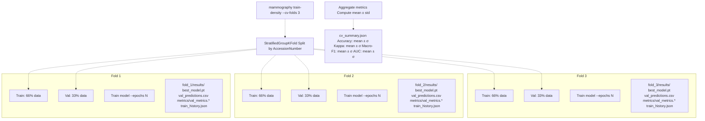
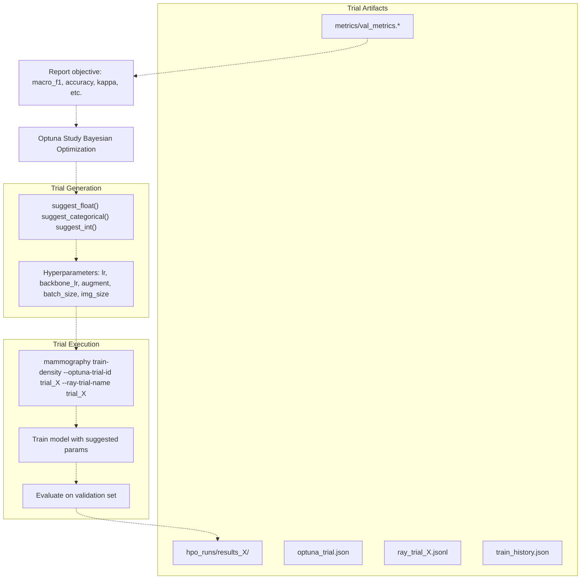
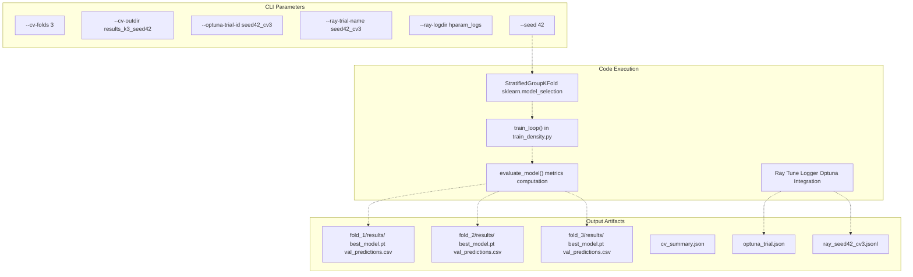

# Cross-Validation and Hyperparameter Optimization

> **Relevant source files**
> * [Article/02-density.md](https://github.com/ThalesMMS/mammography-pipelines/blob/01443313/Article/02-density.md)
> * [Article/article.md](https://github.com/ThalesMMS/mammography-pipelines/blob/01443313/Article/article.md)

## Purpose and Scope

This page documents the cross-validation and hyperparameter optimization infrastructure in the mammography pipeline. It covers stratified k-fold cross-validation for robust model evaluation and automated hyperparameter search using Optuna/Ray integration. For information about the base training loop and optimization strategies, see [Training Loop and Optimization](3d%20Training-Loop-and-Optimization.md). For model performance metrics and evaluation, see [Performance Metrics](5a%20Performance-Metrics.md).

The system provides:

* **Stratified k-fold cross-validation** with group-aware splitting (prevents patient data leakage)
* **Optuna integration** for Bayesian hyperparameter optimization
* **Ray Tune integration** for distributed trial logging
* **Automated artifact management** for multi-fold and multi-trial experiments

---

## Stratified K-Fold Cross-Validation

### Overview

The pipeline implements stratified k-fold cross-validation that maintains class distribution across folds while respecting patient-level grouping (via `AccessionNumber`). This prevents data leakage where different images from the same patient appear in both training and validation sets.

### Command Interface

Cross-validation is activated via the `mammography train-density` command with the following parameters:

| Parameter | Type | Purpose |
| --- | --- | --- |
| `--cv-folds` | int | Number of folds (typically 3-5) |
| `--cv-outdir` | path | Base directory for fold outputs |
| `--seed` | int | Random seed for reproducible fold splitting |

**Example Command:**

```
mammography train-density -- \  --csv classificacao.csv \  --dicom-root archive \  --outdir outputs/mammo_efficientnetb0_density \  --epochs 12 --batch-size 16 --img-size 512 \  --class-weights auto --warmup-epochs 2 \  --embeddings-dir outputs/embeddings_resnet50 \  --cv-folds 3 \  --cv-outdir outputs/density_experiments/results_k3_seed42 \  --seed 42
```

Sources: [Article/02-density.md L60-L74](https://github.com/ThalesMMS/mammography-pipelines/blob/01443313/Article/02-density.md#L60-L74)

### Cross-Validation Workflow



**Diagram 1: Cross-Validation Pipeline Execution**

Sources: [Article/02-density.md L58-L86](https://github.com/ThalesMMS/mammography-pipelines/blob/01443313/Article/02-density.md#L58-L86)

### Output Directory Structure

When `--cv-folds` is specified, the output structure follows this pattern:

```markdown
<cv-outdir>/
├── fold_1/
│   └── results/
│       ├── best_model.pt              # Best checkpoint for fold 1
│       ├── val_predictions.csv        # Per-sample predictions
│       ├── metrics/
│       │   ├── val_metrics.txt        # Human-readable metrics
│       │   ├── val_metrics.json       # Machine-readable metrics
│       │   └── val_metrics.yaml       # YAML format metrics
│       ├── train_history.json         # Loss/accuracy curves
│       ├── embeddings_val.npy         # Validation embeddings
│       └── optuna_trial.json          # Trial metadata
├── fold_2/
│   └── results/
│       └── ...                        # Same structure
├── fold_3/
│   └── results/
│       └── ...                        # Same structure
├── cv_summary.json                    # Aggregated statistics
└── run.log                            # Consolidated training logs
```

Sources: [Article/02-density.md L76-L77](https://github.com/ThalesMMS/mammography-pipelines/blob/01443313/Article/02-density.md#L76-L77)

### Aggregated Statistics Format

The `cv_summary.json` file contains mean and standard deviation for all evaluation metrics:

```
{  "accuracy": {"mean": 0.659, "std": 0.024},  "kappa_quadratic": {"mean": 0.666, "std": 0.020},  "macro_f1": {"mean": 0.592, "std": 0.036},  "auc_ovr": {"mean": 0.878, "std": 0.010},  "folds": [    {"fold": 1, "accuracy": 0.683, "kappa": 0.695, ...},    {"fold": 2, "accuracy": 0.642, "kappa": 0.651, ...},    {"fold": 3, "accuracy": 0.653, "kappa": 0.653, ...}  ]}
```

**Example Results (3-fold CV on seed 42):**

| Metric | Mean | σ |
| --- | --- | --- |
| Accuracy | 0.659 | 0.024 |
| κ (quadratic) | 0.666 | 0.020 |
| Macro-F1 | 0.592 | 0.036 |
| AUC (OvR) | 0.878 | 0.010 |

Sources: [Article/02-density.md L76-L85](https://github.com/ThalesMMS/mammography-pipelines/blob/01443313/Article/02-density.md#L76-L85)

---

## Hyperparameter Optimization

### Overview

The system integrates **Optuna** for Bayesian hyperparameter search and **Ray Tune** for distributed trial logging. This allows automated exploration of hyperparameter spaces including learning rates, augmentation strategies, architectural choices, and regularization parameters.

### HPO Command Interface

Hyperparameter optimization trials are tracked using two key parameters:

| Parameter | Type | Purpose |
| --- | --- | --- |
| `--optuna-trial-id` | str | Unique identifier for Optuna trial metadata |
| `--ray-trial-name` | str | Trial name for Ray Tune logging |
| `--ray-logdir` | path | Directory for Ray experiment logs |

**Example HPO Command:**

```
mammography train-density -- \  --csv classificacao.csv --dicom-root archive \  --outdir outputs/mammo_efficientnetb0_density/hpo_runs \  --epochs 3 --batch-size 16 --img-size 384 \  --subset 256 \  --lr 4e-4 --backbone-lr 4e-5 \  --train-augment \  --optuna-trial-id hpo_lr4e4 \  --ray-trial-name hpo_lr4e4 \  --ray-logdir outputs/density_experiments/hparam_logs
```

Sources: [Article/02-density.md L62-L73](https://github.com/ThalesMMS/mammography-pipelines/blob/01443313/Article/02-density.md#L62-L73)

 [Article/02-density.md L89-L95](https://github.com/ThalesMMS/mammography-pipelines/blob/01443313/Article/02-density.md#L89-L95)

### Hyperparameter Search Workflow



**Diagram 2: Hyperparameter Optimization Loop**

Sources: [Article/02-density.md L87-L96](https://github.com/ThalesMMS/mammography-pipelines/blob/01443313/Article/02-density.md#L87-L96)

### Quick Validation with Subset Training

For rapid HPO iteration, the `--subset` parameter enables training on a reduced dataset:

```
mammography train-density -- \  --subset 256 \           # Train on 256 samples only  --epochs 3 \             # Short training  --img-size 384           # Smaller images for speed
```

This approach validates the HPO pipeline integrity before committing to full-scale searches.

**Example Subset HPO Results:**

| Trial | LR / Backbone LR | Augment | Macro-F1 | Logs |
| --- | --- | --- | --- | --- |
| `results` | 4e-4 / 4e-5 | enabled | 0.318 | `ray_hpo_lr4e4.jsonl` |
| `results_1` | 2e-4 / 2e-5 | disabled | 0.429 | `ray_hpo_lr2e4.jsonl` |

Sources: [Article/02-density.md L87-L96](https://github.com/ThalesMMS/mammography-pipelines/blob/01443313/Article/02-density.md#L87-L96)

### HPO Output Structure

```markdown
<outdir>/hpo_runs/
├── results/                           # Trial 1
│   ├── optuna_trial.json             # Trial config + hyperparameters
│   ├── ray_hpo_lr4e4.jsonl           # Ray Tune event log
│   ├── metrics/
│   │   └── val_metrics.*             # Validation metrics
│   ├── train_history.json            # Training curves
│   └── best_model.pt                 # Best checkpoint
├── results_1/                         # Trial 2
│   └── ...
└── results_N/                         # Trial N
    └── ...
```

Sources: [Article/02-density.md L89-L96](https://github.com/ThalesMMS/mammography-pipelines/blob/01443313/Article/02-density.md#L89-L96)

### Trial Metadata Format

Each trial generates `optuna_trial.json` with complete hyperparameter configuration:

```
{  "trial_id": "hpo_lr4e4",  "hyperparameters": {    "lr": 0.0004,    "backbone_lr": 0.00004,    "train_augment": true,    "batch_size": 16,    "img_size": 384,    "epochs": 3  },  "objective_value": 0.318,  "objective_name": "macro_f1",  "timestamp": "2024-12-15T10:23:45",  "git_commit": "a1b2c3d4"}
```

Sources: [Article/02-density.md L89-L96](https://github.com/ThalesMMS/mammography-pipelines/blob/01443313/Article/02-density.md#L89-L96)

---

## Combined CV + HPO Workflows

### Cross-Validation with HPO Tracking

The system supports running cross-validation while maintaining HPO trial metadata:

```
mammography train-density -- \  --cv-folds 3 \  --cv-outdir outputs/density_experiments/results_k3_seed42 \  --optuna-trial-id seed42_cv3 \  --ray-trial-name seed42_cv3 \  --ray-logdir outputs/density_experiments/hparam_logs \  --epochs 12 --batch-size 16 --img-size 512 \  --class-weights auto --warmup-epochs 2 \  --embeddings-dir outputs/embeddings_resnet50
```

This creates both per-fold artifacts and unified trial metadata, enabling comparison across different hyperparameter configurations using cross-validated performance.

Sources: [Article/02-density.md L62-L74](https://github.com/ThalesMMS/mammography-pipelines/blob/01443313/Article/02-density.md#L62-L74)

### Architecture: Command Parameters to Output Artifacts



**Diagram 3: Mapping CLI Parameters to Code Entities and Output Files**

Sources: [Article/02-density.md L60-L74](https://github.com/ThalesMMS/mammography-pipelines/blob/01443313/Article/02-density.md#L60-L74)

---

## Configuration Best Practices

### Recommended CV Settings

| Use Case | Folds | Epochs/Fold | Total Training Time |
| --- | --- | --- | --- |
| Quick validation | 3 | 5-10 | ~30-60 min |
| Standard evaluation | 5 | 10-15 | ~1-2 hours |
| Publication-ready | 10 | 15-20 | ~3-5 hours |

### Recommended HPO Settings

| Phase | Trials | Subset Size | Epochs | Strategy |
| --- | --- | --- | --- | --- |
| Initial exploration | 10-20 | 256-512 | 3-5 | Grid/Random |
| Refinement | 30-50 | Full dataset | 5-10 | Bayesian |
| Final tuning | 20-30 | Full dataset | 10-20 | Bayesian |

### Computational Considerations

**With `--cache-mode disk`:**

* First epoch: ~5-10 min (DICOM loading + caching)
* Subsequent epochs: ~30-60 sec (cache reads)
* Total 3-fold CV: ~1-1.5 hours for 12 epochs/fold

**Without caching:**

* Each epoch: ~5-10 min (repeated DICOM loading)
* Total 3-fold CV: ~3-5 hours for 12 epochs/fold

Sources: [Article/02-density.md L49](https://github.com/ThalesMMS/mammography-pipelines/blob/01443313/Article/02-density.md#L49-L49)

---

## Integration with Report Generation

Cross-validation and HPO results can be incorporated into article assets using `mammography report-pack`:

```
# After CV completes, promote best fold as canonical resultmammography report-pack \  --run outputs/density_experiments/results_k3_seed42/fold_1/results \  --assets-dir Article/assets
```

This synchronizes confusion matrices, training curves, and Grad-CAMs from the best-performing fold into the documentation system.

For batch processing of multiple trials:

```
# Compare all HPO trialsfor trial_dir in outputs/mammo_efficientnetb0_density/hpo_runs/results_*; do  mammography report-pack --run $trial_dir --assets-dir Article/assets/hpo_trialsdone
```

Sources: [Article/02-density.md L96](https://github.com/ThalesMMS/mammography-pipelines/blob/01443313/Article/02-density.md#L96-L96)

---

## Reproducibility Checklist

For CV and HPO experiments:

* `--seed` specified for deterministic fold splitting
* `--cv-outdir` contains all fold artifacts (`fold_1/`, `fold_2/`, ...)
* `cv_summary.json` records aggregated statistics
* `optuna_trial.json` captures hyperparameter configuration
* `ray_<trial_name>.jsonl` logs execution timeline
* Git commit hash recorded in `summary.json` or `optuna_trial.json`
* Training logs archived in `run.log`
* Validation predictions saved per fold (`val_predictions.csv`)

Sources: [Article/02-density.md L16-L22](https://github.com/ThalesMMS/mammography-pipelines/blob/01443313/Article/02-density.md#L16-L22)

---

## Common Patterns

### Pattern 1: Quick Smoke Test

```
mammography train-density -- \  --subset 128 --epochs 2 --cv-folds 2 \  --cv-outdir outputs/smoke_test
```

### Pattern 2: Production CV Run

```
mammography train-density -- \  --epochs 15 --batch-size 16 --cv-folds 5 \  --cv-outdir outputs/production_cv_seed42 \  --seed 42 --cache-mode disk \  --optuna-trial-id production_cv5 \  --ray-trial-name production_cv5
```

### Pattern 3: HPO with Full Dataset

```
mammography train-density -- \  --epochs 10 --batch-size 16 \  --lr 3e-4 --backbone-lr 3e-5 \  --train-augment \  --outdir outputs/hpo_runs/trial_lr3e4 \  --optuna-trial-id trial_lr3e4 \  --ray-trial-name trial_lr3e4 \  --ray-logdir outputs/hpo_logs
```

Sources: [Article/02-density.md L62-L74](https://github.com/ThalesMMS/mammography-pipelines/blob/01443313/Article/02-density.md#L62-L74)

 [Article/02-density.md L89-L96](https://github.com/ThalesMMS/mammography-pipelines/blob/01443313/Article/02-density.md#L89-L96)

---

## Performance Analysis

### Variance Across Folds

Cross-validation reveals model stability:

```
Fold 1: Macro-F1 = 0.643 (high)
Fold 2: Macro-F1 = 0.572 (medium)
Fold 3: Macro-F1 = 0.561 (medium)
Mean ± σ: 0.592 ± 0.036
```

High standard deviation (>0.05) indicates sensitivity to data splits, suggesting:

* Class imbalance issues (particularly classes 1-2)
* Need for more training data
* Potential overfitting to validation fold characteristics

Sources: [Article/02-density.md L76-L85](https://github.com/ThalesMMS/mammography-pipelines/blob/01443313/Article/02-density.md#L76-L85)

### HPO Convergence

Typical convergence pattern:

* Initial trials: Broad exploration (macro-F1: 0.2-0.5)
* Mid-phase: Exploitation around promising regions (macro-F1: 0.5-0.6)
* Final trials: Fine-tuning (macro-F1: 0.58-0.62)

If best trial from HPO exceeds holdout baseline (seed 42: macro-F1 0.579), promote it as the new reference configuration.

Sources: [Article/02-density.md L54-L56](https://github.com/ThalesMMS/mammography-pipelines/blob/01443313/Article/02-density.md#L54-L56)

 [Article/02-density.md L89-L96](https://github.com/ThalesMMS/mammography-pipelines/blob/01443313/Article/02-density.md#L89-L96)


### On this page

* [Cross-Validation and Hyperparameter Optimization](#3.5-cross-validation-and-hyperparameter-optimization)
* [Purpose and Scope](#3.5-purpose-and-scope)
* [Stratified K-Fold Cross-Validation](#3.5-stratified-k-fold-cross-validation)
* [Overview](#3.5-overview)
* [Command Interface](#3.5-command-interface)
* [Cross-Validation Workflow](#3.5-cross-validation-workflow)
* [Output Directory Structure](#3.5-output-directory-structure)
* [Aggregated Statistics Format](#3.5-aggregated-statistics-format)
* [Hyperparameter Optimization](#3.5-hyperparameter-optimization)
* [Overview](#3.5-overview-1)
* [HPO Command Interface](#3.5-hpo-command-interface)
* [Hyperparameter Search Workflow](#3.5-hyperparameter-search-workflow)
* [Quick Validation with Subset Training](#3.5-quick-validation-with-subset-training)
* [HPO Output Structure](#3.5-hpo-output-structure)
* [Trial Metadata Format](#3.5-trial-metadata-format)
* [Combined CV + HPO Workflows](#3.5-combined-cv-hpo-workflows)
* [Cross-Validation with HPO Tracking](#3.5-cross-validation-with-hpo-tracking)
* [Architecture: Command Parameters to Output Artifacts](#3.5-architecture-command-parameters-to-output-artifacts)
* [Configuration Best Practices](#3.5-configuration-best-practices)
* [Recommended CV Settings](#3.5-recommended-cv-settings)
* [Recommended HPO Settings](#3.5-recommended-hpo-settings)
* [Computational Considerations](#3.5-computational-considerations)
* [Integration with Report Generation](#3.5-integration-with-report-generation)
* [Reproducibility Checklist](#3.5-reproducibility-checklist)
* [Common Patterns](#3.5-common-patterns)
* [Pattern 1: Quick Smoke Test](#3.5-pattern-1-quick-smoke-test)
* [Pattern 2: Production CV Run](#3.5-pattern-2-production-cv-run)
* [Pattern 3: HPO with Full Dataset](#3.5-pattern-3-hpo-with-full-dataset)
* [Performance Analysis](#3.5-performance-analysis)
* [Variance Across Folds](#3.5-variance-across-folds)
* [HPO Convergence](#3.5-hpo-convergence)

Ask Devin about mammography-pipelines