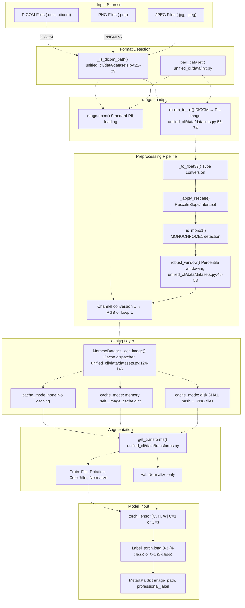
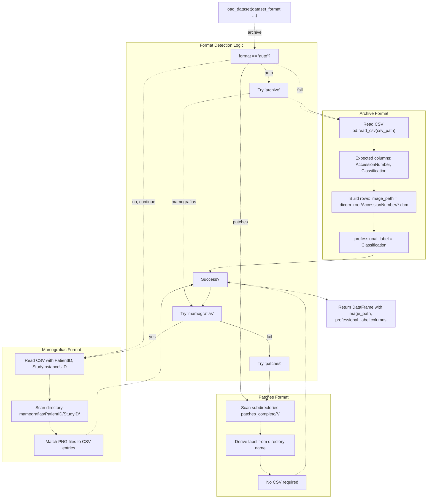
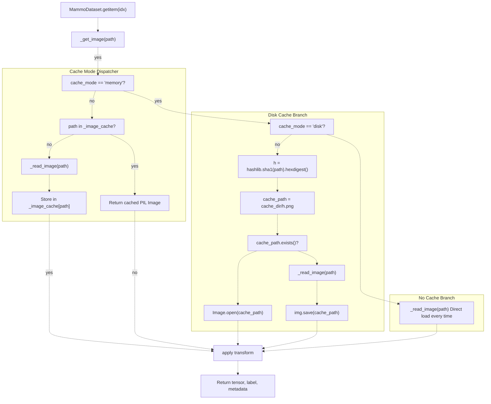

# Data Management

> **Relevant source files**
> * [Article/01-embeddings.md](https://github.com/ThalesMMS/mammography-pipelines/blob/01443313/Article/01-embeddings.md)
> * [Article/article.md](https://github.com/ThalesMMS/mammography-pipelines/blob/01443313/Article/article.md)

This page provides a comprehensive overview of how medical imaging data flows through the mammography pipeline, from raw DICOM files to model-ready tensors. It covers dataset organization, file format support, caching strategies, and preprocessing workflows.

**Scope**: This page focuses on the high-level data management architecture. For detailed information on:

* DICOM preprocessing algorithms (windowing, normalization), see [DICOM Image Handling](4a%20DICOM-Datasets.md)
* Supported dataset formats and directory structures, see [Dataset Formats](4b%20Preprocessing-and-Augmentation.md)
* PowerShell scripts for archive conversion and cleanup, see [Archive Management Scripts](4c%20Data-Splitting-and-Stratification.md)
* Stratified splitting and sampling strategies, see [Data Splitting and Sampling](4d%20Class-Imbalance-Handling.md)

---

## Data Flow Architecture

The system transforms raw medical images through several stages before reaching the model. The pipeline supports multiple input formats and provides flexible caching to optimize I/O performance.

**Diagram: Data Flow from Raw Files to Model-Ready Tensors**



**Sources**: [unified_cli/data/datasets.py L1-L174](https://github.com/ThalesMMS/mammography-pipelines/blob/01443313/unified_cli/data/datasets.py#L1-L174)

 [unified_cli/tasks/inference_task.py L16-L100](https://github.com/ThalesMMS/mammography-pipelines/blob/01443313/unified_cli/tasks/inference_task.py#L16-L100)

 [RSNA_Mammography_EDA.py L187-L210](https://github.com/ThalesMMS/mammography-pipelines/blob/01443313/RSNA_Mammography_EDA.py#L187-L210)

---

## Dataset Organization and Format Detection

The pipeline supports three primary dataset formats with automatic detection through the `load_dataset` function. Each format expects a specific directory structure and CSV schema.

### Supported Dataset Formats

| Format | Description | Expected Structure | Use Case |
| --- | --- | --- | --- |
| `archive` | DICOM files organized by AccessionNumber | `archive/<AccessionNumber>/*.dcm` + CSV with `AccessionNumber`, `Classification` columns | Primary format for IRMA dataset |
| `mamografias` | PNG images with patient-study structure | `mamografias/<PatientID>/<StudyID>/*.png` + CSV with study metadata | Alternative organization |
| `patches` | Pre-extracted image patches | `patches_completo/<class_dir>/*.png` | Pre-processed patches for faster loading |
| `auto` | Automatic detection | Any of the above | Default mode that tries each format |

**Diagram: Dataset Format Resolution**



**Sources**: [unified_cli/data/__init__.py](https://github.com/ThalesMMS/mammography-pipelines/blob/01443313/unified_cli/data/__init__.py)

 (referenced but not provided), [unified_cli/tasks/features_task.py L23-L29](https://github.com/ThalesMMS/mammography-pipelines/blob/01443313/unified_cli/tasks/features_task.py#L23-L29)

 [unified_cli/tasks/inference_task.py L48-L56](https://github.com/ThalesMMS/mammography-pipelines/blob/01443313/unified_cli/tasks/inference_task.py#L48-L56)

---

## Caching System Architecture

The `MammoDataset` class implements three caching strategies to balance memory usage, disk space, and I/O performance. Large medical images (especially DICOMs) can be expensive to load and preprocess repeatedly.

### Caching Mode Comparison

| Mode | Storage Location | When to Use | Trade-offs |
| --- | --- | --- | --- |
| `none` | No caching | Unlimited dataset size, limited memory | Slowest: re-reads and preprocesses each epoch |
| `memory` | RAM (`dict`) | Small datasets that fit in memory | Fast but memory-intensive |
| `disk` | Filesystem (PNG files with SHA1 hash names) | Large datasets, persistent cache across runs | Moderate speed, requires disk space |
| `tensor-disk` | Filesystem (`.pt` files) | Skip PIL conversion overhead | Faster disk cache variant |
| `tensor-memmap` | Memory-mapped files (`.dat` + `.json`) | Shared memory across workers | Advanced: zero-copy for multi-worker DataLoader |

**Diagram: Caching Implementation in MammoDataset**



**Sources**: [unified_cli/data/datasets.py L78-L173](https://github.com/ThalesMMS/mammography-pipelines/blob/01443313/unified_cli/data/datasets.py#L78-L173)

 [tests/test_cache_mode.py L44-L122](https://github.com/ThalesMMS/mammography-pipelines/blob/01443313/tests/test_cache_mode.py#L44-L122)

### Cache Directory Structure

For `disk` caching mode, the cache directory contains SHA1-hashed filenames to avoid path collisions:

```
cache_dir/
├── a3f2c8b9d1e5f6a7b8c9d0e1f2a3b4c5d6e7f8a9.png
├── b4c5d6e7f8a9b0c1d2e3f4a5b6c7d8e9f0a1b2c3.png
└── ...
```

For `tensor-memmap` mode (tested in [tests/test_cache_mode.py L102-L122](https://github.com/ThalesMMS/mammography-pipelines/blob/01443313/tests/test_cache_mode.py#L102-L122)

):

```markdown
cache_dir/
├── <hash>.dat     # Raw tensor data
├── <hash>.json    # Shape and dtype metadata
└── ...
```

---

## MammoDataset Implementation

The `MammoDataset` class ([unified_cli/data/datasets.py L78-L173](https://github.com/ThalesMMS/mammography-pipelines/blob/01443313/unified_cli/data/datasets.py#L78-L173)

) is the core dataset abstraction. It handles:

1. **Multi-format loading**: DICOM via `dicom_to_pil()`, standard images via `PIL.Image.open()`
2. **Label mapping**: Converts BI-RADS density classes (1-4) to model targets (0-3 for 4-class, 0-1 for 2-class)
3. **Channel flexibility**: Supports 1-channel (grayscale) or 3-channel (RGB) output
4. **Transform application**: Applies augmentation/normalization transforms
5. **Caching**: Delegates to `_get_image()` for cache management

### Key Constructor Parameters

```
MammoDataset(    rows: List[Dict[str, Any]],           # List of dicts with 'image_path', 'professional_label'    img_size: int,                        # Target image size (e.g., 224)    train: bool,                          # Training mode flag (affects augmentation)    augment: bool = True,                 # Whether to apply data augmentation    cache_mode: str = "none",             # "none", "memory", "disk", "tensor-disk", "tensor-memmap"    cache_dir: Optional[str] = None,      # Required for disk-based caching    num_classes: int = 4,                 # 4 (A,B,C,D) or 2 (A-B vs C-D)    input_channels: int = 3,              # 1 (grayscale) or 3 (RGB)    mean: Optional[List[float]] = None,   # Normalization mean    std: Optional[List[float]] = None     # Normalization std)
```

### Label Mapping Logic

The dataset maps BI-RADS density classifications to zero-indexed targets ([unified_cli/data/datasets.py L162-L171](https://github.com/ThalesMMS/mammography-pipelines/blob/01443313/unified_cli/data/datasets.py#L162-L171)

):

**4-class mode** (dense vs non-dense with gradations):

* Input: 1 (A) → Output: 0
* Input: 2 (B) → Output: 1
* Input: 3 (C) → Output: 2
* Input: 4 (D) → Output: 3

**2-class mode** (binary dense vs non-dense):

* Input: 1 or 2 (A, B - non-dense) → Output: 0
* Input: 3 or 4 (C, D - dense) → Output: 1

**Sources**: [unified_cli/data/datasets.py L78-L173](https://github.com/ThalesMMS/mammography-pipelines/blob/01443313/unified_cli/data/datasets.py#L78-L173)

---

## DICOM Preprocessing Pipeline

DICOM files require specialized preprocessing before they can be used for training. The pipeline is implemented in `dicom_to_pil()` ([unified_cli/data/datasets.py L56-L74](https://github.com/ThalesMMS/mammography-pipelines/blob/01443313/unified_cli/data/datasets.py#L56-L74)

) and handles:

1. **Pixel data extraction**: Uses `pydicom.dcmread()` to read DICOM metadata and pixel array
2. **Type conversion**: Converts to `float32` for numerical stability ([unified_cli/data/datasets.py L28-L31](https://github.com/ThalesMMS/mammography-pipelines/blob/01443313/unified_cli/data/datasets.py#L28-L31) )
3. **Rescaling**: Applies `RescaleSlope` and `RescaleIntercept` from DICOM metadata ([unified_cli/data/datasets.py L33-L43](https://github.com/ThalesMMS/mammography-pipelines/blob/01443313/unified_cli/data/datasets.py#L33-L43) )
4. **MONOCHROME1 inversion**: Inverts pixel values if `PhotometricInterpretation == "MONOCHROME1"` ([unified_cli/data/datasets.py L25-L26](https://github.com/ThalesMMS/mammography-pipelines/blob/01443313/unified_cli/data/datasets.py#L25-L26) )
5. **Robust windowing**: Applies percentile-based windowing (default: 0.5-99.5 percentiles) to normalize contrast ([unified_cli/data/datasets.py L45-L53](https://github.com/ThalesMMS/mammography-pipelines/blob/01443313/unified_cli/data/datasets.py#L45-L53) )
6. **8-bit conversion**: Scales to 0-255 uint8 range for PIL compatibility
7. **Channel replication**: Converts grayscale to RGB if `channels=3` by replicating the grayscale channel

For detailed explanations of each preprocessing step, see [DICOM Image Handling](4a%20DICOM-Datasets.md).

**Sources**: [unified_cli/data/datasets.py L20-L75](https://github.com/ThalesMMS/mammography-pipelines/blob/01443313/unified_cli/data/datasets.py#L20-L75)

 [RSNA_Mammography_EDA.py L148-L210](https://github.com/ThalesMMS/mammography-pipelines/blob/01443313/RSNA_Mammography_EDA.py#L148-L210)

---

## Archive Management Utilities

The codebase includes PowerShell scripts for managing DICOM archives:

### convert_archive_to_png.ps1

Converts DICOM files to PNG format while preserving directory structure ([convert_archive_to_png.ps1 L1-L73](https://github.com/ThalesMMS/mammography-pipelines/blob/01443313/convert_archive_to_png.ps1#L1-L73)

):

```yaml
Usage: .\convert_archive_to_png.ps1 -SourceDir "./archive" -OutputDir "./archive_png" [-SkipExisting]
```

* Walks through `SourceDir` recursively
* Converts `.dcm` files to `.png` using the same preprocessing as `dicom_to_pil()`
* Maintains directory hierarchy in `OutputDir`
* Optional `-SkipExisting` flag to skip already-converted files

### clean_archive.ps1

Cleans duplicate files from the archive directory ([clean_archive.ps1 L1-L78](https://github.com/ThalesMMS/mammography-pipelines/blob/01443313/clean_archive.ps1#L1-L78)

):

```yaml
Usage: .\clean_archive.ps1 -BaseDir "./archive"
```

* Removes all PNG files (often artifacts from exploratory analysis)
* Keeps only the first DICOM file (alphabetically) in each subdirectory
* Reports statistics on removed files

These utilities are essential for maintaining a clean working directory and optimizing storage. For more details, see [Archive Management Scripts](4c%20Data-Splitting-and-Stratification.md).

**Sources**: [convert_archive_to_png.ps1 L1-L73](https://github.com/ThalesMMS/mammography-pipelines/blob/01443313/convert_archive_to_png.ps1#L1-L73)

 [clean_archive.ps1 L1-L78](https://github.com/ThalesMMS/mammography-pipelines/blob/01443313/clean_archive.ps1#L1-L78)

---

## Integration with Task Pipelines

### Training Pipeline Integration

The training pipeline ([unified_cli/tasks/train_task.py](https://github.com/ThalesMMS/mammography-pipelines/blob/01443313/unified_cli/tasks/train_task.py)

) uses `MammoDataset` with the following typical configuration:

```
train_dataset = MammoDataset(    rows=train_rows,    img_size=224,    train=True,    augment=True,    cache_mode="disk",  # or "memory", "none"    cache_dir="./cache/train",    num_classes=4,    input_channels=3)
```

### Inference Pipeline Integration

The inference pipeline ([unified_cli/tasks/inference_task.py L16-L100](https://github.com/ThalesMMS/mammography-pipelines/blob/01443313/unified_cli/tasks/inference_task.py#L16-L100)

) loads images without a CSV:

1. Collects files with extensions: `.png`, `.jpg`, `.jpeg`, `.dcm`, `.dicom` ([unified_cli/tasks/inference_task.py L54-L56](https://github.com/ThalesMMS/mammography-pipelines/blob/01443313/unified_cli/tasks/inference_task.py#L54-L56) )
2. Detects format: DICOM → `dicom_to_pil()`, others → `Image.open()` ([unified_cli/tasks/inference_task.py L64-L71](https://github.com/ThalesMMS/mammography-pipelines/blob/01443313/unified_cli/tasks/inference_task.py#L64-L71) )
3. Applies transforms (no augmentation, just normalization)
4. Runs inference and saves predictions to CSV

### Feature Extraction Integration

The feature extraction pipeline ([unified_cli/tasks/features_task.py L17-L103](https://github.com/ThalesMMS/mammography-pipelines/blob/01443313/unified_cli/tasks/features_task.py#L17-L103)

) uses `MammoDataset` without augmentation:

```
ds = MammoDataset(    df.to_dict('records'),    img_size=224,    train=False,       # Disable training mode    augment=False      # No augmentation for feature extraction)
```

**Sources**: [unified_cli/tasks/features_task.py L32-L38](https://github.com/ThalesMMS/mammography-pipelines/blob/01443313/unified_cli/tasks/features_task.py#L32-L38)

 [unified_cli/tasks/inference_task.py L48-L74](https://github.com/ThalesMMS/mammography-pipelines/blob/01443313/unified_cli/tasks/inference_task.py#L48-L74)

---

## Performance Considerations

### Cache Mode Selection Guidelines

**Use `none` when**:

* Dataset is very large (>10,000 images)
* Memory is limited (<8GB RAM)
* Running on systems with fast SSDs where I/O overhead is acceptable

**Use `memory` when**:

* Dataset is small (<5,000 images)
* System has abundant RAM (>16GB)
* Maximum training speed is required

**Use `disk` when**:

* Dataset is moderate size (5,000-50,000 images)
* Training runs will be repeated (cache persists across runs)
* Disk space is available (cache size ≈ dataset size)

**Use `tensor-memmap` when**:

* Using multi-worker DataLoader (`num_workers > 0`)
* Want zero-copy data sharing between processes
* Advanced use case with understanding of memory-mapped files

### Memory Footprint Estimates

For a typical mammography image:

* DICOM file: ~50-100 MB (compressed)
* Loaded DICOM array (float32): ~20-50 MB
* PIL Image (RGB, 1024×1024): ~3 MB
* Cached PNG (disk): ~1-2 MB (compressed)
* Tensor (3×224×224 float32): ~600 KB after resize

**Sources**: Inferred from [unified_cli/data/datasets.py L78-L173](https://github.com/ThalesMMS/mammography-pipelines/blob/01443313/unified_cli/data/datasets.py#L78-L173)

 and [tests/test_cache_mode.py L44-L122](https://github.com/ThalesMMS/mammography-pipelines/blob/01443313/tests/test_cache_mode.py#L44-L122)

---

## Error Handling and Robustness

The data pipeline includes several robustness features:

1. **Format fallback**: `load_dataset(format="auto")` tries multiple formats ([unified_cli/data/__init__.py](https://github.com/ThalesMMS/mammography-pipelines/blob/01443313/unified_cli/data/__init__.py) )
2. **DICOM error handling**: Catches exceptions during DICOM reading and provides informative error messages ([unified_cli/data/datasets.py L60-L61](https://github.com/ThalesMMS/mammography-pipelines/blob/01443313/unified_cli/data/datasets.py#L60-L61) )
3. **Robust windowing**: Handles edge cases where percentiles are equal or invalid ([unified_cli/data/datasets.py L46-L50](https://github.com/ThalesMMS/mammography-pipelines/blob/01443313/unified_cli/data/datasets.py#L46-L50) )
4. **Missing labels**: Supports `None` labels with default value of -1 ([unified_cli/data/datasets.py L163](https://github.com/ThalesMMS/mammography-pipelines/blob/01443313/unified_cli/data/datasets.py#L163-L163) )
5. **MONOCHROME1 detection**: Automatically inverts pixel values for correct brightness ([unified_cli/data/datasets.py L25-L26](https://github.com/ThalesMMS/mammography-pipelines/blob/01443313/unified_cli/data/datasets.py#L25-L26)  [unified_cli/data/datasets.py L65-L66](https://github.com/ThalesMMS/mammography-pipelines/blob/01443313/unified_cli/data/datasets.py#L65-L66) )

**Sources**: [unified_cli/data/datasets.py L56-L74](https://github.com/ThalesMMS/mammography-pipelines/blob/01443313/unified_cli/data/datasets.py#L56-L74)

 [RSNA_Mammography_EDA.py L187-L210](https://github.com/ThalesMMS/mammography-pipelines/blob/01443313/RSNA_Mammography_EDA.py#L187-L210)

---

## Summary

The data management system provides a flexible, performant foundation for the mammography pipeline:

* **Multi-format support**: DICOM, PNG, JPEG with automatic detection
* **Three caching strategies**: None, memory, disk (with advanced tensor-memmap option)
* **Robust DICOM preprocessing**: Handles scanner variations, photometric interpretations, and metadata
* **Label mapping**: Flexible 2-class or 4-class density classification
* **Archive utilities**: PowerShell scripts for format conversion and cleanup
* **Integration**: Seamlessly used by training, inference, and feature extraction pipelines

The architecture separates concerns cleanly: format detection → image loading → preprocessing → caching → augmentation → batching. This modularity allows each component to be tested and optimized independently.

For implementation details on specific components, refer to the subsections:

* [DICOM Image Handling](4a%20DICOM-Datasets.md) for preprocessing algorithms
* [Dataset Formats](4b%20Preprocessing-and-Augmentation.md) for directory structure specifications
* [Archive Management Scripts](4c%20Data-Splitting-and-Stratification.md) for utility script documentation
* [Data Splitting and Sampling](4d%20Class-Imbalance-Handling.md) for train/validation split strategies


### On this page

* [Data Management](4%20Data-Management.md)
* [Data Flow Architecture](4%20Data-Management.md)
* [Dataset Organization and Format Detection](4%20Data-Management.md)
* [Supported Dataset Formats](4%20Data-Management.md)
* [Caching System Architecture](4%20Data-Management.md)
* [Caching Mode Comparison](4%20Data-Management.md)
* [Cache Directory Structure](4%20Data-Management.md)
* [MammoDataset Implementation](4%20Data-Management.md)
* [Key Constructor Parameters](4%20Data-Management.md)
* [Label Mapping Logic](4%20Data-Management.md)
* [DICOM Preprocessing Pipeline](4%20Data-Management.md)
* [Archive Management Utilities](4%20Data-Management.md)
* [convert_archive_to_png.ps1](4%20Data-Management.md)
* [clean_archive.ps1](4%20Data-Management.md)
* [Integration with Task Pipelines](4%20Data-Management.md)
* [Training Pipeline Integration](4%20Data-Management.md)
* [Inference Pipeline Integration](4%20Data-Management.md)
* [Feature Extraction Integration](4%20Data-Management.md)
* [Performance Considerations](4%20Data-Management.md)
* [Cache Mode Selection Guidelines](4%20Data-Management.md)
* [Memory Footprint Estimates](4%20Data-Management.md)
* [Error Handling and Robustness](4%20Data-Management.md)
* [Summary](4%20Data-Management.md)

Ask Devin about mammography-pipelines