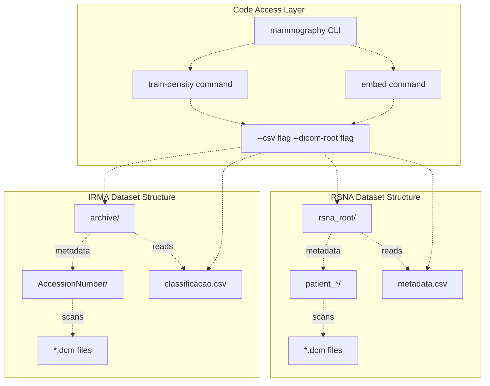
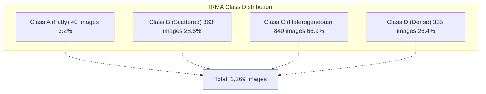
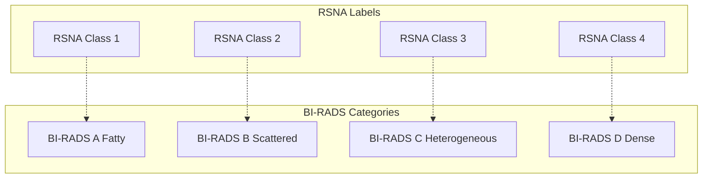
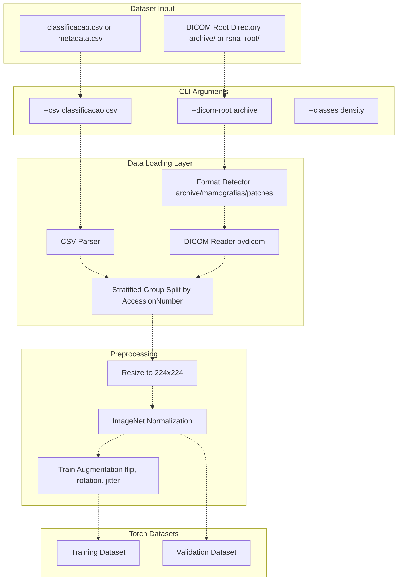
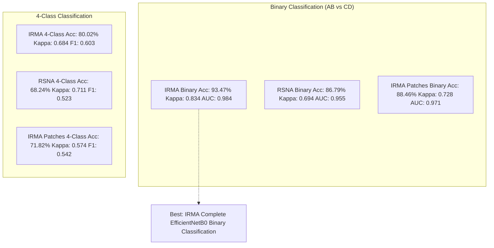

# DICOM Datasets

> **Relevant source files**
> * [Article/01-embeddings.md](https://github.com/ThalesMMS/mammography-pipelines/blob/01443313/Article/01-embeddings.md)
> * [Article/article.md](https://github.com/ThalesMMS/mammography-pipelines/blob/01443313/Article/article.md)

## Purpose and Scope

This page describes the two primary datasets used in the mammography-pipelines project: **IRMA** (Image Retrieval in Medical Applications) and **RSNA Screening Mammography**. It covers their characteristics, class distributions, expected directory structures, and how the codebase accesses them. For information about preprocessing and augmentation applied to these datasets, see [Preprocessing and Augmentation](4b%20Preprocessing-and-Augmentation.md). For details on how class imbalance is handled, see [Class Imbalance Handling](4d%20Class-Imbalance-Handling.md).

---

## Dataset Overview

The project supports two distinct mammography datasets with different characteristics and scales:

| Characteristic | IRMA | RSNA |
| --- | --- | --- |
| **Source** | Film mammography (digitalized) | Digital mammography |
| **Total Images** | 1,269 (after filtering) | ~54,000 |
| **Format** | PNG converted from DICOM | DICOM |
| **Class System** | A, B, C, D (BI-RADS) | 1, 2, 3, 4 (equivalent to A, B, C, D) |
| **Primary Use** | Experiments reported in research | Large-scale validation |
| **Class Balance** | Highly imbalanced (3.2% to 66.9%) | More balanced |
| **Root Directory** | `archive/` | Dataset-specific path |

**Sources:** Article/article.md:33-49

---

## Dataset Architecture and Access Patterns



**Diagram: Dataset Organization and CLI Access**

This diagram shows how both datasets are organized on disk and accessed through the `mammography` CLI tool. The `--csv` and `--dicom-root` flags specify the metadata file and root directory respectively.

**Sources:** Article/01-embeddings.md:9-13, Article/article.md:456-491

---

## IRMA Dataset

### Characteristics

The IRMA (Image Retrieval in Medical Applications) dataset consists of film mammography images that have been digitalized and converted to DICOM format. It represents a realistic scenario of legacy film archives being digitized for modern analysis.

| Property | Value |
| --- | --- |
| **Total Images** | 1,269 (post-filtering) |
| **Original Format** | Film mammography |
| **Storage Format** | PNG converted from DICOM |
| **Image Type** | Grayscale mammograms |
| **Primary Use Case** | Detailed experiments with controlled class distribution |
| **Metadata File** | `classificacao.csv` |

**Sources:** Article/article.md:35-43

### Directory Structure

The IRMA dataset follows a hierarchical structure organized by `AccessionNumber`, which groups images belonging to the same patient or exam session:

```
archive/
├── <AccessionNumber_1>/
│   ├── image_001.dcm
│   ├── image_002.dcm
│   └── ...
├── <AccessionNumber_2>/
│   ├── image_001.dcm
│   └── ...
└── ...
```

This structure is critical for preventing data leakage during train/validation splits, as all images with the same `AccessionNumber` must remain in the same split. See [Data Splitting and Stratification](4c%20Data-Splitting-and-Stratification.md) for details on how this is enforced.

**Sources:** Article/01-embeddings.md:17, Article/article.md:81

### Class Distribution

The IRMA dataset exhibits severe class imbalance, which is one of the primary challenges addressed in this project:



**Diagram: IRMA Class Distribution**

The extreme imbalance (Class A with only 3.2% vs Class C with 66.9%) requires specialized handling techniques including weighted sampling, stratified splitting, and careful metric selection. This imbalance is the root cause of model collapse phenomena documented in [Model Collapse Prevention](7%20Model-Collapse-Prevention.md).

| Class | Images | Percentage | BI-RADS Description |
| --- | --- | --- | --- |
| **A** | 40 | 3.2% | Predominantly fatty breast tissue (< 25% fibroglandular) |
| **B** | 363 | 28.6% | Scattered areas of fibroglandular density (25-50%) |
| **C** | 849 | 66.9% | Heterogeneously dense (51-75%) |
| **D** | 335 | 26.4% | Extremely dense (> 75%) |

**Sources:** Article/article.md:37-42, Article/article.md:294-301

### Data Format and Metadata

The IRMA dataset uses a CSV file (`classificacao.csv`) for storing classification metadata. This file is the primary interface between the dataset and the training pipeline:

**Expected CSV Structure:**

* **AccessionNumber**: Unique identifier for grouping images from the same exam
* **Density Class**: BI-RADS density category (A, B, C, or D)
* **File Path Information**: Implicit mapping to `archive/<AccessionNumber>/*.dcm`

The CSV must exclude any images with class 5 (undefined/error category) to ensure clean training data.

**Command-line usage example:**

```
mammography embed -- \  --csv classificacao.csv \  --dicom-root archive \  --outdir outputs/embeddings_resnet50
```

**Sources:** Article/01-embeddings.md:9-13, Article/01-embeddings.md:17

---

## RSNA Dataset

### Characteristics

The RSNA (Radiological Society of North America) Screening Mammography dataset originates from a Kaggle competition and represents modern digital mammography at scale.

| Property | Value |
| --- | --- |
| **Total Images** | ~54,000 |
| **Original Format** | Digital mammography (native DICOM) |
| **Storage Format** | DICOM |
| **Image Type** | Digital grayscale mammograms |
| **Primary Use Case** | Large-scale validation and benchmarking |
| **Class Labels** | 1, 2, 3, 4 (mapped to A, B, C, D) |

**Sources:** Article/article.md:45-49

### Directory Structure

The RSNA dataset follows a similar hierarchical structure but uses patient identifiers:

```
rsna_root/
├── patient_<id_1>/
│   ├── study_<id>/
│   │   ├── series_<id>/
│   │   │   ├── image_001.dcm
│   │   │   └── ...
│   └── ...
└── ...
```

The exact structure may vary depending on the dataset download method and preprocessing applied.

**Sources:** Article/article.md:45-49

### Class Distribution

The RSNA dataset exhibits better class balance compared to IRMA, though the exact distribution varies by subset used:

| Class | Description | Approximate Percentage |
| --- | --- | --- |
| **1** (A) | Almost entirely fatty | More balanced than IRMA |
| **2** (B) | Scattered fibroglandular | More balanced than IRMA |
| **3** (C) | Heterogeneously dense | More balanced than IRMA |
| **4** (D) | Extremely dense | More balanced than IRMA |

The improved balance makes RSNA suitable for validating model architectures before applying them to the more challenging IRMA dataset.

**Sources:** Article/article.md:45-49

### Class Label Mapping

The RSNA dataset uses numeric labels (1-4) that must be mapped to BI-RADS categories (A-D):



**Diagram: RSNA to BI-RADS Class Mapping**

This mapping is handled internally by the data loading pipeline to ensure consistent class labels across both datasets.

**Sources:** Article/article.md:45-49

---

## Dataset Variants and Preprocessing

### IRMA Patches Dataset

In addition to complete mammography images, the project supports a patches variant of the IRMA dataset for localized texture analysis:

| Variant | Description | Performance Notes |
| --- | --- | --- |
| **IRMA Complete** | Full mammogram images | Best performance (80.02% accuracy, 4-class) |
| **IRMA Patches** | Cropped local regions | Lower performance (71.82% accuracy, 4-class) |

The patches variant demonstrates that **global breast context is crucial** for density classification, as patch-based approaches consistently underperform compared to complete images by ~8-10 percentage points.

**Sources:** Article/article.md:215-237

---

## Data Loading Pipeline



**Diagram: Data Loading Pipeline from Disk to Model**

This diagram maps the data flow from raw DICOM files and CSV metadata through the preprocessing pipeline to PyTorch datasets. The `FormatDetector` automatically identifies whether the data comes from the `archive/`, `mamografias/`, or `patches/` directory structure.

**Sources:** Article/article.md:98-107, Article/01-embeddings.md:9-13

---

## Dataset Quality Requirements

### IRMA Reproducibility Checklist

For experiments to be reproducible with the IRMA dataset, the following requirements must be met:

* **DICOM Readability**: At least 95% of files in `archive/<AccessionNumber>/*.dcm` must be readable by pydicom
* **Class Filtering**: `classificacao.csv` must exclude any entries with class 5 (undefined)
* **Metadata Consistency**: All AccessionNumbers in CSV must have corresponding directories in `archive/`
* **File Format**: DICOM files must be valid medical imaging format (not corrupted PNGs or JPEGs)

**Sources:** Article/01-embeddings.md:16-20

### Common Dataset Issues

| Issue | Symptom | Solution |
| --- | --- | --- |
| **Corrupted DICOM** | pydicom.errors during loading | Filter out unreadable files, log AccessionNumbers |
| **Missing Class Labels** | KeyError in CSV parsing | Verify CSV completeness, add default labels |
| **Class 5 Contamination** | Unexpected 5th class in training | Filter CSV before data loading |
| **Empty AccessionNumber Folders** | FileNotFoundError during iteration | Pre-validate directory structure |

---

## Dataset Statistics Comparison



**Diagram: Performance Comparison Across Datasets and Task Configurations**

The IRMA complete dataset achieves the highest performance in binary classification (93.47% accuracy), demonstrating that the digitalized film mammograms provide sufficient signal for automated density assessment. The RSNA dataset, while larger, shows lower binary classification accuracy (86.79%), possibly due to higher inter-observer variability in the original labels.

**Sources:** Article/article.md:144-165, Article/article.md:215-261

---

## Dataset Selection Guidelines

### When to Use IRMA

* **Controlled experiments** with known class distribution
* **Transfer learning evaluation** on imbalanced data
* **Model collapse testing** and mitigation strategies
* **Binary classification** (AB vs CD) as primary clinical task

### When to Use RSNA

* **Large-scale validation** requiring thousands of samples
* **Architecture comparison** where class balance is important
* **Hyperparameter optimization** needing diverse training samples
* **Generalization testing** across different imaging modalities (film vs digital)

### When to Use IRMA Patches

* **Texture analysis** studies focusing on local patterns
* **Computational efficiency** experiments (smaller images)
* **Ablation studies** comparing local vs global features

**Note:** IRMA complete images consistently outperform patches by 8-12 percentage points, indicating that global breast structure is essential for accurate density classification.

**Sources:** Article/article.md:215-261, Article/article.md:376-389

---

## Summary

The mammography-pipelines project supports two primary datasets with complementary characteristics:

* **IRMA**: Smaller (1,269 images), highly imbalanced, film-based, ideal for controlled experiments
* **RSNA**: Larger (~54,000 images), better balanced, digital-based, ideal for large-scale validation

Both datasets follow hierarchical directory structures organized by patient/accession identifiers and are accessed through the unified `mammography` CLI interface using `--csv` and `--dicom-root` flags. The severe class imbalance in IRMA (3.2% to 66.9%) drives much of the project's focus on robust training strategies, while RSNA provides a more balanced benchmark for architecture comparisons.

**Sources:** Article/article.md:33-49, Article/article.md:215-261


### On this page

* [DICOM Datasets](#4.1-dicom-datasets)
* [Purpose and Scope](#4.1-purpose-and-scope)
* [Dataset Overview](#4.1-dataset-overview)
* [Dataset Architecture and Access Patterns](#4.1-dataset-architecture-and-access-patterns)
* [IRMA Dataset](#4.1-irma-dataset)
* [Characteristics](#4.1-characteristics)
* [Directory Structure](#4.1-directory-structure)
* [Class Distribution](#4.1-class-distribution)
* [Data Format and Metadata](#4.1-data-format-and-metadata)
* [RSNA Dataset](#4.1-rsna-dataset)
* [Characteristics](#4.1-characteristics-1)
* [Directory Structure](#4.1-directory-structure-1)
* [Class Distribution](#4.1-class-distribution-1)
* [Class Label Mapping](#4.1-class-label-mapping)
* [Dataset Variants and Preprocessing](#4.1-dataset-variants-and-preprocessing)
* [IRMA Patches Dataset](#4.1-irma-patches-dataset)
* [Data Loading Pipeline](#4.1-data-loading-pipeline)
* [Dataset Quality Requirements](#4.1-dataset-quality-requirements)
* [IRMA Reproducibility Checklist](#4.1-irma-reproducibility-checklist)
* [Common Dataset Issues](#4.1-common-dataset-issues)
* [Dataset Statistics Comparison](#4.1-dataset-statistics-comparison)
* [Dataset Selection Guidelines](#4.1-dataset-selection-guidelines)
* [When to Use IRMA](#4.1-when-to-use-irma)
* [When to Use RSNA](#4.1-when-to-use-rsna)
* [When to Use IRMA Patches](#4.1-when-to-use-irma-patches)
* [Summary](#4.1-summary)

Ask Devin about mammography-pipelines