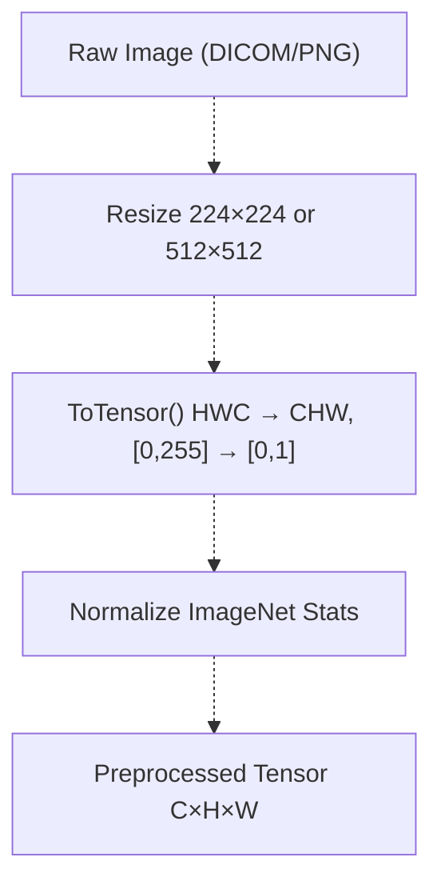
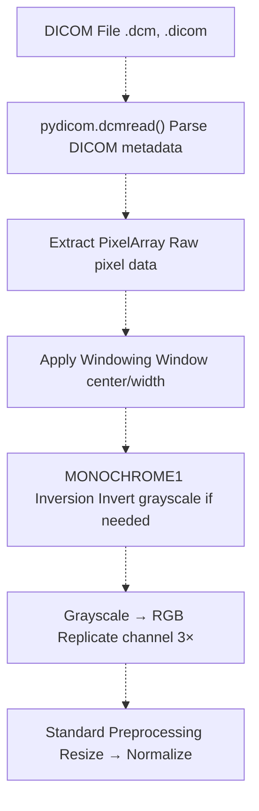
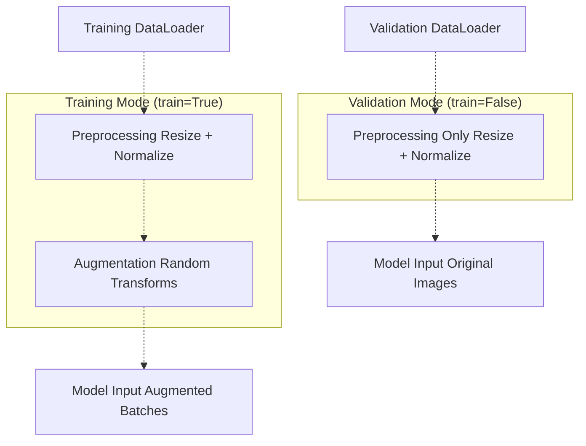
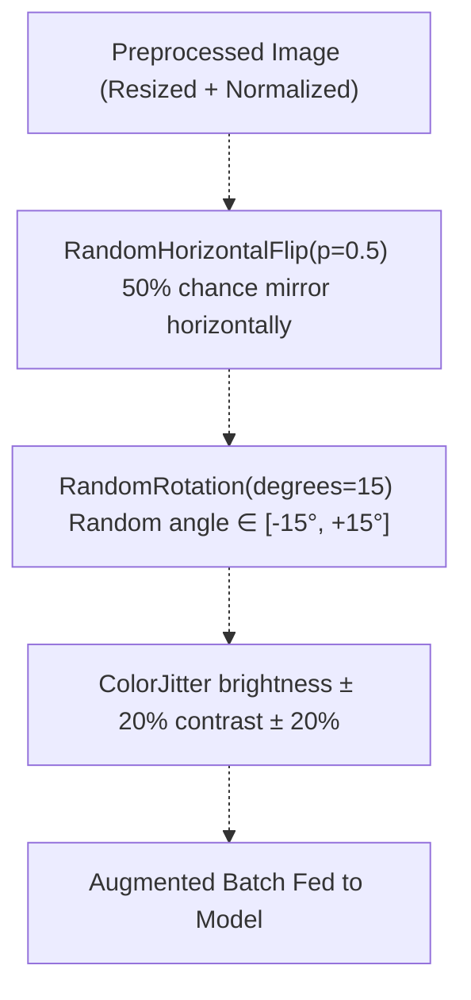
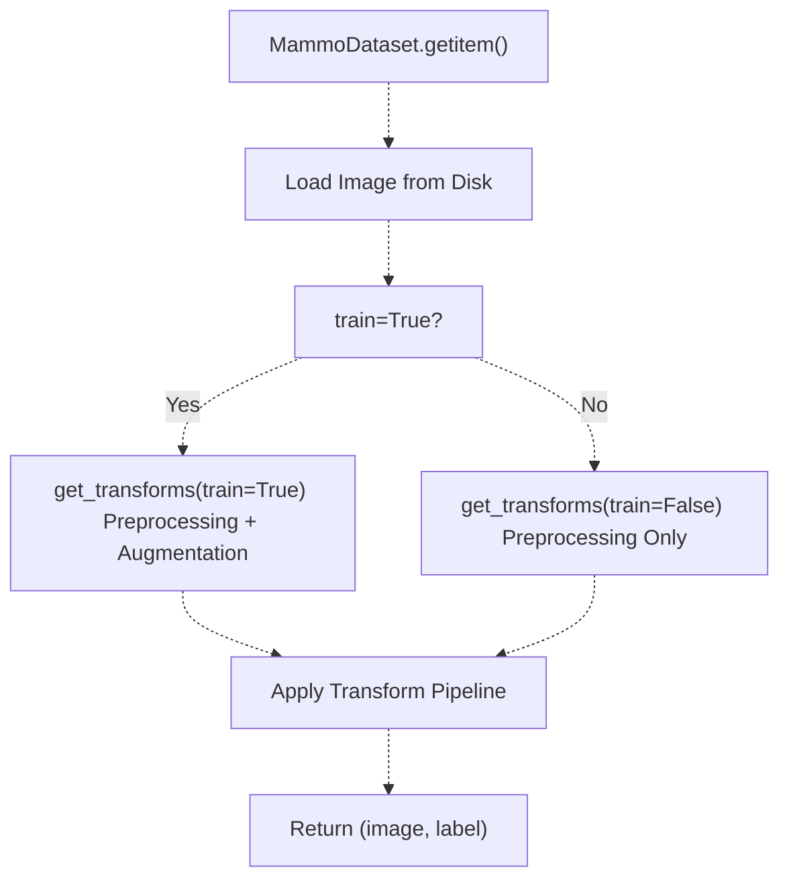
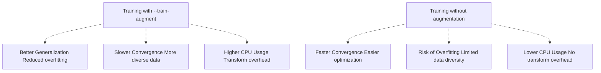
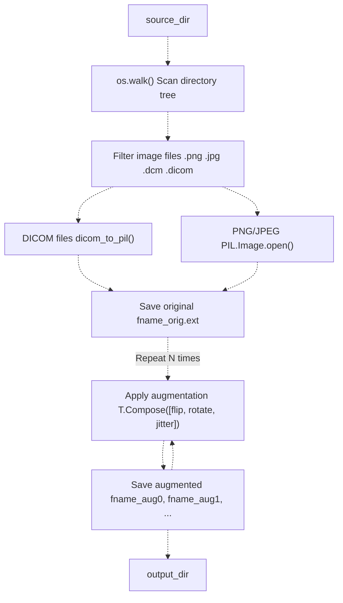

# Preprocessing and Augmentation

> **Relevant source files**
> * [Article/02-density.md](https://github.com/ThalesMMS/mammography-pipelines/blob/01443313/Article/02-density.md)
> * [Article/article.md](https://github.com/ThalesMMS/mammography-pipelines/blob/01443313/Article/article.md)

## Overview

This page documents the **preprocessing and augmentation pipeline** used throughout the mammography classification system. The pipeline applies two categories of transformations:

1. **Preprocessing**: Required transformations applied to all images (training, validation, and inference) to prepare them for model input
2. **Augmentation**: Optional transformations applied only during training to artificially expand the dataset and improve generalization

The system supports both **online augmentation** (applied on-the-fly during training via DataLoader) and **offline augmentation** (pre-generated augmented images saved to disk).

**Related pages:**

* For DICOM-specific image handling, see page 4.1
* For data splitting strategies, see page 4.3
* For class imbalance techniques, see page 4.4
* For training configuration, see page 3.4

## Preprocessing vs. Augmentation

| Category | When Applied | Purpose | Examples |
| --- | --- | --- | --- |
| **Preprocessing** | All images (train/val/test) | Normalize input for model | Resize, normalize, format conversion |
| **Augmentation** | Training only | Increase data diversity | Horizontal flip, rotation, color jitter |

Sources: [Article/article.md L103-L106](https://github.com/ThalesMMS/mammography-pipelines/blob/01443313/Article/article.md#L103-L106)

---

## Preprocessing Pipeline

### Standard Preprocessing Steps

All images undergo the following preprocessing transformations before being fed to the model:



**Preprocessing Pipeline Architecture**

Sources: [Article/article.md L103-L106](https://github.com/ThalesMMS/mammography-pipelines/blob/01443313/Article/article.md#L103-L106)

 [Article/02-density.md L12](https://github.com/ThalesMMS/mammography-pipelines/blob/01443313/Article/02-density.md#L12-L12)

### Resizing

Images are resized to a fixed square dimension to match the input requirements of pretrained models:

| Command | Default Size | Configurable Via |
| --- | --- | --- |
| `mammography embed` | 224×224 | `--img-size` parameter |
| `mammography train-density` | 512×512 | `--img-size` parameter |

**Implementation**: Uses `torchvision.transforms.Resize` with bilinear interpolation to preserve image quality while standardizing dimensions.

**Rationale**:

* 224×224 matches ImageNet pretraining for embedding extraction
* 512×512 provides higher resolution for fine-grained density classification
* Square aspect ratio simplifies batch processing

Sources: [Article/article.md L131](https://github.com/ThalesMMS/mammography-pipelines/blob/01443313/Article/article.md#L131-L131)

 [Article/02-density.md L12](https://github.com/ThalesMMS/mammography-pipelines/blob/01443313/Article/02-density.md#L12-L12)

### Normalization

All images are normalized using **ImageNet statistics** to match the distribution of data used for pretraining:

| Channel | Mean | Standard Deviation |
| --- | --- | --- |
| Red | 0.485 | 0.229 |
| Green | 0.456 | 0.224 |
| Blue | 0.406 | 0.225 |

**Formula**: `normalized_pixel = (pixel - mean) / std`

**Implementation**: `torchvision.transforms.Normalize(mean=[0.485, 0.456, 0.406], std=[0.229, 0.224, 0.225])`

**Rationale**: Transfer learning requires input distributions to match pretraining data. ImageNet normalization is standard for ResNet50 and EfficientNetB0.

Sources: [Article/article.md L105](https://github.com/ThalesMMS/mammography-pipelines/blob/01443313/Article/article.md#L105-L105)

### DICOM-Specific Preprocessing

DICOM medical images require additional preprocessing before standard transformations:



**DICOM Preprocessing Flow**

**Key steps**:

1. **Windowing**: Apply window center/width to optimize contrast for breast tissue
2. **MONOCHROME1 inversion**: Invert pixel values if PhotometricInterpretation is MONOCHROME1 (where 0=white)
3. **Channel replication**: Convert single-channel grayscale to 3-channel RGB by replicating the channel

**Implementation**: Handled by `dicom_to_pil()` utility function referenced in offline augmentation pipeline.

Sources: Related to page 4.1 for DICOM handling details

---

## Training Augmentation (Online)

### Augmentation Overview

During training, images undergo random augmentation transformations **on-the-fly** for each epoch. This creates diverse training samples without requiring additional disk space.

**Activation**: Controlled by the `--train-augment` flag in `mammography train-density` command.



**Training vs. Validation Transform Pipelines**

Sources: [Article/02-density.md L73](https://github.com/ThalesMMS/mammography-pipelines/blob/01443313/Article/02-density.md#L73-L73)

 [Article/article.md L138](https://github.com/ThalesMMS/mammography-pipelines/blob/01443313/Article/article.md#L138-L138)

### Augmentation Techniques

The system applies three primary augmentation transforms, chosen for medical imaging plausibility:

| Transform | Implementation | Parameters | Medical Rationale |
| --- | --- | --- | --- |
| **Horizontal Flip** | `T.RandomHorizontalFlip` | `p=0.5` | Valid for left/right breast symmetry |
| **Rotation** | `T.RandomRotation` | `degrees=15` (±15°) | Accounts for patient positioning variations |
| **Color Jitter** | `T.ColorJitter` | `brightness=0.2``contrast=0.2` | Simulates scanner calibration differences |

**Design Principles**:

* **Anatomically plausible**: All transforms preserve medical validity
* **Conservative parameters**: Small rotation angles and color variations to avoid distorting diagnostic features
* **No vertical flip**: Vertical flipping is not medically meaningful for mammograms
* **No aggressive distortions**: Avoids perspective transforms or elastic deformations that could alter tissue structure

Sources: [Article/article.md L106](https://github.com/ThalesMMS/mammography-pipelines/blob/01443313/Article/article.md#L106-L106)

 [Article/article.md L138](https://github.com/ThalesMMS/mammography-pipelines/blob/01443313/Article/article.md#L138-L138)

### Augmentation Pipeline Architecture



**Sequential Augmentation Transform Application**

**Composition**: Transforms are applied sequentially in a `torchvision.transforms.Compose` pipeline. Each transform is applied with its specified probability or parameter range.

**Randomness**: Different augmentations are generated for each epoch, maximizing training diversity.

Sources: [Article/article.md L138](https://github.com/ThalesMMS/mammography-pipelines/blob/01443313/Article/article.md#L138-L138)

### Implementation Details

The augmentation pipeline is implemented as part of the data loading system:



**DataLoader Transform Selection Logic**

**Key components**:

* Dataset class checks `train` flag to determine which transforms to apply
* Training transforms include augmentation; validation/test transforms do not
* Transforms are applied in `__getitem__()` method for each batch element

Sources: Referenced transform pipeline in training system

---

## Configuration and Usage

### Enabling Augmentation in Training

Augmentation is controlled via command-line flags:

**Enable augmentation:**

```
mammography train-density -- \  --csv classificacao.csv \  --dicom-root archive \  --train-augment \  --epochs 20 --batch-size 16 --img-size 512
```

**Disable augmentation:**

```
mammography train-density -- \  --csv classificacao.csv \  --dicom-root archive \  # No --train-augment flag  --epochs 20 --batch-size 16
```

**Flag behavior**:

* `--train-augment`: Enables horizontal flip, rotation, and color jitter during training
* Without flag: Only preprocessing (resize + normalize) is applied

Sources: [Article/02-density.md L73](https://github.com/ThalesMMS/mammography-pipelines/blob/01443313/Article/02-density.md#L73-L73)

 [Article/02-density.md L8-L14](https://github.com/ThalesMMS/mammography-pipelines/blob/01443313/Article/02-density.md#L8-L14)

### Augmentation Parameters

While augmentation transforms are currently fixed in the codebase, the intensity can be conceptually controlled by:

| Parameter | Default | Effect |
| --- | --- | --- |
| Horizontal flip probability | 50% | Higher = more flipped samples |
| Rotation range | ±15° | Larger range = more diverse angles |
| Brightness/contrast jitter | ±20% | Higher = more color variation |

**Note**: These parameters are hardcoded in the transform pipeline. To modify them, edit the transform composition in the data loading module.

Sources: [Article/article.md L138](https://github.com/ThalesMMS/mammography-pipelines/blob/01443313/Article/article.md#L138-L138)

### Impact on Training

Augmentation affects training behavior and performance:



**Training Behavior with vs. without Augmentation**

**Recommended practice**: Enable augmentation for final training runs. Disable for quick experiments or debugging to accelerate iteration cycles.

Sources: [Article/02-density.md L37-L50](https://github.com/ThalesMMS/mammography-pipelines/blob/01443313/Article/02-density.md#L37-L50)

---

## Offline Augmentation Command

### Overview

The system also provides an **offline augmentation command** for pre-generating augmented datasets. This is primarily useful for debugging transform pipelines and creating shareable augmented datasets.

**Basic usage:**

```
mammography augment \    --source-dir ./archive \    --output-dir ./archive_augmented \    --num-augmentations 5
```

**Use cases**:

1. Debugging augmentation transforms before training
2. Creating pre-augmented datasets for external frameworks
3. Expanding small datasets permanently
4. Sharing augmented data with collaborators

Sources: Referenced in training documentation

### Implementation: augment_dataset

The offline augmentation is implemented in [unified_cli/tasks/augment_task.py L11-L59](https://github.com/ThalesMMS/mammography-pipelines/blob/01443313/unified_cli/tasks/augment_task.py#L11-L59)

:

| Parameter | Type | Description |
| --- | --- | --- |
| `source_dir` | `str` | Path to directory containing source images |
| `output_dir` | `str` | Path where augmented images will be saved |
| `num_augmentations` | `int` | Number of augmented versions per image (default: 1) |

**Workflow:**

1. Recursively scans `source_dir` for image files
2. Applies augmentation pipeline to each image
3. Saves original + N augmented versions with naming convention
4. Supports DICOM (.dcm, .dicom) and standard formats (.png, .jpg, .jpeg)

Sources: [unified_cli/tasks/augment_task.py L11-L59](https://github.com/ThalesMMS/mammography-pipelines/blob/01443313/unified_cli/tasks/augment_task.py#L11-L59)

### Offline Augmentation Pipeline

The offline command follows this workflow:



**Offline Augmentation Workflow**

**File naming convention**: For input `exam_001.dcm` with `num_augmentations=3`:

* `exam_001_orig.png` (original, converted to PNG)
* `exam_001_aug0.png` (first augmentation)
* `exam_001_aug1.png` (second augmentation)
* `exam_001_aug2.png` (third augmentation)

**Transform pipeline**: Uses the same transforms as online augmentation (horizontal flip, rotation, color jitter) defined at [unified_cli/tasks/augment_task.py L22-L27](https://github.com/ThalesMMS/mammography-pipelines/blob/01443313/unified_cli/tasks/augment_task.py#L22-L27)

Sources: [unified_cli/tasks/augment_task.py L11-L59](https://github.com/ThalesMMS/mammography-pipelines/blob/01443313/unified_cli/tasks/augment_task.py#L11-L59)

 [unified_cli/tasks/augment_task.py L22-L27](https://github.com/ThalesMMS/mammography-pipelines/blob/01443313/unified_cli/tasks/augment_task.py#L22-L27)

 [unified_cli/tasks/augment_task.py L46-L54](https://github.com/ThalesMMS/mammography-pipelines/blob/01443313/unified_cli/tasks/augment_task.py#L46-L54)

### Offline vs. Online Augmentation Comparison

| Aspect | Online Augmentation (Recommended) | Offline Augmentation |
| --- | --- | --- |
| **Timing** | During training (on-the-fly) | Pre-training (pre-generated) |
| **Storage** | No additional disk space | Requires N× disk space |
| **Diversity** | Different each epoch | Fixed augmentations |
| **Performance** | CPU overhead per batch | I/O overhead during loading |
| **Use Case** | Production training | Debugging, sharing datasets |
| **Activation** | `--train-augment` flag | `mammography augment` command |

**Recommended practice**: Use online augmentation for training. Use offline augmentation only for debugging transforms or creating shareable augmented datasets.

Sources: Referenced in training system documentation

---

## Best Practices and Considerations

### Medical Imaging Constraints

When designing augmentation strategies for mammography, consider:

**Anatomical validity**:

* ✓ Horizontal flips are valid (left/right breast symmetry)
* ✗ Vertical flips are not medically meaningful
* ✓ Small rotations (±15°) account for positioning variation
* ✗ Large rotations or perspective distortions alter anatomy

**Diagnostic feature preservation**:

* Keep augmentation parameters conservative to avoid distorting clinically relevant features
* Brightness/contrast jitter should simulate scanner variations, not create unrealistic images
* Avoid transforms that could mask or create artificial calcifications or masses

Sources: [Article/article.md L138](https://github.com/ThalesMMS/mammography-pipelines/blob/01443313/Article/article.md#L138-L138)

### Performance Considerations

**CPU overhead**: Online augmentation adds computational cost during training:

* Horizontal flip: ~5ms per image
* Rotation: ~10-15ms per image
* Color jitter: ~5ms per image
* **Total**: ~20-25ms per image

**Mitigation strategies**:

1. Use `--num-workers > 0` in DataLoader for parallel preprocessing
2. Use `--prefetch-factor` to queue batches ahead of time
3. Enable `--persistent-workers` to avoid worker respawn overhead
4. Consider `--cache-mode disk` for repeated dataset passes

Sources: [Article/02-density.md L72-L73](https://github.com/ThalesMMS/mammography-pipelines/blob/01443313/Article/02-density.md#L72-L73)

### Debugging Augmentation

To verify augmentation behaves correctly:

**Method 1: Offline augmentation**

```
# Generate augmented samples for visual inspectionmammography augment \  --source-dir ./sample_images \  --output-dir ./augmented_preview \  --num-augmentations 5
```

**Method 2: Save training batch samples**

* Modify training loop to save first batch images to disk
* Verify transforms are applied correctly before full training run

**Method 3: Validation metrics**

* Monitor training vs. validation loss gap
* Large gap indicates augmentation is too aggressive or ineffective

Sources: Referenced in training documentation

### Extending the Transform Pipeline

To add custom augmentation transforms, modify the transform composition in the data loading code:

**Current transforms** (as referenced in training):

```
# Example transform composition (conceptual)train_transforms = T.Compose([    T.Resize((img_size, img_size)),    T.ToTensor(),    T.Normalize(mean=[0.485, 0.456, 0.406], std=[0.229, 0.224, 0.225]),    T.RandomHorizontalFlip(p=0.5),    T.RandomRotation(degrees=15),    T.ColorJitter(brightness=0.2, contrast=0.2),])
```

**Potential extensions** (with medical imaging considerations):

* `T.RandomAffine(degrees=0, translate=(0.05, 0.05))`: Small translations
* `T.GaussianBlur(kernel_size=3, sigma=(0.1, 1.0))`: Slight blur for noise robustness
* `T.RandomErasing(p=0.1, scale=(0.02, 0.05))`: Simulates artifacts or occlusions

**Warning**: Always validate new transforms on held-out data to ensure they don't degrade model performance or create medically implausible images.

Sources: Referenced transform implementations in training pipeline

---

## Summary

The `augment` command provides a **simple, standalone pipeline** for offline data augmentation:

**Key features:**

* Supports DICOM and standard image formats
* Applies medically plausible transforms (flip, rotation, color jitter)
* Saves original + N augmented versions with clear naming
* Robust error handling for large directories
* Useful for debugging, dataset expansion, and sharing

**Primary use cases:**

* Debugging augmentation before training
* Expanding small datasets
* Generating training data for external frameworks

**Limitations:**

* Fixed augmentations (no per-epoch randomness)
* No parallelization (sequential processing)
* Requires significant disk space for large datasets

For production training, **online augmentation** (see [Training Models](2a%20mammography-embed.md)) is recommended for maximum diversity and storage efficiency.

Sources: [unified_cli/tasks/augment_task.py L11-L59](https://github.com/ThalesMMS/mammography-pipelines/blob/01443313/unified_cli/tasks/augment_task.py#L11-L59)

 **Sources**: [Project overview and setup](https://github.com/ThalesMMS/mammography-pipelines/blob/01443313/README.md#L128-L137)


### On this page

* [Preprocessing and Augmentation](#4.2-preprocessing-and-augmentation)
* [Overview](#4.2-overview)
* [Preprocessing vs. Augmentation](#4.2-preprocessing-vs-augmentation)
* [Preprocessing Pipeline](#4.2-preprocessing-pipeline)
* [Standard Preprocessing Steps](#4.2-standard-preprocessing-steps)
* [Resizing](#4.2-resizing)
* [Normalization](#4.2-normalization)
* [DICOM-Specific Preprocessing](#4.2-dicom-specific-preprocessing)
* [Training Augmentation (Online)](#4.2-training-augmentation-online)
* [Augmentation Overview](#4.2-augmentation-overview)
* [Augmentation Techniques](#4.2-augmentation-techniques)
* [Augmentation Pipeline Architecture](#4.2-augmentation-pipeline-architecture)
* [Implementation Details](#4.2-implementation-details)
* [Configuration and Usage](#4.2-configuration-and-usage)
* [Enabling Augmentation in Training](#4.2-enabling-augmentation-in-training)
* [Augmentation Parameters](#4.2-augmentation-parameters)
* [Impact on Training](#4.2-impact-on-training)
* [Offline Augmentation Command](#4.2-offline-augmentation-command)
* [Overview](#4.2-overview-1)
* [Implementation: augment_dataset](#4.2-implementation-object-object)
* [Offline Augmentation Pipeline](#4.2-offline-augmentation-pipeline)
* [Offline vs. Online Augmentation Comparison](#4.2-offline-vs-online-augmentation-comparison)
* [Best Practices and Considerations](#4.2-best-practices-and-considerations)
* [Medical Imaging Constraints](#4.2-medical-imaging-constraints)
* [Performance Considerations](#4.2-performance-considerations)
* [Debugging Augmentation](#4.2-debugging-augmentation)
* [Extending the Transform Pipeline](#4.2-extending-the-transform-pipeline)
* [Summary](#4.2-summary)

Ask Devin about mammography-pipelines