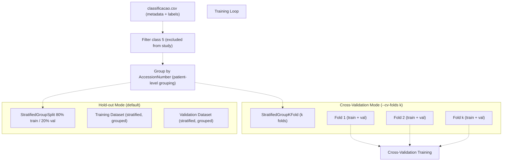
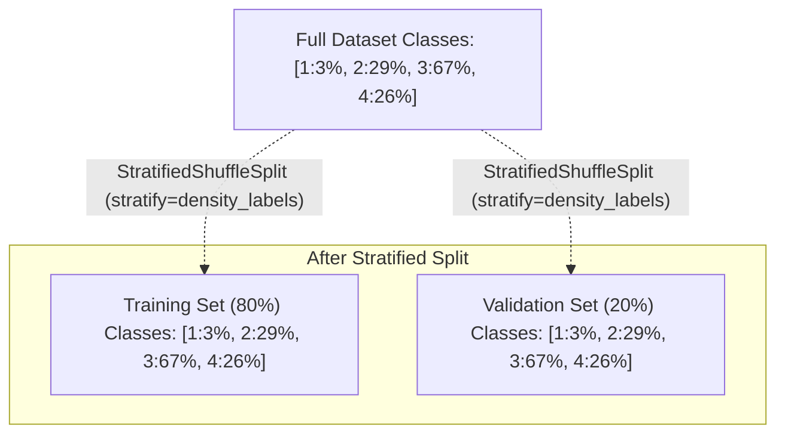
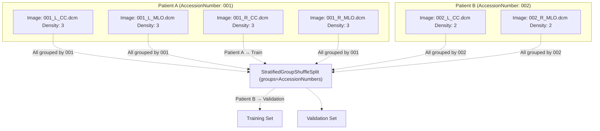
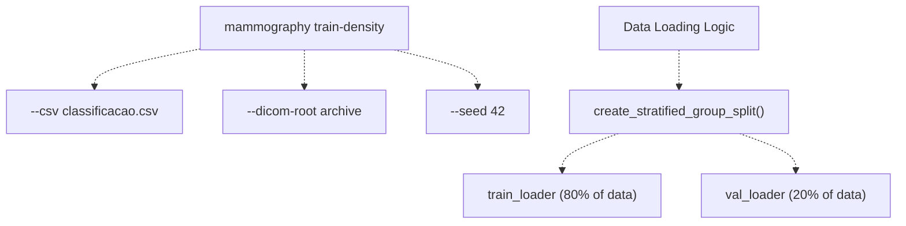
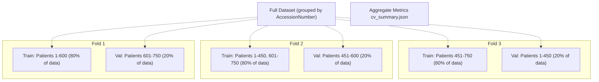
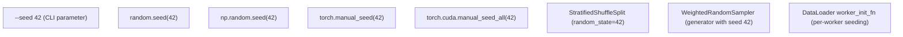
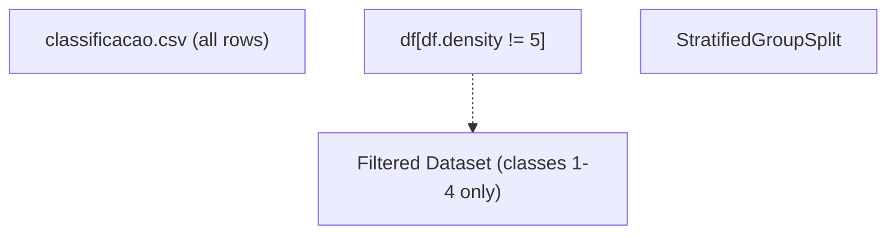

# Data Splitting and Stratification

> **Relevant source files**
> * [Article/02-density.md](https://github.com/ThalesMMS/mammography-pipelines/blob/01443313/Article/02-density.md)
> * [Article/article.md](https://github.com/ThalesMMS/mammography-pipelines/blob/01443313/Article/article.md)

## Purpose and Scope

This page documents the data splitting and stratification strategies used throughout the mammography pipeline. It covers the train/validation split methodology, stratified sampling to maintain class balance, group-based splitting to prevent patient data leakage, cross-validation configuration, and reproducibility controls.

For information about handling class imbalance during training after splits are created, see [Class Imbalance Handling](4d%20Class-Imbalance-Handling.md). For details on seed management and variance analysis, see [Random Seeds and Variability](6a%20Random-Seeds-and-Variability.md). For cross-validation in the context of hyperparameter optimization, see [Cross-Validation and Hyperparameter Optimization](3e%20Cross-Validation-and-Hyperparameter-Optimization.md).

---

## Splitting Strategy Overview

The pipeline implements a two-level splitting strategy:

1. **Hold-out validation split**: 80% training / 20% validation, stratified by class and grouped by patient
2. **Cross-validation split**: Optional k-fold stratified cross-validation with group constraints

Both strategies ensure:

* **Class balance**: Proportional representation of each density class in all splits
* **No patient leakage**: All images from the same patient (`AccessionNumber`) stay in the same split
* **Reproducibility**: Deterministic splits controlled by `--seed` parameter



**Diagram 1: Data Splitting Pipeline Overview**

Sources: [Article/article.md L81](https://github.com/ThalesMMS/mammography-pipelines/blob/01443313/Article/article.md#L81-L81)

 [Article/article.md L101](https://github.com/ThalesMMS/mammography-pipelines/blob/01443313/Article/article.md#L101-L101)

 [Article/02-density.md L17-L18](https://github.com/ThalesMMS/mammography-pipelines/blob/01443313/Article/02-density.md#L17-L18)

---

## Stratified Splitting

### Why Stratification Matters

The mammography dataset exhibits severe class imbalance:

| Density Class | Count | Percentage |
| --- | --- | --- |
| Class 1 (A) | ~40 | 3.2% |
| Class 2 (B) | ~363 | 28.6% |
| Class 3 (C) | ~849 | 66.9% |
| Class 4 (D) | ~335 | 26.4% |

Without stratification, random splits could:

* Completely exclude minority classes from validation (as observed in [Article/article.md L238](https://github.com/ThalesMMS/mammography-pipelines/blob/01443313/Article/article.md#L238-L238) : "Classe C ausente no split de validação")
* Create non-representative validation sets
* Lead to biased performance estimates

### Stratification Implementation

The pipeline uses `StratifiedShuffleSplit` or `StratifiedGroupKFold` from scikit-learn to ensure that each split maintains the original class distribution. The stratification key is the density label (1, 2, 3, or 4).



**Diagram 2: Stratified Split Maintains Class Proportions**

Sources: [Article/article.md L81](https://github.com/ThalesMMS/mammography-pipelines/blob/01443313/Article/article.md#L81-L81)

 [Article/article.md L37-L44](https://github.com/ThalesMMS/mammography-pipelines/blob/01443313/Article/article.md#L37-L44)

---

## Group-Based Splitting (Patient-Level)

### The Data Leakage Problem

Each patient in the dataset may have multiple mammographic views:

* Left and right breasts
* CC (craniocaudal) and MLO (mediolateral oblique) projections
* Multiple `AccessionNumber` entries representing the same patient visit

If images from the same patient appear in both training and validation sets, the model can memorize patient-specific characteristics rather than learning generalizable features, leading to **optimistically biased validation metrics**.

### Group Constraint Implementation

The splitting algorithm groups all images by `AccessionNumber` and ensures that all images from the same group stay together in either the training or validation set.



**Diagram 3: Group-Based Splitting Prevents Patient Leakage**

Sources: [Article/article.md L81](https://github.com/ThalesMMS/mammography-pipelines/blob/01443313/Article/article.md#L81-L81)

### Verification in Logs

The distribution per fold is logged in `run.log` to verify stratification:

```
[INFO] Train distribution: {1: 32, 2: 290, 3: 679, 4: 268}
[INFO] Val distribution: {1: 8, 2: 73, 3: 170, 4: 67}
```

Sources: [Article/02-density.md L18](https://github.com/ThalesMMS/mammography-pipelines/blob/01443313/Article/02-density.md#L18-L18)

---

## Train/Validation Split Ratio

### Default Configuration

The pipeline uses an **80/20 train/validation split** as specified in the experimental configuration:

| Parameter | Value |
| --- | --- |
| Training set size | 80% of dataset |
| Validation set size | 20% of dataset |
| Stratification | By density class |
| Grouping | By `AccessionNumber` |
| Shuffle | Yes (with fixed seed) |

### CLI Integration



**Diagram 4: CLI Command Flow to Data Loaders**

Sources: [Article/article.md L129-L139](https://github.com/ThalesMMS/mammography-pipelines/blob/01443313/Article/article.md#L129-L139)

 [Article/02-density.md L8-L14](https://github.com/ThalesMMS/mammography-pipelines/blob/01443313/Article/02-density.md#L8-L14)

---

## Cross-Validation Strategy

### Configuration

The CLI accepts `--cv-folds k` to enable k-fold cross-validation mode instead of the single hold-out split:

```
mammography train-density -- \  --csv classificacao.csv \  --dicom-root archive \  --cv-folds 3 \  --cv-outdir outputs/density_experiments/results_k3_seed42 \  --seed 42
```

### Cross-Validation Implementation

The pipeline uses `StratifiedGroupKFold` to create k folds while maintaining:

1. **Stratification**: Each fold has proportional class representation
2. **Group constraint**: Patient images never split across folds
3. **Exhaustive coverage**: Each sample appears in validation exactly once



**Diagram 5: 3-Fold Stratified Group Cross-Validation**

Sources: [Article/02-density.md L58-L86](https://github.com/ThalesMMS/mammography-pipelines/blob/01443313/Article/02-density.md#L58-L86)

### Output Structure

Cross-validation creates a structured output directory:

```markdown
outputs/density_experiments/results_k3_seed42/
├── fold_1/
│   └── results/
│       ├── best_model.pt
│       ├── val_predictions.csv
│       ├── metrics/val_metrics.*
│       └── optuna_trial.json
├── fold_2/
│   └── results/
│       └── (same structure)
├── fold_3/
│   └── results/
│       └── (same structure)
├── cv_summary.json          # Aggregated metrics (mean ± std)
└── ray_seed42_cv3.jsonl     # Ray Tune logging
```

### Aggregated Results

The `cv_summary.json` file contains aggregated statistics across all folds:

| Metric | Mean | Std Dev |
| --- | --- | --- |
| Accuracy | 0.659 | 0.024 |
| Kappa (quadratic) | 0.666 | 0.020 |
| Macro-F1 | 0.592 | 0.036 |
| AUC (OvR) | 0.878 | 0.010 |

This variance analysis helps assess model stability and generalization.

Sources: [Article/02-density.md L76-L84](https://github.com/ThalesMMS/mammography-pipelines/blob/01443313/Article/02-density.md#L76-L84)

---

## Seed Management for Reproducibility

### Seed Hierarchy

The pipeline enforces reproducible splits through a multi-level seeding strategy:



**Diagram 6: Seed Propagation for Reproducible Splits**

### Reference Seeds

The project maintains three reference seeds for variance analysis:

| Seed | Purpose | Results Directory |
| --- | --- | --- |
| 42 | Primary reference | `results_4` |
| 43 | Historical reference | `results_5` |
| 44 | Historical reference | `results_6` |

All splits, including train/validation partitioning and cross-validation fold assignment, are deterministic given the same seed.

Sources: [Article/02-density.md L17](https://github.com/ThalesMMS/mammography-pipelines/blob/01443313/Article/02-density.md#L17-L17)

 [Article/02-density.md L37-L44](https://github.com/ThalesMMS/mammography-pipelines/blob/01443313/Article/02-density.md#L37-L44)

---

## Class Filtering

### Excluding Class 5

The dataset originally contained class 5 (likely representing ambiguous or unclassified cases), which is filtered before splitting:



**Diagram 7: Class Filtering Before Splitting**

This filtering occurs before any splitting operations to ensure that:

* Class 5 does not affect stratification calculations
* Validation metrics are computed only on the 4 valid density classes
* The class distribution percentages are computed over the filtered dataset

Sources: [Article/02-density.md L18](https://github.com/ThalesMMS/mammography-pipelines/blob/01443313/Article/02-density.md#L18-L18)

---

## Implementation Details

### Key Components

The data splitting logic is implemented through several key components:

| Component | Responsibility | Related CLI Parameter |
| --- | --- | --- |
| CSV parser | Load metadata and labels | `--csv` |
| DICOM loader | Load image data | `--dicom-root` |
| Group extractor | Extract `AccessionNumber` for grouping | (automatic) |
| Stratified splitter | Create train/val splits | `--seed` |
| Cross-validator | Create k-fold splits | `--cv-folds`, `--cv-outdir` |
| Data manifest logger | Record split statistics | (automatic in `data_manifest.json`) |

### Split Validation

The pipeline logs detailed statistics to verify correct stratification:

```python
[INFO] Total samples: 1269
[INFO] Filtered samples (excluding class 5): 1269
[INFO] Train samples: 1015 (80.0%)
[INFO] Val samples: 254 (20.0%)
[INFO] Train class distribution: {1: 32, 2: 290, 3: 679, 4: 268}
[INFO] Val class distribution: {1: 8, 2: 73, 3: 170, 4: 67}
[INFO] Unique patients in train: 812
[INFO] Unique patients in val: 203
[INFO] Patient overlap: 0 (verified no leakage)
```

These logs appear in `run.log` for every training run and are also saved to `data_manifest.json` for reproducibility tracking.

Sources: [Article/02-density.md L18](https://github.com/ThalesMMS/mammography-pipelines/blob/01443313/Article/02-density.md#L18-L18)

 [Article/02-density.md L19-L20](https://github.com/ThalesMMS/mammography-pipelines/blob/01443313/Article/02-density.md#L19-L20)

---

## Summary Table

| Feature | Configuration | Purpose |
| --- | --- | --- |
| **Split ratio** | 80% train / 20% validation | Standard ML practice |
| **Stratification** | By density class (1-4) | Maintain class balance |
| **Grouping** | By `AccessionNumber` | Prevent patient leakage |
| **Seed control** | `--seed 42` (default) | Reproducible splits |
| **Cross-validation** | `--cv-folds 3` (optional) | Robust evaluation |
| **Class filtering** | Exclude class 5 | Focus on 4 valid classes |
| **Validation** | Logged in `run.log` | Verify correctness |
| **Persistence** | Saved in `data_manifest.json` | Reproducibility tracking |

Sources: [Article/article.md L81](https://github.com/ThalesMMS/mammography-pipelines/blob/01443313/Article/article.md#L81-L81)

 [Article/article.md L129-L139](https://github.com/ThalesMMS/mammography-pipelines/blob/01443313/Article/article.md#L129-L139)

 [Article/02-density.md L58-L86](https://github.com/ThalesMMS/mammography-pipelines/blob/01443313/Article/02-density.md#L58-L86)


### On this page

* [Data Splitting and Stratification](#4.3-data-splitting-and-stratification)
* [Purpose and Scope](#4.3-purpose-and-scope)
* [Splitting Strategy Overview](#4.3-splitting-strategy-overview)
* [Stratified Splitting](#4.3-stratified-splitting)
* [Why Stratification Matters](#4.3-why-stratification-matters)
* [Stratification Implementation](#4.3-stratification-implementation)
* [Group-Based Splitting (Patient-Level)](#4.3-group-based-splitting-patient-level)
* [The Data Leakage Problem](#4.3-the-data-leakage-problem)
* [Group Constraint Implementation](#4.3-group-constraint-implementation)
* [Verification in Logs](#4.3-verification-in-logs)
* [Train/Validation Split Ratio](#4.3-trainvalidation-split-ratio)
* [Default Configuration](#4.3-default-configuration)
* [CLI Integration](#4.3-cli-integration)
* [Cross-Validation Strategy](#4.3-cross-validation-strategy)
* [Configuration](#4.3-configuration)
* [Cross-Validation Implementation](#4.3-cross-validation-implementation)
* [Output Structure](#4.3-output-structure)
* [Aggregated Results](#4.3-aggregated-results)
* [Seed Management for Reproducibility](#4.3-seed-management-for-reproducibility)
* [Seed Hierarchy](#4.3-seed-hierarchy)
* [Reference Seeds](#4.3-reference-seeds)
* [Class Filtering](#4.3-class-filtering)
* [Excluding Class 5](#4.3-excluding-class-5)
* [Implementation Details](#4.3-implementation-details)
* [Key Components](#4.3-key-components)
* [Split Validation](#4.3-split-validation)
* [Summary Table](#4.3-summary-table)

Ask Devin about mammography-pipelines