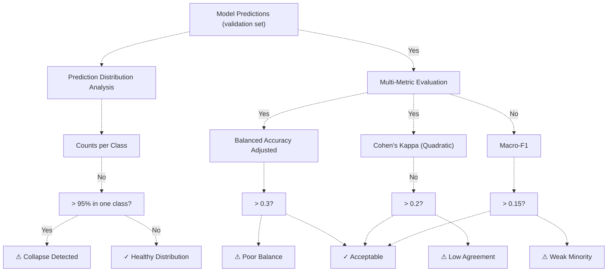
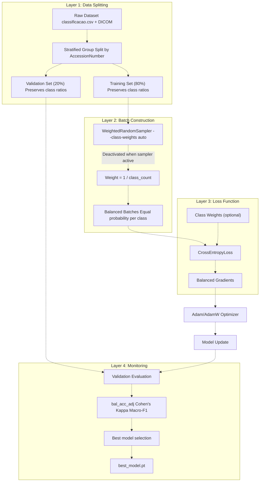
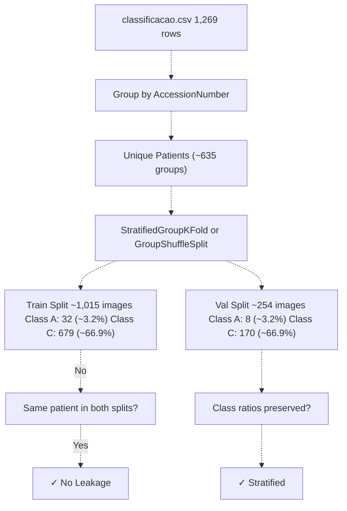
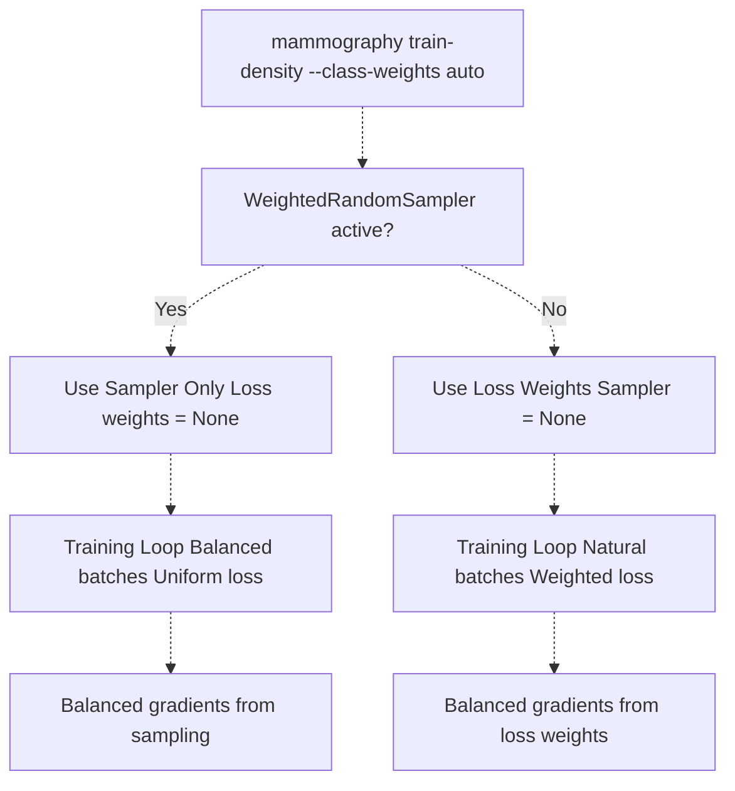
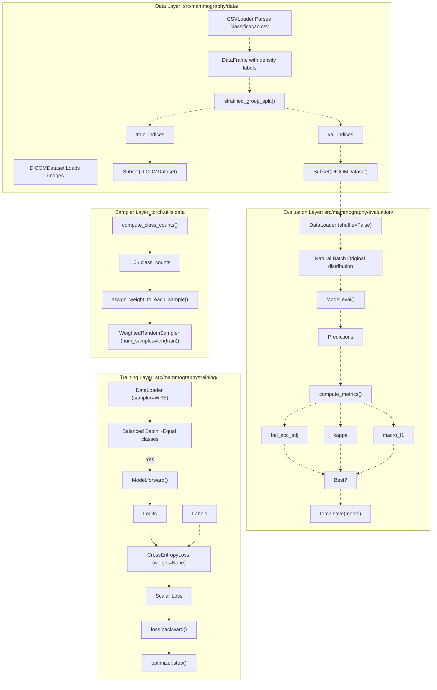

# Class Imbalance Handling

> **Relevant source files**
> * [Article/02-density.md](https://github.com/ThalesMMS/mammography-pipelines/blob/01443313/Article/02-density.md)
> * [Article/article.md](https://github.com/ThalesMMS/mammography-pipelines/blob/01443313/Article/article.md)

## Purpose and Scope

This document describes the techniques used to handle severe class imbalance in the breast density classification datasets, particularly the IRMA dataset where class A represents only 3.2% of samples while class C comprises 66.9%. Class imbalance can cause models to collapse to predicting only the majority class, achieving high accuracy while being clinically useless.

This page covers the multi-layered mitigation strategy including stratified splitting, weighted sampling, class-weighted loss functions, and robust metrics for early detection of model collapse. For details on the datasets themselves, see [DICOM Datasets](4a%20DICOM-Datasets.md). For information on the metrics used to detect collapse, see [Performance Metrics](5a%20Performance-Metrics.md). For the model collapse deep dive and prevention strategies, see [Model Collapse Prevention](7%20Model-Collapse-Prevention.md).

Sources: Article/article.md:79-91, Article/02-density.md:1-56

---

## The Class Imbalance Problem

### Dataset Distributions

The IRMA dataset exhibits extreme class imbalance in its BI-RADS density distribution:

| Density Class | Count | Percentage | Clinical Significance |
| --- | --- | --- | --- |
| A (Almost entirely fatty) | 40 | 3.2% | Minority class - severe underrepresentation |
| B (Scattered fibroglandular) | 363 | 28.6% | Moderate representation |
| C (Heterogeneously dense) | 849 | 66.9% | Majority class - dominates training |
| D (Extremely dense) | 335 | 26.4% | Well represented |

**Imbalance Ratio**: The ratio between the most common class (C) and least common class (A) is approximately **21:1**, creating significant challenges for standard deep learning training procedures.

### Impact on Model Training

Without intervention, neural networks trained on imbalanced data exhibit several pathological behaviors:

1. **Majority Class Bias**: Models learn to predict the majority class (C) for nearly all inputs, achieving ~67% accuracy by effectively ignoring other classes.
2. **Gradient Domination**: The loss gradients from the 849 class C samples overwhelm the gradients from the 40 class A samples, preventing the network from learning discriminative features for minority classes.
3. **Confidence Calibration Issues**: The model produces high confidence scores for majority class predictions even when incorrect.
4. **Clinical Inutility**: A classifier that always predicts class C would be worthless for clinical decision-making, as it fails to identify high-risk (class D) and low-risk (class A) cases.

Sources: Article/article.md:38-43, Article/article.md:79-91

---

## Model Collapse Phenomenon

### Definition and Symptoms

**Model collapse** occurs when a classifier trained on imbalanced data converges to a degenerate solution where it predicts only one or two classes regardless of input, effectively ignoring minority classes entirely.

### Documented Example: resnet_frozen_run1

The repository contains a documented instance of complete model collapse:

| Metric | Value | Interpretation |
| --- | --- | --- |
| Accuracy | 1.57% | Far below random chance (25%) |
| Cohen's Kappa | 0.000 | No agreement beyond chance |
| AUC | 0.595 | Barely above random (0.5) |
| Prediction Distribution | 100% → Class A | All predictions collapsed to single class |

This run used an incorrect configuration with full backbone fine-tuning on highly imbalanced data, causing rapid overfitting where the network learned to always output class A.

### Detection Mechanisms

The system employs multiple metrics to detect collapse early:



**Detection Workflow:**

1. After each validation epoch, the system computes prediction distribution across classes
2. If >95% of predictions fall into a single class, collapse is flagged immediately
3. Balanced accuracy adjusted and Cohen's Kappa provide chance-corrected performance indicators
4. Macro-F1 ensures all classes contribute equally to the metric, making it sensitive to minority class failure

Sources: Article/article.md:293-310, Article/article.md:156-165

---

## Mitigation Strategies

The system implements a three-layered defense against class imbalance:



Sources: Article/article.md:79-91, Article/02-density.md:6-14

### Strategy 1: Stratified Group Splitting

**Purpose**: Ensure both training and validation sets maintain the original class distribution while preventing data leakage from the same patient appearing in both sets.

**Implementation**: The splitting logic groups samples by `AccessionNumber` (patient identifier) before performing stratified splitting. This ensures:

* Class proportions are preserved: if class A is 3.2% in the full dataset, it remains ~3.2% in both splits
* No patient leakage: all images from the same patient stay in the same split
* Reproducibility: controlled by `--seed` parameter

**Key Parameter**: The default 80/20 train/validation split is used consistently across experiments.



Sources: Article/article.md:81, Article/02-density.md:17-18

### Strategy 2: WeightedRandomSampler

**Purpose**: Oversample minority classes during batch construction so each class has equal probability of being selected, preventing the majority class from dominating training.

**Activation**: Enabled by passing `--class-weights auto` to the `mammography train-density` command.

**Weight Calculation**:

```
weight_for_class_i = 1.0 / count_of_class_i
```

For IRMA dataset:

* Class A (40 samples): weight = 1/40 = 0.025
* Class B (363 samples): weight = 1/363 = 0.00275
* Class C (849 samples): weight = 1/849 = 0.00118
* Class D (335 samples): weight = 1/335 = 0.00299

These weights are normalized and assigned to each sample. During training, samples are drawn with probability proportional to their weight, effectively equalizing the expected number of samples per class in each epoch.

**Effect on Training**:

| Without Sampler | With WeightedRandomSampler |
| --- | --- |
| Epoch sees: ~40 class A samples | Epoch sees: ~200 class A samples (resampled) |
| Epoch sees: ~849 class C samples | Epoch sees: ~200 class C samples (undersampled) |
| Gradients dominated by class C | Gradients balanced across classes |

Sources: Article/article.md:83, Article/02-density.md:13

### Strategy 3: Class Weights in Loss Function

**Purpose**: Apply weights directly in the `CrossEntropyLoss` function to scale the contribution of each class to the total loss.

**Implementation**: The loss for a sample from class *i* is multiplied by `weight_i`, making misclassifications of minority classes more costly.

**Critical Interaction**: The system automatically **disables class weights in the loss function** when `WeightedRandomSampler` is active to avoid double-balancing, which can cause numerical instability and overcorrection toward minority classes.



**Design Rationale**: Using both mechanisms simultaneously would apply balancing twice:

1. Sampler ensures class A appears 5x more often → gradient multiplied by ~5
2. Loss weight for class A → gradient multiplied by another ~21x
3. **Net effect**: class A gradients 100x larger than class C, causing instability

Sources: Article/article.md:83-86

### Strategy 4: Robust Metrics for Monitoring

**Purpose**: Use metrics that are sensitive to minority class performance and resistant to being inflated by majority class predictions.

The system computes and logs multiple metrics simultaneously:

| Metric | Formula | Sensitivity to Imbalance | Use Case |
| --- | --- | --- | --- |
| **Accuracy** | Correct / Total | Low - inflated by majority | Quick sanity check |
| **Balanced Accuracy Adjusted** | (BA - 1/K) / (1 - 1/K) | High - chance corrected | **Primary checkpoint criterion** |
| **Cohen's Kappa (Quadratic)** | Agreement beyond chance | High - penalizes systematic errors | **Secondary checkpoint criterion** |
| **Macro-F1** | Unweighted average of per-class F1 | Very high - all classes equal weight | Minority class health indicator |
| **AUC (One-vs-Rest)** | Average of class-wise ROC AUCs | High - separability measure | **Tertiary checkpoint criterion** |

**Checkpoint Selection Priority**:

```
best_model = max(
    runs,
    key=lambda r: (r.bal_acc_adj, r.kappa, r.auc)
)
```

This hierarchical selection ensures models with better minority class performance are preferred even if they sacrifice some overall accuracy.

Sources: Article/article.md:87-91, Article/02-density.md:39-44

---

## Implementation Details

### CLI Configuration

The `mammography train-density` command exposes several parameters for class imbalance control:

```
mammography train-density -- \  --csv classificacao.csv \  --dicom-root archive \  --outdir outputs/mammo_efficientnetb0_density \  --epochs 20 \  --batch-size 16 \  --img-size 512 \  --class-weights auto \          # Enables WeightedRandomSampler  --warmup-epochs 2 \              # Gradual unfreezing to stabilize  --unfreeze-last-block            # Prevents overfitting on imbalanced data
```

| Parameter | Effect on Imbalance Handling |
| --- | --- |
| `--class-weights auto` | Activates `WeightedRandomSampler` with automatic weight calculation |
| `--class-weights [w1,w2,w3,w4]` | Manually specified weights (overrides auto) |
| `--warmup-epochs N` | Trains only classification head for N epochs before unfreezing backbone - stabilizes learning on imbalanced data |
| `--unfreeze-last-block` | Enables fine-tuning of last backbone block - balances capacity vs overfitting |
| `--no-train-backbone` | Freezes entire backbone - maximum regularization for small minority classes |

Sources: Article/02-density.md:6-14

### Code Architecture



Sources: Article/02-density.md:60-75, Article/article.md:94-125

### Stratified Splitting Implementation

The splitting strategy must handle three constraints simultaneously:

1. Maintain class proportions
2. Group by patient (AccessionNumber)
3. Support reproducible random splits

**Key Functions**:

* Data grouping by `AccessionNumber`
* Stratification by `density` label
* K-fold cross-validation support via `--cv-folds`

**Validation**:

```
# Pseudo-code for verification logged in run.logtrain_dist = compute_class_distribution(train_indices)val_dist = compute_class_distribution(val_indices)assert_close(train_dist['A'] / len(train_indices),              val_dist['A'] / len(val_indices),              rtol=0.05)  # Within 5%
```

The logs in `run.log` files record the actual distribution achieved for auditing purposes.

Sources: Article/02-density.md:18, Article/article.md:81

### Sampler Weight Assignment

**Per-Sample Weight Calculation**:

```sql
# Conceptual implementationclass_counts = {    'A': 40, 'B': 363, 'C': 849, 'D': 335}# Inverse frequency weightsclass_weights = {    cls: 1.0 / count     for cls, count in class_counts.items()}# Assign to each samplesample_weights = [    class_weights[sample.label]     for sample in train_dataset]# Create samplersampler = WeightedRandomSampler(    weights=sample_weights,    num_samples=len(train_dataset),    replacement=True  # Allow resampling)
```

**Effect on Epoch Composition**:

* Original: 1 epoch = 40 A + 363 B + 849 C + 335 D = 1,587 samples
* With Sampler: 1 epoch = ~200 A + ~200 B + ~200 C + ~200 D = ~800 effective unique samples + resampling

The sampler ensures that even though class A has only 40 physical samples, it will appear ~200 times per epoch through resampling.

Sources: Article/article.md:83

### Loss Function Configuration

**Decision Logic**:

```
# Pseudo-code from training setupif args.class_weights == 'auto':    # Compute weights for sampler    sampler_weights = compute_class_weights(train_labels)    sampler = WeightedRandomSampler(sampler_weights, ...)        # Disable loss weights to avoid double-balancing    loss_fn = nn.CrossEntropyLoss(weight=None)    elif args.class_weights:    # Use explicit weights in loss, no sampler    loss_weights = torch.tensor(args.class_weights)    loss_fn = nn.CrossEntropyLoss(weight=loss_weights)    sampler = None    else:    # Natural training (for well-balanced datasets)    loss_fn = nn.CrossEntropyLoss(weight=None)    sampler = None
```

**Interaction Matrix**:

| Sampler Active | Loss Weights | Result | Use Case |
| --- | --- | --- | --- |
| Yes | None | ✓ Balanced training | **Default for IRMA** |
| No | [w1,w2,w3,w4] | ✓ Balanced training | Alternative approach |
| Yes | [w1,w2,w3,w4] | ✗ Double-balancing | **Avoided automatically** |
| No | None | ✗ Imbalanced training | Only for balanced datasets |

Sources: Article/article.md:83-86

---

## Results and Effectiveness

### Comparative Performance

The impact of class imbalance handling is demonstrated by comparing runs with and without mitigation:

| Configuration | Acc | Kappa | Macro-F1 | Class A F1 | Outcome |
| --- | --- | --- | --- | --- | --- |
| **No mitigation** (frozen_run1) | 1.57% | 0.000 | 0.008 | 0.00 | Complete collapse |
| **Partial** (frozen_run2, 3 epochs) | 63.5% | 0.450 | 0.550 | 0.35 | Recovering |
| **Full mitigation** (frozen_run4, 10 epochs) | 72.6% | 0.570 | 0.610 | 0.29 | Functional |
| **Best run** (results_4, seed 42) | 67.6% | 0.697 | 0.584 | N/A | Production |

### Per-Class Recovery Analysis

**Confusion Matrix Evolution** showing minority class (A) recovery:

| Run | Predicted A | Predicted B | Predicted C | Predicted D | Recall |
| --- | --- | --- | --- | --- | --- |
| frozen_run1 (collapsed) | 100% | 0% | 0% | 0% | 0% (all misclassified) |
| frozen_run4 (mitigated) | 25% | 75% | 0% | 0% | 25% (some correct) |

While class A recall remains low (25%), this is a substantial improvement from complete failure (0%). The system at least attempts to classify minority samples rather than ignoring them entirely.

### Remaining Challenges

Despite mitigation, minority class performance remains limited:

**Classes 1-2 (A-B) Bottleneck**:

> "As classes 1–2 continuam limitando macro-F1 (~0.58) mesmo após a fusão de embeddings; documentamos esse comportamento como parte do caráter didático do estudo."

**Root Causes**:

1. **Insufficient samples**: 40 training examples for class A cannot capture the full feature distribution
2. **Boundary ambiguity**: Classes A-B and B-C have fuzzy boundaries that even radiologists disagree on
3. **Feature similarity**: Adjacent density classes share many visual features, making discrimination difficult

**Mitigation Effectiveness**:

* ✓ Prevents catastrophic collapse
* ✓ Enables learning on all classes
* ✓ Achieves clinically useful performance for binary classification (AB vs CD: 93.5%)
* ✗ Does not fully solve minority class recognition
* ✗ Macro-F1 remains below 0.6 for 4-class problems

Sources: Article/02-density.md:46-49, Article/article.md:293-357

---

## Best Practices and Recommendations

### Configuration Guidelines

**For IRMA-sized datasets (1,000-2,000 samples with 10:1+ imbalance)**:

```
# Recommended configuration--class-weights auto \        # Use sampler-based balancing--warmup-epochs 2 \           # Stabilize before backbone unfreezing--unfreeze-last-block \       # Limited fine-tuning prevents overfitting--epochs 10-20                # Sufficient for convergence
```

**For larger datasets or milder imbalance**:

```
# Alternative: loss-based balancing# (set sampler to None in code, apply weights to loss)--class-weights 3.0,1.0,0.5,1.0  # Example manual weights--no-warmup \                     # Can train end-to-end--epochs 30-50                    # More data allows longer training
```

### Monitoring Checklist

During training, verify imbalance handling by checking:

1. **Epoch 1 metrics**: bal_acc_adj > 0.30 and kappa > 0.20 * If not, model may be collapsing - stop and adjust
2. **Prediction distribution logs**: Each class should appear in predictions * If any class has 0 predictions, immediate red flag
3. **Macro-F1 trend**: Should improve monotonically in early epochs * Flat or decreasing macro-F1 with increasing accuracy → collapse
4. **Per-class F1 scores**: Minority classes should be > 0.15 * F1 < 0.10 means the class is effectively ignored

### Future Improvements

**Documented pending investigations** from the project:

> "Pendente: Investigar novas estratégias de balanceamento/augmentação para melhorar o desempenho das classes 1/2 e registrar comparativos no artigo."

**Potential enhancements**:

1. **Focal Loss**: Automatically down-weights easy examples, emphasizing hard minority samples
2. **SMOTE-style augmentation**: Synthetic minority oversampling in feature space
3. **Two-stage training**: Train binary classifier (AB vs CD) first, then separate classifiers for each group
4. **Cost-sensitive learning**: Explicit cost matrix for different types of misclassification
5. **Ensemble voting**: Combine models trained on different re-balanced subsets

Sources: Article/02-density.md:52-56

---

## Summary

Class imbalance handling in the mammography-pipelines project employs a **defense-in-depth strategy**:

1. **Stratified group splitting** ensures representative samples in both train and validation sets
2. **WeightedRandomSampler** equalizes class exposure during training
3. **Careful loss weight management** avoids double-balancing
4. **Robust metrics** (bal_acc_adj, kappa, macro-F1) detect collapse early
5. **Conservative transfer learning** (frozen backbone + last block) prevents overfitting

This multi-layered approach successfully **prevents catastrophic model collapse** and enables functional 4-class classification (72.6% accuracy, 0.57 kappa) on severely imbalanced data. However, minority class performance remains the primary bottleneck, with macro-F1 limited to ~0.58-0.61 due to insufficient training examples for classes A and B.

For clinical applications, the system achieves excellent performance on **binary classification** (AB vs CD: 93.5% accuracy), demonstrating that imbalance handling strategies are effective when classes can be meaningfully grouped.

Sources: Article/article.md:79-91, Article/02-density.md:39-56


### On this page

* [Class Imbalance Handling](#4.4-class-imbalance-handling)
* [Purpose and Scope](#4.4-purpose-and-scope)
* [The Class Imbalance Problem](#4.4-the-class-imbalance-problem)
* [Dataset Distributions](#4.4-dataset-distributions)
* [Impact on Model Training](#4.4-impact-on-model-training)
* [Model Collapse Phenomenon](#4.4-model-collapse-phenomenon)
* [Definition and Symptoms](#4.4-definition-and-symptoms)
* [Documented Example: resnet_frozen_run1](#4.4-documented-example-resnet_frozen_run1)
* [Detection Mechanisms](#4.4-detection-mechanisms)
* [Mitigation Strategies](#4.4-mitigation-strategies)
* [Strategy 1: Stratified Group Splitting](#4.4-strategy-1-stratified-group-splitting)
* [Strategy 2: WeightedRandomSampler](#4.4-strategy-2-weightedrandomsampler)
* [Strategy 3: Class Weights in Loss Function](#4.4-strategy-3-class-weights-in-loss-function)
* [Strategy 4: Robust Metrics for Monitoring](#4.4-strategy-4-robust-metrics-for-monitoring)
* [Implementation Details](#4.4-implementation-details)
* [CLI Configuration](#4.4-cli-configuration)
* [Code Architecture](#4.4-code-architecture)
* [Stratified Splitting Implementation](#4.4-stratified-splitting-implementation)
* [Sampler Weight Assignment](#4.4-sampler-weight-assignment)
* [Loss Function Configuration](#4.4-loss-function-configuration)
* [Results and Effectiveness](#4.4-results-and-effectiveness)
* [Comparative Performance](#4.4-comparative-performance)
* [Per-Class Recovery Analysis](#4.4-per-class-recovery-analysis)
* [Remaining Challenges](#4.4-remaining-challenges)
* [Best Practices and Recommendations](#4.4-best-practices-and-recommendations)
* [Configuration Guidelines](#4.4-configuration-guidelines)
* [Monitoring Checklist](#4.4-monitoring-checklist)
* [Future Improvements](#4.4-future-improvements)
* [Summary](#4.4-summary)

Ask Devin about mammography-pipelines