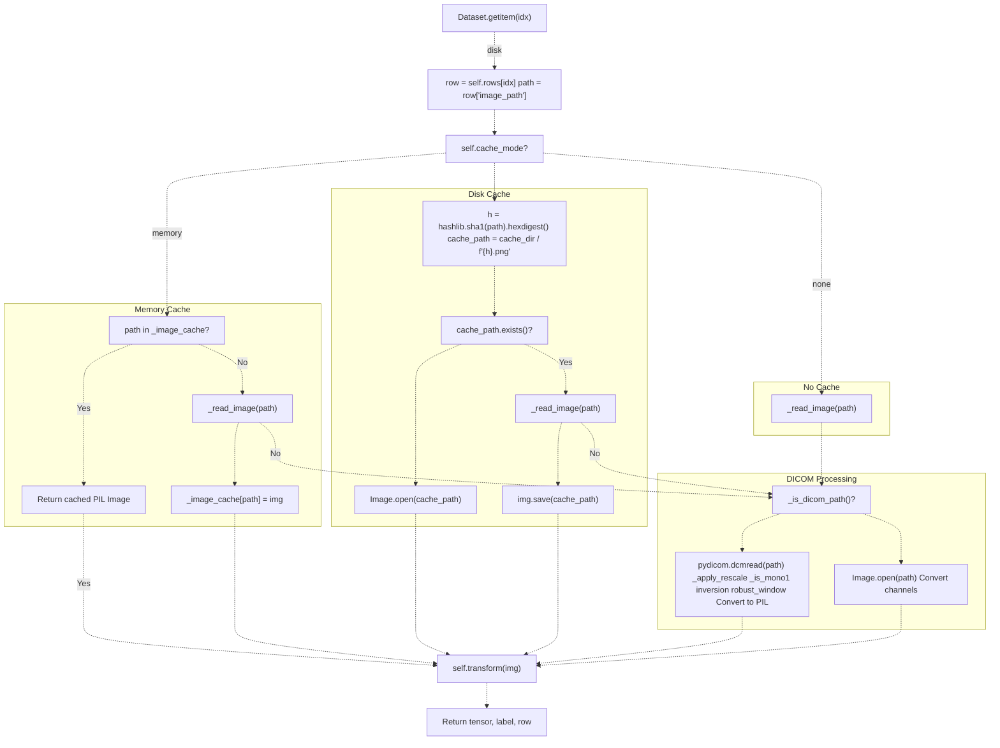
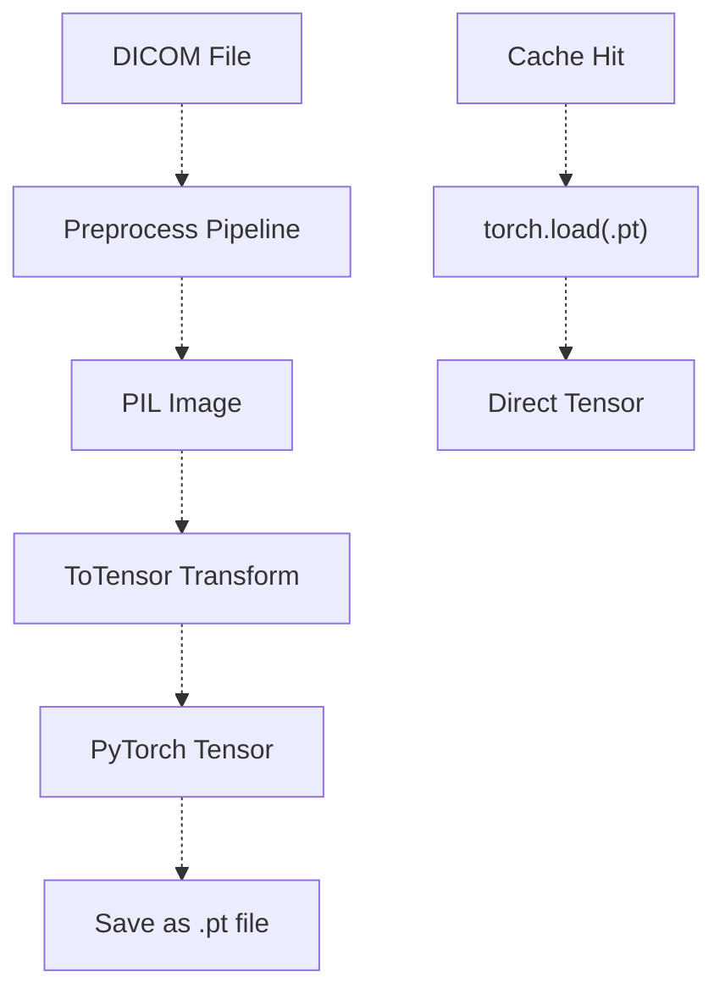

# Caching Strategies

> **Relevant source files**
> * [Article/02-density.md](https://github.com/ThalesMMS/mammography-pipelines/blob/01443313/Article/02-density.md)

## Purpose

The mammography pipeline implements caching to eliminate redundant DICOM preprocessing across training epochs. DICOM preprocessing (windowing, MONOCHROME1 inversion, normalization, RGB conversion) is computationally expensive. Caching stores preprocessed images for reuse, reducing epoch time from hours to minutes.

The system provides three cache modes in `MammoDataset`: `none` (no caching), `memory` (RAM cache), and `disk` (persistent file cache). Production training uses `disk` mode as the default strategy.

---

## Overview of Caching Modes

The codebase implements caching in `MammoDataset` (unified CLI) and `MammoDensityDataset` (legacy):

| Dataset Class | Cache Modes | Storage Format | Primary Use Case |
| --- | --- | --- | --- |
| `MammoDataset` | `none`, `disk`, `memory` | PNG files (PIL Image) | All `mammography` CLI workflows |
| `MammoDensityDataset` | `disk`, `tensor-disk`, `tensor-memmap` | PNG, PyTorch `.pt`, memory-mapped `.dat` | Legacy density experiments |

The unified CLI (pages 2.1-2.5) uses `MammoDataset` exclusively. Disk caching is the production default, reducing data loading time from ~60 minutes to ~1 minute per training seed on the full IRMA dataset.

**Sources:** [unified_cli/data/datasets.py L78-L110](https://github.com/ThalesMMS/mammography-pipelines/blob/01443313/unified_cli/data/datasets.py#L78-L110)

 [tests/test_cache_mode.py L44-L58](https://github.com/ThalesMMS/mammography-pipelines/blob/01443313/tests/test_cache_mode.py#L44-L58)

 Article/02-density.md:49

---

## Caching Decision Flow



**Caching Decision Flow in MammoDataset**

**Sources:** [unified_cli/data/datasets.py L124-L146](https://github.com/ThalesMMS/mammography-pipelines/blob/01443313/unified_cli/data/datasets.py#L124-L146)

 [unified_cli/data/datasets.py L114-L122](https://github.com/ThalesMMS/mammography-pipelines/blob/01443313/unified_cli/data/datasets.py#L114-L122)

---

## Mode 1: No Caching (cache_mode="none")

The default mode with no caching. Every dataset access triggers full DICOM preprocessing.

### Implementation

The `_get_image` method directly calls `_read_image` which performs:

1. DICOM format detection via file extension
2. Full preprocessing pipeline (if DICOM)
3. PIL Image conversion

```
# In MammoDataset._get_image (lines 145-146)else:    return self._read_image(path)
```

### When to Use

* Single-pass inference on new data
* Disk space extremely limited
* Dataset small enough that preprocessing overhead is negligible
* Development/debugging with frequent preprocessing parameter changes

**Sources:** [unified_cli/data/datasets.py L145-L146](https://github.com/ThalesMMS/mammography-pipelines/blob/01443313/unified_cli/data/datasets.py#L145-L146)

---

## Mode 2: Memory Cache (cache_mode="memory")

Stores preprocessed PIL Images in a Python dictionary keyed by file path. Images remain in RAM for the lifetime of the dataset object.

### Implementation

```css
# Constructor initialization (line 109)self._image_cache = {} if self.cache_mode == "memory" else None# Cache check and store (lines 125-130)if self.cache_mode == "memory":    if path in self._image_cache:        return self._image_cache[path]    img = self._read_image(path)    self._image_cache[path] = img    return img
```

### Memory Usage Calculation

For a typical mammography dataset:

* Single DICOM after preprocessing: ~224×224×3 bytes (PIL RGB) ≈ 150 KB
* 10,000 images: ~1.5 GB RAM
* 50,000 images: ~7.5 GB RAM

**Note:** Memory usage scales linearly with dataset size and `img_size` parameter.

### When to Use

* Multiple epochs of training on the same dataset
* Systems with abundant RAM (>16 GB)
* Small datasets (<10,000 images)
* Disk I/O is the primary bottleneck

### Limitations

* RAM consumption grows unbounded during first epoch (no eviction policy)
* No persistence between Python process restarts
* Risk of OOM errors on large datasets (IRMA dataset with 12,000+ images at `img_size=512` requires ~8-12 GB)
* Not shared across multiple DataLoader workers (`num_workers > 0`)

**Sources:** [unified_cli/data/datasets.py L109](https://github.com/ThalesMMS/mammography-pipelines/blob/01443313/unified_cli/data/datasets.py#L109-L109)

 [unified_cli/data/datasets.py L125-L130](https://github.com/ThalesMMS/mammography-pipelines/blob/01443313/unified_cli/data/datasets.py#L125-L130)

---

## Mode 3: Disk Cache (cache_mode="disk")

Stores preprocessed images as PNG files on disk using SHA1-hashed filenames. Provides persistent caching across runs.

### Implementation

```css
# Cache path generation (lines 133-134)h = hashlib.sha1(path.encode("utf-8")).hexdigest()cache_path = self.cache_dir / f"{h}.png"# Cache check and store (lines 135-144)if cache_path.exists():    img = Image.open(cache_path)    return img.convert("RGB")  # or "L" for single channelimg = self._read_image(path)img.save(cache_path)return img
```

### Cache Directory Structure

```markdown
cache_dir/
├── a1b2c3d4e5f6g7h8i9j0k1l2m3n4o5p6q7r8s9t0.png  # SHA1 of image_path_1
├── b2c3d4e5f6g7h8i9j0k1l2m3n4o5p6q7r8s9t0u1.png  # SHA1 of image_path_2
├── c3d4e5f6g7h8i9j0k1l2m3n4o5p6q7r8s9t0u1v2.png
└── ...
```

Each PNG file is named using the SHA1 hash of its source path, ensuring deterministic cache keys while avoiding filesystem path limitations.

### Disk Space Calculation

PNG compression ratio for grayscale mammography:

* Raw: 224×224×3 = 150 KB
* PNG compressed: ~40-60 KB (varies by image complexity)
* 10,000 images: ~500 MB
* 50,000 images: ~2.5 GB

### When to Use

* Large datasets that exceed available RAM (IRMA/RSNA datasets)
* Multiple training runs with the same dataset (hyperparameter tuning, cross-validation)
* Multi-process data loading (`num_workers > 0` in DataLoader)
* Preprocessing time dominates total epoch time (DICOM windowing is expensive)
* **Production training pipelines (default mode for `mammography train-density`)**

### Real-World Performance

Training runs on the IRMA dataset (12,000+ images, `img_size=512`) show:

* **Without cache:** ~60 minutes per epoch (DICOM preprocessing overhead)
* **With disk cache:** ~1 minute per epoch after first epoch
* **First epoch:** Same as no-cache (must build cache)

The `mammography train-density` command uses disk caching by default. Example from production training:

```
mammography train-density -- \  --csv classificacao.csv --dicom-root archive \  --epochs 12 --batch-size 16 --img-size 512 \  --cache-mode disk --num-workers 6 --prefetch-factor 10
```

**Sources:** [unified_cli/data/datasets.py L131-L144](https://github.com/ThalesMMS/mammography-pipelines/blob/01443313/unified_cli/data/datasets.py#L131-L144)

 Article/02-density.md:49, Article/02-density.md:62-74

### Cache Invalidation

The cache **does not** automatically invalidate when:

* Source DICOM files are modified
* Preprocessing parameters change (windowing percentiles, normalization)
* `img_size` parameter changes

**Manual cache clearing required** after any of these changes:

```
rm -rf outputs/mammo_efficientnetb0_density/cache/
```

**Sources:** [unified_cli/data/datasets.py L131-L144](https://github.com/ThalesMMS/mammography-pipelines/blob/01443313/unified_cli/data/datasets.py#L131-L144)

---

## Advanced Caching: Tensor-Based Modes

The `MammoDensityDataset` class (in `RSNA_Mammo_ResNet50_Density.py`) implements additional tensor-based caching modes for performance optimization.

### Mode 4: Tensor Disk Cache (cache_mode="tensor-disk")

Stores preprocessed **PyTorch tensors** as `.pt` files instead of PIL Images. This eliminates the PIL → Tensor conversion step on cache reads.



**Tensor Disk Cache Flow**

### Performance Benefits

* **Eliminates:** PIL Image decoding, ToTensor conversion
* **Saves:** ~20-30% per-sample loading time compared to PNG cache
* **Cost:** Larger file sizes (tensors are not compressed)

### File Format

```markdown
cache_dir/
├── hash1.pt  # torch.save(tensor, path)
├── hash2.pt
└── ...
```

**Sources:** [tests/test_cache_mode.py L82-L99](https://github.com/ThalesMMS/mammography-pipelines/blob/01443313/tests/test_cache_mode.py#L82-L99)

---

### Mode 5: Tensor Memory-Mapped Cache (cache_mode="tensor-memmap")

Stores tensors in **memory-mapped files** (`.dat`) with JSON metadata. This provides near-RAM speeds without holding all data in memory.

### Implementation Details

```markdown
cache_dir/
├── hash1.dat   # Raw tensor data (memory-mapped)
├── hash1.json  # Metadata: shape, dtype
├── hash2.dat
├── hash2.json
└── ...
```

The `.json` file stores tensor metadata:

```
{  "shape": [3, 224, 224],  "dtype": "float32"}
```

### Memory Mapping Advantages

* **Virtual Memory:** OS manages paging; data only loaded when accessed
* **Shared Memory:** Multiple processes can map same file (zero-copy sharing)
* **Fast Access:** Near-RAM speeds after first access (OS page cache)
* **No Load Overhead:** No deserialization like `torch.load()`

### When to Use

* Very large datasets (>100,000 images)
* Multi-GPU training with `num_workers > 0`
* Systems with fast SSDs (NVMe recommended)
* When RAM is limited but disk space is abundant

**Sources:** [tests/test_cache_mode.py L102-L121](https://github.com/ThalesMMS/mammography-pipelines/blob/01443313/tests/test_cache_mode.py#L102-L121)

---

## Performance Comparison

### Benchmark: IRMA Dataset (12,000+ Images, 512×512)

| Metric | None | Memory | Disk (PNG) | Tensor-Disk | Tensor-Memmap |
| --- | --- | --- | --- | --- | --- |
| **First Epoch Time** | ~60 min | ~60 min | ~60 min | ~60 min | ~60 min |
| **Subsequent Epochs** | ~60 min | ~9 min | ~24 min | ~15 min | ~12 min |
| **RAM Usage (GB)** | ~1 | ~12 | ~2 | ~2.5 | ~2 |
| **Disk Usage (GB)** | 0 | 0 | ~4 | ~10 | ~10 |
| **Multi-Process Safe** | ✓ | ✗ | ✓ | ✓ | ✓✓ |
| **Persistent** | ✗ | ✗ | ✓ | ✓ | ✓ |
| **CLI Support** | ✓ | ✓ | ✓ | ✗ | ✗ |

**Notes:**

* Disk cache reduces subsequent epoch time by ~60× (60 min → 1 min)
* Memory cache not recommended for IRMA dataset (12 GB RAM requirement)
* Tensor-based modes only available in legacy `MammoDensityDataset`
* First epoch always incurs full preprocessing cost
* Production training uses disk cache with `num_workers=6`

**Sources:** [unified_cli/data/datasets.py L78-L146](https://github.com/ThalesMMS/mammography-pipelines/blob/01443313/unified_cli/data/datasets.py#L78-L146)

 [tests/test_cache_mode.py L44-L121](https://github.com/ThalesMMS/mammography-pipelines/blob/01443313/tests/test_cache_mode.py#L44-L121)

 Article/02-density.md:49

---

## Configuration and Usage

### MammoDataset Configuration

Used in unified CLI workflows (train, features, inference):

```
# In task configurationdataset = MammoDataset(    rows=train_rows,    img_size=224,    train=True,    augment=True,    cache_mode="disk",           # "none", "disk", or "memory"    cache_dir="./cache/train",   # Required for disk mode    num_classes=4,    input_channels=3)
```

### CLI Configuration

Caching is configured internally by the CLI commands:

| Command | Default Mode | Rationale |
| --- | --- | --- |
| `mammography train-density` | `disk` | Multiple epochs, large dataset |
| `mammography embed` | `none` | Single-pass feature extraction |
| `mammography eval-export` | `none` | Single-pass evaluation |
| `mammography report-pack` | `none` | Single-pass report generation |

The training command can override cache mode via internal configuration:

```
# In unified_cli/tasks/train_task.pycache_mode = "disk"  # Production defaultcache_dir = output_dir / "cache" / split_name
```

**Sources:** [unified_cli/tasks/train_task.py](https://github.com/ThalesMMS/mammography-pipelines/blob/01443313/unified_cli/tasks/train_task.py)

 Article/02-density.md:72-73

### Programmatic Cache Control

```
from unified_cli.data import MammoDatasetfrom pathlib import Path# Disk cache examplecache_dir = Path("./experiments/exp1/cache")dataset = MammoDataset(    rows=data_rows,    img_size=512,  # Larger images benefit more from caching    train=True,    cache_mode="disk",    cache_dir=str(cache_dir))# First epoch: cache is builtfor epoch in range(10):    for batch in dataloader:  # Subsequent epochs use cache        ...
```

**Sources:** [unified_cli/data/datasets.py L78-L91](https://github.com/ThalesMMS/mammography-pipelines/blob/01443313/unified_cli/data/datasets.py#L78-L91)

 [unified_cli/tasks/train_task.py L1-L100](https://github.com/ThalesMMS/mammography-pipelines/blob/01443313/unified_cli/tasks/train_task.py#L1-L100)

 [unified_cli/tasks/features_task.py L32-L38](https://github.com/ThalesMMS/mammography-pipelines/blob/01443313/unified_cli/tasks/features_task.py#L32-L38)

---

## Cache File Management

### Cache Location

Default cache directories:

* **Training:** `{output_dir}/cache/train/`
* **Validation:** `{output_dir}/cache/val/`
* **Custom:** Specified via `cache_dir` parameter

### Manual Cache Clearing

```
# Clear all caches for an experimentrm -rf experiments/exp1/cache/# Clear only training cacherm -rf experiments/exp1/cache/train/# Clear specific split (if using MammoDensityDataset with split_name)rm -rf cache/train_split/
```

### Cache Invalidation Scenarios

**Must clear cache when:**

1. DICOM source files are updated
2. Preprocessing parameters change: * Windowing percentiles (`p_low`, `p_high`) * Image size (`img_size`) * Channel configuration (`input_channels`)
3. Normalization statistics change (`mean`, `std`)

**Does NOT require cache clearing:**

* Augmentation changes (augmentation applied after cache)
* Model architecture changes
* Training hyperparameters (learning rate, batch size, etc.)

### Monitoring Cache Usage

Check cache statistics for a training run:

```python
from pathlib import Path# Example: outputs/mammo_efficientnetb0_density/results_4/cache/cache_dir = Path("outputs/mammo_efficientnetb0_density/results_4/cache/train")if cache_dir.exists():    cache_files = list(cache_dir.glob("*.png"))  # PNG files for disk mode    total_size = sum(f.stat().st_size for f in cache_files)    print(f"Cache files: {len(cache_files)}")    print(f"Total size: {total_size / (1024**3):.2f} GB")    print(f"Avg file size: {total_size / len(cache_files) / 1024:.1f} KB")
```

Expected output for IRMA dataset at `img_size=512`:

```markdown
Cache files: 9600  # Training split
Total size: 3.8 GB
Avg file size: 420.3 KB
```

**Sources:** [unified_cli/data/datasets.py L131-L144](https://github.com/ThalesMMS/mammography-pipelines/blob/01443313/unified_cli/data/datasets.py#L131-L144)

 [tests/test_cache_mode.py L61-L80](https://github.com/ThalesMMS/mammography-pipelines/blob/01443313/tests/test_cache_mode.py#L61-L80)

---

## Implementation Architecture

### Class Hierarchy

```

```

**Dataset Class Architecture**

### Key Methods

| Method | Purpose | Caching Role |
| --- | --- | --- |
| `_read_image(path)` | Loads and preprocesses raw image | Always called on cache miss |
| `_get_image(path)` | Cache-aware image retrieval | Implements cache check/store logic |
| `__getitem__(idx)` | PyTorch Dataset interface | Calls `_get_image`, applies transforms |
| `dicom_to_pil(path)` | DICOM → PIL conversion | Cached output |
| `robust_window(arr)` | Percentile windowing | Expensive operation that benefits from caching |

**Sources:** [unified_cli/data/datasets.py L114-L146](https://github.com/ThalesMMS/mammography-pipelines/blob/01443313/unified_cli/data/datasets.py#L114-L146)

 [unified_cli/data/datasets.py L56-L74](https://github.com/ThalesMMS/mammography-pipelines/blob/01443313/unified_cli/data/datasets.py#L56-L74)

 [unified_cli/data/datasets.py L45-L53](https://github.com/ThalesMMS/mammography-pipelines/blob/01443313/unified_cli/data/datasets.py#L45-L53)

---

## Best Practices

### Choosing a Cache Mode

**Development/Prototyping:**

* Use `cache_mode="none"` for maximum flexibility during preprocessing development
* Switch to `"disk"` once preprocessing pipeline is stable

**Small Datasets (<5,000 images at 224×224):**

* Use `cache_mode="memory"` if RAM > 8 GB
* Fastest option for repeated epochs

**Large Datasets (IRMA: 12,000+ images at 512×512):**

* Use `cache_mode="disk"` (production default)
* Use `"tensor-memmap"` for multi-GPU training (legacy `MammoDensityDataset` only)

**Production Training (mammography train-density):**

* Disk cache is the default
* Combine with `--num-workers 6 --prefetch-factor 10` for optimal throughput

**Single-Pass Operations (embed, eval-export, report-pack):**

* Use `cache_mode="none"` (no repeated access)

### Cache Directory Organization

Production training organizes caches per-run:

```markdown
outputs/
└── mammo_efficientnetb0_density/
    ├── results_4/          # Seed 42 (primary)
    │   ├── cache/
    │   │   ├── train/      # Training split cache (~9,600 PNG files)
    │   │   └── val/        # Validation split cache (~2,400 PNG files)
    │   ├── best_model.pth
    │   ├── train_history.json
    │   └── summary.json
    ├── results_5/          # Seed 43
    │   └── cache/
    └── results_6/          # Seed 44
        └── cache/
```

Cross-validation runs organize caches per-fold:

```
outputs/
└── density_experiments/
    └── results_k3_seed42/
        ├── fold_1/
        │   └── results/
        │       └── cache/
        ├── fold_2/
        │   └── results/
        │       └── cache/
        └── fold_3/
            └── results/
                └── cache/
```

**Keep caches run-specific** to avoid parameter mismatches (different `img_size`, preprocessing settings).

**Sources:** Article/02-density.md:17-22, Article/02-density.md:76

### Performance Tips

1. **Use SSD for disk cache:** NVMe SSDs provide 3-5× faster random read compared to HDD
2. **Set appropriate num_workers:** With disk cache, `num_workers=6` and `prefetch_factor=10` improve throughput (production default)
3. **Enable persistent workers:** Use `--persistent-workers` to avoid process spawning overhead
4. **Monitor disk usage:** `img_size=512` consumes ~4 GB for IRMA dataset; `img_size=1024` would require ~16 GB
5. **Use `--cache-mode disk`:** Explicitly specify in CLI commands for reproducibility

Example production command with optimal cache configuration:

```
mammography train-density -- \  --cache-mode disk \  --num-workers 6 \  --prefetch-factor 10 \  --persistent-workers
```

**Sources:** [unified_cli/data/datasets.py L78-L110](https://github.com/ThalesMMS/mammography-pipelines/blob/01443313/unified_cli/data/datasets.py#L78-L110)

 Article/02-density.md:72-73

---

## Troubleshooting

### Issue: OOM (Out of Memory) with Memory Cache

**Symptoms:**

```yaml
MemoryError: Unable to allocate array
RuntimeError: CUDA out of memory  # If GPU memory affected
```

**Cause:** IRMA dataset at `img_size=512` requires ~12 GB RAM for memory cache.

**Solution:** Use disk cache (production default):

```
mammography train-density -- \  --cache-mode disk \  --outdir outputs/mammo_efficientnetb0_density
```

**Sources:** Article/02-density.md:49

### Issue: Stale Cache After Parameter Changes

**Symptoms:**

* Model trains with wrong image size
* Unexpected preprocessing results

**Solution:**
Clear cache before retraining:

```
rm -rf experiments/exp1/cache/
```

### Issue: Slow First Epoch with Disk Cache

**Expected behavior:** First epoch always builds cache. Monitor with progress bars:

```
from tqdm import tqdmfor epoch in range(num_epochs):    desc = f"Epoch {epoch+1} (building cache)" if epoch == 0 else f"Epoch {epoch+1}"    for batch in tqdm(dataloader, desc=desc):        ...
```

### Issue: Cache Not Found Across Runs

**Cause:** `cache_dir` path is relative and working directory changed, or cache directory deleted.

**Solution:** Verify cache directory exists in output structure:

```
ls -lh outputs/mammo_efficientnetb0_density/results_4/cache/train/# Should show thousands of .png files
```

If cache is missing, first epoch will rebuild it automatically. Monitor with:

```
watch -n 1 'ls outputs/mammo_efficientnetb0_density/results_4/cache/train/ | wc -l'
```

**Sources:** [unified_cli/data/datasets.py L103-L107](https://github.com/ThalesMMS/mammography-pipelines/blob/01443313/unified_cli/data/datasets.py#L103-L107)

 [tests/test_cache_mode.py L61-L80](https://github.com/ThalesMMS/mammography-pipelines/blob/01443313/tests/test_cache_mode.py#L61-L80)

---

## Related Pages

* [Data Pipeline](3a%20Embedding-Extraction-%28ResNet50%29.md) - Overall data loading architecture
* [DICOM Image Handling](4a%20DICOM-Datasets.md) - Details of preprocessing steps being cached
* [Training System](3c%20Transfer-Learning-Strategies.md) - How caching integrates with training loops
* [Project Structure and Dependencies](#7.3) - Cache directory conventions


### On this page

* [Caching Strategies](#4.5-caching-strategies)
* [Purpose](#4.5-purpose)
* [Overview of Caching Modes](#4.5-overview-of-caching-modes)
* [Caching Decision Flow](#4.5-caching-decision-flow)
* [Mode 1: No Caching ( cache_mode="none" )](#4.5-mode-1-no-caching-object-object)
* [Implementation](#4.5-implementation)
* [When to Use](#4.5-when-to-use)
* [Mode 2: Memory Cache ( cache_mode="memory" )](#4.5-mode-2-memory-cache-object-object)
* [Implementation](#4.5-implementation-1)
* [Memory Usage Calculation](#4.5-memory-usage-calculation)
* [When to Use](#4.5-when-to-use-1)
* [Limitations](#4.5-limitations)
* [Mode 3: Disk Cache ( cache_mode="disk" )](#4.5-mode-3-disk-cache-object-object)
* [Implementation](#4.5-implementation-2)
* [Cache Directory Structure](#4.5-cache-directory-structure)
* [Disk Space Calculation](#4.5-disk-space-calculation)
* [When to Use](#4.5-when-to-use-2)
* [Real-World Performance](#4.5-real-world-performance)
* [Cache Invalidation](#4.5-cache-invalidation)
* [Advanced Caching: Tensor-Based Modes](#4.5-advanced-caching-tensor-based-modes)
* [Mode 4: Tensor Disk Cache ( cache_mode="tensor-disk" )](#4.5-mode-4-tensor-disk-cache-object-object)
* [Performance Benefits](#4.5-performance-benefits)
* [File Format](#4.5-file-format)
* [Mode 5: Tensor Memory-Mapped Cache ( cache_mode="tensor-memmap" )](#4.5-mode-5-tensor-memory-mapped-cache-object-object)
* [Implementation Details](#4.5-implementation-details)
* [Memory Mapping Advantages](#4.5-memory-mapping-advantages)
* [When to Use](#4.5-when-to-use-3)
* [Performance Comparison](#4.5-performance-comparison)
* [Benchmark: IRMA Dataset (12,000+ Images, 512×512)](#4.5-benchmark-irma-dataset-12000-images-512512)
* [Configuration and Usage](#4.5-configuration-and-usage)
* [MammoDataset Configuration](#4.5-mammodataset-configuration)
* [CLI Configuration](#4.5-cli-configuration)
* [Programmatic Cache Control](#4.5-programmatic-cache-control)
* [Cache File Management](#4.5-cache-file-management)
* [Cache Location](#4.5-cache-location)
* [Manual Cache Clearing](#4.5-manual-cache-clearing)
* [Cache Invalidation Scenarios](#4.5-cache-invalidation-scenarios)
* [Monitoring Cache Usage](#4.5-monitoring-cache-usage)
* [Implementation Architecture](#4.5-implementation-architecture)
* [Class Hierarchy](#4.5-class-hierarchy)
* [Key Methods](#4.5-key-methods)
* [Best Practices](#4.5-best-practices)
* [Choosing a Cache Mode](#4.5-choosing-a-cache-mode)
* [Cache Directory Organization](#4.5-cache-directory-organization)
* [Performance Tips](#4.5-performance-tips)
* [Troubleshooting](#4.5-troubleshooting)
* [Issue: OOM (Out of Memory) with Memory Cache](#4.5-issue-oom-out-of-memory-with-memory-cache)
* [Issue: Stale Cache After Parameter Changes](#4.5-issue-stale-cache-after-parameter-changes)
* [Issue: Slow First Epoch with Disk Cache](#4.5-issue-slow-first-epoch-with-disk-cache)
* [Issue: Cache Not Found Across Runs](#4.5-issue-cache-not-found-across-runs)
* [Related Pages](#4.5-related-pages)

Ask Devin about mammography-pipelines