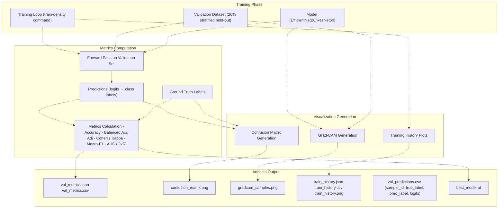
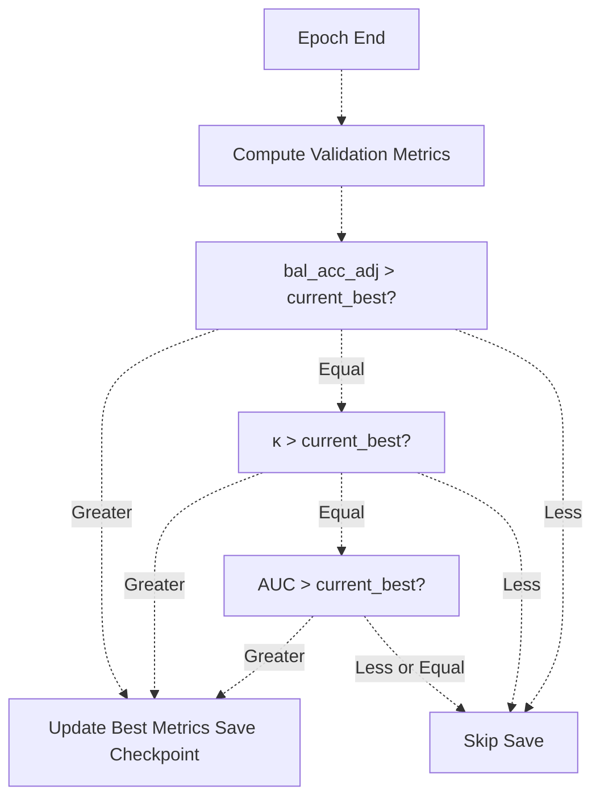
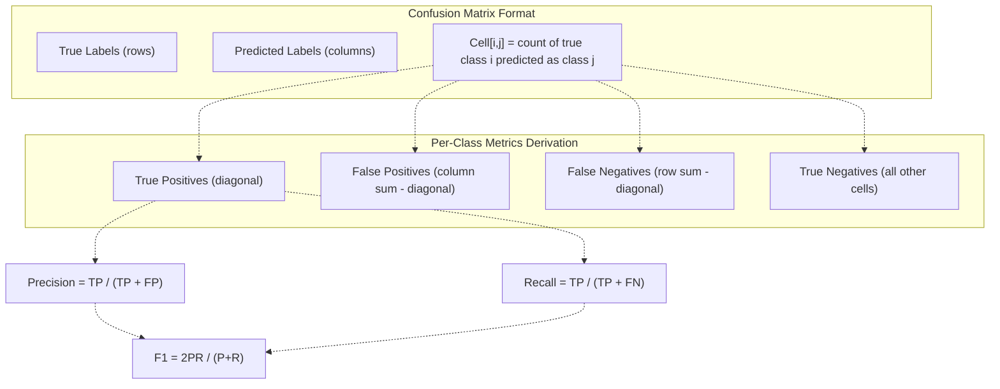
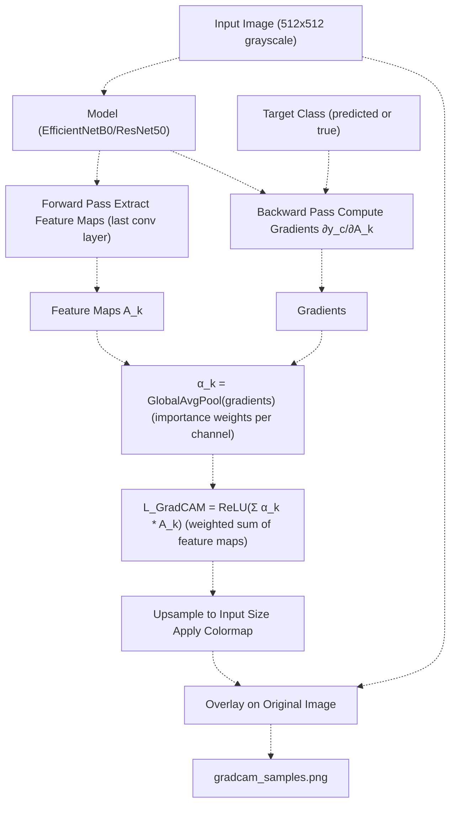
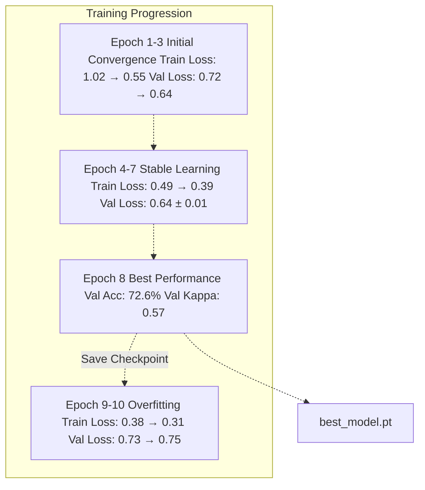
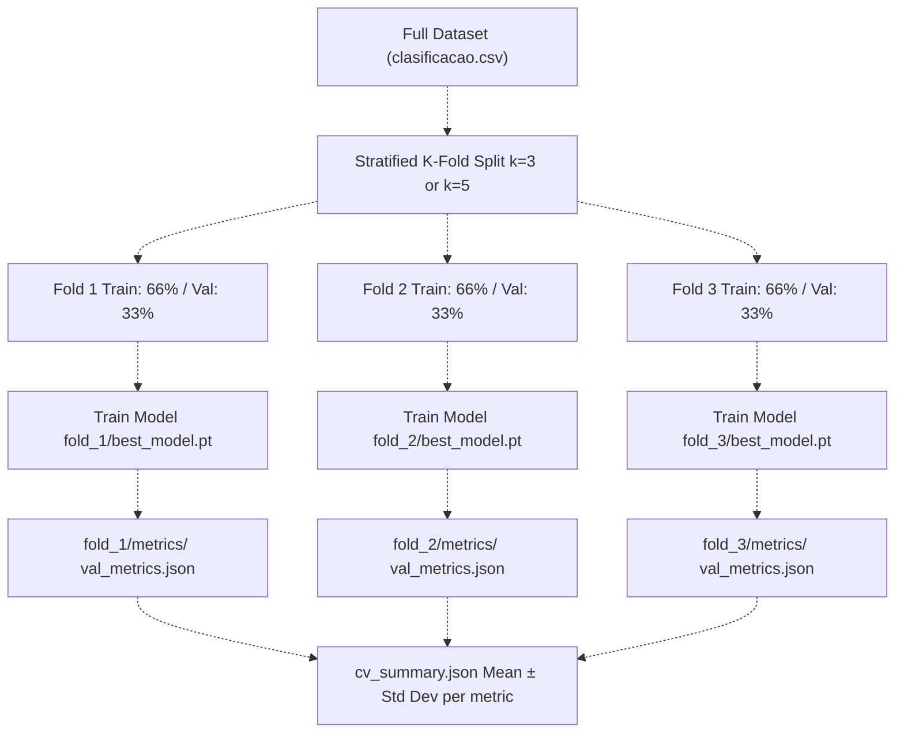
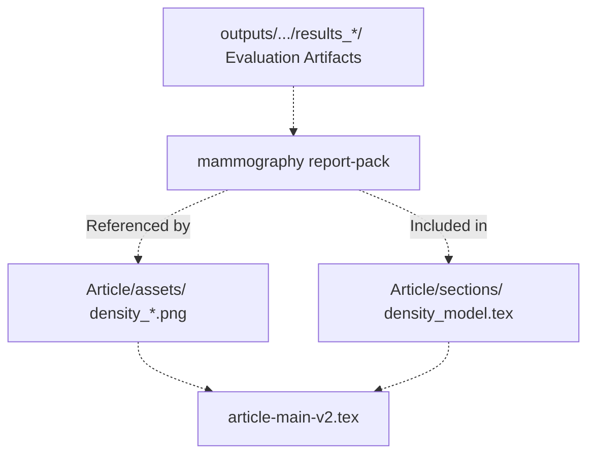

# Evaluation and Metrics

> **Relevant source files**
> * [Article/02-density.md](https://github.com/ThalesMMS/mammography-pipelines/blob/01443313/Article/02-density.md)
> * [Article/article.md](https://github.com/ThalesMMS/mammography-pipelines/blob/01443313/Article/article.md)

This page documents the evaluation framework used to assess model performance in the mammography density classification pipeline. It covers the computation of performance metrics (accuracy, balanced accuracy adjusted, Cohen's kappa, macro-F1, AUC), generation of confusion matrices and per-class analysis, Grad-CAM visualizations for interpretability, and training history analysis for convergence monitoring.

For information about the training loop that generates these metrics, see [Training Loop and Optimization](3d%20Training-Loop-and-Optimization.md). For cross-validation strategies, see [Cross-Validation and Hyperparameter Optimization](3e%20Cross-Validation-and-Hyperparameter-Optimization.md). For how evaluation results are exported and integrated with documentation, see [mammography eval-export](2c%20mammography-eval-export.md) and [mammography report-pack](2d%20mammography-report-pack.md).

---

## Overview of Evaluation Framework

The evaluation system tracks model performance throughout training and generates comprehensive artifacts for analysis. Each training run produces standardized outputs in the `outputs/` directory structure.



**Sources:** High-level system diagrams (Diagram 2: Machine Learning Pipeline Detail)

### Evaluation Artifacts Directory Structure

Each training run generates a `results_*` directory containing standardized evaluation outputs:

```markdown
outputs/mammo_efficientnetb0_density/
├── results_4/              # Seed 42
│   ├── best_model.pt       # Best checkpoint
│   ├── val_predictions.csv # Per-sample predictions
│   ├── metrics/
│   │   ├── val_metrics.json
│   │   └── val_metrics.csv
│   ├── confusion_matrix.png
│   ├── gradcam_samples.png
│   ├── train_history.json
│   ├── train_history.csv
│   ├── train_history.png
│   ├── summary.json        # Hyperparameters + git hash
│   ├── run.log             # Complete execution log
│   └── optuna_trial.json   # HPO tracking (if applicable)
├── results_5/              # Seed 43
└── results_6/              # Seed 44
```

**Sources:** [Article/02-density.md L16-L22](https://github.com/ThalesMMS/mammography-pipelines/blob/01443313/Article/02-density.md#L16-L22)

 High-level system diagrams (Diagram 5: Reproducibility and Documentation System)

---

## Performance Metrics

The system computes five primary metrics optimized for imbalanced multi-class classification. These metrics are chosen to provide a comprehensive view of model performance beyond simple accuracy.

### Metrics Summary Table

| Metric | Purpose | Computation | Best Use Case |
| --- | --- | --- | --- |
| **Accuracy** | Overall correctness | `(TP + TN) / Total` | Baseline comparison |
| **Balanced Accuracy Adjusted** | Chance-corrected balanced accuracy | `(bal_acc - 1/n_classes) / (1 - 1/n_classes)` | Imbalanced datasets, primary selection criterion |
| **Cohen's Kappa (quadratic)** | Inter-rater agreement beyond chance | Weighted disagreement matrix | Ordinal classes (BI-RADS 1-4) |
| **Macro-F1** | Average per-class F1 | `mean(2 * precision * recall / (precision + recall))` | Class-wise performance |
| **AUC (One-vs-Rest)** | Probability calibration | Area under ROC curve per class | Multi-class confidence |

**Sources:** [Article/02-density.md L39-L44](https://github.com/ThalesMMS/mammography-pipelines/blob/01443313/Article/02-density.md#L39-L44)

 [Article/article.md L87-L91](https://github.com/ThalesMMS/mammography-pipelines/blob/01443313/Article/article.md#L87-L91)

### Balanced Accuracy Adjusted

Balanced accuracy adjusted (bal_acc_adj) corrects for random guessing in imbalanced datasets:

```
bal_acc = mean(recall_per_class)
bal_acc_adj = (bal_acc - 1/n_classes) / (1 - 1/n_classes)
```

For 4-class classification, random guessing yields bal_acc = 0.25. The adjusted metric ranges from 0 (random) to 1 (perfect), making it suitable as the primary selection criterion for best model checkpointing.

**Sources:** [Article/article.md L87-L91](https://github.com/ThalesMMS/mammography-pipelines/blob/01443313/Article/article.md#L87-L91)

### Cohen's Kappa (Quadratic Weighted)

Cohen's kappa with quadratic weighting accounts for the ordinal nature of BI-RADS density categories. Disagreements between adjacent classes (e.g., B vs C) are penalized less than distant classes (e.g., A vs D). This reflects the clinical reality that density classification has natural ordering.

```yaml
κ_quadratic = 1 - (Σ w_ij * O_ij) / (Σ w_ij * E_ij)

where:
  w_ij = (i - j)² / (n_classes - 1)²  (quadratic weights)
  O_ij = observed confusion matrix
  E_ij = expected confusion under independence
```

**Sources:** [Article/02-density.md L39-L44](https://github.com/ThalesMMS/mammography-pipelines/blob/01443313/Article/02-density.md#L39-L44)

 [Article/article.md L269-L282](https://github.com/ThalesMMS/mammography-pipelines/blob/01443313/Article/article.md#L269-L282)

### Example Metrics from Seed Experiments

| Seed | Run ID | Accuracy | κ (quadrático) | Macro-F1 | AUC (OvR) |
| --- | --- | --- | --- | --- | --- |
| 42 | `results_4` | 0.676 | 0.697 | 0.584 | 0.913 |
| 43 | `results_5` | 0.733 | 0.756 | 0.588 | 0.922 |
| 44 | `results_6` | 0.679 | 0.710 | 0.564 | 0.896 |
| **Mean ± σ** | — | **0.696 ± 0.026** | **0.721 ± 0.025** | **0.579 ± 0.011** | **0.910 ± 0.010** |

**Sources:** [Article/02-density.md L37-L44](https://github.com/ThalesMMS/mammography-pipelines/blob/01443313/Article/02-density.md#L37-L44)

---

## Best Model Selection

The training loop saves checkpoints based on a hierarchical selection criterion that prioritizes metrics robust to class imbalance:



This hierarchy ensures that models are selected based on their ability to correctly classify all classes (bal_acc_adj), then agreement beyond chance (kappa), then probability calibration (AUC).

**Sources:** High-level system diagrams (Diagram 5: Reproducibility and Documentation System), [Article/article.md L325-L336](https://github.com/ThalesMMS/mammography-pipelines/blob/01443313/Article/article.md#L325-L336)

---

## Confusion Matrices and Per-Class Analysis

Confusion matrices visualize the distribution of predictions across classes, revealing systematic misclassification patterns crucial for model debugging.

### Confusion Matrix Structure



**Sources:** [Article/article.md L275-L290](https://github.com/ThalesMMS/mammography-pipelines/blob/01443313/Article/article.md#L275-L290)

 [Article/article.md L349-L368](https://github.com/ThalesMMS/mammography-pipelines/blob/01443313/Article/article.md#L349-L368)

### Example: Confusion Matrix Analysis (resnet_frozen_run4)

```
Predicted
           A    B    C    D
      ┌────────────────────┐
    A │  2    6    0    0  │  (25% recall)
True B │  4   58   11    0  │  (79% recall)
    C │  0   42   98   30  │  (58% recall)
    D │  0    1    9   57  │  (85% recall)
      └────────────────────┘
```

**Per-Class Analysis:**

| Classe | Precision | Recall | F1-Score | Support | Common Confusions |
| --- | --- | --- | --- | --- | --- |
| A | 33% | 25% | 0.29 | 8 | Confused with B (6/8) |
| B | 54% | 79% | 0.64 | 73 | Often over-predicted from A (4) and C (42) |
| C | 83% | 58% | 0.68 | 170 | Confused with B (42) and D (30) |
| D | 66% | 85% | 0.74 | 67 | Best recall, most distinctive |

**Key Observations:**

* **Class A** (extremely rare, 8 samples) has poor recall (25%), frequently confused with adjacent class B
* **Class B** attracts false positives from both A and C (46 total), indicating it may be the "default" prediction for uncertain cases
* **Class C** (intermediate density) shows confusion in both directions, reflecting genuine clinical ambiguity
* **Class D** (extremely dense) has highest recall (85%), suggesting it has the most distinctive visual features

**Sources:** [Article/article.md L349-L372](https://github.com/ThalesMMS/mammography-pipelines/blob/01443313/Article/article.md#L349-L372)

### Interpretation for Imbalanced Datasets

The confusion matrix reveals the impact of class imbalance:

* **Minority classes** (A, B) suffer from low precision/recall due to limited training examples
* **Majority class** (C) dominates predictions, acting as a "catch-all" category
* **Macro-F1 ~0.58** reflects poor performance on minority classes despite overall accuracy of 72.6%

This motivates the use of balanced accuracy and class weighting strategies documented in [Class Imbalance Handling](4d%20Class-Imbalance-Handling.md).

**Sources:** [Article/02-density.md L46-L49](https://github.com/ThalesMMS/mammography-pipelines/blob/01443313/Article/02-density.md#L46-L49)

 [Article/article.md L362-L372](https://github.com/ThalesMMS/mammography-pipelines/blob/01443313/Article/article.md#L362-L372)

---

## Grad-CAM Visualizations

Gradient-weighted Class Activation Mapping (Grad-CAM) generates visual explanations by highlighting image regions that contributed most to the model's prediction.

### Grad-CAM Pipeline



**Sources:** [Article/article.md L442](https://github.com/ThalesMMS/mammography-pipelines/blob/01443313/Article/article.md#L442-L442)

 (mentioned in future work)

### Grad-CAM Output Format

The system generates `gradcam_samples.png` containing a grid of visualizations for representative samples from the validation set:

```
Row 1: Class A samples (true A) - heatmap overlays
Row 2: Class B samples (true B) - heatmap overlays  
Row 3: Class C samples (true C) - heatmap overlays
Row 4: Class D samples (true D) - heatmap overlays
```

Each visualization shows:

* **Original grayscale mammogram** (background)
* **Red-yellow heatmap overlay** (regions with high activation)
* **Prediction label** and **confidence score** (title)

### Integration with Report-Pack

Grad-CAM visualizations are automatically copied to `Article/assets/density_gradcam_seed*.png` via the `mammography report-pack` command, maintaining traceability across experimental seeds:

```
Article/assets/
├── density_gradcam_seed42.png
├── density_gradcam_seed43.png
└── density_gradcam_seed44.png
```

**Sources:** [Article/02-density.md L22](https://github.com/ThalesMMS/mammography-pipelines/blob/01443313/Article/02-density.md#L22-L22)

 [Article/02-density.md L31-L33](https://github.com/ThalesMMS/mammography-pipelines/blob/01443313/Article/02-density.md#L31-L33)

---

## Training History and Convergence

The training loop logs epoch-level metrics to track convergence, identify overfitting, and select optimal stopping points.

### Training History Artifacts

Each run produces three formats of training history:

1. **`train_history.json`** - Structured data for programmatic access
2. **`train_history.csv`** - Tabular format for spreadsheet analysis
3. **`train_history.png`** - Visualization plots (loss curves, accuracy curves)

### Example Training History (resnet_frozen_run4)

| Época | Train Loss | Train Acc | Val Loss | Val Acc | Val Kappa | Notes |
| --- | --- | --- | --- | --- | --- | --- |
| 1 | 1.02 | 57.8% | 0.72 | 65.4% | 0.43 | Initial convergence |
| 2 | 0.67 | 78.5% | 0.75 | 66.0% | 0.45 |  |
| 3 | 0.55 | 80.6% | 0.64 | 70.4% | 0.51 | Val loss decreasing |
| 4 | 0.49 | 83.5% | 0.66 | 70.8% | 0.52 |  |
| 5 | 0.46 | 84.1% | 0.64 | 71.7% | 0.53 |  |
| 6 | 0.42 | 85.3% | 0.64 | 71.1% | 0.52 |  |
| 7 | 0.39 | 85.0% | 0.64 | 71.7% | 0.53 |  |
| 8 | 0.35 | 87.2% | **0.65** | **72.6%** | **0.57** | **Best checkpoint** |
| 9 | 0.38 | 84.5% | 0.73 | 70.4% | 0.55 | Val loss increases |
| 10 | 0.31 | 87.2% | 0.75 | 70.4% | 0.55 | Overfitting evident |

**Sources:** [Article/article.md L325-L336](https://github.com/ThalesMMS/mammography-pipelines/blob/01443313/Article/article.md#L325-L336)

### Convergence Analysis Diagram



**Key Observations:**

* **Epochs 1-3:** Rapid convergence as the model learns basic patterns
* **Epochs 4-7:** Stable validation loss indicates healthy training
* **Epoch 8:** Optimal balance between training and validation performance (selected as best checkpoint)
* **Epochs 9-10:** Validation loss increases while training loss continues decreasing → **overfitting detected**

**Sources:** [Article/article.md L337-L341](https://github.com/ThalesMMS/mammography-pipelines/blob/01443313/Article/article.md#L337-L341)

### Overfitting Detection Heuristics

The training loop monitors for overfitting through several signals:

1. **Diverging Loss:** Train loss decreases while val loss increases
2. **Accuracy Plateau:** Val accuracy stops improving for multiple consecutive epochs
3. **Metric Degradation:** Kappa or balanced accuracy decrease despite improving train accuracy

Early stopping can be enabled via training configuration to halt training when overfitting is detected.

**Sources:** [Article/article.md L337-L341](https://github.com/ThalesMMS/mammography-pipelines/blob/01443313/Article/article.md#L337-L341)

---

## Cross-Validation Results

For robust performance estimation, the system supports k-fold stratified cross-validation via `--cv-folds k` parameter.

### Cross-Validation Workflow



**Sources:** [Article/02-density.md L58-L84](https://github.com/ThalesMMS/mammography-pipelines/blob/01443313/Article/02-density.md#L58-L84)

### Example Cross-Validation Results (k=3, seed 42)

```yaml
Directory: outputs/density_experiments/results_k3_seed42/
├── fold_1/results/
│   ├── best_model.pt
│   └── metrics/val_metrics.json
├── fold_2/results/
│   ├── best_model.pt
│   └── metrics/val_metrics.json
├── fold_3/results/
│   ├── best_model.pt
│   └── metrics/val_metrics.json
├── cv_summary.json
└── ray_seed42_cv3.jsonl
```

**Aggregated Statistics:**

| Métrica | Média | σ | Min | Max |
| --- | --- | --- | --- | --- |
| Accuracy | 0.659 | 0.024 | 0.635 | 0.683 |
| κ (quadrático) | 0.666 | 0.020 | 0.646 | 0.686 |
| Macro-F1 | 0.592 | 0.036 | 0.556 | 0.628 |
| AUC (OvR) | 0.878 | 0.010 | 0.868 | 0.888 |

**Analysis:**

* **Low standard deviation** (σ < 0.04) across all metrics indicates stable performance
* **Fold 1** achieved highest κ (0.695) and macro-F1 (0.643), aligning with single-seed hold-out results
* **Folds 2-3** show expected performance drop on minority classes, confirming class imbalance challenges

**Sources:** [Article/02-density.md L76-L84](https://github.com/ThalesMMS/mammography-pipelines/blob/01443313/Article/02-density.md#L76-L84)

### Cross-Validation vs Single Seed Comparison

| Approach | Accuracy | κ | Macro-F1 | AUC | Computation Cost |
| --- | --- | --- | --- | --- | --- |
| **Single Seed (42)** | 0.676 | 0.697 | 0.584 | 0.913 | 1× training time |
| **3-Seed Average** | 0.696 ± 0.026 | 0.721 ± 0.025 | 0.579 ± 0.011 | 0.910 ± 0.010 | 3× training time |
| **3-Fold CV (seed 42)** | 0.659 ± 0.024 | 0.666 ± 0.020 | 0.592 ± 0.036 | 0.878 ± 0.010 | 3× training time |

Cross-validation provides more conservative estimates with tighter confidence intervals, while multi-seed runs capture inter-run variability with different train/val splits.

**Sources:** [Article/02-density.md L37-L44](https://github.com/ThalesMMS/mammography-pipelines/blob/01443313/Article/02-density.md#L37-L44)

 [Article/02-density.md L76-L84](https://github.com/ThalesMMS/mammography-pipelines/blob/01443313/Article/02-density.md#L76-L84)

---

## Evaluation Artifacts Summary

### Complete Artifact Listing

| Artifact | Format | Purpose | Example Path |
| --- | --- | --- | --- |
| `val_metrics.json` | JSON | Structured metrics (accuracy, kappa, F1, AUC) | `results_4/metrics/val_metrics.json` |
| `val_metrics.csv` | CSV | Tabular metrics for analysis | `results_4/metrics/val_metrics.csv` |
| `val_predictions.csv` | CSV | Per-sample predictions with logits | `results_4/val_predictions.csv` |
| `confusion_matrix.png` | PNG | Confusion matrix heatmap | `results_4/confusion_matrix.png` |
| `gradcam_samples.png` | PNG | Grad-CAM visualizations grid | `results_4/gradcam_samples.png` |
| `train_history.json` | JSON | Epoch-level training metrics | `results_4/train_history.json` |
| `train_history.csv` | CSV | Epoch-level metrics (tabular) | `results_4/train_history.csv` |
| `train_history.png` | PNG | Loss/accuracy curves | `results_4/train_history.png` |
| `best_model.pt` | PyTorch | Saved model checkpoint | `results_4/best_model.pt` |
| `summary.json` | JSON | Hyperparameters + git commit hash | `results_4/summary.json` |
| `run.log` | TXT | Complete terminal output | `results_4/run.log` |
| `optuna_trial.json` | JSON | HPO trial metadata | `results_4/optuna_trial.json` |

**Sources:** [Article/02-density.md L16-L22](https://github.com/ThalesMMS/mammography-pipelines/blob/01443313/Article/02-density.md#L16-L22)

 High-level system diagrams (Diagram 5: Reproducibility and Documentation System)

### Integration with Documentation System

Evaluation artifacts are synchronized with the LaTeX article system via `mammography report-pack`:



**Synchronized Assets:**

* `density_confusion_seed42.png` ← `results_4/confusion_matrix.png`
* `density_gradcam_seed42.png` ← `results_4/gradcam_samples.png`
* `density_train_seed42.png` ← `results_4/train_history.png`

**Sources:** [Article/02-density.md L22-L23](https://github.com/ThalesMMS/mammography-pipelines/blob/01443313/Article/02-density.md#L22-L23)

 [Article/02-density.md L50](https://github.com/ThalesMMS/mammography-pipelines/blob/01443313/Article/02-density.md#L50-L50)

 High-level system diagrams (Diagram 6: Integration Between ML System and Article System)

---

## Metrics Interpretation for Imbalanced Datasets

The choice of metrics reflects the challenges of highly imbalanced breast density classification:

### Why Balanced Accuracy Adjusted is Primary

Standard accuracy is misleading when class distribution is skewed (e.g., class A: 3%, class C: 67%). A naive model predicting only class C would achieve ~67% accuracy but 0% recall on minority classes.

**Balanced accuracy adjusted** corrects for this by:

1. Computing per-class recall (sensitivity)
2. Averaging across classes (giving equal weight to each class)
3. Subtracting chance performance (1/n_classes)
4. Normalizing to [0, 1] range

This ensures minority class performance is not hidden by majority class dominance.

**Sources:** [Article/article.md L87-L91](https://github.com/ThalesMMS/mammography-pipelines/blob/01443313/Article/article.md#L87-L91)

### Macro-F1 Limitations

Despite being a class-balanced metric, macro-F1 remains low (~0.58) even when overall accuracy is reasonable (~0.70). This reflects:

* **Class A** F1 = 0.29 due to extremely limited samples (40 total, 8 in validation)
* **Class B** F1 = 0.64 with moderate performance
* **Class C** F1 = 0.68 (majority class, best supported)
* **Class D** F1 = 0.74 (distinctive features)

The macro-average gives equal weight to all classes, so poor minority class performance significantly reduces the overall score.

**Sources:** [Article/02-density.md L46-L49](https://github.com/ThalesMMS/mammography-pipelines/blob/01443313/Article/02-density.md#L46-L49)

 [Article/article.md L362-L372](https://github.com/ThalesMMS/mammography-pipelines/blob/01443313/Article/article.md#L362-L372)

### AUC as Confidence Calibration Measure

AUC (One-vs-Rest) evaluates the model's ability to rank predictions correctly, independent of classification threshold. High AUC (0.91) despite moderate accuracy (0.70) indicates:

* The model's confidence scores are well-calibrated
* With better class balancing or threshold tuning, performance could improve
* The feature representations learned by the backbone are discriminative

**Sources:** [Article/02-density.md L39-L44](https://github.com/ThalesMMS/mammography-pipelines/blob/01443313/Article/02-density.md#L39-L44)


### On this page

* [Evaluation and Metrics](5%20Evaluation-and-Metrics.md)
* [Overview of Evaluation Framework](5%20Evaluation-and-Metrics.md)
* [Evaluation Artifacts Directory Structure](5%20Evaluation-and-Metrics.md)
* [Performance Metrics](5%20Evaluation-and-Metrics.md)
* [Metrics Summary Table](5%20Evaluation-and-Metrics.md)
* [Balanced Accuracy Adjusted](5%20Evaluation-and-Metrics.md)
* [Cohen's Kappa (Quadratic Weighted)](5%20Evaluation-and-Metrics.md)
* [Example Metrics from Seed Experiments](5%20Evaluation-and-Metrics.md)
* [Best Model Selection](5%20Evaluation-and-Metrics.md)
* [Confusion Matrices and Per-Class Analysis](5%20Evaluation-and-Metrics.md)
* [Confusion Matrix Structure](5%20Evaluation-and-Metrics.md)
* [Example: Confusion Matrix Analysis (resnet_frozen_run4)](5%20Evaluation-and-Metrics.md)
* [Interpretation for Imbalanced Datasets](5%20Evaluation-and-Metrics.md)
* [Grad-CAM Visualizations](5%20Evaluation-and-Metrics.md)
* [Grad-CAM Pipeline](5%20Evaluation-and-Metrics.md)
* [Grad-CAM Output Format](5%20Evaluation-and-Metrics.md)
* [Integration with Report-Pack](5%20Evaluation-and-Metrics.md)
* [Training History and Convergence](5%20Evaluation-and-Metrics.md)
* [Training History Artifacts](5%20Evaluation-and-Metrics.md)
* [Example Training History (resnet_frozen_run4)](5%20Evaluation-and-Metrics.md)
* [Convergence Analysis Diagram](5%20Evaluation-and-Metrics.md)
* [Overfitting Detection Heuristics](5%20Evaluation-and-Metrics.md)
* [Cross-Validation Results](5%20Evaluation-and-Metrics.md)
* [Cross-Validation Workflow](5%20Evaluation-and-Metrics.md)
* [Example Cross-Validation Results (k=3, seed 42)](5%20Evaluation-and-Metrics.md)
* [Cross-Validation vs Single Seed Comparison](5%20Evaluation-and-Metrics.md)
* [Evaluation Artifacts Summary](5%20Evaluation-and-Metrics.md)
* [Complete Artifact Listing](5%20Evaluation-and-Metrics.md)
* [Integration with Documentation System](5%20Evaluation-and-Metrics.md)
* [Metrics Interpretation for Imbalanced Datasets](5%20Evaluation-and-Metrics.md)
* [Why Balanced Accuracy Adjusted is Primary](5%20Evaluation-and-Metrics.md)
* [Macro-F1 Limitations](5%20Evaluation-and-Metrics.md)
* [AUC as Confidence Calibration Measure](5%20Evaluation-and-Metrics.md)

Ask Devin about mammography-pipelines