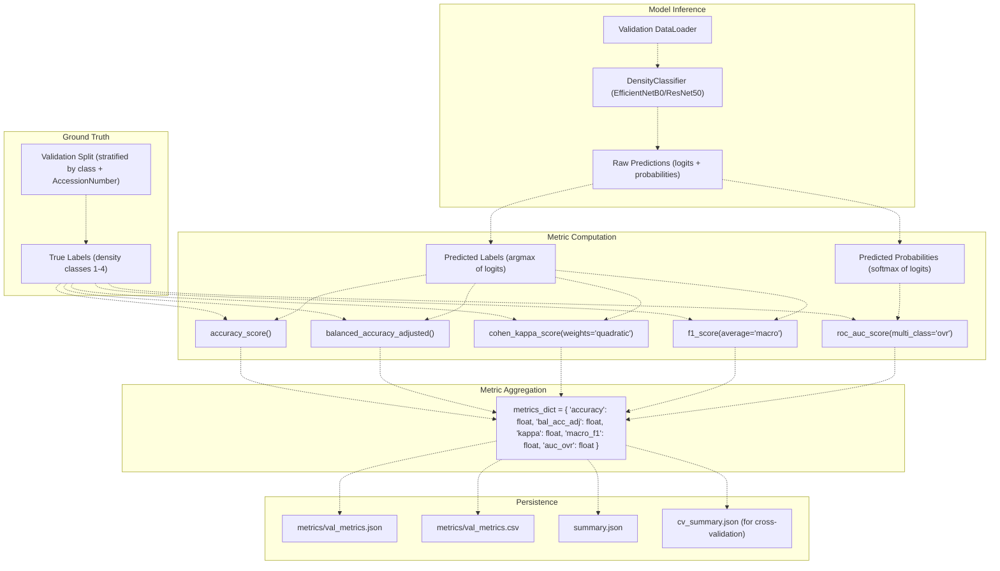
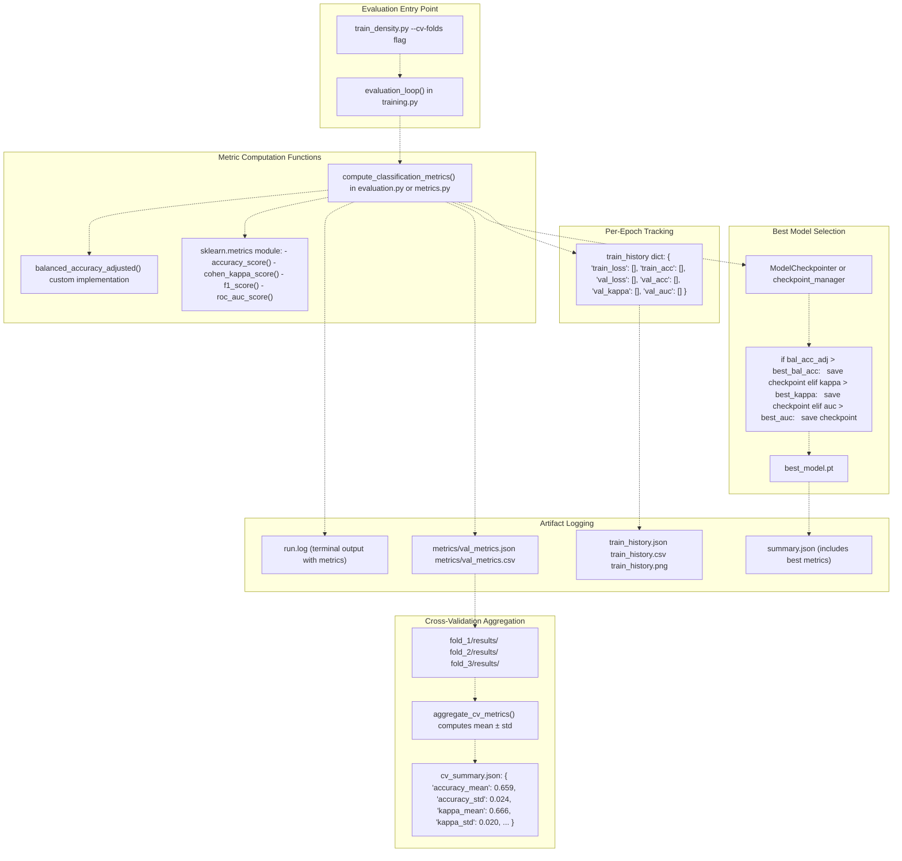
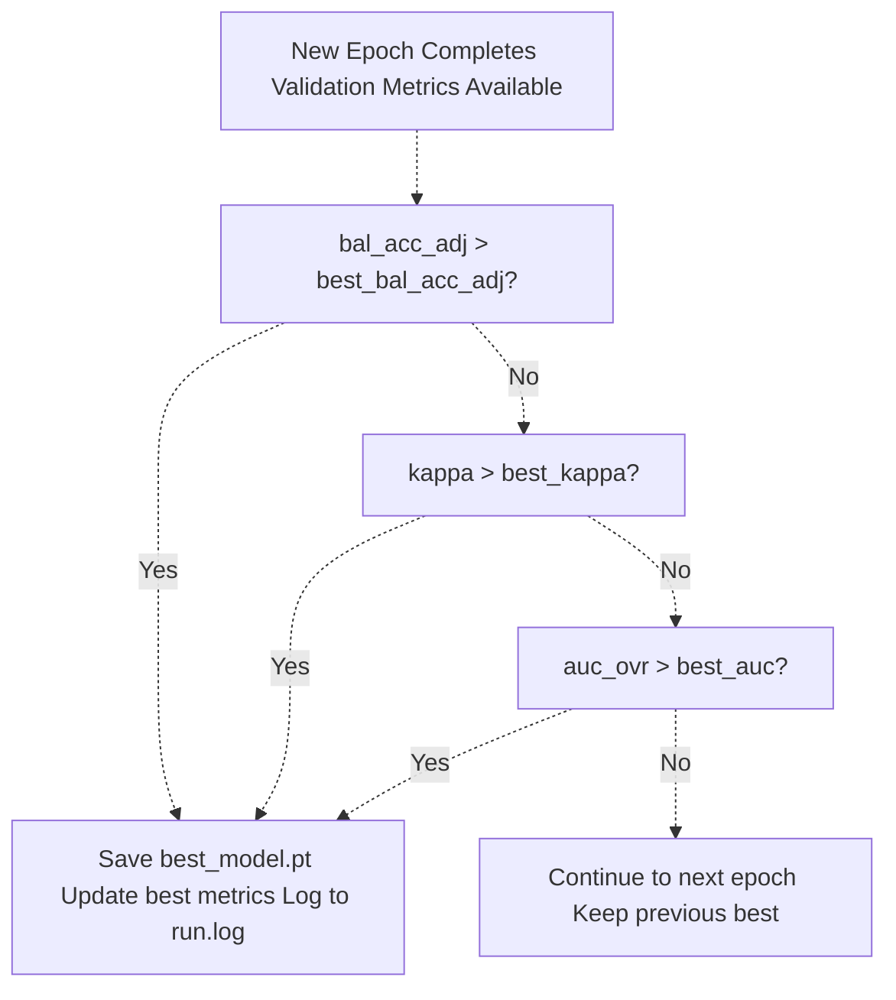
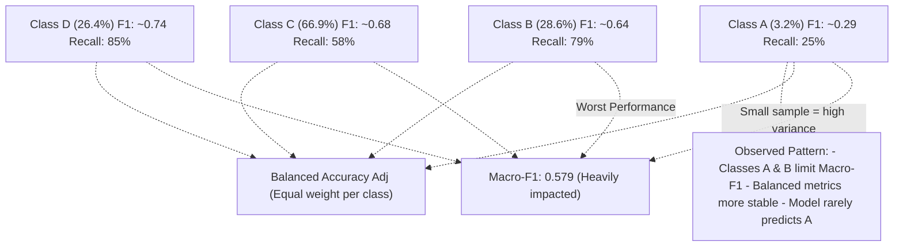

# Performance Metrics

> **Relevant source files**
> * [Article/02-density.md](https://github.com/ThalesMMS/mammography-pipelines/blob/01443313/Article/02-density.md)
> * [Article/article.md](https://github.com/ThalesMMS/mammography-pipelines/blob/01443313/Article/article.md)

## Purpose and Scope

This page documents the performance metrics used to evaluate density classification models in the mammography-pipelines system. It explains the rationale for choosing each metric, particularly in the context of imbalanced datasets, and describes how metrics are computed, logged, and used for model selection.

For information about training history and convergence analysis, see [Training History and Convergence](5d%20Training-History-and-Convergence.md). For confusion matrices and per-class performance breakdown, see [Confusion Matrices and Per-Class Analysis](5b%20Confusion-Matrices-and-Per-Class-Analysis.md).

## Overview of Metrics

The system employs five primary metrics to provide a comprehensive evaluation of model performance, especially critical for the imbalanced breast density classification task:

| Metric | Purpose | Key Characteristic |
| --- | --- | --- |
| **Accuracy** | Overall correctness | Baseline metric, biased toward majority classes |
| **Balanced Accuracy Adjusted** | Chance-corrected balanced performance | Accounts for class imbalance and random guessing |
| **Cohen's Kappa (κ)** | Agreement beyond chance | Quadratic weighting for ordinal classes (A→B→C→D) |
| **Macro-F1** | Per-class harmonic mean | Equal weight to minority classes |
| **AUC (OvR)** | Discriminative ability | One-vs-Rest multi-class extension |

**Sources:** [Article/02-density.md L39-L44](https://github.com/ThalesMMS/mammography-pipelines/blob/01443313/Article/02-density.md#L39-L44)

 [Article/article.md L87-L90](https://github.com/ThalesMMS/mammography-pipelines/blob/01443313/Article/article.md#L87-L90)

## Metric Computation Pipeline

The following diagram shows how metrics flow through the evaluation system, from model predictions to final aggregated statistics:



**Sources:** [Article/02-density.md L19-L20](https://github.com/ThalesMMS/mammography-pipelines/blob/01443313/Article/02-density.md#L19-L20)

 [Article/article.md L120-L123](https://github.com/ThalesMMS/mammography-pipelines/blob/01443313/Article/article.md#L120-L123)

## Accuracy

**Definition:** Fraction of correctly classified samples across all classes.

**Formula:**

```
Accuracy = (TP + TN) / (TP + TN + FP + FN)
```

For multi-class: `Accuracy = Number of correct predictions / Total predictions`

**Characteristics:**

* Simple and interpretable baseline metric
* **Misleading for imbalanced datasets**: A classifier predicting only the majority class can achieve high accuracy
* In the IRMA dataset, where class distribution is [A: 3.2%, B: 28.6%, C: 66.9%, D: 26.4%], a naive classifier always predicting class C would achieve ~67% accuracy

**Typical Values:**

* IRMA 4-class: 67.6% - 73.3% across seeds
* IRMA binary (AB vs CD): 85.9% - 93.5%

**Sources:** [Article/02-density.md L39-L44](https://github.com/ThalesMMS/mammography-pipelines/blob/01443313/Article/02-density.md#L39-L44)

 [Article/article.md L38-L43](https://github.com/ThalesMMS/mammography-pipelines/blob/01443313/Article/article.md#L38-L43)

## Balanced Accuracy Adjusted

**Definition:** Chance-corrected average of per-class recalls, adjusted to range from 0 (random) to 1 (perfect).

**Formula:**

```
Balanced Accuracy = (Recall_class1 + Recall_class2 + ... + Recall_classN) / N

Balanced Accuracy Adjusted = (Balanced Accuracy - 1/N) / (1 - 1/N)
```

Where N is the number of classes. For 4-class classification:

```
BAA = (BA - 0.25) / 0.75
```

**Characteristics:**

* Treats all classes equally regardless of their frequency
* Adjusted version normalizes to [0, 1] where 0 represents random guessing
* **Primary metric for model selection** in this codebase (highest priority in checkpoint selection)
* Robust to class imbalance

**Model Selection Criteria:**
The system uses a hierarchical selection: `bal_acc_adj > kappa > AUC` when choosing the best checkpoint.

**Sources:** [Article/article.md L88-L90](https://github.com/ThalesMMS/mammography-pipelines/blob/01443313/Article/article.md#L88-L90)

 [Article/article.md L120-L123](https://github.com/ThalesMMS/mammography-pipelines/blob/01443313/Article/article.md#L120-L123)

## Cohen's Kappa (κ)

**Definition:** Measure of inter-rater agreement that accounts for agreement occurring by chance, with quadratic weighting for ordinal classes.

**Formula:**

```yaml
κ = (p_o - p_e) / (1 - p_e)

where:
  p_o = observed agreement (accuracy)
  p_e = expected agreement by chance
```

For **quadratic weighted kappa** (used for ordinal classes like BI-RADS density):

```
Weight matrix: w_ij = 1 - ((i - j) / (k - 1))^2
```

This means:

* Confusing class A with B (adjacent): small penalty
* Confusing class A with D (distant): large penalty

**Characteristics:**

* Ranges from -1 (total disagreement) to +1 (perfect agreement), with 0 being chance agreement
* Quadratic weighting reflects the ordinal nature of BI-RADS categories (A < B < C < D)
* More interpretable than raw accuracy for imbalanced datasets
* Common in medical imaging where classes have natural ordering

**Typical Values:**

* IRMA 4-class: κ = 0.666 - 0.756 across seeds
* IRMA 4-class CV: κ = 0.666 ± 0.020 (3-fold)
* Historical best: κ = 0.855 (balanced dataset)

**Interpretation Scale:**

* κ < 0.20: Slight agreement
* 0.21 - 0.40: Fair agreement
* 0.41 - 0.60: Moderate agreement
* 0.61 - 0.80: Substantial agreement
* 0.81 - 1.00: Almost perfect agreement

**Sources:** [Article/02-density.md L39-L44](https://github.com/ThalesMMS/mammography-pipelines/blob/01443313/Article/02-density.md#L39-L44)

 [Article/article.md L89](https://github.com/ThalesMMS/mammography-pipelines/blob/01443313/Article/article.md#L89-L89)

 [Article/article.md L267-L272](https://github.com/ThalesMMS/mammography-pipelines/blob/01443313/Article/article.md#L267-L272)

## Macro-F1 Score

**Definition:** Arithmetic mean of per-class F1 scores, giving equal weight to each class.

**Formula:**

```python
For each class i:
  Precision_i = TP_i / (TP_i + FP_i)
  Recall_i = TP_i / (TP_i + FN_i)
  F1_i = 2 * (Precision_i * Recall_i) / (Precision_i + Recall_i)

Macro-F1 = (F1_1 + F1_2 + ... + F1_N) / N
```

**Characteristics:**

* Harmonic mean of precision and recall for each class, then averaged
* **Highly sensitive to minority class performance**: Poor performance on even one class significantly lowers the score
* Useful for identifying models that ignore minority classes
* In this dataset, classes A and B (minority classes) consistently limit Macro-F1 to ~0.58

**Typical Values:**

* IRMA 4-class: 0.564 - 0.588 across seeds
* IRMA 4-class CV: 0.592 ± 0.036 (3-fold)
* Limited by poor recall on classes 1 and 2

**Example Breakdown (Seed 42):**

| Class | Precision | Recall | F1-Score | Impact on Macro-F1 |
| --- | --- | --- | --- | --- |
| A (1) | Low | Low | ~0.29 | Pulls down average |
| B (2) | Medium | Medium | ~0.64 | Moderate contribution |
| C (3) | High | Medium | ~0.68 | Good contribution |
| D (4) | High | High | ~0.74 | Best contribution |

**Sources:** [Article/02-density.md L39-L44](https://github.com/ThalesMMS/mammography-pipelines/blob/01443313/Article/02-density.md#L39-L44)

 [Article/02-density.md L48](https://github.com/ThalesMMS/mammography-pipelines/blob/01443313/Article/02-density.md#L48-L48)

 [Article/article.md L361-L372](https://github.com/ThalesMMS/mammography-pipelines/blob/01443313/Article/article.md#L361-L372)

## AUC (Area Under ROC Curve)

**Definition:** Area under the Receiver Operating Characteristic curve, measuring the model's ability to discriminate between classes across all classification thresholds.

**Multi-class Extension:** One-vs-Rest (OvR)

```python
For each class i:
  AUC_i = Area under ROC curve for (class i vs all other classes)

AUC_OvR = (AUC_1 + AUC_2 + ... + AUC_N) / N
```

**Characteristics:**

* Ranges from 0 to 1, with 0.5 being random guessing
* **Threshold-independent**: Measures discriminative ability regardless of decision threshold
* Requires predicted probabilities (softmax outputs), not just predicted labels
* More robust to class imbalance than accuracy
* High AUC indicates good separation between classes in probability space

**Typical Values:**

* IRMA 4-class: 0.896 - 0.922 across seeds
* IRMA 4-class CV: 0.878 ± 0.010 (3-fold)
* IRMA binary: 0.941 - 0.984

**Interpretation:**

* 0.9 - 1.0: Excellent discrimination
* 0.8 - 0.9: Good discrimination
* 0.7 - 0.8: Acceptable discrimination
* 0.6 - 0.7: Poor discrimination
* 0.5 - 0.6: Fail (barely better than random)

**Note:** This system achieves "excellent" discrimination (AUC > 0.9) despite moderate accuracy (~70%), indicating the model's probability estimates are well-calibrated and the challenge lies primarily in threshold selection and class overlap.

**Sources:** [Article/02-density.md L39-L44](https://github.com/ThalesMMS/mammography-pipelines/blob/01443313/Article/02-density.md#L39-L44)

 [Article/02-density.md L76-L84](https://github.com/ThalesMMS/mammography-pipelines/blob/01443313/Article/02-density.md#L76-L84)

## Metric Computation and Logging

The following diagram bridges natural language concepts to actual code entities responsible for computing and logging metrics:



**Sources:** [Article/02-density.md L19-L22](https://github.com/ThalesMMS/mammography-pipelines/blob/01443313/Article/02-density.md#L19-L22)

 [Article/02-density.md L76-L84](https://github.com/ThalesMMS/mammography-pipelines/blob/01443313/Article/02-density.md#L76-L84)

 [Article/article.md L120-L123](https://github.com/ThalesMMS/mammography-pipelines/blob/01443313/Article/article.md#L120-L123)

## Model Selection Strategy

The system employs a **hierarchical decision tree** for selecting the best model checkpoint during training:



**Priority Rationale:**

1. **Balanced Accuracy Adjusted (Highest Priority):** * Most robust to class imbalance * Chance-corrected * Ensures model doesn't collapse to majority class
2. **Cohen's Kappa (Secondary):** * Accounts for ordinal nature of BI-RADS classes * Penalizes distant misclassifications more heavily * Useful tiebreaker when balanced accuracy is similar
3. **AUC (Tertiary):** * Measures discriminative ability * Final tiebreaker if both primary metrics are similar

**Note:** Accuracy and Macro-F1 are logged but not used for checkpoint selection due to their limitations with imbalanced data.

**Sources:** [Article/article.md L120-L123](https://github.com/ThalesMMS/mammography-pipelines/blob/01443313/Article/article.md#L120-L123)

## Metrics for Imbalanced Datasets

The IRMA dataset exhibits significant class imbalance, making metric selection critical:

| Class | Label | Count | Percentage |
| --- | --- | --- | --- |
| A | 1 | 40 | 3.2% |
| B | 2 | 363 | 28.6% |
| C | 3 | 849 | 66.9% |
| D | 4 | 335 | 26.4% |

### Impact on Each Metric

| Metric | Imbalance Sensitivity | Why Chosen/Avoided |
| --- | --- | --- |
| Accuracy | **High** | Can be misleading; used for reporting only |
| Balanced Accuracy Adjusted | **Low** | Primary selection metric; equal weight per class |
| Cohen's Kappa | **Low** | Accounts for chance agreement; ordinal-aware |
| Macro-F1 | **Medium** | Exposes minority class failures; diagnostic only |
| AUC | **Low** | Threshold-independent; good for probability calibration |

### Class-Specific Performance Pattern

Typical performance degradation on minority classes:



**Sources:** [Article/article.md L38-L43](https://github.com/ThalesMMS/mammography-pipelines/blob/01443313/Article/article.md#L38-L43)

 [Article/article.md L361-L372](https://github.com/ThalesMMS/mammography-pipelines/blob/01443313/Article/article.md#L361-L372)

 [Article/02-density.md L48](https://github.com/ThalesMMS/mammography-pipelines/blob/01443313/Article/02-density.md#L48-L48)

## Cross-Validation Metric Aggregation

For k-fold cross-validation experiments, the system computes statistics across folds:

### Aggregation Formula

For each metric M:

```
M_mean = (M_fold1 + M_fold2 + ... + M_foldk) / k
M_std = sqrt(Σ(M_foldi - M_mean)^2 / k)
```

### Example: 3-Fold Cross-Validation Results

| Metric | Mean | Std Dev | Range |
| --- | --- | --- | --- |
| Accuracy | 0.659 | 0.024 | [0.635, 0.683] |
| κ (quadratic) | 0.666 | 0.020 | [0.646, 0.686] |
| Macro-F1 | 0.592 | 0.036 | [0.556, 0.628] |
| AUC (OvR) | 0.878 | 0.010 | [0.868, 0.888] |

**Interpretation:**

* **Low standard deviation in AUC (±0.010)**: Model's discriminative ability is consistent across folds
* **Higher standard deviation in Macro-F1 (±0.036)**: Minority class performance varies more due to small sample sizes
* **Moderate accuracy variation (±0.024)**: Reasonable stability for a 4-class imbalanced problem

### CV Summary File Structure

The `cv_summary.json` file contains:

```
{  "accuracy_mean": 0.659,  "accuracy_std": 0.024,  "kappa_mean": 0.666,  "kappa_std": 0.020,  "macro_f1_mean": 0.592,  "macro_f1_std": 0.036,  "auc_ovr_mean": 0.878,  "auc_ovr_std": 0.010,  "num_folds": 3,  "folds": [    {"fold": 1, "accuracy": 0.683, "kappa": 0.686, ...},    {"fold": 2, "accuracy": 0.659, "kappa": 0.666, ...},    {"fold": 3, "accuracy": 0.635, "kappa": 0.646, ...}  ]}
```

**Sources:** [Article/02-density.md L58-L86](https://github.com/ThalesMMS/mammography-pipelines/blob/01443313/Article/02-density.md#L58-L86)

## Reproducibility Across Seeds

The system uses multiple random seeds (42, 43, 44) to quantify result variability:

### Seed-Level Variability

| Metric | Seed 42 | Seed 43 | Seed 44 | Mean ± σ |
| --- | --- | --- | --- | --- |
| Accuracy | 0.676 | 0.733 | 0.679 | **0.696 ± 0.026** |
| κ (quadratic) | 0.697 | 0.756 | 0.710 | **0.721 ± 0.025** |
| Macro-F1 | 0.584 | 0.588 | 0.564 | **0.579 ± 0.011** |
| AUC (OvR) | 0.913 | 0.922 | 0.896 | **0.910 ± 0.010** |

**Key Observations:**

* **Macro-F1 has lowest relative variance**: Classes 1/2 consistently perform poorly
* **Seed 43 outperforms** across all metrics, but difference is within one standard deviation
* **Seed 42 chosen as reference**: Not because it's best, but for reproducibility consistency

### Comparison: Seeds vs Cross-Validation

| Metric | Seeds (μ ± σ) | CV 3-Fold (μ ± σ) | Alignment |
| --- | --- | --- | --- |
| Accuracy | 0.696 ± 0.026 | 0.659 ± 0.024 | CV slightly lower |
| κ | 0.721 ± 0.025 | 0.666 ± 0.020 | CV moderately lower |
| Macro-F1 | 0.579 ± 0.011 | 0.592 ± 0.036 | CV slightly higher |
| AUC | 0.910 ± 0.010 | 0.878 ± 0.010 | CV moderately lower |

**Interpretation:**

* CV uses only 12 epochs vs 20 for single seeds, explaining lower performance
* Variability magnitudes are comparable, validating robustness
* Both approaches confirm minority class challenge (Macro-F1 ~0.58-0.59)

**Sources:** [Article/02-density.md L35-L50](https://github.com/ThalesMMS/mammography-pipelines/blob/01443313/Article/02-density.md#L35-L50)

 [Article/02-density.md L76-L84](https://github.com/ThalesMMS/mammography-pipelines/blob/01443313/Article/02-density.md#L76-L84)

## Metrics Export and Reporting

### Export Command

The `mammography eval-export` command consolidates metrics from completed runs:

```
mammography eval-export --run outputs/mammo_efficientnetb0_density/results_4
```

**Output:** Generates consolidated metric reports suitable for:

* Comparison tables across experiments
* Statistical analysis scripts
* LaTeX table generation (via `report-pack`)

### Report Pack Integration

The `mammography report-pack` command automatically extracts best metrics and generates:

* Metric tables for `Article/sections/density_model.tex`
* Training curves: `Article/assets/density_train_seed*.png`
* Confusion matrices: `Article/assets/density_confusion_seed*.png`

**Sources:** [Article/02-density.md L21-L22](https://github.com/ThalesMMS/mammography-pipelines/blob/01443313/Article/02-density.md#L21-L22)

 [Article/02-density.md L50](https://github.com/ThalesMMS/mammography-pipelines/blob/01443313/Article/02-density.md#L50-L50)

## Summary: Metric Selection Guidelines

| Use Case | Recommended Metrics | Rationale |
| --- | --- | --- |
| **Model Selection** | Balanced Accuracy Adjusted → Kappa → AUC | Hierarchical, robust to imbalance |
| **Reporting (Official)** | All five metrics | Comprehensive view |
| **Class Balance Check** | Macro-F1 + per-class recall | Exposes minority class failures |
| **Discriminative Power** | AUC | Threshold-independent |
| **Clinical Interpretation** | Kappa (quadratic) | Penalizes distant errors (A→D worse than A→B) |
| **Baseline Comparison** | Accuracy | Only if classes are balanced |

**Critical Insight:** On the IRMA dataset with 3.2% class A samples, models can achieve:

* High accuracy (~70%) by mostly predicting B/C/D
* High AUC (~0.91) with good probability separation
* Low Macro-F1 (~0.58) due to poor class A/B recall

This highlights why **Balanced Accuracy Adjusted** is the primary selection metric, ensuring the model performs reasonably across all classes rather than exploiting class imbalance.

**Sources:** [Article/article.md L87-L90](https://github.com/ThalesMMS/mammography-pipelines/blob/01443313/Article/article.md#L87-L90)

 [Article/article.md L120-L123](https://github.com/ThalesMMS/mammography-pipelines/blob/01443313/Article/article.md#L120-L123)

 [Article/02-density.md L48](https://github.com/ThalesMMS/mammography-pipelines/blob/01443313/Article/02-density.md#L48-L48)


### On this page

* [Performance Metrics](#5.1-performance-metrics)
* [Purpose and Scope](#5.1-purpose-and-scope)
* [Overview of Metrics](#5.1-overview-of-metrics)
* [Metric Computation Pipeline](#5.1-metric-computation-pipeline)
* [Accuracy](#5.1-accuracy)
* [Balanced Accuracy Adjusted](#5.1-balanced-accuracy-adjusted)
* [Cohen's Kappa (κ)](#5.1-cohens-kappa-)
* [Macro-F1 Score](#5.1-macro-f1-score)
* [AUC (Area Under ROC Curve)](#5.1-auc-area-under-roc-curve)
* [Metric Computation and Logging](#5.1-metric-computation-and-logging)
* [Model Selection Strategy](#5.1-model-selection-strategy)
* [Metrics for Imbalanced Datasets](#5.1-metrics-for-imbalanced-datasets)
* [Impact on Each Metric](#5.1-impact-on-each-metric)
* [Class-Specific Performance Pattern](#5.1-class-specific-performance-pattern)
* [Cross-Validation Metric Aggregation](#5.1-cross-validation-metric-aggregation)
* [Aggregation Formula](#5.1-aggregation-formula)
* [Example: 3-Fold Cross-Validation Results](#5.1-example-3-fold-cross-validation-results)
* [CV Summary File Structure](#5.1-cv-summary-file-structure)
* [Reproducibility Across Seeds](#5.1-reproducibility-across-seeds)
* [Seed-Level Variability](#5.1-seed-level-variability)
* [Comparison: Seeds vs Cross-Validation](#5.1-comparison-seeds-vs-cross-validation)
* [Metrics Export and Reporting](#5.1-metrics-export-and-reporting)
* [Export Command](#5.1-export-command)
* [Report Pack Integration](#5.1-report-pack-integration)
* [Summary: Metric Selection Guidelines](#5.1-summary-metric-selection-guidelines)

Ask Devin about mammography-pipelines