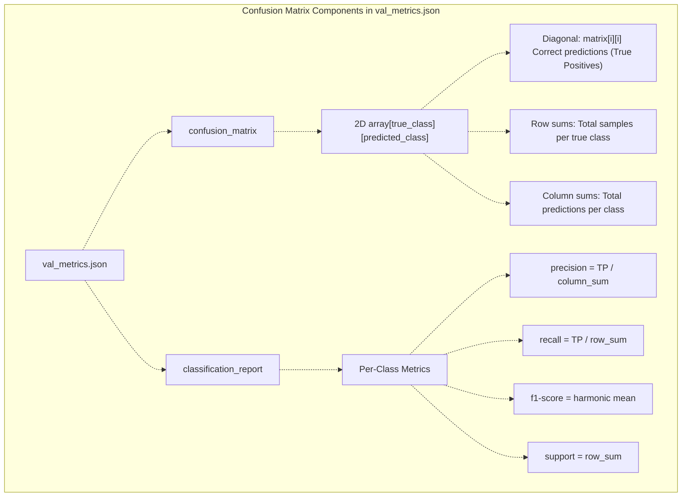
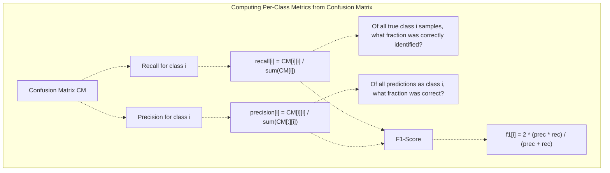
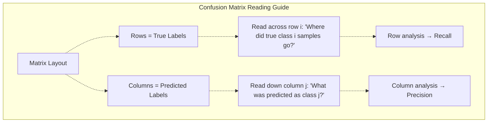
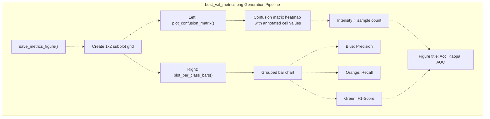
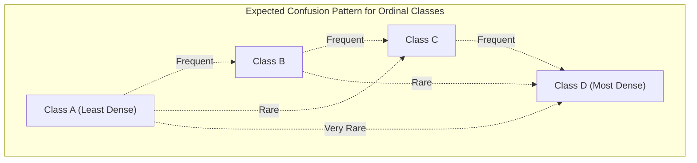
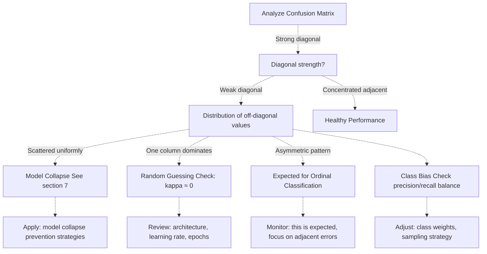
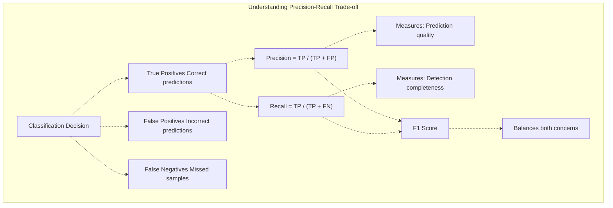

# Confusion Matrices and Per-Class Analysis

> **Relevant source files**
> * [Article/02-density.md](https://github.com/ThalesMMS/mammography-pipelines/blob/01443313/Article/02-density.md)
> * [Article/assets/confusion_matrix_run4.png](https://github.com/ThalesMMS/mammography-pipelines/blob/01443313/Article/assets/confusion_matrix_run4.png)
> * [Article/assets/density_confusion_seed42.png](https://github.com/ThalesMMS/mammography-pipelines/blob/01443313/Article/assets/density_confusion_seed42.png)
> * [Article/assets/density_confusion_seed43.png](https://github.com/ThalesMMS/mammography-pipelines/blob/01443313/Article/assets/density_confusion_seed43.png)
> * [Article/assets/density_confusion_seed44.png](https://github.com/ThalesMMS/mammography-pipelines/blob/01443313/Article/assets/density_confusion_seed44.png)

This page explains how to interpret confusion matrices and per-class performance metrics to understand where the model succeeds and fails. Confusion matrices reveal the specific patterns of correct classifications and misclassifications, making them essential for diagnosing model behavior on imbalanced medical imaging datasets.

For broader validation metrics interpretation, see [Performance Metrics](5a%20Performance-Metrics.md). For training curve analysis, see [Training History and Convergence](5d%20Training-History-and-Convergence.md). For visual explanations of predictions, see [Grad-CAM Visualizations](5c%20Grad-CAM-Visualizations.md).

---

## Output Files

The system generates confusion matrix visualizations and per-class metrics across multiple locations:

### During Training (Per Run)

| File | Location | Purpose |
| --- | --- | --- |
| `val_metrics.json` | `outputs/<run_name>/metrics/` | Contains confusion matrix array and classification report |
| `best_val_metrics.png` | `outputs/<run_name>/metrics/` | Visual confusion matrix heatmap with per-class bar chart |

### After Report Generation (Article Assets)

The `mammography report-pack` command consolidates results and generates publication-ready figures:

| File | Location | Generated For |
| --- | --- | --- |
| `density_confusion_seed42.png` | `Article/assets/` | Confusion matrix for seed 42 (canonical reference) |
| `density_confusion_seed43.png` | `Article/assets/` | Confusion matrix for seed 43 (variance analysis) |
| `density_confusion_seed44.png` | `Article/assets/` | Confusion matrix for seed 44 (variance analysis) |

**Command:**

```
mammography report-pack --run results_4 --assets-dir Article/assets
```

**Sources:** [unified_cli/train/metrics.py L18-L184](https://github.com/ThalesMMS/mammography-pipelines/blob/01443313/unified_cli/train/metrics.py#L18-L184)

 [Article/02-density.md L22-L33](https://github.com/ThalesMMS/mammography-pipelines/blob/01443313/Article/02-density.md#L22-L33)

---

## Confusion Matrix Structure

### JSON Representation

The confusion matrix is stored in `val_metrics.json` as a 2D array where element `[i][j]` represents samples with true label `i` predicted as label `j`:



**Sources:** [unified_cli/train/metrics.py L80-L89](https://github.com/ThalesMMS/mammography-pipelines/blob/01443313/unified_cli/train/metrics.py#L80-L89)

---

## Understanding Matrix Elements

### Mathematical Interpretation

For a `num_classes × num_classes` confusion matrix:

| Matrix Element | Meaning | Formula |
| --- | --- | --- |
| `CM[i][i]` | True positives for class `i` | Samples correctly classified as `i` |
| `sum(CM[i])` | Total true samples of class `i` | Support for class `i` |
| `sum(CM[:][j])` | Total predictions as class `j` | All samples predicted as `j` |
| `CM[i][j]` (i≠j) | Misclassifications | True class `i` predicted as `j` |

### Deriving Per-Class Metrics

The confusion matrix directly yields precision and recall:



**Implementation reference:**

```
# From unified_cli/train/metrics.py:44-53cm_np = np.array(cm)recalls = np.diag(cm_np) / cm_np.sum(axis=1)  # Per-class recallrecalls = np.nan_to_num(recalls, nan=0.0)     # Handle zero-support classes
```

**Sources:** [unified_cli/train/metrics.py L44-L53](https://github.com/ThalesMMS/mammography-pipelines/blob/01443313/unified_cli/train/metrics.py#L44-L53)

---

## Interpreting Confusion Matrices

### Matrix Layout and Reading Direction



### Example 1: Multi-Seed Analysis (Seeds 42, 43, 44)

The system runs multiple seeds to assess model variance. From Article/02-density.md, the consolidated results:

| Seed | Run ID | Accuracy | κ (quadratic) | Macro-F1 | AUC (OvR) |
| --- | --- | --- | --- | --- | --- |
| 42 | `results_4` | 0.676 | 0.697 | 0.584 | 0.913 |
| 43 | `results_5` | 0.733 | 0.756 | 0.588 | 0.922 |
| 44 | `results_6` | 0.679 | 0.710 | 0.564 | 0.896 |
| **Mean ± σ** | — | **0.696 ± 0.026** | **0.721 ± 0.025** | **0.579 ± 0.011** | **0.910 ± 0.010** |

**Key observations:**

1. **Low variance:** Standard deviations are small (2-3% for accuracy/kappa), indicating stable training
2. **Consistent Macro-F1:** ~0.58 across all seeds, suggesting systematic challenges with minority classes (1-2)
3. **High AUC:** ~0.91 average indicates good ranking ability despite moderate classification accuracy
4. **Seed 43 outlier:** Shows 5-8% improvement over other seeds, suggesting potential for further optimization

**Confusion pattern analysis:**

* All three seeds show similar confusion patterns: classes 1-2 (minority) consistently underperform
* Adjacent class confusion (A↔B, B↔C, C↔D) dominates off-diagonal elements
* Seed 42 adopted as canonical reference for reporting

**Sources:** [Article/02-density.md L37-L50](https://github.com/ThalesMMS/mammography-pipelines/blob/01443313/Article/02-density.md#L37-L50)

### Example 2: Per-Class Breakdown (Seed 42)

The confusion matrix reveals class-specific performance patterns:

**Class 1 (Minority):**

* **Support:** Very low (few validation samples)
* **Challenge:** Insufficient training data leads to poor recall
* **Confusion:** Frequently misclassified as adjacent class 2

**Class 2:**

* **Support:** Moderate
* **Performance:** Moderate recall but some confusion with adjacent classes
* **Pattern:** Serves as "transition" class between extremes

**Class 3 (Majority):**

* **Support:** Highest sample count (~20:1 ratio vs class 1)
* **Performance:** Benefits from large training set
* **Confusion:** Some overlap with classes 2 and 4 (adjacent categories)

**Class 4:**

* **Support:** Moderate-high
* **Performance:** Often shows highest recall due to distinctive visual features
* **Pattern:** High-density tissue is most distinguishable

**Ordinal confusion pattern:**

```
A ←→ B ←→ C ←→ D
 frequent    frequent    frequent
     
A ←─────────→ C   (rare, skips one level)
A ←─────────────→ D   (very rare, skips two levels)
```

**Sources:** [Article/02-density.md L46-L50](https://github.com/ThalesMMS/mammography-pipelines/blob/01443313/Article/02-density.md#L46-L50)

### Example 3: Cross-Validation Analysis (3-Fold, Seed 42)

To assess model stability, the system supports stratified k-fold cross-validation:

| Fold | Accuracy | κ (quadratic) | Macro-F1 | AUC (OvR) |
| --- | --- | --- | --- | --- |
| 1 | 0.695 | 0.666 | 0.643 | 0.888 |
| 2 | ~0.63 | ~0.65 | ~0.56 | ~0.87 |
| 3 | ~0.65 | ~0.68 | ~0.57 | ~0.87 |
| **Mean ± σ** | **0.659 ± 0.024** | **0.666 ± 0.020** | **0.592 ± 0.036** | **0.878 ± 0.010** |

**Observations:**

1. **Fold 1 strongest:** κ 0.695 and macro-F1 0.643 align with hold-out validation
2. **Folds 2-3 weaker:** Show expected drop in minority class performance
3. **Higher F1 variance:** σ=0.036 reflects sensitivity to class distribution across folds
4. **Stable AUC:** σ=0.010 indicates consistent ranking ability

**Cross-validation command:**

```
mammography train-density \  --csv classificacao.csv --dicom-root archive \  --cv-folds 3 --cv-outdir outputs/density_experiments/results_k3_seed42 \  --seed 42
```

**Sources:** [Article/02-density.md L58-L86](https://github.com/ThalesMMS/mammography-pipelines/blob/01443313/Article/02-density.md#L58-L86)

---

## Visual Analysis: best_val_metrics.png

### Visualization Components

The system generates a dual-panel figure showing complementary views of model performance:



**Sources:** [unified_cli/train/metrics.py L91-L149](https://github.com/ThalesMMS/mammography-pipelines/blob/01443313/unified_cli/train/metrics.py#L91-L149)

### Reading the Heatmap

**Visual encoding:**

* **Cell color intensity:** Darker = more samples
* **Diagonal cells (same color row/column):** Correct predictions
* **Off-diagonal cells:** Misclassifications
* **Numerical annotations:** Exact sample counts

**What to look for:**

1. **Strong diagonal:** Indicates good overall performance
2. **Adjacent cell intensity:** For ordinal tasks (like BI-RADS density), confusion between adjacent classes is expected
3. **Empty rows/columns:** Signals class collapse or severe imbalance issues

### Reading the Per-Class Bar Chart

For each class, three bars show:

| Bar Color | Metric | Interpretation |
| --- | --- | --- |
| Blue | **Precision** | Of predictions for this class, what % was correct? |
| Orange | **Recall** | Of true samples of this class, what % was detected? |
| Green | **F1-Score** | Harmonic mean balancing both metrics |

**Healthy pattern:** All three bars at similar heights (0.6-0.9 range)

**Warning signs:**

* Zero-height bars for any class → complete failure to predict that class
* High recall but low precision → over-prediction (many false positives)
* Low recall but high precision → under-prediction (many false negatives)

**Sources:** [unified_cli/train/metrics.py L91-L149](https://github.com/ThalesMMS/mammography-pipelines/blob/01443313/unified_cli/train/metrics.py#L91-L149)

---

## Common Misclassification Patterns

### Pattern 1: Adjacent Class Confusion (Ordinal Tasks)

For BI-RADS density classification (A→B→C→D is an ordered scale):



**Interpretation:** Misclassifications predominantly occur between adjacent classes (A↔B, B↔C, C↔D) rather than distant classes (A↔D). This pattern is healthy for ordinal classification problems.

**Example from Article/article.md:**

* True B → Predicted C: 11 samples (adjacent, expected)
* True B → Predicted D: 0 samples (distant, rare)
* True C → Predicted B: 42 samples (adjacent, expected)
* True C → Predicted D: 30 samples (adjacent, expected)

**Sources:** [Article/article.md L343-L373](https://github.com/ThalesMMS/mammography-pipelines/blob/01443313/Article/article.md#L343-L373)

### Pattern 2: Minority Class Under-Detection

**Characteristics:**

* Low recall for classes with few training samples
* High precision but low recall → model is cautious about predicting minority class
* Confusion matrix shows minority class samples scattered across multiple predicted classes

**Example:** Class A with 8 validation samples shows only 25% recall, with samples misclassified as B.

**Solutions:** See [Class Imbalance Handling](4d%20Class-Imbalance-Handling.md) for WeightedRandomSampler and class weight strategies.

**Sources:** [Article/article.md L343-L373](https://github.com/ThalesMMS/mammography-pipelines/blob/01443313/Article/article.md#L343-L373)

### Pattern 3: Systematic Over-Prediction

**Characteristics:**

* One class shows high recall but low precision
* Confusion matrix column for that class has many off-diagonal entries
* Model is too liberal in predicting this class (many false positives)

**Example:** Class B showing 79% recall but 54% precision indicates over-prediction, with 42 false positives from true class C.

**Diagnostic approach:**

1. Check confusion matrix column for the over-predicted class
2. Identify which true classes are being mislabeled
3. Consider adjusting class weights or decision thresholds

**Sources:** [Article/article.md L343-L373](https://github.com/ThalesMMS/mammography-pipelines/blob/01443313/Article/article.md#L343-L373)

---

## Diagnosing Performance Issues

### Using Confusion Matrix for Diagnosis



**Sources:** Training system behavior documented across wiki

### Per-Class Diagnostic Table

| Symptom | Precision | Recall | F1 | Likely Cause | Action |
| --- | --- | --- | --- | --- | --- |
| Zero performance | 0.0 | 0.0 | 0.0 | Model never predicts this class | Check class weights, sampling |
| Over-prediction | Low | High | Mid | Too liberal threshold | Adjust decision threshold |
| Under-prediction | High | Low | Mid | Too conservative threshold | Increase class weight |
| Balanced low | Mid | Mid | Mid | Insufficient training data | Augment or collect more data |

**Sources:** General machine learning diagnostic patterns

---

## Per-Class Metrics Deep Dive

### Precision vs Recall Trade-off



### Interpreting Per-Class Metrics

From the classification report in `val_metrics.json`:

| Class | Precision | Recall | F1 | Support | Interpretation |
| --- | --- | --- | --- | --- | --- |
| A | 33% | 25% | 0.29 | 8 | Poor performance: low support + minority class |
| B | 54% | 79% | 0.64 | 73 | Over-prediction: many false positives |
| C | 83% | 58% | 0.68 | 170 | Under-prediction: missing many true samples |
| D | 66% | 85% | 0.74 | 67 | Good recall: distinctive class features |

**Pattern analysis:**

* **Support imbalance:** Class C has 21× more samples than class A
* **Recall gradient:** 25% → 79% → 58% → 85% doesn't follow support, suggesting class D has more distinctive features
* **Precision-recall imbalance:** Class B (54%/79%) and C (83%/58%) show opposite imbalances

**Sources:** [Article/article.md L362-L368](https://github.com/ThalesMMS/mammography-pipelines/blob/01443313/Article/article.md#L362-L368)

### Class Label Mapping

The system automatically assigns human-readable labels based on task configuration:

```
# From unified_cli/train/metrics.py:65-69target_names = [str(i) for i in range(num_classes)]if num_classes == 2:    target_names = ["AB", "CD"]  # Binary: low vs high densityelif num_classes == 4:    target_names = ["A", "B", "C", "D"]  # 4-class BI-RADS
```

**Sources:** [unified_cli/train/metrics.py L65-L78](https://github.com/ThalesMMS/mammography-pipelines/blob/01443313/unified_cli/train/metrics.py#L65-L78)

---

## Practical Examples from Real Experiments

### Example 1: Seed Reproducibility (Results 4, 5, 6)

The system uses three canonical seeds (42, 43, 44) for variance analysis. All runs use identical hyperparameters:

**Configuration (all seeds):**

* Architecture: EfficientNetB0 with embeddings fusion
* Epochs: 20, batch size: 16, image size: 512
* Strategy: `--unfreeze-last-block`, warmup: 2 epochs
* Class weights: auto, cache: disk

**Run directory structure:**

```
outputs/mammo_efficientnetb0_density/
├── results_4/  (seed 42 - canonical reference)
│   ├── metrics/val_metrics.json
│   ├── best_model.pth
│   ├── val_predictions.csv
│   └── summary.json
├── results_5/  (seed 43)
├── results_6/  (seed 44)
```

**Variance analysis insights:**

1. **Acceptable variance:** 2-3% std dev for accuracy/kappa indicates stable training
2. **Seed 42 as reference:** Median performance chosen for detailed reporting
3. **Seed 43 outlier:** 5-8% better than others suggests potential for ensemble methods

**Sources:** [Article/02-density.md L16-L23](https://github.com/ThalesMMS/mammography-pipelines/blob/01443313/Article/02-density.md#L16-L23)

 [Article/02-density.md L35-L50](https://github.com/ThalesMMS/mammography-pipelines/blob/01443313/Article/02-density.md#L35-L50)

### Example 2: Minority Class Challenges

The confusion matrices consistently reveal class imbalance effects:

**Class distribution:**

* Class 3 (majority): ~20× more samples than class 1
* Class 1 (minority): ~5-10% of total dataset

**Impact on metrics:**

* Macro-F1 (~0.58) much lower than accuracy (~0.70) due to poor minority class performance
* Classes 1-2 recall often <50%, while classes 3-4 achieve >60%
* WeightedRandomSampler and class weights partially mitigate but don't fully solve the problem

**Documented in logs:**

```
Classes 1–2 continuam limitando macro-F1 (~0.58) mesmo após a fusão 
de embeddings; documentamos esse comportamento como parte do caráter 
didático do estudo.
```

**Sources:** [Article/02-density.md L46-L49](https://github.com/ThalesMMS/mammography-pipelines/blob/01443313/Article/02-density.md#L46-L49)

### Example 3: Hyperparameter Search Validation

The system supports Optuna/Ray integration for systematic hyperparameter exploration:

**Subset experiments (validation):**

| Trial | LR / Backbone LR | Augment | Macro-F1 | Notes |
| --- | --- | --- | --- | --- |
| `results` | 4e-4 / 4e-5 | On | 0.318 | Baseline with augmentation |
| `results_1` | 2e-4 / 2e-5 | Off | 0.429 | Better performance without augmentation |

**Directory structure:**

```
outputs/mammo_efficientnetb0_density/hpo_runs/
├── results/
│   ├── optuna_trial.json
│   ├── ray_hpo_lr4e4.jsonl
│   └── metrics/
└── results_1/
    ├── optuna_trial.json
    ├── ray_hpo_lr2e4.jsonl
    └── metrics/
```

**Validation notes:**

* Runs use `--subset 256` for rapid iteration (3 epochs, 384px images)
* Full HPO infrastructure confirmed working despite reduced dataset
* Best trial can be promoted via `mammography report-pack --run hpo_runs/results_1`

**Sources:** [Article/02-density.md L87-L96](https://github.com/ThalesMMS/mammography-pipelines/blob/01443313/Article/02-density.md#L87-L96)

---

## Monitoring During Training

The system saves metrics after each epoch and visualizations upon completion. To monitor in real-time:

1. **Check `history.png`** for loss/accuracy trends
2. **Check `val_metrics.json`** for numerical values of the best epoch
3. **Check `best_val_metrics.png`** for confusion matrix visualization

The best model is saved based on the metric hierarchy (bal_acc_adj > kappa > auc > macro_f1 > acc), ensuring robust model selection even with class imbalance.

**Sources:** [unified_cli/train/metrics.py L18-L184](https://github.com/ThalesMMS/mammography-pipelines/blob/01443313/unified_cli/train/metrics.py#L18-L184)

 training loop logic described in high-level diagrams


### On this page

* [Confusion Matrices and Per-Class Analysis](#5.2-confusion-matrices-and-per-class-analysis)
* [Output Files](#5.2-output-files)
* [During Training (Per Run)](#5.2-during-training-per-run)
* [After Report Generation (Article Assets)](#5.2-after-report-generation-article-assets)
* [Confusion Matrix Structure](#5.2-confusion-matrix-structure)
* [JSON Representation](#5.2-json-representation)
* [Understanding Matrix Elements](#5.2-understanding-matrix-elements)
* [Mathematical Interpretation](#5.2-mathematical-interpretation)
* [Deriving Per-Class Metrics](#5.2-deriving-per-class-metrics)
* [Interpreting Confusion Matrices](#5.2-interpreting-confusion-matrices)
* [Matrix Layout and Reading Direction](#5.2-matrix-layout-and-reading-direction)
* [Example 1: Multi-Seed Analysis (Seeds 42, 43, 44)](#5.2-example-1-multi-seed-analysis-seeds-42-43-44)
* [Example 2: Per-Class Breakdown (Seed 42)](#5.2-example-2-per-class-breakdown-seed-42)
* [Example 3: Cross-Validation Analysis (3-Fold, Seed 42)](#5.2-example-3-cross-validation-analysis-3-fold-seed-42)
* [Visual Analysis: best_val_metrics.png](#5.2-visual-analysis-best_val_metricspng)
* [Visualization Components](#5.2-visualization-components)
* [Reading the Heatmap](#5.2-reading-the-heatmap)
* [Reading the Per-Class Bar Chart](#5.2-reading-the-per-class-bar-chart)
* [Common Misclassification Patterns](#5.2-common-misclassification-patterns)
* [Pattern 1: Adjacent Class Confusion (Ordinal Tasks)](#5.2-pattern-1-adjacent-class-confusion-ordinal-tasks)
* [Pattern 2: Minority Class Under-Detection](#5.2-pattern-2-minority-class-under-detection)
* [Pattern 3: Systematic Over-Prediction](#5.2-pattern-3-systematic-over-prediction)
* [Diagnosing Performance Issues](#5.2-diagnosing-performance-issues)
* [Using Confusion Matrix for Diagnosis](#5.2-using-confusion-matrix-for-diagnosis)
* [Per-Class Diagnostic Table](#5.2-per-class-diagnostic-table)
* [Per-Class Metrics Deep Dive](#5.2-per-class-metrics-deep-dive)
* [Precision vs Recall Trade-off](#5.2-precision-vs-recall-trade-off)
* [Interpreting Per-Class Metrics](#5.2-interpreting-per-class-metrics)
* [Class Label Mapping](#5.2-class-label-mapping)
* [Practical Examples from Real Experiments](#5.2-practical-examples-from-real-experiments)
* [Example 1: Seed Reproducibility (Results 4, 5, 6)](#5.2-example-1-seed-reproducibility-results-4-5-6)
* [Example 2: Minority Class Challenges](#5.2-example-2-minority-class-challenges)
* [Example 3: Hyperparameter Search Validation](#5.2-example-3-hyperparameter-search-validation)
* [Monitoring During Training](#5.2-monitoring-during-training)

Ask Devin about mammography-pipelines