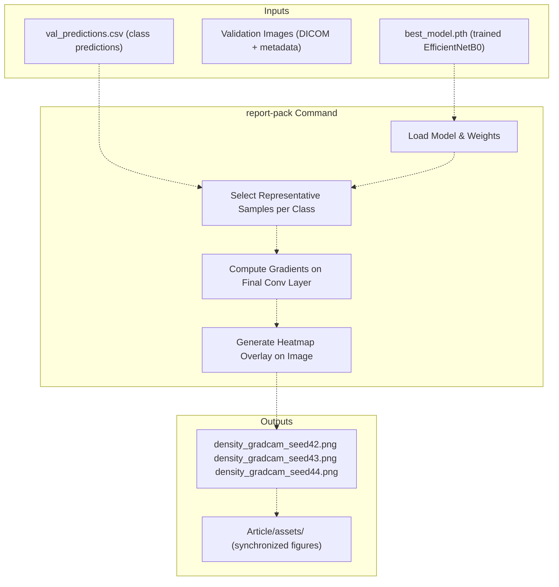
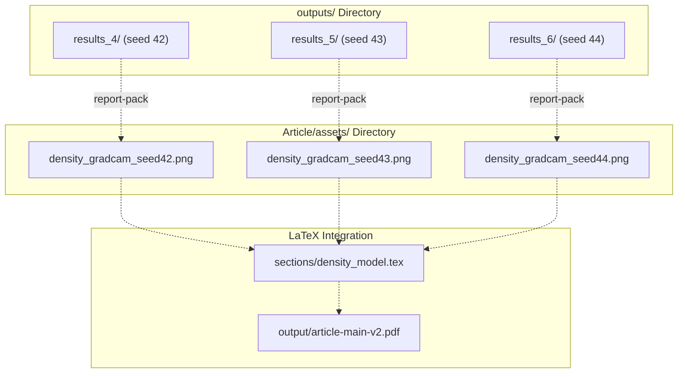
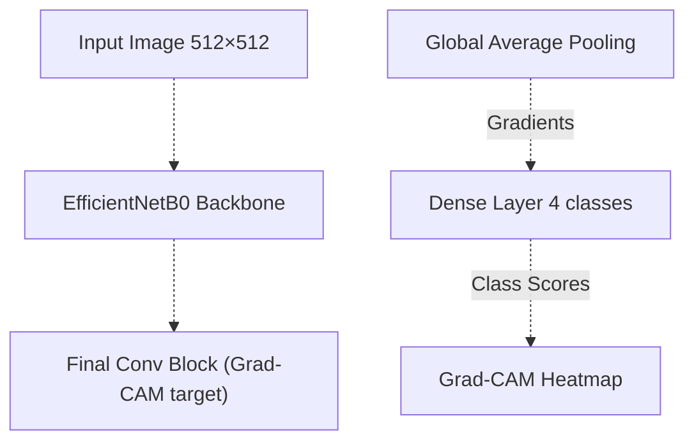
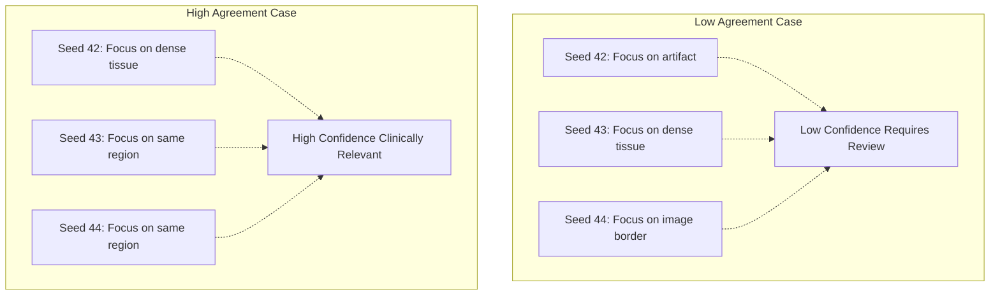
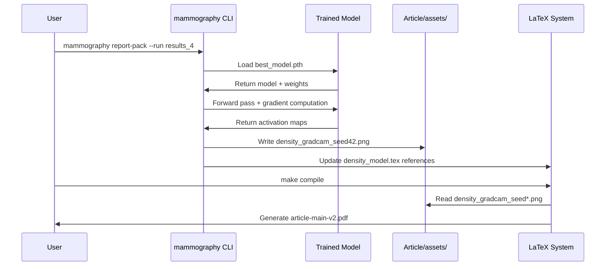
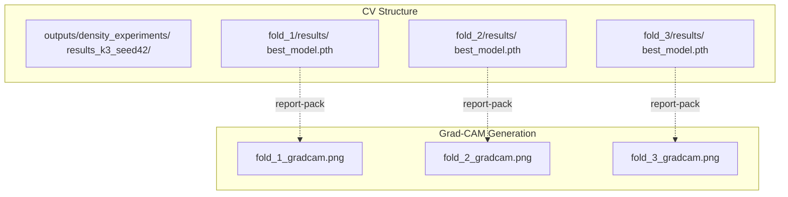

# Grad-CAM Visualizations

> **Relevant source files**
> * [Article/02-density.md](https://github.com/ThalesMMS/mammography-pipelines/blob/01443313/Article/02-density.md)
> * [Article/article.md](https://github.com/ThalesMMS/mammography-pipelines/blob/01443313/Article/article.md)
> * [Article/assets/density_gradcam_seed42.png](https://github.com/ThalesMMS/mammography-pipelines/blob/01443313/Article/assets/density_gradcam_seed42.png)
> * [Article/assets/density_gradcam_seed43.png](https://github.com/ThalesMMS/mammography-pipelines/blob/01443313/Article/assets/density_gradcam_seed43.png)
> * [Article/assets/density_gradcam_seed44.png](https://github.com/ThalesMMS/mammography-pipelines/blob/01443313/Article/assets/density_gradcam_seed44.png)

## Purpose and Scope

This page documents the Grad-CAM (Gradient-weighted Class Activation Mapping) visualization system for model interpretability in the density classification pipeline. Grad-CAM heatmaps highlight which regions of mammogram images the trained EfficientNetB0 model focuses on when making density predictions. For overall evaluation methodology, see [Performance Metrics](5a%20Performance-Metrics.md) and [Confusion Matrices and Per-Class Analysis](5b%20Confusion-Matrices-and-Per-Class-Analysis.md). For training convergence analysis, see [Training History and Convergence](5d%20Training-History-and-Convergence.md).

---

## What is Grad-CAM

Grad-CAM produces class-discriminative localization maps by computing the gradient of the predicted class score with respect to the final convolutional layer activations. The resulting heatmap overlays the original mammogram image, showing:

* **Hot regions (red/yellow)**: Areas the model strongly attends to for its prediction
* **Cool regions (blue/purple)**: Areas with minimal influence on the decision
* **Spatial resolution**: Which anatomical structures drive the classification

This technique enables clinicians and researchers to validate whether the model learns clinically meaningful features (e.g., fibroglandular tissue distribution) rather than spurious correlations.

---

## Generation Pipeline

Grad-CAM visualizations are generated as part of the automated report generation workflow through the `mammography report-pack` command:



**Grad-CAM Generation Workflow**

The generation process involves:

1. **Model Loading**: Restores the best checkpoint from training (selected via `--save-best` flag during training)
2. **Sample Selection**: Chooses representative validation images for each BI-RADS density class
3. **Gradient Computation**: Forward pass followed by backward pass to compute ∂y_c/∂A^k (gradient of class score with respect to feature maps)
4. **Heatmap Creation**: Weighted combination of feature maps using computed gradients
5. **Overlay Generation**: Superimposes heatmap on original mammogram with colormap

**Sources:** [Article/02-density.md L22-L33](https://github.com/ThalesMMS/mammography-pipelines/blob/01443313/Article/02-density.md#L22-L33)

 [Article/article.md L442](https://github.com/ThalesMMS/mammography-pipelines/blob/01443313/Article/article.md#L442-L442)

---

## Command Execution

Grad-CAM visualizations are automatically generated when running the report packaging command:

```
mammography report-pack -- \  --run results_4 \  --assets-dir Article/assets
```

Key parameters:

* `--run`: Specifies which training run to analyze (e.g., `results_4` for seed 42)
* `--assets-dir`: Output directory for generated figures
* Automatically processes all validation predictions and generates class-representative samples

The command regenerates Grad-CAMs whenever re-run, ensuring visualizations match the current model checkpoint. After re-training seeds 43 and 44 with the `--save-best` flag, the Grad-CAMs were regenerated to reflect the updated models.

**Sources:** [Article/02-density.md L22](https://github.com/ThalesMMS/mammography-pipelines/blob/01443313/Article/02-density.md#L22-L22)

---

## Output Structure

Grad-CAM visualizations follow a standardized naming and storage convention:



**File Organization and Naming**

| File Path | Description | Seed |
| --- | --- | --- |
| `Article/assets/density_gradcam_seed42.png` | Canonical reference visualization | 42 |
| `Article/assets/density_gradcam_seed43.png` | Variance analysis visualization | 43 |
| `Article/assets/density_gradcam_seed44.png` | Variance analysis visualization | 44 |

Each PNG file contains a grid layout showing multiple mammogram samples with their corresponding Grad-CAM overlays, typically organized by:

* **Rows**: Different BI-RADS density classes (1, 2, 3, 4)
* **Columns**: Multiple examples per class
* **Annotations**: Predicted class, ground truth label, and confidence score

**Sources:** [Article/02-density.md L31-L33](https://github.com/ThalesMMS/mammography-pipelines/blob/01443313/Article/02-density.md#L31-L33)

---

## Interpreting Visualizations

### Heatmap Color Coding

The Grad-CAM heatmaps use a color gradient to indicate attention strength:

| Color | Interpretation | Gradient Value |
| --- | --- | --- |
| **Red** | Highest attention - critical for classification | 1.0 |
| **Orange/Yellow** | Strong attention - important features | 0.6-0.9 |
| **Green** | Moderate attention - contributing features | 0.3-0.6 |
| **Blue** | Low attention - minimal influence | 0.1-0.3 |
| **Purple** | Negligible attention - ignored regions | 0.0-0.1 |

### Clinical Validation

For breast density classification, clinically meaningful Grad-CAM patterns should show:

**Class 1 (Almost Entirely Fatty):**

* Attention diffused across breast tissue
* Minimal focus on specific structures
* Low activation overall (mostly fatty tissue)

**Class 2 (Scattered Fibroglandular):**

* Focal attention on scattered dense regions
* Mixed activation patterns
* Some areas of high attention in fibroglandular zones

**Class 3 (Heterogeneously Dense):**

* Strong activation in dense tissue regions
* Heterogeneous distribution of hot spots
* Clear delineation between dense and fatty areas

**Class 4 (Extremely Dense):**

* Widespread high activation
* Extensive red/orange regions
* Global attention across most of the breast

### Architecture-Specific Considerations

The Grad-CAM implementation targets the final convolutional block of EfficientNetB0:



**Architecture Flow for Grad-CAM Generation**

The final convolutional block has spatial resolution sufficient to localize features while maintaining semantic richness from deep network layers.

**Sources:** [Article/article.md L51-L66](https://github.com/ThalesMMS/mammography-pipelines/blob/01443313/Article/article.md#L51-L66)

---

## Multi-Seed Analysis

The system generates Grad-CAM visualizations for three random seeds (42, 43, 44) to assess prediction consistency:

### Seed Comparison Table

| Metric | Seed 42 | Seed 43 | Seed 44 | Purpose |
| --- | --- | --- | --- | --- |
| Accuracy | 67.6% | 73.3% | 67.9% | Performance variance |
| Kappa | 0.697 | 0.756 | 0.710 | Agreement stability |
| Grad-CAM | Available | Available | Available | Attention consistency |

**Consistency Analysis Use Cases:**

1. **Cross-Seed Attention Patterns**: Compare whether different models (trained with different seeds) focus on the same anatomical regions
2. **Prediction Confidence**: Identify cases where all three seeds agree vs. disagree on classifications
3. **Spurious Correlations**: Detect if any seed learns non-clinical artifacts (e.g., image borders, annotations)
4. **Robustness Validation**: Verify that similar performance metrics correlate with similar attention patterns

### Variance Interpretation



**Cross-Seed Consistency Decision Tree**

Seed 42 serves as the canonical reference since it's the official reproducibility seed documented in the project. Seeds 43 and 44 are archived for historical reference and variance analysis.

**Sources:** [Article/02-density.md L17](https://github.com/ThalesMMS/mammography-pipelines/blob/01443313/Article/02-density.md#L17-L17)

 [Article/02-density.md L37-L44](https://github.com/ThalesMMS/mammography-pipelines/blob/01443313/Article/02-density.md#L37-L44)

---

## Integration with Article System

Grad-CAM visualizations integrate seamlessly into the automated documentation pipeline:



**Automated Report Generation Workflow**

### Synchronization Process

The `report-pack` command ensures tight coupling between experimental results and documentation:

1. **Asset Generation**: Creates/updates PNG files in `Article/assets/`
2. **LaTeX Integration**: Automatically references figures in `sections/density_model.tex`
3. **Version Control**: Maintains historical Grad-CAMs for all three seeds
4. **Reproducibility**: Re-running `report-pack` regenerates all visualizations consistently

### LaTeX References

The generated Grad-CAM images are referenced in the article markdown as:

```xml
- !<FileRef file-url="https://github.com/ThalesMMS/mammography-pipelines/blob/01443313/Grad-CAM seed 42" undefined  file-path="Grad-CAM seed 42">Hii</FileRef>- !<FileRef file-url="https://github.com/ThalesMMS/mammography-pipelines/blob/01443313/Grad-CAM seed 43" undefined  file-path="Grad-CAM seed 43">Hii</FileRef>- !<FileRef file-url="https://github.com/ThalesMMS/mammography-pipelines/blob/01443313/Grad-CAM seed 44" undefined  file-path="Grad-CAM seed 44">Hii</FileRef>
```

This markdown-first approach allows both direct viewing and LaTeX compilation for publication-quality PDFs.

**Sources:** [Article/02-density.md L24-L33](https://github.com/ThalesMMS/mammography-pipelines/blob/01443313/Article/02-density.md#L24-L33)

 [Article/02-density.md L50](https://github.com/ThalesMMS/mammography-pipelines/blob/01443313/Article/02-density.md#L50-L50)

---

## Technical Implementation Details

### Model Architecture Requirements

Grad-CAM generation requires access to:

| Component | Purpose | Layer Name |
| --- | --- | --- |
| **Final Conv Block** | Source of activation maps | EfficientNetB0 final block |
| **Forward Hook** | Capture activations during forward pass | Register on target layer |
| **Backward Hook** | Capture gradients during backprop | Register on target layer |
| **Classifier Output** | Class scores for gradient computation | Dense layer (4 outputs) |

### Checkpoint Loading

The system loads the best model checkpoint saved during training:

```markdown
outputs/mammo_efficientnetb0_density/
├── results_4/
│   ├── best_model.pth          # Model weights
│   ├── summary.json             # Hyperparameters + commit hash
│   ├── val_predictions.csv      # Predictions for sampling
│   └── metrics/
│       └── val_metrics.json     # Performance metrics
```

The `--save-best` flag during training ensures the checkpoint represents the epoch with optimal balanced accuracy adjusted metric.

**Sources:** [Article/02-density.md L22](https://github.com/ThalesMMS/mammography-pipelines/blob/01443313/Article/02-density.md#L22-L22)

 [Article/02-density.md L19-L20](https://github.com/ThalesMMS/mammography-pipelines/blob/01443313/Article/02-density.md#L19-L20)

---

## Relationship to Cross-Validation

When performing k-fold cross-validation, Grad-CAM visualizations can be generated for each fold:



**Cross-Validation Grad-CAM Structure**

However, the current implementation focuses on single hold-out validation sets (seeds 42, 43, 44) as the primary Grad-CAM source. Cross-validation Grad-CAMs would require specifying `--run outputs/density_experiments/results_k3_seed42/fold_1` to the `report-pack` command.

**Sources:** [Article/02-density.md L58-L86](https://github.com/ThalesMMS/mammography-pipelines/blob/01443313/Article/02-density.md#L58-L86)

---

## Limitations and Future Work

### Current Limitations

1. **Sample Selection**: Grad-CAM generation uses a subset of validation images rather than exhaustive coverage
2. **Class Imbalance**: Classes 1 and 2 have limited examples, potentially affecting representative sample selection
3. **Spatial Resolution**: Downsampling to 512×512 during training may reduce fine-grained localization accuracy
4. **Single Layer**: Only visualizes final convolutional block; intermediate layer attention not captured

### Proposed Enhancements

From the article's future work section:

* **Layer-wise Grad-CAM**: Generate visualizations at multiple network depths to understand hierarchical feature learning
* **Quantitative Metrics**: Compute IoU between Grad-CAM attention and expert-annotated regions of interest
* **Interactive Visualization**: Web-based tool for exploring Grad-CAMs across all validation samples
* **Attention Rollout**: Combine attention from multiple layers for more complete interpretability

**Sources:** [Article/article.md L438-L443](https://github.com/ThalesMMS/mammography-pipelines/blob/01443313/Article/article.md#L438-L443)

---

## Summary

Grad-CAM visualizations provide essential interpretability for the breast density classification system:

* **Generation**: Automated via `mammography report-pack` command
* **Storage**: Standardized PNG files in `Article/assets/` directory
* **Multi-Seed**: Three independent models (seeds 42, 43, 44) for consistency analysis
* **Integration**: Seamless flow into LaTeX documentation system
* **Clinical Validation**: Enables verification that model attends to clinically relevant tissue regions

The Grad-CAM system bridges the gap between black-box deep learning and clinical interpretability, supporting both research validation and potential deployment considerations.

**Sources:** [Article/02-density.md L1-L97](https://github.com/ThalesMMS/mammography-pipelines/blob/01443313/Article/02-density.md#L1-L97)

 [Article/article.md L1-L513](https://github.com/ThalesMMS/mammography-pipelines/blob/01443313/Article/article.md#L1-L513)


### On this page

* [Grad-CAM Visualizations](#5.3-grad-cam-visualizations)
* [Purpose and Scope](#5.3-purpose-and-scope)
* [What is Grad-CAM](#5.3-what-is-grad-cam)
* [Generation Pipeline](#5.3-generation-pipeline)
* [Command Execution](#5.3-command-execution)
* [Output Structure](#5.3-output-structure)
* [Interpreting Visualizations](#5.3-interpreting-visualizations)
* [Heatmap Color Coding](#5.3-heatmap-color-coding)
* [Clinical Validation](#5.3-clinical-validation)
* [Architecture-Specific Considerations](#5.3-architecture-specific-considerations)
* [Multi-Seed Analysis](#5.3-multi-seed-analysis)
* [Seed Comparison Table](#5.3-seed-comparison-table)
* [Variance Interpretation](#5.3-variance-interpretation)
* [Integration with Article System](#5.3-integration-with-article-system)
* [Synchronization Process](#5.3-synchronization-process)
* [LaTeX References](#5.3-latex-references)
* [Technical Implementation Details](#5.3-technical-implementation-details)
* [Model Architecture Requirements](#5.3-model-architecture-requirements)
* [Checkpoint Loading](#5.3-checkpoint-loading)
* [Relationship to Cross-Validation](#5.3-relationship-to-cross-validation)
* [Limitations and Future Work](#5.3-limitations-and-future-work)
* [Current Limitations](#5.3-current-limitations)
* [Proposed Enhancements](#5.3-proposed-enhancements)
* [Summary](#5.3-summary)

Ask Devin about mammography-pipelines