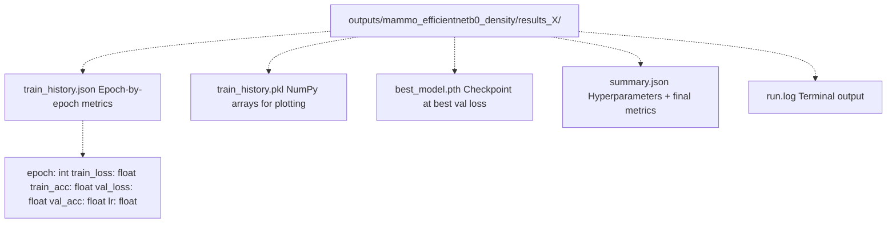
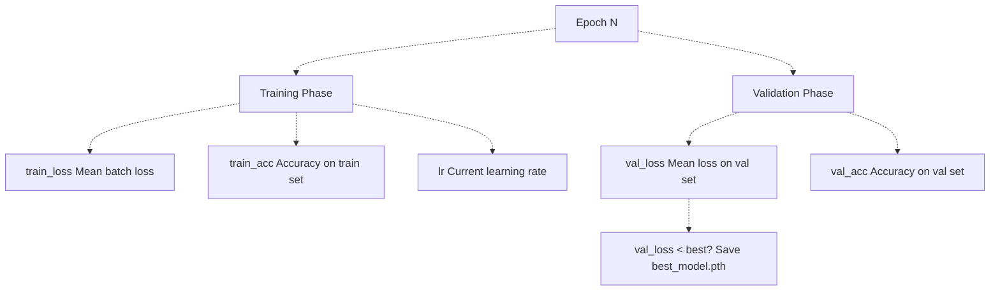
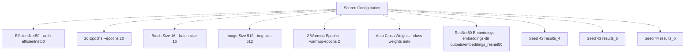
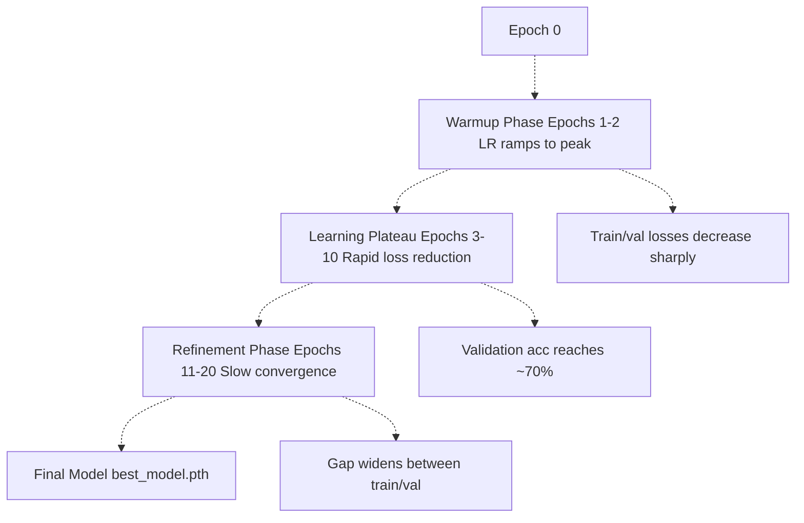
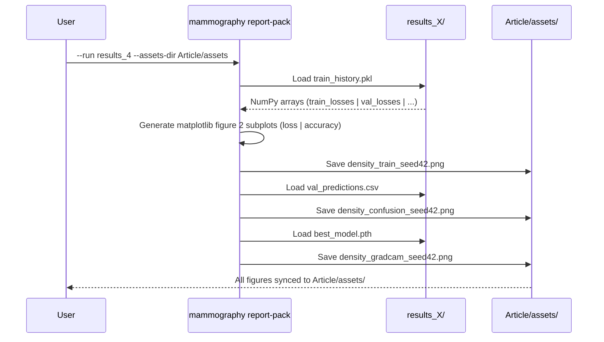
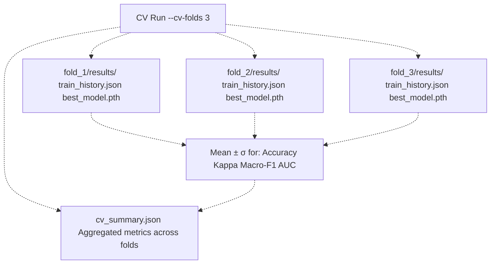
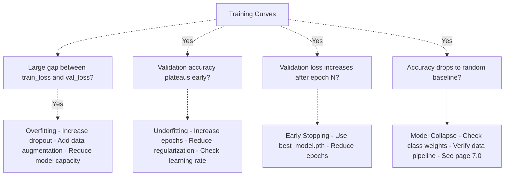
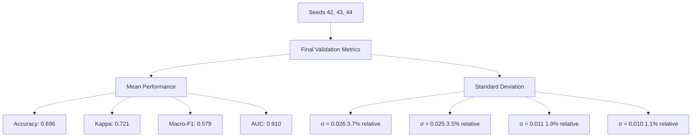

# Training History and Convergence

> **Relevant source files**
> * [Article/02-density.md](https://github.com/ThalesMMS/mammography-pipelines/blob/01443313/Article/02-density.md)
> * [Article/assets/density_train_seed42.png](https://github.com/ThalesMMS/mammography-pipelines/blob/01443313/Article/assets/density_train_seed42.png)
> * [Article/assets/density_train_seed43.png](https://github.com/ThalesMMS/mammography-pipelines/blob/01443313/Article/assets/density_train_seed43.png)
> * [Article/assets/density_train_seed44.png](https://github.com/ThalesMMS/mammography-pipelines/blob/01443313/Article/assets/density_train_seed44.png)
> * [Article/assets/history_run4.png](https://github.com/ThalesMMS/mammography-pipelines/blob/01443313/Article/assets/history_run4.png)

This page documents the training history artifacts generated during EfficientNetB0 density classification experiments, including training/validation loss and accuracy curves. It explains how to interpret convergence patterns, analyze variance across multiple random seeds, and use these artifacts to diagnose training behavior.

For performance metrics computed from trained models, see [Performance Metrics](5a%20Performance-Metrics.md). For confusion matrices and per-class analysis of final predictions, see [Confusion Matrices and Per-Class Analysis](5b%20Confusion-Matrices-and-Per-Class-Analysis.md).

---

## Purpose and Scope

Training history tracking serves three primary purposes:

1. **Convergence Diagnosis**: Verify that models converge to stable optima within the allocated epoch budget
2. **Overfitting Detection**: Compare training vs. validation metrics to identify overfitting or underfitting regimes
3. **Reproducibility Analysis**: Quantify variance in convergence behavior across different random seeds (42, 43, 44)

The training history is automatically logged during `mammography train-density` execution and visualized by `mammography report-pack`. This page focuses on interpreting these artifacts; for the underlying training loop mechanics, see [Training Loop and Optimization](3d%20Training-Loop-and-Optimization.md).

**Sources**: [Article/02-density.md L1-L97](https://github.com/ThalesMMS/mammography-pipelines/blob/01443313/Article/02-density.md#L1-L97)

---

## Training History Artifacts and Storage

### Output Directory Structure

Each training run produces a timestamped results directory containing comprehensive training metadata:



**Key Files**:

| File | Format | Contents |
| --- | --- | --- |
| `train_history.json` | JSON | Serialized list of epoch records with loss, accuracy, learning rate |
| `train_history.pkl` | Pickle | NumPy arrays for efficient plotting (`train_losses`, `val_losses`, etc.) |
| `best_model.pth` | PyTorch | Model checkpoint at epoch with minimum validation loss |
| `summary.json` | JSON | Hyperparameters, seed, Git commit hash, final metrics |

**Sources**: [Article/02-density.md L17-L22](https://github.com/ThalesMMS/mammography-pipelines/blob/01443313/Article/02-density.md#L17-L22)

---

## Training Curve Components

### Tracked Metrics Per Epoch

The training loop logs six primary metrics after each epoch:



**Metric Definitions**:

* **`train_loss`**: Cross-entropy loss averaged over all training batches in the epoch
* **`train_acc`**: Classification accuracy on the training set (percentage of correct predictions)
* **`val_loss`**: Cross-entropy loss on the 20% holdout validation set
* **`val_acc`**: Classification accuracy on the validation set
* **`lr`**: Learning rate at the end of the epoch (reflects warmup and decay schedules)

**Learning Rate Schedule**: The system uses a 2-epoch linear warmup followed by cosine annealing. The `lr` value tracks this dynamic schedule.

**Sources**: [Article/02-density.md L8-L14](https://github.com/ThalesMMS/mammography-pipelines/blob/01443313/Article/02-density.md#L8-L14)

---

## Seed-Based Training Runs

### Standard Configuration

The project adopts **seed 42 as the canonical reference**, with seeds 43 and 44 serving as variance analysis replicates. All three runs share identical hyperparameters:



| Seed | Run ID | Final Accuracy | Final κ (quadratic) | Final Macro-F1 | Final AUC (OvR) |
| --- | --- | --- | --- | --- | --- |
| 42 | `results_4` | 0.676 | 0.697 | 0.584 | 0.913 |
| 43 | `results_5` | 0.733 | 0.756 | 0.588 | 0.922 |
| 44 | `results_6` | 0.679 | 0.710 | 0.564 | 0.896 |
| **Mean ± σ** | — | **0.696 ± 0.026** | **0.721 ± 0.025** | **0.579 ± 0.011** | **0.910 ± 0.010** |

**Key Observations**:

* Seed 43 achieves the highest accuracy (0.733) and AUC (0.922)
* Seed 44 has the lowest Macro-F1 (0.564), indicating weaker performance on minority classes
* Standard deviation is modest (~0.026 for accuracy), suggesting stable training dynamics

**Sources**: [Article/02-density.md L37-L49](https://github.com/ThalesMMS/mammography-pipelines/blob/01443313/Article/02-density.md#L37-L49)

---

## Convergence Patterns and Interpretation

### Typical Training Curve Anatomy

Training curves for the density classification task exhibit the following characteristic phases:



**Phase Breakdown**:

1. **Warmup (Epochs 1-2)**: Learning rate linearly increases from near-zero to peak value. Loss decreases rapidly as the model escapes random initialization.
2. **Learning Plateau (Epochs 3-10)**: Model learns primary discriminative features. Validation accuracy climbs to ~0.65-0.70. This is where the bulk of learning occurs.
3. **Refinement (Epochs 11-20)**: Cosine annealing reduces learning rate. Model fine-tunes decision boundaries. Training accuracy continues improving while validation plateaus, indicating mild overfitting.

**Overfitting Indicators**:

* Training loss continues decreasing while validation loss flattens or increases
* Gap between `train_acc` and `val_acc` widens after epoch ~12
* This behavior is expected given class imbalance (20:1 ratio for minority classes)

**Sources**: [Article/02-density.md L46-L49](https://github.com/ThalesMMS/mammography-pipelines/blob/01443313/Article/02-density.md#L46-L49)

---

## Visualization Generation Workflow

### Report Pack Integration

Training curves are automatically generated by the `mammography report-pack` command, which reads `train_history.pkl` and produces publication-ready figures:



**Generated Files**:

* `density_train_seed42.png` (and 43, 44): Dual-subplot figures showing loss and accuracy curves
* Upper subplot: Training loss (blue) and validation loss (orange)
* Lower subplot: Training accuracy (blue) and validation accuracy (orange)

**Usage**:

```
mammography report-pack -- \  --run results_4 \  --assets-dir Article/assets
```

The command iterates over all three seed runs (`results_4`, `results_5`, `results_6`) and generates corresponding visualizations.

**Sources**: [Article/02-density.md L22-L23](https://github.com/ThalesMMS/mammography-pipelines/blob/01443313/Article/02-density.md#L22-L23)

 [Article/02-density.md L24-L33](https://github.com/ThalesMMS/mammography-pipelines/blob/01443313/Article/02-density.md#L24-L33)

---

## Cross-Validation Training History

### Fold-Level Tracking

When using `--cv-folds k`, each fold generates its own `train_history.*` artifacts:



**Cross-Validation Results (3-Fold, Seed 42)**:

| Metric | Mean | σ |
| --- | --- | --- |
| Accuracy | 0.659 | 0.024 |
| κ (quadratic) | 0.666 | 0.020 |
| Macro-F1 | 0.592 | 0.036 |
| AUC (OvR) | 0.878 | 0.010 |

The higher variance in Macro-F1 (σ=0.036) reflects the challenge of maintaining consistent performance on minority classes across different train/validation splits.

**Sources**: [Article/02-density.md L60-L86](https://github.com/ThalesMMS/mammography-pipelines/blob/01443313/Article/02-density.md#L60-L86)

---

## Interpreting Training Dynamics

### Diagnosing Common Issues

Use training curves to identify and address common failure modes:



**Key Diagnostic Patterns**:

1. **Healthy Convergence**: Both train and validation metrics improve steadily for 10+ epochs before plateauing. Gap between train/val widens slightly but validation continues improving or remains stable.
2. **Severe Overfitting**: Training loss approaches zero while validation loss increases. Training accuracy → 1.0 while validation accuracy stagnates or drops. **Solution**: Increase `--dropout` or enable `--train-augment`.
3. **Model Collapse**: Accuracy suddenly drops to ~1.6% (random baseline for BI-RADS 4-class problem). This catastrophic failure requires multi-strategy intervention documented in [Model Collapse Prevention](7%20Model-Collapse-Prevention.md).

**Sources**: [Article/02-density.md L46-L49](https://github.com/ThalesMMS/mammography-pipelines/blob/01443313/Article/02-density.md#L46-L49)

---

## Variance Analysis Across Seeds

### Quantifying Training Stability

The three-seed runs provide statistical bounds on expected performance:



**Interpretation**:

* **Low variance in AUC** (σ=0.010): Multi-class ranking is stable despite initialization differences
* **Moderate variance in accuracy** (σ=0.026): ~4% relative variation is acceptable for this imbalanced dataset
* **Low variance in Macro-F1** (σ=0.011): Per-class performance is consistent, though absolute values remain low (~0.58) for minority classes

**Statistical Significance**: A hypothetical new run producing accuracy < 0.67 or > 0.73 (±2σ) would warrant investigation as it falls outside typical variance.

**Sources**: [Article/02-density.md L37-L49](https://github.com/ThalesMMS/mammography-pipelines/blob/01443313/Article/02-density.md#L37-L49)

---

## Relationship to Other Evaluation Artifacts

Training history complements other evaluation outputs:

| Artifact | File Location | Purpose | See Page |
| --- | --- | --- | --- |
| **Training Curves** | `train_history.json` | Convergence diagnosis | This page (5.4) |
| **Confusion Matrix** | `val_predictions.csv` | Per-class error analysis | [5.2](5b%20Confusion-Matrices-and-Per-Class-Analysis.md) |
| **Grad-CAM Heatmaps** | `best_model.pth` → visualization | Interpretability | [5.3](5c%20Grad-CAM-Visualizations.md) |
| **Validation Metrics** | `metrics/val_metrics.json` | Final performance summary | [5.1](5a%20Performance-Metrics.md) |
| **Embeddings** | `embeddings_val.npy` | Feature space analysis | [3.1](3a%20Embedding-Extraction-%28ResNet50%29.md) |

**Workflow Integration**: After reviewing training curves for convergence, proceed to confusion matrices ([5.2](5b%20Confusion-Matrices-and-Per-Class-Analysis.md)) to understand which classes are misclassified, then use Grad-CAM ([5.3](5c%20Grad-CAM-Visualizations.md)) to visualize what features the model learned.

**Sources**: [Article/02-density.md L17-L23](https://github.com/ThalesMMS/mammography-pipelines/blob/01443313/Article/02-density.md#L17-L23)

---

## Summary

Training history tracking provides essential visibility into model convergence and stability:

1. **Artifacts**: `train_history.json` and `.pkl` files store epoch-level metrics (loss, accuracy, LR)
2. **Visualization**: `mammography report-pack` generates `density_train_seed*.png` figures
3. **Convergence**: Typical runs converge within 10-15 epochs; best models are saved via early stopping on validation loss
4. **Variance**: Three-seed runs (42, 43, 44) show ~3-4% relative variance in accuracy, confirming stable training dynamics
5. **Diagnosis**: Compare train/val curves to detect overfitting, underfitting, or model collapse

For investigating performance issues revealed by training curves, consult [Model Collapse Prevention](7%20Model-Collapse-Prevention.md). For understanding the learned representations, proceed to [Grad-CAM Visualizations](5c%20Grad-CAM-Visualizations.md).

**Sources**: [Article/02-density.md L1-L97](https://github.com/ThalesMMS/mammography-pipelines/blob/01443313/Article/02-density.md#L1-L97)


### On this page

* [Training History and Convergence](#5.4-training-history-and-convergence)
* [Purpose and Scope](#5.4-purpose-and-scope)
* [Training History Artifacts and Storage](#5.4-training-history-artifacts-and-storage)
* [Output Directory Structure](#5.4-output-directory-structure)
* [Training Curve Components](#5.4-training-curve-components)
* [Tracked Metrics Per Epoch](#5.4-tracked-metrics-per-epoch)
* [Seed-Based Training Runs](#5.4-seed-based-training-runs)
* [Standard Configuration](#5.4-standard-configuration)
* [Convergence Patterns and Interpretation](#5.4-convergence-patterns-and-interpretation)
* [Typical Training Curve Anatomy](#5.4-typical-training-curve-anatomy)
* [Visualization Generation Workflow](#5.4-visualization-generation-workflow)
* [Report Pack Integration](#5.4-report-pack-integration)
* [Cross-Validation Training History](#5.4-cross-validation-training-history)
* [Fold-Level Tracking](#5.4-fold-level-tracking)
* [Interpreting Training Dynamics](#5.4-interpreting-training-dynamics)
* [Diagnosing Common Issues](#5.4-diagnosing-common-issues)
* [Variance Analysis Across Seeds](#5.4-variance-analysis-across-seeds)
* [Quantifying Training Stability](#5.4-quantifying-training-stability)
* [Relationship to Other Evaluation Artifacts](#5.4-relationship-to-other-evaluation-artifacts)
* [Summary](#5.4-summary)

Ask Devin about mammography-pipelines