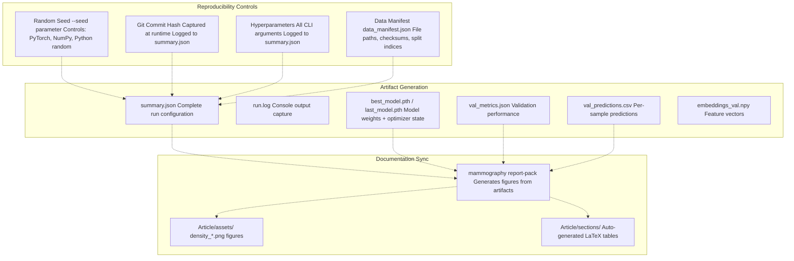
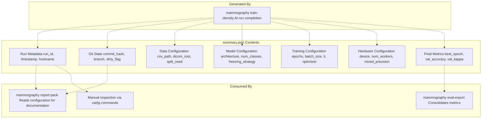
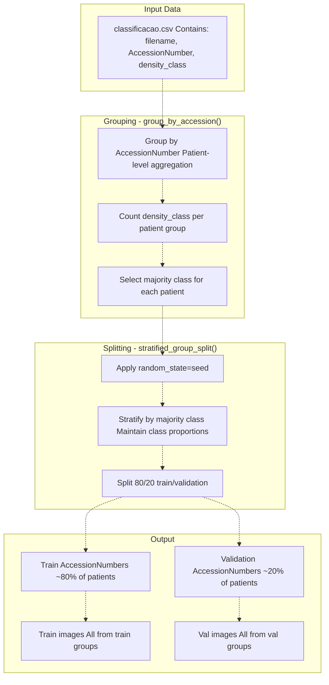
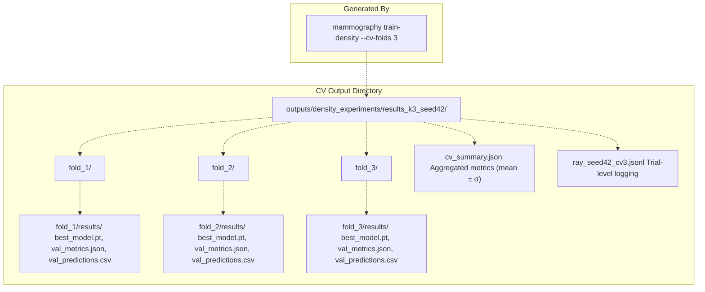
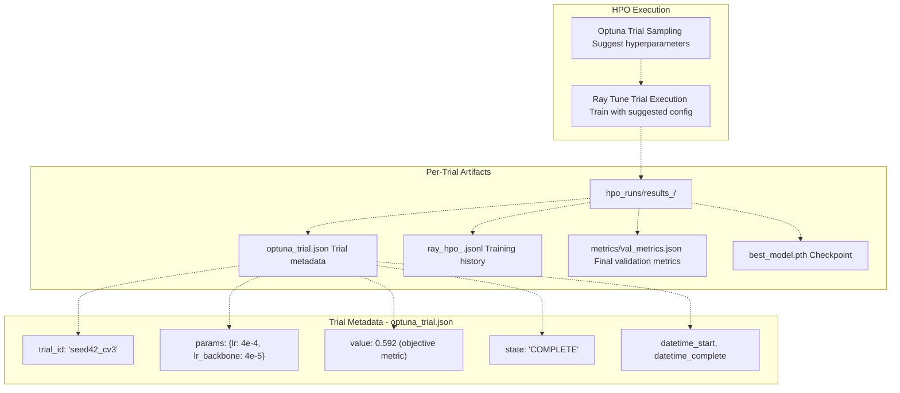
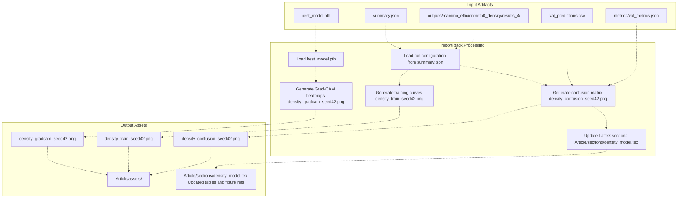

# Reproducibility and Experiment Tracking

> **Relevant source files**
> * [Article/02-density.md](https://github.com/ThalesMMS/mammography-pipelines/blob/01443313/Article/02-density.md)
> * [Article/article.md](https://github.com/ThalesMMS/mammography-pipelines/blob/01443313/Article/article.md)
> * [Article/chapters/01-introducao.tex](https://github.com/ThalesMMS/mammography-pipelines/blob/01443313/Article/chapters/01-introducao.tex)

This page documents the infrastructure and mechanisms used to ensure full reproducibility of experiments in the mammography density classification pipeline. The system implements comprehensive tracking of random seeds, hyperparameters, Git state, data splits, and training artifacts to enable exact reproduction of any experiment.

**Related Pages:**

* For seed management and variance analysis, see Page 6.1: Random Seeds and Variability
* For output directory organization, see Page 6.2: Output Directory Structure
* For logged artifacts and metadata, see Page 6.3: Artifact Logging
* For comparing results across runs, see Page 6.4: Model Performance Comparisons
* For cross-validation implementation, see Page 3.5: Cross-Validation and Hyperparameter Optimization

**Related Pages:**

* For seed management and variance analysis, see Page 6.1: Random Seeds and Variability
* For output directory organization, see Page 6.2: Output Directory Structure
* For logged artifacts and metadata, see Page 6.3: Artifact Logging
* For comparing results across runs, see Page 6.4: Model Performance Comparisons
* For cross-validation implementation, see Page 3.5: Cross-Validation and Hyperparameter Optimization

---

## Reproducibility Infrastructure Overview

The system implements multiple layers of reproducibility controls to ensure that any experiment can be exactly reproduced from the logged artifacts. This includes deterministic seeding, comprehensive metadata logging, versioned output directories, and automated synchronization with documentation.



**Sources:** [Article/02-density.md L16-L22](https://github.com/ThalesMMS/mammography-pipelines/blob/01443313/Article/02-density.md#L16-L22)

 [mammography/commands/train_density.py](https://github.com/ThalesMMS/mammography-pipelines/blob/01443313/mammography/commands/train_density.py)

 [mammography/commands/report_pack.py](https://github.com/ThalesMMS/mammography-pipelines/blob/01443313/mammography/commands/report_pack.py)

## Seed Management and Deterministic Execution

The pipeline uses fixed random seeds to ensure deterministic behavior across all stochastic components. The system sets seeds for PyTorch (CPU and CUDA), NumPy, and Python's built-in `random` module at the start of each training run.

### Seed Configuration Flow

```

```

**Sources:** [mammography/commands/train_density.py](https://github.com/ThalesMMS/mammography-pipelines/blob/01443313/mammography/commands/train_density.py)

 [Article/02-density.md L17](https://github.com/ThalesMMS/mammography-pipelines/blob/01443313/Article/02-density.md#L17-L17)

### Standard Seeds and Variance Analysis

The project uses three fixed seeds (42, 43, 44) to analyze model variance. Seed 42 is designated as the canonical reference run, while seeds 43 and 44 provide variance estimates.

| Seed | Run ID | Purpose | Status |
| --- | --- | --- | --- |
| 42 | `results_4` | **Official reference run** | ✅ Primary |
| 43 | `results_5` | Variance estimation | ✅ Archived |
| 44 | `results_6` | Variance estimation | ✅ Archived |

**Example: Multi-seed Results**

| Seed | Accuracy | Kappa | Macro-F1 | AUC |
| --- | --- | --- | --- | --- |
| 42 | 0.676 | 0.697 | 0.584 | 0.913 |
| 43 | 0.733 | 0.756 | 0.588 | 0.922 |
| 44 | 0.679 | 0.710 | 0.564 | 0.896 |
| **Mean ± σ** | **0.696 ± 0.026** | **0.721 ± 0.025** | **0.579 ± 0.011** | **0.910 ± 0.010** |

**Sources:** [Article/02-density.md L35-L49](https://github.com/ThalesMMS/mammography-pipelines/blob/01443313/Article/02-density.md#L35-L49)

## Hyperparameter and Configuration Logging

Every training run creates a `summary.json` file that captures the complete configuration used for the experiment. This file serves as the single source of truth for reproducing the run.

### summary.json Structure



**Example summary.json excerpt:**

```
{  "run_id": "results_4",  "seed": 42,  "git_commit": "a3f2b1c9d4e5f6a7b8c9d0e1f2a3b4c5d6e7f8a9",  "architecture": "efficientnetb0",  "num_classes": 4,  "epochs": 20,  "batch_size": 16,  "learning_rate": 0.0001,  "embeddings_fusion": true,  "embeddings_dir": "outputs/embeddings_resnet50",  "class_weights": "auto",  "unfreeze_last_block": true,  "best_epoch": 14,  "val_accuracy": 0.676,  "val_kappa": 0.697}
```

**Sources:** [Article/02-density.md L20](https://github.com/ThalesMMS/mammography-pipelines/blob/01443313/Article/02-density.md#L20-L20)

 [mammography/commands/train_density.py](https://github.com/ThalesMMS/mammography-pipelines/blob/01443313/mammography/commands/train_density.py)

### Git State Tracking

The system captures the Git commit hash at the start of each training run, ensuring that the exact code version can be identified. If the working directory has uncommitted changes, a warning is logged and the `dirty` flag is set in `summary.json`.

**Git information captured:**

* Current commit SHA
* Current branch name
* Dirty flag (uncommitted changes present)
* Remote URL (if available)

This enables full code reproducibility: given a commit hash, the exact model architecture, training loop, and data preprocessing logic can be recovered.

**Sources:** [Article/02-density.md L20](https://github.com/ThalesMMS/mammography-pipelines/blob/01443313/Article/02-density.md#L20-L20)

 [Article/chapters/01-introducao.tex L14-L15](https://github.com/ThalesMMS/mammography-pipelines/blob/01443313/Article/chapters/01-introducao.tex#L14-L15)

## Data Manifest and Split Tracking

To ensure exact reproducibility of data splits, the system logs detailed information about the dataset composition and train/validation split indices.

### data_manifest.json Structure

The `data_manifest.json` file (when generated) contains:

* List of all DICOM files included in the dataset
* File paths and AccessionNumbers
* Class distribution statistics
* Train/validation split indices
* Checksums (optional, for detecting data corruption)

This allows verification that the exact same files were used across different runs and enables detection of dataset drift.

**Example usage:**

```
# Verify that two runs used identical datadiff outputs/results_4/data_manifest.json outputs/results_5/data_manifest.json
```

**Sources:** [Article/02-density.md L20](https://github.com/ThalesMMS/mammography-pipelines/blob/01443313/Article/02-density.md#L20-L20)

 [Article/chapters/01-introducao.tex L15](https://github.com/ThalesMMS/mammography-pipelines/blob/01443313/Article/chapters/01-introducao.tex#L15-L15)

### Stratified Group Splitting

The system uses stratified group splitting to maintain class proportions while preventing patient data leakage. All images from the same `AccessionNumber` are kept together in either train or validation sets.



**Key properties:**

* Deterministic: Same seed produces same split
* Stratified: Class proportions maintained in both sets
* Group-aware: No patient appears in both sets
* Logged: Split indices saved for verification

**Sources:** [Article/02-density.md L18](https://github.com/ThalesMMS/mammography-pipelines/blob/01443313/Article/02-density.md#L18-L18)

 [mammography/data/utils.py](https://github.com/ThalesMMS/mammography-pipelines/blob/01443313/mammography/data/utils.py)

## Cross-Validation and Experiment Versioning

The system supports stratified k-fold cross-validation with comprehensive artifact logging for each fold. This enables robust performance estimation and hyperparameter tuning.

### Cross-Validation Directory Structure



**Sources:** [Article/02-density.md L58-L86](https://github.com/ThalesMMS/mammography-pipelines/blob/01443313/Article/02-density.md#L58-L86)

### cv_summary.json Example

After completing all folds, the system generates `cv_summary.json` with aggregated statistics:

```
{  "cv_config": {    "num_folds": 3,    "seed": 42,    "stratified": true  },  "fold_metrics": [    {"fold": 1, "accuracy": 0.693, "kappa": 0.695, "macro_f1": 0.643, "auc": 0.878},    {"fold": 2, "accuracy": 0.643, "kappa": 0.657, "macro_f1": 0.569, "auc": 0.868},    {"fold": 3, "accuracy": 0.641, "kappa": 0.646, "macro_f1": 0.565, "auc": 0.887}  ],  "aggregate_statistics": {    "accuracy_mean": 0.659,    "accuracy_std": 0.024,    "kappa_mean": 0.666,    "kappa_std": 0.020,    "macro_f1_mean": 0.592,    "macro_f1_std": 0.036,    "auc_mean": 0.878,    "auc_std": 0.010  }}
```

**Example CV results:**

| Metric | Mean | σ | Fold 1 | Fold 2 | Fold 3 |
| --- | --- | --- | --- | --- | --- |
| Accuracy | 0.659 | 0.024 | 0.693 | 0.643 | 0.641 |
| κ (quadratic) | 0.666 | 0.020 | 0.695 | 0.657 | 0.646 |
| Macro-F1 | 0.592 | 0.036 | 0.643 | 0.569 | 0.565 |
| AUC (OvR) | 0.878 | 0.010 | 0.878 | 0.868 | 0.887 |

**Sources:** [Article/02-density.md L76-L84](https://github.com/ThalesMMS/mammography-pipelines/blob/01443313/Article/02-density.md#L76-L84)

## Hyperparameter Optimization Tracking

The system integrates with Optuna and Ray Tune for hyperparameter search, logging each trial's configuration and results in structured JSON files.

### HPO Artifact Generation



**Sources:** [Article/02-density.md L87-L96](https://github.com/ThalesMMS/mammography-pipelines/blob/01443313/Article/02-density.md#L87-L96)

### Example HPO Trial Comparison

| Trial | LR / Backbone LR | Augmentation | Subset Size | Macro-F1 | Logs |
| --- | --- | --- | --- | --- | --- |
| `results` | 4e-4 / 4e-5 | Enabled | 256 | 0.318 | `ray_hpo_lr4e4.jsonl` |
| `results_1` | 2e-4 / 2e-5 | Disabled | 256 | 0.429 | `ray_hpo_lr2e4.jsonl` |

Each trial directory in `outputs/mammo_efficientnetb0_density/hpo_runs/` contains:

* `optuna_trial.json`: Trial configuration and outcome
* `ray_<trial_name>.jsonl`: Step-by-step training metrics
* `metrics/val_metrics.json`: Final validation results
* `best_model.pth`: Best checkpoint for this trial

This structure enables:

* Comparison of hyperparameter configurations
* Analysis of training dynamics per trial
* Selection of best trial for promotion to production
* Debugging of failed trials

**Sources:** [Article/02-density.md L87-L96](https://github.com/ThalesMMS/mammography-pipelines/blob/01443313/Article/02-density.md#L87-L96)

## Console Output Logging

All console output during training is captured to log files for post-hoc analysis and debugging.

### run.log Contents

The `run.log` file (or terminal logs saved as `seed42.log`, `seed43.log`, etc.) captures:

* Data loading progress and statistics
* Model architecture summary (number of parameters)
* Per-epoch training metrics (loss, accuracy)
* Per-epoch validation metrics (loss, accuracy, kappa, AUC)
* Best model checkpoint events
* Warning messages (e.g., cache truncation detection)
* Final summary statistics

**Example log excerpt:**

```python
[INFO] Loading dataset from classificacao.csv...
[INFO] Found 10,834 images after excluding class 5
[INFO] Train: 8,667 images (80%), Val: 2,167 images (20%)
[INFO] Class distribution - Train: [156, 2473, 5783, 255]
[INFO] Initializing EfficientNetB0 with 4 classes
[INFO] Freezing backbone, unfreezing last block
[INFO] Total parameters: 4.01M, Trainable: 2.38M
[INFO] Starting training for 20 epochs...
[EPOCH 1/20] train_loss: 1.214, train_acc: 0.523
[EPOCH 1/20] val_loss: 0.987, val_acc: 0.612, val_kappa: 0.543
[INFO] New best model (val_kappa: 0.543), saving checkpoint...
...
[EPOCH 14/20] val_loss: 0.765, val_acc: 0.676, val_kappa: 0.697
[INFO] New best model (val_kappa: 0.697), saving checkpoint...
[INFO] Training complete. Best epoch: 14, Best val_kappa: 0.697
```

This log serves as:

* Audit trail of training execution
* Debug resource for investigating failures
* Source for extracting intermediate metrics
* Verification of hyperparameter application

**Sources:** [Article/02-density.md L19](https://github.com/ThalesMMS/mammography-pipelines/blob/01443313/Article/02-density.md#L19-L19)

 [Article/02-density.md L37](https://github.com/ThalesMMS/mammography-pipelines/blob/01443313/Article/02-density.md#L37-L37)

## Automated Report Generation

The `mammography report-pack` command automates the generation of figures and LaTeX content for documentation, ensuring perfect synchronization between experimental results and published materials.

### report-pack Workflow



**Sources:** [Article/02-density.md L22-L23](https://github.com/ThalesMMS/mammography-pipelines/blob/01443313/Article/02-density.md#L22-L23)

 [Article/02-density.md L50](https://github.com/ThalesMMS/mammography-pipelines/blob/01443313/Article/02-density.md#L50-L50)

 [mammography/commands/report_pack.py](https://github.com/ThalesMMS/mammography-pipelines/blob/01443313/mammography/commands/report_pack.py)

### Example Usage

```
# Generate reports for seed 42 (official reference)mammography report-pack --run results_4 --assets-dir Article/assets# Generate reports for all seedsmammography report-pack --run results_4 --assets-dir Article/assetsmammography report-pack --run results_5 --assets-dir Article/assetsmammography report-pack --run results_6 --assets-dir Article/assets
```

This command:

1. Reads `summary.json` to extract hyperparameters
2. Loads the best model checkpoint
3. Generates confusion matrices using validation predictions
4. Plots training/validation curves from history
5. Creates Grad-CAM visualizations on representative samples
6. Saves all figures to `Article/assets/` with standardized naming
7. Updates LaTeX files with metric tables

**Generated figures:**

* `density_confusion_seed42.png`: Confusion matrix with per-class metrics
* `density_train_seed42.png`: Loss/accuracy curves across epochs
* `density_gradcam_seed42.png`: Grad-CAM heatmap visualization grid

**Sources:** [Article/02-density.md L24-L33](https://github.com/ThalesMMS/mammography-pipelines/blob/01443313/Article/02-density.md#L24-L33)

 [Article/02-density.md L50](https://github.com/ThalesMMS/mammography-pipelines/blob/01443313/Article/02-density.md#L50-L50)

---

## Summary of Key Findings

1. **Best Configuration:** EfficientNetB0 + IRMA Complete + Binary classification achieves 93.47% accuracy, suitable for clinical deployment as a screening tool.
2. **4-Class Challenge:** Multiclass density classification remains challenging (best: 78.28% accuracy), particularly for minority Class A (3.2% of data).
3. **Freezing Strategy Critical:** Frozen backbone + unfrozen last block prevents model collapse and achieves superior performance compared to full fine-tuning on small datasets.
4. **Dataset Quality Matters:** IRMA (film digitized) consistently outperforms RSNA (digital) by 5-7%, likely due to more consistent imaging protocols.
5. **Context is Essential:** Complete mammogram images outperform patches by 4-12%, indicating that global breast context is crucial for density assessment.
6. **Metric Selection:** Prioritizing balanced accuracy and Cohen's Kappa over simple accuracy is essential for detecting model collapse in imbalanced medical datasets.

**Sources:** [Article/article.md L428-L443](https://github.com/ThalesMMS/mammography-pipelines/blob/01443313/Article/article.md#L428-L443)

 [Article/article.md L392-L425](https://github.com/ThalesMMS/mammography-pipelines/blob/01443313/Article/article.md#L392-L425)


### On this page

* [Reproducibility and Experiment Tracking](6%20Reproducibility-and-Experiment-Tracking.md)
* [Reproducibility Infrastructure Overview](6%20Reproducibility-and-Experiment-Tracking.md)
* [Seed Management and Deterministic Execution](6%20Reproducibility-and-Experiment-Tracking.md)
* [Seed Configuration Flow](6%20Reproducibility-and-Experiment-Tracking.md)
* [Standard Seeds and Variance Analysis](6%20Reproducibility-and-Experiment-Tracking.md)
* [Hyperparameter and Configuration Logging](6%20Reproducibility-and-Experiment-Tracking.md)
* [summary.json Structure](6%20Reproducibility-and-Experiment-Tracking.md)
* [Git State Tracking](6%20Reproducibility-and-Experiment-Tracking.md)
* [Data Manifest and Split Tracking](6%20Reproducibility-and-Experiment-Tracking.md)
* [data_manifest.json Structure](6%20Reproducibility-and-Experiment-Tracking.md)
* [Stratified Group Splitting](6%20Reproducibility-and-Experiment-Tracking.md)
* [Cross-Validation and Experiment Versioning](6%20Reproducibility-and-Experiment-Tracking.md)
* [Cross-Validation Directory Structure](6%20Reproducibility-and-Experiment-Tracking.md)
* [cv_summary.json Example](6%20Reproducibility-and-Experiment-Tracking.md)
* [Hyperparameter Optimization Tracking](6%20Reproducibility-and-Experiment-Tracking.md)
* [HPO Artifact Generation](6%20Reproducibility-and-Experiment-Tracking.md)
* [Example HPO Trial Comparison](6%20Reproducibility-and-Experiment-Tracking.md)
* [Console Output Logging](6%20Reproducibility-and-Experiment-Tracking.md)
* [run.log Contents](6%20Reproducibility-and-Experiment-Tracking.md)
* [Automated Report Generation](6%20Reproducibility-and-Experiment-Tracking.md)
* [report-pack Workflow](6%20Reproducibility-and-Experiment-Tracking.md)
* [Example Usage](6%20Reproducibility-and-Experiment-Tracking.md)
* [Summary of Key Findings](6%20Reproducibility-and-Experiment-Tracking.md)

Ask Devin about mammography-pipelines