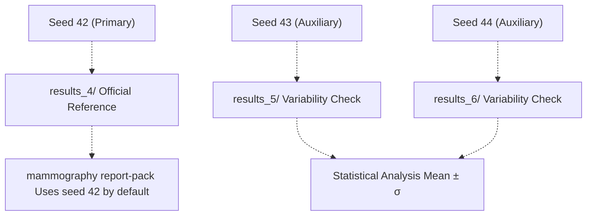
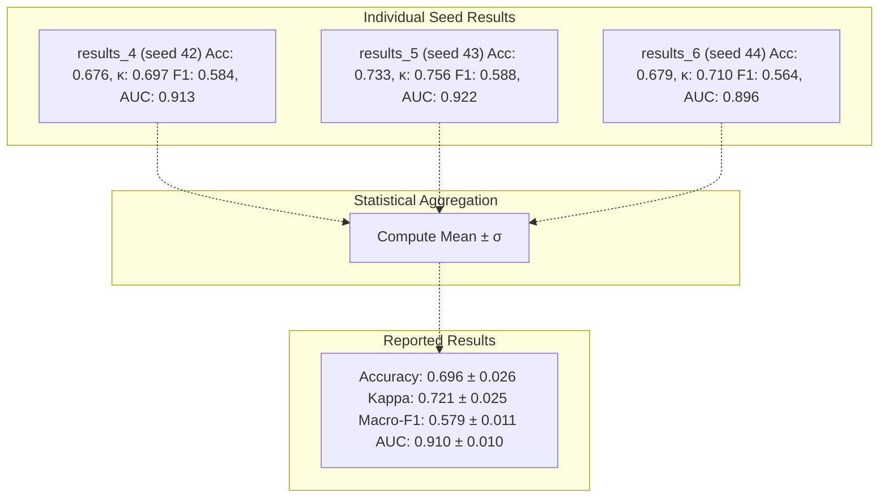
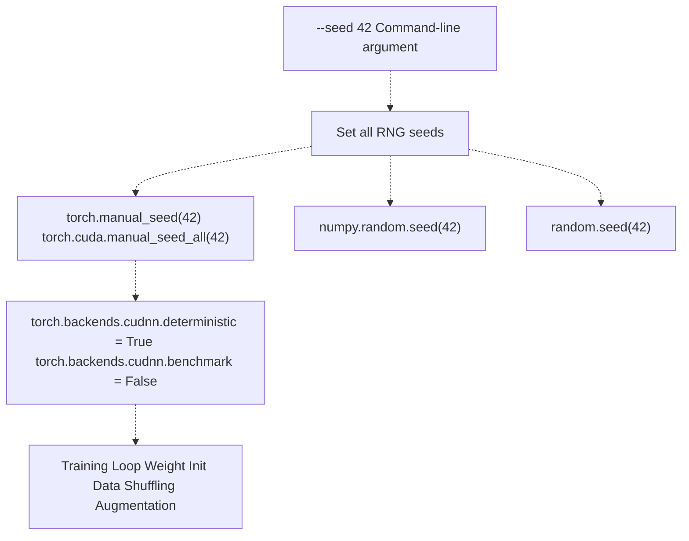
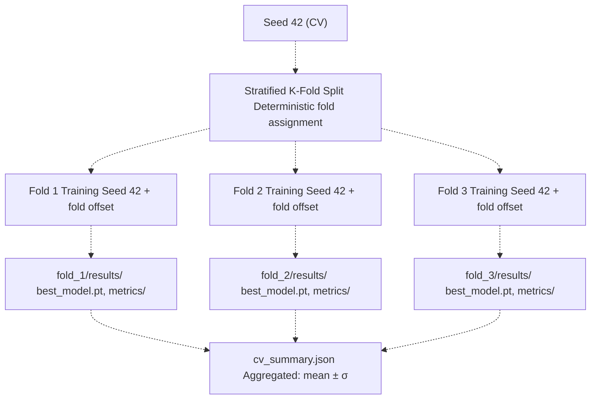
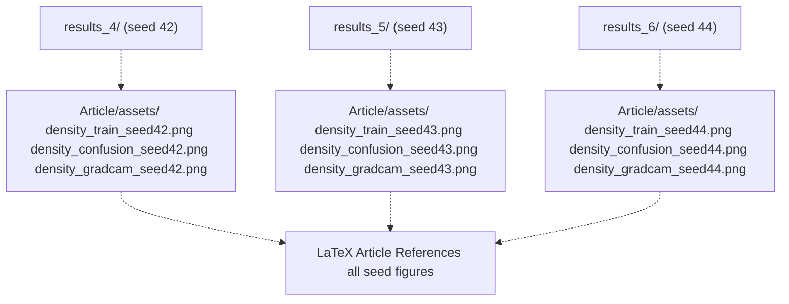
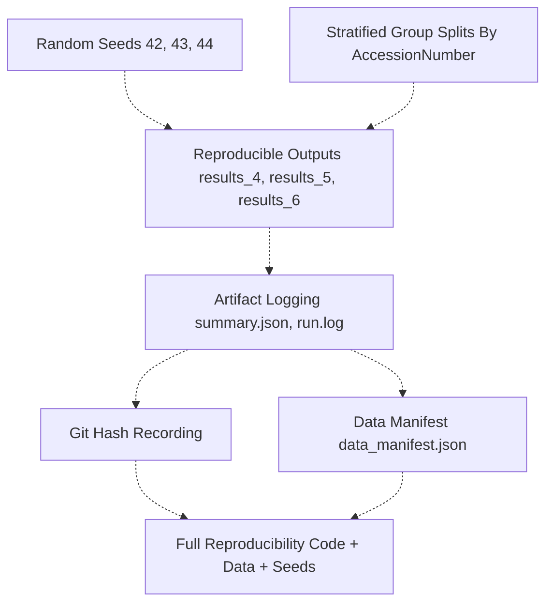

# Random Seeds and Variability

> **Relevant source files**
> * [Article/02-density.md](https://github.com/ThalesMMS/mammography-pipelines/blob/01443313/Article/02-density.md)
> * [Article/article.md](https://github.com/ThalesMMS/mammography-pipelines/blob/01443313/Article/article.md)

## Purpose and Scope

This page documents the use of random seeds to ensure reproducibility and quantify result variability in the mammography classification pipeline. It covers seed selection, implementation, and how multiple seed runs are used to measure model stability.

For information about organizing the outputs from multiple seed runs, see [Output Directory Structure](6b%20Output-Directory-Structure.md). For details on how seed information is logged in artifacts, see [Artifact Logging](6c%20Artifact-Logging.md).

---

## Overview: Why Random Seeds Matter

Deep learning experiments contain multiple sources of stochasticity that can cause different results across runs:

| Source of Randomness | Impact | Example |
| --- | --- | --- |
| **Weight Initialization** | Different starting points for optimization | PyTorch default initialization |
| **Data Shuffling** | Different batch compositions | DataLoader shuffle |
| **Train/Val Split** | Different samples in each set | Stratified splitting |
| **Dropout** | Different neurons dropped during training | Dropout layers |
| **Data Augmentation** | Different transformations applied | RandomHorizontalFlip, RandomRotation |

Without controlling these sources, experiments are not reproducible and performance claims cannot be verified. This project addresses reproducibility through:

1. **Fixed seeds** for all random number generators
2. **Multiple seed runs** to quantify variability
3. **Seed documentation** in output artifacts

Sources: Article/02-density.md:16-22, Article/article.md (Diagram 5)

---

## Seed Selection Strategy

### Primary and Auxiliary Seeds

The project uses three specific seeds:



**Seed 42** is the official reference seed used for:

* Primary model selection
* Article figures and tables
* Baseline comparisons
* Default `report-pack` synchronization

**Seeds 43 and 44** provide:

* Variability estimates (standard deviation)
* Robustness validation
* Historical reference for result stability

This three-seed approach balances computational cost with statistical rigor, providing mean ± standard deviation metrics without excessive computation.

Sources: Article/02-density.md:17, 37-50

---

## Results Directory Naming Convention

Seeds map directly to output directory names following a consistent pattern:

| Seed | Directory | Purpose | Article Integration |
| --- | --- | --- | --- |
| 42 | `outputs/mammo_efficientnetb0_density/results_4/` | Primary reference | ✓ Auto-packed to Article/assets/ |
| 43 | `outputs/mammo_efficientnetb0_density/results_5/` | Variability estimate | ✓ Archived figures available |
| 44 | `outputs/mammo_efficientnetb0_density/results_6/` | Variability estimate | ✓ Archived figures available |

The `results_*` numbering convention emerged organically during development:

* `results_4` corresponds to seed 42 (not sequential because earlier experiments used different configurations)
* `results_5` → seed 43
* `results_6` → seed 44

Each directory contains complete artifacts:

* `best_model.pt` - Best checkpoint
* `train_history.*` - Training curves
* `metrics/val_metrics.*` - Evaluation metrics
* `val_predictions.csv` - Per-sample predictions
* `summary.json` - Hyperparameters and seed
* `run.log` - Complete terminal output

Sources: Article/02-density.md:37-50, Article/article.md:496-507

---

## Quantifying Variability Across Seeds

### Performance Statistics

The primary use of multiple seeds is to compute **mean ± standard deviation** for key metrics, providing confidence intervals for reported results:



### Observed Variability

The empirical results from three seeds demonstrate model stability:

| Metric | Mean | Std Dev | CV (%) |
| --- | --- | --- | --- |
| **Accuracy** | 0.696 | 0.026 | 3.7% |
| **Cohen's κ** | 0.721 | 0.025 | 3.5% |
| **Macro-F1** | 0.579 | 0.011 | 1.9% |
| **AUC (OvR)** | 0.910 | 0.010 | 1.1% |

**Interpretation**:

* **AUC shows lowest variability** (σ = 0.010): Model ranking capability is highly stable
* **Macro-F1 moderately stable** (σ = 0.011): Per-class performance varies slightly
* **Accuracy and Kappa** show ~2.5% standard deviation: Acceptable for a 4-class imbalanced problem
* **Coefficient of variation < 4%**: All metrics demonstrate good reproducibility

The relatively low variability indicates that:

1. The model architecture is robust to initialization
2. Class imbalance handling (weighted sampling) provides consistent results
3. The dataset size (~1,000 training samples) is sufficient for stable training

Sources: Article/02-density.md:37-50

---

## Command-Line Interface for Seed Control

### Specifying Seeds in Training Commands

The `mammography train-density` command accepts seed configuration through multiple mechanisms:

```
# Explicit seed specification (typical usage)mammography train-density -- \  --csv classificacao.csv \  --dicom-root archive \  --outdir outputs/mammo_efficientnetb0_density \  --epochs 20 \  --batch-size 16 \  --seed 42
```

### Complete Seed Run Examples

**Seed 42 (Primary Reference)**:

```
mammography train-density -- \  --csv classificacao.csv \  --dicom-root archive \  --outdir outputs/mammo_efficientnetb0_density \  --epochs 20 --batch-size 16 --img-size 512 \  --class-weights auto --warmup-epochs 2 \  --embeddings-dir outputs/embeddings_resnet50 \  --unfreeze-last-block \  --seed 42
```

This command produces `results_4/` with all artifacts.

**Seeds 43 and 44 (Variability Analysis)**:

```
# Seed 43 → results_5/mammography train-density -- \  [same arguments] \  --seed 43# Seed 44 → results_6/mammography train-density -- \  [same arguments] \  --seed 44
```

Sources: Article/02-density.md:6-14, 60-74

---

## Reproducibility Implementation Details

### Random Number Generator Initialization

A typical implementation initializes all relevant RNG sources at training start:



**Implementation Checklist**:

* ✓ PyTorch CPU and CUDA seeds
* ✓ NumPy random state
* ✓ Python standard library random
* ✓ CuDNN deterministic mode (optional, for full reproducibility at cost of speed)

### Seed Documentation in Artifacts

Each run logs its seed in multiple places:

1. **`summary.json`**: Contains hyperparameters including seed ``` {  "seed": 42,  "epochs": 20,  "batch_size": 16,  "git_hash": "abc123...",  ...} ```
2. **`run.log`**: Terminal output showing seed initialization ``` [INFO] Setting random seed: 42 [INFO] PyTorch version: 2.0.1+cu118 [INFO] Seed set for torch, numpy, random ```
3. **Directory naming**: Results directory indicates which seed was used (though indirectly through `results_*` numbering)

Sources: Article/02-density.md:20-22, Article/article.md (Diagram 5)

---

## Cross-Validation and Seeds

### Seed Interaction with K-Fold CV

When using cross-validation (`--cv-folds k`), the seed controls:

1. **Fold splitting**: Which samples go into which fold
2. **Per-fold training**: Weight initialization and shuffling within each fold



**Example CV Command**:

```
mammography train-density -- \  --csv classificacao.csv \  --dicom-root archive \  --outdir outputs/mammo_efficientnetb0_density \  --epochs 12 --batch-size 16 --img-size 512 \  --cv-folds 3 \  --cv-outdir outputs/density_experiments/results_k3_seed42 \  --seed 42
```

This produces:

* `outputs/density_experiments/results_k3_seed42/fold_1/results/`
* `outputs/density_experiments/results_k3_seed42/fold_2/results/`
* `outputs/density_experiments/results_k3_seed42/fold_3/results/`
* `outputs/density_experiments/results_k3_seed42/cv_summary.json` with aggregate statistics

### CV Variability Results

Cross-validation with seed 42 (3 folds) showed:

| Metric | Mean | σ (across folds) |
| --- | --- | --- |
| Accuracy | 0.659 | 0.024 |
| κ (quadrático) | 0.666 | 0.020 |
| Macro-F1 | 0.592 | 0.036 |
| AUC (OvR) | 0.878 | 0.010 |

The fold-to-fold variability (σ ≈ 0.02-0.04) is similar to seed-to-seed variability, confirming that data splits contribute as much to result variance as random initialization.

Sources: Article/02-density.md:58-86

---

## Hyperparameter Optimization and Seeds

### HPO Trial Seeding

When using Optuna or Ray Tune for hyperparameter optimization, each trial can use:

1. **Fixed seed across all trials**: Isolates hyperparameter effects from random initialization
2. **Random seed per trial**: Tests hyperparameter robustness to initialization
3. **Multiple seeds per config**: Most rigorous but computationally expensive

**Example HPO with Fixed Seed**:

```
mammography train-density -- \  --csv classificacao.csv \  --dicom-root archive \  --outdir outputs/mammo_efficientnetb0_density/hpo_runs \  --epochs 3 --subset 256 --img-size 384 \  --optuna-trial-id lr4e4_trial \  --ray-trial-name hpo_lr4e4 \  --seed 42
```

Each trial produces:

* `hpo_runs/results_*/optuna_trial.json` with trial parameters
* `hpo_runs/results_*/ray_hpo_*.jsonl` with Ray logging
* All standard artifacts (metrics, history, etc.)

When a trial outperforms the reference, it can be promoted:

```
# Re-run winning config with multiple seedsmammography train-density -- \  [winning hyperparameters] \  --seed 42  # → results_7  mammography train-density -- \  [winning hyperparameters] \  --seed 43  # → results_8  mammography train-density -- \  [winning hyperparameters] \  --seed 44  # → results_9
```

Sources: Article/02-density.md:87-96

---

## Figure Generation Across Seeds

### Automatic Asset Synchronization

The `mammography report-pack` command generates figures for all specified seeds:

```
# Generate assets for all three seedsmammography report-pack \  --run outputs/mammo_efficientnetb0_density/results_4 \  --assets-dir Article/assets  mammography report-pack \  --run outputs/mammo_efficientnetb0_density/results_5 \  --assets-dir Article/assets  mammography report-pack \  --run outputs/mammo_efficientnetb0_density/results_6 \  --assets-dir Article/assets
```

This creates seed-specific figures:



### Figure Naming Convention

| Figure Type | Naming Pattern | Example |
| --- | --- | --- |
| Training curves | `density_train_seed{N}.png` | `density_train_seed42.png` |
| Confusion matrix | `density_confusion_seed{N}.png` | `density_confusion_seed43.png` |
| Grad-CAM visualizations | `density_gradcam_seed{N}.png` | `density_gradcam_seed44.png` |

This naming allows the article to display all seed results side-by-side for visual comparison of variability.

Sources: Article/02-density.md:22-33

---

## Best Practices for Seed Management

### When to Use Multiple Seeds

| Scenario | Recommended Strategy | Rationale |
| --- | --- | --- |
| **Development/debugging** | Single seed (42) | Fast iteration, deterministic behavior |
| **Ablation studies** | Single seed (42) | Isolate effect of changed component |
| **Final results** | Three seeds (42, 43, 44) | Report mean ± σ for credibility |
| **Model selection** | Multiple seeds or CV | Ensure chosen model is robust |
| **Publication** | ≥3 seeds + CV | Rigorous statistical validation |

### Seed Selection Guidelines

**Why 42, 43, 44?**

* **42**: Cultural reference (Douglas Adams), common ML convention
* **43, 44**: Adjacent integers avoid accidental correlation with data properties
* **Avoid 0 or 1**: May interact with default values in some libraries

**Alternative strategies**:

* Random seeds from a fixed generator: `np.random.RandomState(0).randint(0, 10000, size=3)`
* Prime numbers: 41, 43, 47
* Powers of 2: 32, 64, 128 (occasionally useful for debugging)

### Common Pitfalls

| Pitfall | Symptom | Solution |
| --- | --- | --- |
| **Forgetting to set seed** | Non-reproducible results | Add seed setting as first step in main() |
| **Setting seed after imports** | Some randomness before seed | Set seed early in entry point |
| **Not logging seed** | Can't reproduce old results | Always write seed to summary.json |
| **Seed-specific overfitting** | Good results only with seed 42 | Always report variability across seeds |
| **CuDNN non-determinism** | GPU results differ from CPU | Enable deterministic mode if needed |

Sources: Article/02-density.md:46-50

---

## Relationship to Other Reproducibility Components

The random seed system works in conjunction with other reproducibility mechanisms:



**Key integration points**:

1. **Seeds + Stratified Splits** (see [Data Splitting](4c%20Data-Splitting-and-Stratification.md)): Seed controls which samples go to train/val within stratification constraints
2. **Seeds + Artifact Logging** (see [Artifact Logging](6c%20Artifact-Logging.md)): `summary.json` records seed alongside hyperparameters and git hash
3. **Seeds + CV** (see [Cross-Validation](3e%20Cross-Validation-and-Hyperparameter-Optimization.md)): Seed determines fold assignment and per-fold training randomness
4. **Seeds + Output Structure** (see [Output Directory Structure](6b%20Output-Directory-Structure.md)): Each seed maps to a specific `results_*/` directory

This multi-layered approach ensures experiments can be precisely reproduced given:

* Source code version (git hash)
* Dataset version (data manifest)
* Hyperparameters (summary.json)
* Random seed (summary.json)

Sources: Article/article.md (Diagram 5 - Reproducibility and Documentation System)


### On this page

* [Random Seeds and Variability](#6.1-random-seeds-and-variability)
* [Purpose and Scope](#6.1-purpose-and-scope)
* [Overview: Why Random Seeds Matter](#6.1-overview-why-random-seeds-matter)
* [Seed Selection Strategy](#6.1-seed-selection-strategy)
* [Primary and Auxiliary Seeds](#6.1-primary-and-auxiliary-seeds)
* [Results Directory Naming Convention](#6.1-results-directory-naming-convention)
* [Quantifying Variability Across Seeds](#6.1-quantifying-variability-across-seeds)
* [Performance Statistics](#6.1-performance-statistics)
* [Observed Variability](#6.1-observed-variability)
* [Command-Line Interface for Seed Control](#6.1-command-line-interface-for-seed-control)
* [Specifying Seeds in Training Commands](#6.1-specifying-seeds-in-training-commands)
* [Complete Seed Run Examples](#6.1-complete-seed-run-examples)
* [Reproducibility Implementation Details](#6.1-reproducibility-implementation-details)
* [Random Number Generator Initialization](#6.1-random-number-generator-initialization)
* [Seed Documentation in Artifacts](#6.1-seed-documentation-in-artifacts)
* [Cross-Validation and Seeds](#6.1-cross-validation-and-seeds)
* [Seed Interaction with K-Fold CV](#6.1-seed-interaction-with-k-fold-cv)
* [CV Variability Results](#6.1-cv-variability-results)
* [Hyperparameter Optimization and Seeds](#6.1-hyperparameter-optimization-and-seeds)
* [HPO Trial Seeding](#6.1-hpo-trial-seeding)
* [Figure Generation Across Seeds](#6.1-figure-generation-across-seeds)
* [Automatic Asset Synchronization](#6.1-automatic-asset-synchronization)
* [Figure Naming Convention](#6.1-figure-naming-convention)
* [Best Practices for Seed Management](#6.1-best-practices-for-seed-management)
* [When to Use Multiple Seeds](#6.1-when-to-use-multiple-seeds)
* [Seed Selection Guidelines](#6.1-seed-selection-guidelines)
* [Common Pitfalls](#6.1-common-pitfalls)
* [Relationship to Other Reproducibility Components](#6.1-relationship-to-other-reproducibility-components)

Ask Devin about mammography-pipelines