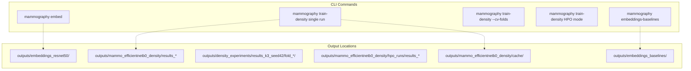
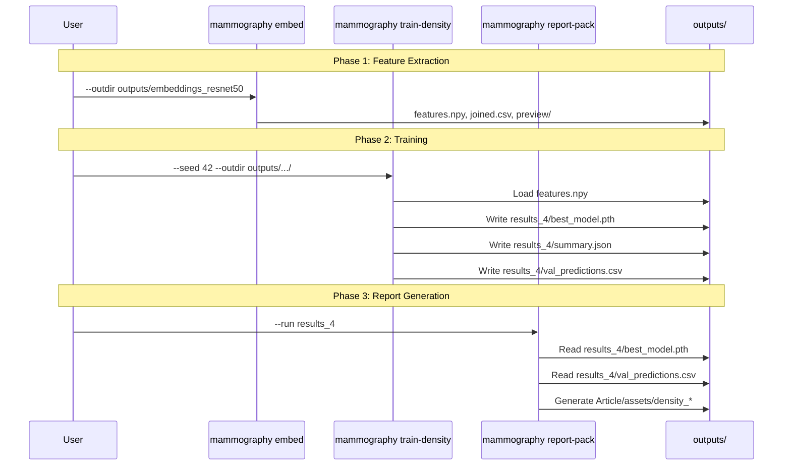

# Output Directory Structure

> **Relevant source files**
> * [Article/01-embeddings.md](https://github.com/ThalesMMS/mammography-pipelines/blob/01443313/Article/01-embeddings.md)
> * [Article/02-density.md](https://github.com/ThalesMMS/mammography-pipelines/blob/01443313/Article/02-density.md)

## Purpose and Scope

This page documents the organization of the `outputs/` directory, which serves as the primary artifact storage location for all CLI commands in the mammography pipeline. Each command produces a structured set of files in predictable locations, enabling reproducibility and downstream processing.

For information about the CLI commands that generate these outputs, see [Mammography CLI Reference](2%20Mammography-CLI-Reference.md). For details on artifact logging and metadata files, see [Artifact Logging](6c%20Artifact-Logging.md). For information on how these outputs integrate with documentation, see [Integrating ML Results with LaTeX](8d%20Integrating-ML-Results-with-LaTeX.md).

---

## Overview

The `outputs/` directory follows a hierarchical organization based on experiment type and run identifier. The top-level structure separates embedding extraction, density classification, and specialized experiments into distinct subdirectories:

```markdown
outputs/
├── embeddings_resnet50/          # Feature extraction artifacts
├── mammo_efficientnetb0_density/ # Standard training runs
│   ├── results_4/                # Seed 42 (canonical reference)
│   ├── results_5/                # Seed 43
│   ├── results_6/                # Seed 44
│   ├── hpo_runs/                 # Hyperparameter optimization trials
│   └── cache/                    # Disk cache for preprocessed images
├── density_experiments/          # Cross-validation and experimental runs
│   ├── results_k3_seed42/        # 3-fold CV
│   └── hparam_logs/              # Ray Tune logging
└── embeddings_baselines/         # Baseline comparison outputs
```

**Sources:** [Article/01-embeddings.md L1-L30](https://github.com/ThalesMMS/mammography-pipelines/blob/01443313/Article/01-embeddings.md#L1-L30)

 [Article/02-density.md L1-L97](https://github.com/ThalesMMS/mammography-pipelines/blob/01443313/Article/02-density.md#L1-L97)

---

## Directory Hierarchy

The following diagram shows the complete directory structure with file-level detail:

```mermaid
flowchart TD

outputs["outputs/"]
emb["embeddings_resnet50/"]
emb_feat["features.npy 2048-D embeddings"]
emb_csv["joined.csv metadata + embeddings"]
emb_preview["preview/ PCA/t-SNE plots"]
emb_clust["clustering_metrics.json"]
emb_log["run.log"]
density["mammo_efficientnetb0_density/"]
res4["results_4/ seed 42"]
res5["results_5/ seed 43"]
res6["results_6/ seed 44"]
hpo["hpo_runs/ HPO trials"]
cache["cache/ preprocessed images"]
r4_model["best_model.pth checkpoint"]
r4_hist["train_history.json loss/accuracy curves"]
r4_metrics["metrics/val_metrics.* CSV/JSON/PNG"]
r4_pred["val_predictions.csv prediction records"]
r4_emb["embeddings_val.npy validation embeddings"]
r4_summary["summary.json hyperparameters + git hash"]
r4_log["run.log execution log"]
cv["density_experiments/results_k3_seed42/"]
cv_fold1["fold_1/results/ same as single run"]
cv_fold2["fold_2/results/"]
cv_fold3["fold_3/results/"]
cv_summary["cv_summary.json aggregated metrics"]
cv_ray["ray_seed42_cv3.jsonl Ray Tune log"]

outputs -.-> emb
outputs -.-> density
outputs -.-> cv
res4 -.-> r4_model
res4 -.-> r4_hist
res4 -.-> r4_metrics
res4 -.-> r4_pred
res4 -.-> r4_emb
res4 -.-> r4_summary
res4 -.-> r4_log

subgraph Cross-Validation ["Cross-Validation"]
    cv
    cv_fold1
    cv_fold2
    cv_fold3
    cv_summary
    cv_ray
    cv -.-> cv_fold1
    cv -.-> cv_fold2
    cv -.-> cv_fold3
    cv -.-> cv_summary
    cv -.-> cv_ray
end

subgraph subGraph2 ["Single Run Contents"]
    r4_model
    r4_hist
    r4_metrics
    r4_pred
    r4_emb
    r4_summary
    r4_log
end

subgraph subGraph1 ["Density Classification"]
    density
    res4
    res5
    res6
    hpo
    cache
    density -.-> res4
    density -.-> res5
    density -.-> res6
    density -.-> hpo
    density -.-> cache
end

subgraph subGraph0 ["Embedding Extraction"]
    emb
    emb_feat
    emb_csv
    emb_preview
    emb_clust
    emb_log
    emb -.-> emb_feat
    emb -.-> emb_csv
    emb -.-> emb_preview
    emb -.-> emb_clust
    emb -.-> emb_log
end
```



**Sources:** [Article/01-embeddings.md L19](https://github.com/ThalesMMS/mammography-pipelines/blob/01443313/Article/01-embeddings.md#L19-L19)

 [Article/02-density.md L19-L21](https://github.com/ThalesMMS/mammography-pipelines/blob/01443313/Article/02-density.md#L19-L21)

 [Article/02-density.md L76](https://github.com/ThalesMMS/mammography-pipelines/blob/01443313/Article/02-density.md#L76-L76)

---

## Command-to-Output Mapping

This diagram illustrates how each CLI command populates specific directories:



**Sources:** [Article/01-embeddings.md L7-L14](https://github.com/ThalesMMS/mammography-pipelines/blob/01443313/Article/01-embeddings.md#L7-L14)

 [Article/02-density.md L6-L14](https://github.com/ThalesMMS/mammography-pipelines/blob/01443313/Article/02-density.md#L6-L14)

 [Article/02-density.md L62-L74](https://github.com/ThalesMMS/mammography-pipelines/blob/01443313/Article/02-density.md#L62-L74)

---

## Embedding Outputs: embeddings_resnet50/

Generated by `mammography embed`, this directory contains feature extraction artifacts from ResNet50:

| File/Directory | Format | Description |
| --- | --- | --- |
| `features.npy` | NumPy binary | 2048-dimensional embedding vectors (shape: `[N, 2048]`) |
| `joined.csv` | CSV | Metadata from `classificacao.csv` joined with embeddings |
| `preview/` | Directory | PCA, t-SNE, and UMAP visualization plots (PNG) |
| `clustering_metrics.json` | JSON | Silhouette score, Davies-Bouldin index, Calinski-Harabasz score |
| `run.log` | Text | Execution log with timestamps and processing statistics |

The `features.npy` file is the critical intermediate representation consumed by both `mammography train-density` (via `--embeddings-dir`) and `mammography embeddings-baselines`. The file uses NumPy's `.npy` binary format for efficient I/O and memory mapping.

**Example directory listing:**

```markdown
outputs/embeddings_resnet50/
├── features.npy              # 12,000+ samples × 2048 features
├── joined.csv                # Full dataset with embeddings flattened
├── clustering_metrics.json   # Silhouette: ~0.15, Davies-Bouldin: ~3.2
├── run.log                   # Timestamp: 2024-01-15 14:32:00
└── preview/
    ├── embeddings_pca.png
    ├── embeddings_tsne.png
    ├── embeddings_umap.png
    └── reconstruction_examples.png
```

**Sources:** [Article/01-embeddings.md L19](https://github.com/ThalesMMS/mammography-pipelines/blob/01443313/Article/01-embeddings.md#L19-L19)

 [Article/01-embeddings.md L28](https://github.com/ThalesMMS/mammography-pipelines/blob/01443313/Article/01-embeddings.md#L28-L28)

---

## Training Run Outputs: results_*

Each training run creates a `results_<ID>` directory under `outputs/mammo_efficientnetb0_density/`. The repository uses specific IDs for seed reproducibility:

| Run ID | Seed | Status | Description |
| --- | --- | --- | --- |
| `results_4` | 42 | Canonical reference | Primary run cited in documentation |
| `results_5` | 43 | Historical reference | Variance analysis |
| `results_6` | 44 | Historical reference | Variance analysis |

### Standard Run Contents

Each `results_*` directory contains:

```markdown
results_4/
├── best_model.pth             # PyTorch checkpoint (state dict + metadata)
├── train_history.json         # Epoch-wise loss/accuracy curves
├── val_predictions.csv        # Per-sample predictions with probabilities
├── embeddings_val.npy         # Validation set embeddings (if --save-embeddings)
├── summary.json               # Hyperparameters + git commit hash
├── run.log                    # Full execution log
└── metrics/
    ├── val_metrics.csv        # Structured metrics table
    ├── val_metrics.json       # Metrics in JSON format
    └── val_metrics.png        # Confusion matrix visualization
```

### File Format Details

**`summary.json`** — Complete experiment metadata:

```
{  "seed": 42,  "architecture": "efficientnetb0",  "epochs": 20,  "batch_size": 16,  "learning_rate": 0.0001,  "img_size": 512,  "class_weights": "auto",  "git_commit": "a1b2c3d4e5f6...",  "timestamp": "2024-01-15T14:32:00"}
```

**`train_history.json`** — Training curves:

```
{  "train_loss": [2.1, 1.8, 1.6, ...],  "train_acc": [0.3, 0.4, 0.5, ...],  "val_loss": [2.0, 1.9, 1.7, ...],  "val_acc": [0.35, 0.42, 0.51, ...]}
```

**`val_predictions.csv`** — Per-sample predictions:

```
AccessionNumber,true_label,predicted_label,prob_class1,prob_class2,prob_class3,prob_class4ACC001,3,3,0.05,0.12,0.78,0.05ACC002,2,3,0.03,0.25,0.68,0.04...
```

**`val_metrics.csv`** — Performance summary:

```
metric,valueaccuracy,0.676balanced_accuracy_adjusted,0.697kappa_quadratic,0.697macro_f1,0.584auc_ovr,0.913
```

**Sources:** [Article/02-density.md L19-L21](https://github.com/ThalesMMS/mammography-pipelines/blob/01443313/Article/02-density.md#L19-L21)

 [Article/02-density.md L37-L44](https://github.com/ThalesMMS/mammography-pipelines/blob/01443313/Article/02-density.md#L37-L44)

---

## Cross-Validation Outputs: fold_*

When using `--cv-folds k`, the output structure nests fold-specific results under a parent directory:

```markdown
outputs/density_experiments/results_k3_seed42/
├── cv_summary.json            # Aggregated metrics across folds
├── ray_seed42_cv3.jsonl      # Ray Tune structured log
├── fold_1/
│   ├── results/               # Same structure as results_*
│   │   ├── best_model.pth
│   │   ├── train_history.json
│   │   ├── val_predictions.csv
│   │   ├── metrics/
│   │   └── summary.json
│   └── optuna_trial.json      # Optuna trial metadata
├── fold_2/
│   └── results/
└── fold_3/
    └── results/
```

### cv_summary.json Structure

```
{  "num_folds": 3,  "seed": 42,  "metrics": {    "accuracy": {"mean": 0.659, "std": 0.024},    "kappa_quadratic": {"mean": 0.666, "std": 0.020},    "macro_f1": {"mean": 0.592, "std": 0.036},    "auc_ovr": {"mean": 0.878, "std": 0.010}  },  "fold_details": [    {"fold": 1, "accuracy": 0.672, "kappa": 0.695, "macro_f1": 0.643},    {"fold": 2, "accuracy": 0.634, "kappa": 0.647, "macro_f1": 0.571},    {"fold": 3, "accuracy": 0.671, "kappa": 0.656, "macro_f1": 0.562}  ]}
```

Each fold uses the same dataset split strategy (stratified by class and patient ID) to prevent data leakage while maintaining class balance.

**Sources:** [Article/02-density.md L60-L84](https://github.com/ThalesMMS/mammography-pipelines/blob/01443313/Article/02-density.md#L60-L84)

---

## Hyperparameter Optimization Outputs: hpo_runs/

HPO trials are isolated in `outputs/mammo_efficientnetb0_density/hpo_runs/` to avoid polluting the canonical results directory:

```markdown
hpo_runs/
├── results/                   # Trial 1
│   ├── optuna_trial.json     # Trial configuration
│   ├── ray_hpo_lr4e4.jsonl   # Ray Tune log
│   ├── metrics/
│   └── train_history.json
└── results_1/                 # Trial 2
    ├── optuna_trial.json
    ├── ray_hpo_lr2e4.jsonl
    ├── metrics/
    └── train_history.json
```

### optuna_trial.json Structure

```
{  "trial_id": "seed42_hpo_trial1",  "parameters": {    "learning_rate": 0.0004,    "backbone_lr_factor": 0.1,    "augmentation_enabled": true,    "dropout_rate": 0.3  },  "objective_value": 0.318,  "objective_metric": "macro_f1",  "status": "completed"}
```

HPO runs typically use `--subset` to reduce training time during search, making them unsuitable for final model selection without full-dataset retraining.

**Sources:** [Article/02-density.md L88-L96](https://github.com/ThalesMMS/mammography-pipelines/blob/01443313/Article/02-density.md#L88-L96)

---

## Cache Directory: cache/

The `--cache-mode disk` option creates a persistent cache of preprocessed images to accelerate repeated training runs:

```markdown
outputs/mammo_efficientnetb0_density/cache/
└── preprocessed_512x512/
    ├── ACC001_001.pt         # Torch tensor (preprocessed image)
    ├── ACC001_002.pt
    ├── ACC002_001.pt
    └── ...
```

Each `.pt` file contains a PyTorch tensor with shape `[C, H, W]` (typically `[3, 512, 512]`) after normalization and resizing. Cache files are named using `<AccessionNumber>_<ImageIndex>.pt` to ensure uniqueness.

The cache reduces I/O time from hours to minutes on subsequent runs with identical `--img-size`. Truncated cache files are automatically detected and regenerated.

**Sources:** [Article/02-density.md L49](https://github.com/ThalesMMS/mammography-pipelines/blob/01443313/Article/02-density.md#L49-L49)

---

## Baseline Comparison Outputs: embeddings_baselines/

The `mammography embeddings-baselines` command compares embeddings against classical features:

```markdown
outputs/embeddings_baselines/
├── report.md                  # Comparative analysis
├── embeddings_lr_metrics.json # Logistic Regression on embeddings
├── classical_lr_metrics.json  # Logistic Regression on PCA features
├── embeddings_svm_metrics.json
├── classical_svm_metrics.json
└── statistical_tests.json     # Paired t-tests
```

**Example `report.md` summary:**

* Embeddings + Logistic Regression: balanced accuracy 0.51, kappa 0.45
* Classical features (PCA): balanced accuracy 0.40, kappa 0.30
* Statistical significance: p-value 0.004 (paired t-test)

**Sources:** [Article/01-embeddings.md L29](https://github.com/ThalesMMS/mammography-pipelines/blob/01443313/Article/01-embeddings.md#L29-L29)

---

## Ray Tune Logging: hparam_logs/

When using Ray Tune integration (`--ray-trial-name`, `--ray-logdir`), structured logs are written to a separate directory:

```markdown
outputs/density_experiments/hparam_logs/
├── seed42_cv3/
│   ├── params.json           # Trial hyperparameters
│   ├── result.json           # Final metrics
│   └── progress.csv          # Epoch-wise metrics
└── seed42_hpo/
    ├── trial_1/
    ├── trial_2/
    └── ...
```

These logs enable integration with Ray's dashboard and analysis tools for hyperparameter optimization campaigns.

**Sources:** [Article/02-density.md L62-L74](https://github.com/ThalesMMS/mammography-pipelines/blob/01443313/Article/02-density.md#L62-L74)

---

## File Naming Conventions

The repository follows consistent naming patterns:

| Pattern | Example | Purpose |
| --- | --- | --- |
| `results_<ID>` | `results_4` | Numbered training runs (ID maps to seed) |
| `fold_<N>` | `fold_1` | Cross-validation fold index (1-based) |
| `*_seed<N>.*` | `density_confusion_seed42.png` | Seed-specific artifacts |
| `*.npy` | `features.npy` | NumPy binary arrays |
| `*.pt` / `*.pth` | `best_model.pth` | PyTorch checkpoints |
| `*_metrics.*` | `val_metrics.csv` | Performance metrics |
| `run.log` | `run.log` | Execution logs (consistent name) |
| `summary.json` | `summary.json` | Experiment metadata (consistent name) |

---

## Artifact Lifecycle

The following diagram shows how artifacts flow through the pipeline:



**Sources:** [Article/02-density.md L22-L23](https://github.com/ThalesMMS/mammography-pipelines/blob/01443313/Article/02-density.md#L22-L23)

---

## Storage Requirements

Approximate disk usage by component:

| Component | Size | Notes |
| --- | --- | --- |
| `embeddings_resnet50/features.npy` | ~100 MB | 12,000 samples × 2048 features × 4 bytes |
| `embeddings_resnet50/joined.csv` | ~50 MB | Text format with metadata |
| `results_*/best_model.pth` | ~20 MB | EfficientNetB0 weights |
| `results_*/embeddings_val.npy` | ~20 MB | Validation set embeddings |
| `cache/preprocessed_512x512/` | ~15 GB | Full dataset cache |
| `fold_*/` (3 folds) | ~180 MB | 3 × (model + artifacts) |
| `hpo_runs/` (per trial) | ~30 MB | Reduced when using `--subset` |

The cache directory dominates storage (~95% of total), but provides 50× speedup on I/O-bound operations.

---

## Cleanup and Maintenance

The repository's `.gitignore` excludes the entire `outputs/` directory to prevent committing large binary files. Users should implement their own backup strategy for important runs.

To reclaim disk space:

```
# Remove cache (regenerated automatically on next run)rm -rf outputs/mammo_efficientnetb0_density/cache/# Remove old HPO trialsrm -rf outputs/mammo_efficientnetb0_density/hpo_runs/# Archive historical seeds (keep only results_4)tar -czf results_historical.tar.gz outputs/mammo_efficientnetb0_density/results_{5,6}/rm -rf outputs/mammo_efficientnetb0_density/results_{5,6}/
```

For reproducibility, always preserve `summary.json` and `val_predictions.csv` from canonical runs, as these are sufficient to regenerate reports via `mammography report-pack`.

**Sources:** [Article/02-density.md L37-L50](https://github.com/ThalesMMS/mammography-pipelines/blob/01443313/Article/02-density.md#L37-L50)


### On this page

* [Output Directory Structure](#6.2-output-directory-structure)
* [Purpose and Scope](#6.2-purpose-and-scope)
* [Overview](#6.2-overview)
* [Directory Hierarchy](#6.2-directory-hierarchy)
* [Command-to-Output Mapping](#6.2-command-to-output-mapping)
* [Embedding Outputs: embeddings_resnet50/](#6.2-embedding-outputs-object-object)
* [Training Run Outputs: results_*](#6.2-training-run-outputs-object-object)
* [Standard Run Contents](#6.2-standard-run-contents)
* [File Format Details](#6.2-file-format-details)
* [Cross-Validation Outputs: fold_*](#6.2-cross-validation-outputs-object-object)
* [cv_summary.json Structure](#6.2-object-object-structure)
* [Hyperparameter Optimization Outputs: hpo_runs/](#6.2-hyperparameter-optimization-outputs-object-object)
* [optuna_trial.json Structure](#6.2-object-object-structure-1)
* [Cache Directory: cache/](#6.2-cache-directory-object-object)
* [Baseline Comparison Outputs: embeddings_baselines/](#6.2-baseline-comparison-outputs-object-object)
* [Ray Tune Logging: hparam_logs/](#6.2-ray-tune-logging-object-object)
* [File Naming Conventions](#6.2-file-naming-conventions)
* [Artifact Lifecycle](#6.2-artifact-lifecycle)
* [Storage Requirements](#6.2-storage-requirements)
* [Cleanup and Maintenance](#6.2-cleanup-and-maintenance)

Ask Devin about mammography-pipelines