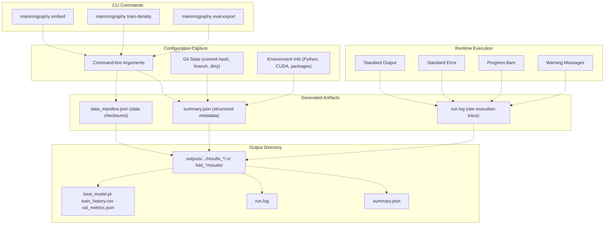
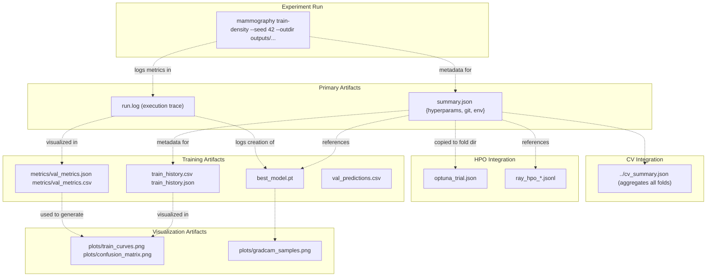
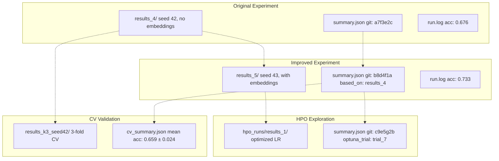

# Artifact Logging (summary.json, run.log)

> **Relevant source files**
> * [Article/02-density.md](https://github.com/ThalesMMS/mammography-pipelines/blob/01443313/Article/02-density.md)
> * [Article/chapters/01-introducao.tex](https://github.com/ThalesMMS/mammography-pipelines/blob/01443313/Article/chapters/01-introducao.tex)

## Purpose and Scope

This document describes the artifact logging system used throughout the mammography pipeline to ensure complete reproducibility and traceability of experiments. Every training run, embedding extraction, and evaluation produces two critical files: `summary.json` (structured metadata linking hyperparameters to code version) and `run.log` (complete execution trace). These artifacts enable precise recreation of experiments and forensic analysis of training behavior.

For information about the directory structure where these artifacts are stored, see [Output Directory Structure](6b%20Output-Directory-Structure.md). For how these artifacts support performance comparisons across experiments, see [Model Performance Comparisons](6d%20Model-Performance-Comparisons.md).

## Overview of Artifact Logging

The artifact logging system serves three primary functions:

1. **Reproducibility**: Links every experiment to its exact hyperparameters, data configuration, and code version (git commit hash)
2. **Debugging**: Captures complete terminal output including warnings, progress bars, and error traces
3. **Traceability**: Creates an audit trail connecting experimental results back to the code and configuration that produced them

Every command in the `mammography` CLI automatically generates these artifacts in the output directory specified by `--outdir`.

Sources: [Article/02-density.md L17-L22](https://github.com/ThalesMMS/mammography-pipelines/blob/01443313/Article/02-density.md#L17-L22)

 [Article/article.md L293-L297](https://github.com/ThalesMMS/mammography-pipelines/blob/01443313/Article/article.md#L293-L297)

## Artifact Generation Flow



**Diagram: Artifact Generation Pipeline** - Shows how CLI commands capture configuration and runtime information to produce `summary.json` and `run.log` artifacts.

Sources: [Article/02-density.md L17-L22](https://github.com/ThalesMMS/mammography-pipelines/blob/01443313/Article/02-density.md#L17-L22)

 [Article/article.md L125-L297](https://github.com/ThalesMMS/mammography-pipelines/blob/01443313/Article/article.md#L125-L297)

## summary.json Structure

### Purpose and Content

The `summary.json` file contains structured metadata about an experiment run. It serves as the canonical reference for reproducing the exact conditions under which a model was trained or embeddings were generated.

### Key Fields

| Field Category | Fields | Description |
| --- | --- | --- |
| **Hyperparameters** | `epochs`, `batch_size`, `learning_rate`, `optimizer`, `scheduler` | Training configuration |
| **Architecture** | `arch`, `num_classes`, `pretrained`, `freeze_backbone`, `unfreeze_last_block` | Model configuration |
| **Data Configuration** | `csv_path`, `dicom_root`, `train_size`, `val_size`, `class_distribution` | Dataset and split info |
| **Reproducibility** | `seed`, `git_commit`, `git_branch`, `git_dirty` | Code version tracking |
| **Environment** | `python_version`, `torch_version`, `cuda_version`, `hostname` | Runtime environment |
| **Execution** | `start_time`, `end_time`, `duration`, `command_line` | Execution metadata |
| **Integration** | `optuna_trial_id`, `ray_trial_name`, `cv_fold` | HPO/CV tracking |

### Example Structure

```
{  "experiment_type": "density_classification",  "run_id": "results_4",  "seed": 42,  "git_commit": "a7f3e2c",  "git_branch": "main",  "git_dirty": false,  "hyperparameters": {    "arch": "efficientnetb0",    "epochs": 20,    "batch_size": 16,    "img_size": 512,    "learning_rate": 0.0001,    "optimizer": "adam",    "scheduler": "cosine",    "warmup_epochs": 2,    "class_weights": "auto",    "train_augment": true  },  "data_config": {    "csv": "classificacao.csv",    "dicom_root": "archive",    "num_train": 1015,    "num_val": 254,    "class_distribution": {      "1": 32,      "2": 290,      "3": 679,      "4": 268    }  },  "model_config": {    "freeze_backbone": false,    "unfreeze_last_block": true,    "embeddings_fusion": true,    "embeddings_dir": "outputs/embeddings_resnet50"  },  "environment": {    "python_version": "3.10.12",    "torch_version": "2.1.0+cu118",    "cuda_available": true,    "cuda_version": "11.8"  },  "execution": {    "start_time": "2024-01-15T10:30:45",    "end_time": "2024-01-15T11:45:22",    "duration_seconds": 4477,    "command_line": "mammography train-density -- --csv classificacao.csv ..."  },  "integration": {    "optuna_trial_id": null,    "ray_trial_name": null,    "cv_fold": null  }}
```

### Git Tracking

The `git_commit`, `git_branch`, and `git_dirty` fields enable precise version control:

* **`git_commit`**: Short hash (7 chars) of the current commit
* **`git_branch`**: Current branch name (e.g., `main`, `feature/experiment`)
* **`git_dirty`**: Boolean indicating uncommitted changes exist

This ensures that any experiment can be traced back to its exact code version. If `git_dirty` is `true`, the experiment used modified code not in version control, which should be avoided for production runs.

Sources: [Article/02-density.md L20](https://github.com/ThalesMMS/mammography-pipelines/blob/01443313/Article/02-density.md#L20-L20)

 [Article/article.md L293-L295](https://github.com/ThalesMMS/mammography-pipelines/blob/01443313/Article/article.md#L293-L295)

## run.log Structure

### Purpose and Content

The `run.log` file captures the complete terminal output of a training or embedding run. Unlike `summary.json`, which contains structured metadata, `run.log` preserves the raw, unstructured execution trace including:

* Progress bars and epoch summaries
* Warning messages (e.g., cache truncation, missing data)
* Metric updates during training
* Final evaluation results
* Error traces if execution fails

### Example Content

```python
[2024-01-15 10:30:45] Starting density classification training
[2024-01-15 10:30:45] Loading data from classificacao.csv
[2024-01-15 10:30:46] Found 1269 samples (1015 train, 254 val)
[2024-01-15 10:30:46] Class distribution: {1: 32, 2: 290, 3: 679, 4: 268}
[2024-01-15 10:30:46] Excluding class 5 (0 samples)
[2024-01-15 10:30:47] Loading embeddings from outputs/embeddings_resnet50
[2024-01-15 10:30:48] Initializing EfficientNetB0 (freeze_backbone=False, unfreeze_last_block=True)
[2024-01-15 10:30:49] Model has 5.29M parameters (2.41M trainable)

Epoch 1/20
----------
[2024-01-15 10:35:12] train_loss: 1.234 | train_acc: 0.578 | train_kappa: 0.423
[2024-01-15 10:37:30] val_loss: 0.987 | val_acc: 0.654 | val_kappa: 0.512 | val_f1: 0.589
[2024-01-15 10:37:31] ✓ New best model (kappa: 0.512)

Epoch 2/20
----------
[2024-01-15 10:42:45] train_loss: 0.876 | train_acc: 0.723 | train_kappa: 0.612
[2024-01-15 10:45:03] val_loss: 0.823 | val_acc: 0.701 | val_kappa: 0.598 | val_f1: 0.612
[2024-01-15 10:45:04] ✓ New best model (kappa: 0.598)

...

WARNING: Disk cache truncation detected for 1 samples - regenerating
[2024-01-15 10:52:15] Cache rebuild complete (took 3.2s)

...

Epoch 20/20
-----------
[2024-01-15 11:40:12] train_loss: 0.234 | train_acc: 0.921 | train_kappa: 0.887
[2024-01-15 11:42:28] val_loss: 0.756 | val_acc: 0.733 | val_kappa: 0.756 | val_f1: 0.588

Training Complete
-----------------
Best epoch: 14
Best val_kappa: 0.756
Best val_acc: 0.733
Model saved to: outputs/mammo_efficientnetb0_density/results_5/best_model.pt
```

### Key Information Captured

| Information Type | Examples |
| --- | --- |
| **Data Loading** | Number of samples, class distribution, excluded classes |
| **Model Architecture** | Total parameters, trainable parameters, layer freezing status |
| **Training Progress** | Per-epoch metrics, learning rate updates, checkpoint saves |
| **Warnings** | Cache issues, data format problems, convergence warnings |
| **System Events** | Memory usage, CUDA availability, timing information |
| **Final Results** | Best checkpoint identification, final metrics, artifact locations |

The log format is designed to be both human-readable for debugging and machine-parseable for automated analysis.

Sources: [Article/02-density.md L18](https://github.com/ThalesMMS/mammography-pipelines/blob/01443313/Article/02-density.md#L18-L18)

 [Article/article.md L295-L297](https://github.com/ThalesMMS/mammography-pipelines/blob/01443313/Article/article.md#L295-L297)

## Artifact Relationships



**Diagram: Artifact Relationships** - Shows how `summary.json` and `run.log` relate to other experiment artifacts and how they integrate with cross-validation and hyperparameter optimization workflows.

Sources: [Article/02-density.md L19-L22](https://github.com/ThalesMMS/mammography-pipelines/blob/01443313/Article/02-density.md#L19-L22)

 [Article/article.md L125-L297](https://github.com/ThalesMMS/mammography-pipelines/blob/01443313/Article/article.md#L125-L297)

## Integration with Cross-Validation

When using `--cv-folds k`, the artifact logging system creates a hierarchical structure:

### Directory Structure

```markdown
outputs/density_experiments/results_k3_seed42/
├── fold_1/
│   └── results/
│       ├── summary.json          # Fold 1 specific config
│       ├── run.log                # Fold 1 execution log
│       ├── best_model.pt
│       └── metrics/val_metrics.json
├── fold_2/
│   └── results/
│       ├── summary.json          # Fold 2 specific config
│       ├── run.log                # Fold 2 execution log
│       ├── best_model.pt
│       └── metrics/val_metrics.json
├── fold_3/
│   └── results/
│       ├── summary.json          # Fold 3 specific config
│       ├── run.log                # Fold 3 execution log
│       ├── best_model.pt
│       └── metrics/val_metrics.json
└── cv_summary.json               # Aggregated results (mean ± std)
```

### cv_summary.json Structure

```
{  "experiment_name": "density_k3_seed42",  "num_folds": 3,  "base_seed": 42,  "git_commit": "a7f3e2c",  "aggregated_metrics": {    "accuracy": {      "mean": 0.659,      "std": 0.024,      "values": [0.685, 0.643, 0.649]    },    "kappa": {      "mean": 0.666,      "std": 0.020,      "values": [0.695, 0.652, 0.651]    },    "macro_f1": {      "mean": 0.592,      "std": 0.036,      "values": [0.643, 0.571, 0.562]    },    "auc": {      "mean": 0.878,      "std": 0.010,      "values": [0.891, 0.872, 0.871]    }  },  "fold_details": [    {      "fold": 1,      "best_epoch": 8,      "train_samples": 846,      "val_samples": 423,      "summary_path": "fold_1/results/summary.json"    },    {      "fold": 2,      "best_epoch": 9,      "train_samples": 846,      "val_samples": 423,      "summary_path": "fold_2/results/summary.json"    },    {      "fold": 3,      "best_epoch": 7,      "train_samples": 846,      "val_samples": 423,      "summary_path": "fold_3/results/summary.json"    }  ]}
```

Each fold's `summary.json` includes a `cv_fold` field identifying its position in the cross-validation sequence.

Sources: [Article/02-density.md L58-L86](https://github.com/ThalesMMS/mammography-pipelines/blob/01443313/Article/02-density.md#L58-L86)

## Integration with Hyperparameter Optimization

When using Optuna or Ray Tune integration via `--optuna-trial-id` or `--ray-trial-name`, additional artifacts are generated:

### optuna_trial.json

```
{  "trial_id": "seed42_cv3",  "trial_number": 1,  "params": {    "learning_rate": 0.0001,    "backbone_lr_ratio": 0.1,    "train_augment": true,    "warmup_epochs": 2  },  "value": 0.666,  "metric": "val_kappa",  "state": "COMPLETE",  "datetime_start": "2024-01-15T10:30:45",  "datetime_complete": "2024-01-15T11:45:22"}
```

### ray_hpo_*.jsonl

Ray Tune trials generate JSONL (JSON Lines) files with one JSON object per line, allowing streaming logging:

```
{"trial_name": "lr4e4", "iteration": 1, "val_acc": 0.543, "val_kappa": 0.412, "timestamp": "2024-01-15T10:35:12"}{"trial_name": "lr4e4", "iteration": 2, "val_acc": 0.612, "val_kappa": 0.523, "timestamp": "2024-01-15T10:42:30"}{"trial_name": "lr4e4", "iteration": 3, "val_acc": 0.634, "val_kappa": 0.589, "timestamp": "2024-01-15T10:49:45"}
```

These HPO artifacts are referenced in `summary.json` via the `integration` section, creating a bidirectional link between the experiment run and the HPO trial.

Sources: [Article/02-density.md L87-L96](https://github.com/ThalesMMS/mammography-pipelines/blob/01443313/Article/02-density.md#L87-L96)

## Practical Usage Patterns

### Reproducing an Experiment

Given a `summary.json` file, reproduce the exact experiment:

1. **Check out the code version**: ``` git checkout a7f3e2c  # Use git_commit from summary.json ```
2. **Verify no uncommitted changes** (if `git_dirty` was `false`): ``` git status  # Should be clean ```
3. **Extract and reconstruct the command**: ``` # Read command_line from summary.jsonmammography train-density -- \  --csv classificacao.csv \  --dicom-root archive \  --seed 42 \  --epochs 20 \  --batch-size 16 \  ... ```

### Debugging Failed Runs

When a run fails or produces unexpected results:

1. **Check `run.log` for warnings**: ``` grep "WARNING" outputs/mammo_efficientnetb0_density/results_5/run.log ```
2. **Identify divergence point**: ``` # Find last successful epochgrep "New best model" run.log ```
3. **Compare with successful runs**: ``` # Diff two summary.json filesdiff <(jq . results_4/summary.json) <(jq . results_5/summary.json) ```

### Tracking Experimental Lineage



**Diagram: Experimental Lineage Tracking** - Shows how `summary.json` files can reference previous experiments to maintain a lineage of improvements and variations.

Sources: [Article/02-density.md L35-L56](https://github.com/ThalesMMS/mammography-pipelines/blob/01443313/Article/02-density.md#L35-L56)

## Comparison with Related Systems

### vs. TensorBoard

| Feature | Artifact Logging | TensorBoard |
| --- | --- | --- |
| **Hyperparameter Tracking** | ✓ Complete in `summary.json` | ✓ Via hparams plugin |
| **Git Version** | ✓ Automatic | ✗ Manual tagging required |
| **Raw Terminal Output** | ✓ In `run.log` | ✗ Not captured |
| **Structured Metadata** | ✓ JSON format | Partial |
| **Standalone Files** | ✓ Self-contained | Requires viewer |
| **Environment Info** | ✓ Python, CUDA, packages | ✗ Not captured |

The artifact logging system complements TensorBoard rather than replacing it. Use `summary.json` + `run.log` for reproducibility and `TensorBoard` for interactive visualization during training.

### vs. MLflow

| Feature | Artifact Logging | MLflow |
| --- | --- | --- |
| **Setup Required** | ✗ Zero config | ✓ Server/backend required |
| **Git Integration** | ✓ Automatic commit tracking | ✓ Via client library |
| **File-based** | ✓ Plain JSON/text | ✓ Also supports file storage |
| **Querying** | Manual (grep, jq) | ✓ Rich query API |
| **Complexity** | Low | Medium |

The artifact logging system provides a lightweight, zero-dependency solution suitable for academic research. For production deployments with many users, MLflow offers more sophisticated tracking capabilities.

Sources: [Article/02-density.md L17-L22](https://github.com/ThalesMMS/mammography-pipelines/blob/01443313/Article/02-density.md#L17-L22)

 [Article/article.md L293-L297](https://github.com/ThalesMMS/mammography-pipelines/blob/01443313/Article/article.md#L293-L297)

## File Format Specifications

### summary.json Schema

```css
{  "$schema": "http://json-schema.org/draft-07/schema#",  "type": "object",  "required": ["experiment_type", "run_id", "seed", "git_commit", "hyperparameters"],  "properties": {    "experiment_type": {      "type": "string",      "enum": ["embedding_extraction", "density_classification", "evaluation"]    },    "run_id": {      "type": "string",      "pattern": "^results_[0-9]+$"    },    "seed": {      "type": "integer",      "description": "Random seed used for reproducibility"    },    "git_commit": {      "type": "string",      "pattern": "^[0-9a-f]{7}$",      "description": "Short git commit hash"    },    "git_dirty": {      "type": "boolean",      "description": "Whether uncommitted changes existed"    },    "hyperparameters": {      "type": "object",      "description": "All training hyperparameters"    },    "data_config": {      "type": "object",      "description": "Dataset and split configuration"    },    "environment": {      "type": "object",      "description": "Python, PyTorch, CUDA versions"    }  }}
```

### run.log Format

The `run.log` file follows a structured text format:

```
[TIMESTAMP] MESSAGE
```

Where:

* **TIMESTAMP**: ISO 8601 format `YYYY-MM-DD HH:MM:SS`
* **MESSAGE**: Free-form text including metrics, warnings, progress

Special markers:

* `✓` indicates successful checkpoint save
* `WARNING:` prefix for warning messages
* `Epoch N/M` for epoch boundaries
* `Training Complete` for final summary

The log is append-only and preserves the exact order of events as they occurred.

## Artifact Retention and Cleanup

### Retention Policy

| Artifact Type | Retention | Rationale |
| --- | --- | --- |
| **Best model runs** | Permanent | Reference for paper |
| **Exploratory runs** | 30 days | Temporary experiments |
| **Failed runs** | 7 days | Debug info only |
| **HPO trials** | Until best trial selected | Search process |
| **CV folds** | Permanent after selection | Statistical validation |

### Cleanup Commands

```
# Remove runs older than 30 daysfind outputs/ -name "results_*" -mtime +30 -type d -exec rm -rf {} \;# Remove failed runs (no best_model.pt)find outputs/ -type d -name "results_*" \  ! -exec test -e {}/best_model.pt \; \  -print -exec rm -rf {} \;# Archive old experimentstar -czf archive_2024_01.tar.gz outputs/mammo_efficientnetb0_density/results_*
```

Always preserve `summary.json` and `run.log` even if removing large model files, as they enable future analysis.

Sources: [Article/02-density.md L17-L22](https://github.com/ThalesMMS/mammography-pipelines/blob/01443313/Article/02-density.md#L17-L22)

## Automated Analysis Tools

### Extracting Metrics from summary.json

```
# Get best validation kappa across all runsjq -r '.hyperparameters.seed, .best_val_kappa' outputs/*/results_*/summary.json | \  paste - - | sort -k2 -rn | head -n 5
```

### Searching run.log Files

```
# Find all cache warningsgrep -r "cache truncation" outputs/*/results_*/run.log# Extract final metrics from all runsgrep "Training Complete" -A 5 outputs/*/results_*/run.log | \  grep "Best val_kappa"
```

### Comparing Hyperparameters

```
# Compare learning rates across experimentsjq -r '[.run_id, .hyperparameters.learning_rate] | @tsv' \  outputs/*/results_*/summary.json
```

## Summary

The artifact logging system provides comprehensive experiment tracking through two complementary files:

1. **`summary.json`**: Structured metadata enabling exact reproducibility via hyperparameter tracking, git version control, and environment capture
2. **`run.log`**: Complete execution trace for debugging, containing warnings, progress, and timing information

Together, these artifacts form the foundation of the reproducibility framework, integrating seamlessly with cross-validation, hyperparameter optimization, and the broader experiment tracking infrastructure described in [Reproducibility and Experiment Tracking](6%20Reproducibility-and-Experiment-Tracking.md).

Sources: [Article/02-density.md L17-L22](https://github.com/ThalesMMS/mammography-pipelines/blob/01443313/Article/02-density.md#L17-L22)

 [Article/article.md L293-L297](https://github.com/ThalesMMS/mammography-pipelines/blob/01443313/Article/article.md#L293-L297)


### On this page

* [Artifact Logging (summary.json, run.log)](#6.3-artifact-logging-summaryjson-runlog)
* [Purpose and Scope](#6.3-purpose-and-scope)
* [Overview of Artifact Logging](#6.3-overview-of-artifact-logging)
* [Artifact Generation Flow](#6.3-artifact-generation-flow)
* [summary.json Structure](#6.3-summaryjson-structure)
* [Purpose and Content](#6.3-purpose-and-content)
* [Key Fields](#6.3-key-fields)
* [Example Structure](#6.3-example-structure)
* [Git Tracking](#6.3-git-tracking)
* [run.log Structure](#6.3-runlog-structure)
* [Purpose and Content](#6.3-purpose-and-content-1)
* [Example Content](#6.3-example-content)
* [Key Information Captured](#6.3-key-information-captured)
* [Artifact Relationships](#6.3-artifact-relationships)
* [Integration with Cross-Validation](#6.3-integration-with-cross-validation)
* [Directory Structure](#6.3-directory-structure)
* [cv_summary.json Structure](#6.3-cv_summaryjson-structure)
* [Integration with Hyperparameter Optimization](#6.3-integration-with-hyperparameter-optimization)
* [optuna_trial.json](#6.3-optuna_trialjson)
* [ray_hpo_*.jsonl](#6.3-ray_hpo_jsonl)
* [Practical Usage Patterns](#6.3-practical-usage-patterns)
* [Reproducing an Experiment](#6.3-reproducing-an-experiment)
* [Debugging Failed Runs](#6.3-debugging-failed-runs)
* [Tracking Experimental Lineage](#6.3-tracking-experimental-lineage)
* [Comparison with Related Systems](#6.3-comparison-with-related-systems)
* [vs. TensorBoard](#6.3-vs-tensorboard)
* [vs. MLflow](#6.3-vs-mlflow)
* [File Format Specifications](#6.3-file-format-specifications)
* [summary.json Schema](#6.3-summaryjson-schema)
* [run.log Format](#6.3-runlog-format)
* [Artifact Retention and Cleanup](#6.3-artifact-retention-and-cleanup)
* [Retention Policy](#6.3-retention-policy)
* [Cleanup Commands](#6.3-cleanup-commands)
* [Automated Analysis Tools](#6.3-automated-analysis-tools)
* [Extracting Metrics from summary.json](#6.3-extracting-metrics-from-summaryjson)
* [Searching run.log Files](#6.3-searching-runlog-files)
* [Comparing Hyperparameters](#6.3-comparing-hyperparameters)
* [Summary](#6.3-summary)

Ask Devin about mammography-pipelines