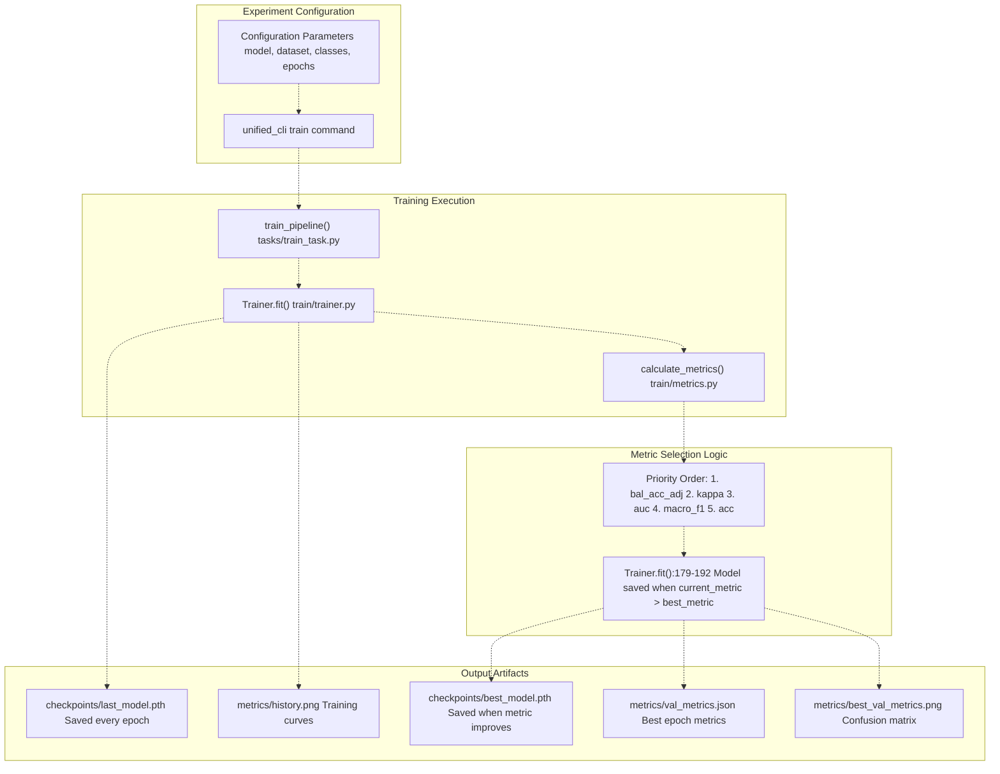
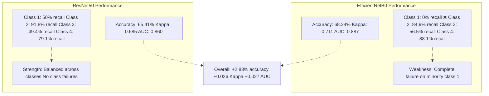
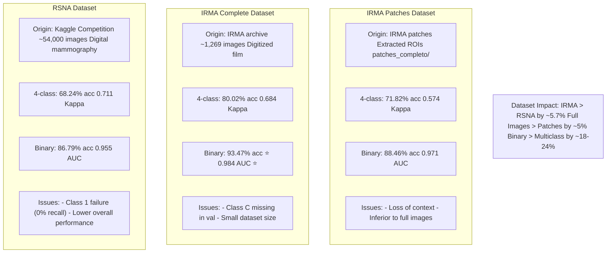
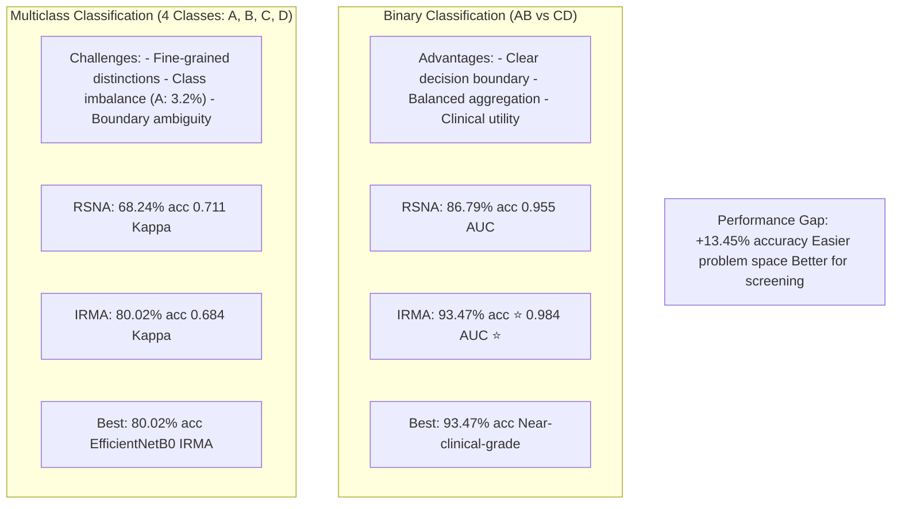
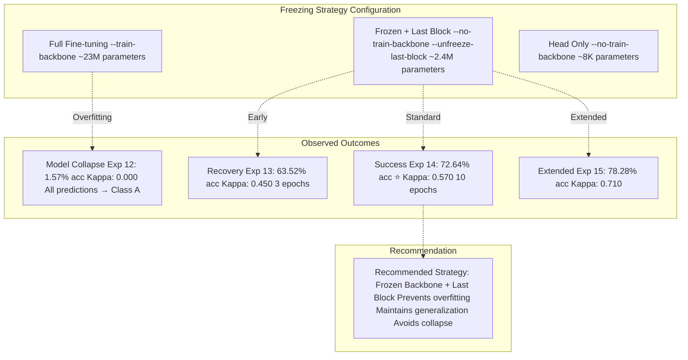
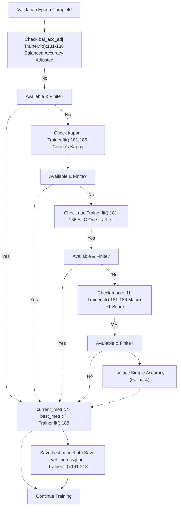

# Model Performance Comparisons

> **Relevant source files**
> * [Article/02-density.md](https://github.com/ThalesMMS/mammography-pipelines/blob/01443313/Article/02-density.md)
> * [Article/article.md](https://github.com/ThalesMMS/mammography-pipelines/blob/01443313/Article/article.md)

This page provides detailed comparisons of model architectures (ResNet50 vs EfficientNetB0), datasets (RSNA, IRMA complete, IRMA patches), and training strategies (binary vs multiclass, various freezing configurations) tested in this project. For information about the training pipeline itself, see [Training System](3c%20Transfer-Learning-Strategies.md). For details on the metrics used for evaluation, see [Robust Metrics for Imbalanced Data](5c%20Grad-CAM-Visualizations.md).

---

## Experiment Structure and Outputs

All experiments follow a consistent structure that maps directly to output directories and metric artifacts. Understanding this structure is essential for interpreting results.



**Sources:** [Article/article.md L1-L512](https://github.com/ThalesMMS/mammography-pipelines/blob/01443313/Article/article.md#L1-L512)

 [unified_cli/train/trainer.py L179-L192](https://github.com/ThalesMMS/mammography-pipelines/blob/01443313/unified_cli/train/trainer.py#L179-L192)

 [unified_cli/train/metrics.py L1-L223](https://github.com/ThalesMMS/mammography-pipelines/blob/01443313/unified_cli/train/metrics.py#L1-L223)

---

## Consolidated Experiment Results

The following table presents all experiments documented in the project, providing a comprehensive view of model performance across different configurations.

| Experiment ID | Model | Dataset | Classes | Accuracy | Kappa | AUC | Macro F1 | Notes |
| --- | --- | --- | --- | --- | --- | --- | --- | --- |
| 1 | ResNet50 | RSNA | 4 | 65.41% | 0.685 | 0.860 | 0.618 | Baseline RSNA multiclass |
| 2 | EfficientNetB0 | RSNA | 4 | 68.24% | 0.711 | 0.887 | 0.523 | Better metrics, class 1 failure |
| 3 | ResNet50 | RSNA | 2 (AB/CD) | 79.25% | 0.566 | 0.925 | 0.773 | Binary classification |
| 4 | EfficientNetB0 | RSNA | 2 (AB/CD) | 86.79% | 0.694 | 0.955 | 0.845 | Best RSNA binary |
| 5 | EfficientNetB0 | IRMA | 2 (AB/CD) | **93.47%** | **0.834** | **0.984** | 0.917 | **Best overall binary** |
| 6 | EfficientNetB0 | IRMA | 4 | 80.02% | 0.684 | - | 0.603 | Class C missing in val |
| 7 | EfficientNetB0 | IRMA Patches | 2 (AB/CD) | 88.46% | 0.728 | 0.971 | 0.863 | Patches inferior to full |
| 8 | EfficientNetB0 | IRMA Patches | 4 | 71.82% | 0.574 | - | 0.542 | Patches multiclass |
| 9 | ResNet50 | IRMA (density) | 4 | 76.62% | 0.855 | 0.933 | 0.767 | Balanced dataset |
| 10 | ResNet50 | IRMA (baseline) | 4 | 72.44% | 0.836 | 0.924 | 0.721 | Standard configuration |
| 11 | ResNet50 | IRMA (warmup) | 4 | 24.01% | 0.479 | 0.771 | 0.178 | Warmup failed |
| 12 | ResNet50 | IRMA (frozen run1) | 4 | 1.57% | 0.000 | 0.595 | 0.008 | **Model collapse** |
| 13 | ResNet50 | IRMA (frozen run2) | 4 | 63.52% | 0.450 | 0.850 | 0.550 | 3 epochs recovery |
| 14 | ResNet50 | IRMA (frozen run4) | 4 | **72.64%** | **0.570** | **0.875** | 0.610 | **Best multiclass** |
| 15 | ResNet50 | IRMA (frozen) | 4 | 78.28% | 0.710 | 0.943 | 0.783 | Extended training |
| 16 | ResNet50 | IRMA (frozen) | 2 (AB/CD) | 85.99% | 0.720 | 0.941 | 0.860 | Frozen binary |
| 17 | ResNet50 | IRMA Patches (frozen) | 4 | 66.14% | 0.549 | 0.876 | 0.661 | Patches frozen |
| 18 | ResNet50 | IRMA Patches (frozen) | 2 (AB/CD) | 84.60% | 0.692 | 0.921 | 0.846 | Patches binary frozen |

**Key Findings:**

* **Best Binary Model:** EfficientNetB0 on IRMA complete (93.47% accuracy, 0.984 AUC)
* **Best Multiclass Model:** ResNet50 on IRMA frozen run4 (72.64% accuracy, 0.570 Kappa)
* **Model Collapse:** Experiment 12 demonstrates complete failure (1.57% accuracy)
* **Dataset Impact:** IRMA consistently outperforms RSNA across all configurations
* **Full Images > Patches:** Complete mammograms outperform patches by 4-6% in binary tasks

**Sources:** [Article/article.md L145-L166](https://github.com/ThalesMMS/mammography-pipelines/blob/01443313/Article/article.md#L145-L166)

 [Article/article.md L167-L390](https://github.com/ThalesMMS/mammography-pipelines/blob/01443313/Article/article.md#L167-L390)

---

## Architecture Comparison: ResNet50 vs EfficientNetB0

### RSNA Dataset (4 Classes)



### RSNA Dataset (Binary AB/CD)

| Metric | ResNet50 | EfficientNetB0 | Winner |
| --- | --- | --- | --- |
| Accuracy | 79.25% | 86.79% | **EfficientNetB0** (+7.54%) |
| Kappa | 0.566 | 0.694 | **EfficientNetB0** (+0.128) |
| AUC | 0.925 | 0.955 | **EfficientNetB0** (+0.030) |
| Class AB Recall | 98.8% | 95.1% | ResNet50 (+3.7%) |
| Class CD Recall | 72.6% | 84.0% | **EfficientNetB0** (+11.4%) |

**Per-Class Detailed Metrics (ResNet50):**

| Class | Precision | Recall | F1-Score | Support |
| --- | --- | --- | --- | --- |
| AB | 55.2% | 98.8% | 0.71 | 81 |
| CD | 99.4% | 72.6% | 0.84 | 237 |

**Per-Class Detailed Metrics (EfficientNetB0):**

| Class | Precision | Recall | F1-Score | Support |
| --- | --- | --- | --- | --- |
| AB | 67.0% | 95.1% | 0.79 | 81 |
| CD | 98.0% | 84.0% | 0.90 | 237 |

**Analysis:**

* EfficientNetB0 provides superior global metrics for binary classification
* ResNet50 achieves slightly better recall on minority class (AB) but at cost of precision
* EfficientNetB0's balanced performance makes it preferable for production binary classification
* The 7.54% accuracy improvement and 0.128 Kappa improvement are substantial

**Sources:** [Article/article.md L167-L213](https://github.com/ThalesMMS/mammography-pipelines/blob/01443313/Article/article.md#L167-L213)

 [Compare L59-L106](https://github.com/ThalesMMS/mammography-pipelines/blob/01443313/Compare%20Model%20Performance.md#L59-L106)

 [Compare L274-L299](https://github.com/ThalesMMS/mammography-pipelines/blob/01443313/Compare%20Model%20Performance.md#L274-L299)

---

## Dataset Comparison



### EfficientNetB0 Dataset Comparison (4 Classes)

| Dataset | Accuracy | Kappa | Macro F1 | Observations |
| --- | --- | --- | --- | --- |
| RSNA | 68.24% | 0.711 | 0.523 | Class 1 with 0% recall |
| IRMA Complete | **80.02%** | 0.684 | **0.603** | Class C absent from validation |
| IRMA Patches | 71.82% | 0.574 | 0.542 | Reduced performance vs full images |

**IRMA Complete Per-Class Performance:**

| Class | Precision | Recall | F1-Score | Support |
| --- | --- | --- | --- | --- |
| A | 84.8% | 91.2% | 0.88 | 628 |
| B | 80.4% | 56.1% | 0.66 | 314 |
| C | 0.0% | 0.0% | 0.00 | 0 ⚠️ |
| D | 94.1% | 81.5% | 0.87 | 314 |

**IRMA Patches Per-Class Performance:**

| Class | Precision | Recall | F1-Score | Support |
| --- | --- | --- | --- | --- |
| A | 88.7% | 87.6% | 0.88 | 628 |
| B | 66.0% | 44.6% | 0.53 | 314 |
| C | 0.0% | 0.0% | 0.00 | 0 ⚠️ |
| D | 85.8% | 67.5% | 0.76 | 314 |

### EfficientNetB0 Dataset Comparison (Binary)

| Dataset | Accuracy | Kappa | AUC | Macro F1 |
| --- | --- | --- | --- | --- |
| RSNA | 86.79% | 0.694 | 0.955 | 0.845 |
| IRMA Complete | **93.47%** ⭐ | **0.834** ⭐ | **0.984** ⭐ | **0.917** ⭐ |
| IRMA Patches | 88.46% | 0.728 | 0.971 | 0.863 |

**Key Insights:**

1. **IRMA Complete dominates:** 93.47% accuracy represents near-clinical-grade performance for binary classification
2. **Context matters:** Full mammograms outperform patches by 5.01% in binary classification, suggesting global context is crucial for density assessment
3. **Class C stratification issue:** Both IRMA configurations suffer from missing Class C in validation, indicating a data splitting problem (see [Data Splitting and Sampling](4d%20Class-Imbalance-Handling.md))

**Sources:** [Article/article.md L215-L261](https://github.com/ThalesMMS/mammography-pipelines/blob/01443313/Article/article.md#L215-L261)

 [Compare L181-L229](https://github.com/ThalesMMS/mammography-pipelines/blob/01443313/Compare%20Model%20Performance.md#L181-L229)

 [Compare L301-L351](https://github.com/ThalesMMS/mammography-pipelines/blob/01443313/Compare%20Model%20Performance.md#L301-L351)

---

## Binary vs Multiclass Performance

The complexity of the classification task significantly impacts model performance across all configurations.



### Quantitative Comparison

| Configuration | 4-Class Acc | Binary Acc | Improvement | Clinical Readiness |
| --- | --- | --- | --- | --- |
| EfficientNetB0 RSNA | 68.24% | 86.79% | **+18.55%** | Binary: Ready for screening |
| EfficientNetB0 IRMA | 80.02% | 93.47% | **+13.45%** | Binary: Ready for deployment |
| ResNet50 IRMA frozen | 72.64% | 85.99% | **+13.35%** | Both: Need improvement |

**Clinical Interpretation:**

* **Binary classification (AB vs CD)** simplifies the task to "low/normal density" vs "high density," which aligns well with clinical decision-making for screening
* The **93.47% accuracy and 0.984 AUC** for binary IRMA classification approaches the reliability needed for clinical assistance tools
* **Multiclass accuracy of ~80%** suggests that fine-grained BI-RADS classification remains challenging and may benefit from ensemble methods or human-in-the-loop approaches

**Sources:** [Article/article.md L215-L261](https://github.com/ThalesMMS/mammography-pipelines/blob/01443313/Article/article.md#L215-L261)

 [Article/article.md L404-L426](https://github.com/ThalesMMS/mammography-pipelines/blob/01443313/Article/article.md#L404-L426)

---

## Impact of Freezing Strategies

The choice of which layers to train has profound implications for model performance, particularly in preventing model collapse on imbalanced datasets.



### Evolution of Frozen Strategy (resnet_frozen_run4)

The best multiclass model (Experiment 14) demonstrates the training progression with the frozen backbone + unfrozen last block strategy:

| Epoch | Train Loss | Train Acc | Val Loss | Val Acc | Val Kappa | Notes |
| --- | --- | --- | --- | --- | --- | --- |
| 1 | 1.02 | 57.8% | 0.72 | 65.4% | 0.43 | Initial convergence |
| 2 | 0.67 | 78.5% | 0.75 | 66.0% | 0.45 | Rapid learning |
| 3 | 0.55 | 80.6% | 0.64 | 70.4% | 0.51 | Val improves |
| 4 | 0.49 | 83.5% | 0.66 | 70.8% | 0.52 | Stable |
| 5 | 0.46 | 84.1% | 0.64 | 71.7% | 0.53 | Best so far |
| 6 | 0.42 | 85.3% | 0.64 | 71.1% | 0.52 | Train continues up |
| 7 | 0.39 | 85.0% | 0.64 | 71.7% | 0.53 | Stable |
| 8 | 0.35 | 87.2% | 0.65 | **72.6%** | **0.57** | **Best checkpoint** ⭐ |
| 9 | 0.38 | 84.5% | 0.73 | 70.4% | 0.55 | Val degrades |
| 10 | 0.31 | 87.2% | 0.75 | 70.4% | 0.55 | Overfitting signs |

### Confusion Matrix (Best Epoch 8)

```
Predicted
           A    B    C    D
      ┌────────────────────┐
    A │  2    6    0    0  │  25% recall
True B │  4   58   11    0  │  79% recall
    C │  0   42   98   30  │  58% recall
    D │  0    1    9   57  │  85% recall
      └────────────────────┘
```

**Per-Class Analysis:**

| Class | Precision | Recall | F1-Score | Support | Observations |
| --- | --- | --- | --- | --- | --- |
| A | 33% | 25% | 0.29 | 8 | Minority class struggles |
| B | 54% | 79% | 0.64 | 73 | Balanced performance |
| C | 83% | 58% | 0.68 | 170 | Often confused with B and D |
| D | 66% | 85% | 0.74 | 67 | Best recall (most distinctive) |

**Key Observations:**

1. **Epoch 8 is optimal:** Val accuracy peaks at 72.6%, after which overfitting begins
2. **Training continues to improve:** Train accuracy reaches 87.2% while validation degrades, classic overfitting pattern
3. **Frozen strategy prevents collapse:** No single-class prediction domination (pred_unique = 4)
4. **Class D most distinctive:** 85% recall suggests high-density breasts have clearer visual markers
5. **Class A struggles:** Only 25% recall with 8 samples demonstrates extreme minority class challenge
6. **Class C confusion:** Intermediate density (C) frequently misclassified as B (42 samples) or D (30 samples)

### Strategy Comparison Across IRMA Configurations

| Configuration | Strategy | Accuracy | Kappa | AUC | Macro F1 | Val Loss |
| --- | --- | --- | --- | --- | --- | --- |
| IRMA Complete 4-class | Frozen + Last Block | 78.28% | 0.710 | 0.943 | 0.783 | 0.738 |
| IRMA Complete Binary | Frozen + Last Block | 85.99% | 0.720 | 0.941 | 0.860 | 0.558 |
| IRMA Patches 4-class | Frozen + Last Block | 66.14% | 0.549 | 0.876 | 0.661 | 0.808 |
| IRMA Patches Binary | Frozen + Last Block | 84.60% | 0.692 | 0.921 | 0.846 | 0.376 |

**Strategic Insights:**

1. **Frozen + Last Block is universally effective:** Prevents collapse across all dataset/task combinations
2. **Parameter efficiency:** 2.4M trainable parameters vs 23M for full fine-tuning (~10x reduction)
3. **Overfitting prevention:** Lower validation loss in binary tasks indicates better generalization
4. **Consistent improvement:** 10+ epochs with frozen strategy shows steady learning without collapse

**Sources:** [Article/article.md L291-L373](https://github.com/ThalesMMS/mammography-pipelines/blob/01443313/Article/article.md#L291-L373)

 [Article/article.md L374-L389](https://github.com/ThalesMMS/mammography-pipelines/blob/01443313/Article/article.md#L374-L389)

 [outputs/resnet_frozen_run2/checkpoints/best_model.pth L1-L2](https://github.com/ThalesMMS/mammography-pipelines/blob/01443313/outputs/resnet_frozen_run2/checkpoints/best_model.pth#L1-L2)

 [Article/assets/history_run4.png L1-L2](https://github.com/ThalesMMS/mammography-pipelines/blob/01443313/Article/assets/history_run4.png#L1-L2)

 [Article/assets/confusion_matrix_run4.png L1-L2](https://github.com/ThalesMMS/mammography-pipelines/blob/01443313/Article/assets/confusion_matrix_run4.png#L1-L2)

---

## Metric Selection Hierarchy

Understanding how the "best" model is selected is crucial for interpreting experiment results. The system implements a prioritized metric selection strategy designed to detect model collapse and prioritize robust performance on imbalanced data.



### Metric Priority Rationale

The hierarchy prioritizes metrics that are robust to class imbalance:

1. **`bal_acc_adj` (Balanced Accuracy Adjusted)**: Chance-corrected average of per-class recall, prevents misleadingly high scores from majority-class bias
2. **`kappa` (Cohen's Kappa)**: Measures agreement beyond chance, detects model collapse (0.000 in Exp 12)
3. **`auc` (Area Under ROC Curve, One-vs-Rest)**: Measures discrimination ability across all threshold values
4. **`macro_f1`**: Unweighted average of per-class F1 scores, treats all classes equally
5. **`acc` (Simple Accuracy)**: Fallback only, can be misleading with imbalance (e.g., 1.57% in Exp 12 vs 66.9% naive baseline)

### Metric Calculation and Storage

The `calculate_metrics()` function in [unified_cli/train/metrics.py L15-L109](https://github.com/ThalesMMS/mammography-pipelines/blob/01443313/unified_cli/train/metrics.py#L15-L109)

 computes all available metrics after each validation epoch. Key metrics include:

```css
# From train/metrics.py - metrics computed per epochmetrics = {    "acc": accuracy,                    # Simple accuracy    "bal_acc_adj": bal_acc_adj,        # Chance-corrected balanced accuracy      "kappa": kappa,                     # Cohen's Kappa    "auc": auc_ovr if auc_ovr else None,  # AUC One-vs-Rest (if multiclass)    "macro_f1": macro_f1,              # Macro-averaged F1    "conf_matrix": conf_matrix,         # Confusion matrix    "per_class": per_class_metrics      # Precision, recall, F1 per class}
```

The trainer saves the best model based on the selected metric, along with a complete snapshot of all metrics from that epoch in `val_metrics.json`. This allows post-hoc analysis of model performance using any metric, not just the one used for selection.

### Example: Detecting Model Collapse

Experiment 12 demonstrates why this hierarchy is critical:

| Metric | Value | Interpretation |
| --- | --- | --- |
| Simple Accuracy | 1.57% | Appears catastrophic |
| Balanced Accuracy | ~25% | At chance level (1/4 classes) |
| Cohen's Kappa | 0.000 | **No agreement beyond chance** |
| pred_unique | 1 | **All predictions → Class A** |
| pred_counts | [318, 0, 0, 0] | Complete collapse to majority |

Without Kappa or balanced accuracy, one might misinterpret this as a 1.57% accurate model. The robust metrics immediately reveal the true issue: the model predicts only the majority class and performs no better than random chance.

**Sources:** [unified_cli/train/trainer.py L131-L223](https://github.com/ThalesMMS/mammography-pipelines/blob/01443313/unified_cli/train/trainer.py#L131-L223)

 [unified_cli/train/metrics.py L15-L109](https://github.com/ThalesMMS/mammography-pipelines/blob/01443313/unified_cli/train/metrics.py#L15-L109)

 [Article/article.md L291-L319](https://github.com/ThalesMMS/mammography-pipelines/blob/01443313/Article/article.md#L291-L319)

---

## Practical Recommendations

Based on the consolidated experiment results, the following recommendations apply to different use cases:

### For Production Deployment (Binary Classification)

**Recommended Configuration:**

* **Model:** EfficientNetB0
* **Dataset:** IRMA Complete (or similar high-quality digitized film)
* **Classes:** Binary (AB vs CD)
* **Strategy:** Frozen backbone + unfrozen last block
* **Expected Performance:** 93.47% accuracy, 0.984 AUC

**Command Example:**

```
python -m unified_cli train \    --dataset-format archive \    --model efficientnetb0 \    --classes 2 \    --epochs 20 \    --no-train-backbone \    --unfreeze-last-block \    --outdir outputs/production_binary
```

### For Research (Multiclass Fine-grained Classification)

**Recommended Configuration:**

* **Model:** ResNet50 or EfficientNetB0
* **Dataset:** IRMA Complete with balanced sampling
* **Classes:** 4 (A, B, C, D)
* **Strategy:** Frozen backbone + unfrozen last block
* **Expected Performance:** 72-80% accuracy, 0.57-0.71 Kappa

**Key Challenges to Address:**

1. **Class C stratification:** Ensure all classes appear in validation (see [Data Splitting and Sampling](4d%20Class-Imbalance-Handling.md))
2. **Minority class performance:** Class A (3.2% of data) struggles with only 25-50% recall
3. **Intermediate class confusion:** Class C frequently confused with adjacent classes B and D

### For Dataset Comparison Studies

When comparing new datasets or preprocessing methods:

* Use **frozen backbone + last block** to isolate dataset effects from training dynamics
* Run both **binary and multiclass** to assess task complexity
* Compare against **RSNA baseline (68.24% multiclass, 86.79% binary)** and **IRMA baseline (80.02% multiclass, 93.47% binary)**
* Monitor **pred_unique** metric to detect early signs of collapse

**Sources:** [Article/article.md L428-L451](https://github.com/ThalesMMS/mammography-pipelines/blob/01443313/Article/article.md#L428-L451)

 [unified_cli/tasks/train_task.py L1-L200](https://github.com/ThalesMMS/mammography-pipelines/blob/01443313/unified_cli/tasks/train_task.py#L1-L200)


### On this page

* [Model Performance Comparisons](#6.4-model-performance-comparisons)
* [Experiment Structure and Outputs](#6.4-experiment-structure-and-outputs)
* [Consolidated Experiment Results](#6.4-consolidated-experiment-results)
* [Architecture Comparison: ResNet50 vs EfficientNetB0](#6.4-architecture-comparison-resnet50-vs-efficientnetb0)
* [RSNA Dataset (4 Classes)](#6.4-rsna-dataset-4-classes)
* [RSNA Dataset (Binary AB/CD)](#6.4-rsna-dataset-binary-abcd)
* [Dataset Comparison](#6.4-dataset-comparison)
* [EfficientNetB0 Dataset Comparison (4 Classes)](#6.4-efficientnetb0-dataset-comparison-4-classes)
* [EfficientNetB0 Dataset Comparison (Binary)](#6.4-efficientnetb0-dataset-comparison-binary)
* [Binary vs Multiclass Performance](#6.4-binary-vs-multiclass-performance)
* [Quantitative Comparison](#6.4-quantitative-comparison)
* [Impact of Freezing Strategies](#6.4-impact-of-freezing-strategies)
* [Evolution of Frozen Strategy (resnet_frozen_run4)](#6.4-evolution-of-frozen-strategy-resnet_frozen_run4)
* [Confusion Matrix (Best Epoch 8)](#6.4-confusion-matrix-best-epoch-8)
* [Strategy Comparison Across IRMA Configurations](#6.4-strategy-comparison-across-irma-configurations)
* [Metric Selection Hierarchy](#6.4-metric-selection-hierarchy)
* [Metric Priority Rationale](#6.4-metric-priority-rationale)
* [Metric Calculation and Storage](#6.4-metric-calculation-and-storage)
* [Example: Detecting Model Collapse](#6.4-example-detecting-model-collapse)
* [Practical Recommendations](#6.4-practical-recommendations)
* [For Production Deployment (Binary Classification)](#6.4-for-production-deployment-binary-classification)
* [For Research (Multiclass Fine-grained Classification)](#6.4-for-research-multiclass-fine-grained-classification)
* [For Dataset Comparison Studies](#6.4-for-dataset-comparison-studies)

Ask Devin about mammography-pipelines