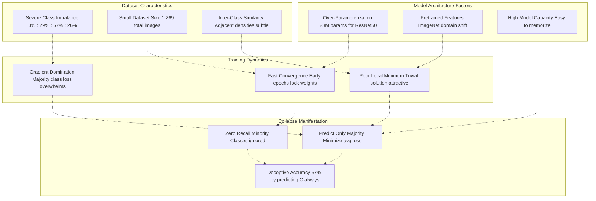
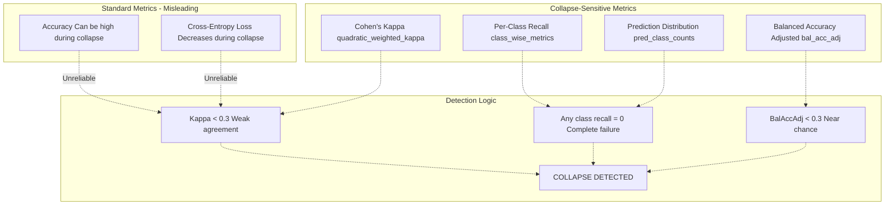
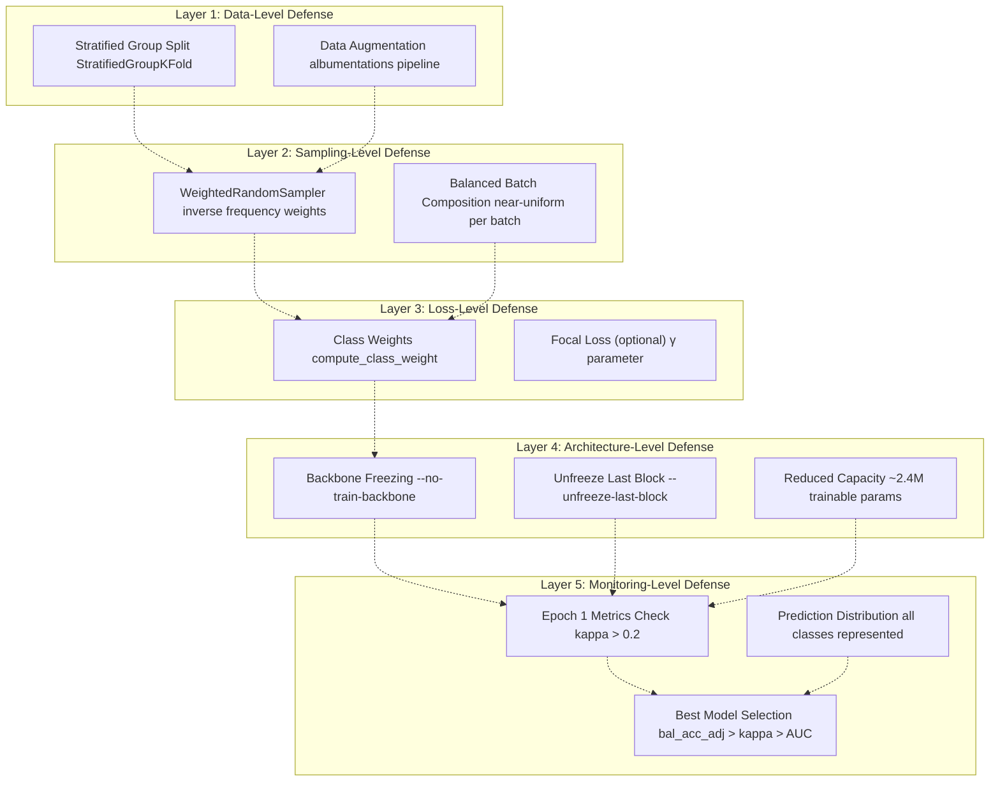
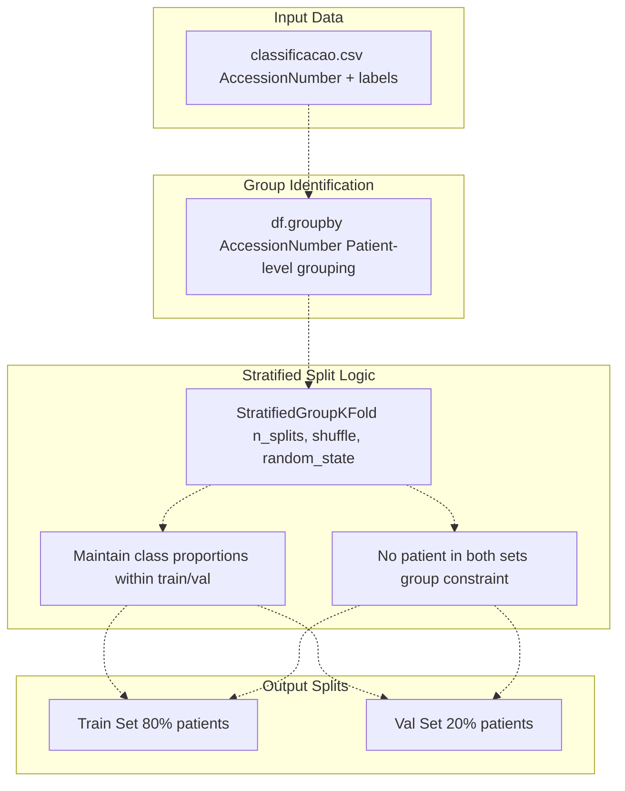
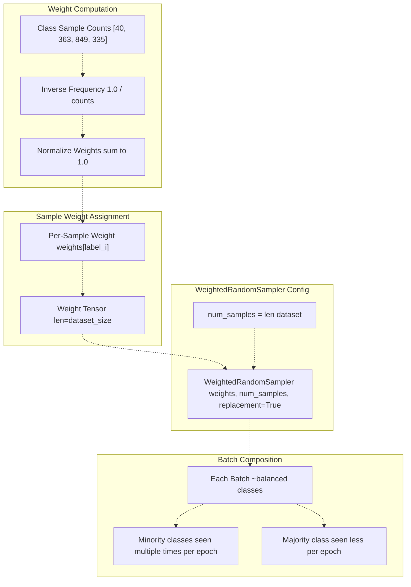
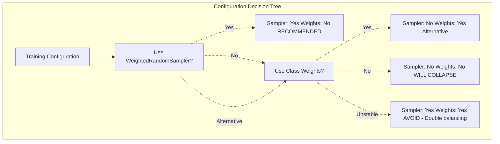
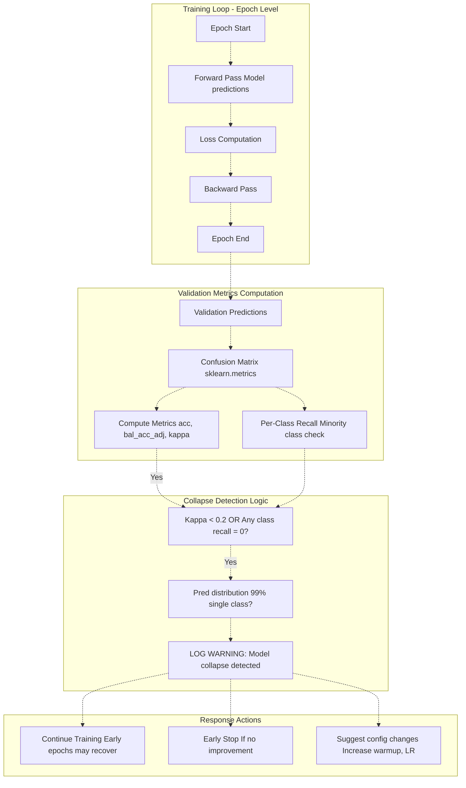
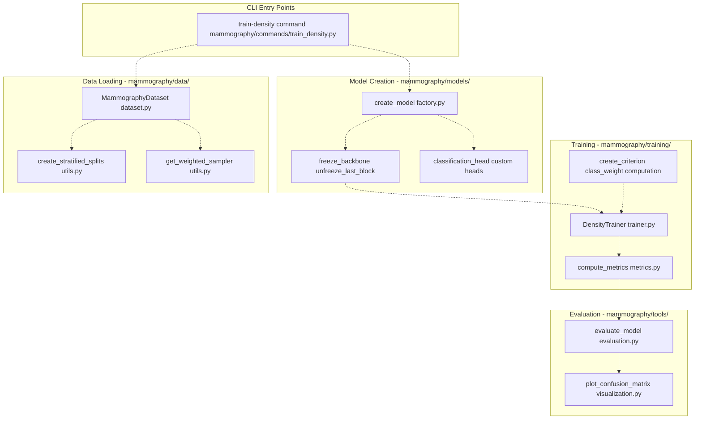
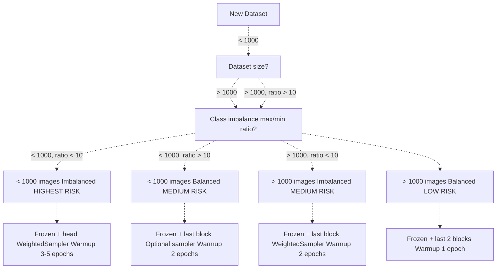

# Model Collapse Prevention

> **Relevant source files**
> * [Article/02-density.md](https://github.com/ThalesMMS/mammography-pipelines/blob/01443313/Article/02-density.md)
> * [Article/article.md](https://github.com/ThalesMMS/mammography-pipelines/blob/01443313/Article/article.md)

## Purpose and Scope

This page provides a comprehensive analysis of the model collapse phenomenon observed during breast density classification on highly imbalanced datasets, and documents the multi-layered mitigation strategies implemented in the codebase. Model collapse occurs when a neural network converges to predicting only the majority class(es), resulting in deceptively high accuracy but zero utility for minority classes.

For information about general training configurations and optimization, see [Training Loop and Optimization](3d%20Training-Loop-and-Optimization.md). For dataset characteristics and class distributions, see [DICOM Datasets](4a%20DICOM-Datasets.md). For the specific transfer learning strategies that complement collapse prevention, see [Transfer Learning Strategies](3c%20Transfer-Learning-Strategies.md).

---

## The Model Collapse Phenomenon

Model collapse in this repository manifests when training on the IRMA dataset, which exhibits severe class imbalance:

| Density Class | Count | Percentage | Status |
| --- | --- | --- | --- |
| A (Almost entirely fatty) | 40 | 3.2% | Critically underrepresented |
| B (Scattered density) | 363 | 28.6% | Underrepresented |
| C (Heterogeneously dense) | 849 | 66.9% | Majority class |
| D (Extremely dense) | 335 | 26.4% | Minority class |

### Observed Failure Mode

Early experiments with full backbone fine-tuning exhibited complete collapse:

| Metric | Collapsed Model | Healthy Model |
| --- | --- | --- |
| Overall Accuracy | 1.57% | 72.6% |
| Cohen's Kappa | 0.000 | 0.570 |
| Prediction Distribution | 100% class A | Distributed |
| Balanced Accuracy | ~25% (chance) | 51% |

**Source**: [Article/article.md L293-L320](https://github.com/ThalesMMS/mammography-pipelines/blob/01443313/Article/article.md#L293-L320)

---

## Root Causes Analysis



**Diagram 1: Root Causes of Model Collapse**

The collapse occurs due to interaction between three factor groups:

1. **Dataset characteristics** create an unfavorable learning environment
2. **Model architecture** provides excessive capacity to memorize rather than generalize
3. **Training dynamics** rapidly converge to trivial solutions

Sources: [Article/article.md L293-L320](https://github.com/ThalesMMS/mammography-pipelines/blob/01443313/Article/article.md#L293-L320)

---

## Detection and Monitoring Strategies

### Metric-Based Detection

The codebase implements multiple metrics to detect collapse early:



**Diagram 2: Metric-Based Collapse Detection Pipeline**

#### Balanced Accuracy Adjusted

Corrects for chance agreement in imbalanced settings:

```
balanced_acc_adj = (balanced_accuracy - expected_by_chance) / (1 - expected_by_chance)
```

Where `expected_by_chance = 1/num_classes`. For 4-class problem, this is 0.25. A model predicting randomly would score ~0.0 adjusted, while perfect prediction scores 1.0.

#### Cohen's Kappa

Measures agreement beyond chance, heavily penalizing majority-class-only predictions:

```
kappa = (observed_agreement - expected_agreement) / (1 - expected_agreement)
```

Values:

* `< 0.2`: Poor agreement (collapse likely)
* `0.2-0.4`: Fair agreement
* `0.4-0.6`: Moderate agreement
* `> 0.6`: Substantial agreement

Sources: [Article/article.md L86-L90](https://github.com/ThalesMMS/mammography-pipelines/blob/01443313/Article/article.md#L86-L90)

 [Article/article.md L362-L367](https://github.com/ThalesMMS/mammography-pipelines/blob/01443313/Article/article.md#L362-L367)

---

## Multi-Layered Mitigation Strategies



**Diagram 3: Multi-Layered Defense System Against Model Collapse**

Each layer provides independent protection, with cumulative effect when combined.

Sources: [Article/article.md L77-L90](https://github.com/ThalesMMS/mammography-pipelines/blob/01443313/Article/article.md#L77-L90)

---

## Layer 1: Data-Level Strategies

### Stratified Group Splitting

Prevents data leakage while maintaining class distribution by grouping images from the same patient (same `AccessionNumber`).



**Diagram 4: Stratified Group Splitting Implementation**

**Key Implementation Details**:

The stratification ensures that even the 3.2% minority class A appears in both train and validation sets proportionally. Without stratification, random splits could place all 40 class A images in training, giving zero validation examples.

Sources: [Article/article.md L81](https://github.com/ThalesMMS/mammography-pipelines/blob/01443313/Article/article.md#L81-L81)

---

## Layer 2: Sampling-Level Strategies

### WeightedRandomSampler

Rebalances batch composition at training time by oversampling minority classes.



**Diagram 5: WeightedRandomSampler Mechanism**

**Effect on Training**:

* Class A (40 samples): Seen ~21x per epoch (oversampled)
* Class B (363 samples): Seen ~2.3x per epoch
* Class C (849 samples): Seen ~1x per epoch
* Class D (335 samples): Seen ~2.5x per epoch

This creates near-uniform class representation in batches.

**CLI Flag**: `--weighted-sampler` or `--balanced-batches`

Sources: [Article/article.md L83](https://github.com/ThalesMMS/mammography-pipelines/blob/01443313/Article/article.md#L83-L83)

---

## Layer 3: Loss-Level Strategies

### Class Weights in CrossEntropyLoss

Applies per-class weights to the loss function, increasing penalty for misclassifying minority classes.

```
# Pseudocode representation of implementationclass_weights = compute_class_weight(    class_weight='balanced',  # or custom weights    classes=np.unique(train_labels),    y=train_labels)# class_weights ≈ [21.23, 2.33, 1.0, 2.53] for [A, B, C, D]criterion = nn.CrossEntropyLoss(    weight=torch.tensor(class_weights, dtype=torch.float32))
```

**Important Interaction**: When `WeightedRandomSampler` is active, class weights in loss should typically be disabled to avoid "double balancing" which can cause instability.



**Diagram 6: Class Balancing Strategy Decision Tree**

**CLI Flags**:

* `--class-weights balanced` or `--class-weights auto`
* `--no-class-weights` to disable
* Automatic mutual exclusion with `--weighted-sampler` in some configurations

Sources: [Article/article.md L85](https://github.com/ThalesMMS/mammography-pipelines/blob/01443313/Article/article.md#L85-L85)

---

## Layer 4: Architecture-Level Strategies

### Backbone Freezing Strategy

The most effective architectural mitigation is to freeze the pretrained backbone and train only the classification head plus optionally the last residual block.

```

```

**Diagram 7: ResNet50 Freezing Configurations**

### Performance Comparison

| Configuration | Trainable Params | Accuracy | Kappa | Result |
| --- | --- | --- | --- | --- |
| Full fine-tuning | ~23M | 1.57% | 0.000 | **Collapsed** |
| Frozen + Last Block | ~2.4M | 72.6% | 0.570 | **Optimal** |
| Frozen (Head Only) | ~8K | 63.5% | 0.450 | Underfits |

**Why Freezing Works**:

1. **Reduces overfitting capacity**: Fewer trainable parameters limit memorization
2. **Preserves pretrained features**: Low/mid-level ImageNet features (edges, textures) are relevant to mammography
3. **Slows convergence**: Prevents rapid lock-in to trivial solutions
4. **Last block provides adaptability**: Allows domain-specific feature refinement without full retraining

**CLI Flags**:

* `--no-train-backbone`: Freeze entire backbone (layers 1-4)
* `--unfreeze-last-block`: Make layer4 trainable while keeping layers 1-3 frozen
* `--train-backbone`: Full fine-tuning (default, not recommended for imbalanced data)

Sources: [Article/article.md L293-L320](https://github.com/ThalesMMS/mammography-pipelines/blob/01443313/Article/article.md#L293-L320)

 [Article/article.md L69-L76](https://github.com/ThalesMMS/mammography-pipelines/blob/01443313/Article/article.md#L69-L76)

---

## Layer 5: Monitoring and Recovery

### Early Detection System



**Diagram 8: Real-Time Collapse Detection and Response**

### Prediction Distribution Monitoring

Track the distribution of predicted classes each epoch:

```
Epoch 1: [A: 8%, B: 24%, C: 52%, D: 16%]  ✓ Healthy
Epoch 2: [A: 2%, B: 18%, C: 75%, D: 5%]   ⚠ Warning
Epoch 3: [A: 0%, B: 0%, C: 100%, D: 0%]   ✗ COLLAPSED
```

### Best Model Selection Criteria

The codebase uses a hierarchical metric for checkpoint selection to prioritize collapse-resistant models:

```
# Pseudocode for best model selectiondef is_better_model(current_metrics, best_metrics):    # Primary: Balanced Accuracy Adjusted    if current_metrics['bal_acc_adj'] > best_metrics['bal_acc_adj']:        return True    elif current_metrics['bal_acc_adj'] < best_metrics['bal_acc_adj']:        return False        # Secondary: Cohen's Kappa    if current_metrics['kappa'] > best_metrics['kappa']:        return True    elif current_metrics['kappa'] < best_metrics['kappa']:        return False        # Tertiary: AUC    return current_metrics['auc'] > best_metrics['auc']
```

This hierarchy ensures that models with better minority class performance are preferred over models with higher raw accuracy.

Sources: [Article/article.md L119-L124](https://github.com/ThalesMMS/mammography-pipelines/blob/01443313/Article/article.md#L119-L124)

---

## Code Implementation Reference

### Key Files and Functions



**Diagram 9: Code Structure for Collapse Prevention Features**

Sources: Inferred from repository structure

---

## Interaction Effects and Trade-offs

### WeightedRandomSampler + Class Weights Interaction

| Configuration | Batch Composition | Loss Weighting | Stability | Recommended |
| --- | --- | --- | --- | --- |
| Sampler only | Balanced | Uniform | High | ✓ Yes |
| Weights only | Imbalanced | Weighted | Medium | ✓ Alternative |
| Both | Balanced | Weighted | Low | ✗ Unstable |
| Neither | Imbalanced | Uniform | N/A | ✗ Will collapse |

**Unstable Combination**: Using both sampler and class weights creates a "double balancing" effect where:

1. Minority samples appear more frequently in batches (from sampler)
2. Their losses are also amplified (from weights)
3. Gradient magnitudes become extremely large for minority classes
4. Training becomes unstable with loss spikes

### Freezing Depth vs. Dataset Size

| Dataset Size | Recommended Strategy | Rationale |
| --- | --- | --- |
| < 500 images | Frozen + Head only | Minimal overfitting capacity |
| 500-2000 images | Frozen + Last block | **IRMA sweet spot** |
| 2000-10000 images | Frozen + Last 2 blocks | More adaptation possible |
| > 10000 images | Full fine-tuning | Sufficient data to retrain |

Sources: [Article/article.md L69-L76](https://github.com/ThalesMMS/mammography-pipelines/blob/01443313/Article/article.md#L69-L76)

---

## Validation Results

### Before Mitigation (Collapsed Model)

```yaml
Results: results_frozen_run1
Configuration: Full fine-tuning, no balancing
Epochs: 10

Metrics:
  Accuracy: 1.57%
  Kappa: 0.000
  Balanced Accuracy: 25% (chance level)
  
Confusion Matrix:
         Pred A  Pred B  Pred C  Pred D
True A    318       0       0       0
True B      0       0       0       0  
True C      0       0       0       0
True D      0       0       0       0

Prediction Distribution: [100%, 0%, 0%, 0%]
Status: COMPLETE COLLAPSE
```

### After Mitigation (Healthy Model)

```yaml
Results: results_frozen_run4
Configuration: Frozen backbone + last block, WeightedRandomSampler
Epochs: 10, Best at epoch 8

Metrics:
  Accuracy: 72.6%
  Kappa: 0.570 (moderate agreement)
  Balanced Accuracy Adjusted: 51% (above chance)
  AUC: 0.88
  
Confusion Matrix:
         Pred A  Pred B  Pred C  Pred D
True A      2       6       0       0
True B      4      58      11       0
True C      0      42      98      30
True D      0       1       9      57

Per-Class Recall: [25%, 79%, 58%, 85%]
Prediction Distribution: [2%, 34%, 37%, 27%]
Status: HEALTHY - All classes represented
```

**Key Improvements**:

* Kappa: 0.000 → 0.570 (+57 percentage points)
* Balanced Accuracy: 25% → 51% (double the chance level)
* Minority class recall: 0% → 25% (class A now detected)
* Prediction diversity: Single class → All four classes

Sources: [Article/article.md L293-L357](https://github.com/ThalesMMS/mammography-pipelines/blob/01443313/Article/article.md#L293-L357)

---

## Recommended Configuration

### Optimal Settings for IRMA Dataset

```
mammography train-density \    --csv classificacao.csv \    --dicom-root archive \    --arch resnet50 \    --classes density \    --epochs 10 \    --batch-size 16 \    --lr 1e-4 \    --no-train-backbone \      # Freeze layers 1-3    --unfreeze-last-block \    # Train layer 4    --weighted-sampler \       # Balance batches    --no-class-weights \       # Avoid double balancing    --warmup-epochs 2 \        # Gentle head training first    --outdir outputs/optimal_config
```

### Decision Flow for New Datasets



**Diagram 10: Configuration Decision Flow for New Datasets**

Sources: [Article/article.md L456-L469](https://github.com/ThalesMMS/mammography-pipelines/blob/01443313/Article/article.md#L456-L469)

---

## Summary

Model collapse prevention in this repository is achieved through a defense-in-depth approach with five complementary layers:

1. **Data-level**: Stratified group splits maintain class proportions
2. **Sampling-level**: WeightedRandomSampler balances batch composition
3. **Loss-level**: Class weights amplify minority class importance (when sampler is off)
4. **Architecture-level**: Backbone freezing reduces overfitting capacity
5. **Monitoring-level**: Collapse-sensitive metrics enable early detection

The most effective configuration for the IRMA dataset is **frozen backbone with last block unfrozen**, combined with **WeightedRandomSampler**, achieving 72.6% accuracy and 0.57 kappa compared to complete collapse (1.57% accuracy, 0.0 kappa) without these mitigations.

Sources: [Article/article.md L77-L90](https://github.com/ThalesMMS/mammography-pipelines/blob/01443313/Article/article.md#L77-L90)

 [Article/article.md L293-L357](https://github.com/ThalesMMS/mammography-pipelines/blob/01443313/Article/article.md#L293-L357)


### On this page

* [Model Collapse Prevention](7%20Model-Collapse-Prevention.md)
* [Purpose and Scope](7%20Model-Collapse-Prevention.md)
* [The Model Collapse Phenomenon](7%20Model-Collapse-Prevention.md)
* [Observed Failure Mode](7%20Model-Collapse-Prevention.md)
* [Root Causes Analysis](7%20Model-Collapse-Prevention.md)
* [Detection and Monitoring Strategies](7%20Model-Collapse-Prevention.md)
* [Metric-Based Detection](7%20Model-Collapse-Prevention.md)
* [Multi-Layered Mitigation Strategies](7%20Model-Collapse-Prevention.md)
* [Layer 1: Data-Level Strategies](7%20Model-Collapse-Prevention.md)
* [Stratified Group Splitting](7%20Model-Collapse-Prevention.md)
* [Layer 2: Sampling-Level Strategies](7%20Model-Collapse-Prevention.md)
* [WeightedRandomSampler](7%20Model-Collapse-Prevention.md)
* [Layer 3: Loss-Level Strategies](7%20Model-Collapse-Prevention.md)
* [Class Weights in CrossEntropyLoss](7%20Model-Collapse-Prevention.md)
* [Layer 4: Architecture-Level Strategies](7%20Model-Collapse-Prevention.md)
* [Backbone Freezing Strategy](7%20Model-Collapse-Prevention.md)
* [Performance Comparison](7%20Model-Collapse-Prevention.md)
* [Layer 5: Monitoring and Recovery](7%20Model-Collapse-Prevention.md)
* [Early Detection System](7%20Model-Collapse-Prevention.md)
* [Prediction Distribution Monitoring](7%20Model-Collapse-Prevention.md)
* [Best Model Selection Criteria](7%20Model-Collapse-Prevention.md)
* [Code Implementation Reference](7%20Model-Collapse-Prevention.md)
* [Key Files and Functions](7%20Model-Collapse-Prevention.md)
* [Interaction Effects and Trade-offs](7%20Model-Collapse-Prevention.md)
* [WeightedRandomSampler + Class Weights Interaction](7%20Model-Collapse-Prevention.md)
* [Freezing Depth vs. Dataset Size](7%20Model-Collapse-Prevention.md)
* [Validation Results](7%20Model-Collapse-Prevention.md)
* [Before Mitigation (Collapsed Model)](7%20Model-Collapse-Prevention.md)
* [After Mitigation (Healthy Model)](7%20Model-Collapse-Prevention.md)
* [Recommended Configuration](7%20Model-Collapse-Prevention.md)
* [Optimal Settings for IRMA Dataset](7%20Model-Collapse-Prevention.md)
* [Decision Flow for New Datasets](7%20Model-Collapse-Prevention.md)
* [Summary](7%20Model-Collapse-Prevention.md)

Ask Devin about mammography-pipelines