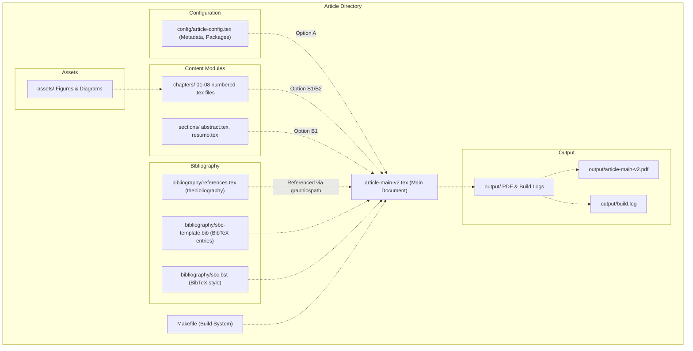
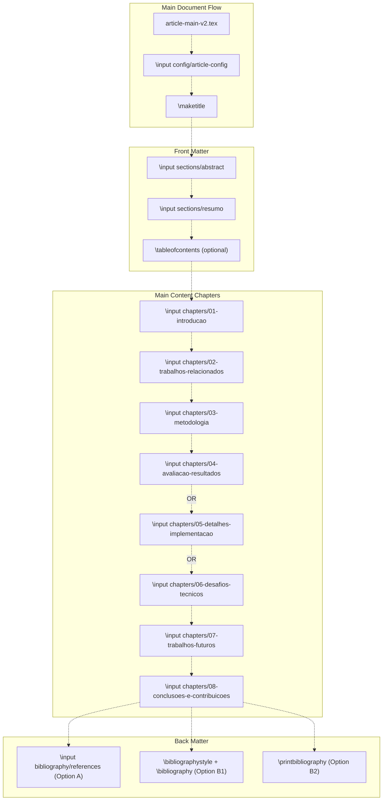
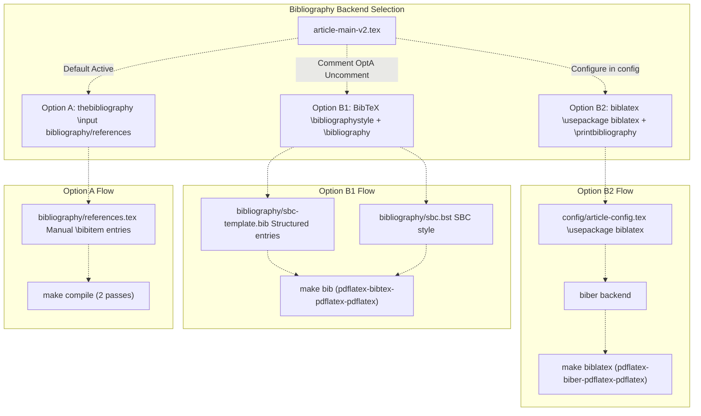
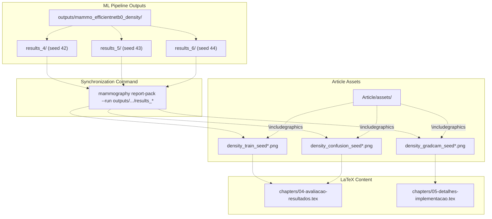

# Article Documentation System

> **Relevant source files**
> * [Article/Makefile](https://github.com/ThalesMMS/mammography-pipelines/blob/01443313/Article/Makefile)
> * [Article/README.md](https://github.com/ThalesMMS/mammography-pipelines/blob/01443313/Article/README.md)
> * [Article/article-main-v2.tex](https://github.com/ThalesMMS/mammography-pipelines/blob/01443313/Article/article-main-v2.tex)

## Purpose and Scope

The Article Documentation System is a LaTeX-based infrastructure for documenting research findings from the mammography deep learning pipeline. This system provides a modular, maintainable template structure that automatically integrates experimental results, figures, and metrics generated by the ML pipeline into a formatted academic article following the SBC (Brazilian Computer Society) conference template.

This page covers the overall architecture and organization of the documentation system. For specific topics:

* **LaTeX Template Structure**: See [Article Template Structure](8a%20LaTeX-Template-Structure.md) for details on the modular organization of `article-main-v2.tex`, chapters, sections, and configuration files
* **Compilation Workflow**: See [Compilation Workflow](8b%20Compiling-the-Article.md) for Makefile targets and LaTeX build processes
* **Bibliography Management**: See [Bibliography Management](8c%20Bibliography-Management.md) for thebibliography vs BibTeX options
* **ML Integration**: See [ML Integration](8d%20Integrating-ML-Results-with-LaTeX.md) for automated synchronization via `mammography report-pack`

**Sources**: [Article/README.md L1-L175](https://github.com/ThalesMMS/mammography-pipelines/blob/01443313/Article/README.md#L1-L175)

 [Article/article-main-v2.tex L1-L80](https://github.com/ThalesMMS/mammography-pipelines/blob/01443313/Article/article-main-v2.tex#L1-L80)

 [Article/Makefile L1-L154](https://github.com/ThalesMMS/mammography-pipelines/blob/01443313/Article/Makefile#L1-L154)

---

## System Architecture

The documentation system is organized into a modular structure that separates content (chapters/sections), configuration, assets (figures/diagrams), and bibliography management. The build system is managed via a Makefile that orchestrates LaTeX compilation with support for multiple bibliography backends.



**Diagram: Overall Article System Structure**

The system follows a clear separation of concerns where [article-main-v2.tex L1-L80](https://github.com/ThalesMMS/mammography-pipelines/blob/01443313/article-main-v2.tex#L1-L80)

 serves as the entry point, importing modular components via `\input{}` directives. The [Makefile L1-L154](https://github.com/ThalesMMS/mammography-pipelines/blob/01443313/Makefile#L1-L154)

 provides automated build commands that handle multi-pass compilation required for bibliography and cross-references.

**Sources**: [Article/README.md L5-L26](https://github.com/ThalesMMS/mammography-pipelines/blob/01443313/Article/README.md#L5-L26)

 [Article/article-main-v2.tex L1-L80](https://github.com/ThalesMMS/mammography-pipelines/blob/01443313/Article/article-main-v2.tex#L1-L80)

 [Article/Makefile L1-L154](https://github.com/ThalesMMS/mammography-pipelines/blob/01443313/Article/Makefile#L1-L154)

---

## Directory Structure and File Organization

The Article directory follows a hierarchical organization optimized for maintainability and automated integration with ML pipeline outputs:

| Directory | Purpose | Key Files |
| --- | --- | --- |
| `chapters/` | Main content organized by topic | `01-introducao.tex` through `08-conclusoes-e-contribuicoes.tex` |
| `sections/` | Standalone sections (abstract, resumo) | `abstract.tex`, `resumo.tex` |
| `config/` | LaTeX configuration and metadata | `article-config.tex` (document metadata, package imports) |
| `bibliography/` | Reference management | `references.tex`, `sbc-template.bib`, `sbc.bst` |
| `assets/` | Figures, diagrams, plots | Template figures and ML-generated outputs |
| `output/` | Compilation artifacts | `article-main-v2.pdf`, `build.log` |
| `backups/` | Automated backups | `.tar.gz` archives created by `make backup` |

The modular structure enables parallel development where different sections can be edited independently. The [article-main-v2.tex L41-L48](https://github.com/ThalesMMS/mammography-pipelines/blob/01443313/article-main-v2.tex#L41-L48)

 file includes chapters using `\input{chapters/NN-name}` directives, making the order explicit and easy to reorder.

**Sources**: [Article/README.md L5-L26](https://github.com/ThalesMMS/mammography-pipelines/blob/01443313/Article/README.md#L5-L26)

 [Article/README.md L91-L97](https://github.com/ThalesMMS/mammography-pipelines/blob/01443313/Article/README.md#L91-L97)

---

## Content Module Dependencies



**Diagram: Document Compilation Flow with Module Dependencies**

The main document [article-main-v2.tex L17](https://github.com/ThalesMMS/mammography-pipelines/blob/01443313/article-main-v2.tex#L17-L17)

 first loads configuration via `\input{config/article-config}`, which defines metadata, packages, and the `\graphicspath` for assets. The [article-main-v2.tex L29-L31](https://github.com/ThalesMMS/mammography-pipelines/blob/01443313/article-main-v2.tex#L29-L31)

 section includes abstract and resumo before the main chapters. The bibliography system is pluggable: [article-main-v2.tex L61-L73](https://github.com/ThalesMMS/mammography-pipelines/blob/01443313/article-main-v2.tex#L61-L73)

 shows three mutually exclusive options with comments indicating which lines to activate.

**Sources**: [Article/article-main-v2.tex L17-L80](https://github.com/ThalesMMS/mammography-pipelines/blob/01443313/Article/article-main-v2.tex#L17-L80)

 [Article/README.md L59-L78](https://github.com/ThalesMMS/mammography-pipelines/blob/01443313/Article/README.md#L59-L78)

---

## Build System and Makefile Targets

The [Makefile L1-L154](https://github.com/ThalesMMS/mammography-pipelines/blob/01443313/Makefile#L1-L154)

 provides a comprehensive build system with configurable compilation engines and multiple workflow targets:

### Configuration Variables

```markdown
MAIN_FILE    = article-main-v2       # Base filename without .tex extension
OUTPUT_DIR   = output                # Compilation artifacts destination
BACKUP_DIR   = backups               # Archive destination for make backup
ENGINE       = pdflatex              # LaTeX engine (pdflatex/xelatex/lualatex)
TEXFLAGS     =                       # Additional flags (e.g., -shell-escape)
```

**Sources**: [Article/Makefile L6-L15](https://github.com/ThalesMMS/mammography-pipelines/blob/01443313/Article/Makefile#L6-L15)

### Primary Build Targets

| Target | Compilation Steps | Use Case |
| --- | --- | --- |
| `make compile` | 2× pdflatex passes | Default build with thebibliography |
| `make bib` | pdflatex → bibtex → 2× pdflatex | Build with BibTeX (.bib files) |
| `make biblatex` | pdflatex → biber → 2× pdflatex | Build with biblatex + biber |
| `make view` | `compile` + open PDF | Compile and preview |
| `make clean` | Remove output/ and temp files | Clean build artifacts |
| `make backup` | Create .tar.gz archive | Backup project files |

The [Makefile L25-L38](https://github.com/ThalesMMS/mammography-pipelines/blob/01443313/Makefile#L25-L38)

 `compile` target implements silent compilation with logs redirected to `output/build.log`. Error handling checks for undefined references [Makefile L32-L36](https://github.com/ThalesMMS/mammography-pipelines/blob/01443313/Makefile#L32-L36)

 and displays the last 40 lines of the log on failure.

**Sources**: [Article/Makefile L18-L154](https://github.com/ThalesMMS/mammography-pipelines/blob/01443313/Article/Makefile#L18-L154)

 **Sources**: [Article documentation](https://github.com/ThalesMMS/mammography-pipelines/blob/01443313/Article/README.md#L137-L156)

---

## Bibliography Management Options

The system supports three bibliography backends with different trade-offs:



**Diagram: Three Bibliography Backend Options**

### Option A: thebibliography (Default)

The default configuration uses [bibliography/references.tex](https://github.com/ThalesMMS/mammography-pipelines/blob/01443313/bibliography/references.tex)

 with manual `\bibitem` entries. This approach [Article/README.md L67-L70](https://github.com/ThalesMMS/mammography-pipelines/blob/01443313/Article/README.md#L67-L70)

 requires no external tools and is ideal for small, static reference lists. Citations are made with `\cite{key}` and the document compiles with [Makefile L25-L38](https://github.com/ThalesMMS/mammography-pipelines/blob/01443313/Makefile#L25-L38)

 `make compile`.

### Option B1: BibTeX

To enable BibTeX, comment out line [article-main-v2.tex L62](https://github.com/ThalesMMS/mammography-pipelines/blob/01443313/article-main-v2.tex#L62-L62)

 and uncomment [article-main-v2.tex L67-L68](https://github.com/ThalesMMS/mammography-pipelines/blob/01443313/article-main-v2.tex#L67-L68)

 References are stored in [bibliography/sbc-template.bib](https://github.com/ThalesMMS/mammography-pipelines/blob/01443313/bibliography/sbc-template.bib)

 using structured entries, and styling is controlled by [bibliography/sbc.bst](https://github.com/ThalesMMS/mammography-pipelines/blob/01443313/bibliography/sbc.bst)

 Compilation requires [Makefile L82-L100](https://github.com/ThalesMMS/mammography-pipelines/blob/01443313/Makefile#L82-L100)

 `make bib` which runs the sequence: pdflatex → bibtex → pdflatex → pdflatex.

**Note**: The [Makefile L88-L91](https://github.com/ThalesMMS/mammography-pipelines/blob/01443313/Makefile#L88-L91)

 target checks for `\bibdata` in the `.aux` file to verify BibTeX is properly configured before attempting compilation.

### Option B2: biblatex + biber

This modern approach requires configuring `\usepackage[backend=biber]{biblatex}` and `\addbibresource{...}` in `config/article-config.tex`, then calling `\printbibliography` in [article-main-v2.tex L73](https://github.com/ThalesMMS/mammography-pipelines/blob/01443313/article-main-v2.tex#L73-L73)

 Compilation uses [Makefile L107-L125](https://github.com/ThalesMMS/mammography-pipelines/blob/01443313/Makefile#L107-L125)

 `make biblatex` with the sequence: pdflatex → biber → pdflatex → pdflatex.

**Sources**: [Article/README.md L65-L78](https://github.com/ThalesMMS/mammography-pipelines/blob/01443313/Article/README.md#L65-L78)

 [Article/article-main-v2.tex L59-L73](https://github.com/ThalesMMS/mammography-pipelines/blob/01443313/Article/article-main-v2.tex#L59-L73)

 [Article/Makefile L82-L128](https://github.com/ThalesMMS/mammography-pipelines/blob/01443313/Article/Makefile#L82-L128)

---

## Integration with ML Pipeline Outputs

The documentation system is designed to automatically incorporate experimental results from the mammography pipeline. The `assets/` directory serves as the interface between ML outputs and LaTeX content:

### Asset Categories

| Asset Type | Naming Convention | Source | Referenced In |
| --- | --- | --- | --- |
| Embedding visualizations | `embeddings_pca_tsne.png` | `mammography embed` output | Chapter 4 (evaluation) |
| Training curves | `density_train_seed{42,43,44}.png` | `mammography train-density` | Chapter 4 |
| Confusion matrices | `density_confusion_seed{42,43,44}.png` | `mammography train-density` | Chapter 4 |
| Grad-CAM heatmaps | `density_gradcam_seed{42,43,44}.png` | `mammography train-density` | Chapter 5 (implementation) |
| Template figures | `template_fig1.jpg`, `template_diagram1.png` | Placeholder images | Chapters 4-5 |

The [Article/README.md L52-L56](https://github.com/ThalesMMS/mammography-pipelines/blob/01443313/Article/README.md#L52-L56)

 documentation indicates that `\graphicspath` is pre-configured to point to the `assets/` directory, allowing chapters to reference figures without path prefixes: `\includegraphics[width=...]{density_train_seed42}`.

### Automated Synchronization Workflow



**Diagram: ML Pipeline to Article Integration via report-pack**

The `mammography report-pack` command (documented in [mammography report-pack](2d%20mammography-report-pack.md)) automates the process of copying generated figures from experiment directories to `Article/assets/` with consistent naming. This ensures that re-running experiments automatically updates the article figures without manual file management.

**Sources**: [Article/README.md L52-L56](https://github.com/ThalesMMS/mammography-pipelines/blob/01443313/Article/README.md#L52-L56)

 [Article/README.md L14-L15](https://github.com/ThalesMMS/mammography-pipelines/blob/01443313/Article/README.md#L14-L15)

---

## Document Compilation Workflow

The typical workflow for compiling and updating the article involves these stages:

### 1. Initial Setup

Edit metadata in `config/article-config.tex`:

* `\newcommand{\DocumentTitle}{...}`
* `\newcommand{\AuthorName}{...}`
* `\newcommand{\AuthorInstitution}{...}`
* `\newcommand{\AuthorEmail}{...}`

**Sources**: [Article/README.md L82-L89](https://github.com/ThalesMMS/mammography-pipelines/blob/01443313/Article/README.md#L82-L89)

### 2. Content Development

Edit chapter files in `chapters/*.tex` following the placeholder structure. Use labels `\label{fig:...}`, `\label{tab:...}`, `\label{sec:...}` and references `\ref{...}` for cross-referencing. The [Article/README.md L49-L51](https://github.com/ThalesMMS/mammography-pipelines/blob/01443313/Article/README.md#L49-L51)

 documentation emphasizes consistent label prefixes.

### 3. Asset Integration

After running ML experiments:

```
# Generate and sync assetsmammography report-pack --run outputs/mammo_efficientnetb0_density/results_4
```

This updates `Article/assets/` with current experimental results.

### 4. Compilation

For thebibliography mode:

```
make compile  # or make view to open PDF
```

For BibTeX mode:

```
make bib      # or make view-bib
```

The [Makefile L28-L38](https://github.com/ThalesMMS/mammography-pipelines/blob/01443313/Makefile#L28-L38)

 compile process redirects output to `output/build.log` for silent execution, displaying only errors or warnings about undefined references [Makefile L32-L36](https://github.com/ThalesMMS/mammography-pipelines/blob/01443313/Makefile#L32-L36)

### 5. Error Resolution

If compilation fails, check [output/build.log](https://github.com/ThalesMMS/mammography-pipelines/blob/01443313/output/build.log)

 for detailed error messages. Common issues **Sources**: [Article documentation](https://github.com/ThalesMMS/mammography-pipelines/blob/01443313/Article/README.md#L159-L168)

:

* **Undefined references**: Run additional compilation pass or verify `\label{...}` and `\ref{...}` pairs
* **Missing figures**: Verify filename and extension in `assets/` directory
* **BibTeX errors**: Ensure `sbc.bst` is accessible and `.bib` entries are valid

**Sources**: [Article/README.md L28-L38](https://github.com/ThalesMMS/mammography-pipelines/blob/01443313/Article/README.md#L28-L38)

 **Sources**: [Article documentation](https://github.com/ThalesMMS/mammography-pipelines/blob/01443313/Article/README.md#L132-L136)

 **Sources**: [Article documentation](https://github.com/ThalesMMS/mammography-pipelines/blob/01443313/Article/README.md#L159-L169)

---

## Advanced Build Features

### Multiple LaTeX Engines

The [Makefile L14](https://github.com/ThalesMMS/mammography-pipelines/blob/01443313/Makefile#L14-L14)

 `ENGINE` variable can be overridden to use alternative LaTeX compilers:

```
make ENGINE=xelatex compile      # For Unicode and system fontsmake ENGINE=lualatex biblatex    # For Lua scripting support
```

### Glossary and Index Generation

The Makefile provides optional targets for advanced features:

* **Glossary**: [Makefile L131-L135](https://github.com/ThalesMMS/mammography-pipelines/blob/01443313/Makefile#L131-L135)  `make glossary` compiles glossary entries after enabling `\usepackage[acronym]{glossaries}` in configuration
* **Index**: [Makefile L138-L142](https://github.com/ThalesMMS/mammography-pipelines/blob/01443313/Makefile#L138-L142)  `make index` generates index remissivo after enabling `\usepackage{imakeidx}` and marking terms with `\index{...}`

### Project Backup

[Makefile L54-L59](https://github.com/ThalesMMS/mammography-pipelines/blob/01443313/Makefile#L54-L59)

 `make backup` creates timestamped `.tar.gz` archives in `backups/` directory, including only source files (chapters, sections, config, bibliography, main .tex, Makefile, README.md) while excluding the `output/` directory to keep archives small.

### Document Statistics

[Makefile L62-L67](https://github.com/ThalesMMS/mammography-pipelines/blob/01443313/Makefile#L62-L67)

 `make stats` provides quick statistics:

* Number of chapter files in `chapters/`
* Number of section files in `sections/`
* Total line count across all content files
* Total word count

**Sources**: [Article/Makefile L54-L67](https://github.com/ThalesMMS/mammography-pipelines/blob/01443313/Article/Makefile#L54-L67)

 [Article/Makefile L131-L153](https://github.com/ThalesMMS/mammography-pipelines/blob/01443313/Article/Makefile#L131-L153)

 **Sources**: [Article documentation](https://github.com/ThalesMMS/mammography-pipelines/blob/01443313/Article/README.md#L122-L131)

---

## Modular Template Design

The system's modularity enables several benefits:

### Separation of Concerns

| Component | Responsibility | Modification Frequency |
| --- | --- | --- |
| `article-main-v2.tex` | Document structure, module loading | Rare (only when adding/removing chapters) |
| `config/article-config.tex` | Metadata, packages, global settings | Once per project setup |
| `chapters/*.tex` | Content development | Continuous during writing |
| `sections/*.tex` | Abstract, resumo | Early in project lifecycle |
| `bibliography/*.tex` or `.bib` | References | Continuous as citations added |
| `assets/*.png`, `*.jpg` | Figures and visualizations | Automatic via report-pack |

### Parallel Development

The [Article/README.md L99-L102](https://github.com/ThalesMMS/mammography-pipelines/blob/01443313/Article/README.md#L99-L102)

 structure allows multiple authors to work on different chapters simultaneously without merge conflicts, as each chapter is an independent file.

### Version Control Optimization

The `.gitignore` patterns (inferred from documentation) exclude temporary LaTeX artifacts (`.aux`, `.log`, `.out`, etc.) and the `output/` directory, keeping the repository clean and focused on source content.

**Sources**: [Article/README.md L82-L121](https://github.com/ThalesMMS/mammography-pipelines/blob/01443313/Article/README.md#L82-L121)

 [Article/article-main-v2.tex L1-L10](https://github.com/ThalesMMS/mammography-pipelines/blob/01443313/Article/article-main-v2.tex#L1-L10)

---

## Summary

The Article Documentation System provides:

1. **Modular LaTeX structure** with separation between content (chapters/sections), configuration, assets, and bibliography
2. **Automated build system** via Makefile with support for thebibliography, BibTeX, and biblatex backends
3. **ML pipeline integration** through standardized asset directory and `mammography report-pack` synchronization
4. **Reproducible compilation** with silent execution, comprehensive logging, and error detection
5. **Flexible bibliography management** supporting three different approaches based on project needs
6. **Advanced features** including glossary, index, multiple engines, and automated backups

For detailed information on specific aspects:

* LaTeX template internals: See [Article Template Structure](8a%20LaTeX-Template-Structure.md)
* Compilation and Makefile details: See [Compilation Workflow](8b%20Compiling-the-Article.md)
* Bibliography configuration: See [Bibliography Management](8c%20Bibliography-Management.md)
* Automated ML result integration: See [8.4](8d%20Integrating-ML-Results-with-LaTeX.md)

**Sources**: [Article/README.md L1-L175](https://github.com/ThalesMMS/mammography-pipelines/blob/01443313/Article/README.md#L1-L175)

 [Article/Makefile L1-L154](https://github.com/ThalesMMS/mammography-pipelines/blob/01443313/Article/Makefile#L1-L154)

 [Article/article-main-v2.tex L1-L80](https://github.com/ThalesMMS/mammography-pipelines/blob/01443313/Article/article-main-v2.tex#L1-L80)


### On this page

* [Article Documentation System](8%20Article-Documentation-System.md)
* [Purpose and Scope](8%20Article-Documentation-System.md)
* [System Architecture](8%20Article-Documentation-System.md)
* [Directory Structure and File Organization](8%20Article-Documentation-System.md)
* [Content Module Dependencies](8%20Article-Documentation-System.md)
* [Build System and Makefile Targets](8%20Article-Documentation-System.md)
* [Configuration Variables](8%20Article-Documentation-System.md)
* [Primary Build Targets](8%20Article-Documentation-System.md)
* [Bibliography Management Options](8%20Article-Documentation-System.md)
* [Option A: thebibliography (Default)](8%20Article-Documentation-System.md)
* [Option B1: BibTeX](8%20Article-Documentation-System.md)
* [Option B2: biblatex + biber](8%20Article-Documentation-System.md)
* [Integration with ML Pipeline Outputs](8%20Article-Documentation-System.md)
* [Asset Categories](8%20Article-Documentation-System.md)
* [Automated Synchronization Workflow](8%20Article-Documentation-System.md)
* [Document Compilation Workflow](8%20Article-Documentation-System.md)
* [1. Initial Setup](8%20Article-Documentation-System.md)
* [2. Content Development](8%20Article-Documentation-System.md)
* [3. Asset Integration](8%20Article-Documentation-System.md)
* [4. Compilation](8%20Article-Documentation-System.md)
* [5. Error Resolution](8%20Article-Documentation-System.md)
* [Advanced Build Features](8%20Article-Documentation-System.md)
* [Multiple LaTeX Engines](8%20Article-Documentation-System.md)
* [Glossary and Index Generation](8%20Article-Documentation-System.md)
* [Project Backup](8%20Article-Documentation-System.md)
* [Document Statistics](8%20Article-Documentation-System.md)
* [Modular Template Design](8%20Article-Documentation-System.md)
* [Separation of Concerns](8%20Article-Documentation-System.md)
* [Parallel Development](8%20Article-Documentation-System.md)
* [Version Control Optimization](8%20Article-Documentation-System.md)
* [Summary](8%20Article-Documentation-System.md)

Ask Devin about mammography-pipelines