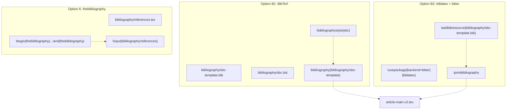
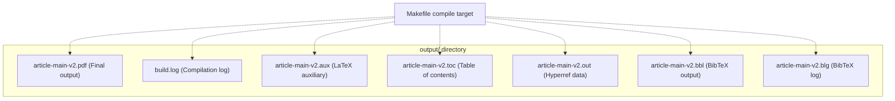
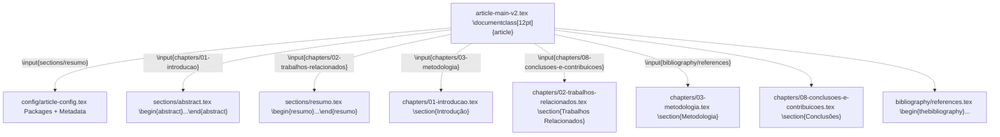

# LaTeX Template Structure

> **Relevant source files**
> * [Article/README.md](https://github.com/ThalesMMS/mammography-pipelines/blob/01443313/Article/README.md)
> * [Article/article-main-v2.tex](https://github.com/ThalesMMS/mammography-pipelines/blob/01443313/Article/article-main-v2.tex)

## Purpose and Scope

This document describes the modular file organization and structural components of the LaTeX article template located in the `Article/` directory. The template provides a skeleton structure for academic publications with clear separation of concerns: configuration, content, bibliography, and assets.

For information about compiling the article, see [Compiling the Article](8b%20Compiling-the-Article.md). For integrating machine learning outputs into the article, see [Integrating ML Results with LaTeX](8d%20Integrating-ML-Results-with-LaTeX.md). For bibliography configuration details, see [Bibliography Management](8c%20Bibliography-Management.md).

---

## Directory Structure Overview

The article template follows a modular organization pattern where different types of content are segregated into dedicated directories. This structure enables independent editing of configuration, content, and assets without modifying the main document file.

```mermaid
flowchart TD

MAIN["article-main-v2.tex (Main Document)"]
MAKEFILE["Makefile (Build System)"]
README["README.md (Documentation)"]
CONFIG["article-config.tex (Packages & Metadata)"]
CH01["01-introducao.tex"]
CH02["02-trabalhos-relacionados.tex"]
CH03["03-metodologia.tex"]
CH04["04-avaliacao-resultados.tex"]
CH05["05-detalhes-implementacao.tex"]
CH06["06-desafios-tecnicos.tex"]
CH07["07-trabalhos-futuros.tex"]
CH08["08-conclusoes-e-contribuicoes.tex"]
ABSTRACT["abstract.tex"]
RESUMO["resumo.tex"]
REF_TEX["references.tex (thebibliography)"]
REF_BIB["sbc-template.bib (BibTeX entries)"]
REF_BST["sbc.bst (BibTeX style)"]
FIGS["ML-generated figures density_*.png"]
TEMPS["Template placeholders template_*.jpg/png"]
PDF["article-main-v2.pdf (Final output)"]
LOG["build.log (Compilation log)"]
AUX["*.aux, *.toc, *.bbl (Intermediates)"]

MAIN -.-> CONFIG
MAIN -.-> CH01
MAIN -.-> CH02
MAIN -.-> CH03
MAIN -.-> CH04
MAIN -.-> CH05
MAIN -.-> CH06
MAIN -.-> CH07
MAIN -.-> CH08
MAIN -.-> ABSTRACT
MAIN -.-> RESUMO
MAIN -.-> REF_TEX
CH04 -.-> FIGS
CH05 -.-> TEMPS
MAIN -.-> PDF
MAKEFILE -.-> LOG

subgraph output/ ["output/"]
    PDF
    LOG
    AUX
end

subgraph assets/ ["assets/"]
    FIGS
    TEMPS
end

subgraph bibliography/ ["bibliography/"]
    REF_TEX
    REF_BIB
    REF_BST
end

subgraph sections/ ["sections/"]
    ABSTRACT
    RESUMO
end

subgraph chapters/ ["chapters/"]
    CH01
    CH02
    CH03
    CH04
    CH05
    CH06
    CH07
    CH08
end

subgraph config/ ["config/"]
    CONFIG
end

subgraph subGraph0 ["Article Root"]
    MAIN
    MAKEFILE
    README
    MAKEFILE -.-> MAIN
end
```



**Sources:** [Article/README.md L5-L26](https://github.com/ThalesMMS/mammography-pipelines/blob/01443313/Article/README.md#L5-L26)

---

## Directory Components

| Directory | Purpose | Key Files | Referenced By |
| --- | --- | --- | --- |
| `config/` | Centralized package imports and metadata | `article-config.tex` | [article-main-v2.tex L17](https://github.com/ThalesMMS/mammography-pipelines/blob/01443313/article-main-v2.tex#L17-L17) |
| `chapters/` | Numbered content chapters | `01-introducao.tex` through `08-conclusoes-e-contribuicoes.tex` | [article-main-v2.tex L41-L48](https://github.com/ThalesMMS/mammography-pipelines/blob/01443313/article-main-v2.tex#L41-L48) |
| `sections/` | Abstract, resumo, optional appendices | `abstract.tex`, `resumo.tex` | [article-main-v2.tex L29-L30](https://github.com/ThalesMMS/mammography-pipelines/blob/01443313/article-main-v2.tex#L29-L30) |
| `bibliography/` | Reference management files | `references.tex`, `sbc-template.bib`, `sbc.bst` | [article-main-v2.tex L62](https://github.com/ThalesMMS/mammography-pipelines/blob/01443313/article-main-v2.tex#L62-L62) <br>  or [67-68](https://github.com/ThalesMMS/mammography-pipelines/blob/01443313/67-68) |
| `assets/` | Figures, diagrams, images | ML outputs from `report-pack`, template placeholders | Chapters via `\includegraphics` |
| `output/` | Build artifacts and final PDF | `article-main-v2.pdf`, `build.log`, `*.aux` | Generated by Makefile |

**Sources:** [Article/README.md L5-L26](https://github.com/ThalesMMS/mammography-pipelines/blob/01443313/Article/README.md#L5-L26)

 [Article/README.md L90-L97](https://github.com/ThalesMMS/mammography-pipelines/blob/01443313/Article/README.md#L90-L97)

---

## Main Document File: article-main-v2.tex

The main document file serves as the orchestrator that includes all modular components. It defines the document class and delegates all content to separate files via `\input` commands.

### Document Structure

```mermaid
flowchart TD

DOC_START["\documentclass[12pt]{article}"]
CONFIG_INPUT["\input{config/article-config}"]
BEGIN_DOC["\begin{document}"]
MAKETITLE["\maketitle"]
ABSTRACT_INPUT["\input{sections/abstract}"]
RESUMO_INPUT["\input{sections/resumo}"]
CH_01["\input{chapters/01-introducao}"]
CH_02["\input{chapters/02-trabalhos-relacionados}"]
CH_03["\input{chapters/03-metodologia}"]
CH_04["\input{chapters/04-avaliacao-resultados}"]
CH_05["\input{chapters/05-detalhes-implementacao}"]
CH_06["\input{chapters/06-desafios-tecnicos}"]
CH_07["\input{chapters/07-trabalhos-futuros}"]
CH_08["\input{chapters/08-conclusoes-e-contribuicoes}"]
BIB_INPUT["\input{bibliography/references}"]
END_DOC["\end{document}"]

MAKETITLE -.-> ABSTRACT_INPUT
```



The main file contains no actual content text. All sections are externalized, making the main file a clean "table of contents" that shows the document structure at a glance.

**Sources:** [Article/article-main-v2.tex L1-L79](https://github.com/ThalesMMS/mammography-pipelines/blob/01443313/Article/article-main-v2.tex#L1-L79)

 [Article/README.md L80-L101](https://github.com/ThalesMMS/mammography-pipelines/blob/01443313/Article/README.md#L80-L101)

---

## Configuration System: config/article-config.tex

The `config/article-config.tex` file centralizes all package imports, document metadata, and custom macros. This separation allows package configuration changes without modifying the main document structure.

### Configuration Responsibilities

| Configuration Area | LaTeX Constructs | Purpose |
| --- | --- | --- |
| **Metadata** | `\newcommand{\DocumentTitle}{...}` | Document title, author, institution, email |
| **Packages** | `\usepackage{...}` | Font encoding, graphics, tables, hyperlinks |
| **PDF Metadata** | `\hypersetup{...}` | Automatically populated from metadata commands |
| **Graphics Path** | `\graphicspath{{assets/}}` | Enables relative image paths |
| **SBC Template** | `\usepackage{sbc-template}` | Conference/journal formatting |

### Metadata Definition Pattern

The configuration uses `\newcommand` to define reusable metadata variables that are automatically propagated to PDF metadata:

```
\newcommand{\DocumentTitle}{[Título do Trabalho]}\newcommand{\AuthorName}{[Nome do Autor]}\newcommand{\AuthorInstitution}{[Departamento / Curso] -- [Instituição]}\newcommand{\AuthorLocation}{[Cidade] -- [UF] -- [País]}\newcommand{\AuthorEmail}{[email@exemplo.com]}
```

These commands are referenced in `\hypersetup{pdftitle=\DocumentTitle, pdfauthor=\AuthorName, ...}`.

**Sources:** [Article/README.md L82-L89](https://github.com/ThalesMMS/mammography-pipelines/blob/01443313/Article/README.md#L82-L89)

 **Sources**: [Article documentation](https://github.com/ThalesMMS/mammography-pipelines/blob/01443313/Article/README.md#L172-L172)

---

## Content Organization

### Chapters Directory Structure

The `chapters/` directory contains numbered LaTeX files that represent the main sections of the document. The numbering convention `NN-titulo.tex` provides visual ordering in file browsers and makes the inclusion order explicit.

| File | Chapter Title | Special Features |
| --- | --- | --- |
| `01-introducao.tex` | Introduction | Standard text content |
| `02-trabalhos-relacionados.tex` | Related Work | Citation-heavy |
| `03-metodologia.tex` | Methodology | Technical descriptions |
| `04-avaliacao-resultados.tex` | Evaluation & Results | Uses `template_fig1.jpg` |
| `05-detalhes-implementacao.tex` | Implementation Details | Uses `template_diagram1.png`, `template_diagram2.png` |
| `06-desafios-tecnicos.tex` | Technical Challenges | Problem-solution format |
| `07-trabalhos-futuros.tex` | Future Work | Forward-looking |
| `08-conclusoes-e-contribuicoes.tex` | Conclusions & Contributions | Summary |

**Sources:** [Article/README.md L10-L18](https://github.com/ThalesMMS/mammography-pipelines/blob/01443313/Article/README.md#L10-L18)

 [Article/README.md L50](https://github.com/ThalesMMS/mammography-pipelines/blob/01443313/Article/README.md#L50-L50)

 [Article/README.md L92](https://github.com/ThalesMMS/mammography-pipelines/blob/01443313/Article/README.md#L92-L92)

### Sections Directory

The `sections/` directory contains document components that are not numbered chapters:

* `abstract.tex` - English abstract
* `resumo.tex` - Portuguese abstract/resumo
* Optional files (commented out by default): * `agradecimentos.tex` - Acknowledgments * `guia-rapido.tex` - Quick reference guide with LaTeX examples

**Sources:** [Article/README.md L19](https://github.com/ThalesMMS/mammography-pipelines/blob/01443313/Article/README.md#L19-L19)

 [Article/article-main-v2.tex L29-L30](https://github.com/ThalesMMS/mammography-pipelines/blob/01443313/Article/article-main-v2.tex#L29-L30)

 [Article/article-main-v2.tex L53](https://github.com/ThalesMMS/mammography-pipelines/blob/01443313/Article/article-main-v2.tex#L53-L53)

---

## Bibliography System Architecture

The template supports three distinct bibliography approaches, selectable by commenting/uncommenting lines in the main document file.



### Bibliography File Locations

* **thebibliography entries:** [bibliography/references.tex](https://github.com/ThalesMMS/mammography-pipelines/blob/01443313/bibliography/references.tex)
* **BibTeX database:** [bibliography/sbc-template.bib](https://github.com/ThalesMMS/mammography-pipelines/blob/01443313/bibliography/sbc-template.bib)
* **BibTeX style:** [bibliography/sbc.bst](https://github.com/ThalesMMS/mammography-pipelines/blob/01443313/bibliography/sbc.bst)

### Selection Mechanism

The main document file uses commented lines to select the bibliography system:

```
% Option A — thebibliography (default):\input{bibliography/references}% Option B1 — BibTeX: comment above and uncomment below% \bibliographystyle{sbc}% \bibliography{bibliography/sbc-template}% Option B2 — biblatex + biber: configure in config/article-config.tex% \printbibliography
```

**Sources:** [Article/README.md L20-L23](https://github.com/ThalesMMS/mammography-pipelines/blob/01443313/Article/README.md#L20-L23)

 [Article/README.md L58-L78](https://github.com/ThalesMMS/mammography-pipelines/blob/01443313/Article/README.md#L58-L78)

 [Article/article-main-v2.tex L59-L73](https://github.com/ThalesMMS/mammography-pipelines/blob/01443313/Article/article-main-v2.tex#L59-L73)

---

## Asset Management

### Graphics Path Configuration

The template configures `\graphicspath{{assets/}}` in the configuration file, allowing all chapter files to reference images without path prefixes:

```
% In any chapter file:\includegraphics[width=0.8\textwidth]{template_fig1.jpg}% LaTeX automatically searches in assets/ directory
```

### Asset Types and Sources

| Asset Type | File Pattern | Generated By | Referenced In |
| --- | --- | --- | --- |
| ML confusion matrices | `density_confusion_seed*.png` | `mammography report-pack` | Results chapters |
| ML training curves | `density_train_seed*.png` | `mammography report-pack` | Results chapters |
| ML Grad-CAM heatmaps | `density_gradcam_seed*.png` | `mammography report-pack` | Interpretation sections |
| Embedding visualizations | `embeddings_pca_tsne.png` | `mammography embed` | Methodology chapter |
| Template placeholders | `template_fig1.jpg`, `template_diagram*.png` | Manual creation | Example chapters |

### Image Reference Pattern

Chapters reference images using labels for cross-referencing:

```
\begin{figure}[h]    \centering    \includegraphics[width=0.8\textwidth]{density_confusion_seed42.png}    \caption{Confusion matrix for seed 42}    \label{fig:confusion-seed42}\end{figure}% Later reference:As shown in Figure~\ref{fig:confusion-seed42}, ...
```

**Sources:** [Article/README.md L52-L56](https://github.com/ThalesMMS/mammography-pipelines/blob/01443313/Article/README.md#L52-L56)

 [Article/README.md L96](https://github.com/ThalesMMS/mammography-pipelines/blob/01443313/Article/README.md#L96-L96)

 **Sources**: [Article documentation](https://github.com/ThalesMMS/mammography-pipelines/blob/01443313/Article/README.md#L104-L106)

---

## Build Output Directory

The `output/` directory is generated by the Makefile during compilation and contains all build artifacts. This directory is excluded from version control (via `.gitignore`).

### Output Directory Contents



### Temporary File Purpose

| File Extension | Purpose | Regenerated Each Build |
| --- | --- | --- |
| `.pdf` | Final compiled document | Yes |
| `.log` | Detailed compilation messages (copied to `build.log`) | Yes |
| `.aux` | Cross-reference information | Yes |
| `.toc` | Table of contents data | Yes (if `\tableofcontents` enabled) |
| `.out` | Hyperref bookmark data | Yes (if `hyperref` enabled) |
| `.bbl` | Formatted bibliography from BibTeX | Only when running BibTeX |
| `.blg` | BibTeX processing log | Only when running BibTeX |

The Makefile's `clean` target removes the entire `output/` directory: **Sources**: [Article documentation](https://github.com/ThalesMMS/mammography-pipelines/blob/01443313/Article/README.md#L150-L150)

**Sources:** [Article/README.md L25-L26](https://github.com/ThalesMMS/mammography-pipelines/blob/01443313/Article/README.md#L25-L26)

 [Article/README.md L97](https://github.com/ThalesMMS/mammography-pipelines/blob/01443313/Article/README.md#L97-L97)

 **Sources**: [Article documentation](https://github.com/ThalesMMS/mammography-pipelines/blob/01443313/Article/README.md#L150-L150)

---

## File Inclusion Mechanism

The template uses LaTeX's `\input` command to assemble the document from modular files. This mechanism allows parallel editing of different chapters and reduces merge conflicts in version control.

### Inclusion Flow



### Input Command Syntax

The `\input` command is used without file extensions (`.tex` is implied):

```
\input{chapters/01-introducao}      % Correct\input{chapters/01-introducao.tex}  % Also works but not conventional
```

### Label and Cross-Reference Convention

The template establishes naming conventions for labels to avoid collisions across files:

| Label Prefix | Used For | Example |
| --- | --- | --- |
| `fig:` | Figures | `\label{fig:confusion-matrix}` |
| `tab:` | Tables | `\label{tab:performance-metrics}` |
| `sec:` | Sections | `\label{sec:methodology}` |
| `eq:` | Equations | `\label{eq:loss-function}` |

References use `\ref{label}` or `\eqref{label}` (for equations). Hyperref automatically makes these clickable links.

**Sources:** [Article/README.md L50-L51](https://github.com/ThalesMMS/mammography-pipelines/blob/01443313/Article/README.md#L50-L51)

 [Article/README.md L99-L102](https://github.com/ThalesMMS/mammography-pipelines/blob/01443313/Article/README.md#L99-L102)

 [Article/article-main-v2.tex L17](https://github.com/ThalesMMS/mammography-pipelines/blob/01443313/Article/article-main-v2.tex#L17-L17)

 [Article/article-main-v2.tex L29-L48](https://github.com/ThalesMMS/mammography-pipelines/blob/01443313/Article/article-main-v2.tex#L29-L48)

 [Article/article-main-v2.tex L62](https://github.com/ThalesMMS/mammography-pipelines/blob/01443313/Article/article-main-v2.tex#L62-L62)

---

## Modularity Benefits

The modular structure provides several advantages for multi-author academic writing:

1. **Parallel Editing:** Multiple authors can edit different chapters simultaneously without conflicts
2. **Version Control:** Git diffs show changes to individual chapters rather than the entire document
3. **Selective Compilation:** Chapters can be temporarily commented out for faster iteration during editing
4. **Asset Isolation:** Figures are managed in a separate directory, independent of text content
5. **Configuration Centralization:** Package changes affect all chapters uniformly through `article-config.tex`
6. **Bibliography Flexibility:** Easy switching between bibliography systems by commenting/uncommenting lines

**Sources:** [Article/README.md L1-L175](https://github.com/ThalesMMS/mammography-pipelines/blob/01443313/Article/README.md#L1-L175)


### On this page

* [LaTeX Template Structure](#8.1-latex-template-structure)
* [Purpose and Scope](#8.1-purpose-and-scope)
* [Directory Structure Overview](#8.1-directory-structure-overview)
* [Directory Components](#8.1-directory-components)
* [Main Document File: article-main-v2.tex](#8.1-main-document-file-object-object)
* [Document Structure](#8.1-document-structure)
* [Configuration System: config/article-config.tex](#8.1-configuration-system-object-object)
* [Configuration Responsibilities](#8.1-configuration-responsibilities)
* [Metadata Definition Pattern](#8.1-metadata-definition-pattern)
* [Content Organization](#8.1-content-organization)
* [Chapters Directory Structure](#8.1-chapters-directory-structure)
* [Sections Directory](#8.1-sections-directory)
* [Bibliography System Architecture](#8.1-bibliography-system-architecture)
* [Bibliography File Locations](#8.1-bibliography-file-locations)
* [Selection Mechanism](#8.1-selection-mechanism)
* [Asset Management](#8.1-asset-management)
* [Graphics Path Configuration](#8.1-graphics-path-configuration)
* [Asset Types and Sources](#8.1-asset-types-and-sources)
* [Image Reference Pattern](#8.1-image-reference-pattern)
* [Build Output Directory](#8.1-build-output-directory)
* [Output Directory Contents](#8.1-output-directory-contents)
* [Temporary File Purpose](#8.1-temporary-file-purpose)
* [File Inclusion Mechanism](#8.1-file-inclusion-mechanism)
* [Inclusion Flow](#8.1-inclusion-flow)
* [Input Command Syntax](#8.1-input-command-syntax)
* [Label and Cross-Reference Convention](#8.1-label-and-cross-reference-convention)
* [Modularity Benefits](#8.1-modularity-benefits)

Ask Devin about mammography-pipelines