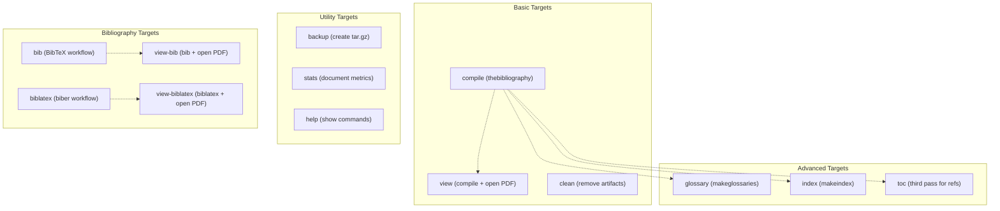
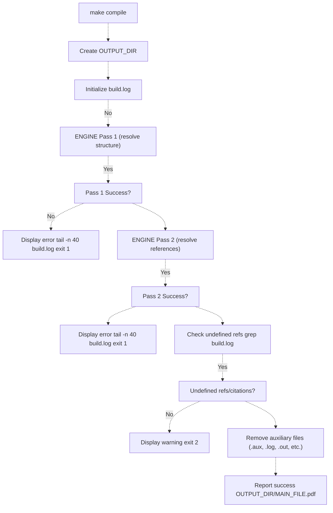
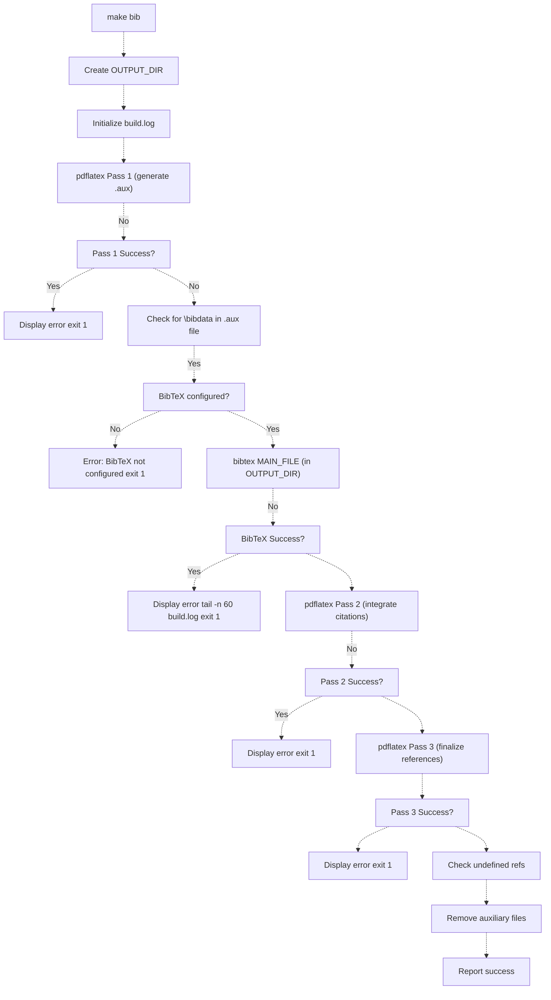
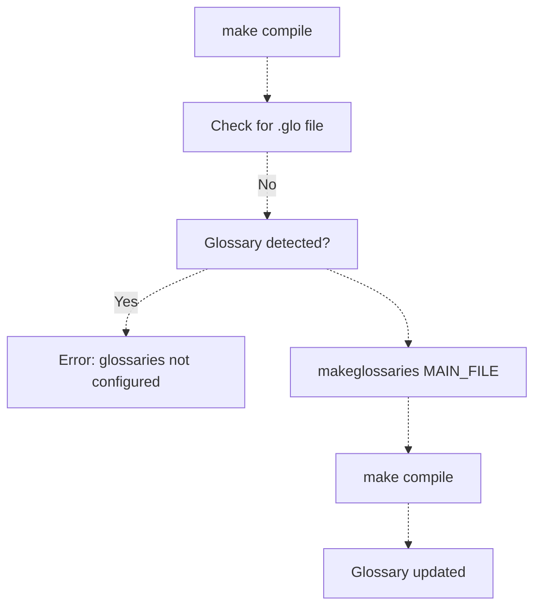
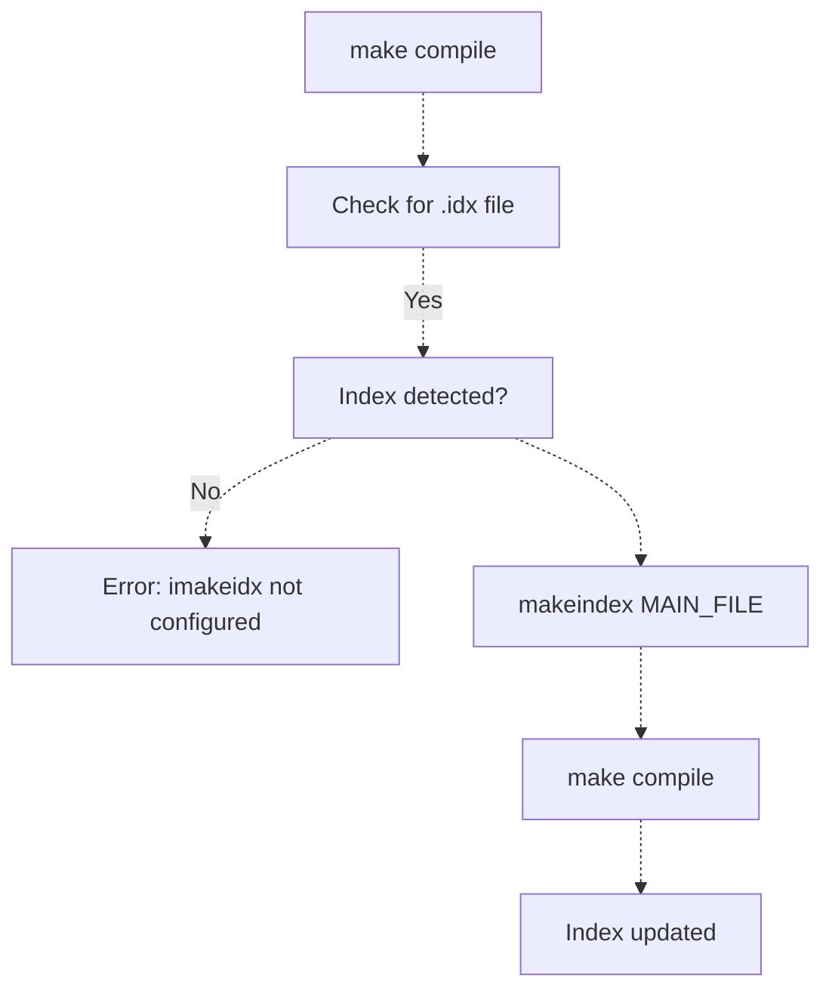
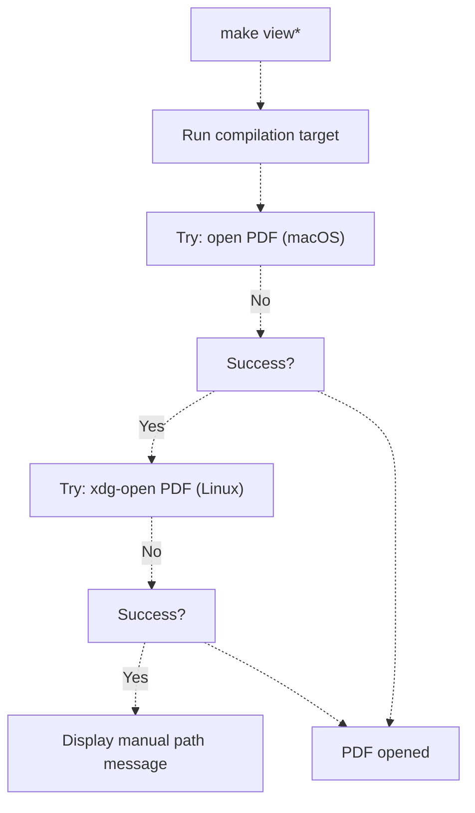
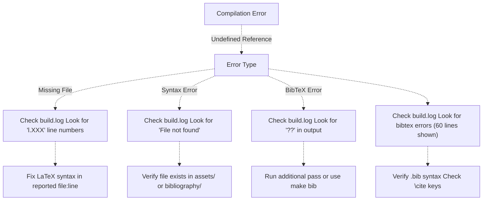

# Compiling the Article

> **Relevant source files**
> * [Article/Makefile](https://github.com/ThalesMMS/mammography-pipelines/blob/01443313/Article/Makefile)
> * [Article/README.md](https://github.com/ThalesMMS/mammography-pipelines/blob/01443313/Article/README.md)

## Purpose and Scope

This document describes the LaTeX compilation process for the article documentation system using the Makefile-based build system. It covers compilation targets, workflow steps, log management, and error handling for generating the final PDF document from LaTeX sources.

For information about the LaTeX template structure and modular organization, see [LaTeX Template Structure](8a%20LaTeX-Template-Structure.md). For bibliography configuration options, see [Bibliography Management](8c%20Bibliography-Management.md). For automated integration of ML results into the article, see [Integrating ML Results with LaTeX](8d%20Integrating-ML-Results-with-LaTeX.md).

## Makefile Configuration

The build system is controlled by configuration variables defined at the top of the Makefile:

| Variable | Default Value | Purpose |
| --- | --- | --- |
| `MAIN_FILE` | `article-main-v2` | Main LaTeX file without `.tex` extension |
| `OUTPUT_DIR` | `output` | Directory for compiled PDF and build logs |
| `BACKUP_DIR` | `backups` | Directory for backup archives |
| `ENGINE` | `pdflatex` | LaTeX engine (`pdflatex`, `xelatex`, or `lualatex`) |
| `TEXFLAGS` | *(empty)* | Additional flags for the LaTeX engine |

These variables can be overridden at the command line:

```
make ENGINE=xelatex compilemake TEXFLAGS=-shell-escape compile
```

**Sources:** [Article/Makefile L6-L15](https://github.com/ThalesMMS/mammography-pipelines/blob/01443313/Article/Makefile#L6-L15)

## Compilation Target Overview

The Makefile provides multiple targets for different compilation scenarios:



**Sources:** [Article/Makefile L17-L18](https://github.com/ThalesMMS/mammography-pipelines/blob/01443313/Article/Makefile#L17-L18)

 [Article/Makefile L70-L80](https://github.com/ThalesMMS/mammography-pipelines/blob/01443313/Article/Makefile#L70-L80)

## Standard Compilation Workflow

The `compile` target implements the default compilation workflow for documents using the `thebibliography` environment embedded in LaTeX sources.

### Compilation Steps



### Engine Invocation

Each pass invokes the LaTeX engine with the following flags:

```
$(ENGINE) -interaction=nonstopmode \
          -halt-on-error \
          -file-line-error \
          -output-directory=$(OUTPUT_DIR) \
          $(MAIN_FILE).tex
```

| Flag | Purpose |
| --- | --- |
| `-interaction=nonstopmode` | Suppress interactive prompts |
| `-halt-on-error` | Stop compilation on first error |
| `-file-line-error` | Display errors with file:line format |
| `-output-directory=output` | Write output to specified directory |

**Sources:** [Article/Makefile L25-L38](https://github.com/ThalesMMS/mammography-pipelines/blob/01443313/Article/Makefile#L25-L38)

 **Sources**: [Article documentation](https://github.com/ThalesMMS/mammography-pipelines/blob/01443313/Article/README.md#L133-L136)

### Auxiliary File Cleanup

After successful compilation, the following temporary files are removed from `OUTPUT_DIR`:

* `.aux` - Auxiliary file with cross-references
* `.log` - Detailed compilation log
* `.out` - Hyperref outline data
* `.toc` - Table of contents
* `.lof` / `.lot` - List of figures/tables
* `.bbl` / `.blg` - Bibliography files
* `.nav` / `.snm` - Beamer navigation files
* `.synctex.gz` - SyncTeX data
* `.fdb_latexmk` / `.fls` - Latexmk metadata
* `.xdv` / `.dvi` - Intermediate formats

The compiled PDF and `build.log` remain in `OUTPUT_DIR`.

**Sources:** [Article/Makefile L37](https://github.com/ThalesMMS/mammography-pipelines/blob/01443313/Article/Makefile#L37-L37)

## BibTeX Compilation Workflow

The `bib` target handles documents using external `.bib` files with BibTeX for bibliography management.

### BibTeX Processing Pipeline



### BibTeX Configuration Detection

The workflow validates that BibTeX is properly configured by checking for `\bibdata` in the `.aux` file generated during the first pass. If not found, it reports:

```
BibTeX não configurado neste documento. Adicione \bibliographystyle{...} e \bibliography{...}.
```

**Sources:** [Article/Makefile L82-L100](https://github.com/ThalesMMS/mammography-pipelines/blob/01443313/Article/Makefile#L82-L100)

 [Article/README.md L40-L46](https://github.com/ThalesMMS/mammography-pipelines/blob/01443313/Article/README.md#L40-L46)

## Biblatex Compilation Workflow

The `biblatex` target supports the modern `biblatex` package with the `biber` backend.

### Key Differences from BibTeX

| Aspect | BibTeX | Biblatex |
| --- | --- | --- |
| Backend Tool | `bibtex` | `biber` |
| Configuration Check | Looks for `\bibdata` in `.aux` | Looks for `.bcf` file |
| Error Message Mentions | `\bibliographystyle{}` and `\bibliography{}` | `\usepackage{biblatex}`, `\addbibresource{}`, `\printbibliography` |

### Biblatex Processing Steps

The workflow mirrors the BibTeX target but substitutes `biber` for `bibtex`:

1. First `pdflatex` pass generates `.bcf` (Bibliography Control File)
2. Check for `.bcf` existence to validate biblatex configuration
3. Run `biber MAIN_FILE` to process bibliography
4. Two additional `pdflatex` passes to integrate citations

**Sources:** [Article/Makefile L106-L128](https://github.com/ThalesMMS/mammography-pipelines/blob/01443313/Article/Makefile#L106-L128)

## Advanced Compilation Targets

### Glossary Generation

The `glossary` target integrates glossaries using the `glossaries` package:



Requires configuration in `config/article-config.tex`:

* `\usepackage[acronym]{glossaries}`
* `\makeglossaries`
* Glossary entries defined with `\newglossaryentry` or `\newacronym`

**Sources:** [Article/Makefile L130-L135](https://github.com/ThalesMMS/mammography-pipelines/blob/01443313/Article/Makefile#L130-L135)

 **Sources**: [Article documentation](https://github.com/ThalesMMS/mammography-pipelines/blob/01443313/Article/README.md#L123-L126)

### Index Generation

The `index` target creates an index using `imakeidx`:



Requires configuration:

* `\usepackage{imakeidx}`
* `\makeindex`
* Terms marked with `\index{termo}`

**Sources:** [Article/Makefile L137-L142](https://github.com/ThalesMMS/mammography-pipelines/blob/01443313/Article/Makefile#L137-L142)

 **Sources**: [Article documentation](https://github.com/ThalesMMS/mammography-pipelines/blob/01443313/Article/README.md#L127-L130)

### Additional TOC Pass

The `toc` target executes a third compilation pass when the log indicates unresolved cross-references:

```
make toc
```

This checks `build.log` for patterns like:

* `Rerun to get (cross-references|outlines) right`
* `Label(s) may have changed`

If detected, runs one more `pdflatex` pass to stabilize references.

**Sources:** [Article/Makefile L144-L153](https://github.com/ThalesMMS/mammography-pipelines/blob/01443313/Article/Makefile#L144-L153)

## Output and Log Management

### Directory Structure

After compilation, `OUTPUT_DIR` contains:

```markdown
output/
├── article-main-v2.pdf      # Final compiled document
└── build.log                # Complete compilation log
```

Temporary auxiliary files are automatically removed after successful compilation.

### Build Log Analysis

The `build.log` file captures:

* Complete engine output (stdout and stderr)
* Package loading messages
* Warning and error diagnostics
* Reference resolution status

Error messages display the last 40-60 lines of the log for quick diagnosis:

```
tail -n 40 output/build.log
```

**Sources:** [Article/Makefile L28-L31](https://github.com/ThalesMMS/mammography-pipelines/blob/01443313/Article/Makefile#L28-L31)

 **Sources**: [Article documentation](https://github.com/ThalesMMS/mammography-pipelines/blob/01443313/Article/README.md#L135-L135)

### View Targets

The `view`, `view-bib`, and `view-biblatex` targets automatically open the compiled PDF:



**Sources:** [Article/Makefile L40-L42](https://github.com/ThalesMMS/mammography-pipelines/blob/01443313/Article/Makefile#L40-L42)

 [Article/Makefile L103-L104](https://github.com/ThalesMMS/mammography-pipelines/blob/01443313/Article/Makefile#L103-L104)

## Cleanup and Maintenance

### Clean Target

The `clean` target removes all compilation artifacts:

```
make clean
```

This removes:

1. Auxiliary files in the project root (`.aux`, `.log`, `.out`, etc.)
2. The entire `OUTPUT_DIR` directory

**Sources:** [Article/Makefile L44-L50](https://github.com/ThalesMMS/mammography-pipelines/blob/01443313/Article/Makefile#L44-L50)

### Backup Target

The `backup` target creates timestamped archives:

```
make backup
```

Creates: `backups/article-backup-YYYYMMDD-HHMMSS.tar.gz`

Includes:

* `chapters/` directory
* `sections/` directory
* `config/` directory
* `bibliography/` directory
* `article-main-v2.tex`
* `Makefile`
* `README.md`

Excludes: `OUTPUT_DIR` (compilation artifacts)

**Sources:** [Article/Makefile L52-L59](https://github.com/ThalesMMS/mammography-pipelines/blob/01443313/Article/Makefile#L52-L59)

## Error Handling and Exit Codes

The Makefile implements structured error handling with specific exit codes:

| Exit Code | Meaning | Action |
| --- | --- | --- |
| 0 | Success | Compilation completed without errors |
| 1 | Compilation failure | Engine reported errors; check `build.log` |
| 2 | Undefined references | Compilation succeeded but references/citations unresolved |

### Common Error Scenarios



### Undefined References Handling

When undefined references are detected, the build exits with code 2 but still produces a PDF:

```yaml
Aviso: há referências/citações indefinidas. Consulte output/build.log.
```

This allows inspecting the PDF to identify which references are undefined (shown as `??`).

**Sources:** [Article/Makefile L32-L36](https://github.com/ThalesMMS/mammography-pipelines/blob/01443313/Article/Makefile#L32-L36)

 [Article/Makefile L95-L97](https://github.com/ThalesMMS/mammography-pipelines/blob/01443313/Article/Makefile#L95-L97)

## Statistics Target

The `stats` target provides quick document metrics:

```
make stats
```

Output:

```
=== ESTATÍSTICAS DO DOCUMENTO ===
Capítulos: 8
Seções: 2
Total de linhas: 1234
Total de palavras: 5678
```

Counts files in `chapters/` and `sections/` directories.

**Sources:** [Article/Makefile L61-L67](https://github.com/ThalesMMS/mammography-pipelines/blob/01443313/Article/Makefile#L61-L67)

## Help Target

The `help` target displays available commands and their descriptions:

```
make help
```

Lists all primary targets with brief explanations and indicates that logs are stored in `OUTPUT_DIR/build.log`.

**Sources:** [Article/Makefile L70-L80](https://github.com/ThalesMMS/mammography-pipelines/blob/01443313/Article/Makefile#L70-L80)

## Compilation Workflow Comparison

The following table summarizes the differences between compilation workflows:

| Workflow | Command | Passes | External Tool | Use Case |
| --- | --- | --- | --- | --- |
| Standard | `make compile` | 2× pdflatex | None | `thebibliography` environment |
| BibTeX | `make bib` | 3× pdflatex + bibtex | `bibtex` | External `.bib` files |
| Biblatex | `make biblatex` | 3× pdflatex + biber | `biber` | Modern biblatex package |
| Glossary | `make glossary` | compile + makeglossaries + compile | `makeglossaries` | Glossaries and acronyms |
| Index | `make index` | compile + makeindex + compile | `makeindex` | Index remissivo |
| TOC | `make toc` | Additional pass if needed | None | Resolve TOC/label changes |

**Sources:** [Article/Makefile L18](https://github.com/ThalesMMS/mammography-pipelines/blob/01443313/Article/Makefile#L18-L18)

 **Sources**: [Article documentation](https://github.com/ThalesMMS/mammography-pipelines/blob/01443313/Article/README.md#L133-L136)


### On this page

* [Compiling the Article](#8.2-compiling-the-article)
* [Purpose and Scope](#8.2-purpose-and-scope)
* [Makefile Configuration](#8.2-makefile-configuration)
* [Compilation Target Overview](#8.2-compilation-target-overview)
* [Standard Compilation Workflow](#8.2-standard-compilation-workflow)
* [Compilation Steps](#8.2-compilation-steps)
* [Engine Invocation](#8.2-engine-invocation)
* [Auxiliary File Cleanup](#8.2-auxiliary-file-cleanup)
* [BibTeX Compilation Workflow](#8.2-bibtex-compilation-workflow)
* [BibTeX Processing Pipeline](#8.2-bibtex-processing-pipeline)
* [BibTeX Configuration Detection](#8.2-bibtex-configuration-detection)
* [Biblatex Compilation Workflow](#8.2-biblatex-compilation-workflow)
* [Key Differences from BibTeX](#8.2-key-differences-from-bibtex)
* [Biblatex Processing Steps](#8.2-biblatex-processing-steps)
* [Advanced Compilation Targets](#8.2-advanced-compilation-targets)
* [Glossary Generation](#8.2-glossary-generation)
* [Index Generation](#8.2-index-generation)
* [Additional TOC Pass](#8.2-additional-toc-pass)
* [Output and Log Management](#8.2-output-and-log-management)
* [Directory Structure](#8.2-directory-structure)
* [Build Log Analysis](#8.2-build-log-analysis)
* [View Targets](#8.2-view-targets)
* [Cleanup and Maintenance](#8.2-cleanup-and-maintenance)
* [Clean Target](#8.2-clean-target)
* [Backup Target](#8.2-backup-target)
* [Error Handling and Exit Codes](#8.2-error-handling-and-exit-codes)
* [Common Error Scenarios](#8.2-common-error-scenarios)
* [Undefined References Handling](#8.2-undefined-references-handling)
* [Statistics Target](#8.2-statistics-target)
* [Help Target](#8.2-help-target)
* [Compilation Workflow Comparison](#8.2-compilation-workflow-comparison)

Ask Devin about mammography-pipelines