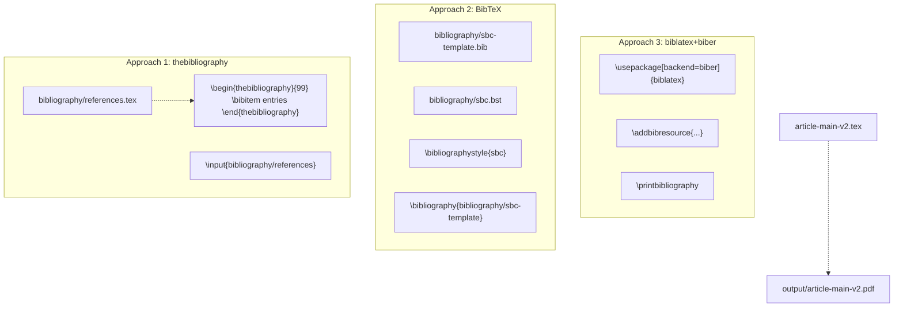
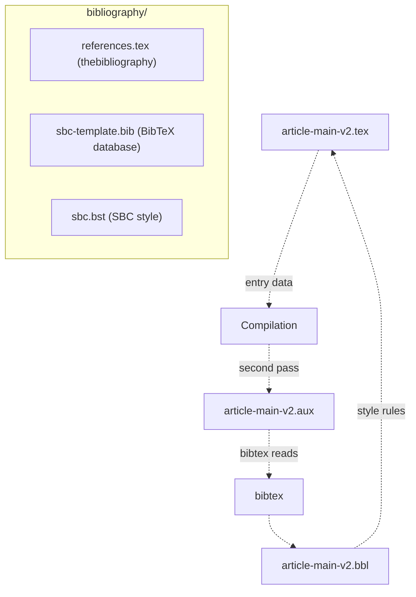
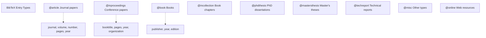
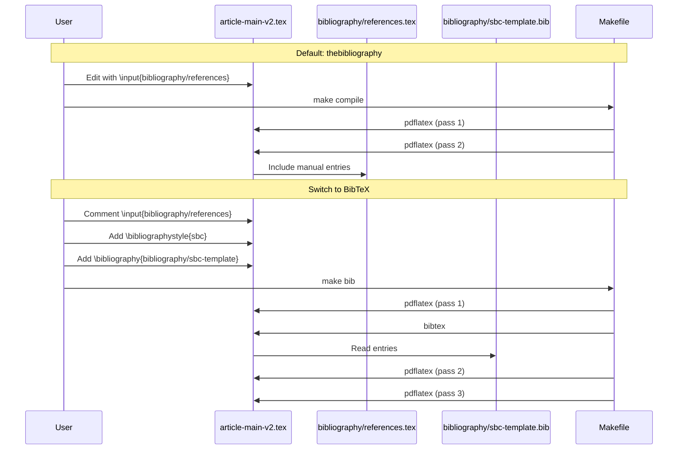
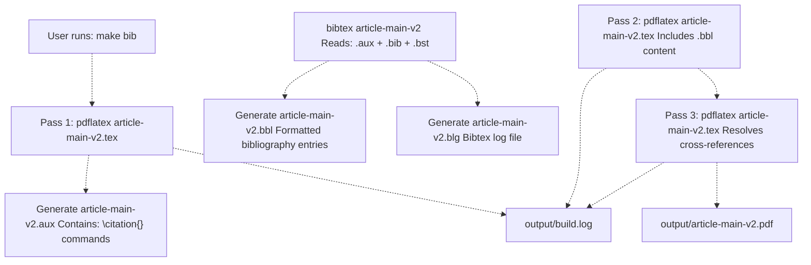

# Bibliography Management

> **Relevant source files**
> * [Article/README.md](https://github.com/ThalesMMS/mammography-pipelines/blob/01443313/Article/README.md)
> * [Article/bibliography/references.tex](https://github.com/ThalesMMS/mammography-pipelines/blob/01443313/Article/bibliography/references.tex)
> * [Article/bibliography/sbc-template.bib](https://github.com/ThalesMMS/mammography-pipelines/blob/01443313/Article/bibliography/sbc-template.bib)
> * [Article/bibliography/sbc.bst](https://github.com/ThalesMMS/mammography-pipelines/blob/01443313/Article/bibliography/sbc.bst)

This document covers the bibliography management system in the Article LaTeX template, detailing the three supported approaches for managing references, their file structures, and compilation workflows. For information about the overall template structure, see [LaTeX Template Structure](8a%20LaTeX-Template-Structure.md). For compilation commands and build processes, see [Compiling the Article](8b%20Compiling-the-Article.md).

## Purpose and Scope

The Article system provides three bibliography management approaches to accommodate different workflow preferences and project scales:

1. **thebibliography environment**: Manual bibliography entries written directly in LaTeX
2. **BibTeX**: Structured bibliography database with automated formatting
3. **biblatex+biber**: Modern bibliography system with advanced features

The repository includes working examples of all three approaches, with default configuration using `thebibliography` for simplicity and explicit control over formatting.

Sources: [Article/README.md L59-L78](https://github.com/ThalesMMS/mammography-pipelines/blob/01443313/Article/README.md#L59-L78)

 **Sources**: [Article documentation](https://github.com/ThalesMMS/mammography-pipelines/blob/01443313/Article/README.md#L109-L114)

## Three Bibliography Approaches



**Diagram: Three Bibliography Management Approaches**

Sources: [Article/README.md L65-L78](https://github.com/ThalesMMS/mammography-pipelines/blob/01443313/Article/README.md#L65-L78)

### Approach 1: thebibliography Environment

The default approach uses the `\begin{thebibliography}` environment with manually written entries in [bibliography/references.tex L1-L68](https://github.com/ThalesMMS/mammography-pipelines/blob/01443313/bibliography/references.tex#L1-L68)

 This approach provides:

* **Direct control**: Each reference is formatted explicitly in LaTeX
* **No external tools**: Requires only pdflatex (no bibtex/biber)
* **Simplicity**: Ideal for small reference lists or static bibliographies
* **Immediate compilation**: Two pdflatex passes resolve all citations

The file contains 22 entries covering the paper's domain:

| Entry Key | Type | Topic |
| --- | --- | --- |
| `ref:birads` | Book | ACR BI-RADS Atlas (5th edition) |
| `ref:breast-density` | Journal | Mammographic density and cancer risk |
| `ref:resnet` | Conference | ResNet deep residual learning (He et al., 2016) |
| `ref:efficientnet` | Conference | EfficientNet model scaling (Tan & Le, 2019) |
| `ref:gradcam` | Conference | Grad-CAM interpretability (Selvaraju et al., 2017) |
| `ref:pytorch` | Conference | PyTorch framework (Paszke et al., 2019) |
| `ref:optuna` | Conference | Optuna hyperparameter optimization |
| `ref:pydicom` | Journal | Pydicom DICOM library |

**Entry format example** [bibliography/references.tex L19-L20](https://github.com/ThalesMMS/mammography-pipelines/blob/01443313/bibliography/references.tex#L19-L20)

:

```
\bibitem{ref:resnet}He, K., Zhang, X., Ren, S., Sun, J. Deep residual learning for image recognition. In: \textit{Proceedings of the IEEE Conference on Computer Vision and Pattern Recognition (CVPR)}, p. 770-778, 2016.
```

Citations in the document use `\cite{ref:resnet}`, which renders as numbered references like [5].

Sources: [Article/bibliography/references.tex L1-L68](https://github.com/ThalesMMS/mammography-pipelines/blob/01443313/Article/bibliography/references.tex#L1-L68)

 [Article/README.md L67-L70](https://github.com/ThalesMMS/mammography-pipelines/blob/01443313/Article/README.md#L67-L70)

### Approach 2: BibTeX Workflow

BibTeX uses a structured database file and a style specification for automated formatting. The repository includes:

* **Database**: [bibliography/sbc-template.bib L1-L58](https://github.com/ThalesMMS/mammography-pipelines/blob/01443313/bibliography/sbc-template.bib#L1-L58)  with sample entries
* **Style**: [bibliography/sbc.bst L1-L1103](https://github.com/ThalesMMS/mammography-pipelines/blob/01443313/bibliography/sbc.bst#L1-L1103)  adapted from apalike for SBC format
* **Compilation**: Requires bibtex intermediate step

**Sample BibTeX entries** [bibliography/sbc-template.bib L27-L37](https://github.com/ThalesMMS/mammography-pipelines/blob/01443313/bibliography/sbc-template.bib#L27-L37)

:

```
@article{doe2020example,  author  = {Doe, John and Smith, Jane},  title   = {An Example Article Using Bib{\TeX}},  journal = {Journal of Examples},  year    = {2020},  volume  = {42},  number  = {3},  pages   = {123--145},  doi     = {10.0000/example.doi},  url     = {https://example.org/article}}
```

**To activate BibTeX**:

1. Comment out in `article-main-v2.tex`: `\input{bibliography/references}`
2. Add before `\end{document}`: ``` \bibliographystyle{sbc}\bibliography{bibliography/sbc-template} ```
3. Compile with: `make bib` or manually `pdflatex → bibtex → pdflatex → pdflatex`

**Advantages**:

* Consistent formatting via `.bst` file
* Reusable entries across projects
* Automatic sorting and citation label generation
* Only cited entries appear in bibliography

Sources: [Article/bibliography/sbc-template.bib L1-L58](https://github.com/ThalesMMS/mammography-pipelines/blob/01443313/Article/bibliography/sbc-template.bib#L1-L58)

 [Article/README.md L71-L78](https://github.com/ThalesMMS/mammography-pipelines/blob/01443313/Article/README.md#L71-L78)

### Approach 3: biblatex+biber

The modern approach using biblatex package with biber backend. The README mentions this option **Sources**: [Article documentation](https://github.com/ThalesMMS/mammography-pipelines/blob/01443313/Article/README.md#L149-L149)

 as an alternative compilation target (`make view-biblatex`), though the repository does not include a pre-configured biblatex setup.

**Typical setup** (not in current template):

```
\usepackage[backend=biber,style=numeric]{biblatex}\addbibresource{bibliography/references.bib}% ...\printbibliography
```

Compile with: `pdflatex → biber → pdflatex → pdflatex`

**Advantages** over BibTeX:

* UTF-8 native support
* Advanced sorting and filtering
* Localization features
* Multiple bibliographies per document

Sources: [Article documentation](https://github.com/ThalesMMS/mammography-pipelines/blob/01443313/Article/README.md#L149-L149)

## File Structure and Organization



**Diagram: Bibliography File Relationships**

The `bibliography/` directory contains all reference-related files:

| File | Lines | Purpose |
| --- | --- | --- |
| `references.tex` | 68 | thebibliography environment with 22 manual entries |
| `sbc-template.bib` | 58 | BibTeX database with sample structured entries |
| `sbc.bst` | 1103 | BibTeX style file (SBC format, apalike-based) |

The main document includes bibliography via:

* **thebibliography**: `\input{bibliography/references}` [Article/README.md L74](https://github.com/ThalesMMS/mammography-pipelines/blob/01443313/Article/README.md#L74-L74)
* **BibTeX**: `\bibliographystyle{sbc}` + `\bibliography{bibliography/sbc-template}` [Article/README.md L76](https://github.com/ThalesMMS/mammography-pipelines/blob/01443313/Article/README.md#L76-L76)

Sources: [Article/README.md L20-L23](https://github.com/ThalesMMS/mammography-pipelines/blob/01443313/Article/README.md#L20-L23)

 [Article/README.md L92-L94](https://github.com/ThalesMMS/mammography-pipelines/blob/01443313/Article/README.md#L92-L94)

## Citation Keys and Entry Types

### Citation Key Naming Convention

The repository uses descriptive prefixed keys for clarity [bibliography/references.tex L7-L65](https://github.com/ThalesMMS/mammography-pipelines/blob/01443313/bibliography/references.tex#L7-L65)

:

| Prefix | Category | Example Keys |
| --- | --- | --- |
| `ref:birads` | Standards | ACR BI-RADS classification system |
| `ref:breast-density` | Domain | Mammographic density research |
| `ref:resnet`, `ref:efficientnet` | Models | Neural network architectures |
| `ref:gradcam` | Methods | Interpretability techniques |
| `ref:pytorch`, `ref:optuna` | Tools | Software frameworks |
| `ref:tsne`, `ref:umap` | Algorithms | Dimensionality reduction |

### Entry Types in BibTeX

The SBC style [bibliography/sbc.bst L1-L1103](https://github.com/ThalesMMS/mammography-pipelines/blob/01443313/bibliography/sbc.bst#L1-L1103)

 supports standard BibTeX entry types:



**Diagram: Supported Entry Types and Required Fields**

Sources: [bibliography/sbc.bst L480-L750](https://github.com/ThalesMMS/mammography-pipelines/blob/01443313/bibliography/sbc.bst#L480-L750)

## Switching Between Bibliography Methods



**Diagram: Switching Bibliography Workflow**

### Step-by-Step Migration

**From thebibliography to BibTeX**:

1. In `article-main-v2.tex`, locate and comment: ``` % \input{bibliography/references} ```
2. Before `\end{document}`, add: ``` \bibliographystyle{sbc}\bibliography{bibliography/sbc-template} ```
3. Populate `sbc-template.bib` with actual references (replace sample entries [bibliography/sbc-template.bib L1-L58](https://github.com/ThalesMMS/mammography-pipelines/blob/01443313/bibliography/sbc-template.bib#L1-L58) )
4. Compile: `make bib` (runs pdflatex → bibtex → pdflatex → pdflatex)
5. Verify: Check `output/build.log` for bibtex warnings

**Reverting to thebibliography**:

1. Uncomment: `\input{bibliography/references}`
2. Comment out or remove: `\bibliographystyle{sbc}` and `\bibliography{...}`
3. Compile: `make compile` (only 2 pdflatex passes needed)

**Path resolution note** [Article/README.md L78](https://github.com/ThalesMMS/mammography-pipelines/blob/01443313/Article/README.md#L78-L78)

: If bibtex cannot locate `sbc.bst` inside `bibliography/`, either:

* Move `sbc.bst` to project root
* Set `TEXINPUTS=.:bibliography//:` environment variable

Sources: [Article/README.md L73-L78](https://github.com/ThalesMMS/mammography-pipelines/blob/01443313/Article/README.md#L73-L78)

 **Sources**: [Article documentation](https://github.com/ThalesMMS/mammography-pipelines/blob/01443313/Article/README.md#L109-L114)

## Compilation Workflows

### Workflow Comparison Table

| Method | Command | Passes | Time | Generated Files |
| --- | --- | --- | --- | --- |
| thebibliography | `make compile` | pdflatex × 2 | ~10s | `.aux`, `.log`, `.out`, `.pdf` |
| BibTeX | `make bib` | pdflatex → bibtex → pdflatex × 2 | ~15s | + `.bbl`, `.blg` |
| biblatex+biber | `make biblatex` | pdflatex → biber → pdflatex × 2 | ~20s | + `.bcf`, `.run.xml` |

### Detailed BibTeX Compilation Flow



**Diagram: BibTeX Multi-Pass Compilation**

The Makefile defines **Sources**: [Article documentation](https://github.com/ThalesMMS/mammography-pipelines/blob/01443313/Article/README.md#L146-L149)

:

```
make compile   # thebibliography: 2 passesmake bib       # BibTeX: pdflatex → bibtex → pdflatex × 2make biblatex  # biblatex: pdflatex → biber → pdflatex × 2
```

**Why multiple passes?**

1. **First pass**: Generate `.aux` with citation keys (`\citation{ref:resnet}`)
2. **bibtex/biber**: Process `.aux`, extract entries from `.bib`, format via `.bst`, output `.bbl`
3. **Second pass**: Include `.bbl` content, may create new forward references
4. **Third pass**: Resolve all cross-references and citations

**Output location**: All intermediate files and final PDF appear in `output/` directory [Article/README.md L97](https://github.com/ThalesMMS/mammography-pipelines/blob/01443313/Article/README.md#L97-L97)

Sources: [Article/README.md L40-L46](https://github.com/ThalesMMS/mammography-pipelines/blob/01443313/Article/README.md#L40-L46)

 **Sources**: [Article documentation](https://github.com/ThalesMMS/mammography-pipelines/blob/01443313/Article/README.md#L146-L149)

## SBC Style Specifics

The [bibliography/sbc.bst L1-L1103](https://github.com/ThalesMMS/mammography-pipelines/blob/01443313/bibliography/sbc.bst#L1-L1103)

 file implements the SBC (Sociedade Brasileira de Computação) bibliography style, adapted from apalike [bibliography/sbc.bst L1-L9](https://github.com/ThalesMMS/mammography-pipelines/blob/01443313/bibliography/sbc.bst#L1-L9)

### Key Formatting Rules

**Author-year labels** [bibliography/sbc.bst L905-L910](https://github.com/ThalesMMS/mammography-pipelines/blob/01443313/bibliography/sbc.bst#L905-L910)

:

```yaml
label = author/editor + " " + year
Example: "He et al. 2016"
```

**Name formatting** [bibliography/sbc.bst L213](https://github.com/ThalesMMS/mammography-pipelines/blob/01443313/bibliography/sbc.bst#L213-L213)

:

```yaml
Format: {vv~}{ll}{, jj}{, f.}
Output: "Last, F." or "von~Last, Jr., F."
```

**Multiple authors** [bibliography/sbc.bst L839-L855](https://github.com/ThalesMMS/mammography-pipelines/blob/01443313/bibliography/sbc.bst#L839-L855)

:

* 1 author: "Jones"
* 2 authors: "Jones and Smith"
* 3+ authors: "Jones et al."

### Entry Type Functions

The style defines formatting functions for each entry type [bibliography/sbc.bst L480-L750](https://github.com/ThalesMMS/mammography-pipelines/blob/01443313/bibliography/sbc.bst#L480-L750)

:

| Function | Entry Type | Output Format |
| --- | --- | --- |
| `article` | Journal papers | Author (year). Title. *Journal*, vol(num):pages. |
| `inproceedings` | Conference | Author (year). Title. In: *Proceedings*, pages, address. |
| `book` | Books | Author (year). *Title*. Publisher, address, edition. |
| `phdthesis` | PhD thesis | Author (year). *Title*. PhD thesis, School, address. |

**Example output** [bibliography/sbc.bst L488-L499](https://github.com/ThalesMMS/mammography-pipelines/blob/01443313/bibliography/sbc.bst#L488-L499)

:

```
He, K., Zhang, X., Ren, S., Sun, J. (2016). Deep residual learning for image recognition. In: \textit{Proceedings of the IEEE Conference on Computer Vision and Pattern Recognition (CVPR)}, pages 770-778.
```

### Customization Points

**Month handling** [bibliography/sbc.bst L52](https://github.com/ThalesMMS/mammography-pipelines/blob/01443313/bibliography/sbc.bst#L52-L52)

: Commented out in SBC style (not used)

**Sorting order** [bibliography/sbc.bst L1065-L1082](https://github.com/ThalesMMS/mammography-pipelines/blob/01443313/bibliography/sbc.bst#L1065-L1082)

:

1. Primary: `sort.label` (author/editor)
2. Secondary: `year`
3. Tertiary: `title`

**Label disambiguation** [bibliography/sbc.bst L1035-L1060](https://github.com/ThalesMMS/mammography-pipelines/blob/01443313/bibliography/sbc.bst#L1035-L1060)

: When multiple works have same author+year, adds suffix: "Jones 2020a", "Jones 2020b"

Sources: [bibliography/sbc.bst L1-L1103](https://github.com/ThalesMMS/mammography-pipelines/blob/01443313/bibliography/sbc.bst#L1-L1103)

## Integration with Main Document

### Citation Commands

In LaTeX source files (chapters/*.tex), references are cited using standard commands:

```
\cite{ref:resnet}              % Basic citation: [5]\cite{ref:resnet,ref:efficientnet}  % Multiple: [5,7]
```

The `hyperref` package (configured in [config/article-config.tex](https://github.com/ThalesMMS/mammography-pipelines/blob/01443313/config/article-config.tex)

) makes citations clickable links to the bibliography section.

### Bibliography Placement

**For thebibliography**: The `\input{bibliography/references}` command is placed before `\end{document}` in `article-main-v2.tex`, after all chapters.

**For BibTeX**: The `\bibliography{bibliography/sbc-template}` command similarly appears before `\end{document}`, and bibtex generates the formatted entries in the `.bbl` file.

### Undefined Reference Warnings

Common warning in `output/build.log`:

```
LaTeX Warning: Citation `ref:unknown' undefined
LaTeX Warning: There were undefined references
```

**Resolution**:

* For thebibliography: Add `\bibitem{ref:unknown}` to references.tex
* For BibTeX: Add entry to .bib file and run `make bib` again
* Verify citation key spelling matches bibliography key exactly

Sources: [Article documentation](https://github.com/ThalesMMS/mammography-pipelines/blob/01443313/Article/README.md#L109-L114)

 **Sources**: [Article documentation](https://github.com/ThalesMMS/mammography-pipelines/blob/01443313/Article/README.md#L159-L162)

## Makefile Commands Summary

| Command | Purpose | Bibliography Method |
| --- | --- | --- |
| `make compile` | Standard compilation | thebibliography |
| `make view` | Compile + open PDF | thebibliography |
| `make bib` | BibTeX compilation | BibTeX (.bib + .bst) |
| `make view-bib` | BibTeX + open PDF | BibTeX |
| `make biblatex` | biblatex compilation | biblatex + biber |
| `make view-biblatex` | biblatex + open PDF | biblatex + biber |
| `make clean` | Remove output/ and temps | All methods |

All compilation logs are written to `output/build.log` **Sources**: [Article documentation](https://github.com/ThalesMMS/mammography-pipelines/blob/01443313/Article/README.md#L146-L146)

 for troubleshooting bibtex errors or missing citations.

**Engine override**: Change LaTeX engine with `ENGINE` variable:

```
make ENGINE=xelatex bibmake ENGINE=lualatex biblatex
```

Sources: [Article documentation](https://github.com/ThalesMMS/mammography-pipelines/blob/01443313/Article/README.md#L137-L156)

## Best Practices

### When to Use Each Method

**Use thebibliography when**:

* Bibliography is small (<50 entries)
* References are static/unchanging
* Full control over formatting is needed
* Minimizing build dependencies

**Use BibTeX when**:

* Building a reusable reference library
* Collaborating across multiple papers
* Need consistent formatting via `.bst` style
* Bibliography is large (50+ entries)

**Use biblatex when**:

* Requiring advanced sorting/filtering
* Working with non-Latin scripts
* Need multiple bibliographies per document
* Using modern LaTeX features

### File Organization

```markdown
bibliography/
├── references.tex         # Manual entries (option 1)
├── sbc-template.bib       # BibTeX database (option 2)
├── sbc.bst                # SBC formatting style
└── [project-specific.bib] # Domain-specific entries
```

**Recommended**: Keep both `references.tex` and `.bib` files in sync during development, allowing quick switching between methods for testing.

### Citation Key Conventions

* Use descriptive prefixes: `ref:`, `paper:`, `book:`, `web:`
* Include author/year hints: `he2016resnet` or `ref:he-resnet`
* Avoid spaces and special characters
* Be consistent across project

Sources: [Article/README.md L92-L97](https://github.com/ThalesMMS/mammography-pipelines/blob/01443313/Article/README.md#L92-L97)

 [Article/bibliography/references.tex L7-L65](https://github.com/ThalesMMS/mammography-pipelines/blob/01443313/Article/bibliography/references.tex#L7-L65)


### On this page

* [Bibliography Management](#8.3-bibliography-management)
* [Purpose and Scope](#8.3-purpose-and-scope)
* [Three Bibliography Approaches](#8.3-three-bibliography-approaches)
* [Approach 1: thebibliography Environment](#8.3-approach-1-thebibliography-environment)
* [Approach 2: BibTeX Workflow](#8.3-approach-2-bibtex-workflow)
* [Approach 3: biblatex+biber](#8.3-approach-3-biblatexbiber)
* [File Structure and Organization](#8.3-file-structure-and-organization)
* [Citation Keys and Entry Types](#8.3-citation-keys-and-entry-types)
* [Citation Key Naming Convention](#8.3-citation-key-naming-convention)
* [Entry Types in BibTeX](#8.3-entry-types-in-bibtex)
* [Switching Between Bibliography Methods](#8.3-switching-between-bibliography-methods)
* [Step-by-Step Migration](#8.3-step-by-step-migration)
* [Compilation Workflows](#8.3-compilation-workflows)
* [Workflow Comparison Table](#8.3-workflow-comparison-table)
* [Detailed BibTeX Compilation Flow](#8.3-detailed-bibtex-compilation-flow)
* [SBC Style Specifics](#8.3-sbc-style-specifics)
* [Key Formatting Rules](#8.3-key-formatting-rules)
* [Entry Type Functions](#8.3-entry-type-functions)
* [Customization Points](#8.3-customization-points)
* [Integration with Main Document](#8.3-integration-with-main-document)
* [Citation Commands](#8.3-citation-commands)
* [Bibliography Placement](#8.3-bibliography-placement)
* [Undefined Reference Warnings](#8.3-undefined-reference-warnings)
* [Makefile Commands Summary](#8.3-makefile-commands-summary)
* [Best Practices](#8.3-best-practices)
* [When to Use Each Method](#8.3-when-to-use-each-method)
* [File Organization](#8.3-file-organization)
* [Citation Key Conventions](#8.3-citation-key-conventions)

Ask Devin about mammography-pipelines