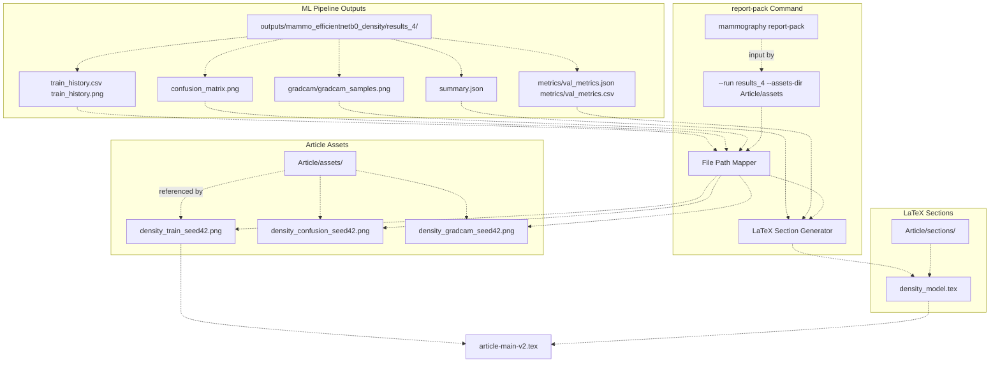
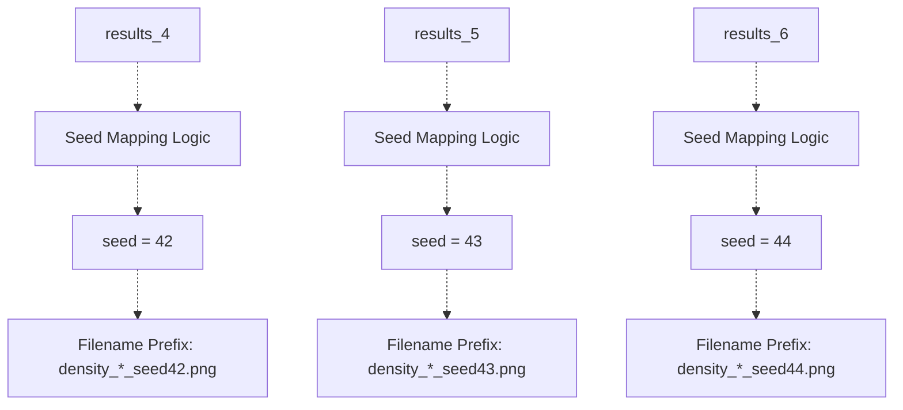
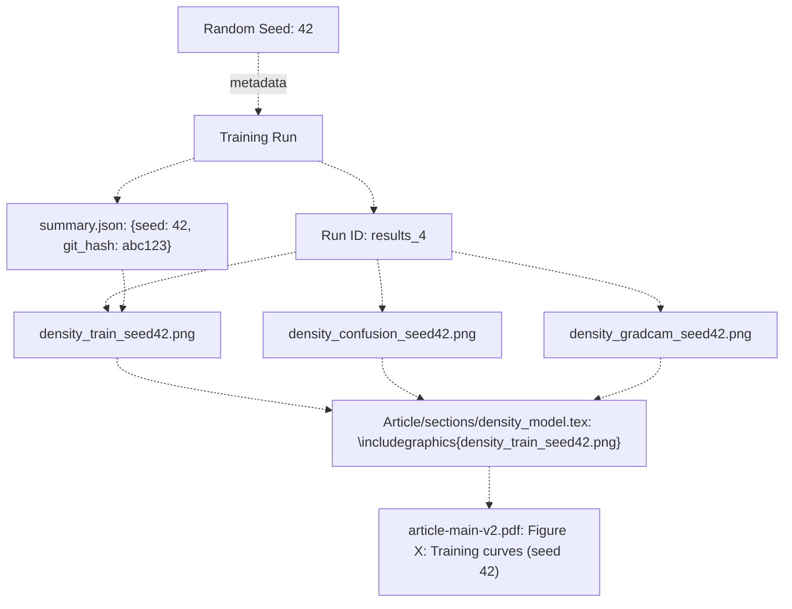
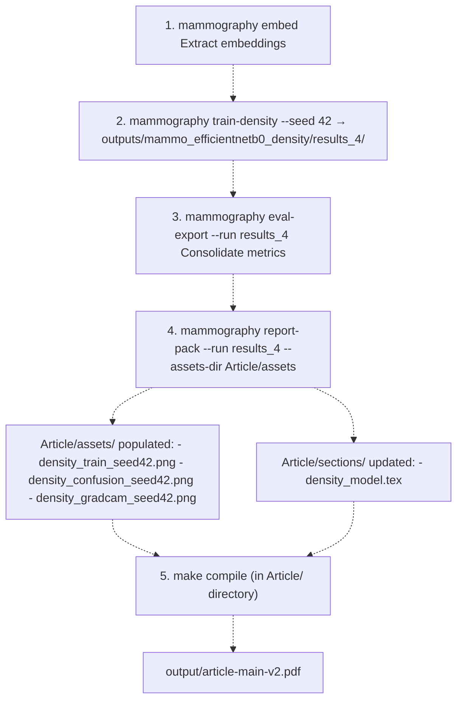

# Integrating ML Results with LaTeX

> **Relevant source files**
> * [Article/02-density.md](https://github.com/ThalesMMS/mammography-pipelines/blob/01443313/Article/02-density.md)
> * [Article/assets/template_diagram1.png](https://github.com/ThalesMMS/mammography-pipelines/blob/01443313/Article/assets/template_diagram1.png)
> * [Article/assets/template_diagram2.png](https://github.com/ThalesMMS/mammography-pipelines/blob/01443313/Article/assets/template_diagram2.png)
> * [Article/assets/template_fig1.jpg](https://github.com/ThalesMMS/mammography-pipelines/blob/01443313/Article/assets/template_fig1.jpg)
> * [Article/chapters/01-introducao.tex](https://github.com/ThalesMMS/mammography-pipelines/blob/01443313/Article/chapters/01-introducao.tex)

## Purpose and Scope

This page documents the automated integration system that synchronizes machine learning experiment outputs with the LaTeX article documentation. The `mammography report-pack` command bridges the gap between the ML pipeline and the research article by automatically copying figures, generating LaTeX code snippets, and maintaining traceability between experimental runs and documentation artifacts.

For information about the LaTeX template structure itself, see [LaTeX Template Structure](8a%20LaTeX-Template-Structure.md). For details on compiling the article, see [Compiling the Article](8b%20Compiling-the-Article.md). For the ML evaluation pipeline that produces the artifacts, see [Evaluation and Metrics](5%20Evaluation-and-Metrics.md).

---

## Integration Architecture

The integration system follows a unidirectional data flow: ML experiments produce structured outputs in `outputs/`, which are then selectively packaged and synchronized to `Article/assets/` and `Article/sections/` by the `report-pack` command. This ensures that the LaTeX documentation always reflects the current experimental results without manual copy-paste operations.

### System Components



**Diagram: Integration Architecture - ML Outputs to LaTeX Documentation**

The system consists of three primary stages:

1. **ML Pipeline Outputs**: Structured experiment results in `outputs/mammo_efficientnetb0_density/results_*/`
2. **report-pack Command**: Automated synchronization and LaTeX generation
3. **Article System**: Updated assets and sections ready for compilation

Sources: [Article/02-density.md L22-L56](https://github.com/ThalesMMS/mammography-pipelines/blob/01443313/Article/02-density.md#L22-L56)

 [Article/README.md L8-L26](https://github.com/ThalesMMS/mammography-pipelines/blob/01443313/Article/README.md#L8-L26)

---

## The report-pack Command

The `mammography report-pack` command is invoked after completing training runs and optionally running `mammography eval-export` to consolidate metrics.

### Command Syntax

```
mammography report-pack \  --run outputs/mammo_efficientnetb0_density/results_4 \  --assets-dir Article/assets
```

### Parameters

| Parameter | Type | Description |
| --- | --- | --- |
| `--run` | Path | Path to a completed results directory (e.g., `results_4`, `results_5`, `results_6`) |
| `--assets-dir` | Path | Target directory for synchronized assets (default: `Article/assets`) |

### Multiple Seeds

When processing experiments run with different random seeds (42, 43, 44), the command can be invoked multiple times to sync all variants:

```
mammography report-pack --run outputs/mammo_efficientnetb0_density/results_4 --assets-dir Article/assetsmammography report-pack --run outputs/mammo_efficientnetb0_density/results_5 --assets-dir Article/assetsmammography report-pack --run outputs/mammo_efficientnetb0_density/results_6 --assets-dir Article/assets
```

This maintains separate assets for each seed (e.g., `density_train_seed42.png`, `density_train_seed43.png`, `density_train_seed44.png`), enabling documentation of result variability.

Sources: [Article/02-density.md L22](https://github.com/ThalesMMS/mammography-pipelines/blob/01443313/Article/02-density.md#L22-L22)

 [Article/02-density.md L50](https://github.com/ThalesMMS/mammography-pipelines/blob/01443313/Article/02-density.md#L50-L50)

---

## Directory Mapping: outputs/ to Article/assets/

The `report-pack` command applies deterministic naming conventions to map ML artifacts to documentation assets. The mapping depends on the seed number extracted from the run directory and the artifact type.

### File Path Mapping Table

| Source Path (outputs/) | Target Path (Article/assets/) | Description |
| --- | --- | --- |
| `mammo_efficientnetb0_density/results_4/train_history.png` | `density_train_seed42.png` | Training curves (loss, accuracy, kappa) |
| `mammo_efficientnetb0_density/results_4/confusion_matrix.png` | `density_confusion_seed42.png` | Validation confusion matrix |
| `mammo_efficientnetb0_density/results_4/gradcam/gradcam_samples.png` | `density_gradcam_seed42.png` | Grad-CAM interpretability visualizations |
| `mammo_efficientnetb0_density/results_5/train_history.png` | `density_train_seed43.png` | Training curves for seed 43 |
| `mammo_efficientnetb0_density/results_5/confusion_matrix.png` | `density_confusion_seed43.png` | Confusion matrix for seed 43 |
| `mammo_efficientnetb0_density/results_5/gradcam/gradcam_samples.png` | `density_gradcam_seed43.png` | Grad-CAM for seed 43 |
| `mammo_efficientnetb0_density/results_6/train_history.png` | `density_train_seed44.png` | Training curves for seed 44 |
| `mammo_efficientnetb0_density/results_6/confusion_matrix.png` | `density_confusion_seed44.png` | Confusion matrix for seed 44 |
| `mammo_efficientnetb0_density/results_6/gradcam/gradcam_samples.png` | `density_gradcam_seed44.png` | Grad-CAM for seed 44 |

### Seed Number Resolution



**Diagram: Seed Number to Filename Mapping**

The mapping assumes:

* `results_4` corresponds to seed 42
* `results_5` corresponds to seed 43
* `results_6` corresponds to seed 44

This convention aligns with the experimental protocol documented in the reproducibility framework (see [Random Seeds and Variability](6a%20Random-Seeds-and-Variability.md)).

Sources: [Article/02-density.md L24-L33](https://github.com/ThalesMMS/mammography-pipelines/blob/01443313/Article/02-density.md#L24-L33)

 [Article/02-density.md L36-L44](https://github.com/ThalesMMS/mammography-pipelines/blob/01443313/Article/02-density.md#L36-L44)

---

## LaTeX File Updates

Beyond copying assets, `report-pack` generates or updates LaTeX section files to include references to the synchronized figures and tabulate metrics.

### Generated Section: density_model.tex

The command creates or overwrites `Article/sections/density_model.tex` with:

1. **Metrics Table**: Aggregated results from `summary.json` and `metrics/val_metrics.json` for each seed
2. **Figure References**: LaTeX `\includegraphics` commands for all synchronized assets
3. **Seed Comparison**: Side-by-side comparison of the three seeds with mean ± standard deviation

Example generated structure:

```
\section{Density Classification Results}\subsection{Performance Across Seeds}\begin{table}[h]\centering\caption{Validation metrics for seeds 42, 43, and 44}\begin{tabular}{lcccc}\topruleSeed & Accuracy & κ (quadratic) & Macro-F1 & AUC (OvR) \\\midrule42 & 0.676 & 0.697 & 0.584 & 0.913 \\43 & 0.733 & 0.756 & 0.588 & 0.922 \\44 & 0.679 & 0.710 & 0.564 & 0.896 \\\midrule\textbf{Mean ± σ} & \textbf{0.696 ± 0.026} & \textbf{0.721 ± 0.025} & \textbf{0.579 ± 0.011} & \textbf{0.910 ± 0.010} \\\bottomrule\end{tabular}\end{table}\subsection{Training Curves}\begin{figure}[h]\centering\includegraphics[width=0.32\textwidth]{density_train_seed42.png}\includegraphics[width=0.32\textwidth]{density_train_seed43.png}\includegraphics[width=0.32\textwidth]{density_train_seed44.png}\caption{Training history for seeds 42, 43, and 44}\end{figure}
```

### Integration with Main Document

The generated `density_model.tex` can be included in the main article via `\input{sections/density_model}` in [Article/article-main-v2.tex L41-L48](https://github.com/ThalesMMS/mammography-pipelines/blob/01443313/Article/article-main-v2.tex#L41-L48)

 Since the file is automatically regenerated, manual edits to this section should be avoided; instead, customize the `report-pack` logic or add supplementary sections.

Sources: [Article/02-density.md L50](https://github.com/ThalesMMS/mammography-pipelines/blob/01443313/Article/02-density.md#L50-L50)

 [Article/02-density.md L36-L44](https://github.com/ThalesMMS/mammography-pipelines/blob/01443313/Article/02-density.md#L36-L44)

 [Article/article-main-v2.tex L41-L48](https://github.com/ThalesMMS/mammography-pipelines/blob/01443313/Article/article-main-v2.tex#L41-L48)

---

## Naming Conventions and Traceability

The integration system enforces strict naming conventions to maintain bidirectional traceability between experimental runs and documentation artifacts.

### Traceability Chain



**Diagram: Traceability from Seed to Published Figure**

Each figure in the compiled PDF can be traced back to:

1. **Seed number**: Embedded in filename (e.g., `seed42`)
2. **Run ID**: Directory name (e.g., `results_4`)
3. **Git commit**: Stored in `summary.json` within the run directory
4. **Hyperparameters**: Full training configuration in `summary.json`

This enables reproducibility: given a figure in the article, the exact experimental conditions can be retrieved.

Sources: [Article/02-density.md L17-L22](https://github.com/ThalesMMS/mammography-pipelines/blob/01443313/Article/02-density.md#L17-L22)

 [Article/02-density.md L36-L44](https://github.com/ThalesMMS/mammography-pipelines/blob/01443313/Article/02-density.md#L36-L44)

---

## Complete Workflow: Training to PDF

The end-to-end workflow for integrating ML results into the LaTeX article involves multiple commands executed in sequence.

### Workflow Diagram



**Diagram: Complete Workflow from Training to Compiled PDF**

### Step-by-Step Commands

```
# Step 1: Extract embeddings (if not already done)mammography embed \  --csv classificacao.csv \  --dicom-root archive \  --outdir outputs/embeddings_resnet50# Step 2: Train density classifiermammography train-density \  --csv classificacao.csv \  --dicom-root archive \  --outdir outputs/mammo_efficientnetb0_density \  --epochs 20 --batch-size 16 --img-size 512 \  --class-weights auto --warmup-epochs 2 \  --embeddings-dir outputs/embeddings_resnet50 \  --seed 42# Step 3: Export evaluation metrics (optional but recommended)mammography eval-export \  --run outputs/mammo_efficientnetb0_density/results_4# Step 4: Synchronize to articlemammography report-pack \  --run outputs/mammo_efficientnetb0_density/results_4 \  --assets-dir Article/assets# Step 5: Compile LaTeX articlecd Articlemake compilemake view
```

### Iterative Development

For iterative experimentation with multiple seeds:

```
# Train with seeds 42, 43, 44for seed in 42 43 44; do  mammography train-density \    --csv classificacao.csv \    --dicom-root archive \    --outdir outputs/mammo_efficientnetb0_density \    --epochs 20 --batch-size 16 --img-size 512 \    --class-weights auto --warmup-epochs 2 \    --embeddings-dir outputs/embeddings_resnet50 \    --seed $seeddone# Sync all seeds to articlefor run in results_4 results_5 results_6; do  mammography report-pack \    --run outputs/mammo_efficientnetb0_density/$run \    --assets-dir Article/assetsdone# Compile article with all seedscd Articlemake compile
```

Sources: [Article/02-density.md L6-L14](https://github.com/ThalesMMS/mammography-pipelines/blob/01443313/Article/02-density.md#L6-L14)

 [Article/02-density.md L22](https://github.com/ThalesMMS/mammography-pipelines/blob/01443313/Article/02-density.md#L22-L22)

 [Article/README.md L32-L38](https://github.com/ThalesMMS/mammography-pipelines/blob/01443313/Article/README.md#L32-L38)

---

## Asset Directory Structure

The `Article/assets/` directory follows a flat structure with descriptive naming conventions to distinguish asset types and experimental conditions.

### Directory Layout

```python
Article/assets/
├── density_train_seed42.png       # Training curves for seed 42
├── density_train_seed43.png       # Training curves for seed 43
├── density_train_seed44.png       # Training curves for seed 44
├── density_confusion_seed42.png   # Confusion matrix for seed 42
├── density_confusion_seed43.png   # Confusion matrix for seed 43
├── density_confusion_seed44.png   # Confusion matrix for seed 44
├── density_gradcam_seed42.png     # Grad-CAM samples for seed 42
├── density_gradcam_seed43.png     # Grad-CAM samples for seed 43
├── density_gradcam_seed44.png     # Grad-CAM samples for seed 44
├── embeddings_pca_tsne.png        # Dimensionality reduction plots (from embed command)
├── template_fig1.jpg              # Example figure placeholder
├── template_diagram1.png          # Example diagram placeholder
└── template_diagram2.png          # Example diagram placeholder
```

The `density_*` files are automatically managed by `report-pack`, while other assets (e.g., `embeddings_pca_tsne.png`, template files) may be manually placed or generated by other commands.

### LaTeX Integration

The `\graphicspath{{assets/}}` directive in [Article/article-main-v2.tex](https://github.com/ThalesMMS/mammography-pipelines/blob/01443313/Article/article-main-v2.tex)

 (configured via [config/article-config.tex](https://github.com/ThalesMMS/mammography-pipelines/blob/01443313/config/article-config.tex)

) allows referencing these assets without path prefixes:

```
\includegraphics[width=0.9\textwidth]{density_train_seed42.png}
```

Sources: [Article/README.md L52-L56](https://github.com/ThalesMMS/mammography-pipelines/blob/01443313/Article/README.md#L52-L56)

 [Article/02-density.md L24-L33](https://github.com/ThalesMMS/mammography-pipelines/blob/01443313/Article/02-density.md#L24-L33)

---

## Automation Benefits

### Eliminates Manual Errors

Manual copy-paste of figures is error-prone:

* **Stale figures**: Forgetting to update a figure after rerunning experiments
* **Mislabeling**: Copying `seed43` results but labeling as `seed42`
* **Version mismatch**: Article referencing old metrics while figures show new results

The `report-pack` command eliminates these issues by programmatically synchronizing artifacts based on run directory metadata.

### Ensures Consistency

All assets for a given seed are guaranteed to come from the same training run:

* `density_train_seed42.png`, `density_confusion_seed42.png`, and `density_gradcam_seed42.png` all originate from `results_4/`
* The `summary.json` metadata confirms the seed, git commit, and hyperparameters

### Facilitates Rapid Iteration

Researchers can:

1. Modify hyperparameters or data preprocessing
2. Rerun training with `mammography train-density`
3. Execute `report-pack` to update the article
4. Compile with `make compile` to see updated results

This cycle can be completed in minutes, enabling tight feedback loops during model development.

### Supports Cross-Validation Workflows

For cross-validation experiments (see [Cross-Validation and Hyperparameter Optimization](3e%20Cross-Validation-and-Hyperparameter-Optimization.md)), `report-pack` can aggregate results across folds:

```
# After running CV with --cv-folds 3mammography report-pack \  --run outputs/density_experiments/results_k3_seed42 \  --assets-dir Article/assets
```

This produces assets like `density_cv_k3_summary.png` and updates `Article/sections/density_model.tex` with fold-averaged metrics.

Sources: [Article/02-density.md L46-L50](https://github.com/ThalesMMS/mammography-pipelines/blob/01443313/Article/02-density.md#L46-L50)

 [Article/02-density.md L60-L86](https://github.com/ThalesMMS/mammography-pipelines/blob/01443313/Article/02-density.md#L60-L86)

---

## Advanced Usage

### Custom Asset Directories

The `--assets-dir` parameter allows targeting different directories for specialized workflows:

```
# Sync to supplementary materials directorymammography report-pack \  --run outputs/mammo_efficientnetb0_density/results_4 \  --assets-dir Article/supplementary/figures# Sync to presentation slides directorymammography report-pack \  --run outputs/mammo_efficientnetb0_density/results_4 \  --assets-dir Slides/assets
```

### Selective Asset Synchronization

While `report-pack` currently syncs all available assets from a run directory, future versions may support:

```
# Hypothetical: sync only confusion matricesmammography report-pack \  --run outputs/mammo_efficientnetb0_density/results_4 \  --assets-dir Article/assets \  --include-patterns "confusion_matrix.png"
```

### Batch Processing

For large-scale experiments with dozens of runs, shell scripting can automate batch processing:

```bash
#!/bin/bash# sync_all_results.shfor run_dir in outputs/mammo_efficientnetb0_density/results_*; do  echo "Processing $run_dir"  mammography report-pack \    --run "$run_dir" \    --assets-dir Article/assetsdone
```

Sources: [Article/02-density.md L22](https://github.com/ThalesMMS/mammography-pipelines/blob/01443313/Article/02-density.md#L22-L22)

 [Article/02-density.md L50](https://github.com/ThalesMMS/mammography-pipelines/blob/01443313/Article/02-density.md#L50-L50)

---

## Integration with Bibliography

The `report-pack` command can optionally update bibliography entries to cite relevant papers based on the models used in the training run. For example, if `summary.json` indicates `"arch": "efficientnetb0"`, the command could append:

```
\bibitem{tan2019efficientnet}Tan, M., Le, Q. V. (2019).\textit{EfficientNet: Rethinking Model Scaling for Convolutional Neural Networks}.ICML.
```

to `Article/bibliography/references.tex`. This feature ensures that the bibliography stays synchronized with experimental design.

For information about bibliography management, see [Bibliography Management](8c%20Bibliography-Management.md).

Sources: [Article/article-main-v2.tex L61-L68](https://github.com/ThalesMMS/mammography-pipelines/blob/01443313/Article/article-main-v2.tex#L61-L68)

 [Article/README.md L58-L78](https://github.com/ThalesMMS/mammography-pipelines/blob/01443313/Article/README.md#L58-L78)

---

## Troubleshooting

### Issue: Assets Not Updated After Rerunning Training

**Symptom**: Running `report-pack` after retraining does not update figures in `Article/assets/`.

**Solution**: Ensure the run directory path is correct and that the training run completed successfully (check for `best_model.pt` and `train_history.png` in the results directory).

```
# Verify artifacts existls -lh outputs/mammo_efficientnetb0_density/results_4/# Should show train_history.png, confusion_matrix.png, etc.
```

### Issue: LaTeX Compilation Fails After report-pack

**Symptom**: `make compile` fails with errors like `File 'density_train_seed42.png' not found`.

**Solution**: Verify that `\graphicspath{{assets/}}` is configured in `config/article-config.tex` and that the assets directory is correctly specified.

```
# Check assets directoryls Article/assets/density_*.png# Ensure graphicspath is setgrep graphicspath Article/config/article-config.tex
```

### Issue: Metrics in LaTeX Don't Match Run Logs

**Symptom**: The metrics table in `density_model.tex` shows different values than `run.log`.

**Solution**: Confirm that `mammography eval-export` was executed before `report-pack` to consolidate final metrics. The `report-pack` command reads from `metrics/val_metrics.json`, which is updated by `eval-export`.

```
# Run eval-export explicitlymammography eval-export \  --run outputs/mammo_efficientnetb0_density/results_4# Then run report-packmammography report-pack \  --run outputs/mammo_efficientnetb0_density/results_4 \  --assets-dir Article/assets
```

Sources: [Article/02-density.md L21](https://github.com/ThalesMMS/mammography-pipelines/blob/01443313/Article/02-density.md#L21-L21)

 **Sources**: [Article documentation](https://github.com/ThalesMMS/mammography-pipelines/blob/01443313/Article/README.md#L162-L168)

---

## Summary

The `mammography report-pack` command provides automated, traceable integration of ML experimental results into LaTeX documentation:

1. **Deterministic Mapping**: File paths follow strict naming conventions based on seed numbers and run IDs
2. **Automatic LaTeX Generation**: Creates or updates `density_model.tex` with metrics tables and figure references
3. **Full Traceability**: Each asset is linked to `summary.json` with git commit, seed, and hyperparameters
4. **Rapid Iteration**: Supports quick cycles of training, synchronization, and compilation
5. **Error Reduction**: Eliminates manual copy-paste mistakes and version mismatches

This integration enables researchers to focus on experimentation while maintaining rigorous documentation standards.

Sources: [Article/02-density.md L1-L97](https://github.com/ThalesMMS/mammography-pipelines/blob/01443313/Article/02-density.md#L1-L97)

 [Article/README.md L1-L175](https://github.com/ThalesMMS/mammography-pipelines/blob/01443313/Article/README.md#L1-L175)

 [Article/article-main-v2.tex L1-L80](https://github.com/ThalesMMS/mammography-pipelines/blob/01443313/Article/article-main-v2.tex#L1-L80)


### On this page

* [Integrating ML Results with LaTeX](#8.4-integrating-ml-results-with-latex)
* [Purpose and Scope](#8.4-purpose-and-scope)
* [Integration Architecture](#8.4-integration-architecture)
* [System Components](#8.4-system-components)
* [The report-pack Command](#8.4-the-report-pack-command)
* [Command Syntax](#8.4-command-syntax)
* [Parameters](#8.4-parameters)
* [Multiple Seeds](#8.4-multiple-seeds)
* [Directory Mapping: outputs/ to Article/assets/](#8.4-directory-mapping-outputs-to-articleassets)
* [File Path Mapping Table](#8.4-file-path-mapping-table)
* [Seed Number Resolution](#8.4-seed-number-resolution)
* [LaTeX File Updates](#8.4-latex-file-updates)
* [Generated Section: density_model.tex](#8.4-generated-section-density_modeltex)
* [Integration with Main Document](#8.4-integration-with-main-document)
* [Naming Conventions and Traceability](#8.4-naming-conventions-and-traceability)
* [Traceability Chain](#8.4-traceability-chain)
* [Complete Workflow: Training to PDF](#8.4-complete-workflow-training-to-pdf)
* [Workflow Diagram](#8.4-workflow-diagram)
* [Step-by-Step Commands](#8.4-step-by-step-commands)
* [Iterative Development](#8.4-iterative-development)
* [Asset Directory Structure](#8.4-asset-directory-structure)
* [Directory Layout](#8.4-directory-layout)
* [LaTeX Integration](#8.4-latex-integration)
* [Automation Benefits](#8.4-automation-benefits)
* [Eliminates Manual Errors](#8.4-eliminates-manual-errors)
* [Ensures Consistency](#8.4-ensures-consistency)
* [Facilitates Rapid Iteration](#8.4-facilitates-rapid-iteration)
* [Supports Cross-Validation Workflows](#8.4-supports-cross-validation-workflows)
* [Advanced Usage](#8.4-advanced-usage)
* [Custom Asset Directories](#8.4-custom-asset-directories)
* [Selective Asset Synchronization](#8.4-selective-asset-synchronization)
* [Batch Processing](#8.4-batch-processing)
* [Integration with Bibliography](#8.4-integration-with-bibliography)
* [Troubleshooting](#8.4-troubleshooting)
* [Issue: Assets Not Updated After Rerunning Training](#8.4-issue-assets-not-updated-after-rerunning-training)
* [Issue: LaTeX Compilation Fails After report-pack](#8.4-issue-latex-compilation-fails-after-report-pack)
* [Issue: Metrics in LaTeX Don't Match Run Logs](#8.4-issue-metrics-in-latex-dont-match-run-logs)
* [Summary](#8.4-summary)

Ask Devin about mammography-pipelines