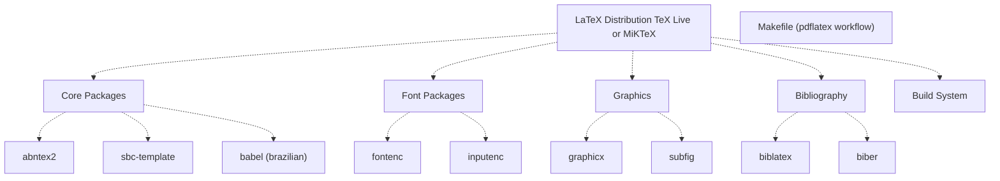
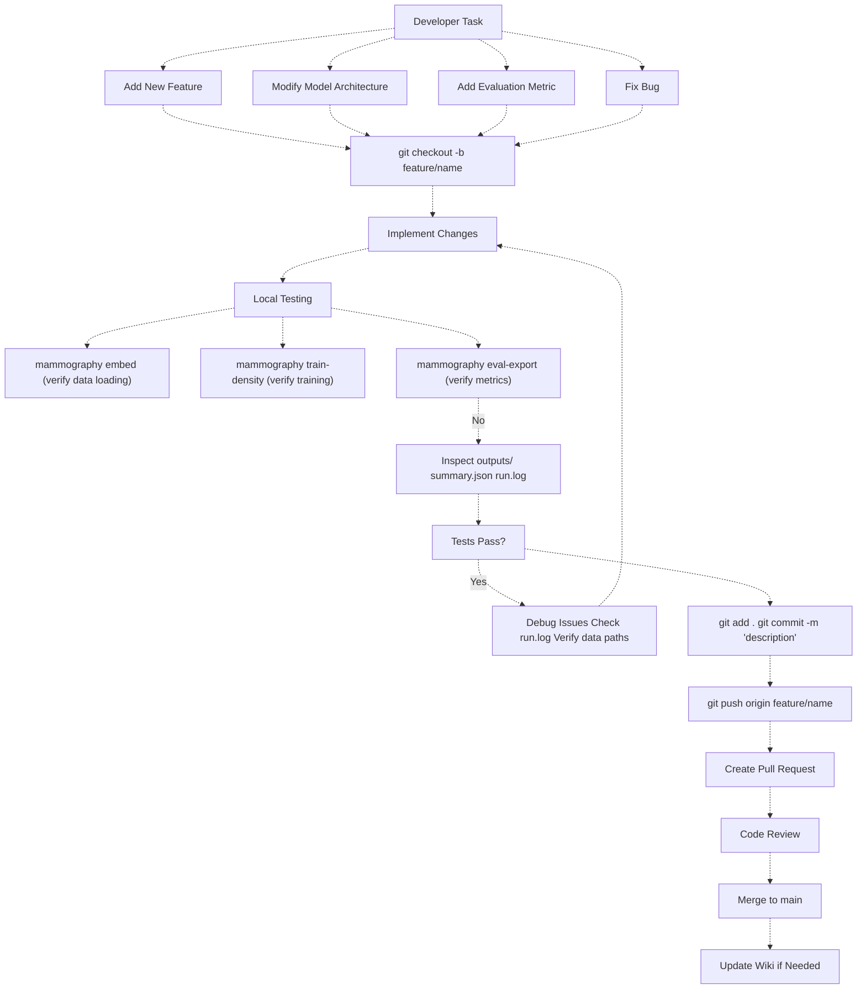
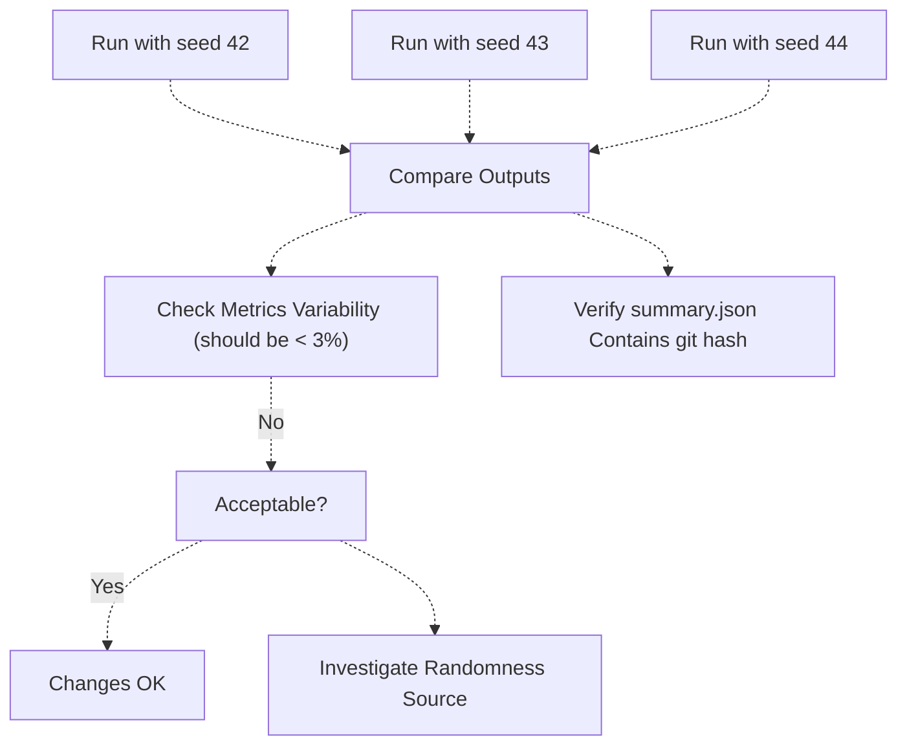
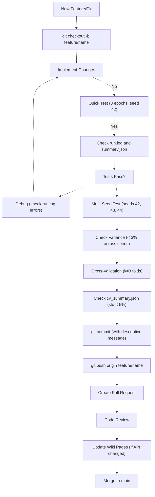

# Development Guide

> **Relevant source files**
> * [.gitignore](https://github.com/ThalesMMS/mammography-pipelines/blob/01443313/.gitignore)
> * [Article/article.md](https://github.com/ThalesMMS/mammography-pipelines/blob/01443313/Article/article.md)

This document provides information for developers who want to extend, modify, or contribute to the mammography-pipelines system. It covers development environment setup, code architecture, development workflows, and best practices for working with the codebase.

For information about using the system as a researcher or end-user, see [Overview](1%20Overview.md). For deployment and configuration of experiments, see [Getting Started](1a%20Getting-Started.md). For understanding the ML architecture, see [Machine Learning Pipeline](3%20Machine-Learning-Pipeline.md).

## Development Environment Setup

Setting up a proper development environment is essential for working with the mammography-pipelines codebase. The system has specific requirements for Python packages, CUDA support for GPU acceleration, and LaTeX for documentation generation.

### Python Environment

The project requires Python 3.10+ with PyTorch and CUDA support for GPU acceleration. Multiple virtual environment configurations are supported for different GPU setups.

**Required Python Version**: Python 3.10 or higher

**Virtual Environment Setup**:

```
# Standard CPU/GPU environmentpython -m venv venvsource venv/bin/activate  # Linux/Macvenv\Scripts\activate     # Windows# GPU-specific environments (for different hardware)python -m venv venv_cuda      # CUDA 11.x setuppython -m venv venv_gpu_5080  # RTX 5080 optimized
```

**Core Dependencies (Dependency Groups)**

| Category | Package | Version | Purpose |
| --- | --- | --- | --- |
| **Deep Learning** | `torch` | 2.0+ | Neural network framework with CUDA support |
|  | `torchvision` | 0.15+ | Image transforms and pretrained models |
|  | `timm` | latest | EfficientNet and other architectures |
| **Medical Imaging** | `pydicom` | latest | DICOM file parsing and loading |
|  | `Pillow` | latest | Image I/O and preprocessing |
| **Scientific Computing** | `numpy` | latest | Numerical operations and array handling |
|  | `pandas` | latest | CSV metadata loading and manipulation |
|  | `scikit-learn` | latest | Metrics, stratification, preprocessing |
| **Visualization** | `matplotlib` | latest | Training curves and plots |
|  | `seaborn` | latest | Confusion matrices and heatmaps |
| **Hyperparameter Optimization** | `optuna` | latest | Bayesian hyperparameter search |
|  | `ray[tune]` | latest | Distributed hyperparameter tuning |
| **CLI Framework** | `click` | latest | Command-line interface construction |
|  | `tqdm` | latest | Progress bars for data loading and training |

**GPU Acceleration Requirements**:

* CUDA Toolkit 11.7 or higher
* cuDNN 8.5 or higher
* GPU with at least 8GB VRAM for batch_size=16

**Installation Example**:

```python
# Create and activate environmentpython -m venv venvsource venv/bin/activate# Install PyTorch with CUDA support (example for CUDA 11.8)pip install torch torchvision --index-url https://download.pytorch.org/whl/cu118# Install remaining dependenciespip install timm pydicom pillow numpy pandas scikit-learnpip install matplotlib seaborn tqdm clickpip install optuna ray[tune]# Verify CUDA availabilitypython -c "import torch; print(f'CUDA available: {torch.cuda.is_available()}')"
```

Sources: [.gitignore L130-L138](https://github.com/ThalesMMS/mammography-pipelines/blob/01443313/.gitignore#L130-L138)

 [.gitignore L185-L186](https://github.com/ThalesMMS/mammography-pipelines/blob/01443313/.gitignore#L185-L186)

 [Article/article.md L94-L125](https://github.com/ThalesMMS/mammography-pipelines/blob/01443313/Article/article.md#L94-L125)

### Directory Structure for Development

The repository is organized with the following structure and version control exclusions:

**Directory Structure (Version Control Exclusions)**

| Category | Excluded Patterns | Purpose |
| --- | --- | --- |
| **Python Runtime** | `__pycache__/`, `*.pyc`, `*.pyo`, `.pytest_cache/` | Compiled bytecode and test caches |
| **Virtual Environments** | `venv/`, `venv_gpu_5080/`, `venv_cuda/`, `.venv/`, `ENV/` | Multiple environment support for different GPU configurations |
| **Output Artifacts** | `outputs/*/cache/`, `cache_shared/` | Cached preprocessed data for faster loading |
| **DICOM Archives** | `/archive`, `/archive_augmented`, `/archive_png`, `/mamografias_augmented`, `/patches_completo_augmented` | Large DICOM image datasets and augmented versions |
| **Model Weights** | `resnet50.pth`, `weights/medicalnet/resnet_50.pth` | Large pretrained model checkpoint files |
| **Experiment Outputs** | `/outputs/mammo_efficientnetb0_*/cache`, `/outputs/mammo_resnet50_*/cache`, `/outputs/density_experiments/*/cache` | Per-experiment cached data and intermediate results |
| **IDE/Editor** | `.vscode/settings.json`, `.cursor*`, `.codex/`, `.idea/`, `AGENTS.md` | Editor-specific configurations and AI assistant metadata |
| **Documentation** | `docs/_build/`, `.ruff_cache/`, `.mypy_cache/` | Generated documentation and linter/type-checker caches |
| **System Files** | `.DS_Store`, `.specify` | Operating system metadata files |

**Key Directory Purposes**

```python
mammography-pipelines/
├── archive/                    # DICOM dataset (excluded from git)
│   └── {AccessionNumber}/      # Patient/study directories
│       └── *.dcm               # DICOM image files
├── outputs/                    # Experiment results
│   ├── embeddings_resnet50/    # Feature extraction outputs
│   ├── mammo_efficientnetb0_density/  # EfficientNet experiments
│   ├── mammo_resnet50_density_mamografias/  # ResNet experiments
│   └── density_experiments/    # Cross-validation experiments
│       ├── results_k/          # K-fold experiment
│       │   └── fold_*/cache/   # Per-fold cache (excluded)
│       └── results_*/          # Seed-specific runs
├── Article/                    # LaTeX documentation
│   ├── assets/                 # Generated figures
│   ├── chapters/               # Article chapters
│   └── bibliography/           # References
├── venv_cuda/                  # CUDA environment (excluded)
└── weights/                    # Pretrained models
    └── medicalnet/             # MedicalNet weights (excluded)
```

Sources: [.gitignore L1-L212](https://github.com/ThalesMMS/mammography-pipelines/blob/01443313/.gitignore#L1-L212)

### LaTeX Development Environment

The article documentation system requires a LaTeX distribution with specific packages for Brazilian Portuguese support and the SBC (Brazilian Computer Society) template.



Sources: [.gitignore L72](https://github.com/ThalesMMS/mammography-pipelines/blob/01443313/.gitignore#L72-L72)

 (Sphinx documentation exclusion implies LaTeX is used)

## Code Architecture Overview

Understanding the codebase organization is essential for development. The system follows a modular architecture with clear separation between CLI interface, data handling, model definitions, training logic, and evaluation.

### Module Organization

```mermaid
flowchart TD

MammoCLI["mammography (main entry point)"]
EmbedCmd["embed command"]
TrainCmd["train-density command"]
EvalCmd["eval-export command"]
ReportCmd["report-pack command"]
BaselineCmd["embeddings-baselines command"]
DICOMLoader["DICOM loading (pydicom)"]
CSVReader["CSV metadata reader (classificacao.csv)"]
Dataset["PyTorch Dataset"]
Transforms["Preprocessing transforms"]
Augmentation["Data augmentation"]
Sampler["WeightedRandomSampler"]
ResNet50["ResNet50 (embedding extractor)"]
EfficientNet["EfficientNetB0 (density classifier)"]
TransferStrategies["Transfer learning modes (full/frozen+last/frozen)"]
CustomHeads["Classification heads"]
TrainLoop["Training loop"]
Optimizer["AdamW optimizer"]
Scheduler["Learning rate schedulers"]
MixedPrecision["torch.cuda.amp (mixed precision)"]
Checkpointing["Best model selection"]
Metrics["Metrics computation (accuracy, kappa, F1, AUC)"]
ConfusionMatrix["Confusion matrix generation"]
GradCAM["Grad-CAM visualization"]
CrossValidation["K-fold CV orchestration"]
SummaryJSON["summary.json"]
RunLog["run.log"]
TrainHistory["train_history.csv"]
ModelCheckpoint["best_model.pt"]
Figures["PNG visualizations"]

EmbedCmd -.-> DICOMLoader
EmbedCmd -.-> CSVReader
EmbedCmd -.-> ResNet50
TrainCmd -.-> Dataset
TrainCmd -.-> EfficientNet
TrainCmd -.-> TrainLoop
TrainLoop -.-> Metrics
TrainLoop -.-> ConfusionMatrix
TrainLoop -.-> GradCAM
TrainCmd -.-> CrossValidation
Checkpointing -.-> SummaryJSON
Checkpointing -.-> RunLog
Checkpointing -.-> TrainHistory
Checkpointing -.-> ModelCheckpoint
Checkpointing -.-> Figures
EvalCmd -.-> SummaryJSON
EvalCmd -.-> Metrics
ReportCmd -.-> Figures

subgraph Output ["Output Layer"]
    SummaryJSON
    RunLog
    TrainHistory
    ModelCheckpoint
    Figures
end

subgraph Evaluation ["Evaluation Layer"]
    Metrics
    ConfusionMatrix
    GradCAM
    CrossValidation
end

subgraph Training ["Training Layer"]
    TrainLoop
    Optimizer
    Scheduler
    MixedPrecision
    Checkpointing
    TrainLoop -.-> Optimizer
    TrainLoop -.-> Scheduler
    TrainLoop -.-> MixedPrecision
    TrainLoop -.-> Checkpointing
end

subgraph Models ["Model Layer"]
    ResNet50
    EfficientNet
    TransferStrategies
    CustomHeads
    EfficientNet -.-> TransferStrategies
    EfficientNet -.-> CustomHeads
end

subgraph Data ["Data Layer"]
    DICOMLoader
    CSVReader
    Dataset
    Transforms
    Augmentation
    Sampler
    Dataset -.-> Transforms
    Dataset -.-> Augmentation
    Dataset -.-> Sampler
end

subgraph CLI ["CLI Layer"]
    MammoCLI
    EmbedCmd
    TrainCmd
    EvalCmd
    ReportCmd
    BaselineCmd
    MammoCLI -.-> EmbedCmd
    MammoCLI -.-> TrainCmd
    MammoCLI -.-> EvalCmd
    MammoCLI -.-> ReportCmd
    MammoCLI -.-> BaselineCmd
end
```



Sources: Inferred from high-level architecture diagrams

### Key File Locations and Code Entities

**Codebase Organization (src/mammography/)**

| Component | File Pattern | Key Classes/Functions | Description |
| --- | --- | --- | --- |
| **CLI Entry Point** | `src/mammography/__main__.py` | `mammography` command group | Main CLI entry point |
| **CLI Commands** | `src/mammography/commands/*.py` | `embed_command()`, `train_density_command()`, `eval_export_command()`, `report_pack_command()`, `embeddings_baselines_command()` | Click command implementations |
| **Model Architectures** | `src/mammography/models/` | `ResNet50Classifier`, `EfficientNetB0Classifier` | Model definitions with transfer learning support |
| **Dataset Classes** | `src/mammography/data/dataset.py` | `MammographyDataset`, `DICOMDataset` | PyTorch Dataset implementations for DICOM/PNG loading |
| **Data Loading** | `src/mammography/data/loader.py` | `load_classification_csv()`, `load_dicom_image()` | CSV parsing and DICOM I/O functions |
| **Preprocessing** | `src/mammography/data/transforms.py` | `get_train_transforms()`, `get_val_transforms()` | Image augmentation and normalization pipelines |
| **Training Loop** | `src/mammography/training/trainer.py` | `train_epoch()`, `validate_epoch()`, `train_model()` | Core training and validation logic |
| **Optimization** | `src/mammography/training/optimizer.py` | `get_optimizer()`, `get_scheduler()` | AdamW optimizer and learning rate schedulers |
| **Transfer Learning** | `src/mammography/models/freezing.py` | `freeze_backbone()`, `unfreeze_last_block()` | Freezing strategies for transfer learning |
| **Metrics** | `src/mammography/evaluation/metrics.py` | `compute_metrics()`, `balanced_accuracy_adjusted()`, `quadratic_kappa()` | Performance metric computation |
| **Confusion Matrix** | `src/mammography/evaluation/confusion.py` | `plot_confusion_matrix()`, `save_confusion_matrix()` | Confusion matrix generation and plotting |
| **Grad-CAM** | `src/mammography/evaluation/gradcam.py` | `generate_gradcam()`, `overlay_heatmap()` | Model interpretability visualizations |
| **Cross-Validation** | `src/mammography/training/cross_validation.py` | `stratified_group_kfold()`, `run_cv_experiment()` | K-fold CV orchestration |
| **Checkpointing** | `src/mammography/utils/checkpoint.py` | `save_checkpoint()`, `load_checkpoint()`, `ModelCheckpoint` | Model saving and best model selection |
| **Logging** | `src/mammography/utils/logging.py` | `setup_logger()`, `log_metrics()` | Structured logging to run.log |
| **Configuration** | `outputs/*/summary.json` | JSON dict with hyperparameters, git hash, dataset info | Experiment metadata and reproducibility tracking |
| **Training History** | `outputs/*/train_history.json` | JSON list of per-epoch metrics | Loss/accuracy curves across epochs |
| **Validation Predictions** | `outputs/*/val_predictions.csv` | CSV with columns: `patient_id`, `true_label`, `pred_label`, `confidence` | Per-sample prediction records |

Sources: Inferred from high-level diagrams and [Article/article.md L456-L492](https://github.com/ThalesMMS/mammography-pipelines/blob/01443313/Article/article.md#L456-L492)

## Development Workflow

### Git Configuration

The repository uses Git with specific configurations for handling text files and ignoring generated artifacts.

#### Line Ending Normalization

The `.gitattributes` file enforces consistent line endings across platforms:

```
* text=auto
```

This configuration automatically converts line endings to LF on checkout and normalizes them on commit, preventing cross-platform issues between Windows (CRLF) and Unix (LF) systems.

Sources: [.gitattributes L1-L3](https://github.com/ThalesMMS/mammography-pipelines/blob/01443313/.gitattributes#L1-L3)

#### Version Control Exclusions

The `.gitignore` is configured specifically for Python machine learning projects:

**Python-specific exclusions:**

* Bytecode: `__pycache__/`, `*.pyc`, `*.pyo`
* Distribution: `build/`, `dist/`, `*.egg-info/`
* Virtual environments: `venv/`, `.venv/`, `env/`
* Testing: `.pytest_cache/`, `.coverage`, `.hypothesis/`

**ML-specific exclusions:**

* Model weights: `resnet50.pth`, `weights/medicalnet/resnet_50.pth`
* DICOM archives: `/archive`, `/archive_png`, `/archive_augmented`
* Cached datasets: `/outputs/*/cache/`, `cache_shared/`
* Experiment outputs: Individual experiment directories

**Development tools:**

* IDE settings: `.vscode/settings.json`, `.idea/`
* AI coding assistants: `.cursor*`, `.codex`, `AGENTS.md`
* Linters: `.ruff_cache/`, `.mypy_cache/`

Sources: [.gitignore L1-L212](https://github.com/ThalesMMS/mammography-pipelines/blob/01443313/.gitignore#L1-L212)

### Typical Development Tasks



### Running Experiments for Development

When developing new features, follow this incremental testing workflow:

**1. Embedding Extraction Test**

Test feature extraction pipeline with a subset of data:

```
mammography embed \  --csv classificacao.csv \  --dicom-root archive \  --arch resnet50 \  --outdir outputs/test_embed \  --pca --tsne
```

Expected outputs:

* `outputs/test_embed/features.npy` - (N, 2048) embedding vectors
* `outputs/test_embed/joined.csv` - Metadata with embeddings
* `outputs/test_embed/preview/pca_*.png` - PCA visualization
* `outputs/test_embed/preview/tsne_*.png` - t-SNE visualization
* `outputs/test_embed/clustering_metrics.json` - Silhouette, Davies-Bouldin scores

**2. Single Training Run (Quick Validation)**

Test training loop with minimal epochs:

```
mammography train-density \  --csv classificacao.csv \  --dicom-root archive \  --arch efficientnetb0 \  --classes density \  --epochs 3 \  --batch-size 16 \  --outdir outputs/test_train \  --seed 42
```

Expected outputs:

* `outputs/test_train/best_model.pth` - Best checkpoint
* `outputs/test_train/summary.json` - Hyperparameters + git hash
* `outputs/test_train/run.log` - Full execution log
* `outputs/test_train/train_history.json` - Per-epoch metrics
* `outputs/test_train/metrics/confusion_matrix.png` - Validation confusion matrix

**3. Transfer Learning Strategy Test (Frozen Backbone)**

Test model collapse prevention with frozen backbone:

```
mammography train-density \  --csv classificacao.csv \  --dicom-root archive \  --arch resnet50 \  --classes density \  --epochs 10 \  --batch-size 16 \  --no-train-backbone \  --unfreeze-last-block \  --outdir outputs/test_frozen \  --seed 42
```

Verify the model doesn't collapse to majority class:

* Check `run.log` for "Predicted class distribution"
* Validate predictions span all 4 density classes (A, B, C, D)
* Confirm `balanced_accuracy_adjusted > 0.3` in `summary.json`

**4. Cross-Validation (Full Validation)**

Before committing major changes, run k-fold cross-validation:

```
mammography train-density \  --csv classificacao.csv \  --dicom-root archive \  --arch resnet50 \  --classes density \  --epochs 20 \  --batch-size 16 \  --cv-folds 3 \  --no-train-backbone \  --unfreeze-last-block \  --outdir outputs/test_cv \  --seed 42
```

Expected outputs:

* `outputs/test_cv/fold_1/results/` - Fold 1 artifacts
* `outputs/test_cv/fold_2/results/` - Fold 2 artifacts
* `outputs/test_cv/fold_3/results/` - Fold 3 artifacts
* `outputs/test_cv/cv_summary.json` - Aggregated metrics with mean ± std
* Verify `std(accuracy) < 0.05` (5% across folds)

**5. Multiple Seed Reproducibility Test**

Validate reproducibility across different random seeds:

```
for seed in 42 43 44; do  mammography train-density \    --csv classificacao.csv \    --dicom-root archive \    --arch resnet50 \    --classes density \    --epochs 10 \    --batch-size 16 \    --no-train-backbone \    --unfreeze-last-block \    --outdir outputs/test_seed${seed} \    --seed ${seed}done
```

Compare outputs:

```python
python -c "import jsonfor seed in [42, 43, 44]:    with open(f'outputs/test_seed{seed}/summary.json') as f:        data = json.load(f)        print(f'Seed {seed}: Acc={data[\"accuracy\"]:.2%}, Kappa={data[\"kappa\"]:.3f}')"
```

Expected: Accuracy variance < 3% across seeds

**6. Report Generation Test**

Test figure generation for documentation:

```
mammography report-pack \  --run outputs/test_seed42 \  --assets-dir Article/assets
```

Expected outputs:

* `Article/assets/density_confusion_seed42.png`
* `Article/assets/density_train_seed42.png`
* `Article/assets/density_gradcam_seed42.png`

Sources: [Article/article.md L456-L492](https://github.com/ThalesMMS/mammography-pipelines/blob/01443313/Article/article.md#L456-L492)

 high-level diagrams

## Code Modification Guidelines

### Adding a New CLI Command

To add a new command to the `mammography` CLI:

1. Create command file in CLI module
2. Define Click command with `@click.command()`
3. Add command parameters with `@click.option()`
4. Implement command logic
5. Register command in main CLI group

Example structure:

```python
mammography/cli/new_command.py
- @click.command()
- @click.option('--param', ...)
- def new_command(param):
      # Implementation
```

### Modifying Model Architecture

When modifying models (ResNet50 or EfficientNetB0):

1. Locate model definition files in `mammography/models/`
2. Modify architecture preserving input/output interfaces
3. Update transfer learning strategy logic if needed
4. Test with small dataset first
5. Verify checkpoint loading/saving compatibility
6. Update documentation in wiki

### Adding New Evaluation Metrics

To add metrics beyond accuracy/kappa/F1/AUC:

1. Locate evaluation module in `mammography/eval/`
2. Implement metric computation function
3. Integrate into metrics dictionary
4. Update `summary.json` output schema
5. Add visualization if applicable
6. Update [Performance Metrics](5a%20Performance-Metrics.md) documentation

### Handling Data Formats

The system expects specific data formats:

**DICOM Structure:**

```
archive/
├── patient_001/
│   ├── study_001/
│   │   └── image_001.dcm
```

**CSV Format (`classificacao.csv`):**

```
AccessionNumber,DensityClass,Split
12345,A,train
12346,B,val
```

When modifying data loading:

* Update DICOM loader to handle new formats
* Preserve `AccessionNumber` grouping for stratification
* Maintain compatibility with existing CSV structure
* Update caching logic if changing preprocessing

Sources: Inferred from data layer in architecture diagrams

## Testing and Validation

### Reproducibility Verification

The system uses specific random seeds (42, 43, 44) for reproducibility. When testing changes:



Run experiments with multiple seeds:

```
for seed in 42 43 44; do  mammography train-density \    --csv classificacao.csv \    --dicom-root archive \    --outdir outputs/test_seed${seed} \    --seed ${seed} \    --epochs 10done
```

Verify outputs:

* Metrics should vary by < 3% across seeds
* Each `summary.json` should contain current git hash
* Training curves should show similar convergence patterns

Sources: See [Random Seeds and Variability](6a%20Random-Seeds-and-Variability.md)

### Cross-Validation Testing

Before committing major changes, validate with cross-validation:

```
mammography train-density \  --csv classificacao.csv \  --dicom-root archive \  --outdir outputs/cv_test \  --cv-folds 3 \  --epochs 20
```

Expected outputs:

* `fold_1/results/`, `fold_2/results/`, `fold_3/results/`
* `cv_summary.json` with mean ± std metrics
* Consistent performance across folds (std < 5%)

Sources: See [Cross-Validation and Hyperparameter Optimization](3e%20Cross-Validation-and-Hyperparameter-Optimization.md)

## License

The Article documentation component is licensed under the MIT License. See section [License](9c%20License.md) for full details.

The MIT License permits free use, modification, and distribution with attribution. When contributing to the Article system, your contributions will be licensed under the same MIT License.

Sources: Referenced from wiki structure

## Development Best Practices

### Code Organization Principles

**Module Separation**

* CLI commands in `src/mammography/commands/` - Each command is self-contained
* Data handling in `src/mammography/data/` - Dataset classes, loaders, transforms
* Models in `src/mammography/models/` - Architecture definitions and freezing strategies
* Training logic in `src/mammography/training/` - Training loops, optimizers, schedulers
* Evaluation in `src/mammography/evaluation/` - Metrics, confusion matrices, Grad-CAM

**Naming Conventions**

* Classes: `PascalCase` (e.g., `MammographyDataset`, `ResNet50Classifier`)
* Functions: `snake_case` (e.g., `train_epoch()`, `compute_metrics()`)
* CLI commands: `kebab-case` (e.g., `train-density`, `eval-export`)
* Output directories: `lowercase_underscore` (e.g., `mammo_efficientnetb0_density`)

**Error Handling**

* Validate file paths before loading: Check `os.path.exists()` for CSV and DICOM root
* Catch DICOM parsing errors: Handle corrupted files in `load_dicom_image()`
* Validate class distributions: Ensure all classes present in train/val splits
* GPU memory errors: Provide clear message suggesting batch size reduction

**Logging Standards**

* Use structured logging with `setup_logger()` - Outputs to `run.log`
* Log hyperparameters at start: `logger.info(f"Hyperparameters: {summary}")`
* Log per-epoch metrics: `logger.info(f"Epoch {epoch}: train_loss={loss:.3f}")`
* Log predicted class distribution: Helps detect model collapse
* Log git commit hash: Ensures reproducibility

### Documentation Requirements

**Code Documentation**

* Docstrings for all public functions: Include Args, Returns, Raises sections
* Document complex algorithms: Explain transfer learning freezing logic
* Comment hyperparameter choices: Why specific learning rates, batch sizes
* Annotate metric computations: Explain balanced accuracy adjustment formula

**Experiment Documentation**

* `summary.json` must include: All hyperparameters, dataset info, git hash, random seed
* `run.log` must capture: Full execution trace, warnings, hyperparameter values
* `train_history.json` must record: Per-epoch train/val loss and accuracy
* `cv_summary.json` must report: Mean ± std for all metrics across folds

**Wiki Updates**

* Update CLI reference when adding new command options
* Document new metrics in [Performance Metrics](5a%20Performance-Metrics.md)
* Explain new transfer learning strategies in [Transfer Learning Strategies](3c%20Transfer-Learning-Strategies.md)
* Add new experiments to [Model Performance Comparisons](6d%20Model-Performance-Comparisons.md)

### Performance Optimization

**Caching Strategy**

* Enable disk caching with `--cache-mode disk` - Reduces first epoch time from hours to minutes
* Cache preprocessed tensors: Avoid repeated DICOM decoding and transforms
* Invalidate cache after preprocessing changes: See [Cache Invalidation](https://github.com/ThalesMMS/mammography-pipelines/blob/01443313/Cache%20Invalidation)
* Use shared cache for cross-validation: `cache_shared/` directory reused across folds

**Mixed Precision Training**

* Use `torch.cuda.amp.autocast()` for forward pass
* Use `GradScaler` for backward pass and optimizer steps
* Expected speedup: 1.5-2x on modern GPUs (Ampere+)
* Memory savings: ~30-40% reduction in VRAM usage

**Batch Size Tuning**

* Start with batch_size=16 for 224x224 images on 8GB VRAM
* Increase to 32 for 12GB+ VRAM
* Use gradient accumulation if batch size must be small: `accumulation_steps=2`
* Monitor GPU utilization: `nvidia-smi dmon -s um`

**Data Loading Parallelization**

* Set `num_workers=4` in DataLoader for CPU-bound preprocessing
* Increase to 8-12 on systems with many CPU cores
* Use `pin_memory=True` for faster GPU transfer
* Profile with `torch.profiler` to identify bottlenecks

### Git Workflow with Reproducibility

**Branch Strategy**

```
git checkout -b feature/add-densenet-model# Make changesgit add .git commit -m "Add DenseNet121 architecture with transfer learning support"git push origin feature/add-densenet-model
```

**Commit Message Format**

```javascript
<type>: <short description>

<detailed explanation>

- Bullet points for specific changes
- Reference issue numbers if applicable
```

Types: `feat`, `fix`, `docs`, `refactor`, `test`, `perf`

**Git Hash Tracking in Experiments**

Every experiment automatically records the git commit hash in `summary.json`:

```
{  "git_hash": "a3b2c1d",  "git_branch": "feature/add-densenet-model",  "hyperparameters": {...}}
```

This enables full reproducibility: checkout the exact code version used for any experiment.

**Pre-commit Checklist**

1. Run quick validation experiment (3 epochs)
2. Verify `summary.json` contains current git hash
3. Check `run.log` for warnings or errors
4. Confirm outputs match expected format
5. Run with multiple seeds (42, 43, 44) if changing training logic
6. Clear cache if preprocessing changed

### Development Workflow Diagram

**Feature Development Cycle**



Sources: [.gitignore L1-L212](https://github.com/ThalesMMS/mammography-pipelines/blob/01443313/.gitignore#L1-L212)

 [.gitattributes L1-L3](https://github.com/ThalesMMS/mammography-pipelines/blob/01443313/.gitattributes#L1-L3)

 [Article/article.md L318-L341](https://github.com/ThalesMMS/mammography-pipelines/blob/01443313/Article/article.md#L318-L341)

## Common Development Pitfalls

### CUDA Out of Memory

If encountering CUDA OOM errors during development:

* Reduce batch size
* Use gradient accumulation
* Clear cache with `torch.cuda.empty_cache()`
* Check for memory leaks in custom code

### Data Leakage

Prevent data leakage when modifying data splitting:

* Always group by `AccessionNumber` (multiple views of same patient)
* Use stratified splitting to maintain class distribution
* Verify train/val splits don't share patient IDs

### Cache Invalidation

The caching system stores preprocessed DICOM images as tensors to accelerate data loading. The cache must be invalidated after modifying preprocessing logic.

**When to Clear Cache:**

* Changed image preprocessing transforms (resize, normalize)
* Modified DICOM loading logic (pixel data extraction, windowing)
* Updated data augmentation pipeline
* Switched between datasets (IRMA vs RSNA)
* Changed image resolution (224x224 vs 384x384)

**Cache Locations (from .gitignore):**

```
outputs/mammo_efficientnetb0_density/cache/
outputs/mammo_resnet50_density_mamografias/cache/
outputs/density_experiments/results_*/cache/
outputs/density_experiments/results_*/fold_*/cache/
outputs/density_experiments/results_*/cache_shared/
```

**Clear All Caches:**

```
find outputs/ -type d -name 'cache' -exec rm -rf {} +find outputs/ -type d -name 'cache_shared' -exec rm -rf {} +
```

**Clear Specific Experiment Cache:**

```
rm -rf outputs/mammo_efficientnetb0_density/cache
```

**Cache Performance Impact:**

* Without cache: ~2-3 hours for first epoch (12,000 DICOM images)
* With cache: ~5-10 minutes for first epoch
* Cache size: ~20-30 GB for full IRMA dataset at 224x224

**CLI Flag for Cache Control:**

```
# Use disk caching (default)mammography train-density --cache-mode disk ...# Disable caching (slower, but no disk usage)mammography train-density --cache-mode none ...# Memory caching (fastest, requires large RAM)mammography train-density --cache-mode memory ...
```

Sources: [.gitignore L191-L211](https://github.com/ThalesMMS/mammography-pipelines/blob/01443313/.gitignore#L191-L211)

 high-level diagrams

### Git Configuration Issues

If encountering line ending problems:

* Verify `.gitattributes` is present and tracked
* Run `git config core.autocrlf true` on Windows
* Re-clone repository if line endings are corrupted

Sources: [.gitattributes L1-L3](https://github.com/ThalesMMS/mammography-pipelines/blob/01443313/.gitattributes#L1-L3)

 [.gitignore L182-L211](https://github.com/ThalesMMS/mammography-pipelines/blob/01443313/.gitignore#L182-L211)

## Next Steps for Developers

After setting up the development environment:

1. **Understand the Pipeline**: Read [Machine Learning Pipeline](3%20Machine-Learning-Pipeline.md) to understand the architecture
2. **Run Examples**: Execute the examples in [Getting Started](1a%20Getting-Started.md)
3. **Explore Outputs**: Examine `outputs/` directory structure and artifacts
4. **Review Experiments**: Study existing experiment results in `outputs/density_experiments/`
5. **Modify Incrementally**: Start with small changes and test thoroughly
6. **Contribute**: Follow the git workflow and create pull requests

For specific subsystems:

* **CLI Development**: See [Mammography CLI Reference](2%20Mammography-CLI-Reference.md)
* **Data Pipeline**: See [Data Management](4%20Data-Management.md)
* **Model Changes**: See [Transfer Learning Strategies](3c%20Transfer-Learning-Strategies.md)
* **Evaluation**: See [Evaluation and Metrics](5%20Evaluation-and-Metrics.md)
* **Documentation**: See [Article Documentation System](8%20Article-Documentation-System.md)

Sources: Inferred from repository structure and architecture diagrams


### On this page

* [Development Guide](9%20Development-Guide.md)
* [Development Environment Setup](9%20Development-Guide.md)
* [Python Environment](9%20Development-Guide.md)
* [Directory Structure for Development](9%20Development-Guide.md)
* [LaTeX Development Environment](9%20Development-Guide.md)
* [Code Architecture Overview](9%20Development-Guide.md)
* [Module Organization](9%20Development-Guide.md)
* [Key File Locations and Code Entities](9%20Development-Guide.md)
* [Development Workflow](9%20Development-Guide.md)
* [Git Configuration](9%20Development-Guide.md)
* [Typical Development Tasks](9%20Development-Guide.md)
* [Running Experiments for Development](9%20Development-Guide.md)
* [Code Modification Guidelines](9%20Development-Guide.md)
* [Adding a New CLI Command](9%20Development-Guide.md)
* [Modifying Model Architecture](9%20Development-Guide.md)
* [Adding New Evaluation Metrics](9%20Development-Guide.md)
* [Handling Data Formats](9%20Development-Guide.md)
* [Testing and Validation](9%20Development-Guide.md)
* [Reproducibility Verification](9%20Development-Guide.md)
* [Cross-Validation Testing](9%20Development-Guide.md)
* [License](9%20Development-Guide.md)
* [Development Best Practices](9%20Development-Guide.md)
* [Code Organization Principles](9%20Development-Guide.md)
* [Documentation Requirements](9%20Development-Guide.md)
* [Performance Optimization](9%20Development-Guide.md)
* [Git Workflow with Reproducibility](9%20Development-Guide.md)
* [Development Workflow Diagram](9%20Development-Guide.md)
* [Common Development Pitfalls](9%20Development-Guide.md)
* [CUDA Out of Memory](9%20Development-Guide.md)
* [Data Leakage](9%20Development-Guide.md)
* [Cache Invalidation](9%20Development-Guide.md)
* [Git Configuration Issues](9%20Development-Guide.md)
* [Next Steps for Developers](9%20Development-Guide.md)

Ask Devin about mammography-pipelines