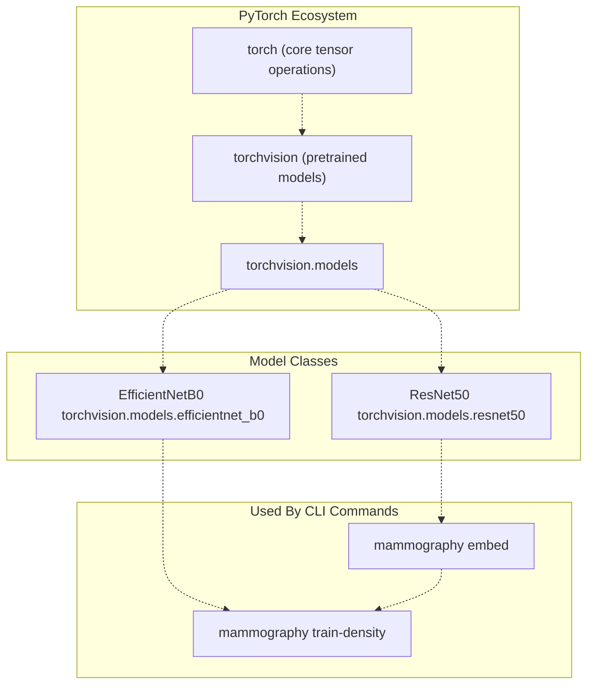
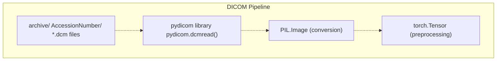
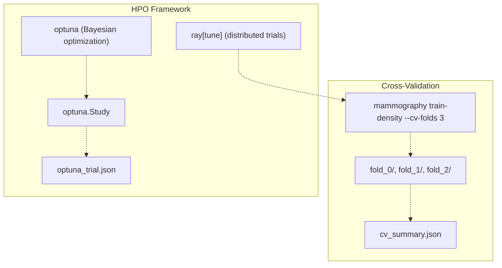
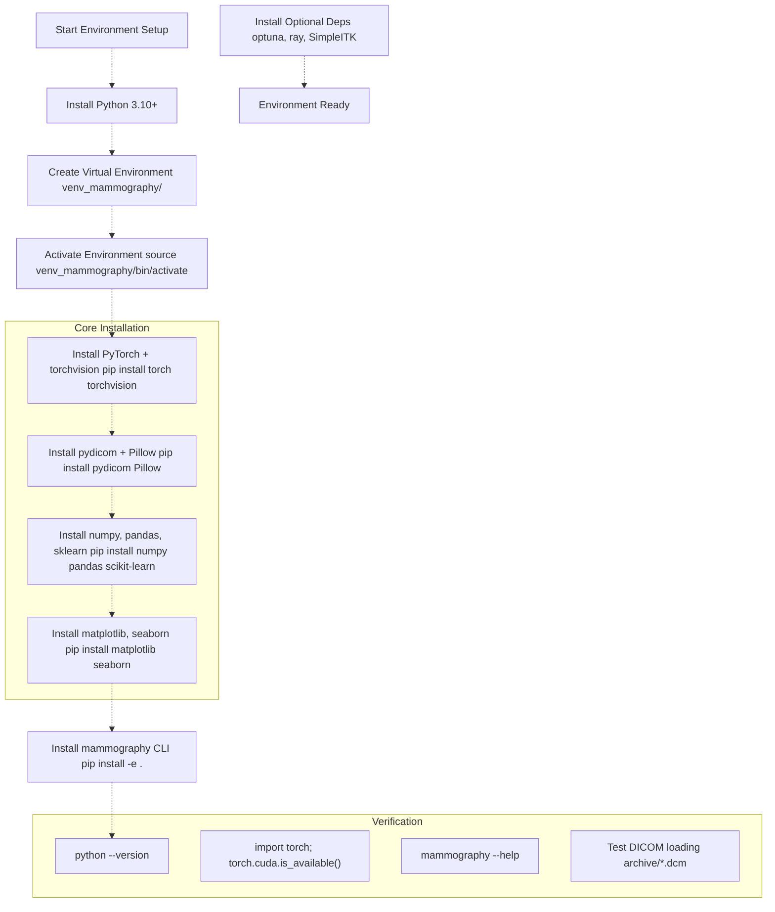
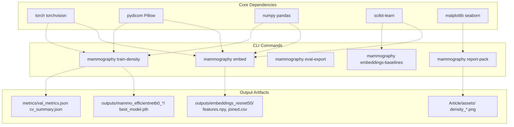

# Environment Setup

> **Relevant source files**
> * [Article/01-embeddings.md](https://github.com/ThalesMMS/mammography-pipelines/blob/01443313/Article/01-embeddings.md)
> * [Article/article.md](https://github.com/ThalesMMS/mammography-pipelines/blob/01443313/Article/article.md)

This page documents the software dependencies, Python environment configuration, and installation steps required to run the mammography-pipelines system. It covers Python version requirements, core ML libraries (PyTorch, torchvision), DICOM processing tools (pydicom), and optional components for hyperparameter optimization.

For information about Git repository configuration (`.gitignore`, `.gitattributes`), see [Git Configuration](9b%20Git-Configuration.md). For general repository structure and directory layout, see [Repository Structure](1b%20Repository-Structure.md).

---

## System Requirements

The mammography-pipelines system has the following minimum requirements:

| Component | Requirement | Notes |
| --- | --- | --- |
| **Python** | 3.11 or higher | Required for type hints and modern syntax |
| **Operating System** | Linux, macOS, Windows | Tested primarily on Linux |
| **RAM** | 16 GB minimum | 32 GB recommended for large batch sizes |
| **Storage** | 50 GB free space | For datasets, outputs, and model checkpoints |
| **GPU** | CUDA-compatible (optional) | Strongly recommended; speeds up training 10-50x |
| **CUDA** | 11.7+ (if using GPU) | Must match PyTorch CUDA version |

**Sources:** [Article/01-embeddings.md L17-L19](https://github.com/ThalesMMS/mammography-pipelines/blob/01443313/Article/01-embeddings.md#L17-L19)

---

## Core Python Dependencies

The system requires several core libraries organized by functional area:

### Deep Learning Framework



**Key Dependencies:**

* **torch** (≥2.0.0): Core tensor operations, autograd, GPU acceleration
* **torchvision** (≥0.15.0): Pretrained models (`resnet50`, `efficientnet_b0`), transforms
* Compatible CUDA version if using GPU (e.g., `torch+cu117` for CUDA 11.7)

**Sources:** [Article/article.md L53-L66](https://github.com/ThalesMMS/mammography-pipelines/blob/01443313/Article/article.md#L53-L66)

 [Article/01-embeddings.md L18](https://github.com/ThalesMMS/mammography-pipelines/blob/01443313/Article/01-embeddings.md#L18-L18)

### Medical Image Processing



**Key Dependencies:**

* **pydicom** (≥2.3.0): DICOM file parsing, metadata extraction
* **Pillow** (≥9.0.0): Image format conversion, preprocessing
* **SimpleITK** (optional): Advanced DICOM processing

**Sources:** [Article/article.md L35-L50](https://github.com/ThalesMMS/mammography-pipelines/blob/01443313/Article/article.md#L35-L50)

 [Article/01-embeddings.md L17](https://github.com/ThalesMMS/mammography-pipelines/blob/01443313/Article/01-embeddings.md#L17-L17)

### Data Science and Visualization

| Package | Version | Purpose | Used By |
| --- | --- | --- | --- |
| **numpy** | ≥1.23.0 | Array operations, `features.npy` storage | `mammography embed`, `train-density` |
| **pandas** | ≥1.5.0 | CSV parsing (`classificacao.csv`), `joined.csv` output | All CLI commands |
| **scikit-learn** | ≥1.2.0 | PCA, t-SNE, clustering metrics | `mammography embed`, `embeddings-baselines` |
| **matplotlib** | ≥3.6.0 | Training curves, confusion matrices | `mammography report-pack` |
| **seaborn** | ≥0.12.0 | Statistical visualizations | `mammography report-pack` |

**Sources:** [Article/01-embeddings.md L19](https://github.com/ThalesMMS/mammography-pipelines/blob/01443313/Article/01-embeddings.md#L19-L19)

 [Article/article.md L1-L30](https://github.com/ThalesMMS/mammography-pipelines/blob/01443313/Article/article.md#L1-L30)

### Hyperparameter Optimization (Optional)



**Key Dependencies:**

* **optuna** (≥3.0.0): Hyperparameter search, trial management
* **ray[tune]** (≥2.0.0): Distributed hyperparameter optimization

**Sources:** [Article/article.md L86-L124](https://github.com/ThalesMMS/mammography-pipelines/blob/01443313/Article/article.md#L86-L124)

---

## Python Environment Setup

### Method 1: Virtual Environment (Recommended)

Create an isolated Python environment to avoid dependency conflicts:

```sql
# Create virtual environmentpython3.10 -m venv venv_mammography# Activate (Linux/macOS)source venv_mammography/bin/activate# Activate (Windows)venv_mammography\Scripts\activate# Verify Python versionpython --version  # Should show 3.10.x or higher
```

**Important:** The repository `.gitignore` excludes `venv_*` directories, so your environment won't be committed to Git.

**Sources:** [Article/article.md L495-L507](https://github.com/ThalesMMS/mammography-pipelines/blob/01443313/Article/article.md#L495-L507)

### Method 2: Conda Environment (Alternative)

For users preferring Conda:

```sql
# Create environment with Python 3.10conda create -n mammography python=3.10# Activateconda activate mammography# Verifypython --version
```

---

## Dependency Installation

### Locked installs with uv (recommended)

Use the committed `uv.lock` for strict, repeatable dependency resolution:

```bash
pip install uv
uv sync --frozen
```

### Step 1: Install PyTorch (GPU-Accelerated)

Choose the appropriate command based on your CUDA version. Visit [https://pytorch.org/get-started/locally/](https://pytorch.org/get-started/locally/) for the latest instructions.

```
# CUDA 11.7 (most common)pip install torch torchvision --index-url https://download.pytorch.org/whl/cu117# CUDA 11.8pip install torch torchvision --index-url https://download.pytorch.org/whl/cu118# CPU-only (not recommended for training)pip install torch torchvision --index-url https://download.pytorch.org/whl/cpu
```

**Verify GPU availability:**

```python
python -c "import torch; print(f'CUDA available: {torch.cuda.is_available()}')"python -c "import torch; print(f'CUDA devices: {torch.cuda.device_count()}')"
```

**Sources:** [Article/article.md L114-L118](https://github.com/ThalesMMS/mammography-pipelines/blob/01443313/Article/article.md#L114-L118)

### Step 2: Install Core Dependencies

```
# DICOM processingpip install pydicom>=2.3.0 Pillow>=9.0.0# Data science stackpip install numpy>=1.23.0 pandas>=1.5.0 scikit-learn>=1.2.0# Visualizationpip install matplotlib>=3.6.0 seaborn>=0.12.0# Additional utilitiespip install tqdm  # Progress bars
```

**Sources:** [Article/01-embeddings.md L17-L19](https://github.com/ThalesMMS/mammography-pipelines/blob/01443313/Article/01-embeddings.md#L17-L19)

### Step 3: Install the Mammography CLI

Assuming the repository uses a `setup.py` or `pyproject.toml`:

```
# Install in editable mode (for development)pip install -e .# Verify installationmammography --help
```

The CLI should expose these commands:

* `mammography embed`
* `mammography train-density`
* `mammography eval-export`
* `mammography report-pack`
* `mammography embeddings-baselines`

---

## Docker (Portable Environment)

For a portable environment with system libraries (`gdcm`, `opencv`):

```bash
docker build -t mammography-pipelines .
docker run --rm -it -v "$PWD":/app -w /app mammography-pipelines
```

**Sources:** [Article/article.md L7-L14](https://github.com/ThalesMMS/mammography-pipelines/blob/01443313/Article/article.md#L7-L14)

 [Article/article.md L456-L491](https://github.com/ThalesMMS/mammography-pipelines/blob/01443313/Article/article.md#L456-L491)

### Step 4: Optional Dependencies

```
# Hyperparameter optimizationpip install optuna>=3.0.0 ray[tune]>=2.0.0# Advanced medical imagingpip install SimpleITK# Notebook supportpip install jupyter ipython# Additional dimensionality reductionpip install umap-learn  # For UMAP visualizations
```

**Sources:** [Article/article.md L86-L124](https://github.com/ThalesMMS/mammography-pipelines/blob/01443313/Article/article.md#L86-L124)

---

## Environment Configuration Flow



**Sources:** [Article/01-embeddings.md L16-L20](https://github.com/ThalesMMS/mammography-pipelines/blob/01443313/Article/01-embeddings.md#L16-L20)

 [Article/article.md L456-L491](https://github.com/ThalesMMS/mammography-pipelines/blob/01443313/Article/article.md#L456-L491)

---

## Verification Checklist

After installation, verify your environment using these checks:

### 1. Python Version Check

```
python --version# Expected: Python 3.10.x or higher
```

### 2. PyTorch Installation

```python
python -c "import torch; print(f'PyTorch version: {torch.__version__}')"python -c "import torchvision; print(f'torchvision version: {torchvision.__version__}')"
```

### 3. GPU Availability (if applicable)

```python
python -c "import torch; print(f'CUDA available: {torch.cuda.is_available()}')"python -c "import torch; print(f'Device name: {torch.cuda.get_device_name(0) if torch.cuda.is_available() else \"CPU\"}')"
```

Expected output (GPU):

```
CUDA available: True
Device name: NVIDIA GeForce RTX 3090
```

### 4. DICOM Processing

```python
python -c "import pydicom; print(f'pydicom version: {pydicom.__version__}')"
```

### 5. CLI Installation

```
mammography --helpmammography embed --helpmammography train-density --help
```

Expected output: Usage information for each command.

### 6. Model Loading Test

```python
python -c "from torchvision.models import resnet50, efficientnet_b0; print('Models loaded successfully')"
```

**Sources:** [Article/01-embeddings.md L16-L20](https://github.com/ThalesMMS/mammography-pipelines/blob/01443313/Article/01-embeddings.md#L16-L20)

---

## Dependency-to-Component Mapping

This diagram shows how each dependency maps to system components:



**Sources:** [Article/article.md L1-L30](https://github.com/ThalesMMS/mammography-pipelines/blob/01443313/Article/article.md#L1-L30)

 [Article/01-embeddings.md L1-L30](https://github.com/ThalesMMS/mammography-pipelines/blob/01443313/Article/01-embeddings.md#L1-L30)

---

## GPU Configuration (CUDA)

### CUDA Compatibility

The system uses PyTorch's CUDA backend for GPU acceleration. Ensure your CUDA version matches PyTorch:

| PyTorch Version | CUDA Version | Installation Command |
| --- | --- | --- |
| 2.0.x | 11.7 | `pip install torch torchvision --index-url https://download.pytorch.org/whl/cu117` |
| 2.0.x | 11.8 | `pip install torch torchvision --index-url https://download.pytorch.org/whl/cu118` |
| 2.1.x+ | 12.1 | `pip install torch torchvision --index-url https://download.pytorch.org/whl/cu121` |

Check your CUDA version:

```
nvidia-smi  # Look for "CUDA Version: X.X"nvcc --version  # Compiler version (may differ from runtime)
```

### Mixed Precision Training

The system supports Automatic Mixed Precision (AMP) for faster training:

```
# AMP is enabled in training loop automatically when GPU is available# Uses torch.cuda.amp.GradScaler and torch.cuda.amp.autocast
```

This reduces memory usage and increases throughput by ~2x on modern GPUs (Volta, Turing, Ampere).

**Sources:** [Article/article.md L114-L118](https://github.com/ThalesMMS/mammography-pipelines/blob/01443313/Article/article.md#L114-L118)

---

## Directory Structure After Setup

After completing environment setup, your directory structure should look like:

```markdown
mammography-pipelines/
├── venv_mammography/          # Virtual environment (excluded by .gitignore)
├── src/
│   └── mammography/          # Source code (to be installed)
├── outputs/                  # Created on first run
├── archive/                  # DICOM data (must be provided separately)
│   ├── AccessionNumber1/
│   │   ├── image1.dcm
│   │   └── image2.dcm
│   └── ...
├── classificacao.csv         # Metadata file (must be provided)
└── Article/                  # Documentation
```

**Note:** The `archive/` directory and `classificacao.csv` file are **not included in the repository**. You must obtain the DICOM dataset separately. See [DICOM Datasets](4a%20DICOM-Datasets.md) for expected structure.

**Sources:** [Article/article.md L495-L507](https://github.com/ThalesMMS/mammography-pipelines/blob/01443313/Article/article.md#L495-L507)

 [Article/01-embeddings.md L17](https://github.com/ThalesMMS/mammography-pipelines/blob/01443313/Article/01-embeddings.md#L17-L17)

---

## Common Installation Issues

### Issue 1: CUDA Version Mismatch

**Symptom:**

```yaml
RuntimeError: CUDA version mismatch: PyTorch was compiled with CUDA X.X but system has Y.Y
```

**Solution:**
Reinstall PyTorch with the correct CUDA version:

```
pip uninstall torch torchvisionpip install torch torchvision --index-url https://download.pytorch.org/whl/cu117  # Adjust version
```

### Issue 2: DICOM Loading Errors

**Symptom:**

```
pydicom.errors.InvalidDicomError: File is missing DICOM File Meta Information
```

**Solution:**
Ensure DICOM files are valid and readable. The system requires ≥95% of files to be valid:

```
# Test DICOM filepython -c "import pydicom; pydicom.dcmread('archive/AccessionNumber/image.dcm')"
```

**Sources:** [Article/01-embeddings.md L17](https://github.com/ThalesMMS/mammography-pipelines/blob/01443313/Article/01-embeddings.md#L17-L17)

### Issue 3: Out of Memory (OOM)

**Symptom:**

```yaml
RuntimeError: CUDA out of memory. Tried to allocate X MiB
```

**Solution:**
Reduce batch size:

```
mammography train-density --batch-size 8  # Default is 16
```

Or use CPU-only mode:

```
export CUDA_VISIBLE_DEVICES=""  # Force CPU usage
```

**Sources:** [Article/article.md L129-L139](https://github.com/ThalesMMS/mammography-pipelines/blob/01443313/Article/article.md#L129-L139)

### Issue 4: Import Errors After Installation

**Symptom:**

```yaml
ModuleNotFoundError: No module named 'mammography'
```

**Solution:**
Ensure you installed in editable mode and activated the environment:

```
source venv_mammography/bin/activatepip install -e .
```

---

## Environment Variables

The system respects these environment variables:

| Variable | Purpose | Example |
| --- | --- | --- |
| `CUDA_VISIBLE_DEVICES` | Restrict GPU usage | `export CUDA_VISIBLE_DEVICES=0,1` |
| `OMP_NUM_THREADS` | CPU thread count | `export OMP_NUM_THREADS=8` |
| `TORCH_HOME` | Model cache location | `export TORCH_HOME=/data/torch_cache` |
| `TMPDIR` | Temporary file location | `export TMPDIR=/scratch/tmp` |

**Sources:** [Article/article.md L114-L118](https://github.com/ThalesMMS/mammography-pipelines/blob/01443313/Article/article.md#L114-L118)

---

## Next Steps

After completing environment setup:

1. **Verify data availability**: Ensure `archive/` contains DICOM files and `classificacao.csv` exists. See [DICOM Datasets](4a%20DICOM-Datasets.md).
2. **Run embedding extraction**: Test your setup with a quick embedding run: ``` mammography embed --csv classificacao.csv --dicom-root archive --outdir outputs/test_embed ``` See [mammography embed](2a%20mammography-embed.md) for full command reference.
3. **Review training options**: Familiarize yourself with training parameters. See [mammography train-density](2b%20mammography-train-density.md).
4. **Check reproducibility settings**: Understand seed management. See [Random Seeds and Variability](6a%20Random-Seeds-and-Variability.md).

**Sources:** [Article/01-embeddings.md L7-L14](https://github.com/ThalesMMS/mammography-pipelines/blob/01443313/Article/01-embeddings.md#L7-L14)

 [Article/article.md L456-L491](https://github.com/ThalesMMS/mammography-pipelines/blob/01443313/Article/article.md#L456-L491)


### On this page

* [Environment Setup](#9.1-environment-setup)
* [System Requirements](#9.1-system-requirements)
* [Core Python Dependencies](#9.1-core-python-dependencies)
* [Deep Learning Framework](#9.1-deep-learning-framework)
* [Medical Image Processing](#9.1-medical-image-processing)
* [Data Science and Visualization](#9.1-data-science-and-visualization)
* [Hyperparameter Optimization (Optional)](#9.1-hyperparameter-optimization-optional)
* [Python Environment Setup](#9.1-python-environment-setup)
* [Method 1: Virtual Environment (Recommended)](#9.1-method-1-virtual-environment-recommended)
* [Method 2: Conda Environment (Alternative)](#9.1-method-2-conda-environment-alternative)
* [Dependency Installation](#9.1-dependency-installation)
* [Step 1: Install PyTorch (GPU-Accelerated)](#9.1-step-1-install-pytorch-gpu-accelerated)
* [Step 2: Install Core Dependencies](#9.1-step-2-install-core-dependencies)
* [Step 3: Install the Mammography CLI](#9.1-step-3-install-the-mammography-cli)
* [Step 4: Optional Dependencies](#9.1-step-4-optional-dependencies)
* [Environment Configuration Flow](#9.1-environment-configuration-flow)
* [Verification Checklist](#9.1-verification-checklist)
* [1. Python Version Check](#9.1-1-python-version-check)
* [2. PyTorch Installation](#9.1-2-pytorch-installation)
* [3. GPU Availability (if applicable)](#9.1-3-gpu-availability-if-applicable)
* [4. DICOM Processing](#9.1-4-dicom-processing)
* [5. CLI Installation](#9.1-5-cli-installation)
* [6. Model Loading Test](#9.1-6-model-loading-test)
* [Dependency-to-Component Mapping](#9.1-dependency-to-component-mapping)
* [GPU Configuration (CUDA)](#9.1-gpu-configuration-cuda)
* [CUDA Compatibility](#9.1-cuda-compatibility)
* [Mixed Precision Training](#9.1-mixed-precision-training)
* [Directory Structure After Setup](#9.1-directory-structure-after-setup)
* [Common Installation Issues](#9.1-common-installation-issues)
* [Issue 1: CUDA Version Mismatch](#9.1-issue-1-cuda-version-mismatch)
* [Issue 2: DICOM Loading Errors](#9.1-issue-2-dicom-loading-errors)
* [Issue 3: Out of Memory (OOM)](#9.1-issue-3-out-of-memory-oom)
* [Issue 4: Import Errors After Installation](#9.1-issue-4-import-errors-after-installation)
* [Environment Variables](#9.1-environment-variables)
* [Next Steps](#9.1-next-steps)

Ask Devin about mammography-pipelines
