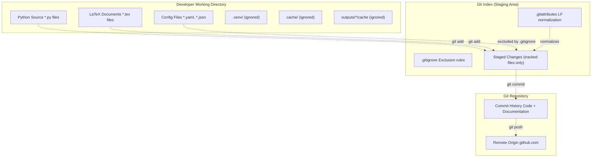

# Git Configuration

> **Relevant source files**
> * [.gitattributes](https://github.com/ThalesMMS/mammography-pipelines/blob/01443313/.gitattributes)
> * [.gitignore](https://github.com/ThalesMMS/mammography-pipelines/blob/01443313/.gitignore)

This document explains the Git configuration files that manage version control behavior for the mammography-pipelines repository. These configuration files ensure consistent line ending handling across platforms and prevent unnecessary or sensitive files from being tracked in version control.

For information about project dependencies and development tools, see [Project Dependencies](9a%20Environment-Setup.md). For details about the output directory structure referenced in `.gitignore`, see [Output Directory Structure](6b%20Output-Directory-Structure.md).

## Overview

The repository uses two Git configuration files:

* `.gitattributes` - Controls line ending normalization for text files
* `.gitignore` - Specifies intentionally untracked files and directories

These configurations are essential for:

* Cross-platform collaboration (Windows, Linux, macOS)
* Preventing large binary artifacts from being committed
* Excluding temporary and generated files
* Maintaining repository cleanliness

## Line Ending Normalization

The `.gitattributes` file configures Git to handle line endings consistently across different operating systems.

```
* text=auto
```

This configuration:

* **Automatic detection**: Git automatically identifies text files vs binary files
* **Normalization**: Text files are normalized to LF (Line Feed, `\n`) in the repository
* **Platform-specific checkout**: Text files are checked out with the appropriate line ending for the platform (CRLF on Windows, LF on Unix-based systems)

This prevents line ending conflicts when collaborating across Windows and Unix-based systems, particularly important for Python source files, LaTeX documents, and shell scripts in the repository.

**Sources:** [.gitattributes L1-L3](https://github.com/ThalesMMS/mammography-pipelines/blob/01443313/.gitattributes#L1-L3)

## Ignore Patterns

The `.gitignore` file prevents Git from tracking specific files and directories. The patterns are organized into several categories based on their purpose.

### Ignore Pattern Categories

```mermaid
flowchart TD

gitignore[".gitignore"]
pycache["pycache/"]
pyc["*.py[cod]"]
venv[".venv, venv/, ENV/"]
eggs["*.egg-info/"]
pytest[".pytest_cache/"]
coverage[".coverage, htmlcov/"]
tox[".tox/, .nox/"]
vscode[".vscode/settings.json"]
cursor[".cursorignore"]
pypirc[".pypirc"]
ruff[".ruff_cache/"]
outputs["/outputs/**/cache"]
archive["/archive, /archive_augmented"]
weights["weights/medicalnet/resnet_50.pth"]
models["resnet50.pth"]
logs["*.log"]
manifest["*.manifest"]
compiled["*.so, *.egg"]

gitignore -.-> pycache
gitignore -.-> pyc
gitignore -.-> venv
gitignore -.-> pytest
gitignore -.-> coverage
gitignore -.-> vscode
gitignore -.-> cursor
gitignore -.-> outputs
gitignore -.-> archive
gitignore -.-> weights
gitignore -.-> logs
gitignore -.-> compiled

subgraph subGraph4 ["Generated Files"]
    logs
    manifest
    compiled
end

subgraph subGraph3 ["ML Artifacts"]
    outputs
    archive
    weights
    models
end

subgraph subGraph2 ["IDE & Tools"]
    vscode
    cursor
    pypirc
    ruff
end

subgraph subGraph1 ["Testing & Coverage"]
    pytest
    coverage
    tox
end

subgraph subGraph0 ["Standard Python Patterns"]
    pycache
    pyc
    venv
    eggs
end
```



**Sources:** [.gitignore L1-L212](https://github.com/ThalesMMS/mammography-pipelines/blob/01443313/.gitignore#L1-L212)

### Python Development Patterns

The repository uses standard Python `.gitignore` patterns to exclude compiled bytecode, virtual environments, and distribution artifacts.

| Pattern Category | Example Patterns | Purpose |
| --- | --- | --- |
| Compiled Files | `__pycache__/`, `*.py[cod]`, `*$py.class` | Exclude Python bytecode |
| Virtual Environments | `.venv`, `venv/`, `ENV/`, `env.bak/` | Exclude isolated Python environments |
| Distribution | `build/`, `dist/`, `*.egg-info/`, `wheels/` | Exclude packaging artifacts |
| C Extensions | `*.so` | Exclude compiled shared libraries |

These patterns prevent platform-specific and regenerable files from cluttering the repository. Virtual environments are particularly important to exclude as they can contain thousands of files and vary by platform.

**Sources:** [.gitignore L1-L27](https://github.com/ThalesMMS/mammography-pipelines/blob/01443313/.gitignore#L1-L27)

 [.gitignore L130-L137](https://github.com/ThalesMMS/mammography-pipelines/blob/01443313/.gitignore#L130-L137)

### Testing and Coverage Artifacts

Test execution and coverage reporting generate numerous temporary files that should not be tracked.

| Pattern | Tool | Description |
| --- | --- | --- |
| `.pytest_cache/` | pytest | Test discovery and execution cache |
| `.coverage`, `.coverage.*` | coverage.py | Coverage data files |
| `htmlcov/` | coverage.py | HTML coverage reports |
| `.tox/`, `.nox/` | tox, nox | Test environment management |
| `.hypothesis/` | hypothesis | Property-based testing cache |
| `nosetests.xml`, `coverage.xml` | Various | XML test/coverage reports |

**Sources:** [.gitignore L39-L52](https://github.com/ThalesMMS/mammography-pipelines/blob/01443313/.gitignore#L39-L52)

### IDE and Tool Configuration

The repository excludes IDE-specific settings and tool caches to prevent personal development environment preferences from affecting collaborators.

```
.vscode/settings.json
.cursorignore
.cursorindexingignore
.ruff_cache/
.pypirc
.DS_Store
```

Notable exclusions:

* **`.vscode/settings.json`**: Visual Studio Code workspace settings
* **`.cursorignore`**: Configuration for Cursor AI-powered editor to exclude files from AI analysis
* **`.ruff_cache/`**: Cache for the Ruff Python linter
* **`.DS_Store`**: macOS Finder metadata files
* **`.pypirc`**: PyPI credentials (security-sensitive)

**Sources:** [.gitignore L170-L190](https://github.com/ThalesMMS/mammography-pipelines/blob/01443313/.gitignore#L170-L190)

### Machine Learning Artifacts

This category contains project-specific patterns for large binary files and generated ML artifacts.

```mermaid
flowchart TD

mlartifacts["ML Artifacts (.gitignore)"]
archive["/archive DICOM images"]
archive_aug["/archive_augmented Augmented datasets"]
archive_png["/archive_png PNG conversions"]
patches_aug["/patches_completo_augmented Patch datasets"]
resnet["resnet50.pth ImageNet weights"]
medicalnet["weights/medicalnet/resnet_50.pth MedicalNet pretrained"]
cache1["/outputs/mammo_efficientnetb0_density/cache"]
cache2["/outputs/density_experiments/results_k3_seed42/cache"]
cache3["/outputs/density_experiments/results_k3_seed42/fold_*/cache"]
venv_gpu["/venv_gpu_5080 /venv_cuda"]

mlartifacts -.-> archive
mlartifacts -.-> archive_aug
mlartifacts -.-> resnet
mlartifacts -.-> medicalnet
mlartifacts -.-> cache1
mlartifacts -.-> cache2
mlartifacts -.-> cache3
mlartifacts -.-> venv_gpu

subgraph subGraph2 ["Output Caches"]
    cache1
    cache2
    cache3
    venv_gpu
end

subgraph subGraph1 ["Model Weights"]
    resnet
    medicalnet
end

subgraph subGraph0 ["Data Directories"]
    archive
    archive_aug
    archive_png
    patches_aug
end
```



**Sources:** [.gitignore L182-L212](https://github.com/ThalesMMS/mammography-pipelines/blob/01443313/.gitignore#L182-L212)

### Cache Directories

The pipeline generates preprocessed data caches to optimize I/O performance. These are intentionally excluded because they can be regenerated from source DICOM files.

| Directory Pattern | Purpose |
| --- | --- |
| `/outputs/mammo_efficientnetb0_density/cache` | Cached preprocessed images for EfficientNetB0 training |
| `/outputs/density_experiments/results_k3_seed42/cache_shared` | Shared cache across cross-validation folds |
| `/outputs/density_experiments/results_k3_seed42/fold_*/cache` | Per-fold cache directories (folds 1-3) |
| `/outputs/density_experiments/results_k_seed42/fold_*/cache` | Per-fold cache for 5-fold experiments |

These cache directories can contain hundreds of preprocessed `.pt` files and consume significant disk space. Excluding them prevents repository bloat while maintaining fast data loading for researchers who have already generated the caches locally.

**Sources:** [.gitignore L191-L211](https://github.com/ThalesMMS/mammography-pipelines/blob/01443313/.gitignore#L191-L211)

### Dataset Directories

Large DICOM image archives are stored locally but not tracked in version control due to their size and licensing constraints.

| Directory | Contents | Typical Size |
| --- | --- | --- |
| `/archive` | Original DICOM files (IRMA/RSNA datasets) | Multiple GB |
| `/archive_augmented` | Augmented versions of DICOM archives | Multiple GB |
| `/archive_png` | PNG conversions of DICOM files | Multiple GB |
| `/patches_completo_augmented` | Augmented image patches | Multiple GB |
| `/mamografias_augmented` | Augmented mammography images | Multiple GB |

These directories are referenced by the pipeline through the `--dicom-root` parameter but must be obtained separately (see [DICOM Datasets](4a%20DICOM-Datasets.md)).

**Sources:** [.gitignore L182](https://github.com/ThalesMMS/mammography-pipelines/blob/01443313/.gitignore#L182-L182)

 [.gitignore L207-L210](https://github.com/ThalesMMS/mammography-pipelines/blob/01443313/.gitignore#L207-L210)

### Model Weight Files

Pretrained model weights are excluded because they are large binary files that can be downloaded from public sources.

```
resnet50.pth
weights/medicalnet/resnet_50.pth
```

* **`resnet50.pth`**: ImageNet-pretrained ResNet50 weights (~100 MB)
* **`weights/medicalnet/resnet_50.pth`**: MedicalNet pretrained weights for medical imaging

These weights are automatically downloaded or must be obtained manually as described in [Getting Started](1a%20Getting-Started.md).

**Sources:** [.gitignore L184](https://github.com/ThalesMMS/mammography-pipelines/blob/01443313/.gitignore#L184-L184)

 [.gitignore L211](https://github.com/ThalesMMS/mammography-pipelines/blob/01443313/.gitignore#L211-L211)

## Git Workflow Integration

The configuration files integrate with the standard Git workflow as shown below:



**Sources:** [.gitattributes L1-L3](https://github.com/ThalesMMS/mammography-pipelines/blob/01443313/.gitattributes#L1-L3)

 [.gitignore L1-L212](https://github.com/ThalesMMS/mammography-pipelines/blob/01443313/.gitignore#L1-L212)

## Tracked vs Ignored Files

### Files Tracked in Version Control

The following file types **are** tracked and should be committed:

| File Type | Examples | Rationale |
| --- | --- | --- |
| Source Code | `*.py` files in `mammography/` | Core implementation |
| Configuration | `*.yaml`, `*.json` (not outputs) | Reproducible settings |
| LaTeX Documents | `Article/*.tex`, `Article/*.bib` | Research documentation |
| Metadata | `classificacao.csv` | Dataset annotations |
| CLI Entry Points | `mammography` (executable script) | User interface |
| Build Scripts | `Makefile`, `setup.py` | Build automation |
| Documentation | `README.md`, `AGENTS.md` | Project guides |

### Files Excluded from Version Control

The following file types **are not** tracked and should never be committed:

| File Type | Examples | Rationale |
| --- | --- | --- |
| Binary Datasets | `archive/*.dcm` | Size constraints |
| Model Weights | `*.pth`, `*.pt` model files | Downloadable from public sources |
| Preprocessed Caches | `cache/*.pt` | Regenerable from DICOM |
| Training Outputs | `outputs/*/best_model.pt` | Experiment artifacts |
| Virtual Environments | `.venv/`, `venv/` | Platform-specific |
| Compiled Bytecode | `__pycache__/` | Auto-generated |
| IDE Settings | `.vscode/settings.json` | Personal preferences |

**Sources:** [.gitignore L1-L212](https://github.com/ThalesMMS/mammography-pipelines/blob/01443313/.gitignore#L1-L212)

## Platform-Specific Considerations

### Cross-Platform Line Endings

The `.gitattributes` configuration ensures consistent behavior across platforms:

| Platform | Local Files | Repository | Checkout Behavior |
| --- | --- | --- | --- |
| Windows | CRLF (`\r\n`) | LF (`\n`) | Auto-convert to CRLF |
| Linux | LF (`\n`) | LF (`\n`) | No conversion |
| macOS | LF (`\n`) | LF (`\n`) | No conversion |

This prevents "phantom" line ending changes in diffs and merge conflicts.

**Sources:** [.gitattributes L1-L3](https://github.com/ThalesMMS/mammography-pipelines/blob/01443313/.gitattributes#L1-L3)

### Platform-Specific Ignored Files

The `.gitignore` includes patterns for platform-specific files:

| Pattern | Platform | Description |
| --- | --- | --- |
| `.DS_Store` | macOS | Finder metadata |
| `Thumbs.db` | Windows | Thumbnail cache (standard pattern) |
| `.venv/`, `venv/` | All | Virtual environment directories |

**Sources:** [.gitignore L183](https://github.com/ThalesMMS/mammography-pipelines/blob/01443313/.gitignore#L183-L183)

## Special Project Exclusions

Beyond standard Python patterns, the repository includes several project-specific exclusions:

```
.codex
AGENTS.md
.specify
/venv_gpu_5080
/venv_cuda
```

These exclusions handle:

* **`.codex`**: AI coding assistant metadata
* **`AGENTS.md`**: Internal agent configuration (excluded to prevent conflicts)
* **`.specify`**: Project specification files
* **`/venv_gpu_5080`**, **`/venv_cuda`**: GPU-specific virtual environments with CUDA dependencies

The GPU-specific virtual environments are excluded because CUDA dependencies are platform-specific and can be large (several GB).

**Sources:** [.gitignore L187-L189](https://github.com/ThalesMMS/mammography-pipelines/blob/01443313/.gitignore#L187-L189)

 [.gitignore L185-L186](https://github.com/ThalesMMS/mammography-pipelines/blob/01443313/.gitignore#L185-L186)

## Verification Commands

To verify Git configuration is working correctly:

```
# Check which files are ignoredgit status --ignored# Test if a specific file would be ignoredgit check-ignore -v path/to/file# View line ending configurationgit config core.autocrlf# See actual line endings in a filefile path/to/file.py# Force re-normalization of all tracked filesgit add --renormalize .
```

## Best Practices

When working with this repository:

1. **Never commit large binary files**: The `.gitignore` is configured to prevent this, but always verify with `git status` before committing
2. **Regenerate caches locally**: Cache directories are excluded; use the appropriate CLI commands to regenerate them
3. **Download pretrained weights separately**: Model weight files are not tracked; obtain them as described in [Getting Started](1a%20Getting-Started.md)
4. **Respect IDE settings exclusions**: Personal IDE settings should remain local
5. **Check before adding new output patterns**: If creating new output directories, add appropriate patterns to `.gitignore`

**Sources:** [.gitignore L182-L212](https://github.com/ThalesMMS/mammography-pipelines/blob/01443313/.gitignore#L182-L212)

 [.gitattributes L1-L3](https://github.com/ThalesMMS/mammography-pipelines/blob/01443313/.gitattributes#L1-L3)


### On this page

* [Git Configuration](#9.2-git-configuration)
* [Overview](#9.2-overview)
* [Line Ending Normalization](#9.2-line-ending-normalization)
* [Ignore Patterns](#9.2-ignore-patterns)
* [Ignore Pattern Categories](#9.2-ignore-pattern-categories)
* [Python Development Patterns](#9.2-python-development-patterns)
* [Testing and Coverage Artifacts](#9.2-testing-and-coverage-artifacts)
* [IDE and Tool Configuration](#9.2-ide-and-tool-configuration)
* [Machine Learning Artifacts](#9.2-machine-learning-artifacts)
* [Cache Directories](#9.2-cache-directories)
* [Dataset Directories](#9.2-dataset-directories)
* [Model Weight Files](#9.2-model-weight-files)
* [Git Workflow Integration](#9.2-git-workflow-integration)
* [Tracked vs Ignored Files](#9.2-tracked-vs-ignored-files)
* [Files Tracked in Version Control](#9.2-files-tracked-in-version-control)
* [Files Excluded from Version Control](#9.2-files-excluded-from-version-control)
* [Platform-Specific Considerations](#9.2-platform-specific-considerations)
* [Cross-Platform Line Endings](#9.2-cross-platform-line-endings)
* [Platform-Specific Ignored Files](#9.2-platform-specific-ignored-files)
* [Special Project Exclusions](#9.2-special-project-exclusions)
* [Verification Commands](#9.2-verification-commands)
* [Best Practices](#9.2-best-practices)

Ask Devin about mammography-pipelines