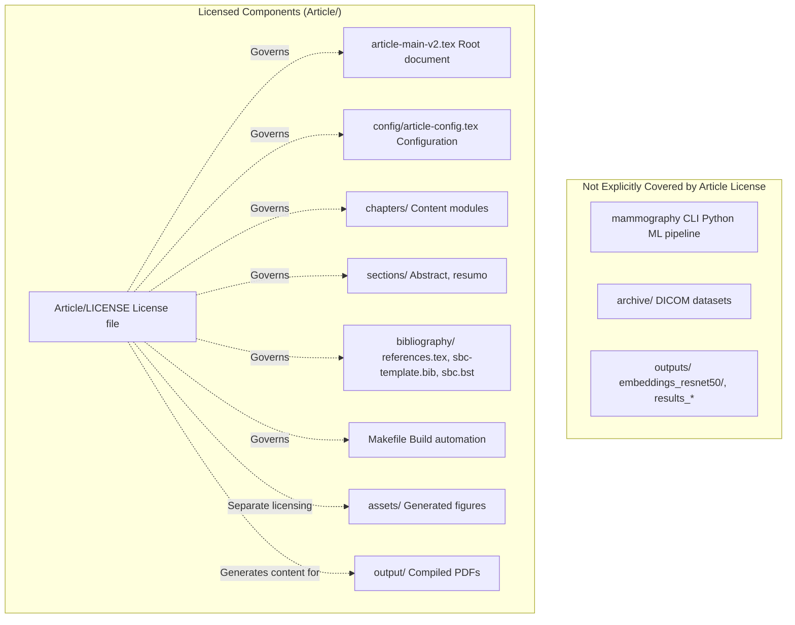
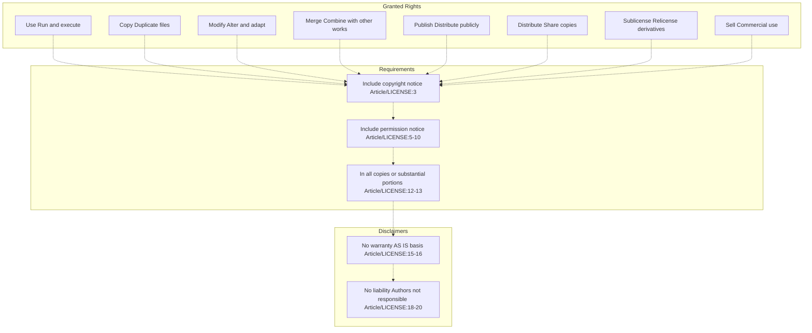
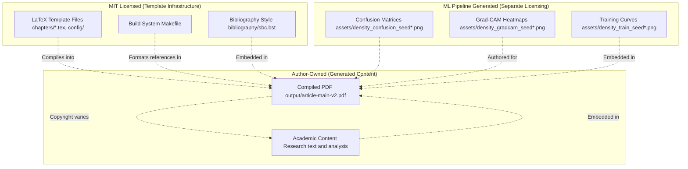

# License

> **Relevant source files**
> * [Article/LICENSE](https://github.com/ThalesMMS/mammography-pipelines/blob/01443313/Article/LICENSE)

This page documents the licensing terms for the Article component of the mammography-pipelines repository. The Article subsystem, which contains LaTeX templates and academic documentation infrastructure, is released under the MIT License.

For information about development environment setup, see [Environment Setup](9a%20Environment-Setup.md). For repository-wide file organization conventions, see [Repository Structure](1b%20Repository-Structure.md).

---

## Purpose and Scope

The MIT License applies specifically to the **Article/** directory and its contents, which includes the LaTeX article generation system documented in [Article Documentation System](8%20Article-Documentation-System.md). This license governs the reuse, modification, and distribution of the LaTeX template infrastructure, build scripts, and associated configuration files.

**Sources:** [Article/LICENSE L1-L23](https://github.com/ThalesMMS/mammography-pipelines/blob/01443313/Article/LICENSE#L1-L23)

---

## License Overview

The Article component is licensed under the MIT License, one of the most permissive open-source licenses.

| Property | Value |
| --- | --- |
| **License Type** | MIT License |
| **Copyright Holder** | Thales Matheus Mendonça Santos |
| **Copyright Year** | 2025 |
| **File Location** | [Article/LICENSE](https://github.com/ThalesMMS/mammography-pipelines/blob/01443313/Article/LICENSE) |

### Covered Components



**Diagram:** Scope of MIT License coverage within the repository structure

The MIT License explicitly covers the LaTeX template system located in the `Article/` directory. Machine learning code in the `mammography` CLI and associated Python modules have separate (or no explicit) licensing terms.

**Sources:** [Article/LICENSE L1-L23](https://github.com/ThalesMMS/mammography-pipelines/blob/01443313/Article/LICENSE#L1-L23)

---

## License Terms

The MIT License grants broad permissions while providing minimal warranty. The full text is located in [Article/LICENSE L1-L23](https://github.com/ThalesMMS/mammography-pipelines/blob/01443313/Article/LICENSE#L1-L23)

### Key Provisions



**Diagram:** MIT License permission flow and requirements chain

#### Permissions Granted

The license grants, without charge, the rights to:

* **Use** the Article template system for any purpose
* **Copy** and distribute the LaTeX files
* **Modify** the template structure, styling, and content
* **Merge** with other LaTeX projects or academic templates
* **Publish** derived works based on the template
* **Sublicense** modified versions under different terms
* **Sell** commercial products built using the template

**Sources:** [Article/LICENSE L5-L10](https://github.com/ThalesMMS/mammography-pipelines/blob/01443313/Article/LICENSE#L5-L10)

#### Mandatory Conditions

Users must:

1. Include the copyright notice: "Copyright (c) 2025 Thales Matheus Mendonça Santos"
2. Include the full permission notice from the MIT License
3. Apply these notices to "all copies or substantial portions of the Software"

**Sources:** [Article/LICENSE L12-L13](https://github.com/ThalesMMS/mammography-pipelines/blob/01443313/Article/LICENSE#L12-L13)

#### Warranty Disclaimers

The license provides **no warranty** of any kind:

* No guarantee of **merchantability** (fitness for commercial use)
* No guarantee of **fitness for a particular purpose**
* No guarantee of **non-infringement** of third-party rights
* The software is provided **"AS IS"**

**Sources:** [Article/LICENSE L15-L17](https://github.com/ThalesMMS/mammography-pipelines/blob/01443313/Article/LICENSE#L15-L17)

#### Liability Limitations

The copyright holder and authors are **not liable** for:

* **Claims** arising from software use
* **Damages** (direct, indirect, special, incidental, or consequential)
* Any liability arising from **contract, tort, or other legal theory**

This protection applies whether the author was aware of the possibility of such damages.

**Sources:** [Article/LICENSE L18-L21](https://github.com/ThalesMMS/mammography-pipelines/blob/01443313/Article/LICENSE#L18-L21)

---

## Practical Implications

The following table summarizes common use cases and their permissions under the MIT License:

| Use Case | Permitted? | Requirements |
| --- | --- | --- |
| Use template for academic paper | ✓ Yes | Include license in project |
| Modify Makefile for custom build | ✓ Yes | Include license in modified version |
| Create commercial template product | ✓ Yes | Include license, can charge for derivative |
| Remove copyright notice | ✗ No | Copyright notice is mandatory |
| Claim warranty from author | ✗ No | License explicitly disclaims warranty |
| Integrate into closed-source project | ✓ Yes | MIT allows proprietary derivatives |
| Distribute without license text | ✗ No | License text must accompany distribution |
| Sue author for template bugs | ✗ No | License disclaims all liability |

### Integration with Other Projects

When integrating the Article template into other projects:

1. **Preserve License File**: Copy [Article/LICENSE](https://github.com/ThalesMMS/mammography-pipelines/blob/01443313/Article/LICENSE)  to the derivative work
2. **Maintain Attribution**: Keep the copyright notice visible
3. **Document Modifications**: Not required by MIT, but recommended for traceability
4. **Choose Derivative License**: Can relicense under more restrictive terms (GPL, proprietary) or keep MIT

### Relationship to Generated Outputs

The MIT License governs the **template infrastructure** (LaTeX source files, build scripts) but does **not** automatically extend to:

* **Generated PDFs** in `output/` (authors retain copyright over their academic content)
* **ML-generated figures** in `assets/` (depend on the ML pipeline licensing)
* **Research data** referenced by the article (separate data licenses apply)



**Diagram:** Licensing boundaries between template infrastructure and generated content

**Sources:** [Article/LICENSE L1-L23](https://github.com/ThalesMMS/mammography-pipelines/blob/01443313/Article/LICENSE#L1-L23)

---

## File Location and Format

The license file follows standard open-source conventions:

```markdown
Article/
├── LICENSE                    # MIT License full text
├── article-main-v2.tex       # Licensed LaTeX template
├── Makefile                  # Licensed build automation
├── config/
│   └── article-config.tex    # Licensed configuration
├── chapters/                 # Licensed content structure
├── sections/                 # Licensed document sections
└── bibliography/             # Licensed bibliography system
```

### File Characteristics

| Property | Value |
| --- | --- |
| **File Path** | [Article/LICENSE](https://github.com/ThalesMMS/mammography-pipelines/blob/01443313/Article/LICENSE) |
| **Format** | Plain text |
| **Line Count** | 23 lines |
| **Character Encoding** | UTF-8 |
| **Line Endings** | Unix (LF) |

The license file can be read programmatically or displayed in repository documentation systems (GitHub, GitLab, etc.) which automatically recognize `LICENSE` files at the root of directories.

**Sources:** [Article/LICENSE L1-L23](https://github.com/ThalesMMS/mammography-pipelines/blob/01443313/Article/LICENSE#L1-L23)

---

## Verification and Compliance

### Checking License Presence

To verify the license is properly included when distributing the Article template:

```
# Check if LICENSE file existsls Article/LICENSE# Display license contentcat Article/LICENSE# Verify copyright year and holderhead -n 5 Article/LICENSE | grep "Copyright"
```

### Compliance Checklist

When using or distributing the Article template:

* `Article/LICENSE` file is included in distribution
* Copyright notice remains intact (line 3)
* Permission notice is complete (lines 5-21)
* Modifications (if any) are clearly documented
* Users are aware of "AS IS" warranty disclaimer

### Attribution Example

When creating derivative works, include attribution such as:

```
% In your LaTeX source file:% This document uses the LaTeX template from:% mammography-pipelines (https://github.com/ThalesMMS/mammography-pipelines)% Copyright (c) 2025 Thales Matheus Mendonça Santos% Licensed under the MIT License
```

**Sources:** [Article/LICENSE L1-L23](https://github.com/ThalesMMS/mammography-pipelines/blob/01443313/Article/LICENSE#L1-L23)

---

## Comparison with Other Licenses

The MIT License was chosen for the Article component due to its permissiveness. Here's how it compares to other common academic template licenses:

| License | Commercial Use | Modify | Distribute | Sublicense | Patent Grant | Copyleft |
| --- | --- | --- | --- | --- | --- | --- |
| **MIT** | ✓ | ✓ | ✓ | ✓ | ✗ | ✗ |
| GPL v3 | ✓ | ✓ | ✓ | ✗ | ✓ | ✓ (Strong) |
| Apache 2.0 | ✓ | ✓ | ✓ | ✓ | ✓ | ✗ |
| CC BY 4.0 | ✓ | ✓ | ✓ | ✓ | ✗ | ✗ |
| BSD 3-Clause | ✓ | ✓ | ✓ | ✓ | ✗ | ✗ |

The MIT License's lack of copyleft provisions means derivative works **do not** need to be open-sourced, making it suitable for academic templates that may be integrated into proprietary document workflows.

**Sources:** [Article/LICENSE L1-L23](https://github.com/ThalesMMS/mammography-pipelines/blob/01443313/Article/LICENSE#L1-L23)

---

## Related Documentation

* **Environment Setup**: [Environment Setup](9a%20Environment-Setup.md) - Configure development environment
* **Git Configuration**: [Git Configuration](9b%20Git-Configuration.md) - Repository version control conventions
* **Article Build System**: [Compiling the Article](8b%20Compiling-the-Article.md) - Using licensed Makefile
* **Template Structure**: [LaTeX Template Structure](8a%20LaTeX-Template-Structure.md) - Licensed file organization

**Sources:** [Article/LICENSE L1-L23](https://github.com/ThalesMMS/mammography-pipelines/blob/01443313/Article/LICENSE#L1-L23)


### On this page

* [License](#9.3-license)
* [Purpose and Scope](#9.3-purpose-and-scope)
* [License Overview](#9.3-license-overview)
* [Covered Components](#9.3-covered-components)
* [License Terms](#9.3-license-terms)
* [Key Provisions](#9.3-key-provisions)
* [Practical Implications](#9.3-practical-implications)
* [Integration with Other Projects](#9.3-integration-with-other-projects)
* [Relationship to Generated Outputs](#9.3-relationship-to-generated-outputs)
* [File Location and Format](#9.3-file-location-and-format)
* [File Characteristics](#9.3-file-characteristics)
* [Verification and Compliance](#9.3-verification-and-compliance)
* [Checking License Presence](#9.3-checking-license-presence)
* [Compliance Checklist](#9.3-compliance-checklist)
* [Attribution Example](#9.3-attribution-example)
* [Comparison with Other Licenses](#9.3-comparison-with-other-licenses)
* [Related Documentation](#9.3-related-documentation)

Ask Devin about mammography-pipelines